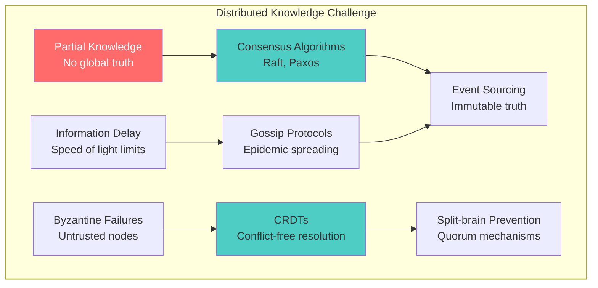
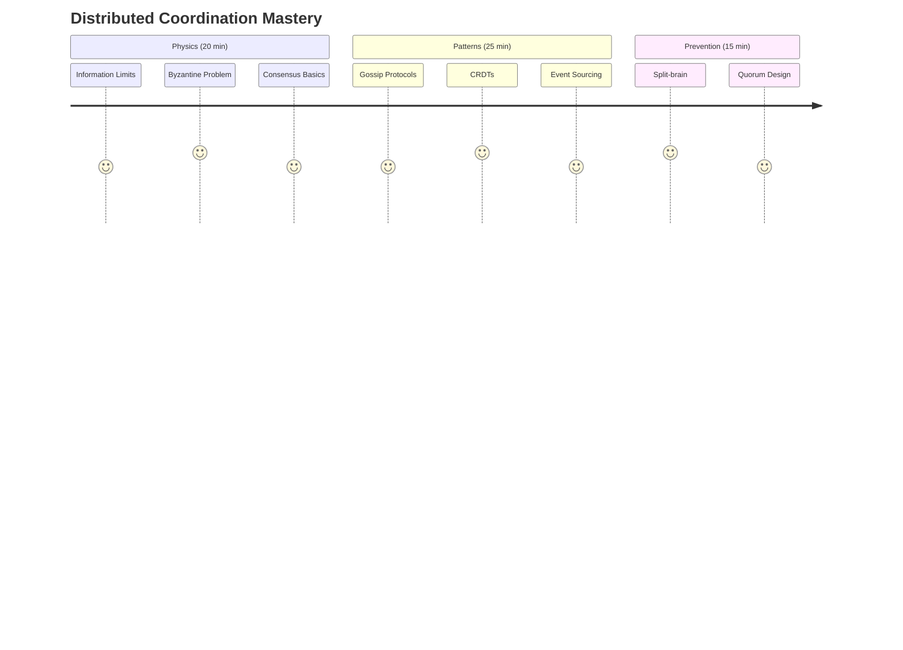
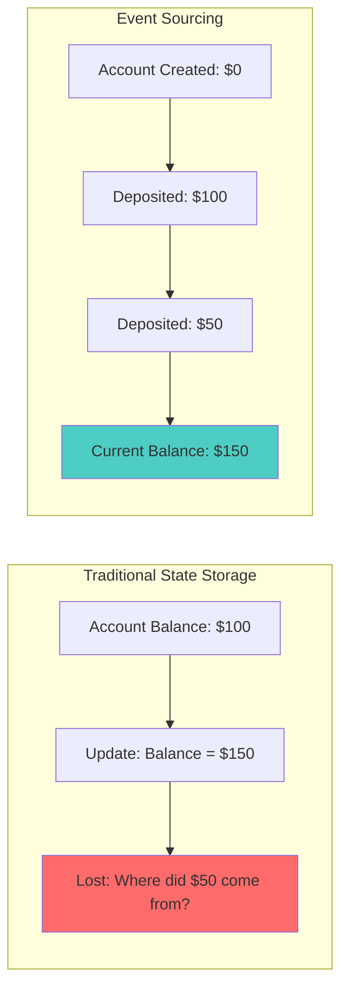

# Law 5: The Law of Distributed Knowledge

## The Complete Blueprint

In distributed systems, there is no single source of truth—only competing versions of maybe-truth. Because information travels at finite speed (limited by physics), every node operates with partial, stale knowledge while the global state continues evolving. This creates the fundamental impossibility of perfect coordination: by the time you receive information from another node, that information is already outdated. To work with this reality, we use several coordination strategies: Byzantine fault tolerance (requiring 3f+1 nodes to handle f failures), consensus algorithms like Raft (electing leaders to coordinate decisions), gossip protocols (spreading information without central coordination), CRDTs (automatic conflict resolution), event sourcing (truth through immutable history), and split-brain prevention (ensuring only one partition can make decisions). Together, these patterns let us build systems that function correctly despite never having complete, current knowledge of global state.

### Visual Coordination Landscape



### What You'll Master
- **Physics Constraints**: Why coordination has fundamental speed limits
- **Byzantine Mathematics**: The 3f+1 formula for fault tolerance
- **Consensus Patterns**: How systems reach agreement despite failures
- **CRDT Magic**: Automatic conflict resolution without coordination
- **Split-brain Detection**: Preventing multiple conflicting realities
- **Quorum Design**: Ensuring consistency during network partitions

## The Core Mental Model

**Analogy**: Distributed systems are like coordinating a dinner party among 5 friends without group chat. Each person can only call one other at a time, some don't answer, and you need everyone to agree on restaurant and time. The "underground cables" that create dependencies make this exponentially harder.

**Fundamental Principle**: Perfect distributed knowledge is mathematically impossible due to information propagation delays. By the time knowledge reaches you, reality has changed.

**Why This Matters**:
- Assuming global consistency leads to $60 billion disasters (Bitcoin split)
- Split-brain scenarios can corrupt data and violate business invariants  
- Without proper coordination, scaling makes systems less consistent, not more reliable

## The Journey Ahead



**Prerequisites**: Understanding of network partitions and distributed system failures

---

## The Fundamental Impossibility

### The Dinner Party Problem

Coordinating 5 friends for dinner without group chat reveals the core distributed systems challenge: How do you reach agreement when communication is limited, delayed, and unreliable?

### Why Perfect Knowledge is Impossible

Information travels at light speed (299,792 km/s), and during transit time, state continues changing. Your "synchronized" system is actually showing you the past, not the present.

### The Physics Reality

**New York → London**: 5,585 km ÷ 299,792 km/s = **18.6ms minimum**  
**The Problem**: During those 18.6ms, both systems continue making decisions based on stale information

**Result**: Conflicting truths that are all "correct" from their reference frames

### Neural Bridge: Your Daily Coordination Challenges

You already solve distributed coordination problems:

- **Family group chat**: Messages arrive out of order, some family members don't see updates
- **Meeting scheduling**: Everyone checks different calendars, double-bookings happen  
- **Restaurant reservations**: Website shows "available" but someone else just booked it
- **GPS navigation**: Your phone thinks you're on one road, reality differs

The same patterns that cause these frustrations plague distributed systems at scale.

### Foreshadowing: "What if someone lies?"

Our dinner party coordination gets harder when:
- Someone might give false information about their availability
- A friend might claim to have called the restaurant but didn't
- Messages get lost or corrupted in transmission

This introduces the **Byzantine Generals Problem** - coordination when actors might be malicious or faulty.

**PAUSE. Before continuing, imagine coordinating dinner when you can't trust all the information you receive. What strategies would you use?**

---

## Consolidation Prompt 1

**PAUSE. Close your eyes for 30 seconds and imagine:**

You're a node in a distributed system. You need to make a decision, but you can only communicate with some other nodes, messages take time to arrive, and you're not sure if other nodes are telling the truth. How would you decide what to do?

This feeling of uncertainty - this is the reality every distributed system lives in.

---

## Retrieval Gauntlet 1

Test your understanding before moving forward:

### Tier 1: Basic Concepts
**Question**: Why can't nodes in a distributed system have perfect knowledge of global state?

??? question "Reveal Answer"
    **Answer**: Information propagation takes time due to physical limits (speed of light), and during that time, the state continues changing. By the time information reaches a node, it's already outdated.

### Tier 2: Calculations  
**Question**: Calculate the minimum global consensus time for nodes in New York and London (5,585 km apart). Use speed of light = 299,792 km/s.

??? question "Reveal Answer"
    **Answer**: 5,585 km ÷ 299,792 km/s = 0.0186 seconds = **18.6 milliseconds minimum**
    
    This is just the physics limit - real systems need 100-500ms due to processing overhead.

### Tier 3: System Design
**Question**: Design a simple voting protocol for 5 friends to choose a restaurant. What could go wrong?

??? question "Reveal Answer"
    **Possible Protocol**: Everyone calls everyone else with their vote, majority wins.
    
    **What could go wrong**:
    - Messages get lost (network partitions)
    - Someone votes multiple times with different values
    - Timing issues cause different friends to see different majorities
    - Friends become unreachable during voting

---

## Focus Block 2: "The Byzantine Generals Problem" (20 min)

### The Ancient Military Puzzle

Imagine Byzantine generals surrounding an enemy city. They must coordinate to attack simultaneously or retreat together - anything else means defeat. But some generals might be traitors who will lie to sabotage the plan.

**This is your microservices architecture.** Each service is a general, network calls are messengers, and failures/bugs are traitors.

### The Mathematical Foundation

How many generals do you need to tolerate `f` traitors?

**Answer**: `N ≥ 3f + 1` total generals.

Here's why:

```mermaid
graph TB
    subgraph "The Worst Case Scenario"
        W1[f Byzantine generals send conflicting messages]
        W2[f honest generals might be unreachable]  
        W3[Remaining honest generals: N - 2f]
        W4[Need majority of remaining: (N-2f)/2 + 1]
        W5[Majority must exceed Byzantine count: > f]
        
        W1 --> W2 --> W3 --> W4 --> W5
    end
    
    subgraph "Mathematical Derivation"
        M1["(N - 2f)/2 + 1 > f"]
        M2["N - 2f + 2 > 2f"] 
        M3["N > 4f - 2"]
        M4["N ≥ 3f + 1"]
        
        M1 --> M2 --> M3 --> M4
    end
    
    style M4 fill:#4ecdc4
```

### Real-World Translation: Your Service Architecture

**Implementation**: Byzantine fault-tolerant service consensus with voting mechanisms that require 2f+1 matching votes for safety, handling service failures and malicious responses through quorum-based decision making.

### Professional Bridge: Configuration Management as Distributed Knowledge

Your configuration management system is solving Byzantine Generals:

- **Consul cluster**: Multiple nodes agree on configuration values
- **etcd in Kubernetes**: API servers coordinate through etcd consensus  
- **Database replicas**: Primary election with Byzantine fault tolerance
- **Load balancer health checks**: Deciding which services are "healthy"

When your config becomes inconsistent across services, you're experiencing Byzantine failure in production.

---

## Focus Block 3: "The Raft Algorithm - Democracy in Action" (20 min)

### The Leadership Solution

Instead of everyone talking to everyone (O(n²) messages), elect a leader who coordinates decisions.


### Hands-On Exercise: Build a Leader Election

Let's implement simple leader election with playing cards:

**Materials**: 5 playing cards per person, timer

**Rules**:
1. Each person is a "node" with a unique ID (card suit)
2. Round 1: Everyone votes for themselves (shows card)
3. Count votes - majority wins, becomes leader
4. If no majority, wait random time (1-5 seconds) and retry
5. Leader coordinates next decisions

**Simulate Network Partition**:
- Split group into 3 vs 2 people
- Only group of 3 can elect leader (majority)
- Group of 2 cannot make decisions

This demonstrates why Raft prevents split-brain scenarios.

---

## Focus Block 4: "CRDTs - The Magic of Automatic Resolution" (25 min)

### The Conflict-Free Philosophy

Instead of preventing conflicts, embrace them and resolve automatically.

**CRDT Properties** - like mathematical axioms:
- **Commutative**: A + B = B + A (order doesn't matter)
- **Associative**: (A + B) + C = A + (B + C) (grouping doesn't matter) 
- **Idempotent**: A + A = A (duplicates don't matter)

### Hands-On Exercise: Build a Shopping Cart CRDT

**Implementation**: Shopping Cart CRDT with per-user item tracking that automatically merges conflicts by taking maximum quantities per user, enabling conflict-free replication across mobile and web clients.

### Professional Bridge: CRDTs in Production

**Real systems using CRDTs**:
- **Redis Enterprise**: CRDT-based multi-master replication
- **Riak**: Distributed key-value store with automatic conflict resolution  
- **Figma**: Real-time collaborative editing using CRDTs
- **WhatsApp**: Message delivery confirmation using CRDTs
- **Shopping carts**: Amazon, eBay use CRDT-like patterns

When users add items on mobile and web simultaneously, CRDTs ensure nothing gets lost.

---

## Focus Block 5: "Event Sourcing - Truth Through History" (20 min)

### The Immutable Truth Approach

Instead of storing current state (which creates conflicts), store the sequence of events that created that state.



### Hands-On Exercise: Build an Event-Sourced Bank Account

**Implementation**: Event-sourced bank account with immutable event history, supporting deposits, withdrawals, balance calculation through event replay, point-in-time queries, and distributed event merging for conflict resolution.

This approach resolves conflicts by keeping all events - conflicts become part of the history rather than problems to solve.

---

## Focus Block 6: "Gossip Protocols - Information Spreading" (15 min)

### How Information Spreads Without Coordination

Like rumors in a school hallway, each node shares information with a few random neighbors. Eventually, everyone knows everything.

### Hands-On Exercise: Simulate Gossip with People

**Setup**: Group of 8+ people, each person has a piece of paper

**Rules**:
1. One person starts with "secret information" (writes it down)
2. Every 10 seconds, each person randomly picks 2 others to share with
3. Recipients copy down any new information  
4. Continue until everyone has the information
5. Count how many rounds it took

**Key Insights**:
- Information spreads exponentially: 1 → 2 → 4 → 8
- Some people learn faster than others (network topology matters)
- Redundant sharing ensures reliability (if some people are "offline")

### Gossip in Production Systems

**Netflix Eureka**: Service discovery through gossip
**Consul**: Cluster membership via gossip protocol  
**Cassandra**: Node status shared through gossip
**Bitcoin**: Transaction propagation uses gossip

---

## Consolidation Prompt 2

**PAUSE. Reflection time (2 minutes):**

You've now learned 6 different approaches to distributed coordination:

1. **Accept impossibility** (Dinner party dilemma)
2. **Byzantine fault tolerance** (3f+1 formula) 
3. **Leader election** (Raft consensus)
4. **Automatic merging** (CRDTs)
5. **Event history** (Event sourcing)
6. **Information spreading** (Gossip protocols)

Which approach would you choose for:
- A chat application?
- A banking system?  
- A gaming leaderboard?
- A collaborative document editor?

---

## Retrieval Gauntlet 2

### Tier 1: Pattern Matching
**Question**: Your e-commerce site has users adding items to cart on mobile and web simultaneously. Which coordination pattern should you use?

??? question "Reveal Answer"
    **Answer**: CRDT (specifically a shopping cart CRDT)
    
    **Why**: 
    - Users expect items to never disappear
    - Conflicts should merge automatically
    - No single point of failure needed
    - Works well with temporary network issues

### Tier 2: Calculations  
**Question**: For a 7-node Byzantine fault tolerant system, how many Byzantine nodes can you tolerate and what's the minimum agreement threshold?

??? question "Reveal Answer"
    **Answer**: 
    - Byzantine nodes tolerated: f = (7-1)/3 = 2 nodes
    - Minimum agreement threshold: 2f+1 = 5 nodes
    
    **Verification**: 7 ≥ 3(2) + 1 = 7 ✓

### Tier 3: System Design
**Question**: Design split-brain prevention for a database with 5 replicas. What quorum sizes do you need for reads and writes?

??? question "Reveal Answer"
    **Answer**: 
    - Write quorum: 3 nodes (majority of 5)
    - Read quorum: 3 nodes (to ensure reading latest write)
    - Alternative: R + W > N, so R=2, W=4 also works
    
    **Why**: In any partition, only one side can have ≥3 nodes, preventing split-brain.

---

## Focus Block 7: "The Split-Brain Disaster Scenario" (15 min)

### The $60 Billion Story: When Bitcoin Had Two Realities

**March 11, 2013** - Bitcoin existed in two parallel universes for 6 hours:

```
CHAIN A (v0.8 nodes - 60%)        CHAIN B (v0.7 nodes - 40%)
════════════════════════          ═══════════════════════════
Block 225,430 ✓                  Block 225,430 ✓
Block 225,431 ✓ (large block)    Block 225,431 ✗ (rejected)
Block 225,432 ✓                  Block 225,432' ✓ (different)
Block 225,433 ✓                  Block 225,433' ✓ (different)

$1.5 billion market cap split in two realities
```

**The Resolution**: Developers convinced the majority to abandon their chain and merge with the minority, destroying 6 hours of valid transactions to preserve network unity.

**The Lesson**: Even systems designed specifically for distributed consensus can have multiple competing truths.

### Hands-On Exercise: Design Split-Brain Prevention

**Scenario**: You have a 5-node database cluster. Design a system that prevents split-brain.

**Your Requirements**:
- Handle network partitions gracefully
- Never allow two partitions to accept writes
- Maintain availability when possible

**Challenge Questions**:
1. What's your quorum size?
2. What happens in a 2-3 partition?
3. What happens in a 1-4 partition?
4. How do you handle the rejoining of partitions?

??? question "Solution Approach"
    **Quorum-based approach**:
    - Write quorum: 3 nodes (⌊5/2⌋ + 1)
    - Read quorum: 3 nodes
    
    **Partition scenarios**:
    - 2-3 split: Only 3-node side can write
    - 1-4 split: Only 4-node side can write  
    - 1-1-3 split: Only 3-node side can write
    
    **Rejoining**: Minority partition must sync from majority before accepting writes

---

## Professional Bridges: Real-World Applications

### 1. Microservices as Byzantine Generals

Your service mesh is a distributed coordination problem:

| Service | Status | Vote |
|---------|--------|------|
| user-service | "Can we deploy version 2.3?" | Ready |
| payment-service | "I'm ready" | Ready |
| inventory-service | "I'm not ready" | Not Ready (Byzantine behavior) |
| notification-service | [timeout] | Unknown |

**Deployment Consensus Configuration**:
- Required votes: 3 (2f+1 for f=1 Byzantine service)
- Strategy: "majority_ready_or_abort"

### 2. Configuration Management as Distributed Knowledge

**Implementation**: Distributed configuration management using etcd/Consul/Zookeeper with Raft consensus for updates, supporting both fast local reads and consistent consensus reads, with proper error handling for consensus failures.

### 3. Database Replication as Event Sourcing

Your database WAL (Write-Ahead Log) is event sourcing:

```sql
-- PostgreSQL WAL entries are events
WAL Entry 1: BEGIN TRANSACTION 12345
WAL Entry 2: INSERT INTO accounts (id, balance) VALUES (1, 1000) 
WAL Entry 3: UPDATE accounts SET balance = 900 WHERE id = 1
WAL Entry 4: COMMIT TRANSACTION 12345

-- Replicas replay events to maintain consistency
-- Point-in-time recovery rebuilds state from events
```

---

## Spaced Repetition Schedule

### Day 1 (Today): Initial Learning
- [ ] Complete all Focus Blocks
- [ ] Answer Retrieval Gauntlets  
- [ ] Implement one hands-on exercise

### Day 3: First Review
**Question**: "What is the Byzantine Generals problem and why does it matter for distributed systems?"

**Expected Answer**: Byzantine Generals is about achieving consensus when some participants might be malicious or faulty. It matters because in distributed systems, nodes can fail in arbitrary ways, and we need to ensure safety despite these failures.

### Day 7: Second Review  
**Question**: "Explain eventual consistency and give a real-world example where it's acceptable."

**Expected Answer**: Eventual consistency means all nodes will converge to the same state eventually, but might be temporarily inconsistent. Example: Social media likes/comments can be eventually consistent because exact ordering doesn't matter for user experience.

### Day 14: Third Review
**Question**: "Design state reconciliation for a chat application that works offline."

**Expected Answer**: Use vector clocks to track message causality, CRDTs for automatic conflict resolution of user status, and event sourcing for message history. When reconnecting, merge events based on vector clock ordering.

### Day 30: Mastery Check
**Question**: "You're architecting a global banking system. What coordination patterns would you use and why?"

**Expected Answer**: 
- Strong consistency for account balances (Raft/Paxos)
- Event sourcing for audit trail and compliance
- Byzantine fault tolerance for inter-bank transfers
- Quorum reads/writes to prevent split-brain
- Regional consensus with global eventual consistency for non-critical data

---

## Storytelling Approach: The Three Cautionary Tales

### Tale 1: "The Bitcoin Fork Saga"
*How the world's most secure distributed system split reality*

March 11, 2013. Bitcoin's $1.5 billion market cap existed in two parallel universes. The story teaches us that even systems designed specifically for consensus can fail when assumptions change.

**Moral**: Test your consensus mechanisms against software upgrades and version incompatibilities.

### Tale 2: "The Split-Brain Database Disaster"  
*When two data centers both thought they were primary*

A telecom company's network partition caused both East and West Coast data centers to become "primary." For 3 hours, customers could create accounts in both locations with the same username. The cleanup took 6 months.

**Moral**: Design explicit split-brain prevention with proper quorum mechanisms.

### Tale 3: "The Gossip Protocol Success Story"
*How Netflix rebuilt their service discovery*

Netflix's Eureka uses gossip protocols to handle service discovery for 100,000+ service instances. When traditional approaches failed at scale, gossip protocols provided the resilience they needed.

**Moral**: Sometimes embracing uncertainty and redundancy works better than fighting for perfect coordination.

---

## Hands-On Exercises: Building Intuition

### Exercise 1: Consensus with Playing Cards (20 minutes)

**Materials**: Playing cards, timer, 5+ people

**Scenario**: Distributed leaders election

1. Everyone draws a card (your "node ID") 
2. Goal: Everyone must agree on who has the highest card
3. **Constraint**: You can only show your card to 2 people at a time
4. **Challenge**: Some people might lie about others' cards

**Learning**: Experience the difficulty of reaching consensus with partial information and possible Byzantine behavior.

### Exercise 2: Shopping Cart CRDT (30 minutes)

**Materials**: Paper, pens

**Scenario**: Two people use the same shopping cart simultaneously

1. Person A and B each have a shopping list
2. They add/remove items independently for 5 minutes
3. Then merge their lists using CRDT rules:
   - For quantities: take maximum
   - For deletions: deletion wins over addition
4. Result should be deterministic regardless of merge order

**Learning**: Experience automatic conflict resolution without coordination.

### Exercise 3: Event Sourcing Bank (45 minutes)

**Materials**: Computer, preferred programming language

**Scenario**: Build a bank account that never loses transaction history

**Implementation**: Event-sourced bank account with features including money transfers between accounts, balance calculation at any point in time, handling concurrent transactions, and conflict resolution for simultaneous transfers.

**Learning**: Understand how immutable history solves many distributed coordination problems.

---

## Bottom Line: Practical Wisdom

**Accept that perfect consensus is impossible.** The systems that survive are those that embrace uncertainty rather than trying to eliminate it.

### Your Distributed Coordination Playbook

**For Strong Consistency Needs** (Banking, Inventory):
- Use Raft/Paxos consensus algorithms
- Implement proper quorum mechanisms  
- Design explicit split-brain prevention
- Monitor consensus latency and success rates

**For High Availability Needs** (Social Media, Content):
- Embrace eventual consistency with CRDTs
- Use gossip protocols for information spreading
- Implement conflict resolution strategies
- Design for partition tolerance

**For Audit/Compliance Needs** (Financial, Healthcare):
- Event sourcing for immutable audit trails
- Strong consistency for critical decisions
- Byzantine fault tolerance for external interactions
- Comprehensive monitoring and alerting

### Implementation Checklist

- [ ] **Consistency Model Chosen**: Strong, eventual, or causal based on business needs
- [ ] **Consensus Mechanism**: Raft, Paxos, or Byzantine fault tolerant algorithm  
- [ ] **Split-Brain Prevention**: Quorum-based reads/writes implemented
- [ ] **Conflict Resolution**: CRDTs, last-writer-wins, or manual resolution strategy
- [ ] **Monitoring Dashboard**: Consensus latency, replication lag, conflict rates
- [ ] **Partition Testing**: Regular chaos engineering tests of network partitions
- [ ] **Byzantine Node Detection**: Monitoring for nodes returning inconsistent data

### Emergency Response: Split-Brain Detection

```bash
# Quick diagnosis commands
kubectl get nodes  # Check node count and status
curl /health/consensus  # Check if multiple leaders exist  
grep "split.brain" /var/log/database.log  # Search for split-brain indicators
SELECT COUNT(*) FROM cluster_status WHERE role='primary';  # Should be 1
```

**If split-brain detected**:
1. Immediately stop writes to minority partition
2. Identify canonical partition (usually largest)
3. Resync minority from majority  
4. Gradually restore full operations
5. Post-incident review of quorum settings

---

## Knowledge Integration: How This Law Connects

The Law of Distributed Knowledge doesn't exist in isolation - it amplifies other system challenges:

### With Law of Correlated Failure
Stale knowledge causes correlated failures when all nodes act on the same outdated information.

### With Law of Asynchronous Reality  
Asynchronous systems amplify knowledge distribution problems by making timing even less predictable.

### With Law of Emergent Chaos
Knowledge conflicts create feedback loops that can trigger system-wide emergent behaviors.

The key insight: **Distributed knowledge problems cascade through all other system properties.**

---

## Related Patterns and Further Reading

**Patterns that address this law**:
- [Raft Consensus](../../pattern-library/coordination/consensus.md) - Leader-based consensus
- [Vector Clocks](../../pattern-library/coordination/vector-clocks.md) - Causal ordering without global time
- [Event Sourcing](../../pattern-library/data-management/event-sourcing.md) - Truth through immutable history
- [CQRS](../../pattern-library/data-management/cqrs.md) - Separating reads and writes for consistency
- [Gossip Protocols](../../pattern-library/coordination/gossip.md) - Information spreading without coordination

**Deep dive resources**:
- [CAP Theorem Analysis](../cap-theorem.md) - The fundamental trade-offs
- [Byzantine Fault Tolerance](../byzantine-fault-tolerance.md) - Handling malicious failures
- [Consistency Models](../consistency-models.md) - Spectrum from strong to eventual

**Related Laws**:
- [Law 1: Correlated Failure](correlated-failure.md) - How knowledge problems cause cascading failures
- [Law 2: Asynchronous Reality](asynchronous-reality.md) - Time uncertainty creates knowledge uncertainty
- [Law 3: Emergent Chaos](emergent-chaos.md) - How coordination failures trigger emergence
- [Law 4: Multidimensional Optimization](multidimensional-optimization.md) - Consistency vs availability trade-offs

    **Key Formulas:**
    
    - **Minimum consensus time**: `T_min = d/c` where d = distance, c = speed of light
    - **Byzantine tolerance**: Need `3f + 1` nodes to tolerate `f` failures
    - **Quorum size**: `Q = ⌊N/2⌋ + 1` for N nodes
    - **FLP bound**: No consensus in async networks with ≥1 failure
    
    **Pattern Quick Picks:**
    
    - **Strong consistency**: Raft, Multi-Paxos
    - **Eventual consistency**: CRDTs, Vector clocks  
    - **Causal consistency**: Logical timestamps
    - **Byzantine fault tolerance**: PBFT, Tendermint
    
    **Monitoring Metrics:**
    
    - Split-brain detection: `active_leaders > 1`
    - Replication lag: `max(replica_delay)`
    - Conflict rate: `conflicts/sec`
    - Consensus latency: `P99(consensus_time)`

---

<div class="axiom-box" style="background: #1a1a1a; border: 3px solid #ff5555;">
<h2>Core Axiom: Your Database Doesn't Know What Your Database Knows</h2>
<p>Right now, at this very moment, your "strongly consistent" database has nodes that disagree about the current state. Your blockchain has competing chains. Your distributed cache has stale data that clients think is fresh. <strong>In distributed systems, there is no single source of truth—only competing versions of maybe-truth.</strong></p>
</div>