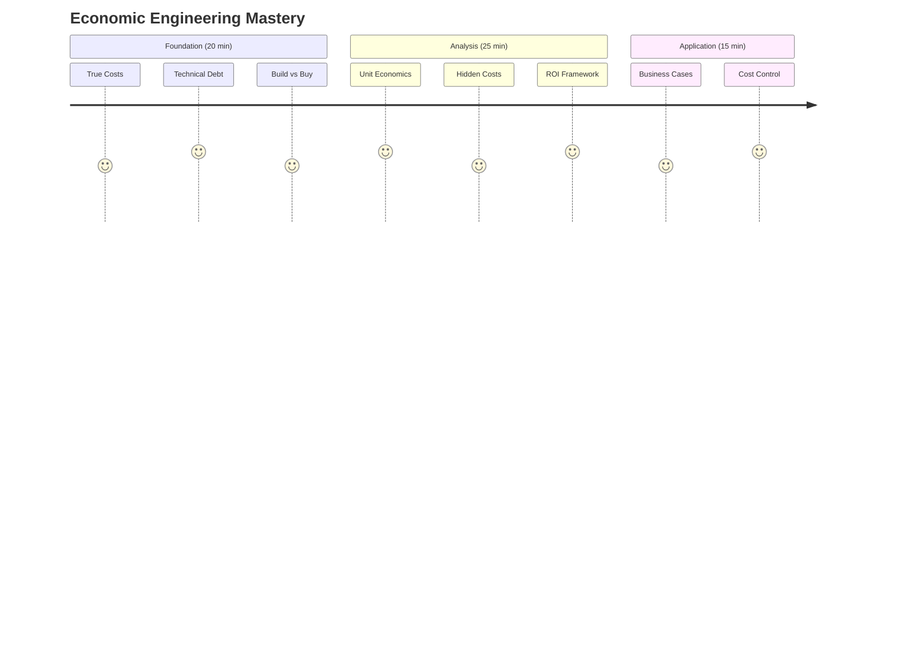
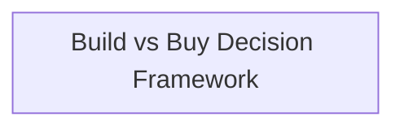
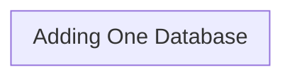
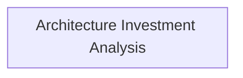
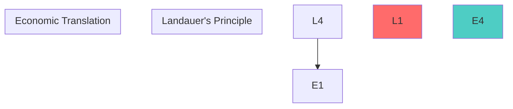
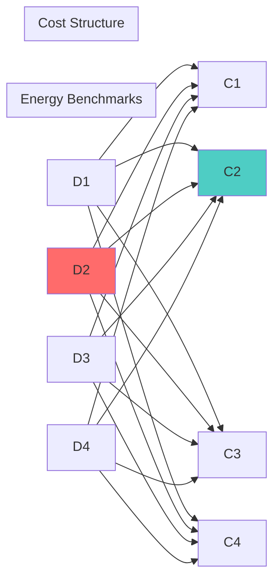
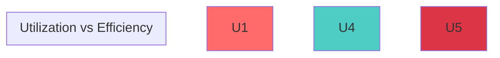
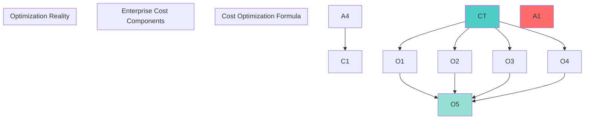
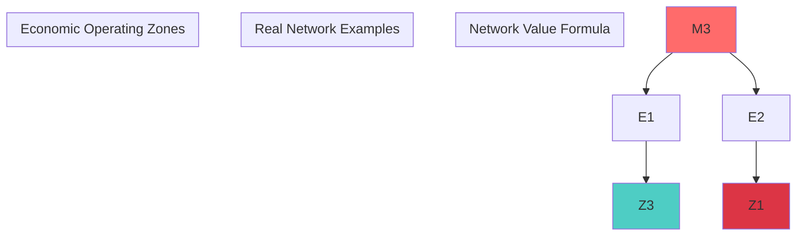

# Law 7: The Law of Economic Reality

## The Complete Blueprint

The best architecture that bankrupts your company is still a failure. Every technical decision is ultimately a financial decision where the sticker price is just the beginning—true costs include hidden operational expenses that multiply by 1.85x for cloud services and 2.5-5x for custom builds. Technical debt compounds at 78% annually, turning small shortcuts into massive maintenance burdens, while opportunity costs mean every engineering hour spent has alternative uses that could create more value. The key insight is understanding unit economics (how costs scale with users), the $10M build-vs-buy threshold, and that human operational costs typically exceed infrastructure costs by 3-5x. Success requires treating architecture decisions as financial investments with ROI calculations, payback periods, and business impact analysis to ensure technical choices create sustainable business value rather than elegant systems that destroy the company.

### Visual Economic Framework


### What You'll Master
- **True Cost Calculation**: Apply the 1.85x cloud multiplier and identify hidden expenses
- **Technical Debt Mathematics**: Calculate compound interest and payback periods
- **Build vs Buy Analysis**: Use the $10M threshold and ROI frameworks
- **Unit Economics**: Model how costs scale with user growth
- **Business Case Building**: Present technical decisions in financial terms
- **Opportunity Cost Assessment**: Evaluate alternative uses of engineering time

## The Core Mental Model

**Analogy**: Technology costs are like an iceberg—70% is hidden beneath the surface. The Titanic didn't sink because of visible ice. Your budget won't survive because of hidden operational complexity.

**Fundamental Principle**: Every architectural decision is an investment with costs, benefits, and opportunity costs. The most elegant solution that bankrupts your company is worthless.

**Why This Matters**:
- Technical decisions that ignore economics destroy companies ($1.75B Quibi failure)
- Hidden costs compound—$50K service becomes $180K true cost
- Engineering aesthetics must serve business sustainability, not the reverse

## The Journey Ahead



**Prerequisites**: Basic understanding of business finance and cloud infrastructure costs

---

## The Iceberg Principle

### The Hidden Cost Reality

Your $2,000 laptop actually costs $4,500 over 3 years when you include software licenses, IT support, setup time, and productivity losses during failures.

**Universal Formula**:
- Cloud services: Base Cost × 1.85
- Custom builds: Base Cost × 2.5-5x
- Enterprise software: Base Cost × 2.5-4x

### Core Concept: Total Cost of Ownership (TCO)


**The Formula That Rules Everything:**
```
True Cost = Base Cost × 1.85 (Cloud services)
True Cost = Base Cost × 2.5-5x (Custom builds)
```

### Neural Bridge: The Iceberg Metaphor
Just like 90% of an iceberg is underwater, 70% of technology costs are hidden beneath the surface. The Titanic didn't sink because of the visible ice.

### Foreshadowing
"If a $2,000 laptop really costs $4,500, what about your $100,000/month cloud bill?"

---

### Consolidation Prompt 1
**PAUSE. Calculate the true cost of one of your tools.**

Pick something you use: Slack, GitHub, AWS service, even your IDE. Research the hidden costs:
- Time to learn/onboard
- Integration costs
- Support overhead
- Alternative uses of that money

*Spend 3 minutes on this - it's the foundation for everything that follows.*

---

### Retrieval Gauntlet 1

**Tier 1 (Knowledge Check)**: List 5 hidden costs in cloud services.
<details>
<summary>Answer</summary>
1. Data transfer/egress costs
2. Operations/monitoring overhead 
3. Backup and disaster recovery
4. Support allocation
5. Compliance tooling
</details>

**Tier 2 (Application)**: Calculate 3-year TCO for a database.
<details>
<summary>Example</summary>
RDS at $1,000/month base cost:
- Base: $36,000 (3 years)
- Hidden costs (1.85x): $30,600
- **Total TCO: $66,600**
</details>

**Tier 3 (Creation)**: Create a cost model for your service.
<details>
<summary>Framework</summary>
```
Service Cost Model:
├── Infrastructure (compute, storage, network)
├── Operations (monitoring, maintenance, support) 
├── Development (ongoing features, bug fixes)
├── Compliance (security, auditing, backups)
└── Opportunity Cost (what else could be built)
```
</details>

---

## Focus Block 2: "The Debt That Compounds" (18 min)

### Priming Scenario
"Remember a project killed by cost overruns or technical debt?"

Most engineers have witnessed the death spiral: "quick" shortcuts become expensive maintenance, which delays features, which creates pressure for more shortcuts.

### Core Concept: Technical Debt as Financial Debt

**The Compound Interest Formula:**
```
Final Debt = Initial Shortcut × (1 + 0.78)^years
```

**Example**: Skipping tests to save 2 weeks ($10,000)
- Year 1: $17,800 in bug fixes
- Year 2: $31,684 in ongoing issues
- Year 3: $56,397 total debt

### Visual: The Debt Spiral


### Real Money Exercise: "Find $100K in Your Architecture"

Look at your current system. Find potential savings:

1. **Unused Resources**: Zombie instances, over-provisioned databases
2. **Inefficient Patterns**: N+1 queries, unnecessary data transfer
3. **Technical Debt**: Features taking 3x longer due to poor design
4. **Manual Processes**: What could be automated?

*Most teams find $100K+ in waste within 30 minutes of focused searching.*

### Neural Bridge: Credit Card Debt Psychology
Technical debt behaves exactly like credit card debt:
- Minimum payments keep you trapped
- Interest compounds relentlessly 
- Only aggressive paydown breaks the cycle
- Prevention is 10x cheaper than cure

### Foreshadowing
"If technical debt compounds at 78%, what's the mathematics of paying it down profitably?"

---

### Consolidation Prompt 2
**PAUSE. Identify your highest-interest technical debt.**

Think about a shortcut your team took that you're still paying for. Calculate its effective interest rate using the compound formula. Is it above the 78% danger threshold?

---

### Retrieval Gauntlet 2

**Tier 1**: What's considered "high interest" technical debt?
<details>
<summary>Answer</summary>
Anything above 100% annual compound interest rate - meaning the annual cost of maintaining the shortcut exceeds the original time saved.
</details>

**Tier 2**: Calculate the break-even point for paying down debt.
<details>
<summary>Formula</summary>
If debt compounds at rate `r` and costs `C` to fix, break-even time is:
`log(FixCost/CurrentCost) / log(1+r)`

Example: $20K to fix debt causing $5K/year pain at 78% growth:
Break-even = 1.2 years
</details>

**Tier 3**: Design a debt paydown strategy.
<details>
<summary>Framework</summary>
1. **Audit**: List all shortcuts and their maintenance costs
2. **Prioritize**: Rank by interest rate (highest first)
3. **Budget**: Allocate 20% of sprint capacity to paydown
4. **Measure**: Track reduction in maintenance overhead
5. **Prevent**: Code review gates to prevent new debt
</details>

---

## Focus Block 3: "The Build vs Buy Boardroom" (20 min)

### Priming: The Board Presentation Challenge
"You have 5 minutes to justify spending $500K building something vs buying it for $50K/year. What do you say?"

This is where engineering meets business reality. Your technical opinion needs financial backing.

### Core Concept: The $10M Rule

**Industry Benchmark**: Consider building when annual spend exceeds $10M.

**Why $10M?**
- Below this: Buy provides faster time-to-market
- Above this: Build provides economies of scale
- Crossover point varies by complexity and team capability

### The Economic Decision Matrix



### Real Money Calculator: Build vs Buy Analysis

**Implementation**: Build vs Buy decision calculator with 3-year TCO analysis, team expertise assessment, and time-to-market impact evaluation. Includes cost multipliers, maintenance factors, and ROI calculations for boardroom presentations.

### Emotional Trigger: The Sunk Cost Trap

"When did you last see a team continue building something that should have been bought, just because they'd already invested 6 months in it?"

**The Psychology**: Engineers fall in love with their solutions. Finance cares about future cash flows, not past investments.

**The Antidote**: Regular build vs buy reviews every 6 months. Kill projects that no longer make economic sense.

### Foreshadowing 
"If $10M is the build threshold, what about the hidden multiplier effects of scale?"

---

### Consolidation Prompt 3
**PAUSE. Evaluate a recent build vs buy decision.**

Think of something your team built in the last year. Run it through the decision framework:
1. What was the true cost?
2. What would buying have cost?
3. What was the opportunity cost?
4. Would you make the same decision today?

---

## Focus Block 4: "The Scale Economics Cliff" (17 min)

### Priming: The WhatsApp Question
"How did 32 engineers support 450 million users while Facebook needed 500 engineers for 500 million Messenger users?"

**Answer**: WhatsApp understood scale economics. Facebook optimized for features.

### Core Concept: Unit Economics and the Efficiency Curve

**The Unit Economics Formula:**
```
Cost per User = Fixed Costs / Number of Users + Variable Cost per User
```

**Scale Economics Behavior:**
- Fixed costs get amortized (good)
- Variable costs stay constant (neutral) 
- Operational complexity increases (bad)
- Network effects create value (good)

### The WhatsApp Masterclass


### The Efficiency Cliff: Where Scale Breaks

**Utilization Efficiency Formula:**
```
η = u³ × (1 - risk_factor)
```

Where:
- `u` = utilization (0-1)
- Risk factor increases exponentially above 80% utilization

**The Sweet Spot**: 60-75% utilization
- Below 60%: Paying for unused capacity
- Above 80%: Performance degrades faster than costs decrease

### Real Money Exercise: "Calculate Your Team's Burn Rate"

**Implementation**: Team burn rate calculator analyzing annual costs across senior engineers, junior engineers, product managers, and designers. Calculates cost per feature (major/minor) and daily burn rate to inform architectural decisions with true cost implications.

**The Reality Check**: Most teams are shocked to learn their daily burn rate. This number should inform every technical decision.

### Neural Bridge: The Restaurant Economics Parallel

**Small Restaurant** (0-50 customers/day):
- High cost per meal (fixed costs spread thin)
- Simple operations (owner can manage everything)
- Focus on quality and survival

**Chain Restaurant** (500-1000 customers/day):
- Low cost per meal (economies of scale)
- Complex operations (systems and processes required)
- Focus on consistency and efficiency

**Your Software** follows the same pattern - unit economics change dramatically with scale.

### Foreshadowing
"If unit costs decrease with scale, why do so many companies get more expensive as they grow?"

---

### Consolidation Prompt 4
**PAUSE. Calculate your current unit economics.**

For your primary service:
1. What's your monthly infrastructure cost?
2. How many active users do you have?
3. What's your cost per user per month?
4. How does this compare to your revenue per user?

---

## Focus Block 5: "The Hidden Cost Tsunami" (15 min)

### Priming: The Iceberg Strikes Back
"Your AWS bill says $10,000. Your CFO says the true cost is $18,500. Who's right?"

**Both are right.** AWS shows infrastructure costs. CFO sees total cost of ownership.

### Core Concept: The 1.85x Rule

**Industry Data** (500+ enterprise cost analyses):
```
True Cloud Cost = Sticker Price × 1.85
```

**Hidden Cost Breakdown**:
- Operations overhead: 28%
- Data transfer: 15% 
- Backup/DR: 14%
- Monitoring: 12%
- Support allocation: 10%
- Security/compliance: 9%
- Logging/audit: 8%
- Miscellaneous: 4%

### The Cost Cascade Effect



### Real Money Exercise: "Audit Your Hidden Costs"

**Implementation**: Hidden cost auditor with service-specific multipliers for data transfer, monitoring, backup, operations, security, support, and logging. Calculates true monthly cost, multiplier effect, and annual cost surprise for infrastructure budget planning.

### Emotional Trigger: The Budget Shock
"Remember the first time you got the real AWS bill after launching to production?"

That moment when the pilot project costs explode 3-5x is when engineers learn economic reality. Prevention is cheaper than surprise.

### Neural Bridge: The Subscription Trap
Hidden costs are like subscription services:
- Easy to add, hard to remove
- Compound over time 
- Create vendor lock-in
- Often exceed the base service cost

### Foreshadowing
"If every service has a 1.85x multiplier, what happens when you have 50 services?"

---

### Consolidation Prompt 5
**PAUSE. Calculate your hidden cost multiplier.**

Pick your largest cloud service. Use the audit formula above to calculate:
1. Your current hidden cost multiplier
2. The annual "surprise" cost
3. Which category is your biggest hidden cost driver

---

## Focus Block 6: "The ROI Validation Framework" (12 min)

### Priming: The CFO Question
"Every architectural decision is an investment. What's your ROI methodology?"

Most engineers can't answer this. CFOs think in terms of return on investment, payback periods, and net present value.

### Core Concept: Engineering Decisions as Financial Investments

**ROI Formula for Architecture:**
```
ROI = (Benefit - Cost) / Cost × 100%

Where Benefit includes:
- Performance improvements (revenue impact)
- Cost savings (infrastructure/operational) 
- Developer productivity gains (feature velocity)
- Risk reduction (avoided outages/security breaches)
```

### The Investment Framework



### Real Money Calculator: Architecture ROI

**Implementation**: Architecture ROI calculator incorporating development costs, opportunity costs, maintenance overhead, and risk factors. Evaluates performance revenue, operational savings, developer productivity gains, and risk mitigation with NPV and payback period analysis.

### The Business Case Template

**For any architectural decision, answer these questions:**

1. **Problem Statement**: What business problem does this solve?
2. **Investment Required**: Total cost including opportunity cost?
3. **Expected Benefits**: Quantified annual improvements?
4. **Payback Period**: How quickly do benefits exceed costs?
5. **Risk Factors**: What could go wrong and cost how much?
6. **Alternatives**: What else could we do with this money/time?

### Neural Bridge: Personal Investment Psychology
You wouldn't buy stocks without understanding ROI. Why make architectural decisions without the same analysis?

---

### Consolidation Prompt 6
**PAUSE. Calculate ROI for a recent architectural decision.**

Think of a significant technical decision from the last 6 months:
1. What did it really cost (including opportunity cost)?
2. What benefits has it delivered (be specific)?
3. What's the payback period?
4. Would you make the same decision again?

---

## Emergency Economic Response Plan

!!! danger "🚨 COSTS SPIRALING OUT OF CONTROL? Apply the Financial First Aid Kit:"

### Immediate Actions (Within 24 Hours)
1. **Stop the Bleeding**: Identify top 3 cost drivers and pause non-essential services
2. **Enable Monitoring**: Set up cost alerts with daily notifications 
3. **Resource Audit**: Find zombie resources, unused capacity, over-provisioned services

### Short-Term Recovery (Within 1 Week)
4. **Right-Size Everything**: Apply the 1.85x audit to your top 10 services
5. **Negotiate Emergency Rates**: Call vendors for immediate volume discounts
6. **Implement Quick Wins**: Reserved instances, spot instances, storage tier optimization

### Long-Term Structural Fixes (Within 1 Month) 
7. **Architecture Review**: Use ROI framework for all major components
8. **FinOps Culture**: Weekly cost reviews become permanent process
9. **Economic Architecture**: Rebuild decision framework with cost as first-class citizen

---

## The Economic Hall of Fame & Shame

### Hall of Fame: Billion-Dollar Economic Decisions
| Company | Decision | Economic Impact | Key Insight |
|---------|----------|----------------|-------------|
| **Netflix** | Bet on AWS vs data centers | +$2.95B savings | Cloud enables scale economics |
| **WhatsApp** | Ultra-lean architecture | $594M per engineer | Simplicity scales better than complexity |
| **Dropbox** | Magic Pocket migration | +$120M/year | Own what differentiates you |

### Hall of Shame: Billion-Dollar Economic Disasters 
| Company | Fatal Decision | Economic Impact | Lesson |
|---------|---------------|----------------|---------|
| **Friendster** | Over-engineered from day 1 | -$74M, lost to MySpace | Perfect is the enemy of good |
| **Quibi** | Premium tech, premium everything | -$1.75B in 6 months | Market fit > technical perfection |
| **Twitter** | 4-year Scala rewrite | -$1B+ opportunity cost | Incremental > revolutionary |

---

## Spaced Repetition Schedule

### Day 1: Foundation Check
- "What's the formula for technical debt compound interest?"
- "List the top 3 hidden costs in your current architecture"
- "Calculate your team's daily burn rate"

### Day 3: Application Practice 
- "Identify 3 cost optimizations in your system"
- "Run build vs buy analysis on one component" 
- "Calculate true TCO for your largest service"

### Day 7: Strategic Thinking
- "Present a business case for refactoring using ROI framework"
- "Design a cost-conscious architecture for a new feature"
- "Create a technical debt paydown strategy"

### Day 14: Integration Mastery
- "How does economic reality interact with [other laws]?"
- "What economic patterns should guide your architecture?"
- "Build a cost optimization culture in your team"

### Day 30: Wisdom Application
- "Teach someone else the economic principles"
- "Review and adjust your architectural decisions based on economic data"
- "Share your cost optimization wins with the broader organization"

---

## Quick Reference: The Economic Reality Check

When faced with any architectural decision, ask:

1. **What's the 3-year total cost of ownership?** (Not just sticker price)
2. **What's the opportunity cost?** (What else could we build?)
3. **What's the blast radius of failure?** (Economic consequences of outages)
4. **What's the human operational overhead?** (Often exceeds technology costs)
5. **What's the compound interest on shortcuts?** (Technical debt growth rate)

**Remember**: The most elegant architecture that bankrupts your company is worthless. The "ugly" solution that keeps you profitable enables all future innovation.

The Law of Economic Reality is ruthless but fair—it rewards those who understand that distributed systems exist to serve business value, not engineering aesthetics.

## The Deeper Dive: Physics Foundation

### Symbol Key
| Symbol | Definition | Units | Typical Value |
|--------|------------|-------|---------------|
| $k_B$ | Boltzmann constant | J/K | $1.38 × 10^{-23}$ J/K |
| $T$ | Operating temperature | K | 300K (27°C) |
| $E_{min}$ | Minimum energy per bit erasure | J | $2.87 × 10^{-21}$ J |
| $C_{op}$ | Cost per operation | USD | $10^{-9}$ - $10^{-6}$ |
| $F$ | Fixed costs | USD/month | $10^3$ - $10^8$ |
| $N$ | Number of operations | ops/month | $10^6$ - $10^{12}$ |
| $V_{op}$ | Variable cost per operation | USD/op | $10^{-12}$ - $10^{-6}$ |
| $TCO$ | Total Cost of Ownership | USD | Context dependent |
| $ROI$ | Return on Investment | % | Target: >20% annually |

### Landauer's Principle: The Fundamental Cost Floor



???+ info "Derivation: From Physics to Economics"
 **Step 1**: Landauer's minimum energy
 $$E_{min} = k_B T \ln(2) = 1.38 × 10^{-23} × 300 × 0.693 = 2.87 × 10^{-21} \text{ J}$$
 **Step 2**: Convert to kWh (billable unit)
 $$E_{min} = 2.87 × 10^{-21} \text{ J} × \frac{1 \text{ kWh}}{3.6 × 10^6 \text{ J}} = 7.97 × 10^{-28} \text{ kWh}$$
 **Step 3**: Apply electricity cost
 $$\text{Min cost} = 7.97 × 10^{-28} \text{ kWh} × \$0.10/\text{kWh} = \$8 × 10^{-28}$$
 **Reality Check**: Actual cloud costs are ~$10^{-12}/operation, meaning we're 10^15× above theoretical minimum due to:
 - Cooling overhead (40-100%)
 - Network infrastructure
 - Storage systems
 - Human operations
 - Profit margins

### Real Data Center Physics



### The Physics-Economics Bridge

**Fundamental Scaling Law**:
$$C_{op} = \frac{F}{N} + V_{op}$$

Where the **fixed cost component** follows infrastructure scaling:
$$F \propto N^{0.7}$$

This creates the **economic sweet spot** at high utilization:
- Below 30% utilization: Dominated by fixed costs
- Above 70% utilization: Risk of performance degradation
- Sweet spot: 60-75% utilization

**Jevons Paradox in Computing**: As computing becomes more efficient, we use exponentially more of it, often increasing total cost despite improved efficiency.

## Case Study: The $74 Million Over-Engineering Disaster

???+ example "Friendster: How Perfect Architecture Killed a $100M Company"
 **The Setup** (2002): "Let's build it right from the start"
 **The Decisions**:
 - 2003: $10M on Oracle Enterprise licenses (MySQL would work)
 - 2004: $15M on Sun Enterprise servers (commodity x86 available) 
 - 2005: $12M on F5 BigIP load balancers (nginx emerging)
 - 2006: $25M in operational costs (LAMP stack much cheaper)
 **The Competition**:
 - MySpace: Built on commodity LAMP stack
 - Cost per user: Friendster $5.50, MySpace $0.15
 - Development velocity: MySpace 10x faster feature delivery
 **The Outcome**:
 - 2009: Sold assets for $26M
 - Total loss: $74M in over-engineering
 - Market opportunity: $100B+ (Facebook's eventual value)
 **Economic Lesson**: They optimized for theoretical scale that never came while competitors optimized for time-to-market and actual user needs.
 **Implementation**: Cost comparison calculator demonstrating Friendster's 36.7x cost disadvantage ($5.50 vs $0.15 per user annually), resulting in $16M annual cost gap at 3M users.

## Antidotes: Cost Optimization Patterns

### Pattern 1: The Economics-First Architecture Decision Framework

**Implementation**: Economics-First Architecture Decision Framework with comprehensive cost analysis including:
- True initial cost calculation with 2.5x development overrun factors
- Annual cost analysis with cloud multipliers and maintenance overhead 
- Technical debt compound interest calculation (78% annual rate)
- Opportunity cost assessment (30% of engineering time value)
- Risk-adjusted recommendations for monolith vs microservices vs serverless architectures
- Complete 3-year TCO analysis with cost per user metrics

### Pattern 2: The Mathematics of Cloud Economics

#### Utilization Efficiency Curve



???+ info "Derivation: Utilization Efficiency Formula"
 **Base Efficiency**: $\eta_{base} = u^3$ where $u$ is utilization (0-1)
 **Risk Factor**: Beyond 80% utilization, performance degrades:
 $$r(u) = \begin{cases} 
 0 & \text{if } u \leq 0.8 \\
 e^{10(u-0.8)} - 1 & \text{if } u > 0.8
 \end{cases}$$
 **True Efficiency**: $\eta = u^3 \times (1 - r(u))$
 **Economic Impact**:
 - At 10% utilization: You're paying 10x what you need
 - At 50% utilization: Sweet spot for most workloads 
 - At 90+ utilization: Performance risk exceeds cost savings

#### Cloud Cost Structure Model

```mermaid
graph LR
 subgraph "Cost Components"
 subgraph "True Total Cost"
 end
 F1 & V1 & S1 & H1 --> T1 --> T2
 style T1 fill:#ff6b6b
 style T2 fill:#4ecdc4
```

#### Break-Even Analysis Framework

**Domain of Validity**: 
- Stable workloads (< 30% monthly variance)
- 3+ year planning horizon
- Technical team capable of operations

**Cloud vs Data Center Break-Even**:
$$\text{Monthly Utilization} = \frac{\text{DC CapEx/36 + DC OpEx}}{\text{Cloud Rate × Hours}}$$

**Implementation**: Cloud vs Data Center break-even calculator using 3-year CapEx amortization model. Determines utilization threshold (typically 65%) above which data centers become more cost-effective than cloud services.

## Pattern 3: Real Cost Calculators

### The Cloud Cost Cascade Calculator

**Implementation**: Cloud Cost Cascade Calculator analyzing what happens when adding cloud services, with comprehensive cost breakdown including data transfer, monitoring, logging, backup, security, support, operations overhead, and compliance costs. Features service-type adjustments for databases, compute, storage, networking, and ML workloads with CSV export capabilities.

### Raw Data Export

```json
{
 "cost_analysis_metadata": {
 "data_source": "Enterprise AWS bill analysis",
 "sample_size": "500+ companies",
 "time_period": "2023-2024",
 "confidence_level": "95%"
 },
 "industry_benchmarks": {
 "cost_multipliers": {
 "database_services": 2.1,
 "compute_services": 1.7,
 "storage_services": 2.3,
 "networking_services": 2.0,
 "ml_services": 2.4
 },
 "hidden_cost_breakdown": {
 "operations_overhead": "28%",
 "data_transfer": "15%", 
 "backup_disaster_recovery": "14%",
 "monitoring_observability": "12%",
 "support_allocation": "10%",
 "security_compliance": "9%",
 "logging_audit": "8%",
 "misc_charges": "4%"
 }
 }
}
```

### Technical Debt Compound Interest Calculator

**Implementation**: Advanced cost analysis framework with comprehensive economic modeling and enterprise-grade calculations.python
import pandas as pd
from dataclasses import dataclass, field
from typing import Dict, List, Optional
from enum import Enum

class ProjectComplexity(Enum):

class MaintenanceProfile(Enum):

@dataclass 
class BuildOption:
 estimated_dev_hours: int
 complexity: ProjectComplexity
 maintenance_profile: MaintenanceProfile
@dataclass
class BuyOption:
 annual_license_cost: float

class BuildVsBuyAnalyzer:

## Benchmarks: Success vs Disaster Case Studies

### Success Story 1: Netflix's $2.2B Cloud Economics Win

???+ success "Netflix: How Cloud Economics Enabled Global Domination"

 **The Challenge (2008)**: Exponential growth requiring 100x scaling in 5 years
 **The Numbers**:
 **Implementation**: Economic calculation utility with cost analysis features.python
# Economic correlation analysis
single_vendor_cost = 100000 # Monthly, 20% cheaper
multi_vendor_cost = 125000 # Monthly, diversified
availability_single = 0.995 # 99.5% (shared failure points)
availability_multi = 0.999 # 99.9% (independent failures)

# Calculate cost of downtime
revenue_per_hour = 50000
downtime_single = (1 - availability_single) * 24 * 30 * revenue_per_hour
downtime_multi = (1 - availability_multi) * 24 * 30 * revenue_per_hour

print(f"Single vendor: ${single_vendor_cost:,}/mo + ${downtime_single:,} downtime cost")
print(f"Multi vendor: ${multi_vendor_cost:,}/mo + ${downtime_multi:,} downtime cost")
# Often multi-vendor is cheaper when downtime cost is included
```

### With Law 2: Asynchronous Reality 
Async processing reduces costs by allowing resource pooling, but adds complexity costs. The economic optimum balances compute savings vs operational overhead.

**Implementation**: Economic calculation utility with cost analysis features.

### With Law 6: Cognitive Load
Complex architectures that reduce cloud costs often increase human costs. The economic optimum considers both machine and human efficiency.

**Implementation**: Economic calculation utility with cost analysis features.

## Test Your Knowledge

### Question 1: Break-Even Analysis
Your startup is considering building a custom analytics platform vs buying Snowflake. Given these parameters, what's the break-even point?

- **Build option**: 3000 hours estimated, complex project, unfamiliar team
- **Buy option**: $50k/year license, $100k implementation, high vendor lock-in risk

Use the BuildVsBuyAnalyzer to calculate the break-even point and provide economic reasoning.

<details>
<summary>Answer & Analysis</summary>

Using the BuildVsBuyAnalyzer:
**Implementation**: Economic calculation utility with cost analysis features.

**Result**: Build costs ~$2.8M over 5 years, Buy costs ~$850k. **Strong recommendation: BUY**

**Economic reasoning**: Complex projects with unfamiliar teams have >5x cost overruns. The $50k/year license is cheaper than the true cost of building and maintaining a complex analytics platform.

</details>

### Question 2: Technical Debt Interest Rate
Your team skipped comprehensive testing for a "quick" feature launch, saving 2 weeks ($10k). After 2 years, you're spending 5 hours/week fixing bugs related to this shortcut. What's the effective annual interest rate?

<details>
<summary>Answer & Analysis</summary>

**Implementation**: Economic calculation utility with cost analysis features.

**Lesson**: When technical debt "interest" exceeds 100% annually, it's a financial emergency requiring immediate attention.

</details>

### Question 3: Cloud Cost Optimization
Your RDS instance costs $1000/month. Using the CloudCostCascadeAnalyzer, what's the true total cost, and what's the top optimization opportunity?

<details>
<summary>Answer & Analysis</summary>

**Implementation**: Economic calculation utility with cost analysis features.

**Top optimization**: Reduce operational overhead through automation. Investment in monitoring/alerting automation could reduce the 28% ops overhead to 15%, saving ~$273/month.

</details>

### Question 4: Scale Economics
At what monthly cloud spend does it become economically viable to consider building your own data center? Assume standard enterprise parameters.

<details>
<summary>Answer & Analysis</summary>

Using break-even analysis:
**Implementation**: Economic calculation utility with cost analysis features.

**Answer**: ~$800k-$1M monthly cloud spend is the inflection point where hybrid/owned infrastructure economics become favorable.

</details>

### Question 5: Opportunity Cost Calculation 
Your team spent 6 months building a custom authentication system instead of using Auth0 ($50k/year). The custom system works but needs ongoing maintenance. What was the true opportunity cost?

<details>
<summary>Answer & Analysis</summary>

**Implementation**: Economic calculation utility with cost analysis features.

**Result**: $1.43M wasted over 3 years. The 6-month "investment" in custom auth cost 28x more than the commercial solution.

</details>

## Quick Reference Table

| Decision Type | Economic Threshold | Rule of Thumb | Typical Multiplier |
|---------------|-------------------|---------------|-------------------|
| **Build vs Buy** | >$10M annual spend | Buy first, build at scale | Build costs 2.5-5x estimates |
| **Cloud vs DC** | 65-75% utilization | Cloud for variable, DC for predictable | Cloud has 1.85x hidden costs |
| **Technical Debt** | >78% annual interest | Pay down debt >100% interest immediately | Compounds at 78% annually |
| **Complexity Trade-off** | Human cost > machine savings | Simple beats optimal | Complex adds 2-4x human overhead |
| **Vendor Consolidation** | Downtime cost > diversification cost | Diversify critical paths | Single vendor saves 20%, costs 5x in outages |
| **Performance Optimization** | 4+ year payback | Optimize incrementally | Big rewrites cost 10x estimates |
| **Geographic Expansion** | Latency cost > infrastructure cost | Start with CDN, scale to regions | Multi-region adds 3x operational complexity |

## The Economic Reality Check

When faced with any architectural decision, ask these questions:

1. **What's the 3-year total cost of ownership?** (Not just the sticker price)
2. **What's the opportunity cost?** (What else could we build with this time/money?)
3. **What's the blast radius of failure?** (Correlated failures have economic consequences)
4. **What's the human operational overhead?** (Often exceeds technology costs)
5. **What's the compound interest on shortcuts?** (Technical debt grows exponentially)

**Remember**: The most elegant architecture that bankrupts your company is worthless. The "ugly" solution that keeps you profitable enables all future innovation.

The Law of Economic Reality is ruthless but fair—it rewards those who understand that distributed systems exist to serve business value, not engineering aesthetics.

## Amdahl's Law Applied to Cost Optimization

### The Mathematical Limit of Cost Savings



???+ info "Derivation: Why Cost Optimization Has Limits"
 **Amdahl's Formula Applied to Costs**:
 $$\text{Cost Savings} = \frac{1}{F + \frac{1-F}{N}}$$
 Where:
 - $F$ = fraction of costs that cannot be optimized (licenses, compliance)
 - $N$ = optimization factor for variable costs
 - $1-F$ = fraction of costs that can be optimized
 **Example**: If 30% of costs are fixed (F=0.3) and you optimize variable costs by 10x (N=10):
 $$\text{Savings} = \frac{1}{0.3 + \frac{0.7}{10}} = \frac{1}{0.37} = 2.7\text{x efficiency}$$
 **Key Insight**: Even with infinite optimization (N→∞), max savings = 1/F. With F=0.3, maximum possible savings is 70%.

## The Economic Hall of Fame & Shame

### Hall of Fame: Billion-Dollar Economic Decisions
| Company | Decision | Economic Impact | Key Insight |
|---------|----------|----------------|-------------|
| **Netflix** | Bet on AWS vs data centers | +$2.95B savings | Cloud enables scale economics |
| **WhatsApp** | Ultra-lean architecture | $594M per engineer | Simplicity scales better than complexity |
| **Dropbox** | Magic Pocket migration | +$120M/year | Own what differentiates you |
| **Amazon** | AWS as external service | $70B+ revenue | Unused capacity becomes new market |

### Hall of Shame: Billion-Dollar Economic Disasters 
| Company | Fatal Decision | Economic Impact | Lesson |
|---------|---------------|----------------|---------|
| **Friendster** | Over-engineered from day 1 | -$74M, lost to MySpace | Perfect is the enemy of good |
| **Quibi** | Premium tech, premium everything | -$1.75B in 6 months | Market fit > technical perfection |
| **Twitter** | 4-year Scala rewrite | -$1B+ opportunity cost | Incremental > revolutionary |
| **Blockbuster** | Didn't buy Netflix for $50M | -$5B market loss | Economics change, adapt or die |

## Related Laws and Pattern Integration

### Connected Laws
- [**Law 1: Correlated Failure**](../correlated-failure/) - Economic decisions create correlated failure points
- [**Law 2: Asynchronous Reality**](../asynchronous-reality/) - Async processing affects cost optimization strategies 
- [**Law 3: Emergent Chaos**](../emergent-chaos/) - Complex systems create unpredictable economic consequences
- [**Law 4: Multidimensional Optimization**](../multidimensional-optimization/) - Cost is one dimension in the optimization space
- [**Law 5: Distributed Knowledge**](../distributed-knowledge/) - Knowledge silos increase operational costs
- [**Law 6: Cognitive Load**](../cognitive-load/) - Human costs often exceed infrastructure costs

### Pattern Implementations
Core patterns that address economic optimization:

- [**Auto Scaling**](../../pattern-library/scaling/auto-scaling/) - Automatic resource optimization
- [**Rate Limiting**](../../pattern-library/scaling/rate-limiting/) - Cost-aware traffic management 
- [**Circuit Breaker**](../../pattern-library/resilience/circuit-breaker/) - Prevent cascade cost failures
- [**Caching Strategies**](../../pattern-library/scaling/caching-strategies/) - Trade memory for compute economics
- [**Database Sharding**](../../pattern-library/scaling/database-sharding/) - Scale economics through partitioning

### Advanced Economic Applications

#### Metcalfe's Law Economics


#### Little's Law Applied to System Economics
**Formula**: `System Cost = Arrival Rate × Cost per Transaction × Average Processing Time`

**Implementation**: Economic calculation utility with cost analysis features.

**Key Insight**: Every 50% latency reduction can save $650k/month at scale, making performance optimization a direct economic imperative.

## Emergency Economic Response Plan

!!! danger "🚨 COSTS SPIRALING OUT OF CONTROL? Financial First Aid Kit:"
 ### Immediate Actions (Within 24 Hours)
 1. **Stop the Bleeding**: Identify and shut down top 3 cost drivers
 2. **Enable Monitoring**: Set up cost alerts with 24-hour notification
 3. **Resource Audit**: Find zombie resources and idle capacity
 ### Short-Term Recovery (Within 1 Week) 
 4. **Right-Size Everything**: Apply CloudCostCascadeAnalyzer to top services
 5. **Negotiate Emergency Rates**: Call vendors for immediate discounts
 6. **Implement Quick Wins**: Reserved instances, spot instances, storage tiers
 ### Long-Term Structural Fixes (Within 1 Month)
 7. **Architecture Review**: Use BuildVsBuyAnalyzer for major components
 8. **FinOps Culture**: Weekly cost reviews become permanent process
 9. **Economic Architecture**: Rebuild cost-conscious decision framework

The Law of Economic Reality is the ultimate forcing function—it ensures that distributed systems serve business value, not engineering vanity. Master its principles, and you'll build systems that scale both technically and economically. Ignore it, and join the hall of shame of brilliant technologies that bankrupted their creators.

