# Law 7: The Law of Economic Reality 💰

> "The best architecture that bankrupts your company is still a failure."

## Physics Foundation: Thermodynamics of Computing

```mermaid
graph TB
    subgraph "Landauer's Principle"
        L1[Erasing 1 bit requires<br/>kвT ln(2) energy]
        L2[kв = Boltzmann constant]
        L3[T = Temperature]
        L4[Minimum energy cost<br/>per computation]
        L1 --> L2 & L3 --> L4
    end
    
    subgraph "Economic Translation"
        E1[Energy = Money]
        E2[Computation = Service]
        E3[Efficiency = Profit Margin]
        E4[Scale = Energy × Operations]
        E1 & E2 --> E3 --> E4
    end
    
    subgraph "Real Data Center Physics"
        D1[1 Google search = 0.0003 kWh]
        D2[1 Bitcoin transaction = 2,000 kWh]
        D3[Energy cost: $0.10/kWh]
        D4[Cooling overhead: 40-100%]
        D1 & D2 --> D3 --> D4
    end
    
    L4 --> E1
    E4 --> D1
    
    style L1 fill:#ff6b6b
    style E3 fill:#4ecdc4
    style D4 fill:#95e1d3
```

### The Physics-Economics Bridge

**Fundamental Law**: Every computation requires energy, energy costs money, therefore every operation has an irreducible minimum cost.

**Power Law of Scale**:
```
Cost per Operation = Fixed_Cost/N + Variable_Cost
As N → ∞, approaches Variable_Cost
But: Infrastructure_Cost ∝ N^0.7 (sublinear scaling)
```

**Jevons Paradox**: As computing becomes more efficient, we use more of it, often increasing total cost.

## Opening: The $72 Million Disaster That Started With Good Intentions

<div class="failure-vignette">
<h3>🚨 Friendster: How Perfect Architecture Killed a $100M Company</h3>

```
2002: "Let's build it right from the start"
2003: Spent $10M on Oracle licenses (could have used MySQL)
2004: Spent $15M on Sun servers (could have used commodity)  
2005: Spent $12M on proprietary load balancers
2006: MySpace ate their lunch using LAMP stack
2009: Sold for $26M (lost $74M in value)

LESSON: They built a Ferrari when they needed a Toyota
```
</div>

## Core Principle

<div class="axiom-box" style="background: #1a1a1a; border-left: 4px solid #f39c12;">
<h3>💸 Every Decision Has a Price Tag</h3>

```python
# THE COMPOUND INTEREST OF TECHNICAL DEBT
initial_shortcut_savings = 2_000  # 2 weeks of dev time
annual_interest_rate = 0.78  # 78% (measured at 200+ companies)
years = 3

final_cost = initial_shortcut_savings * (1 + annual_interest_rate) ** years
print(f"That $2K shortcut now costs: ${final_cost:,.0f}")
# Output: That $2K shortcut now costs: $11,316
```
</div>

## The Mathematics of Cloud Economics

```mermaid
graph LR
    subgraph "Utilization Curve"
        U1[Cost Efficiency = Utilization³]
        U2[10% utilized = 1% efficient]
        U3[50% utilized = 12.5% efficient]
        U4[90% utilized = 72.9% efficient]
        U1 --> U2 & U3 & U4
    end
    
    subgraph "Scaling Economics"
        S1[Fixed Cost: Infrastructure]
        S2[Variable Cost: Usage]
        S3[Step Cost: Capacity jumps]
        S4[Total = F + V×N + S×⌊N/C⌋]
        S1 & S2 & S3 --> S4
    end
    
    subgraph "Break-Even Analysis"
        B1[Cloud Cost = Usage × Rate]
        B2[DC Cost = CapEx/Time + OpEx]
        B3[Break-even: 65-75% utilization]
        B1 & B2 --> B3
    end
    
    U4 --> S2
    S4 --> B1
    
    style U1 fill:#ff6b6b
    style S4 fill:#4ecdc4
    style B3 fill:#95e1d3
```



## Real Cost Calculators

### 1. The Cloud Cost Cascade Calculator

```python
class CloudCostCascade:
    """What really happens when you add 'just one more service'"""
    
    def calculate_true_cost(self, base_service_cost):
        costs = {
            'base_service': base_service_cost,
            'data_transfer': base_service_cost * 0.15,  # Cross-AZ
            'monitoring': base_service_cost * 0.10,     # CloudWatch
            'logging': base_service_cost * 0.08,        # CloudTrail
            'backup': base_service_cost * 0.12,         # Snapshots
            'security': base_service_cost * 0.05,       # WAF/Shield
            'support': base_service_cost * 0.10,        # AWS Support
            'ops_overhead': base_service_cost * 0.25,   # Human cost
        }
        
        total = sum(costs.values())
        multiplier = total / base_service_cost
        
        return {
            'breakdown': costs,
            'total_monthly': total,
            'total_annual': total * 12,
            'true_multiplier': multiplier,
            'shock_message': f"Your ${base_service_cost}/mo service actually costs ${total:,.0f}/mo (×{multiplier:.1f})"
        }

# Example: That innocent $1,000/mo RDS instance
calculator = CloudCostCascade()
result = calculator.calculate_true_cost(1000)
print(result['shock_message'])
# Output: Your $1,000/mo service actually costs $1,850/mo (×1.9)
```

### 2. Technical Debt Compound Interest

```python
def visualize_tech_debt_growth():
    """The exponential horror of ignored technical debt"""
    
    # Real data from Fortune 500 companies
    shortcuts = [
        ("Skip tests", 5000, 0.67),      # Weekly interest
        ("Hardcode config", 2000, 0.45),  # Weekly interest  
        ("Ignore monitoring", 8000, 0.89), # Weekly interest
        ("Manual deployment", 3000, 0.56), # Weekly interest
    ]
    
    total_debt = 0
    for name, initial_cost, interest_rate in shortcuts:
        # Calculate debt after 1 year (52 weeks)
        final_debt = initial_cost * (1 + interest_rate/52) ** 52
        total_debt += final_debt
        print(f"{name}: ${initial_cost} → ${final_debt:,.0f}")
    
    print(f"\nTotal initial 'savings': ${sum(s[1] for s in shortcuts):,}")
    print(f"Total debt after 1 year: ${total_debt:,.0f}")
    print(f"Debt multiplier: {total_debt / sum(s[1] for s in shortcuts):.1f}x")
```

### 3. Build vs Buy Decision Matrix

```python
class BuildVsBuyCalculator:
    """The REAL cost of building it yourself"""
    
    def __init__(self):
        # Industry averages from 500+ projects
        self.dev_hourly_rate = 150  # Fully loaded cost
        self.maintenance_factor = 0.20  # 20% annually
        self.opportunity_cost_rate = 0.30  # What else could you build
        
    def calculate_build_cost(self, estimated_hours, years=3):
        """What building really costs (hint: it's not just dev time)"""
        
        # The lies we tell ourselves
        initial_estimate = estimated_hours * self.dev_hourly_rate
        
        # The truth (Hofstadter's Law)
        actual_initial = initial_estimate * 2.5  # Always 2.5x
        
        # Ongoing costs
        annual_maintenance = actual_initial * self.maintenance_factor
        total_maintenance = annual_maintenance * years
        
        # Opportunity cost (what you didn't build)
        opportunity_cost = actual_initial * self.opportunity_cost_rate
        
        # Hidden costs everyone forgets
        hidden_costs = {
            'security_audits': 25000 * years,
            'compliance': 15000 * years,
            'documentation': actual_initial * 0.15,
            'training': 10000 * years,
            'technical_debt': actual_initial * 0.40,
            'migration_eventually': actual_initial * 0.30,
        }
        
        total_hidden = sum(hidden_costs.values())
        total_cost = actual_initial + total_maintenance + opportunity_cost + total_hidden
        
        return {
            'naive_estimate': initial_estimate,
            'actual_initial': actual_initial,
            'maintenance_3yr': total_maintenance,
            'opportunity_cost': opportunity_cost,
            'hidden_costs': hidden_costs,
            'total_3yr_cost': total_cost,
            'monthly_cost': total_cost / (years * 12),
            'shock_factor': total_cost / initial_estimate
        }
```

## Real-World Case Studies

### Case Study 1: Netflix's AWS Journey

```
The Economics of Streaming (2008)
- Data Center Cost: $50M capex + $10M/year opex
- Growth Projection: 100x in 5 years
- Capital Requirement: $5B for data centers
- Decision: Bet on AWS elasticity

Migration Economics (2008-2016)
Year    AWS Spend    Equivalent DC Cost    Savings
2008    $1M          $10M                  90%
2010    $10M         $100M                 90%
2012    $100M        $500M                 80%
2014    $500M        $2B                   75%
2016    $800M        $3B                   73%

Hidden Benefits Realized:
- Time to Market: 10x faster deployment
- Global Expansion: 190 countries in 18 months
- Innovation Velocity: 1000+ microservices
- Operational Efficiency: 1 ops engineer per 1M users
```

### Case Study 2: Dropbox's Reverse Migration

```
From Cloud to Hybrid (2015-2016)

The AWS Years:
- AWS Spend: Growing to $75M/year
- Storage Cost: $0.03/GB/month
- Projected 2020: $500M/year at current growth

Project Magic Pocket:
- Investment: $100M in infrastructure
- Custom Hardware: 50% cost reduction per GB
- Operating Cost: $35M/year for same capacity
- Payback Period: 2 years

Economic Model:
- AWS: 500PB × $0.03/GB × 12 months = $180M/year
- Own DC: $35M/year operations + $25M/year amortized = $60M/year
- Annual Savings: $120M
```

### Case Study 3: WhatsApp's Lean Infrastructure

```
The $19B Efficiency Story (2014)

The Numbers That Stunned Facebook:
- Users: 450M active
- Messages: 50B/day
- Engineers: 32
- Servers: ~2,000
- Acquisition: $19B

Cost Structure Analysis:
Traditional Approach (Facebook Messenger):
- Users: 500M
- Engineers: 500+
- Servers: 50,000+
- Cost/user: $2.50/year

WhatsApp Approach:
- Users: 450M
- Engineers: 32
- Servers: 2,000
- Cost/user: $0.05/year

Economic Impact:
- Revenue per Employee: $594M
- Users per Engineer: 14M
- Cost per Message: $0.0000001
- Profit Margin: 90%+
```

## The Gallery of Economic Disasters

<div class="failure-vignette">
<h3>💀 Companies Killed by Bad Economic Decisions</h3>

| Company | Fatal Decision | Cost | Outcome |
|---------|---------------|------|---------|
| **Friendster** | Over-engineered with Oracle/Sun | $37M wasted | Sold for scraps |
| **Digg** | Refused to buy Twitter for $80M | $500M opportunity | Sold for $500K |
| **Blockbuster** | Didn't buy Netflix for $50M | $5B market loss | Bankrupt |
| **Xerox** | Gave away GUI to Apple | $1T opportunity | Marginalized |
| **Kodak** | Ignored digital (they invented it!) | $31B market loss | Bankrupt |
| **Sun Microsystems** | "The network is the computer" | $65B loss | Sold to Oracle |
</div>

## The Amdahl's Law of Cloud Costs

```mermaid
graph TB
    subgraph "Amdahl's Law Applied to Cost"
        A1[Cost_speedup = 1 / (F + (1-F)/N)]
        A2[F = Fraction that can't be optimized]
        A3[N = Optimization factor]
        A4[Example: 20% fixed costs<br/>Max savings = 80%]
        A1 --> A2 & A3 --> A4
    end
    
    subgraph "Cost Components"
        C1[Fixed: Licenses, Support]  
        C2[Semi-Variable: Reserved Instances]
        C3[Variable: On-Demand, Transfer]
        C4[Hidden: Engineering Time]
        C1 & C2 & C3 & C4 --> CT[Total Cost]
    end
    
    subgraph "Optimization Limits"
        O1[Compute: 70-90% possible]
        O2[Storage: 50-70% possible]
        O3[Network: 30-50% possible]
        O4[Human: 10-30% possible]
    end
    
    A4 --> C1
    CT --> O1 & O2 & O3 & O4
    
    style A1 fill:#ff6b6b
    style CT fill:#4ecdc4
```

## Architecture Decision Cost Framework

```python
class ArchitectureDecisionCost:
    """Every architecture decision as a financial model"""
    
    def __init__(self):
        self.discount_rate = 0.10  # Company's cost of capital
        
    def calculate_npv(self, decision_name, costs, benefits, years=5):
        """Net Present Value of architectural decision"""
        
        npv = -costs['initial']  # Upfront investment
        
        for year in range(1, years + 1):
            annual_benefit = benefits['annual_savings'] + benefits['revenue_uplift']
            annual_cost = costs['annual_operating'] + costs['annual_maintenance']
            net_cash_flow = annual_benefit - annual_cost
            
            # Discount to present value
            pv = net_cash_flow / ((1 + self.discount_rate) ** year)
            npv += pv
        
        # Calculate metrics that matter
        roi = ((npv + costs['initial']) / costs['initial']) * 100
        payback_years = costs['initial'] / (annual_benefit - annual_cost)
        
        return {
            'decision': decision_name,
            'npv': npv,
            'roi_percent': roi,
            'payback_years': payback_years,
            'invest': npv > 0
        }
```

## Open Source vs Commercial: The REAL TCO

```python
class OpenSourceVsCommercialTCO:
    """The hidden costs nobody talks about"""
    
    def _commercial_tco(self, annual_license, years):
        """What commercial software really costs"""
        costs = {
            'licensing': annual_license * years,
            'support': 0,  # Usually included
            'training': 10000,  # One-time
            'integration': 25000,  # One-time
            'maintenance': 0,  # Vendor problem
            'security': 0,  # Vendor problem
            'upgrades': annual_license * 0.1 * years,  # Version upgrades
        }
        return sum(costs.values())
    
    def _opensource_tco(self, team_size, years):
        """What 'free' software really costs"""
        # Development hours per year
        dev_hours_per_year = {
            'maintenance': 520,  # 10 hrs/week
            'security_patches': 260,  # 5 hrs/week
            'upgrades': 160,  # Major versions
            'debugging': 320,  # When docs are wrong
            'community_support': 100,  # Stack Overflow time
        }
        
        annual_dev_cost = sum(dev_hours_per_year.values()) * 200  # $/hr
        
        costs = {
            'licensing': 0,  # "Free"
            'development': annual_dev_cost * years,
            'training': 20000 * team_size,  # No official docs
            'integration': 50000,  # DIY everything
            'infrastructure': 30000 * years,  # Self-hosted
            'downtime': 100000 * years,  # No SLA
            'opportunity': annual_dev_cost * years * 0.5,  # What else could you build
        }
        
        return sum(costs.values())
```

## Build vs Buy Decision Framework

Based on real case studies, here's when to build vs buy:

### Build When:
1. **Scale Justifies**: >$10M annual spend on commodity
2. **Core Differentiator**: Key to competitive advantage
3. **Predictable Load**: <20% variance month-to-month
4. **Technical Expertise**: Have the team to execute
5. **Capital Available**: Can afford 2-3 year payback

### Buy When:
1. **Rapid Growth**: Need elasticity immediately
2. **Global Reach**: Need presence in many regions
3. **Specialized Services**: ML, analytics, CDN
4. **Variable Load**: >50% variance in demand
5. **Focus Needed**: Engineering time better spent elsewhere

## Economic Patterns and Anti-Patterns

### Successful Patterns

1. **Start Cloud, Optimize Later**
   - Twitter, Dropbox, Pinterest all started on cloud
   - Optimization comes with scale and understanding

2. **Hybrid by Design**
   - Keep differentiated workloads on cloud
   - Move commodity workloads to owned infrastructure

3. **Multi-Cloud Arbitrage**
   - Use competition for pricing leverage
   - Place workloads based on best economics

4. **Efficiency as Culture**
   - WhatsApp: Every byte counts
   - Facebook: Efficiency reviews for all systems

### Expensive Anti-Patterns

1. **Premature Optimization**
   - Building data centers before product-market fit
   - Over-engineering for scale that never comes

2. **Cloud Sprawl**
   - Uncontrolled service proliferation
   - Shadow IT creating redundant resources

3. **Lift and Shift**
   - Moving to cloud without re-architecting
   - Paying cloud prices for DC architectures

4. **Ignoring Total Cost**
   - Focusing only on infrastructure cost
   - Missing operational and opportunity costs

## Practical Exercises

### Exercise 1: Calculate Your Technical Debt Interest Rate

1. List 5 technical shortcuts your team has taken
2. Estimate the initial time saved (in hours)
3. Track the ongoing maintenance cost (hours/week)
4. Calculate the annual interest rate
5. Project the total cost over 3 years

### Exercise 2: Build vs Buy Analysis

Choose a real system component your team needs:
1. Estimate build hours (be honest!)
2. Apply the 2.5x multiplier
3. Add maintenance (20% annually)
4. Calculate opportunity cost
5. Find 3 commercial alternatives
6. Run the TCO comparison

### Exercise 3: Cloud Cost Archaeology

Analyze your last 3 months of cloud bills:
1. Identify top 10 cost drivers
2. Calculate cost per transaction/user
3. Find zombie resources
4. Estimate data transfer costs
5. Project next quarter's spend

Goal: Find 30% potential savings

## The "Never Again" Checklist

```python
class NeverAgainChecklist:
    """Prevent the next economic disaster"""
    
    def __init__(self):
        self.checks = {
            'pre_architecture': [
                ('Cost model created?', self.check_cost_model),
                ('TCO calculated (3 year)?', self.check_tco),
                ('Build vs buy analyzed?', self.check_build_vs_buy),
                ('Scaling cost curve modeled?', self.check_scaling_curve),
                ('Vendor lock-in assessed?', self.check_vendor_lockin),
            ],
            'pre_deployment': [
                ('Resource tags configured?', self.check_tags),
                ('Cost alerts set up?', self.check_alerts),
                ('Budget limits enforced?', self.check_budgets),
                ('Auto-scaling limits set?', self.check_autoscaling),
                ('Data transfer costs estimated?', self.check_data_transfer),
            ],
            'post_deployment': [
                ('Daily cost anomaly check?', self.check_anomalies),
                ('Weekly efficiency review?', self.check_efficiency),
                ('Monthly architecture review?', self.check_architecture),
                ('Quarterly vendor negotiation?', self.check_vendors),
                ('Annual strategy review?', self.check_strategy),
            ]
        }
```

## The Bottom Line

<div class="axiom-box" style="background: #2d3436; border: 3px solid #00b894;">
<h3>💰 Remember: Every Line of Code Has a Price Tag</h3>

<p>The most elegant architecture that bankrupts your company is still a failure. The ugliest hack that keeps you profitable is still a success.</p>

<p><strong>Your code doesn't care about your engineering principles. Your CFO does.</strong></p>
</div>

!!! danger "🚨 COSTS SPIRALING OUT OF CONTROL? Financial First Aid:"
    1. **Run Cost Analysis** – Use the cascade calculator on your top 5 services
    2. **Identify Money Drain** – Is it over-engineering? Vendor lock-in? Hidden costs?
    3. **Apply Cost Pattern** – Right-sizing, reserved instances, or architectural simplification
    4. **Track Burn Rate** – Set up daily cost alerts and weekly reviews
    5. **Negotiate Everything** – Your vendors expect it, your investors demand it

## Key Takeaways

1. **Scale Changes Everything**: What works at 1M users fails at 100M
2. **Hidden Costs Dominate**: The visible costs are often <50% of total
3. **Timing Matters**: Too early or too late optimization both costly
4. **Culture Beats Technology**: Efficiency mindset more important than tools
5. **Economics Drive Innovation**: Constraints force creative solutions

The Law of Economic Reality reminds us that distributed systems exist to serve business needs. The best architects understand both the technical and economic implications of their decisions, optimizing for long-term business value rather than short-term technical elegance.

## The Network Effect Economics

```mermaid
graph TB
    subgraph "Metcalfe's Law"
        M1[Value = n²]
        M2[Cost = n]
        M3[Profit = n² - n]
        M4[Break-even at scale]
        M1 & M2 --> M3 --> M4
    end
    
    subgraph "Real Examples"
        E1[WhatsApp: 450M users<br/>32 engineers<br/>Value/Cost = astronomical]
        E2[Friendster: Over-engineered<br/>High cost, low users<br/>Value/Cost < 1]
    end
    
    subgraph "Economic Zones"
        Z1[Death Zone: Cost > Value²]
        Z2[Growth Zone: Value² > Cost]
        Z3[Profit Zone: Value² >> Cost]
    end
    
    M3 --> E1 & E2
    E1 --> Z3
    E2 --> Z1
    
    style M3 fill:#ff6b6b
    style Z3 fill:#4ecdc4
    style Z1 fill:#dc3545
```



### Little's Law Applied to Cost

```
Cost in System = Arrival Rate × Cost per Unit × Time in System

Example:
- 1000 requests/sec × $0.001/request × 0.5 sec = $0.50/sec
- Monthly: $1.3M
- Reduce latency by 50% = Save $650K/month
```

## Related Concepts

- **[Law 1: Correlated Failure](correlated-failure.md)** - Economic failures correlate across systems
- **[Law 2: Asynchronous Reality](asynchronous-reality.md)** - Async adds cost complexity
- **[Law 3: Emergent Chaos](emergent-chaos.md)** - Emergence has economic consequences
- **[Law 4: Multidimensional Optimization](multidimensional-optimization.md)** - Cost is one dimension to optimize
- **[Law 5: Distributed Knowledge](distributed-knowledge.md)** - Knowledge silos increase costs
- **[Law 6: Cognitive Load](cognitive-load.md)** - Human costs often exceed technical costs
- **Patterns**: [Cost Optimization](../pattern-library/scaling/auto-scaling.md), [Multi-Cloud](../pattern-library/scaling/multi-region.md), [Serverless](../pattern-library/architecture/serverless-faas.md)
## Pattern Implementations

Patterns that address this law:

- [Auto Scaling](../../pattern-library/scaling/auto-scaling/)
- [Rate Limiting](../../pattern-library/scaling/rate-limiting/)


