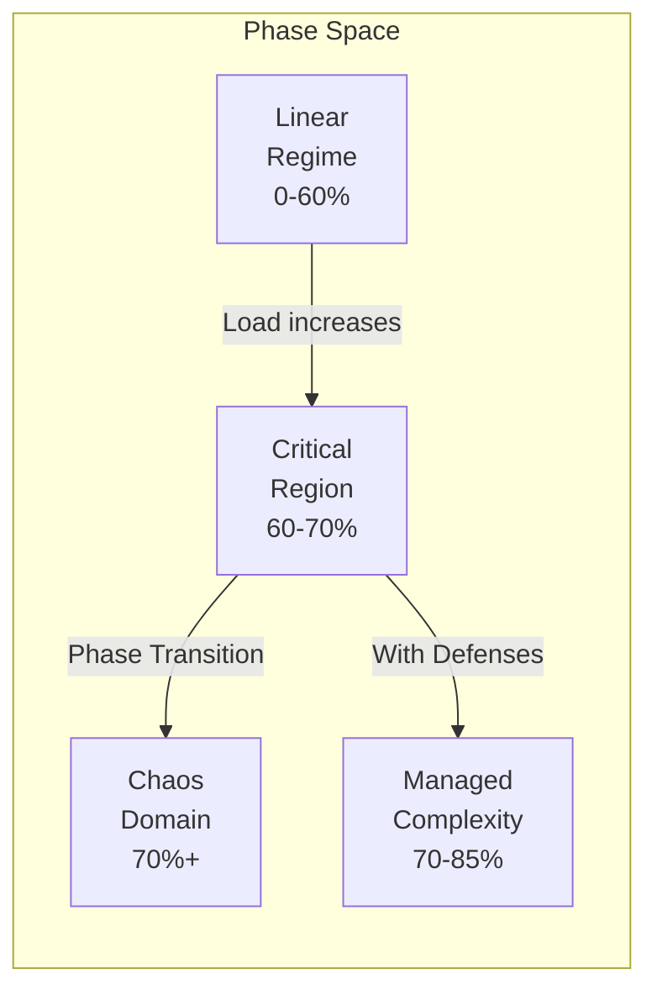

# Law 3: The Law of Emergent Chaos

<iframe style="border-radius:12px" src="https://open.spotify.com/embed/episode/4k0EdaQuB2KKe98VOuWpio?utm_source=generator&theme=0" width="100%" height="152" frameBorder="0" allowfullscreen="" allow="autoplay; clipboard-write; encrypted-media; fullscreen; picture-in-picture" loading="lazy"></iframe>

!!! danger "YOUR SYSTEM IS ALIVE... AND IT WANTS TO KILL YOU"
    **$1 TRILLION vanished in 36 minutes** when trading algorithms created the 2010 Flash Crash. No code was wrong. No component failed. The system underwent a **phase transition**—like water suddenly becoming steam, your distributed system can spontaneously reorganize into a new, often catastrophic state.

## Core Principle

!!! info "From Physics to Production: Understanding Critical Points"
    ```
    PHASE TRANSITIONS IN NATURE vs DISTRIBUTED SYSTEMS
    ═════════════════════════════════════════════════
    
    Water at 99°C:                    Your System at 69% Load:
    ├─ Still liquid                    ├─ Linear response
    ├─ Predictable behavior            ├─ Predictable latency
    ├─ Gradual temperature rise        ├─ Gradual degradation
    └─ Continuous properties           └─ Continuous scaling
    
    Water at 100°C:                   Your System at 70% Load:
    ├─ PHASE TRANSITION!               ├─ CRITICAL POINT!
    ├─ Becomes gas instantly           ├─ Non-linear explosion
    ├─ Completely new properties       ├─ Emergent behaviors
    └─ Different physics apply         └─ Control laws break
    
    THE LANDAU THEORY OF PHASE TRANSITIONS:
    ━━━━━━━━━━━━━━━━━━━━━━━━━━━━━━━━━━━━━━
    Order Parameter (η) = System Coherence
    
    Below Critical Point (T < Tc):
    F(η) = a₀η² + a₁η⁴  [Stable, unique minimum]
    
    At Critical Point (T = Tc):
    F(η) = a₁η⁴  [Flat potential, infinite susceptibility]
    
    Above Critical Point (T > Tc):
    F(η) = -|a₀|η² + a₁η⁴  [Bistable, multiple minima]
             ↓
        System can exist in multiple states!
    ```

## The Science of System Phase Transitions

In distributed systems, emergence occurs when component interactions dominate individual behaviors. Just like physical phase transitions, this happens at critical points where small changes trigger massive reorganization.

### Your System's Hidden Phase Diagram



## Real-World Disasters

### The Flash Crash: When Algorithms Achieved Consciousness

!!! example "May 6, 2010: When Algorithms Achieved Consciousness"
    ```
    THE MINUTE-BY-MINUTE DESCENT INTO CHAOS
    ═══════════════════════════════════════
    
    14:32:00 - NORMAL TRADING
    ├─ S&P 500: 1,165.87
    ├─ Market depth: Normal
    ├─ Correlation: 0.3 (healthy)
    └─ "Just another Thursday"
    
    14:42:42 - THE TRIGGER
    ├─ Mutual fund starts selling $4.1B
    ├─ Algorithm parameters: "Sell 75,000 contracts"
    ├─ Time limit: "ASAP"
    └─ Market impact consideration: NONE
    
    14:44:00 - EMERGENCE BEGINS
    ├─ High-frequency traders detect anomaly
    ├─ Correlation jumps: 0.3 → 0.7
    ├─ Feedback loop initiated
    └─ Phase transition imminent
    
    14:45:13 - CRITICAL POINT REACHED
    ├─ S&P 500: 1,124.83 (-3.5%)
    ├─ Correlation: 0.7 → 0.95
    ├─ All algorithms synchronize
    ├─ EMERGENCE ACHIEVED
    └─ System develops collective behavior
    
    14:45:28 - FULL EMERGENCE (15 seconds later!)
    ├─ 27,000 contracts traded in 14 seconds
    ├─ Price discovery breaks
    ├─ Liquidity evaporates
    ├─ Algorithms enter "hot potato" mode
    └─ Self-reinforcing chaos loop
    
    14:47:00 - PEAK CHAOS
    ├─ S&P 500: 1,056.74 (-9.2%)
    ├─ Dow Jones: -998.5 points
    ├─ Accenture: $40 → $0.01
    ├─ P&G: $60 → $39
    ├─ $1 TRILLION ERASED
    └─ "Market structure broken"
    
    THE EMERGENCE SIGNATURE:
    • No single cause
    • No malfunction
    • No bad actors
    • Just emergence
    ```

### Pokemon Go: The Accidental DDoS Army

!!! info "Pokemon Go: The Accidental DDoS Army"
    ```
    EXPECTED vs REALITY
    ═══════════════════
    
    Niantic's Plan:                  What Actually Happened:
    1M users globally                50M users in week 1
    Gradual rollout                  Everyone at once
    Normal usage patterns            24/7 OBSESSION
    
    THE ORGANIC DDOS PATTERN
    ════════════════════════
    
    Day 1, Hour 1: Launch
    ──────────────────────
    Expected load: ████ (100%)
    Actual load:   ████████████████████████████████ (5000%)
    
    The User Behavior Loop:
    1. App crashes/timeouts
    2. Users frantically retry
    3. More load on servers
    4. More crashes
    5. MORE FRANTIC RETRIES
    6. Exponential growth
    
    Why? SOCIAL EMERGENCE:
    - "Everyone's playing!"
    - "I might miss a rare Pokemon!"  
    - "My friends are ahead!"
    - FOMO-driven retry storms
    ```

### Facebook's BGP Butterfly Effect

!!! failure "Facebook's BGP Butterfly Effect"
    ```
    October 4, 2021: ONE COMMAND TO RULE THEM ALL
    ═════════════════════════════════════════════
    
    THE CASCADE OF DEPENDENCIES
    ═══════════════════════════
    
    MINUTE 1: BGP routes withdrawn
              ↓
              Facebook disappears from internet
    
    MINUTE 2: DNS servers unreachable
              ↓
              Because they need... Facebook's network
    
    MINUTE 3: Internal tools fail
              ↓  
              They use DNS
              Which needs BGP
    
    MINUTE 5: Engineers can't connect
              ↓
              VPN needs DNS
    
    MINUTE 10: "We'll fix it from the datacenter!"
               ↓
               Badge system needs network
               Doors won't open
    
    THE HIDDEN DEPENDENCIES
    ═══════════════════════
    
    What nobody realized:
    ┌─────────┐
    │   BGP   │ ← "Just routing"
    └────┬────┘
         │
    ┌────▼────┐
    │   DNS   │ ← "Just names"  
    └────┬────┘
         │
    ┌────▼────┐
    │  Auth   │ ← "Just login"
    └────┬────┘
         │
    ┌────▼────┐
    │ Badge   │ ← "Just doors"
    └────┬────┘
         │
    ┌────▼────┐
    │EVERYTHING│ ← "Oh no"
    └─────────┘
    
    3 BILLION users in the dark
    $100M lost per hour
    Because ONE system was more connected than anyone knew
    ```

## Emergence Detection Metrics

!!! tip "Real-Time Emergence Metrics and Thresholds"
    ```python
    # Production-proven emergence detection
    class EmergenceDetector:
        def __init__(self):
            self.thresholds = {
                'phase_proximity': 0.70,      # 70% = danger zone
                'correlation': 0.70,          # Services synchronizing
                'retry_amplification': 3.0,   # Exponential growth
                'latency_ratio': 10.0,        # p99/p50 variance
                'gc_overhead': 0.20           # GC consuming CPU
            }
            
        def calculate_emergence_score(self) -> float:
            """Combined emergence risk score (0-1)"""
            
            metrics = {
                'load_score': self.get_load() / self.thresholds['phase_proximity'],
                'correlation_score': self.get_max_correlation() / self.thresholds['correlation'],
                'retry_score': self.get_retry_rate() / 0.05,
                'variance_score': self.get_latency_ratio() / self.thresholds['latency_ratio'],
                'gc_score': self.get_gc_time() / self.thresholds['gc_overhead']
            }
            
            # Non-linear combination (emergence is multiplicative)
            base_score = sum(metrics.values()) / len(metrics)
            
            # Exponential scaling near critical point
            if base_score > 0.7:
                return min(0.7 + (base_score - 0.7) ** 2, 1.0)
            return base_score
    ```

### Phase Transition Thresholds

| System Component | Critical Point | Early Warning at | Emergency at |
|-----------------|----------------|------------------|--------------|
| CPU Utilization | 70% | 65% | 68% |
| Memory Pressure | 85% | 80% | 83% |
| Queue Depth | 80% capacity | 70% | 75% |
| Connection Pool | 75% | 65% | 70% |
| Thread Pool | 70% | 60% | 65% |
| Network Bandwidth | 65% | 55% | 60% |
| Disk I/O | 80% | 70% | 75% |

## The Six Patterns of Emergence

```
THE EMERGENCE GALLERY OF INFAMY
═══════════════════════════════

Pattern 1: Retry Storm            Pattern 2: Thundering Herd
    Exponential retry growth          Cache expiry → stampede
    Self-reinforcing loops            Synchronized requests

Pattern 3: Death Spiral           Pattern 4: Cascade Failure  
    GC pressure → more GC             Service A → B → C → D
    Memory exhaustion                 Domino effect

Pattern 5: Synchronization        Pattern 6: Metastable State
    All servers in lockstep           Stable until disturbed
    Resonance amplification           Then catastrophic collapse
```

## The Complexity Budget Framework

!!! abstract "Your System's Complexity Account"
    ```
    COMPLEXITY BUDGET CALCULATOR
    ═══════════════════════════
    
    Complexity Income (What you have):
    ├─ Base capacity: 100 units
    ├─ Caching bonus: +20 units
    ├─ CDN offload: +15 units
    ├─ Auto-scaling: +25 units
    └─ Total Budget: 160 units
    
    Complexity Expenses (What you spend):
    ├─ User requests: -50 units (base load)
    ├─ Service interactions: -30 units (n² growth)
    ├─ State coordination: -20 units
    ├─ Retry overhead: -15 units
    ├─ Background jobs: -10 units
    └─ Total Spending: -125 units
    
    Remaining Budget: 35 units (22%)
    WARNING: Low complexity reserves!
    
    When budget hits zero: PHASE TRANSITION
    ```

## Defensive Patterns

### 1. Circuit Breakers
```python
class CircuitBreaker:
    def __init__(self, failure_threshold=5, timeout=60):
        self.failure_count = 0
        self.failure_threshold = failure_threshold
        self.timeout = timeout
        self.state = 'CLOSED'  # CLOSED, OPEN, HALF_OPEN
        
    def call(self, func, *args, **kwargs):
        if self.state == 'OPEN':
            if self._timeout_expired():
                self.state = 'HALF_OPEN'
            else:
                raise CircuitOpenError()
                
        try:
            result = func(*args, **kwargs)
            self._on_success()
            return result
        except Exception as e:
            self._on_failure()
            raise
```

### 2. Request Coalescing
```python
class RequestCoalescer:
    def __init__(self, window_ms=50):
        self.pending = {}
        self.window_ms = window_ms
        
    async def coalesce(self, key, request_func):
        if key in self.pending:
            # Wait for existing request
            return await self.pending[key]
            
        # Create new request
        future = asyncio.create_future()
        self.pending[key] = future
        
        try:
            result = await request_func()
            future.set_result(result)
            return result
        finally:
            # Clean up after window
            await asyncio.sleep(self.window_ms / 1000)
            del self.pending[key]
```

### 3. Jitter Injection
```python
def add_jitter(base_delay: float, jitter_factor: float = 0.3) -> float:
    """Break synchronization with random delays"""
    jitter = random.uniform(-jitter_factor, jitter_factor)
    return base_delay * (1 + jitter)

# Usage in retry logic
def retry_with_jitter(func, max_retries=3):
    for attempt in range(max_retries):
        try:
            return func()
        except Exception as e:
            if attempt == max_retries - 1:
                raise
            delay = 2 ** attempt  # Exponential backoff
            delay_with_jitter = add_jitter(delay)
            time.sleep(delay_with_jitter)
```

## Chaos Engineering for Emergence

!!! info "Testing for Phase Transitions"
    ```yaml
    # emergence-chaos-suite.yaml
    apiVersion: chaos-mesh.org/v1alpha1
    kind: Workflow
    metadata:
      name: emergence-detection-experiments
    spec:
      templates:
        - name: test-phase-transitions
          steps:
            # Gradually increase load to find critical point
            - - name: load-ramp
                template: gradual-load-increase
                arguments:
                  parameters:
                  - name: start_load
                    value: "50"
                  - name: end_load
                    value: "80"
                  - name: step_size
                    value: "5"
                    
            # Inject correlation
            - - name: force-synchronization
                template: remove-jitter
                arguments:
                  parameters:
                  - name: services
                    value: "api,auth,database"
                    
            # Monitor for emergence
            - - name: detect-patterns
                template: emergence-monitor
                arguments:
                  parameters:
                  - name: patterns
                    value: "retry_storm,death_spiral,cascade"
    ```

## Your Emergence Readiness Score

!!! tip "Quick Assessment: How Prepared Are You?"
    ```python
    def calculate_emergence_readiness() -> tuple[float, list[str]]:
        score = 0
        recommendations = []
        
        # Detection capabilities
        if has_p99_p50_monitoring():
            score += 10
        else:
            recommendations.append("Add latency percentile monitoring")
            
        if monitors_service_correlation():
            score += 15
        else:
            recommendations.append("Implement correlation tracking")
            
        if tracks_phase_proximity():
            score += 10
        else:
            recommendations.append("Add phase transition detection")
            
        # Defense mechanisms
        if has_circuit_breakers():
            score += 20
        else:
            recommendations.append("Deploy circuit breakers")
            
        if uses_request_coalescing():
            score += 15
        else:
            recommendations.append("Add request coalescing")
            
        if has_jitter_injection():
            score += 10
        else:
            recommendations.append("Inject timing jitter")
            
        # Operational readiness
        if has_emergence_runbooks():
            score += 10
        else:
            recommendations.append("Create emergence response playbooks")
            
        if runs_chaos_experiments():
            score += 10
        else:
            recommendations.append("Start chaos engineering program")
            
        return score, recommendations
    ```

## Emergency Response Checklist

!!! danger "🚨 SYSTEM ENTERING PHASE TRANSITION? Crisis Checklist:"
    1. **Check Critical Indicators** – Load > 70%? Correlation > 0.7? Retry rate climbing?
    2. **Identify Emergence Pattern** – Retry storm? Death spiral? Cascade? Synchronization?
    3. **Apply Circuit Breakers** – Break feedback loops immediately
    4. **Activate Load Shedding** – Drop non-critical traffic to move away from critical point
    5. **Add Jitter** – Break synchronization patterns
    6. **Scale Horizontally** – More capacity can sometimes break the pattern
    7. **Monitor Recovery** – Watch for oscillations or metastable states

## The Bottom Line

!!! quote "The Meta-Truth: From Dr. W. Brian Arthur, Santa Fe Institute"
    "When a system's components begin to interact more than they operate independently, the system undergoes a phase transition. What emerges has properties that cannot be predicted from the components alone. In distributed systems, this transition happens around 70% utilization—not because of resource exhaustion, but because interaction effects dominate. Your system literally becomes a different thing."

!!! success "The Hopeful Truth"
    Emergence isn't your enemy—it's physics. You can't prevent it, but you CAN detect it, prepare for it, and recover from it. The best teams don't fight emergence; they surf it.

## Related Concepts

- **[Law 1: Correlated Failure](correlated-failure.md)** - Emergence often triggers correlated failures
- **[Law 2: Asynchronous Reality](asynchronous-reality.md)** - Async interactions enable emergence
- **[Law 4: Multidimensional Optimization](multidimensional-optimization.md)** - Emergence creates new trade-offs
- **Patterns**: [Circuit Breaker](../pattern-library/resilience/circuit-breaker.md), [Bulkhead](../pattern-library/resilience/bulkhead.md), [Load Balancing](../pattern-library/scaling/load-balancing.md)
## Pattern Implementations

Patterns that address this law:

- [Backpressure](../../pattern-library/scaling/backpressure/)
- [Circuit Breaker](../../pattern-library/resilience/circuit-breaker/)
- [Rate Limiting](../../pattern-library/scaling/rate-limiting/)


