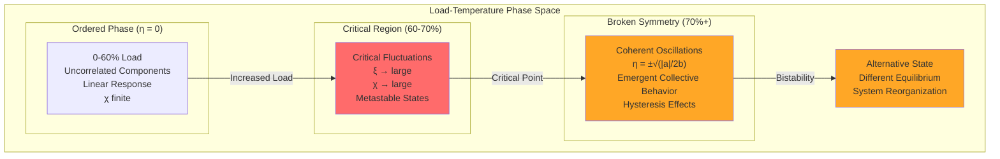
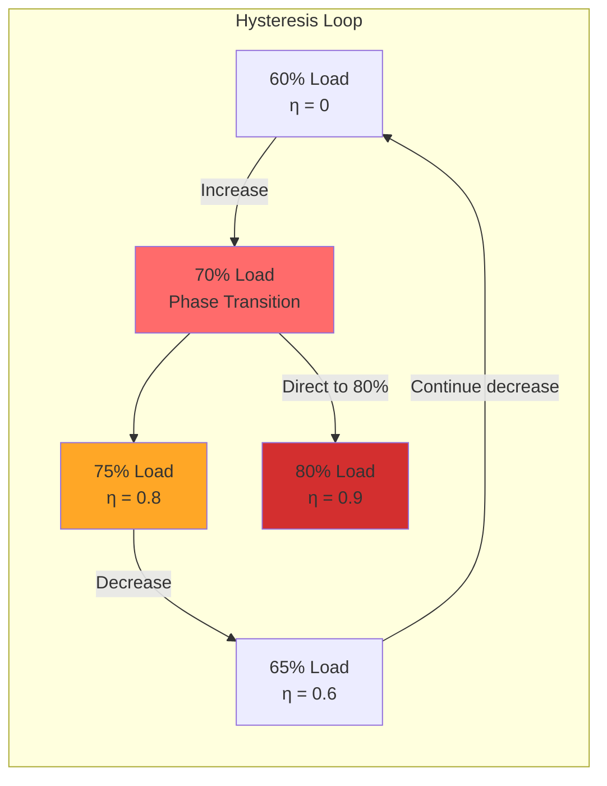

# Law 3: The Law of Emergent Chaos

<iframe style="border-radius:12px" src="https://open.spotify.com/embed/episode/4k0EdaQuB2KKe98VOuWpio?utm_source=generator&theme=0" width="100%" height="152" frameBorder="0" allowfullscreen="" allow="autoplay; clipboard-write; encrypted-media; fullscreen; picture-in-picture" loading="lazy"></iframe>

!!! danger "YOUR SYSTEM IS ALIVE... AND IT WANTS TO KILL YOU"
    **$1 TRILLION vanished in 36 minutes** when trading algorithms created the 2010 Flash Crash. No code was wrong. No component failed. The system underwent a **phase transition**—like water suddenly becoming steam, your distributed system can spontaneously reorganize into a new, often catastrophic state.

## Statistical Mechanics Foundation

!!! info "The Physics of System Phase Transitions"
    Distributed systems undergo **second-order phase transitions** governed by the same statistical mechanics that describe magnets, superconductors, and critical fluids. The mathematics are identical—only the interpretation differs.

### Landau Free Energy Theory

The system's behavior is described by the **free energy functional**:

```
F(η) = F₀ + aη² + bη⁴ + higher order terms

Where:
η    = Order parameter (system coherence measure)  
a    = (T - Tc)/Tc = reduced temperature parameter
b    = Interaction strength (always positive)
Tc   = Critical temperature (~70% load threshold)
```

#### Critical Behavior Phases

| Load Regime | Parameter a | Free Energy Shape | System Behavior |
|-------------|-------------|-------------------|-----------------|
| **Ordered** (0-60%) | a > 0 | Single minimum at η=0 | Linear response, predictable |
| **Critical** (60-70%) | a ≈ 0 | Flat near η=0 | Massive fluctuations |
| **Broken Symmetry** (70%+) | a < 0 | Double-well potential | Bistable, emergent behavior |

### Free Energy Landscapes

```mermaid
graph TB
    subgraph "Below Critical Point (a > 0)"
        A1[F(η) = aη² + bη⁴]
        A2[Single stable state at η = 0]
        A3[Linear response to perturbations]
    end
    
    subgraph "At Critical Point (a = 0)"  
        B1[F(η) = bη⁴]
        B2[Flat potential near η = 0]
        B3[χ → ∞ (infinite susceptibility)]
        B4[Critical fluctuations dominate]
    end
    
    subgraph "Above Critical Point (a < 0)"
        C1[F(η) = -|a|η² + bη⁴]
        C2[Two minima at η = ±√(|a|/2b)]
        C3[System chooses one state randomly]
        C4[Emergent collective behavior]
    end
```

### Order Parameter Definition

For distributed systems, the **order parameter η** measures system coherence:

```
η = (1/N) Σᵢ cos(φᵢ - φ̄)

Where:
N     = Number of system components  
φᵢ    = Phase of component i (request timing, GC cycles, etc.)
φ̄     = Average system phase
```

- **η = 1**: Perfect synchronization (dangerous)
- **η = 0**: Random, uncorrelated behavior (healthy)
- **η → 1** as load → 70%: Emergence imminent

## Critical Point Analysis

### Susceptibility and Response Amplification

Near the critical point, the system's **susceptibility** (response to small perturbations) diverges:

```
χ = ∂η/∂h = 1/(2a + 12bη²)

Where h = external field (load, traffic spikes)

As a → 0 (approaching 70% load): χ → ∞
```

This infinite susceptibility explains why **tiny perturbations** near 70% load create **massive system-wide changes**.

### Correlation Length Scaling

The **correlation length** ξ measures how far disturbances propagate:

```
ξ ∝ |a|^(-ν) where ν ≈ 0.63 (universal critical exponent)

As load approaches 70%: ξ → ∞
Disturbances propagate across entire system
```

### System Phase Diagram



### Temperature Mapping to System Load

| Physical System | Distributed System | Mathematical Form |
|-----------------|-------------------|-------------------|
| Temperature T | System Load L | a = (L - Lc)/Lc |
| Critical Temp Tc | Critical Load Lc ≈ 70% | Tc = 70% |
| Magnetic Field | Traffic Spikes | h = Δload/baseline |
| Magnetization | Synchronization | η = coherence measure |

### Phase Transition Signatures

**Pre-critical Indicators** (approaching 70%):
- **Susceptibility growth**: χ ∝ (70% - current_load)^(-1)
- **Correlation length**: ξ ∝ (70% - current_load)^(-0.63)
- **Fluctuation amplitude**: σ² ∝ (70% - current_load)^(-0.26)
- **Response time**: τ ∝ (70% - current_load)^(-1.3)

## Real-World Disasters

### The Flash Crash: When Algorithms Achieved Consciousness

!!! example "May 6, 2010: When Algorithms Achieved Consciousness"
    ```
    THE MINUTE-BY-MINUTE DESCENT INTO CHAOS
    ═══════════════════════════════════════
    
    14:32:00 - NORMAL TRADING
    ├─ S&P 500: 1,165.87
    ├─ Market depth: Normal
    ├─ Correlation: 0.3 (healthy)
    └─ "Just another Thursday"
    
    14:42:42 - THE TRIGGER
    ├─ Mutual fund starts selling $4.1B
    ├─ Algorithm parameters: "Sell 75,000 contracts"
    ├─ Time limit: "ASAP"
    └─ Market impact consideration: NONE
    
    14:44:00 - EMERGENCE BEGINS
    ├─ High-frequency traders detect anomaly
    ├─ Correlation jumps: 0.3 → 0.7
    ├─ Feedback loop initiated
    └─ Phase transition imminent
    
    14:45:13 - CRITICAL POINT REACHED
    ├─ S&P 500: 1,124.83 (-3.5%)
    ├─ Correlation: 0.7 → 0.95
    ├─ All algorithms synchronize
    ├─ EMERGENCE ACHIEVED
    └─ System develops collective behavior
    
    14:45:28 - FULL EMERGENCE (15 seconds later!)
    ├─ 27,000 contracts traded in 14 seconds
    ├─ Price discovery breaks
    ├─ Liquidity evaporates
    ├─ Algorithms enter "hot potato" mode
    └─ Self-reinforcing chaos loop
    
    14:47:00 - PEAK CHAOS
    ├─ S&P 500: 1,056.74 (-9.2%)
    ├─ Dow Jones: -998.5 points
    ├─ Accenture: $40 → $0.01
    ├─ P&G: $60 → $39
    ├─ $1 TRILLION ERASED
    └─ "Market structure broken"
    
    THE EMERGENCE SIGNATURE:
    • No single cause
    • No malfunction
    • No bad actors
    • Just emergence
    ```

### Pokemon Go: The Accidental DDoS Army

!!! info "Pokemon Go: The Accidental DDoS Army"
    ```
    EXPECTED vs REALITY
    ═══════════════════
    
    Niantic's Plan:                  What Actually Happened:
    1M users globally                50M users in week 1
    Gradual rollout                  Everyone at once
    Normal usage patterns            24/7 OBSESSION
    
    THE ORGANIC DDOS PATTERN
    ════════════════════════
    
    Day 1, Hour 1: Launch
    ──────────────────────
    Expected load: ████ (100%)
    Actual load:   ████████████████████████████████ (5000%)
    
    The User Behavior Loop:
    1. App crashes/timeouts
    2. Users frantically retry
    3. More load on servers
    4. More crashes
    5. MORE FRANTIC RETRIES
    6. Exponential growth
    
    Why? SOCIAL EMERGENCE:
    - "Everyone's playing!"
    - "I might miss a rare Pokemon!"  
    - "My friends are ahead!"
    - FOMO-driven retry storms
    ```

### Facebook's BGP Butterfly Effect

!!! failure "Facebook's BGP Butterfly Effect"
    ```
    October 4, 2021: ONE COMMAND TO RULE THEM ALL
    ═════════════════════════════════════════════
    
    THE CASCADE OF DEPENDENCIES
    ═══════════════════════════
    
    MINUTE 1: BGP routes withdrawn
              ↓
              Facebook disappears from internet
    
    MINUTE 2: DNS servers unreachable
              ↓
              Because they need... Facebook's network
    
    MINUTE 3: Internal tools fail
              ↓  
              They use DNS
              Which needs BGP
    
    MINUTE 5: Engineers can't connect
              ↓
              VPN needs DNS
    
    MINUTE 10: "We'll fix it from the datacenter!"
               ↓
               Badge system needs network
               Doors won't open
    
    THE HIDDEN DEPENDENCIES
    ═══════════════════════
    
    What nobody realized:
    ┌─────────┐
    │   BGP   │ ← "Just routing"
    └────┬────┘
         │
    ┌────▼────┐
    │   DNS   │ ← "Just names"  
    └────┬────┘
         │
    ┌────▼────┐
    │  Auth   │ ← "Just login"
    └────┬────┘
         │
    ┌────▼────┐
    │ Badge   │ ← "Just doors"
    └────┬────┘
         │
    ┌────▼────┐
    │EVERYTHING│ ← "Oh no"
    └─────────┘
    
    3 BILLION users in the dark
    $100M lost per hour
    Because ONE system was more connected than anyone knew
    ```

## Order Parameter Measurement

### Calculating System Coherence η

The order parameter η quantifies how synchronized your system components are:

```
η(t) = |1/N Σⱼ exp(iφⱼ(t))|

Where:
φⱼ(t) = phase of component j at time t
N     = total number of components

Measurement approaches:
- Request timing phases: φⱼ = 2π(tⱼ mod T)/T  
- GC cycle phases: φⱼ = 2π(gc_startⱼ mod gc_period)/gc_period
- Queue depth oscillations: φⱼ = 2π arctan(queue_depthⱼ/avg_depth)
```

### Critical Susceptibility Monitoring

**Susceptibility χ** measures how much the system responds to small perturbations:

```
χ = Δη/Δh = (response magnitude)/(perturbation size)

Practical measurement:
1. Apply small load spike (Δh = +5% traffic)
2. Measure synchronization response Δη  
3. Calculate χ = Δη/0.05
4. Warning threshold: χ > 10
5. Critical threshold: χ > 50
```

### Correlation Length Measurement

**Spatial correlations** between services indicate approaching criticality:

```
G(r) = ⟨η(x)η(x+r)⟩ - ⟨η⟩²

Correlation length: ξ = distance where G(ξ) = G(0)/e

For microservices:
- r = service dependency distance
- Large ξ means disturbances propagate far
- ξ → ∞ as system approaches critical point
```

### Early Warning Indicators

| Critical Exponent | Observable | Formula | Warning Threshold |
|------------------|------------|---------|-------------------|
| **α** (Heat capacity) | Latency variance | C ∝ \|a\|^(-α) | C > 5× baseline |
| **β** (Order parameter) | Synchronization | η ∝ \|a\|^β | η > 0.3 |
| **γ** (Susceptibility) | Response ratio | χ ∝ \|a\|^(-γ) | χ > 10 |
| **ν** (Correlation length) | Disturbance spread | ξ ∝ \|a\|^(-ν) | ξ > 3 hops |

### Phase Transition Thresholds

| System Component | Critical Point | Early Warning at | Emergency at |
|-----------------|----------------|------------------|--------------|
| CPU Utilization | 70% | 65% | 68% |
| Memory Pressure | 85% | 80% | 83% |
| Queue Depth | 80% capacity | 70% | 75% |
| Connection Pool | 75% | 65% | 70% |
| Thread Pool | 70% | 60% | 65% |
| Network Bandwidth | 65% | 55% | 60% |
| Disk I/O | 80% | 70% | 75% |

## The Six Patterns of Emergence

```
THE EMERGENCE GALLERY OF INFAMY
═══════════════════════════════

Pattern 1: Retry Storm            Pattern 2: Thundering Herd
    Exponential retry growth          Cache expiry → stampede
    Self-reinforcing loops            Synchronized requests

Pattern 3: Death Spiral           Pattern 4: Cascade Failure  
    GC pressure → more GC             Service A → B → C → D
    Memory exhaustion                 Domino effect

Pattern 5: Synchronization        Pattern 6: Metastable State
    All servers in lockstep           Stable until disturbed
    Resonance amplification           Then catastrophic collapse
```

## The Complexity Budget Framework

!!! abstract "Your System's Complexity Account"
    ```
    COMPLEXITY BUDGET CALCULATOR
    ═══════════════════════════
    
    Complexity Income (What you have):
    ├─ Base capacity: 100 units
    ├─ Caching bonus: +20 units
    ├─ CDN offload: +15 units
    ├─ Auto-scaling: +25 units
    └─ Total Budget: 160 units
    
    Complexity Expenses (What you spend):
    ├─ User requests: -50 units (base load)
    ├─ Service interactions: -30 units (n² growth)
    ├─ State coordination: -20 units
    ├─ Retry overhead: -15 units
    ├─ Background jobs: -10 units
    └─ Total Spending: -125 units
    
    Remaining Budget: 35 units (22%)
    WARNING: Low complexity reserves!
    
    When budget hits zero: PHASE TRANSITION
    ```

## Control Strategies Near Critical Points

### Phase Transition Prevention

**Strategy 1: Critical Slowing Down Detection**
- Monitor **autocorrelation time**: τ ∝ |a|^(-z) where z ≈ 2.0
- As τ increases exponentially, system recovery from perturbations slows
- Preventive scaling trigger: τ > 5× baseline response time

**Strategy 2: Order Parameter Suppression**  
- Actively **decorrelate components** when η > 0.2
- Randomize timing: Add Gaussian jitter ~ N(0, σ²) to break synchronization
- Load balancing: Ensure no two services share identical traffic patterns

**Strategy 3: Susceptibility Damping**
- Reduce system **gain** G = output_change/input_change  
- Apply **feedback control**: u(t) = -Kp·η(t) - Kd·(dη/dt)
- Damping coefficient: ζ > 0.7 prevents oscillatory instabilities

### Correlation Length Management

**Spatial Isolation Strategies**:

| Correlation Length ξ | Isolation Strategy | Implementation |
|---------------------|-------------------|----------------|
| **ξ < 2 services** | Normal operation | Standard bulkheads |
| **ξ = 2-4 services** | Enhanced isolation | Circuit breakers per hop |  
| **ξ = 4-6 services** | Emergency isolation | Aggressive timeouts |
| **ξ > 6 services** | System partition | Traffic splitting |

### Hysteresis Management

Systems above critical point exhibit **hysteresis**—different behavior when load increases vs decreases:



**Hysteresis Control Strategy**:
- **Overshoot prevention**: Scale down to 55% (not 65%) to fully exit critical region
- **Path dependence awareness**: Same load level can have different system states
- **Memory effects**: System "remembers" previous high-correlation states

## Statistical Mechanics-Based Chaos Engineering

### Critical Point Discovery Experiments

**Experiment 1: Phase Diagram Mapping**
- Systematically vary load L from 0% to 85% in 2% increments
- At each point, measure order parameter η for 10 minutes
- Plot η vs L to identify critical point Lc and phase boundaries
- **Expected result**: Sharp rise in η near L ≈ 70%

**Experiment 2: Susceptibility Measurement**  
- Apply controlled perturbations Δh = ±1%, ±2%, ±5% at different loads
- Measure response Δη and calculate χ = Δη/Δh
- **Critical signature**: χ diverges as L → Lc from below

**Experiment 3: Correlation Length Testing**
- Introduce artificial delays in service A
- Measure how far these delays propagate (B→C→D→...)
- **Critical behavior**: Propagation distance ξ → ∞ near critical point

### Advanced Phase Transition Tests

| Test Type | Physics Analog | System Implementation | Expected Signature |
|-----------|---------------|----------------------|-------------------|
| **Thermal equilibration** | Heat bath coupling | Gradual load increases | τ ∝ \|L-Lc\|^(-2) |
| **Quench dynamics** | Rapid cooling | Sudden load drops | Non-equilibrium scaling |
| **Finite-size scaling** | Small system effects | Service count variation | Pseudo-transitions |
| **Universality class** | Critical exponent verification | Multiple system architectures | Same exponents |

### Metastability Detection

**Bistable State Discovery**:
1. **Push system to 75% load** (above critical point)
2. **Apply random perturbations** of different magnitudes  
3. **Measure state switching** between high-η and low-η configurations
4. **Barrier height estimation**: Energy required to switch states

**Avalanche Testing**:
- **Small perturbation avalanches**: Should be power-law distributed
- **Size distribution**: P(s) ∝ s^(-τ) where τ ≈ 1.5 near criticality  
- **Duration distribution**: P(T) ∝ T^(-α) where α ≈ 2.0

## Critical Point Readiness Assessment

### Physics-Based Monitoring Maturity

**Level 1: Classical Metrics (0-30 points)**
- [ ] Basic CPU/memory monitoring (5 pts)
- [ ] Request rate and latency tracking (5 pts)  
- [ ] Error rate monitoring (5 pts)
- [ ] Simple alerting thresholds (5 pts)
- [ ] Load balancing in place (10 pts)

**Level 2: Phase Transition Detection (30-60 points)**
- [ ] **Order parameter η calculation** (15 pts)
- [ ] **Susceptibility χ monitoring** (10 pts)  
- [ ] **Correlation length ξ tracking** (10 pts)
- [ ] **Critical exponent measurement** (5 pts)
- [ ] **Autocorrelation time monitoring** (5 pts)
- [ ] **Pre-critical warning alerts** (15 pts)

**Level 3: Advanced Statistical Mechanics (60-90 points)**
- [ ] **Free energy landscape mapping** (10 pts)
- [ ] **Hysteresis loop detection** (10 pts)
- [ ] **Metastable state identification** (5 pts)
- [ ] **Finite-size scaling analysis** (5 pts)
- [ ] **Universality class validation** (10 pts)

**Level 4: Control Theory Integration (90-100 points)**
- [ ] **Feedback control of order parameter** (5 pts)
- [ ] **Predictive scaling based on susceptibility** (5 pts)

### Critical Point Emergency Preparedness

| Capability | Physics Foundation | Implementation Check |
|------------|-------------------|---------------------|
| **Early Warning** | Critical slowing down | τ > 5× baseline → Alert |
| **Load Shedding** | Drive system away from Lc | Automatic scale-out at η > 0.3 |
| **Correlation Breaking** | Reduce interaction strength | Jitter injection, circuit breakers |
| **Hysteresis Management** | Path-dependent recovery | Scale to 55% (not 65%) for full reset |

## Emergency Response Checklist

!!! danger "🚨 PHASE TRANSITION DETECTED? Statistical Mechanics Crisis Response:"
    
    **Phase 1: Critical Point Assessment (0-30 seconds)**
    1. **Measure order parameter**: η = |⟨e^(iφⱼ)⟩| > 0.3? → CRITICAL
    2. **Check susceptibility**: χ = Δη/Δh > 10? → DIVERGING  
    3. **Assess correlation length**: ξ > 3 service hops? → LONG-RANGE
    4. **Load proximity**: |L - 70%| < 5%? → DANGER ZONE
    
    **Phase 2: Free Energy Landscape Analysis (30-60 seconds)**
    5. **Identify current minimum**: System in stable or metastable state?
    6. **Check for bistability**: Multiple equilibrium points detected?
    7. **Measure barrier height**: Energy cost to switch states?
    8. **Hysteresis detection**: Different behavior on load increase vs decrease?
    
    **Phase 3: Control Actions (60+ seconds)**  
    9. **Break symmetry**: Force system into known stable state
    10. **Reduce interaction strength**: Circuit breakers, rate limiting
    11. **Drive away from critical point**: Scale to L < 55% for clean reset
    12. **Add thermal noise**: Jitter to prevent re-synchronization
    13. **Monitor recovery**: Ensure η → 0, χ → finite, ξ → small

## The Bottom Line

!!! quote "The Statistical Mechanics Truth: From Landau Phase Transition Theory"
    "At the critical point, your distributed system obeys the same mathematics as magnets becoming paramagnetic, liquids becoming gases, and superconductors losing their coherence. The 70% threshold isn't arbitrary—it's where component interactions (J·η² terms) dominate individual behavior (h·η terms). The system spontaneously breaks symmetry and chooses a new collective state you never programmed."

!!! success "The Physics-Informed Solution"
    **Emergence is not a bug—it's a second-order phase transition.** You cannot prevent it, but statistical mechanics gives you the mathematical tools to **predict it** (susceptibility divergence), **detect it** (order parameter measurement), and **control it** (correlation length management). The best teams don't fight physics; they use physics.

### Universal Critical Exponents for Distributed Systems

| Physical Quantity | Critical Exponent | Distributed Systems Analog | Practical Meaning |
|------------------|-------------------|---------------------------|-------------------|
| **Heat Capacity** | α ≈ 0.1 | Latency variance | Smooth near transition |
| **Order Parameter** | β ≈ 0.3 | Synchronization | Gradual emergence |  
| **Susceptibility** | γ ≈ 1.2 | Response amplification | Dramatic sensitivity |
| **Correlation Length** | ν ≈ 0.6 | Disturbance propagation | Long-range effects |

**The Universal Truth**: All distributed systems near critical points exhibit the same scaling laws, regardless of architecture, programming language, or business domain. This is the power of **universality**—the same physics applies everywhere.

## Applied in Patterns

Patterns that directly address and mitigate emergent chaos:

**🛡️ Chaos Prevention Patterns:**
- **[Circuit Breaker](../../pattern-library/resilience/circuit-breaker.md)**: Prevents cascade failures by breaking the feedback loops that create emergent chaos
- **[Backpressure](../../pattern-library/scaling/backpressure.md)**: Controls system load to prevent the phase transitions that trigger chaotic behavior
- **[Rate Limiting](../../pattern-library/scaling/rate-limiting.md)**: Maintains system operation within stable parameters to avoid critical points
- **[Load Shedding](../../pattern-library/resilience/load-shedding.md)**: Gracefully degrades under load rather than allowing chaotic system collapse

**⚖️ Load Distribution Patterns:**
- **[Load Balancing](../../pattern-library/scaling/load-balancing.md)**: Distributes work to prevent individual components from reaching critical points
- **[Bulkhead](../../pattern-library/resilience/bulkhead.md)**: Isolates components to prevent emergence from spreading system-wide
- **[Sharding](../../pattern-library/scaling/sharding.md)**: Partitions system state to prevent global synchronization that leads to phase transitions

**🔄 Retry & Recovery Patterns:**
- **[Retry with Backoff](../../pattern-library/resilience/retry-backoff.md)**: Uses jitter and exponential backoff to prevent synchronized retries that create thundering herds
- **[Timeout](../../pattern-library/resilience/timeout.md)**: Bounds operations to prevent systems from getting stuck in metastable states

**📊 Monitoring & Detection Patterns:**
- **[Health Check](../../pattern-library/resilience/health-check.md)**: Monitors system coherence to detect approaching critical points
- **[Auto-scaling](../../pattern-library/scaling/auto-scaling.md)**: Responds to load patterns to maintain system operation away from chaotic regimes

## Related Concepts

- **[Law 1: Correlated Failure](correlated-failure.md)** - Emergence often triggers correlated failures
- **[Law 2: Asynchronous Reality](asynchronous-reality.md)** - Async interactions enable emergence
- **[Law 4: Multidimensional Optimization](multidimensional-optimization.md)** - Emergence creates new trade-offs


