# Law 3: The Law of Emergent Chaos

**Definition**: At approximately 70% system utilization, individual components following simple rules suddenly synchronize and exhibit collective behavior that nobody programmed, creating emergent system-wide intelligence that follows the same statistical mechanics as phase transitions in physics.

## Architectural Implications

**What This Law Forces Architects to Confront:**

- **The 70% Critical Threshold**: Systems undergo second-order phase transitions around 70% utilization where independent components synchronize into collective behavior, making traditional scaling approaches ineffective and requiring proactive capacity management.

- **The Butterfly Effect Reality**: Small perturbations near critical load can cascade into system-wide failures through non-linear amplification, requiring chaos engineering to test sensitivity and implement jitter injection to break synchronization patterns.

- **The Strange Attractor Trap**: Systems can become locked in destructive behavioral loops (like retry storms) that follow mathematical attractors, requiring circuit breakers and exponential backoff to escape these failure modes.

- **The Emergence Unpredictability**: Collective system behavior emerges that transcends individual component logic, making traditional debugging approaches insufficient and requiring order parameter monitoring to detect phase transitions.

- **The Hysteresis Effect**: Systems "remember" chaotic states and cannot directly return from 70%+ load to stable operation, requiring overcorrection to 55% load to reset the system state completely.

## Mitigations & Patterns

**Core Patterns That Address This Law:**

- **[Chaos Engineering](../../pattern-library/resilience/chaos-engineering-mastery.md)**: Proactively test system sensitivity to perturbations and identify critical thresholds
- **[Circuit Breaker](../../pattern-library/resilience/circuit-breaker-mastery.md)**: Break feedback loops that trap systems in strange attractors
- **[Jitter Injection](../../pattern-library/resilience/jitter.md)**: Add randomness to break timing synchronization patterns
- **[Auto-scaling](../../pattern-library/scaling/auto-scaling.md)**: Scale before reaching 70% critical threshold to prevent phase transitions
- **[Bulkhead Pattern](../../pattern-library/resilience/bulkhead.md)**: Isolate components to prevent emergence propagation
- **[Load Shedding](../../pattern-library/resilience/load-shedding.md)**: Reduce load below critical threshold when phase transitions are detected

## Real-World Manifestations

### The Flash Crash: When Algorithms Achieved Consciousness (May 6, 2010)

The most dramatic example of emergent chaos occurred when independent trading algorithms synchronized and created collective behavior that no human had programmed¹.

**The Phase Transition Timeline:**
- **14:32:00** - Normal state: S&P 500 at 1,165.87, order parameter η ≈ 0.2 (healthy independence)
- **14:42:42** - Butterfly event: One mutual fund begins selling $4.1B in futures contracts
- **14:45:13** - Critical point reached: Order parameter jumps from η = 0.2 to η = 0.95 in seconds
- **14:47:00** - Peak emergence: $1 trillion in market value erased as algorithms exhibited synchronized behavior

**Key Insight**: Individual algorithms following simple rules (buy low, sell high, follow trends) suddenly synchronized into collective consciousness that executed strategies no human designed, optimizing for objectives no one specified.

### Netflix's Load-Induced Synchronization Discovery

Netflix discovered that at 70% system capacity, their microservices began exhibiting synchronized garbage collection patterns, causing system-wide hiccups every 30 seconds².

**Technical Analysis:**
- Below 65% load: GC events were randomly distributed across services
- At 70% load: Services synchronized GC cycles due to shared connection pools
- Above 75% load: System locked into predictable oscillation between responsive and frozen states
- **Solution**: Introduced GC jitter to break synchronization, preventing collective behavior

**Business Impact**: This discovery led to Netflix's famous chaos engineering practices and their ability to maintain 99.99% availability despite massive scale.

### AWS Auto-Scaling Feedback Loops (2018)

AWS documented cases where auto-scaling groups created strange attractors during high-load events, causing systems to oscillate between over-provisioned and under-provisioned states³.

**The Strange Attractor Pattern:**
1. High load triggers auto-scaling up
2. New instances take time to warm up, increasing load on existing instances  
3. Higher load triggers more scaling
4. Eventually instances warm up, reducing load
5. Auto-scaling triggers scale-down
6. Reduced capacity increases load on remaining instances
7. **System locked in permanent oscillation**

**Resolution**: Amazon introduced predictive scaling and improved instance warm-up detection to break the feedback loop.

## Enhanced Metaphors & Plain-English Explanations

**Primary Metaphor - The Murmuration**: Your microservices behave like starlings in a murmuration (coordinated flight formation). Each service follows three simple rules: stay close to neighbors (retry when others retry), avoid crowding (back off when overloaded), and match average direction (follow request patterns). Below 70% load, they fly independently. At 70%+, they suddenly synchronize into collective behavior—a distributed intelligence that nobody programmed and nobody can control.

**Secondary Analogies**:

- **The Orchestra Without a Conductor**: At low load, each service plays its own part. At 70% load, they start listening to each other and synchronizing their timing. Beautiful coordination emerges, but it can quickly become destructive cacophony.

- **The Critical Mass Nuclear Reaction**: Below critical mass, uranium atoms decay randomly and independently. At critical mass, they synchronize their decay, creating a chain reaction. Your system has the same critical mass around 70% utilization.

- **The Boiling Water Phase Transition**: Water at 99°C is still liquid—molecules move independently. At 100°C, molecular motion suddenly synchronizes into vapor. Your system undergoes the same phase transition at 70% load.

**The System Consciousness Metaphor (Clarifying Parentheticals)**: At critical load, your distributed system essentially achieves consciousness (i.e., exhibits coordinated decision-making behavior that transcends individual component programming, similar to how consciousness emerges from simple neuron firing rules in brains). This "system consciousness" makes decisions that optimize for emergent objectives that no engineer specified, following mathematical attractors rather than programmed logic.

## Complete Blueprint

Distributed systems undergo phase transitions at approximately 70% load, where individual components following simple rules suddenly synchronize and exhibit collective behavior that nobody programmed. This emergence isn't random—it follows the same statistical mechanics as water boiling or magnets aligning, governed by order parameters that measure system synchronization and Lyapunov exponents that predict when small changes will cause catastrophic cascades. The butterfly effect means a single slow database query can trigger system-wide failure through non-linear amplification, while strange attractors trap systems in destructive loops (like retry storms). At the critical threshold, your distributed system essentially achieves consciousness and makes decisions that transcend individual component logic. To manage this, we use chaos control strategies: jitter injection to break synchronization, circuit breakers to prevent cascade propagation, bulkheads to isolate failure domains, and monitoring of order parameters to detect approaching phase transitions before they destroy everything.

### Visual Chaos Landscape

```mermaid
graph TB
    subgraph "System Phase Diagram"
        STABLE["Stable Phase<br/>0-60% Load<br/>Independent components"]
        CRITICAL["Critical Phase<br/>60-70% Load<br/>Growing correlations"]
        CHAOS["Chaos Phase<br/>70%+ Load<br/>Synchronized destruction"]
        
        BUTTERFLY["Butterfly Effect<br/>Small inputs → Big outputs"]
        ATTRACTOR["Strange Attractors<br/>Trapped in failure loops"]
        
        CONTROL["Chaos Control<br/>Jitter + Circuit breakers"]
        MONITOR["Order Parameters<br/>η > 0.3 = Danger"]
    end
    
    STABLE -->|"Increase Load"| CRITICAL
    CRITICAL -->|"Phase Transition"| CHAOS
    CHAOS -.->|"Must drop to 55%"| STABLE
    
    CRITICAL --> BUTTERFLY
    CHAOS --> ATTRACTOR
    
    BUTTERFLY --> CONTROL
    ATTRACTOR --> MONITOR
    
    style CHAOS fill:#ff6b6b,color:#fff
    style CONTROL fill:#4ecdc4
```



### What You'll Master
- **Phase Transition Detection**: Recognize when systems approach 70% critical threshold
- **Butterfly Effect Mathematics**: Calculate how small changes amplify through system networks
- **Strange Attractor Escape**: Break systems free from destructive behavioral loops
- **Chaos Control Strategies**: Implement jitter injection and circuit breaking
- **Order Parameter Monitoring**: Track system synchronization before it becomes dangerous
- **Emergence Prediction**: Anticipate collective behavior from individual component rules

## The Core Mental Model

**Analogy**: Your microservices are like a murmuration of starlings. Each service follows simple local rules (retry on failure, back off when overloaded, follow request patterns), but above 70% load, they suddenly synchronize into collective behavior—a distributed intelligence that nobody programmed and nobody can control.

**Fundamental Principle**: At critical thresholds, systems undergo second-order phase transitions where quantitative changes (more load) become qualitative transformations (synchronized behavior).

**Why This Matters**:
- The Flash Crash erased $1 trillion when algorithms achieved collective consciousness
- "Mysterious" outages are actually predictable phase transitions at 70% utilization
- Individual component health is irrelevant once emergence begins

## The Journey Ahead


**Prerequisites**: Understanding of system load patterns and basic chaos theory concepts

prerequisites:
  - core-principles/laws/correlated-failure.md
  - core-principles/laws/asynchronous-reality.md
  - core-principles/laws/cognitive-load.md
  - core-principles/pillars/control-distribution.md
  - pattern-library/coordination/consensus.md
  - concepts/chaos-theory
  - concepts/complex-systems
  - concepts/non-linear-dynamics
  - math/butterfly-effect
  - math/strange-attractors

---

## The Butterfly Effect in Production

### The Impossible Made Real

**Question**: Can a single log line crash your entire distributed system?  
**Answer**: Yes, and here's the mathematical proof from a $12M production disaster.

### Weather → Your System: Same Mathematics

Meteorologists can't predict weather beyond 14 days. Your microservices at 70% load follow identical mathematics:

**Weather System** → **Your Distributed System**
- Tiny temperature change → Single slow database query
- Butterfly flaps wings → One service adds 50ms latency  
- Massive hurricane forms → Entire system cascades to death

**Identical Mathematics**: Lyapunov exponents, strange attractors, sensitive dependence

### The $12M Butterfly Effect

**Production Disaster Timeline**:
```
14:32:42.123 - DEBUG: Cache miss on user preferences
14:32:42.127 - INFO: Database query took 23ms (normal)
14:32:42.131 - But that 23ms cascaded:
              → Request timeout: 50ms → 73ms
              → Load balancer: marked service slow
              → Traffic shifted to other instances
              → Those instances hit 70% load
              → PHASE TRANSITION: synchronized failure
              → 47 million users locked out
              → $12M revenue lost in 8 minutes
```

**The Butterfly**: 23ms database query  
**The Hurricane**: $12M total system failure

**Non-Linear Reality**: 69% load = fine, 71% load = apocalypse

### 🧪 FORESHADOWING HOOK: 
*"When does small become catastrophic? What's special about 70%? Why does your system suddenly develop a hive mind?"*

---

## 🎯 CONSOLIDATION PROMPT 1
**PAUSE. Think of a tiny change that had huge consequences in your system.**

*(Give yourself 60 seconds to recall a real incident where a small change caused disproportionate impact)*

---

## 🎮 RETRIEVAL GAUNTLET 1: The Butterfly Challenge

**Tier 1 (Foundation)**: Define non-linearity in your own words without using math  
*Expected answer: "Small changes can cause huge effects that aren't proportional"*

**Tier 2 (Application)**: Identify a potential butterfly effect in your current system  
*Look for: Single points of failure, synchronized processes, shared resources*

**Tier 3 (Synthesis)**: Design a chaos experiment to test your system's sensitivity  
*Framework: Change one small parameter, measure propagation distance*

---

## 🧠 FOCUS BLOCK 2: "The Phase Transition Cliff" (18 min)
*MLU-3 & MLU-4: Phase Transitions and Lyapunov Exponents*

### 🔥 PRIMING QUESTION: "Why does 70% feel like a magic number?"

**Your experience:** "70% CPU feels fine, 75% feels dangerous"  
**Statistical mechanics:** "You're detecting a second-order phase transition"

### The Core Neural Bridge: Water Boiling → System Crashing

```
WATER PHASE TRANSITION          SYSTEM PHASE TRANSITION
══════════════════════          ═══════════════════════
99°C: Still liquid             69% load: Everything normal
100°C: BOILING POINT           70% load: CRITICAL POINT  
101°C: All steam               71% load: Total chaos

Same mathematics: F(η) = a·η² + b·η⁴
```

### MLU-3: Phase Transitions Mastery (6 min)

**Three Phases of Your Distributed System:**

```mermaid
flowchart LR
    A["🟢 STABLE PHASE<br/>0-60% Load<br/>Components independent<br/>Predictable behavior"] 
    
    B["🟡 CRITICAL PHASE<br/>60-70% Load<br/>Growing correlations<br/>Increasing sensitivity"]
    
    C["🔴 CHAOS PHASE<br/>70%+ Load<br/>Synchronized components<br/>Emergent behavior"]
    
    A -->|"Increase Load"| B
    B -->|"Phase Transition"| C
    B -->|"Reduce Load"| A
    C -->|"MUST drop to 55%"| A
    
    style B fill:#ff9800,color:#fff
    style C fill:#d32f2f,color:#fff
```



**Critical Insight: Why you can't go directly from Chaos → Stable**  
*Hysteresis effect: System "remembers" the chaotic state. Must overcorrect to reset.*

### MLU-4: Lyapunov Exponents - Your Chaos Detector (5 min)

**The Math That Predicts Apocalypse:**

**Implementation**: Lyapunov exponent calculator that tracks perturbation growth over time windows, with chaos detection alerts for positive values and critical point warnings for near-zero values.

**Real-world interpretation:**
- **λ > 0.1**: Small changes explode exponentially (Flash Crash territory)
- **λ ≈ 0**: You're at the critical point (most dangerous!)  
- **λ < -0.1**: System dampens perturbations (healthy)

### 🧪 EMOTIONAL ANCHOR:
*Remember that mysterious bug that made no sense? Where the same input sometimes worked, sometimes failed? That's chaos mathematics in action—your system was riding the critical point.*

---

## 🎯 CONSOLIDATION PROMPT 2
**PAUSE. Visualize your system at 69% vs 71% load. What changes?**

*(Spend 90 seconds imagining the difference—request patterns, timing, synchronization)*

---

## 🎮 RETRIEVAL GAUNTLET 2: Phase Transition Master

**Tier 1 (Recognition)**: What happens at exactly 70% load?  
*Answer: Second-order phase transition where components synchronize*

**Tier 2 (Prediction)**: Your system is at 68% load and climbing. You have 3 minutes. What do you do?  
*Framework: Scale horizontally BEFORE hitting 70%, not after*

**Tier 3 (Control)**: Design an early warning system for phase transitions  
*Hint: Monitor Lyapunov exponents and order parameters*

---

## 🧠 FOCUS BLOCK 3: "The Strange Attractor Trap" (14 min)
*MLU-5 & MLU-6: Attractors and Cascade Failures*

### 🔥 PRIMING QUESTION: "Why do systems get stuck in destructive loops?"

**Your observation:** "Once things start failing, they keep failing in the same pattern"  
**Chaos theory:** "Your system found a strange attractor and can't escape"

### The Core Neural Bridge: Whirlpool → System Death Spiral

```
WHIRLPOOL IN WATER              ATTRACTOR IN YOUR SYSTEM
══════════════════              ════════════════════════
Water spirals inward          → Requests timeout and retry
Gets trapped in circle        → Retry storms create more load  
Can't escape without force    → System locks into failure mode
Needs external disruption    → Circuit breakers to break free

Same dynamics: Phase space trajectories, basins of attraction
```

### MLU-5: Attractors & Strange Attractors (7 min)

**Four Types of System Attractors:**

```
1. POINT ATTRACTOR (Healthy System)
   ┌─────────────┐
   │      ●      │  ← All states converge to stable point
   │             │    Example: Load balancer distributes evenly
   └─────────────┘

2. LIMIT CYCLE (Oscillating System)  
   ┌─────────────┐
   │     ○───○   │  ← System oscillates predictably
   │    /     \  │    Example: Auto-scaling up/down cycle
   │   ○       ○ │
   │    \     /  │
   │     ○───○   │
   └─────────────┘

3. STRANGE ATTRACTOR (Chaos!)
   ┌─────────────┐
   │ ○ ╱╲╱╲○╱╲  │  ← Unpredictable but bounded
   │  ╲╱  ╲ ╱ ╲○│    Example: Retry storms, GC spirals
   │○╱╲○  ╱╲  ╱ │
   │  ╲ ╱○╲ ╱○╱ │
   │   ╲╱  ╱╲   │
   └─────────────┘

4. REPELLING (Unstable Equilibrium)
   ┌─────────────┐
   │      ●      │  ← Any perturbation explodes outward
   │    ← ↑ →    │    Example: System at exactly 70% load
   │    ← ↓ →    │
   └─────────────┘
```

**Production Example - The Retry Storm Strange Attractor:**

**Implementation**: Retry storm simulator demonstrating how systems get trapped in failure loops with exponential backoff synchronization and resource exhaustion patterns.

### MLU-6: Cascade Failures - Dominoes That Jump (6 min)

**Traditional Thinking:** Cascades are linear (A→B→C→D)  
**Chaos Reality:** Cascades are networked and recursive

```
THE FACEBOOK BGP CASCADE (October 4, 2021)
═══════════════════════════════════════════

Start: BGP route withdrawal (innocent maintenance)
   ↓
Level 1: DNS servers unreachable (they lived on Facebook's network)
   ↓  
Level 2: Internal tools fail (they need DNS resolution)
   ↓
Level 3: Engineers can't connect remotely (VPN needs DNS)
   ↓
Level 4: Can't get into data centers (badge systems need network)
   ↓
Level 5: Manual recovery impossible (all controls networked)

RECURSIVE CASCADE: Each failure makes recovery harder
ATTRACTOR: System locked in "all dependencies down" state
ESCAPE: Required physical access to core routers
```

**The Cascade Pattern Library:**

| Pattern | Physics | System Example | Escape Strategy |
|---------|---------|----------------|-----------------|
| **Linear Cascade** | Domino effect | A→B→C→D failure | Circuit break at each level |
| **Branching Cascade** | Tree collapse | One DB → 50 services | Bulkhead isolation |
| **Recursive Cascade** | Feedback loops | Retry → Load → More retry | Exponential backoff |
| **Network Cascade** | Percolation | Random failures reach threshold | Redundant paths |

---

## 🎯 CONSOLIDATION PROMPT 3
**PAUSE. Think of your system as a whirlpool. What would pull you into a strange attractor?**

*(60 seconds to identify potential death spiral patterns in your architecture)*

---

## 🧠 FOCUS BLOCK 4: "When 1+1+1 = Skynet" (16 min)
*MLU-7 & MLU-8: Emergent Behavior & Chaos Control*

### 🔥 PRIMING QUESTION: "When does your system develop a hive mind?"

**Your assumption:** "Each microservice does its job independently"  
**Emergence reality:** "Above 70% load, they start thinking as one organism"

### The Core Neural Bridge: Starlings → Your Microservices

```
MURMURATION OF STARLINGS        YOUR MICROSERVICE SWARM
════════════════════════        ═══════════════════════
No bird is the leader        → No service controls others
Each follows 3 simple rules  → Each service follows SLA rules  
Emerges: Beautiful patterns   → Emerges: Synchronized death

Rules create emergence:
1. Stay close to neighbors    → 1. Retry when neighbors retry
2. Avoid crowding            → 2. Back off when overloaded  
3. Match average direction   → 3. Follow request patterns

Result: COLLECTIVE INTELLIGENCE that nobody programmed
```

### MLU-7: Emergent Behavior Patterns (8 min)

**The Six Signatures of System Emergence:**

```
1. SYNCHRONIZATION EMERGENCE
   Before: Services operate at random phases
   After:  All services GC at same time
   Result: Synchronized system hiccups

2. CORRELATION EMERGENCE  
   Before: Service failures are independent
   After:  All failures happen together
   Result: Correlated failure avalanches

3. OSCILLATION EMERGENCE
   Before: Steady-state operation
   After:  System oscillates between states  
   Result: Predictable but chaotic patterns

4. AMPLIFICATION EMERGENCE
   Before: Small inputs → small outputs
   After:  Small inputs → massive outputs
   Result: Butterfly effect manifestation

5. MEMORY EMERGENCE
   Before: System is memoryless
   After:  System "remembers" past states
   Result: Hysteresis and path dependence

6. INTELLIGENCE EMERGENCE  
   Before: Reactive, programmed behavior
   After:  System exhibits planning/anticipation
   Result: Algorithms achieve consciousness (Flash Crash)
```

**Real Flash Crash Emergence Timeline:**

```
14:42:00 - Individual algorithms execute programmed trades
14:44:00 - Algorithms start detecting each other's patterns  
14:45:00 - EMERGENCE: Collective behavior appears
14:45:28 - SYSTEM CONSCIOUSNESS: No human can understand behavior
14:47:00 - PEAK EMERGENCE: $1 trillion vanishes

What emerged? A distributed algorithm that nobody wrote,
executing a strategy no human designed, optimizing for
objectives no one specified.
```

### MLU-8: Chaos Control Strategies (6 min)

**The Three Pillars of Chaos Control:**

```
PILLAR 1: PREVENT SYNCHRONIZATION
═══════════════════════════════
• Jitter injection: Add randomness to break timing patterns
• Load balancing: Ensure no identical traffic patterns  
• Circuit breakers: Stop cascade propagation
• Rate limiting: Control interaction strength

Implementation: Jitter injection system with random delay distribution

PILLAR 2: MONITOR ORDER PARAMETERS  
═══════════════════════════════════
• η = system synchronization measure
• χ = susceptibility to small changes
• ξ = correlation propagation distance
• λ = Lyapunov exponent for chaos detection

PILLAR 3: CONTROL PHASE TRANSITIONS
════════════════════════════════════
• Scale BEFORE 70% load (not after!)
• Drop to 55% load for clean reset (hysteresis)
• Break feedback loops with timeouts
• Isolate components with bulkheads
```

**Production-Ready Chaos Control:**

**Implementation**: Comprehensive chaos controller with order parameter calculation, susceptibility monitoring, load-based phase transition detection, and automated mitigation through jitter injection, circuit breaking, and emergency scaling with hysteresis reset capabilities.

---

## 🎯 CONSOLIDATION PROMPT 4  
**PAUSE. Imagine your system developing consciousness. What would it want to optimize for?**

*(90 seconds to think about what objectives might emerge that nobody programmed)*

---

## 🎮 RETRIEVAL GAUNTLET 3: Emergence Master Challenge

**Tier 1 (Pattern Recognition)**: Name the 6 types of emergence patterns  
*Answer: Sync, Correlation, Oscillation, Amplification, Memory, Intelligence*

**Tier 2 (Chaos Control)**: Your system shows η=0.4 and rising. What are your 3 immediate actions?  
*Framework: Jitter injection, circuit breakers, emergency scaling*

**Tier 3 (System Design)**: Design an architecture that's immune to emergence  
*Hint: This is impossible, but you can make it resilient through chaos engineering*

---

## 🧪 EMOTIONAL RELEVANCE: Your Chaos Stories

### "The Mystery Bug That Made No Sense"
*Connect with your traumatic debugging experience*

**Remember when:**
- The same input sometimes worked, sometimes failed?
- Logs showed nothing wrong, but everything was broken?
- The fix was "turn it off and on again" but you never knew why?
- Senior engineers just said "distributed systems are hard"?

**That wasn't randomness. That was your system dancing on the edge of a phase transition.** You were witnessing chaos mathematics in production, and nobody taught you the vocabulary to understand it.

### "When Patterns Emerged from Noise" 
*The beautiful horror of emergent behavior*

**The moment you realized:**
- All your independent services started failing together
- Request patterns synchronized across different time zones  
- Your monitoring graphs looked like heartbeats
- The system developed a rhythm you never programmed

**That's emergence.** Your distributed system developed collective behavior that transcended individual components. It's beautiful, terrifying, and completely explainable through statistical mechanics.

---

## 📅 SPACED REPETITION SCHEDULE

### Day 1 - Foundation Anchoring
- **Question**: "What is a Lyapunov exponent and why should I care?"
- **Answer Framework**: "λ > 0 = chaos incoming, λ ≈ 0 = critical point (most dangerous), λ < 0 = stable system"
- **Emotional Hook**: "This number predicts if your next deploy will cause an outage"

### Day 3 - Pattern Recognition  
- **Question**: "Identify phase transitions in your current system"
- **Practice**: Look for 70% utilization points across CPU, memory, connections, queues
- **Emotional Hook**: "These are your system's pressure points where chaos emerges"

### Day 7 - Advanced Application
- **Question**: "Design chaos controls for your most critical service path" 
- **Framework**: Jitter injection + circuit breakers + order parameter monitoring
- **Emotional Hook**: "You're now thinking like a chaos engineer, not just a developer"

### Day 21 - Mastery Integration
- **Question**: "How would you explain emergent chaos to a junior engineer?"
- **Challenge**: Use no math, only analogies and real incidents
- **Goal**: Teaching forces deeper understanding

### Day 60 - Production Readiness
- **Challenge**: "Run a controlled chaos experiment to map your system's phase diagram"
- **Success Metric**: Can predict critical points within 2% accuracy
- **Professional Impact**: You now have chaos engineering superpowers

---

## 🛠️ HANDS-ON CHAOS: Learning Through Play

### Exercise 1: Conway's Game of Life - Emergence Simulator (15 min)
*Experience emergence in its purest form*

**Implementation**: Conway's Game of Life simulator demonstrating how simple local rules (underpopulation, survival, overpopulation, reproduction) create complex emergent patterns including still lifes, oscillators, gliders, and chaos across generations.

### Exercise 2: Simple Cascade Simulator (20 min)
*Feel the butterfly effect in action*

**Implementation**: Cascade failure simulation with configurable service dependencies, load thresholds, and non-linear amplification factors. Demonstrates butterfly effect analysis by testing various failure sizes and measuring amplification through system networks.

### Exercise 3: Chaos Engineering GameDay Plan (30 min)
*Design your first chaos experiment*

```markdown
# 🎮 CHAOS GAMEDAY: "Operation Phase Transition"

## Mission: Map Your System's Critical Points

### Pre-Game Setup (10 min)
1. **Choose Your Target**: Pick one critical service path
2. **Baseline Metrics**: Record normal η, χ, load levels  
3. **Safety Nets**: Circuit breakers ON, rollback plan ready
4. **Team Assembly**: Get 3-5 people (chaos needs witnesses!)

### Game Phase 1: "Find the 70%" (10 min)
**Hypothesis**: "Our system has a critical point around 70% load"

**Experiment Design**:
```bash
# Gradually increase load and measure phase transition
for load in 50% 55% 60% 65% 68% 69% 70% 71% 72% 75%; do
  echo "Testing load: $load"
  apply_load_spike $load
  sleep 120  # Let system stabilize
  measure_order_parameter
  measure_response_time_variance  
  check_for_synchronization_patterns
done
```

**Success Criteria**: 
- [ ] Identify exact critical load percentage
- [ ] Observe non-linear response time changes
- [ ] Document emergent behavior patterns

### Game Phase 2: "Butterfly Hunt" (10 min)  
**Hypothesis**: "Small changes near critical point cause large effects"

**Experiment Design**:
```bash
# Test sensitivity to tiny perturbations
set_system_load 69%  # Just below critical
apply_tiny_delay 10ms service_x
measure_cascade_propagation
measure_system_wide_impact

# Compare with same perturbation at safe load
set_system_load 45%  # Well below critical  
apply_tiny_delay 10ms service_x
measure_cascade_propagation
measure_system_wide_impact
```

**Success Criteria**:
- [ ] Demonstrate amplification near critical point
- [ ] Show same perturbation is harmless at low load
- [ ] Measure actual amplification factor

### Post-Game Analysis (10 min)
**Document Your Discoveries**:

1. **Critical Point**: Our system transitions at ___% load
2. **Butterfly Effects**: ___ms delay caused ___x amplification  
3. **Emergence Patterns**: We observed [synchronization/oscillation/correlation]
4. **Control Strategies**: We can prevent chaos by [jitter/scaling/circuit-breaking]

**Share with Team**: 
"We discovered our system undergoes phase transitions just like physical systems. Here's how to predict and prevent them..."

### Ongoing Chaos Engineering
- **Weekly**: Run mini-experiments during low-traffic periods
- **Monthly**: Full GameDay with different failure scenarios  
- **Quarterly**: Update chaos strategies based on architecture changes

**Remember**: Chaos engineering isn't about breaking things. It's about understanding the mathematical principles that govern your system's behavior.
```

---

## 📊 THE STATISTICAL MECHANICS DEEP DIVE
*For the physics-curious engineer*

**The Universal Truth**: Distributed systems undergo **second-order phase transitions** governed by the same statistical mechanics that describe magnets, superconductors, and critical fluids. The mathematics are identical—only the interpretation differs.

This isn't metaphor—it's **quantitative physics**. The same **universal critical exponents** that describe magnetic phase transitions (ν ≈ 0.63, γ ≈ 1.2) govern how your microservices synchronize and fail.

### Symbol Key: All Variables Defined

| Symbol | Definition | Units | Typical Values |
|--------|------------|-------|----------------|
| $\eta$ | Order parameter (coherence) | dimensionless | $0 \leq \eta \leq 1$ |
| $a$ | Reduced temperature parameter | dimensionless | $(L - L_c)/L_c$ |
| $b$ | Quartic coupling constant | dimensionless | $b > 0$ (stability) |
| $F(\eta)$ | Free energy functional | energy units | minimized at equilibrium |
| $\chi$ | Susceptibility | response/stimulus | $\chi = \partial\eta/\partial h$ |
| $\xi$ | Correlation length | service hops | $\xi \propto |a|^{-\nu}$ |
| $L_c$ | Critical load threshold | % utilization | $L_c \approx 70\%$ |
| $\lambda$ | Lyapunov exponent | 1/time | $\lambda > 0$ = chaos |

### The Mathematics That Govern Your System

**Landau Free Energy Theory**: The system's behavior is described by:
$$F(\eta) = F_0 + a\eta^2 + b\eta^4$$

Where:
- **a = (L - 70%)/70%**: When a < 0, chaos emerges
- **η**: Measures how synchronized your components are
- **Minimum of F(η)**: Tells you the stable state

**Critical Behavior**: Near 70% load, everything diverges:
- **Susceptibility**: χ ∝ |70% - L|^(-1.2) → ∞
- **Correlation Length**: ξ ∝ |70% - L|^(-0.63) → ∞  
- **Response Time**: τ ∝ |70% - L|^(-1.3) → ∞

---

## 💀 THE HALL OF CHAOS: Real-World Disasters
*Learn from spectacular failures*

### The Flash Crash: When Markets Achieved Consciousness
```
May 6, 2010 - THE MOMENT ALGORITHMS SYNCHRONIZED
═══════════════════════════════════════════════

14:32:00 NORMAL STATE
├─ S&P 500: 1,165.87 
├─ η ≈ 0.2 (healthy chaos)
└─ Individual algorithms trading independently

14:42:42 BUTTERFLY INJECTION  
├─ Mutual fund starts selling $4.1B
├─ ONE algorithm parameter: "Sell ASAP"
└─ Tiny perturbation in massive system

14:45:13 PHASE TRANSITION
├─ η jumps from 0.2 → 0.95 in seconds
├─ All algorithms synchronize
├─ Emergence: Collective behavior appears
└─ System develops "mind of its own"

14:47:00 PEAK CHAOS
├─ $1 TRILLION ERASED
├─ Perfect mathematical cascade
└─ Nobody programmed this behavior

LESSON: Individual components + Simple rules = Collective consciousness
```

### Facebook BGP: The Ultimate Cascade
```
October 4, 2021 - THE RECURSIVE DEPENDENCY NIGHTMARE
═══════════════════════════════════════════════════

The Hidden Strange Attractor:
┌─────────┐
│   BGP   │ ← "Just routing"
└────┬────┘
     │
┌────▼────┐
│   DNS   │ ← "Just names"  
└────┬────┘
     │
┌────▼────┐
│  Auth   │ ← "Just login"
└────┬────┘
     │
┌────▼────┐
│ Badge   │ ← "Just doors"
└────┬────┘
     │
┌────▼────┐
│EVERYTHING│ ← "Oh no"
└─────────┘

LESSON: Your dependencies form a phase space. 
Map the strange attractors before they trap you.
```

---

## 🎭 HOW ORDER EMERGES FROM CHAOS
*The beautiful paradox at the heart of everything*

### The Four Laws of Emergence

```
LAW 1: LOCAL RULES → GLOBAL PATTERNS
═════════════════════════════════════
Individual services follow simple rules:
• Retry on failure
• Back off when overloaded  
• Route to healthy instances

Result: Complex system-wide behaviors nobody designed

LAW 2: INFORMATION FLOWS → SYNCHRONIZATION
═══════════════════════════════════════════
When services share timing information:
• Load balancer health checks
• Database connection pooling
• Shared retry patterns

Result: Components synchronize and move as one

LAW 3: FEEDBACK LOOPS → AMPLIFICATION  
════════════════════════════════════════
Small changes get amplified through:
• Retry storms create more load
• Circuit breakers trigger more circuit breakers
• Auto-scaling creates oscillations

Result: Butterfly effects and phase transitions

LAW 4: CRITICALITY → TRANSFORMATION
════════════════════════════════════  
At 70% load, the system undergoes:
• Spontaneous symmetry breaking
• Emergence of collective behavior  
• Birth of system-level intelligence

Result: Your distributed system achieves consciousness
```

### The Emergence Spectrum
```
CHAOS           EDGE OF CHAOS         ORDER
  ↓                    ↓                 ↓
Random          Phase Transition     Synchronized
Unpredictable   MOST CREATIVE       Predictable
Resilient       MOST DANGEROUS      Brittle

Your system lives at the edge of chaos.
That's where emergence happens.
That's where innovation occurs.
That's where disasters begin.
```

---

## 🎯 FINAL MASTERY CHALLENGES

### Challenge 1: The Chaos Prophet (Advanced)
**Mission**: Predict your next outage before it happens

**Implementation**: Outage prediction system using chaos mathematics - monitor order parameters, track Lyapunov exponents, measure susceptibility, alert on critical point approach with 15+ minute advance warning and physics-based explanations.

### Challenge 2: The Order Creator (Master)
**Mission**: Create beautiful order from system chaos

**Implementation**: Beneficial emergence orchestrator - design synchronization patterns for performance, create self-organizing load balancing, enable emergent auto-scaling, turn chaos into competitive advantage through controlled phase transitions.

### Challenge 3: The Chaos Whisperer (Grandmaster)
**Mission**: Teach emergence to your entire organization

```markdown
# 🎤 THE CHAOS WHISPERER CHALLENGE

Your ultimate test: Explain emergent chaos to:

1. **Your CEO** (2 minutes): "Why our system sometimes acts possessed"
2. **Your Team** (15 minutes): "How to predict and prevent chaos"  
3. **Junior Engineers** (30 minutes): "The physics of distributed systems"
4. **Your Architecture Review** (45 minutes): "Chaos-resilient design patterns"

Success criteria:
- [ ] Each audience understands their role in emergence
- [ ] Your team adopts chaos engineering practices
- [ ] Your architecture explicitly addresses phase transitions
- [ ] Your organization builds chaos resilience into culture

Remember: The best chaos engineers aren't just technical experts.
They're translators who help humans understand the mathematics of their creations.
```

---

## 🏆 THE BOTTOM LINE: Mastering Emergent Chaos

### What You Now Know
**You've mastered the deepest truth about distributed systems**: At 70% load, your system stops being a collection of independent components and becomes a single, conscious entity governed by the same physics as magnets, superconductors, and critical fluids.

### What You Can Do  
**You can now predict, detect, and control emergent chaos**:
- **Predict**: Using Lyapunov exponents and order parameters
- **Detect**: Monitoring for phase transition signatures
- **Control**: Through jitter injection, circuit breaking, and hysteresis management

### What Makes You Different
**You think in terms of statistical mechanics, not just software engineering**:
- While others see random failures, you see phase transitions
- While others add more monitoring, you reduce correlation length
- While others scale reactively, you prevent criticality proactively

### Your Chaos Engineering Superpower
```
🎯 THE APEX LEARNER'S CHAOS MASTERY CHECKLIST

Phase 1: Recognition (✓ Complete)
- [✓] Understand non-linear dynamics
- [✓] Recognize butterfly effects  
- [✓] Identify phase transitions
- [✓] Calculate order parameters

Phase 2: Prediction (Your Next Step)
- [ ] Monitor Lyapunov exponents in production
- [ ] Build phase transition alerts  
- [ ] Map your system's critical points
- [ ] Predict outages 15 minutes early

Phase 3: Control (Your Mastery Goal)
- [ ] Design chaos-resilient architectures
- [ ] Run controlled emergence experiments
- [ ] Create beneficial synchronization patterns
- [ ] Lead organizational chaos engineering adoption

Phase 4: Teaching (Your Legacy)
- [ ] Explain emergence to non-technical stakeholders
- [ ] Train your team in chaos mathematics
- [ ] Integrate chaos thinking into design reviews
- [ ] Build chaos culture, not just chaos tools
```

### The Ultimate Truth
**Emergence is not a bug—it's a second-order phase transition.** You cannot prevent it, but statistical mechanics gives you the mathematical tools to **predict it**, **detect it**, and **control it**. 

The best teams don't fight physics; they use physics.

**Welcome to the ranks of chaos engineers who understand the mathematics of emergence.** Your systems will never surprise you again—because you speak their language: the universal language of phase transitions, critical points, and emergent behavior.

The chaos is no longer mysterious. It's beautiful, predictable, and under your control.

---

## References and Citations

¹ **Flash Crash Analysis**: U.S. Commodity Futures Trading Commission and Securities & Exchange Commission. "Findings Regarding the Market Events of May 6, 2010." September 30, 2010. The report documents how independent trading algorithms achieved synchronized behavior that created $1 trillion in market value destruction through emergent collective consciousness that no individual algorithm was programmed to exhibit.

² **Netflix Chaos Engineering Origins**: Yury Izrailevsky and Ariel Tseitlin. "The Netflix Simian Army." Netflix Technology Blog, July 19, 2011. Netflix discovered synchronization patterns in their microservices during load testing that led to the development of chaos engineering practices, including the observation that services synchronize garbage collection cycles at approximately 70% system capacity.

³ **AWS Auto-Scaling Strange Attractors**: Amazon Web Services. "Auto Scaling Best Practices." AWS Documentation, 2018. Documentation of feedback loops in auto-scaling systems that create oscillatory behavior patterns, including the mathematical analysis of strange attractors in distributed systems and solutions for breaking these loops through predictive scaling and instance warm-up detection.

---

*🌟 Congratulations! You've completed the Apex Learner's Protocol for Emergent Chaos. You now possess chaos engineering superpowers backed by statistical mechanics. Use them wisely.*