# Law 1: The Law of Inevitable and Correlated Failure - Comprehensive Diagram

```mermaid
flowchart TB
    %% Central Problem Definition
    DEFINITION["**LAW 1: Correlated Failure**<br/>Failures cluster and cascade through<br/>hidden correlations (shared dependencies)<br/>ρ = 0.6-0.95 in production systems<br/>Transforms 99.9% reliable → 10% reliable"]

    %% Core Mathematical Formulations
    subgraph MATH ["📊 MATHEMATICAL FORMULATIONS"]
        FORMULA1["**Failure Correlation Formula**<br/>P(both fail) = P(A) × P(B|ρ)<br/>= P(A) × [P(B) + ρ × √(P(A)×P(B)×(1-P(A))×(1-P(B)))]<br/>Where ρ = correlation coefficient (0-1)"]
        
        FORMULA2["**Blast Radius Calculation**<br/>Blast Radius = (Failed Components / Total Components)<br/>× Dependency Weight × User Impact"]
        
        FORMULA3["**Percolation Critical Threshold**<br/>2D Grid: p_c ≈ 0.593 (59.3% failure threshold)<br/>3D Networks: p_c ≈ 0.312 (31.2%)<br/>Scale-free: p_c ≈ 0 (ANY failure cascades)"]
        
        CORRELATIONS["**Real-World Correlation Coefficients**<br/>Same Rack: ρ = 0.95<br/>Same AZ: ρ = 0.89<br/>BGP Routes: ρ = 0.87<br/>Shared DB: ρ = 0.85<br/>Load Balancer: ρ = 0.82<br/>DNS Provider: ρ = 0.79<br/>On-call Engineer: ρ = 0.65"]
    end

    %% Real-World Examples and Case Studies
    subgraph CASES ["🏢 REAL-WORLD MANIFESTATIONS"]
        AWS_CASE["**AWS US-East-1 Cascade (Dec 2021)**<br/>• Root: Internal Network congestion<br/>• ρ ≈ 0.95 across 'independent' services<br/>• Expected failure: 0.000001%<br/>• Actual failure: 8.5% (85,000x higher)<br/>• Cost: $34M direct, $5.4B customer impact<br/>• Amplification: 159x financial correlation"]
        
        SOLAR_CASE["**SolarWinds Supply Chain (2020)**<br/>• 18,000+ orgs, shared monitoring tool<br/>• ρ = 0.98 (near-perfect correlation)<br/>• P(breach) = 85% across all customers<br/>• Detection: 9+ months<br/>• Cost: $100M+ remediation<br/>• Trust recovery: 2+ years"]
        
        FASTLY_CASE["**Fastly CDN Global Outage (Jun 2021)**<br/>• Single config bug, ρ = 1.0 perfect<br/>• 3 billion users affected in 5 minutes<br/>• Customer impact: $50B revenue at risk<br/>• Amplification: 588x vs Fastly size<br/>• Recovery: 49 minutes global"]
    end

    %% Core Patterns and Solutions
    subgraph PATTERNS ["🛠️ MITIGATION PATTERNS"]
        CELL_ARCH["**Cell-Based Architecture**<br/>• Independent failure domains<br/>• Each cell: complete app stack<br/>• User routing: SHA256(user_id) % cells<br/>• Blast radius: 10% per cell max<br/>• Correlation reduction: ρ ≈ 0.1"]
        
        BULKHEAD["**Bulkhead Pattern**<br/>• Thread pool isolation<br/>• Connection pool separation<br/>• Memory segment reservation<br/>• CPU quota limits<br/>• Netflix: 30% reserved premium"]
        
        CIRCUIT_BREAKER["**Circuit Breakers**<br/>• Break correlation chains<br/>• Automatic failure detection<br/>• Prevent cascade propagation<br/>• Emergency isolation"]
        
        SHUFFLE_SHARD["**Shuffle Sharding**<br/>• Distribute dependencies<br/>• Minimize correlation<br/>• Randomize resource assignment<br/>• Reduce blast radius overlap"]
    end

    %% Monitoring and Detection
    subgraph MONITORING ["📈 MONITORING & METRICS"]
        CORRELATION_MONITOR["**Correlation Monitoring**<br/>• Track ρ coefficients real-time<br/>• Alert thresholds:<br/>  - ρ > 0.9: 🚨 Critical<br/>  - ρ > 0.7: ⚠️ High risk<br/>  - ρ < 0.3: ✅ Safe<br/>• Service pair matrices<br/>• Failure time clustering detection"]
        
        BLAST_METRICS["**Blast Radius Metrics**<br/>• < 5% Users: 🟢 Acceptable<br/>• 5-25% Users: 🟡 Revenue impact<br/>• 25-50% Users: 🟠 Emergency<br/>• > 50% Users: 🔴 Existential threat<br/>• Track failure propagation distance"]
        
        GRAY_FAILURE["**Gray Failure Detection**<br/>• Health checks pass ✅<br/>• Metrics look normal ✅<br/>• Users report problems ❌<br/>• Monitor correlation:<br/>  Internal vs User experience<br/>• Warning: correlation < 0.7"]
    end

    %% Trade-offs and Economics
    subgraph ECONOMICS ["💰 TRADE-OFF ANALYSIS"]
        COST_TRADE["**Correlation-Cost Trade-off**<br/>Shared Infrastructure: ρ = 0.9+, Cost = 1.0x<br/>Partially Independent: ρ = 0.3-0.6, Cost = 1.8x<br/>Full Isolation: ρ = 0.1-0.2, Cost = 3.5x<br/>Air-Gapped: ρ = 0.05, Cost = 10x+<br/>**Sweet Spot: ρ = 0.2-0.4 with 2x cost**"]
        
        BUSINESS_IMPACT["**Business Impact Mathematics**<br/>• Amazon: $34M direct + $5.4B customer<br/>• SolarWinds: $100M+ remediation<br/>• Facebook: $852M from 200ms physics<br/>• Cost per millisecond consistency lag:<br/>  $1,944/ms (e-commerce case study)"]
    end

    %% Testing and Validation
    subgraph TESTING ["🧪 TESTING STRATEGIES"]
        CHAOS_ENG["**Chaos Engineering**<br/>• Test correlation assumptions<br/>• Validate independence claims<br/>• Measure actual ρ coefficients<br/>• Find hidden dependencies<br/>• Percolation threshold mapping"]
        
        CORRELATION_TEST["**Correlation Testing**<br/>```bash<br/>grep 'ERROR' /var/log/app.log |<br/>awk '{print $1,$2,$4}' |<br/>correlation_analyzer.py --window=300s<br/>```<br/>• Historical failure clustering<br/>• Real-time ρ calculation<br/>• Chaos experiment validation"]
    end

    %% Implementation Checklist
    subgraph CHECKLIST ["✅ IMPLEMENTATION CHECKLIST"]
        BASELINE["**Baseline Assessment**<br/>• Map current dependencies<br/>• Calculate correlation coefficients<br/>• Identify shared components<br/>• Measure blast radius zones"]
        
        IMPLEMENT["**Core Implementations**<br/>• Cell architecture (10% blast limit)<br/>• Bulkhead resource partitioning<br/>• Circuit breaker deployment<br/>• Correlation monitoring dashboard<br/>• Gray failure detection system"]
        
        OPERATIONS["**Operational Readiness**<br/>• ρ > 0.7 warning alerts<br/>• ρ > 0.9 critical alerts<br/>• Emergency response playbooks<br/>• Chaos engineering schedule<br/>• Team training on correlation math"]
    end

    %% Visual Metaphors
    subgraph METAPHORS ["🎭 MENTAL MODELS"]
        DOMINOES["**Domino Factory Metaphor**<br/>Workers set up 'independent' displays<br/>Hidden underground cables connect all<br/>One display falls → cables yank others<br/>Your microservices = displays<br/>Shared dependencies = hidden cables"]
        
        PANDEMIC["**Pandemic Metaphor**<br/>Populations connected through:<br/>• Travel networks<br/>• Shared spaces<br/>• Social connections<br/>Services spread failures like virus<br/>through dependency networks"]
        
        FINANCIAL["**Financial Contagion 2008**<br/>'Independent' banks connected<br/>through shared mortgage securities<br/>Housing price fall → correlated exposure<br/>→ systemic collapse<br/>Your architecture has same pattern"]
    end

    %% Emergency Response
    subgraph EMERGENCY ["🚨 EMERGENCY RESPONSE"]
        DETECTION["**Split-Brain Detection**<br/>• Check correlation heat map<br/>• Multiple leaders active?<br/>• Service discovery inconsistent?<br/>• Certificate sync failures?<br/>• Auto-scaling conflicts?"]
        
        RESPONSE["**Emergency Actions**<br/>1. Immediate: Circuit breakers ON<br/>2. Short-term: Deploy bulkheads/cells<br/>3. Long-term: Eliminate shared deps<br/>4. Monitor: Track ρ reduction<br/>**If ρ > 0.9: All hands emergency**"]
    end

    %% System Architecture Implications
    subgraph IMPLICATIONS ["🏗️ ARCHITECTURAL IMPLICATIONS"]
        INDEPENDENCE["**Independence Illusion**<br/>Your 'independent' services share:<br/>• Infrastructure (rack, DC, power)<br/>• Network paths (BGP, DNS, LB)<br/>• Deployment pipelines<br/>• Human knowledge<br/>Each shared dep creates correlation"]
        
        BLAST_REALITY["**Blast Radius Reality**<br/>Single DB connection pool exhaustion<br/>→ 20+ microservices fail<br/>Architecture must explicitly limit<br/>failure domains through bulkheads"]
        
        PERCOLATION["**Percolation Threshold**<br/>Modern systems approach p_c ≈ 0<br/>Any small failure can cascade globally<br/>Understanding position on curve critical<br/>Scale-free networks most dangerous"]
    end

    %% Quick Reference
    subgraph REFERENCE ["📋 QUICK REFERENCE"]
        DANGER_ZONES["**Correlation Danger Zones**<br/>ρ < 0.3: ✅ Safe operation<br/>ρ 0.3-0.7: ⚠️ Monitor closely<br/>ρ > 0.7: 🚨 Emergency action<br/>ρ > 0.9: System reliability collapses"]
        
        KEY_FORMULAS["**Key Formulas**<br/>Real failure: P(A) × P(B|ρ) not P(A)×P(B)<br/>Blast radius: failed_cells/total_cells×100%<br/>Cell count: 100%/max_acceptable_impact<br/>Byzantine tolerance: N ≥ 3f + 1"]
        
        ACTIONS["**Emergency Actions**<br/>1. Check correlation heat map<br/>2. Implement circuit breakers<br/>3. Deploy cells/bulkheads<br/>4. Eliminate shared dependencies<br/>**Remember: Correlation is reality**"]
    end

    %% Connections between sections
    DEFINITION --> MATH
    DEFINITION --> CASES
    MATH --> CORRELATIONS
    CASES --> PATTERNS
    PATTERNS --> MONITORING
    MONITORING --> ECONOMICS
    TESTING --> CHECKLIST
    CHECKLIST --> EMERGENCY
    METAPHORS --> IMPLICATIONS
    IMPLICATIONS --> REFERENCE

    %% Styling
    classDef mathStyle fill:#e1f5fe,stroke:#01579b,stroke-width:2px
    classDef caseStyle fill:#fff3e0,stroke:#e65100,stroke-width:2px
    classDef patternStyle fill:#e8f5e8,stroke:#2e7d32,stroke-width:2px
    classDef monitorStyle fill:#f3e5f5,stroke:#4a148c,stroke-width:2px
    classDef emergencyStyle fill:#ffebee,stroke:#c62828,stroke-width:3px
    classDef definitionStyle fill:#ff6b6b,stroke:#fff,stroke-width:4px,color:#fff

    class MATH,FORMULA1,FORMULA2,FORMULA3,CORRELATIONS mathStyle
    class CASES,AWS_CASE,SOLAR_CASE,FASTLY_CASE caseStyle
    class PATTERNS,CELL_ARCH,BULKHEAD,CIRCUIT_BREAKER,SHUFFLE_SHARD patternStyle
    class MONITORING,CORRELATION_MONITOR,BLAST_METRICS,GRAY_FAILURE monitorStyle
    class EMERGENCY,DETECTION,RESPONSE emergencyStyle
    class DEFINITION definitionStyle
```

## Key Insights from Law 1

**Core Truth**: Independence is an illusion. Correlation is reality. Your "99.9% reliable" systems become 10% reliable when correlation exceeds 0.9.

**Critical Thresholds**:
- ρ < 0.3: Safe operation
- ρ > 0.7: Emergency threshold  
- ρ > 0.9: System reliability collapses

**Business Impact**: Correlation amplifies financial losses by 100-900x. The AWS outage had 159x correlation amplification ($34M → $5.4B).

**Solution Strategy**: Design for correlation, not against it. Use cells, bulkheads, and circuit breakers to limit blast radius to 10% of users maximum.