# Law 2: The Law of Asynchronous Reality - Comprehensive Diagram

```mermaid
flowchart TB
    %% Central Problem Definition
    DEFINITION["**LAW 2: Asynchronous Reality**<br/>Time is uncertain and causality is ambiguous<br/>in distributed systems<br/>Clock drift: ±500ms/day typical<br/>Network delays: 1ms-30s variable<br/>Creates race conditions, data inconsistency"]

    %% Core Mathematical Formulations
    subgraph MATH ["⏱️ MATHEMATICAL FORMULATIONS"]
        TIME_FORMULA["**Clock Drift Formula**<br/>Clock Drift = (Real Time - System Time) / Real Time<br/>Typical: ±10-50 ppm (parts per million)<br/>Daily drift: ±0.86 - 4.32 seconds<br/>Network latency: exponential distribution"]
        
        CONSISTENCY_FORMULA["**Consistency Window**<br/>T_consistency = max(network_latency + processing_time)<br/>Eventual consistency: bounded by T_sync<br/>Strong consistency: 2PC timeout = 3 × max_latency"]
        
        ORDERING_FORMULA["**Lamport Timestamps**<br/>LC(a) < LC(b) if:<br/>• a happened before b in same process<br/>• a is send event, b is receive event<br/>• Transitive: a→b and b→c implies a→c"]
        
        CAP_MATH["**CAP Theorem Quantification**<br/>Availability = uptime / (uptime + downtime)<br/>Consistency delay ∝ 1/partition_probability<br/>Partition tolerance: network_failures/hour"]
    end

    %% Timing Challenges
    subgraph TIMING ["⚡ TIMING CHALLENGES"]
        RACE_CONDITIONS["**Race Conditions**<br/>• Double spending in payment systems<br/>• Inventory overselling<br/>• Seat reservation conflicts<br/>• Database write conflicts<br/>• Cache invalidation races"]
        
        CLOCK_ISSUES["**Clock Synchronization**<br/>• GPS drift: ±100ns achievable<br/>• NTP drift: ±1-50ms typical<br/>• Cloud VM clocks: ±100ms common<br/>• Leap seconds: 37 added since 1972<br/>• Time zones: 24+ complexity zones"]
        
        NETWORK_DELAYS["**Network Uncertainty**<br/>• LAN: 0.1-1ms typical<br/>• WAN: 10-300ms intercontinental<br/>• Satellite: 550ms+ round trip<br/>• Mobile: 50-500ms variable<br/>• Congestion spikes: 10x-100x normal"]
    end

    %% Real-World Examples
    subgraph CASES ["🏢 REAL-WORLD MANIFESTATIONS"]
        TRADING_CASE["**Flash Crash (May 6, 2010)**<br/>• 36 minutes: $1T market value vanished<br/>• HFT algorithms: microsecond timing<br/>• Race condition in order matching<br/>• Clock skew caused order inversion<br/>• Recovery: manual intervention required<br/>• Cost: $4.1B in 5 minutes"]
        
        LEAP_CASE["**Leap Second Chaos (Jun 30, 2012)**<br/>• Reddit, LinkedIn, FourSquare down<br/>• Java JVM hung on leap second<br/>• Race condition in kernel timers<br/>• Clock: 23:59:59 → 23:59:60 → 00:00:00<br/>• Fix: restart affected systems<br/>• Impact: millions of users affected"]
        
        PAYMENTS_CASE["**Payment Double Processing**<br/>• User clicks 'pay' twice quickly<br/>• Network delay creates race condition<br/>• Two payment requests arrive<br/>• Insufficient synchronization<br/>• Result: duplicate charges<br/>• Industry loss: $15B annually"]
    end

    %% Solution Patterns
    subgraph PATTERNS ["🛠️ SOLUTION PATTERNS"]
        EVENTUAL_CONSISTENCY["**Eventual Consistency**<br/>• Accept temporary inconsistency<br/>• Guarantee: all replicas converge<br/>• Amazon DynamoDB: 1-second typical<br/>• DNS: up to 48 hours<br/>• Use CRDTs for conflict-free updates"]
        
        SAGA_PATTERN["**Saga Pattern**<br/>• Break transactions into steps<br/>• Each step: compensatable<br/>• Forward recovery or rollback<br/>• Choreography vs Orchestration<br/>• Timeout handling critical"]
        
        EVENT_SOURCING["**Event Sourcing**<br/>• Store events, not state<br/>• Append-only log<br/>• Replay for current state<br/>• Natural audit trail<br/>• Time-travel debugging"]
        
        VECTOR_CLOCKS["**Vector Clocks**<br/>• Track causality across nodes<br/>• V[i] = logical time at node i<br/>• Increment on local events<br/>• Max on message receive<br/>• Detect concurrent events"]
    end

    %% Monitoring and Detection
    subgraph MONITORING ["📈 MONITORING STRATEGIES"]
        TIMING_METRICS["**Timing Metrics**<br/>• Clock drift monitoring<br/>  - Threshold: ±100ms warning<br/>  - Threshold: ±1s critical<br/>• Network latency percentiles<br/>  - p50, p95, p99.9<br/>• Operation timeout rates"]
        
        CONSISTENCY_MONITOR["**Consistency Monitoring**<br/>• Read-after-write delays<br/>• Cross-replica lag<br/>• Conflict resolution rates<br/>• Stale read detection<br/>• Convergence time tracking"]
        
        RACE_DETECTION["**Race Condition Detection**<br/>• Duplicate transaction alerts<br/>• Concurrent modification warnings<br/>• Lock contention metrics<br/>• Deadlock detection<br/>• Order inversion monitoring"]
    end

    %% Anti-Patterns
    subgraph ANTIPATTERNS ["❌ ANTI-PATTERNS"]
        DISTRIBUTED_LOCK["**Distributed Locking**<br/>❌ Single point of failure<br/>❌ Lock holder crashes<br/>❌ Network partitions<br/>❌ Performance bottleneck<br/>✅ Use lease-based locks instead"]
        
        GLOBAL_CLOCK["**Global Clock Assumption**<br/>❌ 'Events happen in order'<br/>❌ 'Timestamps are comparable'<br/>❌ 'Now() is consistent'<br/>❌ 'Timeouts are precise'<br/>✅ Use logical clocks"]
        
        SYNC_EVERYTHING["**Synchronous Everything**<br/>❌ Blocking on remote calls<br/>❌ Chain of dependencies<br/>❌ Timeout cascades<br/>❌ No fault isolation<br/>✅ Design for asynchrony"]
    end

    %% Implementation Strategies
    subgraph IMPLEMENTATION ["⚙️ IMPLEMENTATION STRATEGIES"]
        ASYNC_FIRST["**Async-First Design**<br/>• Message queues over RPC<br/>• Event-driven architecture<br/>• Non-blocking I/O<br/>• Timeout on everything<br/>• Graceful degradation"]
        
        IDEMPOTENCY["**Idempotency Keys**<br/>• UUID for each operation<br/>• Duplicate detection<br/>• Safe to retry<br/>• Database constraints<br/>• HTTP: PUT vs POST semantics"]
        
        COMPENSATION["**Compensation Actions**<br/>• Every action has undo<br/>• Saga rollback chains<br/>• Financial reconciliation<br/>• Human intervention hooks<br/>• Audit trail preservation"]
        
        BOUNDED_STALENESS["**Bounded Staleness**<br/>• Maximum lag: 5 minutes<br/>• Read preferences<br/>• Consistency levels<br/>• Session consistency<br/>• Monotonic read guarantees"]
    end

    %% Testing Strategies
    subgraph TESTING ["🧪 TESTING APPROACHES"]
        CHAOS_TIME["**Chaos Time Engineering**<br/>• Random clock skew injection<br/>• Network delay simulation<br/>• Leap second testing<br/>• Timezone boundary testing<br/>• Daylight saving transitions"]
        
        RACE_TESTING["**Race Condition Testing**<br/>• Concurrent user simulation<br/>• Database isolation testing<br/>• Message ordering verification<br/>• Deadlock reproduction<br/>• Stress testing under load"]
        
        PROPERTY_TESTING["**Property-Based Testing**<br/>• Invariant verification<br/>• Commutativity testing<br/>• Idempotency validation<br/>• Convergence guarantees<br/>• Conflict resolution correctness"]
    end

    %% Business Impact
    subgraph ECONOMICS ["💰 BUSINESS IMPLICATIONS"]
        COST_ANALYSIS["**Cost of Asynchrony**<br/>• Flash Crash: $4.1B in 5 minutes<br/>• Payment errors: $15B/year industry<br/>• Data inconsistency: 23% revenue loss<br/>• User trust degradation<br/>• Regulatory compliance costs"]
        
        PERFORMANCE_TRADE["**Performance Trade-offs**<br/>• Strong consistency: 10x latency cost<br/>• Async processing: 90% throughput gain<br/>• Event sourcing: 3x storage overhead<br/>• Saga complexity: 2x development time<br/>• Monitoring overhead: 5-10% CPU"]
    end

    %% Operational Playbooks
    subgraph OPERATIONS ["📋 OPERATIONAL PLAYBOOKS"]
        TIME_SYNC_ISSUE["**Clock Sync Failure Response**<br/>1. Detect: drift > 100ms<br/>2. Alert: operations team<br/>3. Action: restart NTP daemon<br/>4. Verify: check with multiple sources<br/>5. Document: post-incident review"]
        
        RACE_CONDITION_FIX["**Race Condition Incident**<br/>1. Immediate: enable circuit breakers<br/>2. Stop: duplicate processing<br/>3. Compensate: reverse double charges<br/>4. Fix: add idempotency keys<br/>5. Test: concurrent user simulation"]
        
        CONSISTENCY_BREACH["**Consistency Violation**<br/>1. Identify: affected data range<br/>2. Isolate: problematic replicas<br/>3. Reconcile: conflict resolution<br/>4. Validate: data integrity checks<br/>5. Monitor: convergence metrics"]
    end

    %% Visual Metaphors
    subgraph METAPHORS ["🎭 MENTAL MODELS"]
        ORCHESTRA["**Orchestra Without Conductor**<br/>Musicians (services) play together<br/>No central timekeeper<br/>Each has slightly different tempo<br/>Must listen and adapt to neighbors<br/>Occasional discordant notes inevitable"]
        
        POST_OFFICE["**Global Post Office**<br/>Letters (messages) sent worldwide<br/>Delivery time varies: 1 day to 6 months<br/>No guarantee of arrival order<br/>Some letters lost or duplicated<br/>Recipients adapt to uncertainty"]
        
        RELAY_RACE["**Broken Telephone Relay**<br/>Message passed through chain<br/>Each person adds slight delay<br/>Information gets garbled<br/>Later receivers act on old info<br/>No way to synchronize perfectly"]
    end

    %% Quick Reference
    subgraph REFERENCE ["📋 QUICK REFERENCE"]
        TIMING_LIMITS["**Timing Reality Checks**<br/>• Speed of light: 300m/microsecond<br/>• Cross-country: 40ms minimum<br/>• Database write: 1-10ms<br/>• Human perception: 100ms<br/>• User patience: 3 seconds"]
        
        CONSISTENCY_MODELS["**Consistency Models**<br/>• Strong: immediate, expensive<br/>• Eventual: delayed, scalable<br/>• Session: single client view<br/>• Monotonic: no time travel<br/>• Causal: respect causality"]
        
        EMERGENCY_ACTIONS["**Emergency Actions**<br/>1. Enable circuit breakers<br/>2. Switch to async mode<br/>3. Add idempotency protection<br/>4. Monitor convergence<br/>**Remember: Time is relative**"]
    end

    %% Connections
    DEFINITION --> MATH
    DEFINITION --> TIMING
    TIMING --> CASES
    CASES --> PATTERNS
    PATTERNS --> MONITORING
    MONITORING --> ANTIPATTERNS
    ANTIPATTERNS --> IMPLEMENTATION
    IMPLEMENTATION --> TESTING
    TESTING --> ECONOMICS
    ECONOMICS --> OPERATIONS
    METAPHORS --> REFERENCE

    %% Styling
    classDef mathStyle fill:#e1f5fe,stroke:#01579b,stroke-width:2px
    classDef timingStyle fill:#fff8e1,stroke:#f57c00,stroke-width:2px
    classDef caseStyle fill:#fff3e0,stroke:#e65100,stroke-width:2px
    classDef patternStyle fill:#e8f5e8,stroke:#2e7d32,stroke-width:2px
    classDef monitorStyle fill:#f3e5f5,stroke:#4a148c,stroke-width:2px
    classDef antipatternStyle fill:#ffebee,stroke:#d32f2f,stroke-width:2px
    classDef definitionStyle fill:#ff6b6b,stroke:#fff,stroke-width:4px,color:#fff

    class MATH,TIME_FORMULA,CONSISTENCY_FORMULA,ORDERING_FORMULA,CAP_MATH mathStyle
    class TIMING,RACE_CONDITIONS,CLOCK_ISSUES,NETWORK_DELAYS timingStyle
    class CASES,TRADING_CASE,LEAP_CASE,PAYMENTS_CASE caseStyle
    class PATTERNS,EVENTUAL_CONSISTENCY,SAGA_PATTERN,EVENT_SOURCING,VECTOR_CLOCKS patternStyle
    class MONITORING,TIMING_METRICS,CONSISTENCY_MONITOR,RACE_DETECTION monitorStyle
    class ANTIPATTERNS,DISTRIBUTED_LOCK,GLOBAL_CLOCK,SYNC_EVERYTHING antipatternStyle
    class DEFINITION definitionStyle
```

## Key Insights from Law 2

**Core Truth**: Time is not synchronized across distributed systems. Causality is ambiguous, and race conditions are inevitable without proper design.

**Critical Thresholds**:
- Clock drift > 100ms: Warning threshold
- Clock drift > 1s: Critical intervention required
- Network latency p99.9: Design constraint
- Consistency lag > 5 minutes: Business impact

**Business Impact**: Timing issues cause billions in losses annually. Flash crashes, double payments, and data inconsistency all stem from asynchronous reality.

**Solution Strategy**: Design for asynchrony from the start. Use eventual consistency, idempotency keys, and compensation patterns. Accept that perfect synchronization is impossible.