# Law 3: The Law of Emergent Chaos - Comprehensive Diagram

```mermaid
flowchart TB
    %% Central Problem Definition
    DEFINITION["**LAW 3: Emergent Chaos**<br/>Complex behavior emerges from simple<br/>component interactions<br/>Small changes → unpredictable outcomes<br/>Butterfly effect: amplification factor 10^6<br/>System behavior ≠ sum of parts"]

    %% Core Mathematical Formulations
    subgraph MATH ["🌀 MATHEMATICAL FORMULATIONS"]
        CHAOS_FORMULA["**Chaos Theory Equations**<br/>Lorenz: dx/dt = σ(y-x)<br/>Sensitive dependence: |δ(t)| = |δ₀|e^(λt)<br/>Lyapunov exponent λ > 0 = chaotic<br/>Prediction horizon: 1/λ time units"]
        
        EMERGENCE_METRICS["**Emergence Quantification**<br/>Complexity = nodes × edges × interactions<br/>Emergent behavior ∝ n² connections<br/>Tipping point: critical mass threshold<br/>Phase transitions: non-linear jumps"]
        
        FEEDBACK_LOOPS["**Feedback Loop Mathematics**<br/>Positive feedback: A → +B → +A<br/>Amplification: A(t) = A₀ × r^t<br/>Negative feedback: stabilizing<br/>Mixed loops: oscillations"]
        
        PERCOLATION["**Percolation Theory**<br/>Critical threshold: p_c = 0.593 (2D)<br/>Below p_c: isolated clusters<br/>Above p_c: system-wide propagation<br/>Network effects: scale-free p_c ≈ 0"]
    end

    %% Chaos Manifestations
    subgraph CHAOS_TYPES ["⚡ CHAOS MANIFESTATIONS"]
        CASCADE_FAILURES["**Cascade Failures**<br/>• Load redistribution effects<br/>• Capacity threshold breaches<br/>• Error propagation chains<br/>• Resource exhaustion spirals<br/>• Service dependency avalanches"]
        
        OSCILLATIONS["**System Oscillations**<br/>• Auto-scaling thrashing<br/>• Circuit breaker flapping<br/>• Load balancer hunting<br/>• Database connection storms<br/>• Cache stampedes"]
        
        PHASE_TRANSITIONS["**Phase Transitions**<br/>• Traffic spike handling<br/>• Database connection exhaustion<br/>• Memory pressure thresholds<br/>• Network congestion collapse<br/>• System mode switches"]
        
        RESONANCE["**Resonance Effects**<br/>• Periodic load patterns<br/>• Retry storm synchronization<br/>• Backup schedule conflicts<br/>• Batch job collisions<br/>• Monitoring heartbeat alignment"]
    end

    %% Real-World Examples
    subgraph CASES ["🏢 REAL-WORLD MANIFESTATIONS"]
        CLOUDFLARE_CASE["**Cloudflare CPU Spike (Jul 2020)**<br/>• Simple regex: .*.*=.* <br/>• CPU usage: 100% across fleet<br/>• Catastrophic backtracking: 2^n steps<br/>• Global outage: 27 minutes<br/>• Affected: 50% of internet requests<br/>• Cause: single line of code<br/>• Impact: $millions revenue loss"]
        
        GITHUB_CASE["**GitHub MySQL Deadlocks (Oct 2018)**<br/>• Database maintenance script<br/>• Unexpected query pattern change<br/>• Lock contention exponential growth<br/>• Cascading timeouts<br/>• Service degradation: 24 hours<br/>• Emergency rollback required"]
        
        TWITTER_CASE["**Twitter Fail Whale Era**<br/>• Ruby on Rails monolith<br/>• Celebrity tweet amplification<br/>• Database connection exhaustion<br/>• Queue overflow cascades<br/>• Emergent load patterns<br/>• Architecture rewrite required"]
    end

    %% Solution Patterns
    subgraph PATTERNS ["🛠️ CHAOS MITIGATION PATTERNS"]
        CIRCUIT_BREAKERS["**Circuit Breakers**<br/>• Prevent cascade propagation<br/>• Fast failure over slow failure<br/>• Automatic recovery attempts<br/>• Configurable thresholds<br/>• Hystrix-style implementation"]
        
        BULKHEADS["**Bulkhead Isolation**<br/>• Resource compartmentalization<br/>• Thread pool separation<br/>• Memory segment isolation<br/>• Network bandwidth quotas<br/>• Blast radius containment"]
        
        RATE_LIMITING["**Adaptive Rate Limiting**<br/>• Token bucket algorithms<br/>• Sliding window counters<br/>• Adaptive thresholds<br/>• Backpressure mechanisms<br/>• Load shedding strategies"]
        
        CHAOS_ENGINEERING["**Chaos Engineering**<br/>• Intentional failure injection<br/>• Hypothesis-driven experiments<br/>• Steady-state validation<br/>• Production environment testing<br/>• Netflix Chaos Monkey approach"]
    end

    %% Detection and Monitoring
    subgraph MONITORING ["📈 CHAOS DETECTION"]
        ANOMALY_DETECTION["**Anomaly Detection**<br/>• Statistical deviation alerts<br/>• Machine learning baselines<br/>• Seasonal pattern recognition<br/>• Multi-dimensional analysis<br/>• Real-time threshold adaptation"]
        
        CORRELATION_ANALYSIS["**Correlation Analysis**<br/>• Cross-service impact mapping<br/>• Dependency failure tracking<br/>• Temporal pattern analysis<br/>• Root cause correlation<br/>• Cascade path identification"]
        
        STABILITY_METRICS["**Stability Indicators**<br/>• Lyapunov stability measures<br/>• Oscillation frequency analysis<br/>• Variance trend monitoring<br/>• Control theory metrics<br/>• Phase space analysis"]
        
        EARLY_WARNING["**Early Warning Systems**<br/>• Leading indicator monitoring<br/>• Predictive failure detection<br/>• Threshold proximity alerts<br/>• Trend acceleration warnings<br/>• Canary deployment signals"]
    end

    %% Anti-Patterns
    subgraph ANTIPATTERNS ["❌ CHAOS ANTI-PATTERNS"]
        PERFECT_PREDICTION["**Perfect Prediction Fallacy**<br/>❌ 'We can model all interactions'<br/>❌ 'Testing covers all scenarios'<br/>❌ 'Chaos is controllable'<br/>❌ 'Linear scaling assumptions'<br/>✅ Design for unpredictability"]
        
        TIGHT_COUPLING["**Tight Coupling**<br/>❌ Synchronous call chains<br/>❌ Shared database connections<br/>❌ Global state dependencies<br/>❌ Single points of failure<br/>✅ Loose coupling with boundaries"]
        
        OPTIMIZATION_TRAP["**Local Optimization**<br/>❌ Optimizing individual components<br/>❌ Ignoring system-wide effects<br/>❌ Sub-optimization problems<br/>❌ Missing emergent behaviors<br/>✅ Holistic system thinking"]
    end

    %% Implementation Strategies
    subgraph IMPLEMENTATION ["⚙️ CHAOS RESILIENCE"]
        GRADUAL_ROLLOUTS["**Gradual Rollouts**<br/>• Canary deployments<br/>• Feature flag controls<br/>• A/B testing infrastructure<br/>• Traffic percentage routing<br/>• Rollback mechanisms"]
        
        ADAPTIVE_SYSTEMS["**Adaptive Systems**<br/>• Self-healing capabilities<br/>• Dynamic resource allocation<br/>• Automatic scaling policies<br/>• Load-based configuration<br/>• Machine learning optimization"]
        
        REDUNDANCY_DESIGN["**Strategic Redundancy**<br/>• Multi-region deployment<br/>• Active-passive failover<br/>• Data replication strategies<br/>• Service mesh resilience<br/>• Geographic distribution"]
        
        OBSERVABILITY["**Deep Observability**<br/>• Distributed tracing<br/>• Metrics correlation<br/>• Log aggregation<br/>• Real-time dashboards<br/>• Alerting hierarchies"]
    end

    %% Testing Strategies
    subgraph TESTING ["🧪 CHAOS TESTING"]
        GAME_DAYS["**Chaos Game Days**<br/>• Planned chaos exercises<br/>• Cross-team coordination<br/>• Failure scenario simulation<br/>• Response time measurement<br/>• Learning documentation"]
        
        FAULT_INJECTION["**Systematic Fault Injection**<br/>• Network partition testing<br/>• Resource exhaustion simulation<br/>• Dependency failure scenarios<br/>• Timing attack testing<br/>• Configuration corruption"]
        
        LOAD_TESTING["**Chaos Load Testing**<br/>• Traffic spike simulation<br/>• Irregular load patterns<br/>• Resource contention testing<br/>• Memory leak detection<br/>• Performance cliff identification"]
    end

    %% Business Impact
    subgraph ECONOMICS ["💰 CHAOS ECONOMICS"]
        COST_OF_CHAOS["**Chaos Cost Analysis**<br/>• Cloudflare: $10M+ revenue impact<br/>• GitHub: 24-hour service degradation<br/>• Average cascade: 3.2 hour duration<br/>• Reputation damage: immeasurable<br/>• Customer churn: 23% increase"]
        
        RESILIENCE_ROI["**Resilience Investment ROI**<br/>• Chaos engineering: 300% ROI<br/>• Circuit breakers: 400% reduction in MTTR<br/>• Redundancy: 2-10x cost, 99% reliability<br/>• Monitoring: 5-15x incident cost savings<br/>• Training: 200% faster recovery"]
    end

    %% Operational Playbooks
    subgraph OPERATIONS ["📋 CHAOS RESPONSE"]
        CASCADE_RESPONSE["**Cascade Failure Response**<br/>1. Immediate: Circuit breakers ON<br/>2. Isolate: Affected components<br/>3. Shed load: Non-critical traffic<br/>4. Scale out: Additional capacity<br/>5. Monitor: Stability indicators"]
        
        OSCILLATION_FIX["**Oscillation Mitigation**<br/>1. Identify: Feedback loop sources<br/>2. Dampen: Add delays/jitter<br/>3. Break: Circuit breakers<br/>4. Stabilize: Manual intervention<br/>5. Redesign: Control systems"]
        
        EMERGENCE_HANDLING["**Emergent Behavior Handling**<br/>1. Detect: Anomaly patterns<br/>2. Characterize: Behavior analysis<br/>3. Contain: Blast radius limits<br/>4. Adapt: System reconfiguration<br/>5. Learn: Post-incident analysis"]
    end

    %% Visual Metaphors
    subgraph METAPHORS ["🎭 MENTAL MODELS"]
        WEATHER_SYSTEM["**Weather System Metaphor**<br/>Local temperature changes<br/>Create global weather patterns<br/>Butterfly effect demonstrates<br/>Small changes → hurricanes<br/>Prediction limited to days"]
        
        TRAFFIC_JAM["**Traffic Jam Emergence**<br/>Individual drivers follow simple rules<br/>Collectively create traffic waves<br/>Phantom jams appear from nowhere<br/>Small slowdowns cascade backward<br/>System behavior unpredictable"]
        
        FOREST_FIRE["**Forest Fire Dynamics**<br/>Single spark in right conditions<br/>Creates massive forest fires<br/>Depends on wind, moisture, fuel<br/>Spreads in unpredictable patterns<br/>Prevention better than fighting"]
    end

    %% Control Theory
    subgraph CONTROL ["🎛️ CONTROL STRATEGIES"]
        FEEDBACK_CONTROL["**Feedback Control Design**<br/>• PID controllers for stability<br/>• Negative feedback loops<br/>• Setpoint tracking<br/>• Disturbance rejection<br/>• Gain margin safety"]
        
        STABILITY_ANALYSIS["**Stability Analysis**<br/>• Pole-zero analysis<br/>• Lyapunov stability criteria<br/>• Phase margin requirements<br/>• Root locus design<br/>• Robustness testing"]
        
        ADAPTIVE_CONTROL["**Adaptive Control**<br/>• Self-tuning systems<br/>• Parameter estimation<br/>• Model reference control<br/>• Robust adaptation<br/>• Learning algorithms"]
    end

    %% Quick Reference
    subgraph REFERENCE ["📋 QUICK REFERENCE"]
        CHAOS_INDICATORS["**Chaos Warning Signs**<br/>• Increasing variance in metrics<br/>• Oscillating behavior patterns<br/>• Non-linear response curves<br/>• Feedback loop amplification<br/>• Unpredictable failure modes"]
        
        STABILITY_RULES["**Stability Design Rules**<br/>• Negative feedback dominates<br/>• Loose coupling between components<br/>• Graceful degradation paths<br/>• Circuit breaker protection<br/>• Monitoring at all levels"]
        
        EMERGENCY_ACTIONS["**Emergency Chaos Response**<br/>1. Enable all circuit breakers<br/>2. Implement load shedding<br/>3. Increase monitoring granularity<br/>4. Prepare manual overrides<br/>**Remember: Expect the unexpected**"]
    end

    %% Connections
    DEFINITION --> MATH
    DEFINITION --> CHAOS_TYPES
    CHAOS_TYPES --> CASES
    CASES --> PATTERNS
    PATTERNS --> MONITORING
    MONITORING --> ANTIPATTERNS
    ANTIPATTERNS --> IMPLEMENTATION
    IMPLEMENTATION --> TESTING
    TESTING --> ECONOMICS
    ECONOMICS --> OPERATIONS
    CONTROL --> REFERENCE
    METAPHORS --> REFERENCE

    %% Styling
    classDef mathStyle fill:#e1f5fe,stroke:#01579b,stroke-width:2px
    classDef chaosStyle fill:#fff8e1,stroke:#f57c00,stroke-width:2px
    classDef caseStyle fill:#fff3e0,stroke:#e65100,stroke-width:2px
    classDef patternStyle fill:#e8f5e8,stroke:#2e7d32,stroke-width:2px
    classDef monitorStyle fill:#f3e5f5,stroke:#4a148c,stroke-width:2px
    classDef antipatternStyle fill:#ffebee,stroke:#d32f2f,stroke-width:2px
    classDef controlStyle fill:#e8eaf6,stroke:#3f51b5,stroke-width:2px
    classDef definitionStyle fill:#ff6b6b,stroke:#fff,stroke-width:4px,color:#fff

    class MATH,CHAOS_FORMULA,EMERGENCE_METRICS,FEEDBACK_LOOPS,PERCOLATION mathStyle
    class CHAOS_TYPES,CASCADE_FAILURES,OSCILLATIONS,PHASE_TRANSITIONS,RESONANCE chaosStyle
    class CASES,CLOUDFLARE_CASE,GITHUB_CASE,TWITTER_CASE caseStyle
    class PATTERNS,CIRCUIT_BREAKERS,BULKHEADS,RATE_LIMITING,CHAOS_ENGINEERING patternStyle
    class MONITORING,ANOMALY_DETECTION,CORRELATION_ANALYSIS,STABILITY_METRICS,EARLY_WARNING monitorStyle
    class ANTIPATTERNS,PERFECT_PREDICTION,TIGHT_COUPLING,OPTIMIZATION_TRAP antipatternStyle
    class CONTROL,FEEDBACK_CONTROL,STABILITY_ANALYSIS,ADAPTIVE_CONTROL controlStyle
    class DEFINITION definitionStyle
```

## Key Insights from Law 3

**Core Truth**: Complex systems exhibit emergent behaviors that cannot be predicted from individual component analysis. Small changes can trigger massive system-wide effects.

**Critical Patterns**:
- Cascade failures: Load redistribution creates avalanches
- Oscillations: Feedback loops create instability  
- Phase transitions: System behavior changes suddenly
- Resonance: Periodic patterns amplify problems

**Business Impact**: Single-line code changes can cause multi-million dollar outages. Emergent chaos requires defense-in-depth strategies.

**Solution Strategy**: Design for chaos, not against it. Use circuit breakers, bulkheads, and chaos engineering to build antifragile systems that get stronger from stress.