# Law 4: The Law of Multidimensional Optimization - Comprehensive Diagram

```mermaid
flowchart TB
    %% Central Problem Definition
    DEFINITION["**LAW 4: Multidimensional Optimization**<br/>Cannot simultaneously optimize all dimensions<br/>CAP Theorem: Consistency + Availability + Partition tolerance<br/>Choose any 2 of 3 in distributed systems<br/>Trade-offs are fundamental, not bugs"]

    %% Core Mathematical Formulations
    subgraph MATH ["📊 MATHEMATICAL FORMULATIONS"]
        CAP_THEOREM["**CAP Theorem Mathematics**<br/>C ∧ A ∧ P = False in distributed systems<br/>Consistency: R + W > N (quorum)<br/>Availability: MTBF / (MTBF + MTTR)<br/>Partition tolerance: network failure handling"]
        
        PACELC_THEOREM["**PACELC Extension**<br/>if Partition: choose A or C<br/>else (no partition): choose L or C<br/>Latency vs Consistency trade-off<br/>Even without partitions, must choose"]
        
        OPTIMIZATION_FUNCTION["**Multi-objective Optimization**<br/>Minimize: f₁(x), f₂(x), ..., fₙ(x)<br/>Pareto optimal: no improvement possible<br/>without degrading another dimension<br/>Pareto frontier: set of optimal solutions"]
        
        RESOURCE_CONSTRAINTS["**Resource Constraint Equations**<br/>CPU + Memory + Network + Storage ≤ Budget<br/>Performance = f(latency, throughput, reliability)<br/>Cost = infrastructure + development + operations"]
    end

    %% Trade-off Dimensions
    subgraph DIMENSIONS ["⚖️ OPTIMIZATION DIMENSIONS"]
        CAP_DIMENSIONS["**CAP Theorem Dimensions**<br/>**Consistency**: All nodes same data<br/>**Availability**: System remains operational<br/>**Partition tolerance**: Works despite failures<br/>Real systems: CP, AP, or CA (rare)"]
        
        PERFORMANCE_DIMENSIONS["**Performance Dimensions**<br/>• Latency vs Throughput<br/>• Memory vs CPU usage<br/>• Speed vs Accuracy<br/>• Batch vs Real-time<br/>• Sync vs Async processing"]
        
        RELIABILITY_DIMENSIONS["**Reliability Dimensions**<br/>• Fault tolerance vs Performance<br/>• Redundancy vs Cost<br/>• Recovery time vs Data consistency<br/>• Monitoring depth vs Overhead<br/>• Testing coverage vs Release speed"]
        
        BUSINESS_DIMENSIONS["**Business Dimensions**<br/>• Features vs Quality<br/>• Time to market vs Technical debt<br/>• Innovation vs Stability<br/>• Cost vs Performance<br/>• Security vs Usability"]
    end

    %% Real-World Examples
    subgraph CASES ["🏢 REAL-WORLD TRADE-OFF CASES"]
        AMAZON_DYNAMO["**Amazon DynamoDB (AP System)**<br/>• Chose: Availability + Partition tolerance<br/>• Sacrificed: Strong consistency<br/>• Benefit: 99.99% availability, low latency<br/>• Cost: Eventual consistency complexity<br/>• Use case: Shopping cart (availability crucial)"]
        
        GOOGLE_SPANNER["**Google Spanner (CP System)**<br/>• Chose: Consistency + Partition tolerance<br/>• Sacrificed: Availability during partitions<br/>• Benefit: Global ACID transactions<br/>• Cost: Higher latency, complexity<br/>• Use case: Financial systems"]
        
        MYSQL_CLUSTER["**MySQL Cluster (CA System)**<br/>• Chose: Consistency + Availability<br/>• Sacrificed: Partition tolerance<br/>• Benefit: ACID guarantees, fast queries<br/>• Cost: Split-brain risk during partitions<br/>• Use case: Single datacenter apps"]
        
        NETFLIX_CASE["**Netflix Streaming Trade-offs**<br/>• Video quality vs Bandwidth<br/>• Recommendation accuracy vs Latency<br/>• Content delivery vs Storage costs<br/>• Personalization vs Privacy<br/>• Innovation vs System stability"]
    end

    %% Solution Strategies
    subgraph STRATEGIES ["🛠️ OPTIMIZATION STRATEGIES"]
        PARETO_ANALYSIS["**Pareto Optimization**<br/>• Identify all dimensions<br/>• Map trade-off relationships<br/>• Find Pareto optimal solutions<br/>• Use multi-criteria decision analysis<br/>• Business priority weighting"]
        
        ADAPTIVE_SYSTEMS["**Adaptive Trade-offs**<br/>• Dynamic consistency levels<br/>• Traffic-based scaling<br/>• Load-dependent routing<br/>• Context-aware configurations<br/>• Machine learning optimization"]
        
        LAYERED_APPROACH["**Layered Architecture**<br/>• Different layers, different trade-offs<br/>• Edge: Availability prioritized<br/>• Core: Consistency prioritized<br/>• Storage: Durability prioritized<br/>• UI: Responsiveness prioritized"]
        
        CIRCUIT_BREAKER_TRADE["**Circuit Breaker Trade-offs**<br/>• Fast failure vs Retry attempts<br/>• False positives vs System protection<br/>• Recovery time vs Detection sensitivity<br/>• Resource usage vs Fault isolation"]
    end

    %% Trade-off Patterns
    subgraph PATTERNS ["🔄 COMMON TRADE-OFF PATTERNS"]
        CONSISTENCY_PATTERNS["**Consistency Trade-offs**<br/>• Strong: Slow but accurate<br/>• Eventual: Fast but temporary inconsistency<br/>• Session: User consistency guarantee<br/>• Monotonic: No backwards time travel<br/>• Causal: Cause-effect relationships"]
        
        SCALING_PATTERNS["**Scaling Trade-offs**<br/>• Vertical: Expensive, simpler<br/>• Horizontal: Complex, cost-effective<br/>• Auto-scaling: Responsive, risky<br/>• Manual: Controlled, slow<br/>• Predictive: Efficient, requires data"]
        
        CACHING_PATTERNS["**Caching Trade-offs**<br/>• Cache size vs Hit rate<br/>• TTL vs Freshness<br/>• Write-through vs Write-behind<br/>• Local vs Distributed cache<br/>• Memory vs Network latency"]
        
        SECURITY_PATTERNS["**Security Trade-offs**<br/>• Authentication strength vs UX<br/>• Encryption level vs Performance<br/>• Audit logging vs Storage costs<br/>• Access control vs Development speed<br/>• Privacy vs Personalization"]
    end

    %% Measurement and Monitoring
    subgraph MONITORING ["📈 TRADE-OFF MONITORING"]
        MULTI_DIMENSION_METRICS["**Multi-dimensional Metrics**<br/>• SLA compliance matrix<br/>• Performance vs Cost tracking<br/>• Quality vs Speed measurements<br/>• User satisfaction vs Resource usage<br/>• Technical debt vs Feature velocity"]
        
        PARETO_DASHBOARD["**Pareto Analysis Dashboard**<br/>• Trade-off visualization<br/>• Optimization frontier plotting<br/>• Decision impact tracking<br/>• Historical trade-off analysis<br/>• Cost-benefit trend monitoring"]
        
        THRESHOLD_MONITORING["**Threshold Management**<br/>• Dynamic threshold adjustment<br/>• Context-aware alerting<br/>• Trade-off violation detection<br/>• Performance cliff identification<br/>• Resource exhaustion prediction"]
    end

    %% Decision Frameworks
    subgraph FRAMEWORKS ["🎯 DECISION FRAMEWORKS"]
        PRIORITY_MATRIX["**Priority Decision Matrix**<br/>Weight × Importance scoring:<br/>• Business value: 40%<br/>• Technical feasibility: 25%<br/>• Risk mitigation: 20%<br/>• Time to market: 15%<br/>Quantify trade-off decisions"]
        
        COST_BENEFIT["**Cost-Benefit Analysis**<br/>ROI = (Benefit - Cost) / Cost<br/>• Development cost vs Feature value<br/>• Infrastructure cost vs Performance<br/>• Maintenance cost vs Technical debt<br/>• Opportunity cost vs Current choice"]
        
        RISK_ASSESSMENT["**Risk-Adjusted Decisions**<br/>Expected value = Probability × Impact<br/>• High probability, low impact: Accept<br/>• Low probability, high impact: Mitigate<br/>• High probability, high impact: Avoid<br/>• Low probability, low impact: Ignore"]
    end

    %% Anti-Patterns
    subgraph ANTIPATTERNS ["❌ OPTIMIZATION ANTI-PATTERNS"]
        PREMATURE_OPTIMIZATION["**Premature Optimization**<br/>❌ Optimizing before measuring<br/>❌ Micro-optimizations over architecture<br/>❌ Complexity without clear benefit<br/>❌ Solving non-existent problems<br/>✅ Measure first, optimize second"]
        
        SILVER_BULLET["**Silver Bullet Thinking**<br/>❌ 'One solution fits all problems'<br/>❌ 'Latest technology solves everything'<br/>❌ 'No trade-offs in perfect design'<br/>❌ 'Optimization is always good'<br/>✅ Context-specific decisions"]
        
        LOCAL_OPTIMA["**Local Optimization Trap**<br/>❌ Optimizing individual components<br/>❌ Ignoring system-wide effects<br/>❌ Sub-optimization problems<br/>❌ Missing global perspective<br/>✅ System-level optimization"]
    end

    %% Implementation Guidelines
    subgraph IMPLEMENTATION ["⚙️ IMPLEMENTATION APPROACH"]
        MEASUREMENT_FIRST["**Measurement-Driven Approach**<br/>• Establish baselines<br/>• Define success metrics<br/>• Implement monitoring<br/>• A/B testing infrastructure<br/>• Performance regression detection"]
        
        GRADUAL_OPTIMIZATION["**Gradual Optimization**<br/>• Start with biggest bottlenecks<br/>• Incremental improvements<br/>• Validate each change<br/>• Rollback capability<br/>• Document trade-off decisions"]
        
        BUSINESS_ALIGNMENT["**Business-Aligned Trade-offs**<br/>• Understand business priorities<br/>• Quantify user impact<br/>• Consider total cost of ownership<br/>• Factor in maintenance burden<br/>• Plan for future requirements"]
    end

    %% Testing Strategies
    subgraph TESTING ["🧪 TRADE-OFF TESTING"]
        LOAD_TESTING["**Multi-dimensional Load Testing**<br/>• Latency vs Throughput curves<br/>• Resource utilization patterns<br/>• Breaking point identification<br/>• Performance degradation analysis<br/>• Cost per transaction measurement"]
        
        CHAOS_TESTING["**Trade-off Chaos Testing**<br/>• Partition simulation<br/>• Resource constraint testing<br/>• Failure mode validation<br/>• Recovery time measurement<br/>• Consistency verification"]
        
        AB_TESTING["**A/B Testing Trade-offs**<br/>• Feature complexity vs User experience<br/>• Performance vs Functionality<br/>• Different optimization strategies<br/>• Trade-off impact measurement<br/>• Statistical significance validation"]
    end

    %% Business Impact
    subgraph ECONOMICS ["💰 TRADE-OFF ECONOMICS"]
        COST_ANALYSIS["**Economic Impact Analysis**<br/>• Infrastructure costs: $X/month<br/>• Development time: Y engineer-months<br/>• Maintenance burden: Z hours/month<br/>• Opportunity cost: missed features<br/>• Risk cost: potential failures"]
        
        VALUE_METRICS["**Value Measurement**<br/>• User satisfaction scores<br/>• Revenue impact per improvement<br/>• Cost savings from optimization<br/>• Time to market acceleration<br/>• Technical debt reduction value"]
    end

    %% Quick Reference
    subgraph REFERENCE ["📋 TRADE-OFF REFERENCE"]
        CAP_CHOICES["**CAP Theorem Choices**<br/>• CP: Strong consistency, less available<br/>• AP: High availability, eventual consistency<br/>• CA: Consistent + available, no partitions<br/>Choose based on business requirements"]
        
        COMMON_TRADEOFFS["**Common Trade-offs**<br/>• Speed ↔ Quality<br/>• Cost ↔ Performance<br/>• Flexibility ↔ Simplicity<br/>• Security ↔ Usability<br/>• Features ↔ Stability"]
        
        DECISION_CHECKLIST["**Decision Checklist**<br/>1. Identify all dimensions<br/>2. Measure current state<br/>3. Define success criteria<br/>4. Analyze trade-offs<br/>5. Make informed choice<br/>**Remember: Perfect is the enemy of good**"]
    end

    %% Connections
    DEFINITION --> MATH
    DEFINITION --> DIMENSIONS
    DIMENSIONS --> CASES
    CASES --> STRATEGIES
    STRATEGIES --> PATTERNS
    PATTERNS --> MONITORING
    MONITORING --> FRAMEWORKS
    FRAMEWORKS --> ANTIPATTERNS
    ANTIPATTERNS --> IMPLEMENTATION
    IMPLEMENTATION --> TESTING
    TESTING --> ECONOMICS
    ECONOMICS --> REFERENCE

    %% Styling
    classDef mathStyle fill:#e1f5fe,stroke:#01579b,stroke-width:2px
    classDef dimensionStyle fill:#fff8e1,stroke:#f57c00,stroke-width:2px
    classDef caseStyle fill:#fff3e0,stroke:#e65100,stroke-width:2px
    classDef strategyStyle fill:#e8f5e8,stroke:#2e7d32,stroke-width:2px
    classDef patternStyle fill:#f3e5f5,stroke:#4a148c,stroke-width:2px
    classDef frameworkStyle fill:#e8eaf6,stroke:#3f51b5,stroke-width:2px
    classDef antipatternStyle fill:#ffebee,stroke:#d32f2f,stroke-width:2px
    classDef definitionStyle fill:#ff6b6b,stroke:#fff,stroke-width:4px,color:#fff

    class MATH,CAP_THEOREM,PACELC_THEOREM,OPTIMIZATION_FUNCTION,RESOURCE_CONSTRAINTS mathStyle
    class DIMENSIONS,CAP_DIMENSIONS,PERFORMANCE_DIMENSIONS,RELIABILITY_DIMENSIONS,BUSINESS_DIMENSIONS dimensionStyle
    class CASES,AMAZON_DYNAMO,GOOGLE_SPANNER,MYSQL_CLUSTER,NETFLIX_CASE caseStyle
    class STRATEGIES,PARETO_ANALYSIS,ADAPTIVE_SYSTEMS,LAYERED_APPROACH,CIRCUIT_BREAKER_TRADE strategyStyle
    class PATTERNS,CONSISTENCY_PATTERNS,SCALING_PATTERNS,CACHING_PATTERNS,SECURITY_PATTERNS patternStyle
    class FRAMEWORKS,PRIORITY_MATRIX,COST_BENEFIT,RISK_ASSESSMENT frameworkStyle
    class ANTIPATTERNS,PREMATURE_OPTIMIZATION,SILVER_BULLET,LOCAL_OPTIMA antipatternStyle
    class DEFINITION definitionStyle
```

## Key Insights from Law 4

**Core Truth**: Perfect optimization across all dimensions is mathematically impossible. Every system design involves trade-offs between competing priorities.

**CAP Theorem Reality**:
- CP Systems: Google Spanner (financial consistency over availability)
- AP Systems: Amazon DynamoDB (shopping cart availability over consistency)  
- CA Systems: MySQL Cluster (single datacenter, no partition tolerance)

**Business Impact**: Trade-off decisions directly impact revenue, user experience, and operational costs. Poor trade-off choices can cost millions in technical debt or lost opportunities.

**Solution Strategy**: Make trade-offs explicit and data-driven. Use Pareto optimization, measure everything, and align technical decisions with business priorities. Remember: there are no solutions, only trade-offs.