# Law 5: The Law of Distributed Knowledge - Comprehensive Diagram

```mermaid
flowchart TB
    %% Central Problem Definition
    DEFINITION["**LAW 5: Distributed Knowledge**<br/>No single source of truth in distributed systems<br/>Knowledge is scattered, partial, and evolving<br/>Byzantine faults: N ≥ 3f + 1 for f faulty nodes<br/>Consensus algorithms required for agreement"]

    %% Core Mathematical Formulations
    subgraph MATH ["📊 MATHEMATICAL FORMULATIONS"]
        BYZANTINE_FORMULA["**Byzantine Fault Tolerance**<br/>N ≥ 3f + 1 (minimum nodes for f faults)<br/>Safety: ≤ f Byzantine faults tolerated<br/>Liveness: > 2f correct nodes required<br/>Agreement probability: (N-f)/N"]
        
        CONSENSUS_MATH["**Consensus Mathematics**<br/>FLP Impossibility: No deterministic consensus<br/>with 1 fault in asynchronous systems<br/>PBFT: O(n³) message complexity<br/>Raft: O(n) messages per decision"]
        
        CAP_KNOWLEDGE["**Knowledge + CAP Theorem**<br/>Consistent knowledge: All nodes agree<br/>Available knowledge: Always accessible<br/>Partition tolerant: Works despite splits<br/>Choose 2 of 3 for distributed knowledge"]
        
        INFORMATION_THEORY["**Information Theory Limits**<br/>Shannon entropy: H = -Σp(x)log₂p(x)<br/>Knowledge degradation over distance<br/>Gossip protocol: O(log n) rounds<br/>Epidemic spread: exponential growth"]
    end

    %% Knowledge Distribution Problems
    subgraph PROBLEMS ["❌ KNOWLEDGE DISTRIBUTION CHALLENGES"]
        SPLIT_BRAIN["**Split-Brain Scenarios**<br/>• Network partitions isolate nodes<br/>• Multiple leaders elected<br/>• Conflicting decisions made<br/>• Data divergence occurs<br/>• Reconciliation complexity"]
        
        STALE_DATA["**Stale Knowledge Problems**<br/>• Cache invalidation delays<br/>• Replica lag accumulation<br/>• Configuration drift<br/>• Version skew issues<br/>• Outdated decision making"]
        
        PARTIAL_FAILURES["**Partial Knowledge Failures**<br/>• Some nodes know, others don't<br/>• Incomplete view of system state<br/>• Asymmetric information<br/>• Decision making with gaps<br/>• Coordination challenges"]
        
        KNOWLEDGE_SILOS["**Knowledge Silos**<br/>• Service-specific information<br/>• No cross-system visibility<br/>• Isolated decision making<br/>• Context loss at boundaries<br/>• Suboptimal global decisions"]
    end

    %% Real-World Examples
    subgraph CASES ["🏢 REAL-WORLD MANIFESTATIONS"]
        ETCD_SPLIT["**etcd Split-Brain (Kubernetes)**<br/>• Network partition splits cluster<br/>• Two etcd clusters active<br/>• Conflicting pod scheduling<br/>• Resource double-allocation<br/>• Manual intervention required<br/>• Cost: hours of downtime"]
        
        DNS_PROPAGATION["**DNS Propagation Delays**<br/>• TTL settings vs update speed<br/>• Global propagation: 24-48 hours<br/>• Cached entries serve stale data<br/>• Users see different IP addresses<br/>• Service discovery failures<br/>• Gradual rollout complications"]
        
        BLOCKCHAIN_FORKS["**Blockchain Fork Events**<br/>• Bitcoin fork (2017): $BCH split<br/>• Ethereum DAO fork (2016)<br/>• Different nodes different chains<br/>• Market confusion and volatility<br/>• Community consensus required<br/>• Value redistribution effects"]
        
        DISTRIBUTED_DB["**Database Replication Lag**<br/>• Master-slave replication<br/>• Read-after-write inconsistency<br/>• Financial transactions affected<br/>• User sees old account balance<br/>• Double-spending opportunities<br/>• Compliance violations"]
    end

    %% Solution Patterns
    subgraph PATTERNS ["🛠️ KNOWLEDGE MANAGEMENT PATTERNS"]
        CONSENSUS_ALGORITHMS["**Consensus Algorithms**<br/>• Raft: Leader-based, simple<br/>• PBFT: Byzantine fault tolerant<br/>• Paxos: Theoretical foundation<br/>• PBFT: Practical Byzantine<br/>• HotStuff: Linear complexity"]
        
        CRDT_PATTERNS["**Conflict-free Replicated Data Types**<br/>• G-Counter: Grow-only counter<br/>• PN-Counter: Increment/decrement<br/>• G-Set: Grow-only set<br/>• OR-Set: Observed-remove set<br/>• LWW-Register: Last-write-wins"]
        
        EVENT_SOURCING_KNOWLEDGE["**Event Sourcing for Knowledge**<br/>• Immutable event log<br/>• Deterministic replay<br/>• Point-in-time reconstruction<br/>• Audit trail preservation<br/>• Knowledge evolution tracking"]
        
        GOSSIP_PROTOCOLS["**Gossip Protocols**<br/>• Epidemic information spread<br/>• O(log n) convergence time<br/>• Fault tolerance built-in<br/>• Scalable dissemination<br/>• Network-efficient broadcasting"]
    end

    %% Consensus Deep Dive
    subgraph CONSENSUS ["🤝 CONSENSUS MECHANISMS"]
        RAFT_ALGORITHM["**Raft Consensus**<br/>• Leader election phase<br/>• Log replication phase<br/>• Safety guarantee<br/>• Liveness in majority<br/>• Simple mental model"]
        
        PBFT_ALGORITHM["**Practical Byzantine Fault Tolerance**<br/>• 3-phase protocol<br/>• Pre-prepare → Prepare → Commit<br/>• View changes for liveness<br/>• O(n³) message complexity<br/>• Cryptographic signatures"]
        
        BLOCKCHAIN_CONSENSUS["**Blockchain Consensus**<br/>• Proof of Work: computational<br/>• Proof of Stake: economic<br/>• Delegated PoS: representative<br/>• Proof of Authority: permissioned<br/>• Longest chain rule"]
        
        QUORUM_SYSTEMS["**Quorum-based Systems**<br/>• Read quorum: R nodes<br/>• Write quorum: W nodes<br/>• Consistency: R + W > N<br/>• Availability: R, W ≤ N<br/>• Flexible configurations"]
    end

    %% Anti-Patterns
    subgraph ANTIPATTERNS ["❌ KNOWLEDGE ANTI-PATTERNS"]
        SINGLE_SOURCE_MYTH["**Single Source of Truth Myth**<br/>❌ 'One database has all truth'<br/>❌ 'Master node knows everything'<br/>❌ 'Global state is achievable'<br/>❌ 'Perfect synchronization possible'<br/>✅ Design for partial knowledge"]
        
        EVENTUAL_CONSISTENCY_ABUSE["**Eventual Consistency Abuse**<br/>❌ 'Eventually consistent everywhere'<br/>❌ 'No strong consistency needed'<br/>❌ 'Users accept any delay'<br/>❌ 'Business logic ignores delays'<br/>✅ Choose consistency model carefully"]
        
        SYNCHRONOUS_REPLICATION["**Synchronous Replication Everywhere**<br/>❌ 'All writes must be synchronous'<br/>❌ 'Consistency over availability always'<br/>❌ 'Real-time replication required'<br/>❌ 'No asynchronous patterns'<br/>✅ Mixed consistency models"]
    end

    %% Implementation Strategies
    subgraph IMPLEMENTATION ["⚙️ IMPLEMENTATION STRATEGIES"]
        HYBRID_CONSISTENCY["**Hybrid Consistency Models**<br/>• Strong for critical data<br/>• Eventual for user preferences<br/>• Session for user experience<br/>• Monotonic for progression<br/>• Causal for relationships"]
        
        KNOWLEDGE_MESH["**Distributed Knowledge Mesh**<br/>• Service mesh for data<br/>• Policy-driven routing<br/>• Knowledge discovery service<br/>• Schema evolution management<br/>• Cross-domain data lineage"]
        
        CONFLICT_RESOLUTION["**Conflict Resolution Strategies**<br/>• Last-write-wins (timestamp)<br/>• Business rule based<br/>• Manual resolution<br/>• Merge functions<br/>• Versioning approaches"]
        
        KNOWLEDGE_CACHING["**Smart Knowledge Caching**<br/>• TTL based on data criticality<br/>• Invalidation hierarchies<br/>• Write-through for critical<br/>• Write-behind for bulk<br/>• Distributed cache coherence"]
    end

    %% Monitoring and Observability
    subgraph MONITORING ["📈 KNOWLEDGE OBSERVABILITY"]
        CONSISTENCY_METRICS["**Consistency Monitoring**<br/>• Replication lag measurement<br/>• Conflict resolution rates<br/>• Consensus round duration<br/>• Split-brain detection<br/>• Knowledge staleness tracking"]
        
        CONSENSUS_HEALTH["**Consensus Health Metrics**<br/>• Leader election frequency<br/>• Proposal success rates<br/>• Network partition detection<br/>• Byzantine behavior alerts<br/>• Quorum availability tracking"]
        
        KNOWLEDGE_FLOW["**Knowledge Flow Tracking**<br/>• Information propagation paths<br/>• Update cascade visualization<br/>• Knowledge dependency mapping<br/>• Critical path analysis<br/>• Bottleneck identification"]
    end

    %% Testing Strategies
    subgraph TESTING ["🧪 KNOWLEDGE TESTING"]
        PARTITION_TESTING["**Network Partition Testing**<br/>• Deliberate network splits<br/>• Majority/minority scenarios<br/>• Split-brain validation<br/>• Recovery testing<br/>• Data consistency verification"]
        
        BYZANTINE_TESTING["**Byzantine Fault Simulation**<br/>• Malicious node behavior<br/>• Arbitrary message corruption<br/>• Timing attack simulation<br/>• Consensus disruption attempts<br/>• Recovery mechanism validation"]
        
        KNOWLEDGE_CHAOS["**Knowledge Chaos Engineering**<br/>• Random cache invalidation<br/>• Replication lag injection<br/>• Configuration drift simulation<br/>• Stale data serving<br/>• Conflict creation scenarios"]
    end

    %% Business Impact
    subgraph ECONOMICS ["💰 KNOWLEDGE ECONOMICS"]
        CONSISTENCY_COSTS["**Consistency Cost Analysis**<br/>• Strong consistency: 10x latency cost<br/>• Consensus overhead: 20-30% throughput<br/>• Conflict resolution: manual effort<br/>• Split-brain incidents: $100K-$1M<br/>• Knowledge silos: 40% decision errors"]
        
        KNOWLEDGE_VALUE["**Knowledge Value Metrics**<br/>• Decision quality improvement<br/>• Reduced manual reconciliation<br/>• Faster incident response<br/>• Better customer experience<br/>• Compliance adherence"]
    end

    %% Operational Playbooks
    subgraph OPERATIONS ["📋 OPERATIONAL PLAYBOOKS"]
        SPLIT_BRAIN_RESPONSE["**Split-Brain Incident Response**<br/>1. Detect: Monitor consensus health<br/>2. Isolate: Identify minority partition<br/>3. Stop: Halt operations on minority<br/>4. Reconcile: Merge conflicting data<br/>5. Restart: Full cluster coordination"]
        
        CONSENSUS_FAILURE["**Consensus Failure Response**<br/>1. Check: Network connectivity<br/>2. Verify: Node health status<br/>3. Restart: Failed consensus nodes<br/>4. Reelect: New leader if needed<br/>5. Monitor: Recovery progress"]
        
        KNOWLEDGE_DRIFT["**Knowledge Drift Mitigation**<br/>1. Detect: Staleness monitoring<br/>2. Refresh: Force cache invalidation<br/>3. Sync: Manual reconciliation<br/>4. Update: Configuration alignment<br/>5. Verify: Consistency restoration"]
    end

    %% Visual Metaphors
    subgraph METAPHORS ["🎭 MENTAL MODELS"]
        TELEPHONE_GAME["**Telephone Game Metaphor**<br/>Information passed person to person<br/>Each transmission adds distortion<br/>Final message differs from original<br/>No single person knows the truth<br/>Multiple versions coexist"]
        
        DEMOCRACY["**Democratic Government**<br/>No single leader knows everything<br/>Distributed decision making<br/>Consensus required for major decisions<br/>Information sharing across branches<br/>Checks and balances prevent tyranny"]
        
        WIKIPEDIA["**Wikipedia Model**<br/>Distributed knowledge creation<br/>Eventually consistent information<br/>Conflict resolution mechanisms<br/>Version control and history<br/>No single authoritative editor"]
    end

    %% Quick Reference
    subgraph REFERENCE ["📋 QUICK REFERENCE"]
        BYZANTINE_LIMITS["**Byzantine Fault Tolerance Limits**<br/>• N ≥ 3f + 1 (minimum nodes)<br/>• f < N/3 (maximum faults)<br/>• 2f + 1 needed for safety<br/>• Majority required for progress<br/>• Cryptographic assumptions"]
        
        CONSENSUS_TRADEOFFS["**Consensus Trade-offs**<br/>• Raft: Simple, leader-based<br/>• PBFT: Byzantine tolerant, complex<br/>• Blockchain: Public, slow<br/>• Quorum: Flexible, partial<br/>• Gossip: Scalable, eventual"]
        
        EMERGENCY_ACTIONS["**Emergency Knowledge Response**<br/>1. Identify inconsistent nodes<br/>2. Establish ground truth source<br/>3. Force synchronization<br/>4. Verify data integrity<br/>5. Resume normal operations<br/>**Remember: Consensus takes time**"]
    end

    %% Connections
    DEFINITION --> MATH
    DEFINITION --> PROBLEMS
    PROBLEMS --> CASES
    CASES --> PATTERNS
    PATTERNS --> CONSENSUS
    CONSENSUS --> ANTIPATTERNS
    ANTIPATTERNS --> IMPLEMENTATION
    IMPLEMENTATION --> MONITORING
    MONITORING --> TESTING
    TESTING --> ECONOMICS
    ECONOMICS --> OPERATIONS
    METAPHORS --> REFERENCE

    %% Styling
    classDef mathStyle fill:#e1f5fe,stroke:#01579b,stroke-width:2px
    classDef problemStyle fill:#ffebee,stroke:#c62828,stroke-width:2px
    classDef caseStyle fill:#fff3e0,stroke:#e65100,stroke-width:2px
    classDef patternStyle fill:#e8f5e8,stroke:#2e7d32,stroke-width:2px
    classDef consensusStyle fill:#f3e5f5,stroke:#4a148c,stroke-width:2px
    classDef antipatternStyle fill:#ffebee,stroke:#d32f2f,stroke-width:2px
    classDef monitorStyle fill:#e8eaf6,stroke:#3f51b5,stroke-width:2px
    classDef definitionStyle fill:#ff6b6b,stroke:#fff,stroke-width:4px,color:#fff

    class MATH,BYZANTINE_FORMULA,CONSENSUS_MATH,CAP_KNOWLEDGE,INFORMATION_THEORY mathStyle
    class PROBLEMS,SPLIT_BRAIN,STALE_DATA,PARTIAL_FAILURES,KNOWLEDGE_SILOS problemStyle
    class CASES,ETCD_SPLIT,DNS_PROPAGATION,BLOCKCHAIN_FORKS,DISTRIBUTED_DB caseStyle
    class PATTERNS,CONSENSUS_ALGORITHMS,CRDT_PATTERNS,EVENT_SOURCING_KNOWLEDGE,GOSSIP_PROTOCOLS patternStyle
    class CONSENSUS,RAFT_ALGORITHM,PBFT_ALGORITHM,BLOCKCHAIN_CONSENSUS,QUORUM_SYSTEMS consensusStyle
    class ANTIPATTERNS,SINGLE_SOURCE_MYTH,EVENTUAL_CONSISTENCY_ABUSE,SYNCHRONOUS_REPLICATION antipatternStyle
    class MONITORING,CONSISTENCY_METRICS,CONSENSUS_HEALTH,KNOWLEDGE_FLOW monitorStyle
    class DEFINITION definitionStyle
```

## Key Insights from Law 5

**Core Truth**: In distributed systems, there is no single source of truth. Knowledge is inherently distributed, partial, and eventually consistent across nodes.

**Byzantine Reality**: 
- Need N ≥ 3f + 1 nodes to tolerate f Byzantine faults
- Consensus algorithms are required for agreement
- Perfect synchronization is impossible

**Business Impact**: Split-brain incidents cost $100K-$1M each. Knowledge silos lead to 40% more decision errors. Proper distributed knowledge management is critical for reliability.

**Solution Strategy**: Design for partial knowledge. Use appropriate consensus algorithms (Raft, PBFT). Implement conflict-free data types (CRDTs) where possible. Accept eventual consistency as the norm, not the exception.