# Law 6: The Law of Cognitive Load - Comprehensive Diagram

```mermaid
flowchart TB
    %% Central Problem Definition
    DEFINITION["**LAW 6: Cognitive Load**<br/>Human operators have fundamental limitations<br/>Miller's Rule: 7±2 items in working memory<br/>Stress degrades performance exponentially<br/>Complex systems exceed human capacity"]

    %% Core Mathematical Formulations
    subgraph MATH ["🧠 COGNITIVE MATHEMATICS"]
        MILLERS_LAW["**Miller's Magical Number**<br/>Working Memory: 7±2 items simultaneously<br/>Chunking: Group related items<br/>Long-term memory: unlimited storage<br/>Recall efficiency: decreases with complexity"]
        
        STRESS_PERFORMANCE["**Yerkes-Dodson Law**<br/>Performance = f(Arousal)<br/>Optimal stress: moderate level<br/>High stress: performance collapse<br/>Inverted U-curve relationship"]
        
        ATTENTION_LIMITS["**Attention Mathematics**<br/>Selective attention: 1 focus at a time<br/>Task switching: 23-minute refocus<br/>Multitasking myth: serial processing<br/>Context switching cost: 20-80%"]
        
        COGNITIVE_LOAD_TYPES["**Cognitive Load Theory**<br/>Intrinsic: task complexity<br/>Extraneous: poor design<br/>Germane: schema building<br/>Total load: Intrinsic + Extraneous + Germane"]
    end

    %% Human Limitations
    subgraph LIMITATIONS ["⚠️ HUMAN LIMITATIONS"]
        WORKING_MEMORY["**Working Memory Limits**<br/>• 7±2 chunks simultaneously<br/>• 15-30 second retention<br/>• Interference from distractions<br/>• Overload causes errors<br/>• Age-related decline"]
        
        DECISION_FATIGUE["**Decision Fatigue**<br/>• Quality degrades over time<br/>• Analysis paralysis<br/>• Default to familiar patterns<br/>• Energy depletion effects<br/>• Reduced willpower"]
        
        CONFIRMATION_BIAS["**Cognitive Biases**<br/>• Confirmation bias<br/>• Anchoring effects<br/>• Availability heuristic<br/>• Dunning-Kruger effect<br/>• Hindsight bias"]
        
        TUNNEL_VISION["**Stress-Induced Limitations**<br/>• Tunnel vision under pressure<br/>• Reduced peripheral awareness<br/>• Impaired problem solving<br/>• Decreased creativity<br/>• Fight-or-flight responses"]
    end

    %% Real-World Examples
    subgraph CASES ["🏢 REAL-WORLD COGNITIVE FAILURES"]
        ALERT_FATIGUE["**Alert Fatigue at Hospitals**<br/>• ICU: 350+ alerts per patient/day<br/>• 85-99% alerts are false positives<br/>• Critical alerts missed<br/>• Nurse burnout epidemic<br/>• Patient safety compromised<br/>• Solution: intelligent alert filtering"]
        
        SOX_OUTAGE["**SOX Trading Outage (2012)**<br/>• Knight Capital algorithm error<br/>• 45-minute window to fix<br/>• Operators overwhelmed by alerts<br/>• Complex system dependencies<br/>• $440M loss in 30 minutes<br/>• Cognitive overload prevented fix"]
        
        DASHBOARD_OVERLOAD["**Operations Dashboard Overload**<br/>• 50+ metrics per screen<br/>• Red/yellow/green everywhere<br/>• Important signals buried<br/>• Alert fatigue syndrome<br/>• Critical issues missed<br/>• Analysis paralysis in incidents"]
        
        ON_CALL_BURNOUT["**On-Call Engineer Burnout**<br/>• 3 AM alerts disrupt sleep<br/>• Complex runbooks ignored<br/>• Decision quality degrades<br/>• Increased error rates<br/>• Engineer turnover 40%<br/>• Knowledge loss spiral"]
    end

    %% Solution Patterns
    subgraph PATTERNS ["🛠️ COGNITIVE LOAD REDUCTION"]
        PROGRESSIVE_DISCLOSURE["**Progressive Disclosure**<br/>• Show essential info first<br/>• Drill-down for details<br/>• Contextual information<br/>• Hide complexity by default<br/>• Guided workflows"]
        
        AUTOMATION_FIRST["**Intelligent Automation**<br/>• Automate routine decisions<br/>• Human for exceptions only<br/>• Machine learning classification<br/>• Predictive maintenance<br/>• Self-healing systems"]
        
        COGNITIVE_AIDS["**Cognitive Support Tools**<br/>• Checklists and runbooks<br/>• Decision trees<br/>• Template responses<br/>• Visual indicators<br/>• Memory aids"]
        
        TEAM_COLLABORATION["**Distributed Cognition**<br/>• Pair programming<br/>• Code reviews<br/>• Incident response teams<br/>• Knowledge sharing<br/>• Cross-functional expertise"]
    end

    %% Alert Design Principles
    subgraph ALERT_DESIGN ["🚨 ALERT DESIGN PRINCIPLES"]
        AUUCA_FRAMEWORK["**AUUCA Alert Quality**<br/>**Actionable**: Clear next steps<br/>**Understandable**: No jargon<br/>**Urgent**: Requires immediate action<br/>**Contextual**: Relevant information<br/>**Accurate**: Low false positive rate"]
        
        ALERT_HIERARCHY["**Alert Prioritization**<br/>• P0: Customer impact, immediate<br/>• P1: Service degradation, < 1 hour<br/>• P2: Performance issues, < 4 hours<br/>• P3: Maintenance items, < 24 hours<br/>• P4: Informational only"]
        
        SIGNAL_TO_NOISE["**Signal-to-Noise Optimization**<br/>• < 5% false positive rate<br/>• Actionable alerts only<br/>• Suppress duplicate alerts<br/>• Time-based suppression<br/>• Context-aware filtering"]
        
        ALERT_ROUTING["**Intelligent Alert Routing**<br/>• Expertise-based routing<br/>• Escalation policies<br/>• Load balancing<br/>• Geographic distribution<br/>• Skill-based assignment"]
    end

    %% Dashboard Design
    subgraph DASHBOARD_DESIGN ["📊 DASHBOARD DESIGN"]
        INFORMATION_HIERARCHY["**Information Hierarchy**<br/>• Most important: top-left<br/>• Secondary: supporting context<br/>• Tertiary: drill-down details<br/>• Use visual weight<br/>• Consistent layout patterns"]
        
        VISUAL_ENCODING["**Effective Visual Encoding**<br/>• Color: status indication<br/>• Size: magnitude representation<br/>• Position: relationships<br/>• Motion: changes/alerts<br/>• Text: precise values"]
        
        COGNITIVE_OFFLOADING["**Cognitive Offloading**<br/>• Precomputed metrics<br/>• Trend indicators<br/>• Anomaly highlighting<br/>• Comparative contexts<br/>• Predictive indicators"]
        
        SITUATIONAL_AWARENESS["**Situational Awareness Design**<br/>• Current state clarity<br/>• Recent change indicators<br/>• Future projection<br/>• Related system context<br/>• Impact assessment"]
    end

    %% Anti-Patterns
    subgraph ANTIPATTERNS ["❌ COGNITIVE ANTI-PATTERNS"]
        INFORMATION_OVERLOAD["**Information Overload**<br/>❌ Too many metrics displayed<br/>❌ All alerts treated equally<br/>❌ No information hierarchy<br/>❌ Complex visualizations<br/>✅ Progressive disclosure"]
        
        ALERT_SPAM["**Alert Spam**<br/>❌ High false positive rates<br/>❌ Duplicate notifications<br/>❌ Non-actionable alerts<br/>❌ Unclear priorities<br/>✅ Quality over quantity"]
        
        COMPLEX_RUNBOOKS["**Overly Complex Procedures**<br/>❌ 50-page incident runbooks<br/>❌ No decision trees<br/>❌ Technical jargon<br/>❌ No context provided<br/>✅ Simple, clear steps"]
    end

    %% Implementation Strategies
    subgraph IMPLEMENTATION ["⚙️ COGNITIVE-AWARE DESIGN"]
        USER_CENTERED_DESIGN["**User-Centered Design**<br/>• Understand operator mental models<br/>• Task analysis and workflows<br/>• Iterative usability testing<br/>• Cognitive load measurement<br/>• Feedback-driven improvement"]
        
        ADAPTIVE_INTERFACES["**Adaptive User Interfaces**<br/>• Context-aware information<br/>• Skill-level customization<br/>• Experience-based filtering<br/>• Dynamic complexity adjustment<br/>• Learning from user behavior"]
        
        TRAINING_SYSTEMS["**Cognitive Training Systems**<br/>• Simulation environments<br/>• Incident replay scenarios<br/>• Deliberate practice<br/>• Mental model building<br/>• Expertise development"]
        
        STRESS_REDUCTION["**Stress Management**<br/>• Calm technology principles<br/>• Reduced cognitive friction<br/>• Clear success indicators<br/>• Confidence building<br/>• Psychological safety"]
    end

    %% Measurement and Assessment
    subgraph MEASUREMENT ["📈 COGNITIVE LOAD MEASUREMENT"]
        WORKLOAD_METRICS["**Cognitive Workload Metrics**<br/>• Task completion time<br/>• Error rates under stress<br/>• Subjective workload rating<br/>• Physiological indicators<br/>• Performance degradation curves"]
        
        USABILITY_TESTING["**Usability Assessment**<br/>• Think-aloud protocols<br/>• Task success rates<br/>• Time to insight<br/>• Navigation efficiency<br/>• Satisfaction scores"]
        
        ALERT_EFFECTIVENESS["**Alert Effectiveness Metrics**<br/>• Response time to alerts<br/>• False positive rates<br/>• Alert resolution rates<br/>• Escalation frequencies<br/>• On-call satisfaction"]
        
        BURNOUT_INDICATORS["**Burnout Detection**<br/>• Response time trends<br/>• Error rate increases<br/>• Satisfaction surveys<br/>• Turnover rates<br/>• Stress-related absences"]
    end

    %% Testing Strategies
    subgraph TESTING ["🧪 COGNITIVE TESTING"]
        COGNITIVE_WALKTHROUGHS["**Cognitive Walkthroughs**<br/>• Step-by-step user actions<br/>• Mental model validation<br/>• Error prediction<br/>• Knowledge requirements<br/>• Learning curve analysis"]
        
        STRESS_TESTING_HUMANS["**Human Stress Testing**<br/>• Simulated incident scenarios<br/>• Time pressure conditions<br/>• Information overload tests<br/>• Interruption handling<br/>• Fatigue condition testing"]
        
        A_B_TESTING_UX["**A/B Testing for UX**<br/>• Alternative interface designs<br/>• Different alert strategies<br/>• Information organization<br/>• Workflow optimizations<br/>• Performance comparisons"]
    end

    %% Business Impact
    subgraph ECONOMICS ["💰 COGNITIVE ECONOMICS"]
        HUMAN_ERROR_COSTS["**Human Error Cost Analysis**<br/>• 70-80% outages: human error<br/>• Knight Capital: $440M in 30 minutes<br/>• Average outage: $5.6M per hour<br/>• Alert fatigue: 30% missed criticals<br/>• Burnout turnover: $50K+ per engineer"]
        
        COGNITIVE_INVESTMENT_ROI["**Cognitive Investment ROI**<br/>• Better dashboards: 40% faster MTTR<br/>• Alert optimization: 60% fewer pages<br/>• Automation: 80% error reduction<br/>• Training: 50% faster problem solving<br/>• UX design: 300% productivity gain"]
    end

    %% Operational Guidelines
    subgraph OPERATIONS ["📋 COGNITIVE OPERATIONS"]
        INCIDENT_MANAGEMENT["**Cognitive-Aware Incident Response**<br/>1. Assign incident commander<br/>2. Limit active responders (3-5 people)<br/>3. Use structured communication<br/>4. Document decisions rationale<br/>5. Post-incident cognitive review"]
        
        ON_CALL_BEST_PRACTICES["**On-Call Cognitive Health**<br/>• Limit consecutive shifts<br/>• Clear escalation paths<br/>• Quality alert filtering<br/>• Adequate training<br/>• Mental health support"]
        
        KNOWLEDGE_MANAGEMENT["**Cognitive Knowledge Systems**<br/>• Just-in-time documentation<br/>• Searchable incident histories<br/>• Decision rationale capture<br/>• Expert system integration<br/>• Continuous learning loops"]
    end

    %% Visual Metaphors
    subgraph METAPHORS ["🎭 MENTAL MODELS"]
        JUGGLING["**Cognitive Juggling**<br/>Expert jugglers: 3-4 balls maximum<br/>More balls = guaranteed drops<br/>Concentration required<br/>Distractions cause failures<br/>Practice improves capacity slightly"]
        
        BOTTLENECK["**Information Bottleneck**<br/>Human attention = narrow pipe<br/>Too much information = overflow<br/>Critical data gets lost<br/>Processing delays accumulate<br/>Selective filtering necessary"]
        
        OVERLOADED_CIRCUIT["**Electrical Circuit Overload**<br/>Too much current = breaker trips<br/>System shuts down completely<br/>Protection mechanism activates<br/>Need load balancing<br/>Distribute the cognitive load"]
    end

    %% Quick Reference
    subgraph REFERENCE ["📋 COGNITIVE REFERENCE"]
        MEMORY_LIMITS["**Working Memory Limits**<br/>• 7±2 items simultaneously<br/>• 15-30 second duration<br/>• Chunking increases capacity<br/>• Practice improves efficiency<br/>• Stress reduces capacity"]
        
        DESIGN_PRINCIPLES["**Cognitive Design Principles**<br/>• Minimize cognitive load<br/>• Progressive disclosure<br/>• Clear information hierarchy<br/>• Consistent patterns<br/>• Error prevention over correction"]
        
        EMERGENCY_ACTIONS["**Cognitive Emergency Response**<br/>1. Reduce information overload<br/>2. Focus on critical actions<br/>3. Use checklists and aids<br/>4. Limit decision makers<br/>5. Document reasoning<br/>**Remember: Humans are the weakest link**"]
    end

    %% Connections
    DEFINITION --> MATH
    DEFINITION --> LIMITATIONS
    LIMITATIONS --> CASES
    CASES --> PATTERNS
    PATTERNS --> ALERT_DESIGN
    ALERT_DESIGN --> DASHBOARD_DESIGN
    DASHBOARD_DESIGN --> ANTIPATTERNS
    ANTIPATTERNS --> IMPLEMENTATION
    IMPLEMENTATION --> MEASUREMENT
    MEASUREMENT --> TESTING
    TESTING --> ECONOMICS
    ECONOMICS --> OPERATIONS
    METAPHORS --> REFERENCE

    %% Styling
    classDef mathStyle fill:#e1f5fe,stroke:#01579b,stroke-width:2px
    classDef limitationStyle fill:#ffebee,stroke:#c62828,stroke-width:2px
    classDef caseStyle fill:#fff3e0,stroke:#e65100,stroke-width:2px
    classDef patternStyle fill:#e8f5e8,stroke:#2e7d32,stroke-width:2px
    classDef alertStyle fill:#f3e5f5,stroke:#4a148c,stroke-width:2px
    classDef dashboardStyle fill:#e8eaf6,stroke:#3f51b5,stroke-width:2px
    classDef antipatternStyle fill:#ffebee,stroke:#d32f2f,stroke-width:2px
    classDef definitionStyle fill:#ff6b6b,stroke:#fff,stroke-width:4px,color:#fff

    class MATH,MILLERS_LAW,STRESS_PERFORMANCE,ATTENTION_LIMITS,COGNITIVE_LOAD_TYPES mathStyle
    class LIMITATIONS,WORKING_MEMORY,DECISION_FATIGUE,CONFIRMATION_BIAS,TUNNEL_VISION limitationStyle
    class CASES,ALERT_FATIGUE,SOX_OUTAGE,DASHBOARD_OVERLOAD,ON_CALL_BURNOUT caseStyle
    class PATTERNS,PROGRESSIVE_DISCLOSURE,AUTOMATION_FIRST,COGNITIVE_AIDS,TEAM_COLLABORATION patternStyle
    class ALERT_DESIGN,AUUCA_FRAMEWORK,ALERT_HIERARCHY,SIGNAL_TO_NOISE,ALERT_ROUTING alertStyle
    class DASHBOARD_DESIGN,INFORMATION_HIERARCHY,VISUAL_ENCODING,COGNITIVE_OFFLOADING,SITUATIONAL_AWARENESS dashboardStyle
    class ANTIPATTERNS,INFORMATION_OVERLOAD,ALERT_SPAM,COMPLEX_RUNBOOKS antipatternStyle
    class DEFINITION definitionStyle
```

## Key Insights from Law 6

**Core Truth**: Humans are the bottleneck in complex systems. Working memory is limited to 7±2 items, and stress dramatically degrades performance.

**Critical Limitations**:
- Working memory: 7±2 items maximum
- Stress reduces cognitive capacity
- Decision fatigue degrades quality over time
- Alert fatigue causes critical issues to be missed

**Business Impact**: 70-80% of outages involve human error. Alert fatigue causes 30% of critical issues to be missed. Poor cognitive design costs millions in incidents.

**Solution Strategy**: Design for human limitations. Use progressive disclosure, intelligent automation, and quality alerts. Minimize cognitive load through better UX, not more training. Remember: humans are both the weakest link and the most important component.