# Law 7: The Law of Economic Reality - Comprehensive Diagram

```mermaid
flowchart TB
    %% Central Problem Definition
    DEFINITION["**LAW 7: Economic Reality**<br/>Every technical decision has economic consequences<br/>Technical debt compounds at 78% annually<br/>Build vs Buy threshold: $10M break-even<br/>Economics drives all system design decisions"]

    %% Core Mathematical Formulations
    subgraph MATH ["💰 ECONOMIC MATHEMATICS"]
        TECHNICAL_DEBT_FORMULA["**Technical Debt Compound Interest**<br/>Debt(t) = Initial_Debt × (1.78)^t<br/>78% annual compound rate<br/>$100K debt → $1.2M after 3.5 years<br/>Interest payment: development velocity loss"]
        
        TCO_FORMULA["**Total Cost of Ownership**<br/>TCO = Initial_Cost + Operating_Cost + Maintenance_Cost<br/>+ Training_Cost + Opportunity_Cost + Exit_Cost<br/>Time horizon: 3-5 years typical"]
        
        BUILD_VS_BUY["**Build vs Buy Economics**<br/>Build Cost = Development + Maintenance + Support<br/>Buy Cost = License + Integration + Support<br/>Break-even: ~$10M development threshold<br/>ROI = (Benefit - Cost) / Cost × 100%"]
        
        PERFORMANCE_VALUE["**Performance-Cost Relationship**<br/>Value = Performance^α / Cost^β<br/>α ≈ 1.2-1.8 (performance exponent)<br/>β ≈ 0.8-1.2 (cost exponent)<br/>Diminishing returns beyond sweet spot"]
    end

    %% Cost Categories
    subgraph COST_TYPES ["💸 COST CATEGORIES"]
        INFRASTRUCTURE_COSTS["**Infrastructure Costs**<br/>• Cloud compute: $0.10-$2.00/hour<br/>• Storage: $0.02-$0.30/GB/month<br/>• Network: $0.01-$0.15/GB transfer<br/>• Databases: $0.20-$15.00/hour<br/>• Load balancers: $20-$500/month"]
        
        DEVELOPMENT_COSTS["**Development Costs**<br/>• Senior Engineer: $150K-$400K/year<br/>• Development time: 2-10x estimates<br/>• Code review overhead: 25%<br/>• Bug fixing: 30-50% of time<br/>• Technical debt interest: 20-40%"]
        
        OPERATIONAL_COSTS["**Operational Costs**<br/>• On-call engineer: $100K-$200K/year<br/>• Incident response: $5.6M/hour average<br/>• Monitoring tools: $10-$100/server/month<br/>• Security compliance: 15-25% overhead<br/>• Training: $10K-$50K/engineer/year"]
        
        HIDDEN_COSTS["**Hidden Costs**<br/>• Context switching: 23-minute refocus<br/>• Knowledge silos: 40% slower decisions<br/>• Tech debt maintenance: 40% engineer time<br/>• Meeting overhead: 30% productivity loss<br/>• Tool switching: 10% time waste"]
    end

    %% Real-World Examples
    subgraph CASES ["🏢 ECONOMIC CASE STUDIES"]
        NETFLIX_MICROSERVICES["**Netflix Microservices Economics**<br/>• 700+ microservices<br/>• Infrastructure: $1B+/year AWS costs<br/>• Engineering: 2000+ engineers<br/>• Operational complexity: exponential<br/>• Business value: $31B revenue<br/>• ROI: Justified by scale and agility"]
        
        TWITTER_REWRITE["**Twitter Architecture Rewrite**<br/>• Ruby on Rails → Scala services<br/>• Cost: 3+ years, 100s engineers<br/>• Benefit: 10x performance improvement<br/>• Risk: near-death experience<br/>• Lesson: economics forced the decision<br/>• Result: $5B company valuation"]
        
        UBER_MONOLITH["**Uber's Monolith Decomposition**<br/>• Single codebase → 2000+ services<br/>• Cost: $100M+ engineering effort<br/>• Time: 5+ years transition<br/>• Complexity: 10x operational overhead<br/>• Benefit: team autonomy, faster features<br/>• Trade-off: complexity vs velocity"]
        
        TECHNICAL_DEBT_BANKRUPTCY["**Technical Debt Bankruptcy Cases**<br/>• Friendster: couldn't scale, died<br/>• Myspace: Facebook overtook<br/>• Legacy banks: fintech disruption<br/>• Cost of inaction > cost of action<br/>• Creative destruction cycle"]
    end

    %% Economic Decision Frameworks
    subgraph FRAMEWORKS ["📊 DECISION FRAMEWORKS"]
        ROI_ANALYSIS["**Return on Investment Analysis**<br/>ROI = (Benefits - Costs) / Costs<br/>• Payback period calculation<br/>• Net Present Value (NPV)<br/>• Internal Rate of Return (IRR)<br/>• Risk-adjusted returns"]
        
        REAL_OPTIONS_THEORY["**Real Options in Technology**<br/>• Option to expand: scalable architecture<br/>• Option to abandon: exit strategies<br/>• Option to defer: MVP approach<br/>• Option to switch: abstraction layers<br/>• Volatility increases option value"]
        
        COST_BENEFIT_MATRIX["**Cost-Benefit Decision Matrix**<br/>High Benefit, Low Cost: Do immediately<br/>High Benefit, High Cost: Strategic investment<br/>Low Benefit, Low Cost: Nice to have<br/>Low Benefit, High Cost: Avoid<br/>Risk factor: multiply by probability"]
        
        PORTFOLIO_THEORY["**Technology Portfolio Theory**<br/>• Diversify technology bets<br/>• Balance innovation vs stability<br/>• Core-Context-Innovation model<br/>• Risk-return optimization<br/>• Correlation between technologies"]
    end

    %% Cost Optimization Strategies
    subgraph OPTIMIZATION ["⚙️ COST OPTIMIZATION"]
        RIGHT_SIZING["**Resource Right-Sizing**<br/>• CPU utilization: target 70-80%<br/>• Memory optimization<br/>• Storage tiering strategies<br/>• Network bandwidth matching<br/>• Auto-scaling policies"]
        
        ARCHITECTURAL_EFFICIENCY["**Architecture for Economics**<br/>• Shared services reduce duplication<br/>• Caching reduces compute costs<br/>• Async processing smooths load<br/>• Event-driven reduces polling<br/>• Serverless for variable workloads"]
        
        OPERATIONAL_EFFICIENCY["**Operational Cost Reduction**<br/>• Automation reduces manual work<br/>• Self-healing reduces on-call<br/>• Monitoring prevents incidents<br/>• Documentation reduces context loss<br/>• Standardization reduces complexity"]
        
        TECHNICAL_DEBT_MGMT["**Technical Debt Management**<br/>• 20% time for debt reduction<br/>• Refactoring vs rewriting decisions<br/>• Incremental improvement<br/>• Measurement and tracking<br/>• Strategic debt paydown"]
    end

    %% Anti-Patterns
    subgraph ANTIPATTERNS ["❌ ECONOMIC ANTI-PATTERNS"]
        PREMATURE_OPTIMIZATION["**Premature Economic Optimization**<br/>❌ Optimizing before measuring<br/>❌ Over-engineering for scale<br/>❌ Gold-plating solutions<br/>❌ Ignoring opportunity cost<br/>✅ Measure, then optimize"]
        
        FALSE_ECONOMY["**False Economy Patterns**<br/>❌ Choosing cheapest option<br/>❌ Ignoring total cost of ownership<br/>❌ Short-term thinking<br/>❌ Hidden cost ignorance<br/>✅ Long-term value optimization"]
        
        SUNK_COST_FALLACY["**Sunk Cost Fallacy**<br/>❌ 'We've invested too much to stop'<br/>❌ Continuing failed projects<br/>❌ Throwing good money after bad<br/>❌ Emotional attachment to code<br/>✅ Rational economic decisions"]
    end

    %% Implementation Strategies
    subgraph IMPLEMENTATION ["💼 ECONOMIC IMPLEMENTATION"]
        COST_MONITORING["**Cost Monitoring Systems**<br/>• Real-time cost tracking<br/>• Cost per transaction metrics<br/>• Department/team cost allocation<br/>• Trend analysis and forecasting<br/>• Cost anomaly detection"]
        
        FINANCIAL_GOVERNANCE["**Financial Governance**<br/>• Architecture review boards<br/>• Cost approval workflows<br/>• Budget allocation processes<br/>• Regular cost reviews<br/>• Economic impact assessments"]
        
        VALUE_STREAM_MAPPING["**Value Stream Analysis**<br/>• Map feature to revenue<br/>• Identify value-adding activities<br/>• Eliminate waste<br/>• Optimize flow<br/>• Measure throughput"]
        
        ECONOMIC_METRICS["**Key Economic Metrics**<br/>• Cost per user<br/>• Revenue per engineer<br/>• Infrastructure efficiency<br/>• Feature delivery cost<br/>• Technical debt ratio"]
    end

    %% Risk Management
    subgraph RISK_MANAGEMENT ["⚠️ ECONOMIC RISK MANAGEMENT"]
        TECHNOLOGY_RISK["**Technology Risk Assessment**<br/>• Obsolescence risk<br/>• Vendor lock-in costs<br/>• Security breach impact<br/>• Compliance violation penalties<br/>• Talent availability risk"]
        
        PORTFOLIO_DIVERSIFICATION["**Technology Portfolio Diversification**<br/>• Multiple cloud providers<br/>• Open source alternatives<br/>• Skill diversification<br/>• Architectural options<br/>• Exit strategy planning"]
        
        INSURANCE_STRATEGIES["**Economic Insurance**<br/>• Service level agreements<br/>• Vendor penalties<br/>• Cyber insurance<br/>• Business continuity planning<br/>• Redundancy investment"]
    end

    %% Measurement and Metrics
    subgraph MEASUREMENT ["📈 ECONOMIC MEASUREMENT"]
        FINANCIAL_METRICS["**Financial Performance Metrics**<br/>• Total Cost of Ownership<br/>• Return on Investment<br/>• Cost per transaction<br/>• Engineering productivity<br/>• Infrastructure efficiency"]
        
        BUSINESS_METRICS["**Business Value Metrics**<br/>• Revenue per feature<br/>• User acquisition cost<br/>• Customer lifetime value<br/>• Time to market<br/>• Market share impact"]
        
        TECHNICAL_METRICS["**Technical Economic Metrics**<br/>• Code quality vs cost<br/>• Performance vs infrastructure cost<br/>• Reliability vs engineering effort<br/>• Security vs development speed<br/>• Innovation vs stability cost"]
    end

    %% Business Impact Assessment
    subgraph BUSINESS_IMPACT ["💼 BUSINESS IMPACT"]
        REVENUE_IMPACT["**Revenue Impact Analysis**<br/>• Performance improvement → conversion<br/>• Reliability → customer retention<br/>• Feature velocity → market position<br/>• Security → trust and compliance<br/>• Scalability → growth enablement"]
        
        COMPETITIVE_ADVANTAGE["**Economic Competitive Advantage**<br/>• Technology as differentiator<br/>• Cost structure advantages<br/>• Speed to market benefits<br/>• Quality premium capture<br/>• Network effects amplification"]
        
        MARKET_DYNAMICS["**Market Economic Factors**<br/>• Technology adoption curves<br/>• Competitive response time<br/>• Customer switching costs<br/>• Platform effect dynamics<br/>• Economic moats"]
    end

    %% Visual Metaphors
    subgraph METAPHORS ["🎭 ECONOMIC MENTAL MODELS"]
        INVESTMENT_PORTFOLIO["**Investment Portfolio**<br/>Technology choices are investments<br/>Diversification reduces risk<br/>Some bets pay off, others don't<br/>Regular rebalancing required<br/>Long-term wealth building"]
        
        COMPOUND_INTEREST["**Compound Interest**<br/>Good architecture compounds benefits<br/>Technical debt compounds costs<br/>Small improvements accumulate<br/>Time amplifies decisions<br/>Early choices have biggest impact"]
        
        REAL_ESTATE["**Real Estate Development**<br/>Infrastructure is like land<br/>Applications are buildings<br/>Location matters (architecture)<br/>Maintenance is ongoing<br/>Value appreciation requires investment"]
    end

    %% Quick Reference
    subgraph REFERENCE ["📋 ECONOMIC REFERENCE"]
        COST_BENCHMARKS["**Cost Benchmarks**<br/>• Senior engineer: $200K fully loaded<br/>• AWS compute: ~$0.10-$2.00/hour<br/>• Outage cost: $5.6M/hour average<br/>• Technical debt: 78% annual interest<br/>• Build vs buy: $10M threshold"]
        
        DECISION_CRITERIA["**Economic Decision Criteria**<br/>• ROI > 15%: Generally attractive<br/>• Payback < 2 years: Good investment<br/>• NPV > 0: Creates value<br/>• Risk-adjusted returns matter<br/>• Consider opportunity costs"]
        
        EMERGENCY_ACTIONS["**Economic Emergency Actions**<br/>1. Stop all non-essential spending<br/>2. Focus on revenue-generating features<br/>3. Defer technical debt projects<br/>4. Optimize cloud costs immediately<br/>5. Preserve cash flow<br/>**Remember: Cash is king**"]
    end

    %% Connections
    DEFINITION --> MATH
    DEFINITION --> COST_TYPES
    COST_TYPES --> CASES
    CASES --> FRAMEWORKS
    FRAMEWORKS --> OPTIMIZATION
    OPTIMIZATION --> ANTIPATTERNS
    ANTIPATTERNS --> IMPLEMENTATION
    IMPLEMENTATION --> RISK_MANAGEMENT
    RISK_MANAGEMENT --> MEASUREMENT
    MEASUREMENT --> BUSINESS_IMPACT
    METAPHORS --> REFERENCE

    %% Styling
    classDef mathStyle fill:#e1f5fe,stroke:#01579b,stroke-width:2px
    classDef costStyle fill:#fff8e1,stroke:#f57c00,stroke-width:2px
    classDef caseStyle fill:#fff3e0,stroke:#e65100,stroke-width:2px
    classDef frameworkStyle fill:#e8f5e8,stroke:#2e7d32,stroke-width:2px
    classDef optimizationStyle fill:#f3e5f5,stroke:#4a148c,stroke-width:2px
    classDef antipatternStyle fill:#ffebee,stroke:#d32f2f,stroke-width:2px
    classDef implementationStyle fill:#e8eaf6,stroke:#3f51b5,stroke-width:2px
    classDef definitionStyle fill:#ff6b6b,stroke:#fff,stroke-width:4px,color:#fff

    class MATH,TECHNICAL_DEBT_FORMULA,TCO_FORMULA,BUILD_VS_BUY,PERFORMANCE_VALUE mathStyle
    class COST_TYPES,INFRASTRUCTURE_COSTS,DEVELOPMENT_COSTS,OPERATIONAL_COSTS,HIDDEN_COSTS costStyle
    class CASES,NETFLIX_MICROSERVICES,TWITTER_REWRITE,UBER_MONOLITH,TECHNICAL_DEBT_BANKRUPTCY caseStyle
    class FRAMEWORKS,ROI_ANALYSIS,REAL_OPTIONS_THEORY,COST_BENEFIT_MATRIX,PORTFOLIO_THEORY frameworkStyle
    class OPTIMIZATION,RIGHT_SIZING,ARCHITECTURAL_EFFICIENCY,OPERATIONAL_EFFICIENCY,TECHNICAL_DEBT_MGMT optimizationStyle
    class ANTIPATTERNS,PREMATURE_OPTIMIZATION,FALSE_ECONOMY,SUNK_COST_FALLACY antipatternStyle
    class IMPLEMENTATION,COST_MONITORING,FINANCIAL_GOVERNANCE,VALUE_STREAM_MAPPING,ECONOMIC_METRICS implementationStyle
    class DEFINITION definitionStyle
```

## Key Insights from Law 7

**Core Truth**: Every technical decision has economic consequences. Technical debt compounds at 78% annually, making poor architectural decisions increasingly expensive over time.

**Critical Economics**:
- Technical debt: 78% annual compound interest rate
- Build vs buy threshold: ~$10M development cost
- Average outage cost: $5.6M per hour
- Senior engineer fully loaded cost: ~$200K/year

**Business Impact**: Netflix spends $1B+/year on AWS infrastructure but generates $31B revenue. Twitter's architecture rewrite took 3+ years and hundreds of engineers but enabled $5B valuation.

**Solution Strategy**: Make economics explicit in technical decisions. Measure total cost of ownership, not just initial costs. Manage technical debt actively with dedicated time allocation. Use real options theory to preserve flexibility while minimizing waste.