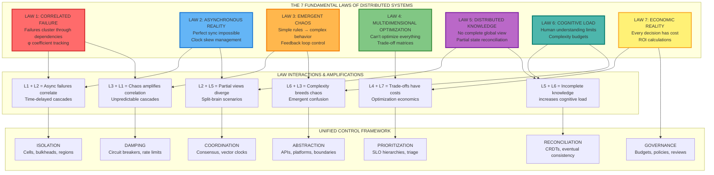

# The 7 Laws: Implementation Diagrams & Operational Playbooks

> **Transform theory into practice**: Each law comes with a production-ready diagram, metrics to track, thresholds to enforce, and runbooks you can execute today.

## Master System Diagram: How the Laws Interconnect



---

## Law 1: Correlated Failure - Implementation Diagram

```mermaid
%%{init: {'theme': 'base', 'themeVariables': { 'primaryColor': '#fff', 'primaryTextColor': '#000', 'primaryBorderColor': '#000', 'lineColor': '#000', 'secondaryColor': '#f5f5f5', 'tertiaryColor': '#ddd'}}}%%
flowchart TB
    subgraph HEADER["LAW 1: CORRELATED FAILURE - φ Control System"]
        PROBLEM["Major Incidents Teaching Correlation:
        • Facebook 2021: BGP cascade φ=0.95 → 6hr outage $360M
        • AWS 2017: S3 tools dependency → recovery tools failed
        • Knight Capital 2012: Deploy sync φ=1.0 → $440M in 45min
        YOUR REALITY: Critical paths likely φ>0.7"]
    end
    
    subgraph MATH["Correlation Mathematics"]
        FORMULA["P(both fail) = P(A)×P(B) + φ×√[P(A)×(1-P(A))×P(B)×(1-P(B))]
        Where φ is correlation coefficient (0=independent, 1=lockstep)
        Track as binary 0/1 failure indicators over 5min windows"]
        
        EXAMPLE["Example: Two 99.9% services
        Independent: P=0.001² = 10⁻⁶
        With φ=0.9: P=0.001×0.9 = 9×10⁻⁴
        900× more failures than expected!"]
    end
    
    subgraph ENGINE["φ Correlation Engine"]
        INPUTS["INPUTS<br/>• RUM success rates<br/>• Service health<br/>• Resource saturation<br/>• Error rates"]
        COMPUTE["COMPUTE<br/>Window: 5min sliding<br/>Pairs: All edges<br/>ML: LSTM forecast<br/>Store: TimescaleDB"]
        ALERTS["ALERTS<br/>φ>0.5: Warning<br/>φ>0.7: Emergency<br/>φ>0.9: Crisis<br/>Attach: root cause"]
    end
    
    subgraph CONTROLS["Production Controls"]
        ISOLATION["ISOLATION<br/>• 10 cells @ 10% users<br/>• Inter-cell φ<0.1<br/>• No shared state<br/>• Separate databases"]
        BULKHEADS["BULKHEADS<br/>• Thread pools: 50/100/30<br/>• Connections: Per cell<br/>• Memory: 30% reserved<br/>• CPU: cgroups quotas"]
        BREAKERS["BREAKERS<br/>• Per dependency<br/>• 50% error threshold<br/>• 10s window<br/>• 30s half-open"]
    end
    
    subgraph PLAYBOOK["Operational Playbook"]
        P1["φ<0.3: Monitor only"]
        P2["φ 0.3-0.5: Review dependencies"]
        P3["φ 0.5-0.7: Deploy breakers, add bulkheads"]
        P4["φ>0.7: Emergency isolation, kill Bronze"]
        P5["φ>0.9: Crisis mode, evacuate region"]
    end
    
    PROBLEM --> MATH
    MATH --> ENGINE
    INPUTS --> COMPUTE --> ALERTS
    ALERTS --> CONTROLS
    CONTROLS --> PLAYBOOK
    
    style HEADER fill:#ffcdd2,stroke:#d32f2f,stroke-width:3px
    style ALERTS fill:#fff3e0,stroke:#ff6f00,stroke-width:3px
    style P4 fill:#ffcdd2,stroke:#d32f2f,stroke-width:2px
    style P5 fill:#b71c1c,color:#fff,stroke:#d32f2f,stroke-width:3px
```



### Law 1 Implementation Checklist

```yaml
# Monitoring Setup
correlation_monitoring:
  metrics:
    - correlation_phi{service_a,service_b}: gauge, 5min window
    - blast_radius_percent: gauge, % users affected
    - gray_divergence: |RUM_success - internal_success|
  
  alerts:
    - name: high_correlation
      expr: correlation_phi > 0.7
      for: 2m
      severity: emergency
      
    - name: correlation_rising
      expr: rate(correlation_phi[5m]) > 0.1
      severity: warning

# Cell Architecture
cells:
  count: 10
  user_percentage: 10%
  routing: SHA256(user_id) % 10
  isolation:
    - separate_databases: true
    - separate_caches: true
    - separate_queues: true
    - cross_cell_calls: prohibited

# Resource Bulkheads
bulkheads:
  thread_pools:
    critical: 50
    regular: 100
    batch: 30
    admin: 20
  
  connection_pools:
    database_per_cell: 100
    cache_per_cell: 200
    http_per_cell: 1000

# Emergency Response
runbooks:
  high_correlation:
    - trip_circuit_breakers()
    - increase_bulkhead_isolation()
    - kill_bronze_features()
    - if phi > 0.9: initiate_evacuation()
```

---

## Law 2: Asynchronous Reality - Implementation Diagram

```mermaid
flowchart TB
    subgraph HEADER["LAW 2: ASYNCHRONOUS REALITY - Time & Consensus Control"]
        PROBLEM["Clock Skew Reality:
        • Google: 7ms average skew despite atomic clocks
        • AWS: 86ms P99 skew across regions
        • Azure: 125ms maximum observed drift
        YOUR REALITY: Distributed time is always uncertain"]
    end
    
    subgraph TIMING["Time Management System"]
        NTP["NTP HIERARCHY<br/>• Stratum 1: GPS/Atomic<br/>• Stratum 2: Regional<br/>• Stratum 3: Local<br/>• Sync: Every 64s"]
        TRUETIME["TRUETIME BOUNDS<br/>• Earliest: T - ε<br/>• Latest: T + ε<br/>• Spanner waits 2ε<br/>• Typical ε: 7ms"]
        VECTOR["VECTOR CLOCKS<br/>• Per-node counters<br/>• Causal ordering<br/>• Conflict detection<br/>• Merge on sync"]
    end
    
    subgraph CONSENSUS["Consensus Mechanisms"]
        RAFT["RAFT<br/>• Leader election<br/>• Log replication<br/>• Term numbers<br/>• Majority quorum"]
        PAXOS["PAXOS<br/>• Prepare phase<br/>• Accept phase<br/>• Multi-Paxos<br/>• Flexible quorum"]
        BYZANTINE["BYZANTINE<br/>• 3f+1 nodes<br/>• Message rounds<br/>• Crypto signatures<br/>• PBFT/Tendermint"]
    end
    
    subgraph EVENTUAL["Eventual Consistency Controls"]
        CRDT["CRDTs<br/>• G-Counter: Increment only<br/>• PN-Counter: Inc/Dec<br/>• OR-Set: Add/Remove<br/>• LWW-Register: Timestamps"]
        CONFLICT["CONFLICT RESOLUTION<br/>• Last-Writer-Wins<br/>• Multi-Value<br/>• Semantic merge<br/>• Application callback"]
        ANTIENTROPY["ANTI-ENTROPY<br/>• Merkle trees<br/>• Gossip protocol<br/>• Read repair<br/>• Hinted handoff"]
    end
    
    subgraph PATTERNS["Production Patterns"]
        SAGA["SAGA PATTERN<br/>• Compensating txns<br/>• Forward recovery<br/>• Backward recovery<br/>• Timeout handling"]
        OUTBOX["OUTBOX PATTERN<br/>• Transactional write<br/>• CDC publishing<br/>• At-least-once<br/>• Idempotency keys"]
        EVENT["EVENT SOURCING<br/>• Immutable log<br/>• Event replay<br/>• Snapshots<br/>• Projections"]
    end
    
    subgraph PLAYBOOK["Async Playbook"]
        AP1["Clock skew >100ms: Alert, investigate NTP"]
        AP2["Split-brain detected: Fence old leader"]
        AP3["Consensus stuck: Check quorum, network partitions"]
        AP4["High replication lag: Throttle writes, add capacity"]
        AP5["Conflict rate >1%: Review resolution strategy"]
    end
    
    PROBLEM --> TIMING
    TIMING --> CONSENSUS
    CONSENSUS --> EVENTUAL
    EVENTUAL --> PATTERNS
    PATTERNS --> PLAYBOOK
    
    style HEADER fill:#e3f2fd,stroke:#1976d2,stroke-width:3px
    style TRUETIME fill:#bbdefb,stroke:#1565c0,stroke-width:2px
    style RAFT fill:#90caf9,stroke:#1976d2,stroke-width:2px
    style AP1 fill:#fff3e0,stroke:#ff6f00,stroke-width:2px
```



### Law 2 Implementation Checklist

```yaml
# Clock Management
time_sync:
  ntp_config:
    servers:
      - time1.google.com
      - time2.google.com
      - pool.ntp.org
    max_offset: 100ms
    panic_threshold: 1000ms
    
  monitoring:
    - clock_offset_ms: histogram
    - ntp_sync_failures: counter
    - time_uncertainty_ms: gauge

# Consensus Configuration
consensus:
  raft:
    election_timeout: 150-300ms
    heartbeat_interval: 50ms
    snapshot_threshold: 10000 entries
    max_append_entries: 100
    
  quorum:
    write_quorum: N/2 + 1
    read_quorum: N/2 + 1
    availability: choose AP or CP

# Eventual Consistency
eventual_consistency:
  replication_lag_target: 100ms
  conflict_resolution: last_writer_wins
  anti_entropy_interval: 30s
  
  crdts:
    counters: g_counter
    sets: or_set
    registers: lww_register
    maps: or_map

# Production Patterns
patterns:
  saga:
    timeout: 30s
    max_retries: 3
    compensation_deadline: 5m
    
  outbox:
    polling_interval: 100ms
    batch_size: 100
    retention: 7d
    
  event_sourcing:
    snapshot_frequency: 1000 events
    event_retention: 90d
    projection_lag_max: 1s
```

---

## Law 3: Emergent Chaos - Implementation Diagram

```mermaid
flowchart TB
    subgraph HEADER["LAW 3: EMERGENT CHAOS - Feedback Loop Control"]
        PROBLEM["Chaos Examples:
        • Redis Thundering Herd: 10K clients retry → cascade
        • Kafka Rebalance Storm: Consumer group thrashing
        • K8s Cluster Autoscaler: Oscillation between scale up/down
        YOUR REALITY: Simple rules create complex disasters"]
    end
    
    subgraph FEEDBACK["Feedback Loop Detection"]
        POSITIVE["POSITIVE LOOPS<br/>• Retry storms<br/>• Cache stampedes<br/>• Cascading timeouts<br/>• Resource starvation"]
        NEGATIVE["NEGATIVE LOOPS<br/>• Circuit breakers<br/>• Rate limiters<br/>• Backpressure<br/>• Load shedding"]
        DETECTION["DETECTION<br/>• Spectral analysis<br/>• Phase plots<br/>• Lyapunov exponents<br/>• Correlation matrices"]
    end
    
    subgraph DAMPING["Chaos Damping Controls"]
        JITTER["JITTER<br/>• Retry: ±50% random<br/>• Cron: Prime intervals<br/>• Health: 0-30s spread<br/>• Timeout: ±10% variance"]
        LIMITS["RATE LIMITS<br/>• Token bucket<br/>• Sliding window<br/>• Adaptive limits<br/>• Per-user quotas"]
        BACKPRESS["BACKPRESSURE<br/>• Queue bounds<br/>• TCP congestion<br/>• Reactive streams<br/>• Work stealing"]
    end
    
    subgraph STABILITY["Stability Patterns"]
        HYSTRIX["HYSTRIX PATTERN<br/>• Timeout control<br/>• Circuit breaker<br/>• Fallback logic<br/>• Request collapsing"]
        DEBOUNCE["DEBOUNCE<br/>• Event coalescing<br/>• Time windows<br/>• Duplicate suppression<br/>• State machines"]
        GOVERNOR["GOVERNOR<br/>• PID controller<br/>• Adaptive thresholds<br/>• Smoothing functions<br/>• Kalman filters"]
    end
    
    subgraph CHAOS_ENG["Chaos Engineering"]
        EXPERIMENTS["EXPERIMENTS<br/>• Latency injection<br/>• Packet loss<br/>• CPU stress<br/>• Memory pressure"]
        GAMEDAYS["GAME DAYS<br/>• Region failure<br/>• Dependency loss<br/>• Data corruption<br/>• Time travel"]
        AUTOMATION["AUTOMATION<br/>• Continuous chaos<br/>• Blast radius control<br/>• Auto-abort<br/>• Learning system"]
    end
    
    subgraph PLAYBOOK["Chaos Response Playbook"]
        CP1["Retry storm detected: Enable request coalescing"]
        CP2["Oscillation observed: Increase damping factor"]
        CP3["Cascade starting: Trip circuit breakers"]
        CP4["Feedback loop identified: Add jitter, reduce gain"]
        CP5["System chaotic: Reduce load, simplify interactions"]
    end
    
    PROBLEM --> FEEDBACK
    FEEDBACK --> DAMPING
    DAMPING --> STABILITY
    STABILITY --> CHAOS_ENG
    CHAOS_ENG --> PLAYBOOK
    
    style HEADER fill:#ffe0b2,stroke:#f57c00,stroke-width:3px
    style POSITIVE fill:#ffccbc,stroke:#ff5722,stroke-width:2px
    style NEGATIVE fill:#c8e6c9,stroke:#4caf50,stroke-width:2px
    style CP3 fill:#ffcdd2,stroke:#d32f2f,stroke-width:2px
```



### Law 3 Implementation Checklist

```yaml
# Feedback Loop Monitoring
chaos_detection:
  metrics:
    - retry_rate: rate of retry attempts
    - oscillation_amplitude: variance over time
    - cascade_depth: max call chain depth
    - feedback_gain: amplification factor
  
  analysis:
    - spectral_analysis_window: 5m
    - phase_space_dimensions: 3
    - lyapunov_threshold: 0.1
    - correlation_lag: 30s

# Damping Controls
damping:
  jitter:
    retry_jitter: 0.5  # ±50%
    timeout_jitter: 0.1  # ±10%
    cron_offset: random_prime()
    
  rate_limiting:
    algorithm: token_bucket
    rate: 1000/s
    burst: 2000
    per_user_limit: 100/s
    
  backpressure:
    queue_high_watermark: 1000
    queue_low_watermark: 100
    tcp_congestion_control: cubic
    work_stealing_enabled: true

# Stability Patterns
stability:
  circuit_breaker:
    error_threshold: 0.5
    request_volume: 20
    sleep_window: 30s
    timeout: 3s
    
  debounce:
    window: 100ms
    max_wait: 1s
    leading_edge: false
    trailing_edge: true
    
  pid_controller:
    kp: 0.5  # proportional gain
    ki: 0.1  # integral gain
    kd: 0.05  # derivative gain
    setpoint: target_value

# Chaos Engineering
chaos:
  experiments:
    latency:
      delay: 100ms
      jitter: 50ms
      correlation: 0.5
      
    failure:
      error_rate: 0.1
      error_code: 503
      
    resource:
      cpu_percent: 80
      memory_percent: 90
      
  schedule:
    daily: single_service_failure
    weekly: dependency_failure
    monthly: region_failure
```

---

## Law 4: Multidimensional Optimization - Implementation Diagram

```mermaid
flowchart TB
    subgraph HEADER["LAW 4: MULTIDIMENSIONAL OPTIMIZATION - Trade-off Control"]
        PROBLEM["Optimization Reality:
        • CAP: Choose 2 of 3 (Consistency, Availability, Partition tolerance)
        • PACELC: CAP + Latency/Consistency trade-off
        • Cost vs Performance vs Reliability vs Security
        YOUR REALITY: Every optimization sacrifices something"]
    end
    
    subgraph DIMENSIONS["Optimization Dimensions"]
        PERF["PERFORMANCE<br/>• Latency: P50/P99<br/>• Throughput: QPS<br/>• Bandwidth: MB/s<br/>• IOPS: Operations/s"]
        RELI["RELIABILITY<br/>• Availability: 9s<br/>• Durability: RPO/RTO<br/>• Error rate: SLO<br/>• MTTR: Minutes"]
        COST["COST<br/>• Infrastructure: $/mo<br/>• Operations: FTE<br/>• Development: Velocity<br/>• Opportunity: Revenue"]
        SCALE["SCALABILITY<br/>• Horizontal: Nodes<br/>• Vertical: Resources<br/>• Geographic: Regions<br/>• Elasticity: Auto-scale"]
    end
    
    subgraph TRADEOFFS["Trade-off Matrices"]
        MATRIX["DECISION MATRIX<br/>┌─────────┬────┬────┬────┐<br/>│ Option  │Perf│Cost│Reli│<br/>├─────────┼────┼────┼────┤<br/>│ Caching │ 9  │ 6  │ 7  │<br/>│ Replica │ 7  │ 4  │ 9  │<br/>│ Sharding│ 8  │ 5  │ 6  │<br/>└─────────┴────┴────┴────┘"]
        PARETO["PARETO FRONTIER<br/>• Non-dominated solutions<br/>• Efficiency boundary<br/>• Optimal trade-offs<br/>• Decision points"]
        CONSTRAINTS["CONSTRAINTS<br/>• Budget: $100K/mo<br/>• Latency: <100ms P99<br/>• Availability: >99.95%<br/>• Team size: 5 engineers"]
    end
    
    subgraph PATTERNS["Optimization Patterns"]
        TIERED["TIERED ARCHITECTURE<br/>• Hot: SSD + Memory<br/>• Warm: SSD<br/>• Cold: HDD<br/>• Archive: S3/Glacier"]
        ADAPTIVE["ADAPTIVE SYSTEMS<br/>• Auto-scaling<br/>• Dynamic routing<br/>• Load-based sharding<br/>• Predictive caching"]
        HYBRID["HYBRID SOLUTIONS<br/>• Read replicas + cache<br/>• Sync + async replication<br/>• SQL + NoSQL<br/>• On-prem + cloud"]
    end
    
    subgraph DECISION["Decision Framework"]
        SLO["SLO HIERARCHY<br/>• P1: Auth, Payment<br/>• P2: Core features<br/>• P3: Analytics<br/>• P4: Background"]
        SCORING["SCORING MODEL<br/>Weight × Score:<br/>• Perf: 0.3 × score<br/>• Cost: 0.3 × score<br/>• Reliability: 0.4 × score"]
        REVIEW["REVIEW GATES<br/>• Architecture review<br/>• Cost analysis<br/>• Risk assessment<br/>• Trade-off doc"]
    end
    
    subgraph PLAYBOOK["Optimization Playbook"]
        OP1["Define dimensions and weights"]
        OP2["Measure current state baseline"]
        OP3["Generate Pareto frontier options"]
        OP4["Apply constraints and SLOs"]
        OP5["Select optimal trade-off point"]
    end
    
    PROBLEM --> DIMENSIONS
    DIMENSIONS --> TRADEOFFS
    TRADEOFFS --> PATTERNS
    PATTERNS --> DECISION
    DECISION --> PLAYBOOK
    
    style HEADER fill:#e8f5e9,stroke:#4caf50,stroke-width:3px
    style MATRIX fill:#f5f5f5,stroke:#616161,stroke-width:2px
    style PARETO fill:#c8e6c9,stroke:#388e3c,stroke-width:2px
    style SLO fill:#fff9c4,stroke:#f9a825,stroke-width:2px
```



### Law 4 Implementation Checklist

```yaml
# Dimension Tracking
optimization_dimensions:
  performance:
    metrics:
      - latency_p50_ms: target < 50
      - latency_p99_ms: target < 100
      - throughput_qps: target > 10000
      - bandwidth_mbps: target > 100
      
  reliability:
    metrics:
      - availability_percent: target > 99.95
      - error_rate: target < 0.001
      - mttr_minutes: target < 5
      - data_durability: target > 99.999999999
      
  cost:
    metrics:
      - infrastructure_cost_monthly: target < 100000
      - cost_per_request: target < 0.001
      - engineering_hours: target < 40/week
      - technical_debt_ratio: target < 0.2
      
  scalability:
    metrics:
      - max_nodes: target > 1000
      - scale_time_seconds: target < 60
      - efficiency_ratio: target > 0.8
      - geographic_regions: target > 3

# Trade-off Analysis
tradeoff_matrix:
  options:
    - name: aggressive_caching
      performance: 9
      reliability: 7
      cost: 6
      scalability: 8
      
    - name: read_replicas
      performance: 7
      reliability: 9
      cost: 4
      scalability: 9
      
    - name: sharding
      performance: 8
      reliability: 6
      cost: 5
      scalability: 10
      
  weights:
    performance: 0.3
    reliability: 0.4
    cost: 0.2
    scalability: 0.1

# Decision Framework
decision:
  slo_tiers:
    p1_critical:
      - authentication
      - payment_processing
      - core_api
      
    p2_important:
      - user_profiles
      - search
      - messaging
      
    p3_standard:
      - analytics
      - reporting
      - notifications
      
    p4_background:
      - batch_jobs
      - maintenance
      - backups
      
  review_requirements:
    - architecture_review: required
    - cost_benefit_analysis: required
    - risk_assessment: required
    - rollback_plan: required
```

---

## Law 5: Distributed Knowledge - Implementation Diagram

```mermaid
flowchart TB
    subgraph HEADER["LAW 5: DISTRIBUTED KNOWLEDGE - Partial View Management"]
        PROBLEM["Knowledge Distribution Reality:
        • Lamport: 'A distributed system is one where a computer you didn't know existed can render your computer unusable'
        • Google: 100K+ servers, no single view
        • Netflix: Service discovery changes 1000x/day
        YOUR REALITY: Every node has incomplete, stale knowledge"]
    end
    
    subgraph KNOWLEDGE["Knowledge Distribution"]
        GOSSIP["GOSSIP PROTOCOL<br/>• Fanout: 3 nodes<br/>• Interval: 1s<br/>• Max rounds: log(N)<br/>• Anti-entropy: 30s"]
        CONSENSUS["CONSENSUS<br/>• Raft/Paxos quorum<br/>• Majority agreement<br/>• Leader election<br/>• Split-brain fence"]
        CRDT["CRDTs<br/>• Merge without consensus<br/>• Commutative ops<br/>• Idempotent updates<br/>• Eventually consistent"]
    end
    
    subgraph DISCOVERY["Service Discovery"]
        REGISTRY["SERVICE REGISTRY<br/>• Consul/Eureka/etcd<br/>• Health checks: 10s<br/>• TTL: 30s<br/>• Graceful shutdown"]
        DNS["DNS DISCOVERY<br/>• SRV records<br/>• Health checking<br/>• Geographic routing<br/>• Weighted responses"]
        MESH["SERVICE MESH<br/>• Envoy/Istio/Linkerd<br/>• Sidecar proxy<br/>• Circuit breaking<br/>• Load balancing"]
    end
    
    subgraph COORDINATION["Coordination Patterns"]
        LEASE["DISTRIBUTED LOCKS<br/>• Lease time: 30s<br/>• Fencing tokens<br/>• Lock-free alternatives<br/>• Deadlock detection"]
        QUEUE["WORK QUEUES<br/>• At-least-once<br/>• Visibility timeout<br/>• Dead letter queue<br/>• Priority levels"]
        PUBSUB["PUB/SUB<br/>• Topic partitions<br/>• Consumer groups<br/>• Offset management<br/>• Backpressure"]
    end
    
    subgraph RECONCILE["Reconciliation Strategies"]
        REPAIR["READ REPAIR<br/>• On read divergence<br/>• Quorum reads<br/>• Version vectors<br/>• Timestamp ordering"]
        HINTS["HINTED HANDOFF<br/>• Store hints locally<br/>• Retry delivery<br/>• TTL expiration<br/>• Hint overflow"]
        MERKLE["MERKLE TREES<br/>• Tree comparison<br/>• Minimal transfer<br/>• Periodic sync<br/>• Range queries"]
    end
    
    subgraph PLAYBOOK["Distributed Knowledge Playbook"]
        DK1["Split-brain detected: Fence minority partition"]
        DK2["Discovery lag >30s: Check registry health"]
        DK3["Gossip convergence slow: Increase fanout"]
        DK4["State divergence: Trigger anti-entropy"]
        DK5["Consensus stuck: Check network partitions"]
    end
    
    PROBLEM --> KNOWLEDGE
    KNOWLEDGE --> DISCOVERY
    DISCOVERY --> COORDINATION
    COORDINATION --> RECONCILE
    RECONCILE --> PLAYBOOK
    
    style HEADER fill:#f3e5f5,stroke:#7b1fa2,stroke-width:3px
    style GOSSIP fill:#e1bee7,stroke:#6a1b9a,stroke-width:2px
    style CONSENSUS fill:#ce93d8,stroke:#8e24aa,stroke-width:2px
    style DK1 fill:#ffcdd2,stroke:#d32f2f,stroke-width:2px
```



### Law 5 Implementation Checklist

```yaml
# Gossip Protocol
gossip:
  fanout: 3  # nodes to gossip to
  interval: 1s
  max_rounds: 10  # log(N) for N nodes
  message_size: 1KB
  
  anti_entropy:
    interval: 30s
    method: merkle_tree
    batch_size: 100
    
  failure_detection:
    phi_threshold: 8
    heartbeat_interval: 1s
    suspect_timeout: 5s

# Service Discovery
discovery:
  registry:
    backend: consul  # or etcd, eureka
    health_check_interval: 10s
    deregister_critical: 30s
    
  dns:
    ttl: 30s
    srv_records: true
    health_checks: true
    
  service_mesh:
    proxy: envoy
    circuit_breaker:
      consecutive_errors: 5
      interval: 30s
      
# Coordination
coordination:
  distributed_lock:
    implementation: redlock
    lease_time: 30s
    quorum: 3/5
    fencing: true
    
  work_queue:
    visibility_timeout: 60s
    max_retries: 3
    dlq_threshold: 3
    
  pubsub:
    partitions: 100
    replication_factor: 3
    min_isr: 2
    acks: all

# Reconciliation
reconciliation:
  read_repair:
    enabled: true
    quorum_reads: true
    repair_chance: 0.1
    
  hinted_handoff:
    enabled: true
    hint_ttl: 3h
    max_hints: 10000
    
  merkle_tree:
    sync_interval: 1h
    tree_depth: 10
    hash_function: sha256
```

---

## Law 6: Cognitive Load - Implementation Diagram

```mermaid
flowchart TB
    subgraph HEADER["LAW 6: COGNITIVE LOAD - Human Capacity Management"]
        PROBLEM["Cognitive Reality:
        • Miller's Law: 7±2 items in working memory
        • Dunbar's Number: ~150 stable relationships
        • Context switching: 23min to refocus
        YOUR REALITY: Complexity exceeds human capacity"]
    end
    
    subgraph MEASUREMENT["Complexity Measurement"]
        METRICS["COMPLEXITY METRICS<br/>• Cyclomatic: <10 good<br/>• Cognitive: <15 good<br/>• Dependencies: <7<br/>• API surface: <20"]
        TEAM["TEAM COGNITIVE LOAD<br/>• Services owned: <5<br/>• On-call rotation: 1:4<br/>• Context switches: <3/day<br/>• Documentation: Current"]
        ARCH["ARCHITECTURE LOAD<br/>• Microservices: <50<br/>• Integration points: <20<br/>• Data stores: <5<br/>• External APIs: <10"]
    end
    
    subgraph REDUCTION["Load Reduction Strategies"]
        ABSTRACT["ABSTRACTION<br/>• Platform teams<br/>• Service mesh<br/>• API gateways<br/>• Managed services"]
        AUTOMATE["AUTOMATION<br/>• CI/CD pipelines<br/>• Auto-scaling<br/>• Self-healing<br/>• Runbooks"]
        SIMPLIFY["SIMPLIFICATION<br/>• Monolith first<br/>• Boring technology<br/>• Standard patterns<br/>• Remove features"]
    end
    
    subgraph ORGANIZATION["Team Topologies"]
        STREAM["STREAM-ALIGNED<br/>• End-to-end ownership<br/>• Customer focus<br/>• Fast flow<br/>• 5-9 people"]
        PLATFORM["PLATFORM<br/>• Self-service<br/>• Developer experience<br/>• Tools & services<br/>• Documentation"]
        ENABLING["ENABLING<br/>• Coaching<br/>• Best practices<br/>• Knowledge transfer<br/>• Time-boxed"]
        COMPLICATED["COMPLICATED SUBSYSTEM<br/>• Deep expertise<br/>• Specialized knowledge<br/>• Math/algorithms<br/>• Isolation"]
    end
    
    subgraph DOCUMENTATION["Knowledge Management"]
        RUNBOOKS["RUNBOOKS<br/>• Incident response<br/>• Common tasks<br/>• Troubleshooting<br/>• Recovery procedures"]
        ARCH_DOCS["ARCHITECTURE<br/>• Decision records<br/>• System diagrams<br/>• API docs<br/>• Data flows"]
        ONBOARD["ONBOARDING<br/>• Getting started<br/>• Dev environment<br/>• Key concepts<br/>• Team contacts"]
    end
    
    subgraph PLAYBOOK["Cognitive Load Playbook"]
        CL1["Load >80%: Add platform abstractions"]
        CL2["Context switches >5/day: Restructure teams"]
        CL3["Oncall burden high: Automate runbooks"]
        CL4["Documentation stale: Dedicated sprint"]
        CL5["Complexity growing: Simplify architecture"]
    end
    
    PROBLEM --> MEASUREMENT
    MEASUREMENT --> REDUCTION
    REDUCTION --> ORGANIZATION
    ORGANIZATION --> DOCUMENTATION
    DOCUMENTATION --> PLAYBOOK
    
    style HEADER fill:#e0f2f1,stroke:#00796b,stroke-width:3px
    style METRICS fill:#b2dfdb,stroke:#00695c,stroke-width:2px
    style STREAM fill:#80cbc4,stroke:#00796b,stroke-width:2px
    style CL1 fill:#fff3e0,stroke:#ff6f00,stroke-width:2px
```



### Law 6 Implementation Checklist

```yaml
# Complexity Metrics
complexity:
  code_metrics:
    cyclomatic_complexity: max 10
    cognitive_complexity: max 15
    method_length: max 50 lines
    class_size: max 500 lines
    
  architecture_metrics:
    services_per_team: max 5
    dependencies_per_service: max 7
    api_endpoints_per_service: max 20
    data_stores_per_service: max 2
    
  team_metrics:
    oncall_rotation_size: min 4
    context_switches_daily: max 3
    meeting_hours_weekly: max 10
    documentation_freshness_days: max 30

# Load Reduction
reduction:
  platform_services:
    - authentication_service
    - logging_platform
    - monitoring_stack
    - deployment_pipeline
    
  automation_targets:
    - incident_response: 80% automated
    - deployments: 100% automated
    - scaling: 100% automated
    - testing: 90% automated
    
  simplification:
    - prefer_monolith_until: 10 engineers
    - boring_technology_choices: true
    - feature_removal_quarterly: true
    - standard_patterns_enforced: true

# Team Topologies
teams:
  stream_aligned:
    size: 5-9
    ownership: end_to_end
    dependencies: minimize
    
  platform:
    size: 5-9
    services: self_service
    documentation: comprehensive
    
  enabling:
    size: 3-5
    engagement: time_boxed
    duration: 3_months_max
    
  complicated_subsystem:
    size: 3-7
    expertise: specialized
    interface: well_defined

# Documentation Standards
documentation:
  required_docs:
    - README.md
    - ARCHITECTURE.md
    - API.md
    - RUNBOOK.md
    - ONCALL.md
    
  decision_records:
    template: ADR
    status: [proposed, accepted, deprecated]
    review: architecture_board
    
  runbooks:
    format: step_by_step
    tested: quarterly
    automated: where_possible
```

---

## Law 7: Economic Reality - Implementation Diagram

```mermaid
flowchart TB
    subgraph HEADER["LAW 7: ECONOMIC REALITY - Cost & Value Optimization"]
        PROBLEM["Economic Truth:
        • AWS bill shock: 10x overspend common
        • Engineer time: $200K+/year fully loaded
        • Downtime: $5,600/minute average
        • Technical debt: 20% velocity reduction
        YOUR REALITY: Every decision has economic impact"]
    end
    
    subgraph COSTS["Cost Categories"]
        INFRA["INFRASTRUCTURE<br/>• Compute: $/hour<br/>• Storage: $/GB/mo<br/>• Network: $/GB<br/>• Licenses: $/seat"]
        PEOPLE["PEOPLE<br/>• Engineers: $200K/yr<br/>• On-call: $500/week<br/>• Training: $5K/person<br/>• Turnover: 150% salary"]
        OPPORTUNITY["OPPORTUNITY<br/>• Feature delay: Revenue<br/>• Tech debt: Velocity<br/>• Downtime: SLA credits<br/>• Security: Breach cost"]
        OPERATIONAL["OPERATIONAL<br/>• Monitoring: $/metric<br/>• Support: $/ticket<br/>• Compliance: Audit cost<br/>• Vendor lock-in: Switch cost"]
    end
    
    subgraph OPTIMIZATION["Cost Optimization"]
        RIGHTSIZE["RIGHTSIZING<br/>• Instance types<br/>• Auto-scaling<br/>• Spot instances<br/>• Reserved capacity"]
        ARCHITECT["ARCHITECTURE<br/>• Serverless where fits<br/>• Caching layers<br/>• CDN offload<br/>• Data lifecycle"]
        ENGINEER["ENGINEERING<br/>• Build vs buy<br/>• Open source<br/>• Platform investment<br/>• Automation ROI"]
    end
    
    subgraph VALUE["Value Measurement"]
        METRICS["VALUE METRICS<br/>• Revenue per feature<br/>• Cost per transaction<br/>• LTV:CAC ratio<br/>• Time to market"]
        ROI["ROI CALCULATION<br/>• Investment: $X<br/>• Return: $Y<br/>• Payback: Months<br/>• NPV: Present value"]
        TRADEOFF["TRADE-OFF ANALYSIS<br/>• Performance vs cost<br/>• Reliability vs cost<br/>• Security vs cost<br/>• Speed vs quality"]
    end
    
    subgraph GOVERNANCE["Financial Governance"]
        BUDGETS["BUDGETS<br/>• Per team: $10K/mo<br/>• Per service: Tagged<br/>• Alerts: 80% threshold<br/>• Reviews: Monthly"]
        APPROVAL["APPROVAL GATES<br/>• <$1K: Team lead<br/>• <$10K: Director<br/>• <$100K: VP<br/>• >$100K: C-level"]
        CHARGEBACK["CHARGEBACK<br/>• Tag everything<br/>• Cost allocation<br/>• Show back reports<br/>• Team accountability"]
    end
    
    subgraph PLAYBOOK["Economic Playbook"]
        EC1["Cost spike >20%: Immediate investigation"]
        EC2["Unused resources: Automated cleanup"]
        EC3["Build vs buy: TCO analysis required"]
        EC4["Tech debt >30%: Dedicated reduction sprint"]
        EC5["ROI <6mo: Fast track approval"]
    end
    
    PROBLEM --> COSTS
    COSTS --> OPTIMIZATION
    OPTIMIZATION --> VALUE
    VALUE --> GOVERNANCE
    GOVERNANCE --> PLAYBOOK
    
    style HEADER fill:#fff9c4,stroke:#f9a825,stroke-width:3px
    style INFRA fill:#fff59d,stroke:#f9a825,stroke-width:2px
    style ROI fill:#ffeb3b,stroke:#f57f17,stroke-width:2px
    style EC1 fill:#ffcdd2,stroke:#d32f2f,stroke-width:2px
```



### Law 7 Implementation Checklist

```yaml
# Cost Tracking
cost_tracking:
  infrastructure:
    compute_hourly: track by instance_id
    storage_monthly: track by volume_id
    network_transfer: track by vpc_id
    database_costs: track by rds_id
    
  tagging_strategy:
    required_tags:
      - team
      - service
      - environment
      - cost_center
      - project
      
  alerts:
    daily_spike: threshold 20%
    weekly_budget: threshold 80%
    monthly_forecast: threshold 90%

# Optimization Strategies
optimization:
  compute:
    rightsizing_review: weekly
    spot_instance_percentage: 30%
    reserved_instance_coverage: 70%
    auto_scaling_enabled: true
    
  storage:
    lifecycle_policies:
      hot_tier: 0-30 days
      warm_tier: 31-90 days
      cold_tier: 91-365 days
      archive: >365 days
      
  architecture:
    serverless_evaluation: per new service
    caching_layers: required
    cdn_usage: >80% static content
    
# ROI Calculations
roi:
  investment_criteria:
    payback_period: max 12 months
    net_present_value: positive
    internal_rate_return: >15%
    
  build_vs_buy:
    factors:
      - development_cost
      - maintenance_cost
      - opportunity_cost
      - vendor_lock_in_risk
      
  technical_debt:
    measurement: story_points
    allocation: 20% per sprint
    interest_rate: 1.5x over 6 months

# Governance
governance:
  budget_allocation:
    infrastructure: 40%
    people: 40%
    tools: 10%
    buffer: 10%
    
  approval_matrix:
    level_1: # <$1000
      approver: team_lead
      sla: 1 day
      
    level_2: # <$10000
      approver: director
      sla: 3 days
      
    level_3: # <$100000
      approver: vp_engineering
      sla: 1 week
      
    level_4: # >$100000
      approver: cto
      sla: 2 weeks
      
  review_cadence:
    daily: anomaly detection
    weekly: team spend review
    monthly: executive dashboard
    quarterly: optimization planning
```

---

## Master Integration Playbook

### Cross-Law Interactions

```yaml
# When multiple laws interact
interaction_patterns:
  correlation_and_async:
    description: "Async operations can hide correlation"
    detection: "φ correlation with time lag analysis"
    mitigation: "Add temporal correlation windows"
    
  chaos_and_optimization:
    description: "Optimization can increase chaos"
    detection: "Measure feedback loop gain"
    mitigation: "Add damping before optimizing"
    
  knowledge_and_cognitive:
    description: "Distributed knowledge increases cognitive load"
    detection: "Team confusion metrics"
    mitigation: "Better abstractions and documentation"
    
  economic_and_all:
    description: "Cost constraints affect all decisions"
    detection: "ROI analysis per law"
    mitigation: "Prioritize by business impact"

# Unified Monitoring Dashboard
unified_metrics:
  law_1_correlation:
    - correlation_phi
    - blast_radius
    - cell_health
    
  law_2_async:
    - clock_skew
    - replication_lag
    - consensus_latency
    
  law_3_chaos:
    - retry_rate
    - feedback_gain
    - oscillation_amplitude
    
  law_4_optimization:
    - performance_efficiency
    - cost_efficiency
    - pareto_distance
    
  law_5_knowledge:
    - gossip_convergence
    - split_brain_incidents
    - state_divergence
    
  law_6_cognitive:
    - complexity_score
    - team_load
    - documentation_staleness
    
  law_7_economic:
    - cost_per_transaction
    - roi_achieved
    - budget_variance

# Emergency Response Priority
emergency_priority:
  1_immediate: # <1 minute
    - circuit_breakers (Law 1)
    - rate_limits (Law 3)
    - feature_flags (Law 4)
    
  2_rapid: # <5 minutes
    - bulkhead_isolation (Law 1)
    - consensus_recovery (Law 2)
    - load_shedding (Law 3)
    
  3_short: # <30 minutes
    - cell_isolation (Law 1)
    - cache_warming (Law 4)
    - documentation_update (Law 6)
    
  4_standard: # <4 hours
    - capacity_scaling (Law 7)
    - replica_promotion (Law 2)
    - team_escalation (Law 6)
```

### Implementation Roadmap

```yaml
implementation_phases:
  phase_1_foundation: # Month 1-2
    goals:
      - Establish monitoring for all 7 laws
      - Baseline current metrics
      - Identify top 3 violations per law
      
    deliverables:
      - Monitoring dashboards
      - Baseline report
      - Violation inventory
      
  phase_2_critical: # Month 3-4
    goals:
      - Fix Law 1 correlation >0.7
      - Implement Law 3 chaos controls
      - Reduce Law 6 cognitive load 30%
      
    deliverables:
      - Cell architecture
      - Circuit breakers
      - Platform abstractions
      
  phase_3_optimization: # Month 5-6
    goals:
      - Optimize Law 4 trade-offs
      - Improve Law 2 consistency
      - Enhance Law 5 coordination
      
    deliverables:
      - Trade-off framework
      - Consistency SLOs
      - Service mesh
      
  phase_4_excellence: # Month 7-8
    goals:
      - Achieve Law 7 ROI targets
      - Full automation of responses
      - Team training complete
      
    deliverables:
      - Cost optimization
      - Automated playbooks
      - Trained teams

success_criteria:
  - No φ correlation >0.3 sustained
  - Clock skew <100ms P99
  - No positive feedback loops
  - Clear trade-off decisions
  - <5s gossip convergence
  - Cognitive complexity <15
  - Positive ROI all initiatives
```

---

## Quick Reference Cards

### Law 1: Correlated Failure
```
DETECT: φ > 0.7 between services
ACTION: Deploy cells and bulkheads
TARGET: φ < 0.3 for all pairs
```

### Law 2: Asynchronous Reality
```
DETECT: Clock skew > 100ms
ACTION: NTP sync, eventual consistency
TARGET: Convergence < 5 seconds
```

### Law 3: Emergent Chaos
```
DETECT: Retry storms, oscillations
ACTION: Add jitter, damping controls
TARGET: No positive feedback loops
```

### Law 4: Multidimensional Optimization
```
DETECT: Conflicting requirements
ACTION: Pareto analysis, clear trade-offs
TARGET: Documented decision matrix
```

### Law 5: Distributed Knowledge
```
DETECT: Split-brain, state divergence
ACTION: Gossip protocol, CRDTs
TARGET: Convergence < log(N) rounds
```

### Law 6: Cognitive Load
```
DETECT: Team confusion, high complexity
ACTION: Abstract, automate, document
TARGET: Complexity score < 15
```

### Law 7: Economic Reality
```
DETECT: Cost overruns, low ROI
ACTION: Optimize, rightsize, govern
TARGET: ROI > 15%, payback < 12mo
```

---

## Conclusion

You now have comprehensive implementation diagrams and playbooks for all 7 fundamental laws of distributed systems. Each law includes:

1. **Visual diagram** showing the problem, controls, and solutions
2. **Implementation checklist** with specific configurations
3. **Monitoring metrics** to track compliance
4. **Operational playbooks** for response
5. **Success criteria** to measure progress

Use these as living documents - update them based on your incidents, learnings, and system evolution. The laws are immutable, but your responses to them should continuously improve.

Remember: **You can't violate these laws, but you can design systems that respect them.**