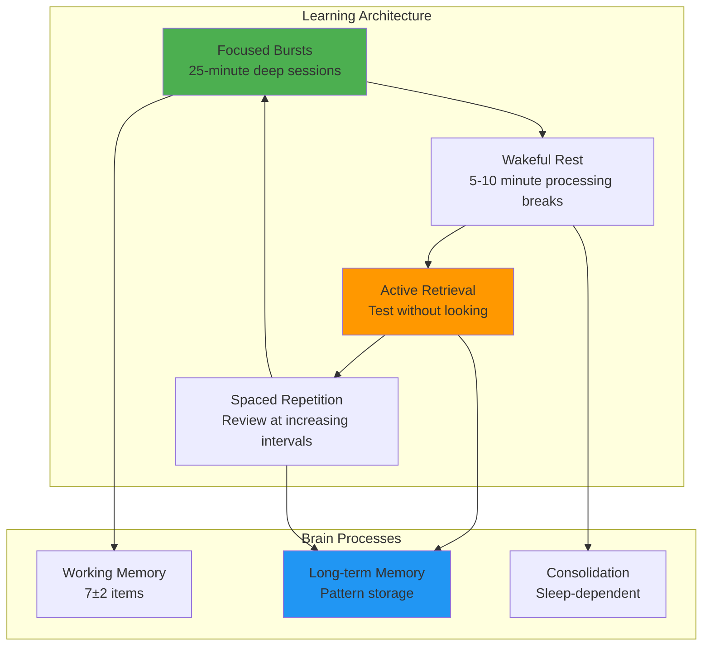
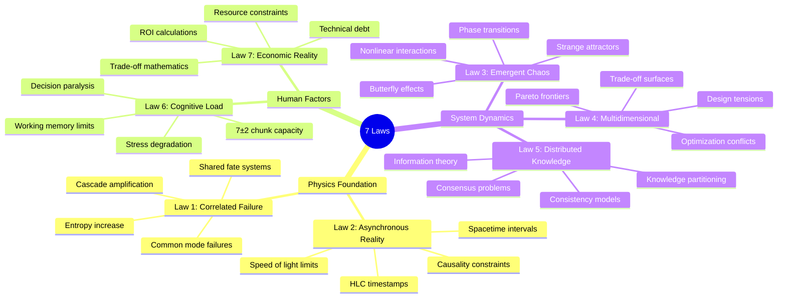
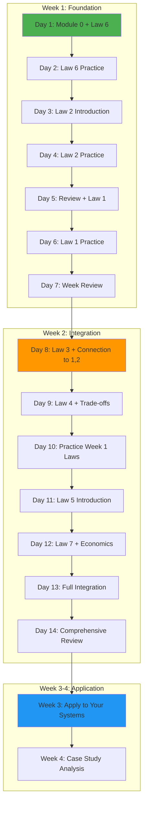

# Module 0: How to Learn the 7 Fundamental Laws

!!! abstract "The Apex Learner's Protocol"
    This module implements evidence-based learning strategies to ensure maximum retention and practical application of the 7 Fundamental Laws. Based on cognitive science research, you'll learn through **Focused Bursts**, **Wakeful Rest**, **Active Retrieval**, and **Spaced Repetition**.

## Foundation: The Neuroscience of Deep Learning

### Why Most Technical Learning Fails

Traditional approach: Read documentation → Watch videos → Hope it sticks

**Reality**: The human brain forgets 50% of new information within 24 hours (Ebbinghaus Forgetting Curve). Technical concepts require **active encoding** to move from working memory to long-term storage.

### The Four Pillars of Retention



### Core Concepts Explained

**Focused Bursts (25 minutes)**
- Single-task attention on one law at a time
- Phone in airplane mode, notifications off
- Active note-taking using provided templates

**Wakeful Rest (5-10 minutes)**
- No screens, no input - let your brain process
- Walk, stare out window, or sit quietly
- Brain consolidates information during this time

**Active Retrieval**
- Test yourself WITHOUT looking at notes
- Explain concepts aloud as if teaching
- Use flashcards and practice problems

**Spaced Repetition**
- Review at calculated intervals: 1 day, 3 days, 7 days, 21 days
- Increases retention from 20% to 80%+
- Prevents "illusion of knowledge"

### The Desirable Difficulty Principle

!!! warning "Expect This to Feel Hard"
    If learning feels easy, you're probably not learning. **Desirable difficulty** creates stronger neural pathways. When you struggle to recall a concept, that struggle strengthens the memory trace.
    
    **Normal feelings**: Confusion, mental fatigue, "I don't get it yet"
    **Concerning feelings**: Overwhelm, panic, "This is impossible"

## Visual Skill Map: The 7 Laws Interconnected



### The 80/20 Core Concepts (Most Fundamental)

**Level 1: Start Here (20% effort, 80% impact)**
1. **Law 6: Cognitive Load** - Understand human limits first
2. **Law 2: Asynchronous Reality** - Physics governs everything
3. **Law 1: Correlated Failure** - Why things fail together

**Level 2: Build Understanding**
4. **Law 3: Emergent Chaos** - System-level behaviors
5. **Law 4: Multidimensional Optimization** - Trade-off thinking

**Level 3: Advanced Mastery**
6. **Law 5: Distributed Knowledge** - Information theory
7. **Law 7: Economic Reality** - Business constraints

### Progression Pathway



## Learning Tools & Templates

### Learner's Preparation Checklist

**Physical Environment**
- [ ] Quiet space with minimal distractions
- [ ] Phone in airplane mode or different room
- [ ] Water bottle and comfortable temperature
- [ ] Timer set for 25-minute focused bursts
- [ ] Notebook and pen (handwriting aids retention)

**Mental Preparation**
- [ ] Clear goal for this session (which law, which section)
- [ ] Previous session's notes reviewed briefly (2 minutes)
- [ ] Mind cleared of urgent tasks (write them down first)
- [ ] Energy level assessed (tired? take a break first)

**Digital Setup**
- [ ] All non-essential browser tabs closed
- [ ] Notifications disabled (Slack, email, etc.)
- [ ] Note-taking app ready (or physical notebook)
- [ ] Timer app or website ready

### Focus Block Note-Taking Template

```markdown
# Focus Block: [Law Name] - [Date]

## Session Goal
What specific outcome do I want from this 25-minute session?

## Pre-Session State
- Energy level (1-10): 
- Confidence with this topic (1-10):
- One thing I already know about this:

## Active Notes (During Reading)
### Key Concepts
- 
- 
- 

### Questions That Arise
- 
- 
- 

### Connections to Previous Laws
- 
- 
- 

### Real-World Examples I Can Think Of
- 
- 
- 

## Post-Session Reflection
### What I Learned (No Looking Back)
Write for 2 minutes without checking notes:


### Confidence Level Now (1-10):

### Next Session Goal:

## Spaced Repetition Tracking
- First review scheduled: [Date + 1 day]
- Second review scheduled: [Date + 3 days]  
- Third review scheduled: [Date + 7 days]
- Mastery review scheduled: [Date + 21 days]
```

### Active Retrieval Practice Schedule

**Daily Retrieval (5 minutes each morning)**
- Without looking at notes, explain yesterday's law to yourself
- Draw the key diagram from memory
- List 3 practical applications

**Weekly Retrieval (15 minutes every Sunday)**
- Create a mind map of all laws learned so far
- Write out connections between laws
- Identify which law applies to a current work challenge

**Monthly Mastery Check (45 minutes)**
- Teach all 7 laws to someone else (or record yourself)
- Solve new case studies not in the materials
- Apply laws to analyze a system you haven't studied before

### Spaced Repetition Calendar Template

```
Week 1: Learn Laws 1-3
├── Day 1: Law 6 (first exposure)
├── Day 2: Law 6 (review) + Law 2 (first exposure)  
├── Day 3: Law 6 (test) + Law 2 (review) + Law 1 (first exposure)
├── Day 4: Law 2 (test) + Law 1 (review)
├── Day 5: Law 6 (spaced test) + Law 1 (test)
├── Day 6: All three laws integration
└── Day 7: Rest or light review

Week 2: Add Laws 4-5
├── Day 8: Previous laws (quick test) + Law 3 (first exposure)
├── Day 9: Law 3 (review) + Law 4 (first exposure)
├── Day 10: Law 3 (test) + Law 4 (review)  
├── Day 11: Week 1 laws (spaced review) + Law 5 (first exposure)
├── Day 12: Law 4 (test) + Law 5 (review) + Law 7 (first exposure)
├── Day 13: All laws integration practice
└── Day 14: Comprehensive review and connections

Week 3-4: Application and Mastery
```

### Self-Assessment Rubrics

**Individual Law Mastery (Rate 1-5 for each)**

```markdown
## Law Understanding Rubric

### Conceptual Understanding
1 = Can't explain it
2 = Can repeat definition but don't understand
3 = Understand concept but can't apply
4 = Can apply to familiar examples  
5 = Can apply to novel situations and teach others

### Mathematical Foundation  
1 = Don't understand any formulas
2 = Recognize formulas but can't use them
3 = Can plug numbers into formulas
4 = Understand derivations and assumptions
5 = Can derive formulas and identify limitations

### Real-World Application
1 = No idea how this applies to work
2 = Can recognize when others point it out
3 = Can identify applications in my systems
4 = Can design solutions using this law
5 = Can teach others to apply it to their systems

### Integration with Other Laws
1 = This law exists in isolation
2 = Know there are connections but can't explain
3 = Can explain 1-2 connections
4 = Understand most interconnections
5 = Can explain how all laws work together
```

**Target Scores Before Moving Forward**
- Conceptual: ≥ 4 
- Mathematical: ≥ 3 (≥ 4 for Laws 2, 4, 5)
- Application: ≥ 4
- Integration: ≥ 3 (≥ 4 by end of program)

## Adult Learner Optimization

### Connect to Professional Experience

**Experience Mapping Exercise (15 minutes)**

For each law, complete this template:

```markdown
# Law [X]: Professional Connection

## System I've Worked With
Describe a system you know well:

## How This Law Manifested
Specific examples where you've seen this law in action:

## Problems It Caused
Failures, frustrations, or inefficiencies you witnessed:

## What You Wish You'd Known
How understanding this law would have changed your approach:

## Current Application Opportunities
Where you could apply this law in your current role:
```

### Problem-Framing Approach

**Instead of**: "Learn about distributed consensus"
**Frame as**: "Why did our database split-brain incident happen and how could we prevent it?"

**Instead of**: "Understand cognitive load theory"  
**Frame as**: "Why does our on-call rotation burn people out in 6 months?"

**Problem-First Learning Process**
1. Start with a real problem you've experienced
2. Read the relevant law with that problem in mind
3. Connect the theory to your specific situation
4. Design a better solution using the law
5. Plan how you'd implement it at work

### Emotional Relevance Exercises

**Personal Stakes Assessment**
- How has ignoring this law cost you personally? (stress, late nights, blame)
- How could mastering this law improve your daily work experience?
- What would you be able to accomplish if you truly understood this?

**Career Impact Visualization**
- Where do you want to be in 2 years?
- How will understanding these laws help you get there?
- What kind of engineer do you want to be known as?

**Team Impact Motivation**
- How is your team suffering from not knowing these laws?
- How could you help them if you mastered these concepts?
- What problems could you solve that others can't?

## Technical Setup Guide

### Recommended Tools

**Spaced Repetition Software**
- **Anki** (Free, powerful, works offline)
  - Download: https://apps.ankiweb.net/
  - Import provided deck: `7-laws-master-deck.apkg`
  - Study 15-20 cards daily

**Timer Applications**
- **Forest** (iOS/Android) - Gamifies focus sessions
- **Be Focused** (Mac/iOS) - Simple Pomodoro timer
- **Toggl** (All platforms) - Track learning time

**Note-Taking Systems**
- **Obsidian** (Free) - Perfect for connecting concepts
- **Notion** (Free tier) - Templates and organization
- **Physical notebook** - Best for retention, no distractions

**Diagram Tools**
- **Excalidraw** (Free, web-based) - Hand-drawn style diagrams
- **Draw.io** (Free) - Professional system diagrams

### Environment Preparation Guide

**Physical Space**
1. **Dedicated Learning Zone**
   - Same place every time (builds habit cues)
   - Good lighting and comfortable chair
   - No visual distractions (clean desk)

2. **Supplies Ready**
   - Multiple colored pens (for concept mapping)
   - Index cards for quick reviews
   - Water and healthy snacks

3. **Distraction Elimination**
   - Phone in drawer or other room
   - Close non-essential applications
   - Use website blockers during focus time

**Digital Environment**
```bash
# Example setup script for macOS/Linux
#!/bin/bash

# Block distracting websites during focus sessions
sudo echo "127.0.0.1 reddit.com" >> /etc/hosts
sudo echo "127.0.0.1 twitter.com" >> /etc/hosts
sudo echo "127.0.0.1 youtube.com" >> /etc/hosts

# Start focus session
echo "Focus session starting in 5 seconds..."
sleep 5
osascript -e 'display notification "Focus time! Learning session active." with title "7 Laws Study"'

# 25-minute timer
(sleep 1500; osascript -e 'display notification "Break time! Take 5-10 minutes." with title "Focus Session Complete"') &
```

### Progress Tracking System

**Weekly Learning Journal**
```markdown
# Week of [Date]: 7 Laws Learning Progress

## This Week's Goals
- [ ] Complete Law X reading
- [ ] Practice Law Y applications  
- [ ] Review Laws 1-3 connections
- [ ] Apply one law to current work problem

## Daily Progress Log
### Monday
- Focus sessions completed: X/Y
- Key insight:
- Challenge encountered:

### Tuesday
[continue pattern]

## Week Reflection
### Biggest Learning:
### Most Confusing Concept:
### Real-World Application This Week:
### Next Week's Focus:

## Retention Check (Friday)
Test yourself without notes:
- Explain Law X in 2 minutes:
- Draw diagram for Law Y from memory:
- Give example of Law Z from your experience:
```

**Mastery Tracking Spreadsheet**
| Law | Read Date | 1-day Review | 3-day Review | 7-day Review | 21-day Review | Application Attempted | Mastery Level (1-5) |
|-----|-----------|--------------|--------------|--------------|---------------|---------------------|-------------------|
| Law 6 | | | | | | | |
| Law 2 | | | | | | | |
| etc... | | | | | | | |

## The Complete 30-Day Learning Plan

### Days 1-7: Foundation Building

**Day 1 (2 hours)**
- [ ] Complete Module 0 (this document) - 45 minutes
- [ ] Set up tools and environment - 30 minutes
- [ ] Begin Law 6 (Cognitive Load) - 25 minutes
- [ ] First active retrieval practice - 10 minutes

**Day 2 (90 minutes)**
- [ ] Review Day 1 Law 6 notes (no peeking) - 10 minutes
- [ ] Complete Law 6 deep dive - 50 minutes
- [ ] Practice applying Law 6 to current work - 15 minutes
- [ ] Begin Law 2 introduction - 15 minutes

**Day 3 (90 minutes)**
- [ ] Law 6 retrieval test - 5 minutes
- [ ] Complete Law 2 (Asynchronous Reality) - 50 minutes
- [ ] Connect Law 2 to Law 6 - 10 minutes
- [ ] Begin Law 1 - 25 minutes

**Days 4-7: Continue pattern, building to all 7 laws**

### Days 8-14: Integration Phase

Focus on connections between laws, not just individual understanding.

**Daily Structure**
- [ ] 5-minute retrieval of previous day's law
- [ ] 25-minute new material or review
- [ ] 10-minute connection exercise
- [ ] 15-minute real-world application

### Days 15-21: Application Phase

Apply each law to real systems and problems.

**Daily Structure**
- [ ] 5-minute review of 2-3 laws (spaced)
- [ ] 35-minute case study or application exercise
- [ ] 10-minute reflection and note-taking

### Days 22-30: Mastery Phase

Teach, create, and solve novel problems.

**Activities**
- Record yourself teaching each law
- Solve provided advanced case studies
- Analyze systems at your workplace
- Create your own examples and applications

## Success Metrics & Checkpoints

### Weekly Checkpoints

**Week 1: Foundation**
- [ ] Can explain Laws 1, 2, 6 without notes (2 minutes each)
- [ ] Can draw key diagrams from memory
- [ ] Can identify these laws in 1-2 real systems

**Week 2: Integration**  
- [ ] Can explain how any two laws interact
- [ ] Can solve basic application problems
- [ ] Can teach one law to someone else

**Week 3-4: Mastery**
- [ ] Can analyze novel systems using all 7 laws
- [ ] Can design solutions that respect all laws
- [ ] Can explain why typical solutions violate laws

### Final Mastery Assessment

Complete this without any reference materials:

1. **Explain each law in 90 seconds** (12 minutes total)
2. **Draw the interconnection diagram** (10 minutes)
3. **Analyze a system** not covered in the materials (15 minutes)
4. **Design a solution** to a novel problem using 3+ laws (20 minutes)
5. **Teach someone else** one law of your choice (15 minutes)

**Passing Score**: 80% confidence in all areas

## Common Learning Pitfalls & Solutions

### Pitfall 1: "I'll Just Read Through Everything First"
**Why It Fails**: Passive reading creates illusion of knowledge
**Solution**: Never read without taking active notes and testing yourself

### Pitfall 2: "I Don't Have Time for Spaced Repetition"
**Why It Fails**: Cramming leads to 80% forgetting within weeks  
**Solution**: 5 minutes daily spaced review saves hours of re-learning

### Pitfall 3: "I Understand the Theory, I Don't Need Practice"
**Why It Fails**: Understanding ≠ Application ability
**Solution**: Force yourself to apply each law to 3 different systems

### Pitfall 4: "These Laws Don't Apply to My Simple System"
**Why It Fails**: Complexity is often hidden; laws are universal
**Solution**: Start by finding where laws DO apply, even in small ways

### Pitfall 5: "I'll Skip the Math/Physics Parts"
**Why It Fails**: The math provides precision and predictive power
**Solution**: Work through at least one mathematical example per law

## Emergency Protocols

### When You're Falling Behind
1. **Don't panic or quit** - Adjust timeline, don't abandon system
2. **Focus on 80/20 laws first** - Laws 6, 2, 1 are most immediately useful
3. **Reduce scope temporarily** - Skip some examples, not core concepts
4. **Get accountability** - Tell someone your revised plan

### When You're Overwhelmed
1. **Take a full day break** - Your brain needs consolidation time
2. **Return to Law 6** - Use it to reduce your own cognitive load
3. **Simplify environment** - Remove all distractions
4. **Lower expectations** - Progress > perfection

### When You're Losing Motivation
1. **Revisit your "why"** - Why did you start this journey?
2. **Find a real problem to solve** - Apply what you've learned
3. **Teach someone else** - Even teaching one law builds confidence
4. **Connect with community** - Find others learning these concepts

## Advanced Techniques for Power Learners

### The Feynman Technique Enhanced
1. **Choose a concept** from any law
2. **Explain it to a 12-year-old** (write it out)
3. **Identify gaps** where your explanation breaks down
4. **Go back and re-learn** those specific gaps
5. **Simplify and analogize** until perfectly clear

### Cross-Law Pattern Recognition
Look for these recurring patterns across all laws:
- **Exponential relationships** (small changes, big effects)
- **Trade-offs** (you can't optimize everything)
- **Emergent properties** (whole > sum of parts)
- **Human factors** (people are the constraint)
- **Physical limits** (physics can't be negotiated)

### Creating Your Own Case Studies
1. **Pick a recent outage** or system problem
2. **Analyze using all 7 laws** - which ones were violated?
3. **Design a solution** that respects all laws
4. **Write up your analysis** as if explaining to your team
5. **Present or teach it** to someone else

## Resources & Support

### Provided Materials
- **Master Flashcard Deck** (Anki format)
- **Practice Problem Sets** for each law
- **Case Study Database** with solutions
- **Progress Tracking Templates**

### Community Resources
- **Study Group Templates** for organizing local meetups
- **Discussion Forum** for questions and insights
- **Office Hours** (monthly virtual sessions)

### Additional Reading
- **Beginner**: Start with the laws only, skip advanced sections
- **Intermediate**: Include all mathematical derivations
- **Advanced**: Read cited academic papers and extend concepts

---

!!! success "Your Learning Journey Starts Now"
    You now have everything needed to master the 7 Fundamental Laws with maximum efficiency and retention. The difference between engineers who understand these laws and those who don't isn't talent—it's systematic, deliberate practice.
    
    **Your first action**: Set up your environment and begin Day 1. 
    
    **Remember**: Slow, steady, and systematic beats fast and chaotic every time. Trust the process.

!!! quote "The Meta-Learning Law"
    "The quality of your learning system determines the quality of your understanding. Apply the same rigor to learning these laws that you apply to engineering systems. Your future self will thank you."
    
    — The discipline that separates good engineers from great ones