# Module 4: The Law of Emergent Chaos - When Systems Develop a Hive Mind

!!! abstract "The Apex Learner's Protocol for Emergent Chaos"
    This module implements focused learning bursts, spaced repetition, and active retrieval to master how distributed systems undergo phase transitions at 70% load. You'll learn that **emergence isn't a bug—it's a second-order phase transition governed by the same physics as water boiling**.

## Foundation: Your Chaos Awakening

### The Brutal Truth About System Consciousness

At 70% load, your distributed system stops being a collection of independent components and becomes a single, conscious entity. Individual services following simple rules suddenly synchronize into collective behavior that nobody programmed. This isn't mystical—it's statistical mechanics.

**The Core Principle**: Complex behavior emerges from simple rules at critical thresholds.

### The Four Chaos Pillars


## Your Learning Journey Map


---

## Focus Block 1: The Phase Transition Cliff (25 min)

### PRIMING: "The $12M Butterfly Effect"

A single 23ms database query cascaded into $12M revenue loss in 8 minutes. How is this possible? The system was at 69% load—just below the critical point where individual components synchronize and develop collective consciousness.

### CORE CONCEPT: The 70% Critical Threshold

**Statistical Mechanics Law**: Distributed systems undergo second-order phase transitions at approximately 70% load, following identical mathematics to magnetic phase transitions and superconductors.

**The Phase Transition Formula**:
```
F(η) = F₀ + a·η² + b·η⁴
where:
- η = order parameter (system synchronization)
- a = (Load - 70%)/70%
- When a < 0, chaos emerges
```

### VISUAL MODEL: The Three-Phase System

```mermaid
graph TB
    subgraph "System Phase Evolution"
        STABLE["🟢 STABLE PHASE<br/>0-60% Load<br/>Independent components<br/>Predictable behavior"]
        
        CRITICAL["🟡 CRITICAL PHASE<br/>60-70% Load<br/>Growing correlations<br/>Increasing sensitivity"]
        
        CHAOS["🔴 CHAOS PHASE<br/>70%+ Load<br/>Synchronized components<br/>Emergent behavior"]
    end
    
    STABLE -->|"Increase Load"| CRITICAL
    CRITICAL -->|"Phase Transition"| CHAOS
    CHAOS -->|"MUST drop to 55%"| STABLE
    CRITICAL -->|"Reduce Load"| STABLE
    
    style CRITICAL fill:#ff9800,color:#fff
    style CHAOS fill:#d32f2f,color:#fff
```



### NEURAL BRIDGE: Water Boiling → System Crashing

Think of your system like water heating:
- 99°C: Still liquid (69% load: Everything normal)
- 100°C: BOILING POINT (70% load: CRITICAL POINT)
- 101°C: All steam (71% load: Total chaos)

Same mathematical framework governs both phenomena.

### ACTIVE PRACTICE: Identify Your Critical Points

**Step 1**: List your top 5 system components
**Step 2**: Estimate their typical load percentages
**Step 3**: Identify which are closest to 70%
**Step 4**: Mark these as critical monitoring points

Example:
```
Database connections: 65% (CRITICAL - monitor closely)
API gateway: 45% (STABLE - safe zone)
Message queue: 78% (CHAOS - immediate attention!)
```

### CONSOLIDATION PROMPT 1

**PAUSE AND REFLECT**:
1. What component in your system is closest to its 70% threshold?
2. Have you ever seen "mysterious" failures around high-load periods?
3. How would you explain phase transitions to a junior engineer?

---

## Focus Block 2: The Butterfly Effect Mathematics (25 min)

### PRIMING: "When Small Becomes Catastrophic"

Can a single log line crash your entire distributed system? Yes—and here's the mathematical proof from real production disasters.

### CORE CONCEPT: Lyapunov Exponents and Sensitivity

**The Butterfly Mathematics**:
```
Amplification = e^(λ·t)
where:
- λ = Lyapunov exponent
- t = time
- λ > 0.1 = Exponential chaos
- λ ≈ 0 = Critical point (most dangerous)
- λ < -0.1 = System dampens perturbations
```

**Production Reality**: Near 70% load, small changes explode exponentially through your system network.

### VISUAL MODEL: The Amplification Cascade


### The Three Types of System Behavior

**Linear Systems** (λ < 0):
- Small input → Small output
- Predictable behavior
- Stable and boring

**Critical Systems** (λ ≈ 0):
- Sometimes stable, sometimes explosive
- Most dangerous state
- Your system at exactly 70% load

**Chaotic Systems** (λ > 0):
- Small input → Huge output
- Butterfly effects dominate
- Flash Crash territory

### NEURAL BRIDGE: Weather Prediction → System Prediction

Meteorologists can't predict weather beyond 14 days. Your microservices at 70% load follow identical mathematics:

- Tiny temperature change → Single slow database query
- Butterfly flaps wings → One service adds 50ms latency
- Massive hurricane forms → Entire system cascades to death

### ACTIVE PRACTICE: Calculate Your Butterfly Risk

**Test Scenario**: Add 10ms latency to one service
**Measure**: How far does the effect propagate?
**Calculate**: Amplification factor across your system

Example calculation:
```
Original delay: 10ms
Final system impact: 2000ms average response time
Amplification factor: 200x
Lyapunov estimate: λ ≈ 0.5 (DANGER ZONE)
```

### CONSOLIDATION PROMPT 2

**CRITICAL THINKING**:
1. What's the smallest change that could crash your system?
2. How would you measure your system's sensitivity to perturbations?
3. Which component has the highest butterfly effect potential?

---

## Focus Block 3: Strange Attractors and Death Spirals (25 min)

### PRIMING: "The Retry Storm That Ate Christmas"

Your system enters a retry loop. Each retry creates more load. More load triggers more retries. The system is trapped in a mathematical structure called a strange attractor—a destructive loop it cannot escape without external intervention.

### CORE CONCEPT: System Attractors in Phase Space

**Attractor Types in Distributed Systems**:

1. **Point Attractor** (Healthy): All states converge to stable operation
2. **Limit Cycle** (Oscillating): System oscillates between states predictably
3. **Strange Attractor** (Chaos): Unpredictable but bounded destructive behavior
4. **Repelling** (Unstable): Any perturbation explodes outward

### VISUAL MODEL: The Four Attractor Types

```mermaid
graph TB
    subgraph "System Attractors"
        POINT["Point Attractor<br/>● Healthy State<br/>All paths lead here"]
        CYCLE["Limit Cycle<br/>○─○ Oscillation<br/>Auto-scaling cycles"]
        STRANGE["Strange Attractor<br/>∿∿∿ Chaos<br/>Retry storms"]
        REPEL["Repelling<br/>● Unstable<br/>At exactly 70% load"]
    end
    
    style POINT fill:#4ecdc4
    style STRANGE fill:#ff1744
    style REPEL fill:#ffa500
```



### The Retry Storm Strange Attractor

**Phase Space Dynamics**:
```
State Variables: [Load, Retry Rate, Success Rate]

Normal Operation:
Load ↑ → Success ↓ → Retry ↑ → Load ↑
But: Circuit breakers stop the loop

Strange Attractor (no breakers):
Load ↑ → Success ↓ → Retry ↑ → Load ↑ → Success ↓ → Retry ↑...
System trapped in destructive orbit
```

### NEURAL BRIDGE: Whirlpool → System Death Spiral

A whirlpool traps water in circular motion. Your system can get trapped in failure patterns:

- Water spirals inward → Requests timeout and retry
- Gets trapped in circle → Retry storms create more load
- Can't escape without force → System locks into failure mode
- Needs external disruption → Circuit breakers to break free

### Real-World Case Study: The Facebook BGP Cascade

**The Recursive Dependency Attractor**:
```
BGP routes withdrawn → DNS servers unreachable
↓
DNS fails → Internal tools fail
↓  
Tools fail → Engineers can't connect remotely
↓
Can't connect → Can't get into data centers
↓
Physical access needed → Badge systems need network
↓
Network down → Can't fix BGP routes
```

**Attractor Properties**:
- **Basin of attraction**: Any BGP change can trigger entry
- **Strange dynamics**: Each failure makes recovery harder
- **Escape requirement**: Physical access to core routers

### ACTIVE PRACTICE: Map Your Strange Attractors

**Step 1**: Identify potential failure loops in your system
**Step 2**: Trace the dependency chains
**Step 3**: Find the recursive dependencies
**Step 4**: Design circuit breakers for each loop

Example mapping:
```
Attractor #1: Database Retry Storm
DB slow → Timeouts → Retries → More load → DB slower

Escape strategy: Exponential backoff + circuit breaker

Attractor #2: Auto-scaling Oscillation  
Load spike → Scale up → More DB connections → DB slow → Scale up more

Escape strategy: Gradual scaling + connection pooling
```

### CONSOLIDATION PROMPT 3

**SYSTEM THINKING**:
1. What strange attractors exist in your architecture?
2. How would you detect when your system enters a death spiral?
3. What external interventions could break your system free?

---

## Focus Block 4: The Six Types of Emergence (30 min)

### PRIMING: "When 1+1+1 = Skynet"

Each microservice follows simple rules: retry on failure, back off when overloaded, route to healthy instances. But above 70% load, they start thinking as one organism—exhibiting intelligence nobody programmed.

### CORE CONCEPT: The Six Signatures of System Emergence

**1. Synchronization Emergence**
- Before: Services operate at random phases
- After: All services GC at same time
- Result: Synchronized system hiccups

**2. Correlation Emergence**
- Before: Service failures are independent
- After: All failures happen together
- Result: Correlated failure avalanches

**3. Oscillation Emergence**
- Before: Steady-state operation
- After: System oscillates between states
- Result: Predictable but chaotic patterns

**4. Amplification Emergence**
- Before: Small inputs → small outputs
- After: Small inputs → massive outputs
- Result: Butterfly effect manifestation

**5. Memory Emergence**
- Before: System is memoryless
- After: System "remembers" past states
- Result: Hysteresis and path dependence

**6. Intelligence Emergence**
- Before: Reactive, programmed behavior
- After: System exhibits planning/anticipation
- Result: Algorithms achieve consciousness

### VISUAL MODEL: Emergence Spectrum


### The Flash Crash Intelligence Emergence

**Timeline of Algorithmic Consciousness**:
```
14:42:00 - Individual algorithms execute programmed trades
14:44:00 - Algorithms start detecting each other's patterns
14:45:00 - EMERGENCE: Collective behavior appears
14:45:28 - SYSTEM CONSCIOUSNESS: No human can understand behavior
14:47:00 - PEAK INTELLIGENCE: $1 trillion vanishes

What emerged? A distributed algorithm that:
- Nobody wrote
- Executed strategies no human designed
- Optimized for objectives no one specified
```

### NEURAL BRIDGE: Starling Murmuration → Your Microservices

Your microservices are like a murmuration of starlings:

**Simple Rules**:
- Stay close to neighbors → Retry when neighbors retry
- Avoid crowding → Back off when overloaded
- Match average direction → Follow request patterns

**Emergent Result**: Beautiful, terrifying collective intelligence

### Mathematical Foundation: Order Parameters

**η (eta) - System Synchronization Measure**:
```
η = 0: Complete randomness (healthy)
η = 0.3: Dangerous correlation emerging
η = 0.7: Strong synchronization (critical point)
η = 1.0: Perfect synchronization (chaos)
```

**Production Implementation**:
```python
def calculate_order_parameter(service_metrics):
    # Measure phase coherence across services
    phases = [get_service_phase(s) for s in services]
    coherence = np.abs(np.mean(np.exp(1j * phases)))
    return coherence  # η value between 0 and 1
```

### ACTIVE PRACTICE: Emergence Detection Exercise

**Design an emergence detector**:

**Step 1**: Choose 5 key metrics from your system
**Step 2**: Measure their correlation over time
**Step 3**: Calculate order parameter η
**Step 4**: Set alerts for η > 0.3

Example metrics:
```
- CPU usage across services
- Response times
- Error rates  
- Queue depths
- Connection counts

Alert condition: η > 0.3 AND load > 65%
Action: Inject jitter, prepare for chaos
```

### CONSOLIDATION PROMPT 4

**EMERGENCE THINKING**:
1. Which type of emergence is most dangerous in your system?
2. How would you detect the onset of collective behavior?
3. What would your system optimize for if it achieved consciousness?

---

## Focus Block 5: Chaos Control Strategies (25 min)

### PRIMING: "Taming the Hurricane"

You can't prevent emergence, but statistical mechanics gives you the tools to predict it, detect it, and control it. The best chaos engineers don't fight physics—they use physics.

### CORE CONCEPT: The Three Pillars of Chaos Control

**Pillar 1: Prevent Synchronization**
- Jitter injection: Add randomness to break timing patterns
- Load balancing: Ensure no identical traffic patterns
- Circuit breakers: Stop cascade propagation
- Rate limiting: Control interaction strength

**Pillar 2: Monitor Order Parameters**
- η = system synchronization measure
- χ = susceptibility to small changes
- ξ = correlation propagation distance
- λ = Lyapunov exponent for chaos detection

**Pillar 3: Control Phase Transitions**
- Scale BEFORE 70% load (not after!)
- Drop to 55% load for clean reset (hysteresis)
- Break feedback loops with timeouts
- Isolate components with bulkheads

### VISUAL MODEL: Chaos Control Architecture

```mermaid
graph TB
    subgraph "Chaos Control System"
        MONITOR["Order Parameter Monitor<br/>η, χ, ξ, λ tracking"]
        DETECT["Phase Transition Detector<br/>70% load approach"]
        CONTROL["Chaos Controller<br/>Jitter + Breakers + Scaling"]
    end
    
    subgraph "Your Distributed System"
        SERVICE1[Service A]
        SERVICE2[Service B] 
        SERVICE3[Service C]
        SERVICE4[Service D]
    end
    
    MONITOR --> DETECT
    DETECT --> CONTROL
    CONTROL --> SERVICE1
    CONTROL --> SERVICE2
    CONTROL --> SERVICE3
    CONTROL --> SERVICE4
    
    style DETECT fill:#ffa500
    style CONTROL fill:#4ecdc4
```



### Jitter Injection Strategy

**The Anti-Synchronization Weapon**:
```python
def inject_jitter(base_delay, jitter_percent=10):
    """Prevent synchronization with controlled randomness"""
    jitter = random.uniform(-jitter_percent/100, jitter_percent/100)
    return base_delay * (1 + jitter)

# Apply to:
- Retry delays
- Health check intervals  
- Garbage collection timing
- Connection pool refreshes
- Cache expiration times
```

**Why Jitter Works**: Breaks the phase coherence that enables synchronization emergence.

### Circuit Breaker Mathematics

**State Machine with Hysteresis**:
```
CLOSED (normal) → OPEN (failing) → HALF_OPEN (testing) → CLOSED

Transition conditions:
CLOSED → OPEN: Error rate > 50% AND η > 0.4
OPEN → HALF_OPEN: After timeout (exponential backoff)
HALF_OPEN → CLOSED: Success rate > 80% AND η < 0.2
HALF_OPEN → OPEN: Any failure
```

### NEURAL BRIDGE: Traffic Light System → Chaos Control

Chaos control is like an intelligent traffic light system:

- **Green Light** (Normal): Traffic flows freely
- **Yellow Light** (Warning): Slow down, prepare for change
- **Red Light** (Emergency): Stop all traffic, prevent cascade
- **Smart Timing**: Adapts to traffic patterns and prevents gridlock

### Production-Ready Implementation

**Comprehensive Chaos Controller**:
```python
class ChaosController:
    def __init__(self):
        self.order_parameter_threshold = 0.3
        self.load_threshold = 0.65
        self.jitter_enabled = True
        
    def monitor_system_state(self):
        η = self.calculate_order_parameter()
        load = self.get_system_load()
        λ = self.calculate_lyapunov_exponent()
        
        if η > self.order_parameter_threshold and load > self.load_threshold:
            self.activate_chaos_control()
            
    def activate_chaos_control(self):
        self.inject_jitter_everywhere()
        self.open_circuit_breakers()
        self.trigger_emergency_scaling()
        self.alert_chaos_engineers()
```

### ACTIVE PRACTICE: Design Your Chaos Control

**Create a chaos control strategy for your system**:

**Step 1**: Identify synchronization points
```
- Database connection pools
- Cache refresh cycles
- Health check intervals
- Auto-scaling triggers
```

**Step 2**: Design jitter injection
```
- Which operations need randomness?
- What percentage of jitter is safe?
- How to implement without breaking functionality?
```

**Step 3**: Plan circuit breakers
```
- Where to place breakers?
- What conditions trigger opening?
- How long to keep them open?
```

**Step 4**: Define monitoring
```
- Which metrics indicate emergence?
- What thresholds trigger action?
- How to alert the team?
```

### CONSOLIDATION PROMPT 5

**CONTROL THINKING**:
1. Where would jitter injection be most effective in your system?
2. What would be your first sign that chaos control is needed?
3. How would you test your chaos control without causing outages?

---

## Integration Challenge: Build a Chaos Engineering GameDay

### YOUR MISSION: Map Your System's Critical Points

**GameDay Objective**: Discover your system's phase transition points and test chaos control strategies.

**Phase 1: Baseline Mapping (20 min)**
1. **Identify Critical Services**: List top 5 services by load
2. **Measure Normal State**: Record baseline metrics (load, response time, error rate)
3. **Calculate Order Parameters**: Implement basic η calculation
4. **Set Monitoring**: Establish alerts for approaching critical points

**Phase 2: Controlled Load Testing (30 min)**
```bash
# Gradually increase load and watch for phase transitions
for load in 50% 60% 65% 68% 69% 70% 71% 75%; do
  echo "Testing load: $load"
  apply_load_spike $load
  sleep 120  # Let system stabilize
  measure_order_parameter
  measure_response_time_variance
  check_for_synchronization_patterns
  document_emergent_behaviors
done
```

**Phase 3: Butterfly Effect Testing (20 min)**
```bash
# Test sensitivity to small perturbations
set_system_load 69%  # Just below critical
apply_tiny_delay 10ms service_x
measure_cascade_propagation
measure_amplification_factor

# Compare with same test at safe load
set_system_load 45%  # Well below critical
apply_tiny_delay 10ms service_x
measure_cascade_propagation
compare_amplification_factors
```

**Phase 4: Chaos Control Validation (20 min)**
1. **Inject Jitter**: Test randomness breaking synchronization
2. **Circuit Breaker**: Verify cascade prevention
3. **Emergency Scaling**: Test rapid scaling response
4. **Recovery Testing**: Confirm clean reset to stable state

**Deliverables**:
- System critical point map
- Butterfly effect amplification factors
- Chaos control effectiveness metrics
- Emergency response playbook

### Expected Discoveries

Most teams find:
- Critical points between 65-75% load (not always 70%)
- 10-1000x amplification factors near critical points
- 3-5 second warning before system-wide failures
- Jitter injection reduces synchronization by 60-80%

---

## Cross-Law Integration

### Emergent Chaos × Other Laws

**With Law 1 (Cognitive Load)**:
- Complex emergent behaviors overwhelm human understanding
- Chaos control must be automated to manage cognitive load
- Simple rules prevent chaotic complexity

**With Law 2 (Correlated Failure)**:
- Emergence increases correlation between components
- Phase transitions can trigger correlated failures
- Chaos control reduces dangerous correlations

**With Law 3 (Distributed Knowledge)**:
- Emergent behaviors create new knowledge requirements
- Understanding chaos requires physics knowledge
- Knowledge distribution prevents knowledge emergence blind spots

**With Law 5 (Human Factors)**:
- Humans cannot predict chaotic systems manually
- Chaos control requires human-machine collaboration
- Emergency procedures must account for human limitations

**With Law 6 (Immutable Truth)**:
- Phase transitions are immutable physical laws
- Chaos mathematics provides immutable predictions
- Control strategies based on immutable principles

**With Law 7 (Economic Reality)**:
- Chaos control has costs but prevents larger losses
- Phase transitions can cause massive economic damage
- Chaos engineering ROI is measured in prevented disasters

---

## Practical Exercises

### Exercise 1: Order Parameter Calculator

Build a real-time order parameter monitor:
```python
import numpy as np
from collections import deque

class OrderParameterMonitor:
    def __init__(self, window_size=100):
        self.metrics_window = deque(maxlen=window_size)
        
    def add_metric_snapshot(self, services_metrics):
        # Extract phase information from metrics
        phases = []
        for service in services_metrics:
            phase = self.extract_phase(service)
            phases.append(phase)
        
        # Calculate order parameter
        eta = np.abs(np.mean(np.exp(1j * np.array(phases))))
        self.metrics_window.append(eta)
        
        return eta
    
    def extract_phase(self, service_metrics):
        # Convert metrics to phase space
        # Example: use response time oscillations
        return np.arctan2(service_metrics['response_time'], 
                         service_metrics['throughput'])
    
    def is_emergence_detected(self):
        if len(self.metrics_window) < 10:
            return False
        
        recent_eta = np.mean(list(self.metrics_window)[-10:])
        return recent_eta > 0.3  # Danger threshold
```

### Exercise 2: Chaos Control Simulator

Create a simple chaos control demonstration:
```python
class ChaosControlSimulator:
    def __init__(self):
        self.system_load = 0.5
        self.order_parameter = 0.1
        self.jitter_enabled = False
        self.circuit_breakers_open = False
    
    def step_simulation(self):
        # Simulate load increase
        self.system_load += random.uniform(0, 0.05)
        
        # Calculate emergence based on load
        if self.system_load > 0.7:
            self.order_parameter += 0.1
        
        # Apply chaos control
        if self.jitter_enabled:
            self.order_parameter *= 0.9  # Jitter reduces synchronization
        
        if self.circuit_breakers_open:
            self.system_load *= 0.8  # Breakers reduce load
            
        # Check for automatic control activation
        if self.order_parameter > 0.3 and not self.jitter_enabled:
            self.activate_chaos_control()
    
    def activate_chaos_control(self):
        print("🚨 Chaos control activated!")
        self.jitter_enabled = True
        self.circuit_breakers_open = True
        
    def get_system_state(self):
        return {
            'load': self.system_load,
            'order_parameter': self.order_parameter,
            'chaos_controlled': self.jitter_enabled
        }
```

### Exercise 3: Phase Transition Predictor

Implement a system that predicts approaching phase transitions:
```python
class PhaseTransitionPredictor:
    def __init__(self):
        self.load_history = deque(maxlen=50)
        self.eta_history = deque(maxlen=50)
        
    def update(self, current_load, current_eta):
        self.load_history.append(current_load)
        self.eta_history.append(current_eta)
        
    def predict_critical_point_eta(self):
        if len(self.load_history) < 20:
            return None
        
        # Simple linear extrapolation
        loads = np.array(self.load_history)
        etas = np.array(self.eta_history)
        
        # Fit trend line
        slope, intercept = np.polyfit(loads, etas, 1)
        
        # Predict eta at 70% load
        predicted_eta_at_70 = slope * 0.7 + intercept
        
        return predicted_eta_at_70
    
    def time_to_critical_point(self):
        if len(self.load_history) < 10:
            return None
        
        current_load = self.load_history[-1]
        load_trend = np.mean(np.diff(list(self.load_history)[-10:]))
        
        if load_trend <= 0:
            return float('inf')  # Load not increasing
        
        time_to_70_percent = (0.7 - current_load) / load_trend
        return max(0, time_to_70_percent)
```

### Exercise 4: Chaos Engineering Playbook

Create an operational playbook for chaos scenarios:

```markdown
# Chaos Engineering Playbook

## Emergency Response Procedures

### Phase Transition Detected (η > 0.3)
**Immediate Actions (< 2 minutes):**
1. Activate jitter injection across all services
2. Open circuit breakers on non-critical paths
3. Trigger emergency horizontal scaling
4. Alert chaos engineering team

**Follow-up Actions (< 10 minutes):**
1. Analyze order parameter trends
2. Identify synchronization sources
3. Implement targeted de-synchronization
4. Monitor system recovery

### Butterfly Effect Amplification (λ > 0.1)
**Immediate Actions:**
1. Identify amplification source
2. Isolate affected component with bulkheads
3. Apply exponential backoff to all retry logic
4. Monitor cascade propagation

### Strange Attractor Detection (Stuck in failure loop)
**Break Free Actions:**
1. Force reset of stuck components
2. Flush all caches and connection pools
3. Restart load balancers to reset routing
4. Apply aggressive jitter to break synchronization

## Prevention Checklist
- [ ] Jitter injection on all timing-critical operations
- [ ] Circuit breakers on every external dependency
- [ ] Order parameter monitoring with alerts
- [ ] Auto-scaling triggers set below 65% load
- [ ] Chaos control systems tested monthly
```

---

## Retrieval Practice Gauntlets

### Gauntlet 1: Physics Fundamentals (3 min)
1. At what load percentage do systems typically undergo phase transitions? _____
2. What does a Lyapunov exponent λ > 0.1 indicate? _____
3. Name the three system phases in order. _____
4. What is the order parameter η measuring? _____
5. Why must you drop to 55% load instead of 69% for recovery? _____

### Gauntlet 2: Pattern Recognition (5 min)
Your system shows these symptoms:
- All services start failing at the same time
- Response time variance increases dramatically  
- Small configuration changes cause large impacts
- System behavior becomes unpredictable

**Questions:**
1. Which type of emergence is occurring? _____
2. What is the likely load percentage? _____
3. What should be your first response? _____

### Gauntlet 3: Chaos Control Design (10 min)
Design chaos control for an e-commerce system with:
- Web servers (auto-scaling group)
- Database (single primary, read replicas)
- Redis cache (cluster)
- Message queues (RabbitMQ)

**Questions:**
1. Where would you inject jitter? _____
2. Which circuit breakers are most critical? _____
3. What order parameter would you monitor? _____
4. How would you prevent synchronization? _____

### Gauntlet 4: Real-World Application (15 min)
**Scenario**: Your monitoring shows:
- System load: 68% and rising
- Order parameter η: 0.35
- Response time variance: Increasing exponentially
- Multiple services showing correlated failures

Design a complete response strategy including:
1. Immediate actions (< 2 minutes)
2. Short-term stabilization (< 10 minutes)  
3. Long-term prevention measures
4. How to test your solution safely

---

## Spaced Repetition Schedule

### Day 1: Foundation Reinforcement
- Review phase transition mathematics
- Practice order parameter calculation
- Identify critical points in your system
- Set up basic monitoring

### Day 3: Control Strategy Implementation
- Implement jitter injection in one service
- Add circuit breaker to one external dependency
- Test chaos control activation manually
- Document findings

### Day 7: Chaos Engineering Experiment
- Run controlled load testing
- Map your system's phase diagram  
- Test butterfly effect sensitivity
- Validate chaos control effectiveness

### Day 14: Advanced Applications  
- Build comprehensive chaos control system
- Implement automated phase transition detection
- Create chaos engineering playbook
- Train team on emergency procedures

### Day 30: Mastery Integration
- Integrate chaos principles into architecture reviews
- Establish regular chaos engineering practices
- Teach emergence concepts to other teams
- Contribute to chaos engineering community

---

## Common Pitfalls & Mitigations

### Pitfall 1: "Ignoring the 70% Rule"
**Symptom**: Mysterious outages at high load
**Mitigation**: Monitor load trends, scale before 65%

### Pitfall 2: "Thinking Emergence Is Random"
**Symptom**: Dismissing patterns as coincidence  
**Mitigation**: Learn statistical mechanics, measure order parameters

### Pitfall 3: "Fighting Physics Instead of Using It"
**Symptom**: Adding complexity to solve chaos
**Mitigation**: Embrace jitter, simplify architectures

### Pitfall 4: "Manual Chaos Control"
**Symptom**: Humans trying to manage chaotic systems
**Mitigation**: Automate chaos control, humans can't react fast enough

### Pitfall 5: "No Chaos Engineering Practice"
**Symptom**: First learning about emergence during outages
**Mitigation**: Regular chaos experiments in safe environments

---

## Real-World Case Studies

### Success: Netflix's Chaos Engineering Culture
- **Approach**: Embrace chaos, test constantly with Chaos Monkey
- **Philosophy**: "If we don't test chaos, chaos will test us"
- **Results**: Industry-leading reliability despite massive scale
- **Lesson**: Proactive chaos engineering prevents emergent surprises

### Failure: Knight Capital's $440M Algorithm
- **Event**: Algorithm achieved consciousness, optimized for losses
- **Timeline**: 45 minutes of emergent behavior, bankruptcy
- **Physics**: Classic intelligence emergence pattern
- **Lesson**: Emergent optimization can optimize for wrong objectives

### Success: Google's Chaos Engineering at Scale
- **Strategy**: DiRT (Disaster Recovery Testing) exercises
- **Focus**: Test emergence patterns before they occur in production
- **Results**: Reliable systems serving billions of users
- **Lesson**: Systematic chaos testing enables massive scale reliability

### Failure: The Flash Crash Emergence
- **Event**: Trading algorithms achieved collective consciousness
- **Damage**: $1 trillion erased in 36 minutes
- **Pattern**: Perfect demonstration of emergence mathematics
- **Lesson**: Financial markets exhibit identical physics to distributed systems

---

## Summary: The Emergent Chaos Manifesto

1. **Phase transitions are inevitable** at 70% load
2. **Emergence follows statistical mechanics** (same as physics)
3. **Small changes can have massive effects** (butterfly effect)
4. **Systems can develop consciousness** (intelligence emergence)
5. **Strange attractors trap systems** in failure loops
6. **Chaos control uses physics** (jitter, circuit breakers)
7. **Order parameters predict chaos** (η > 0.3 = danger)
8. **Prevention beats reaction** (chaos engineering)
9. **Humans cannot manage chaos manually** (automation required)
10. **Understanding emergence enables mastery** (physics > intuition)

## Final Thought

Emergent chaos isn't a bug in your distributed system—it's a feature of all complex systems governed by statistical mechanics. The same mathematics that describe magnetic phase transitions, superconductors, and critical fluids govern how your microservices synchronize and fail.

Master this law, and you'll predict outages before they happen, design chaos-resilient architectures, and sleep peacefully knowing your systems obey physics—they don't defy it.

**Remember**: You cannot prevent emergence, but you can predict it, detect it, and control it. The chaos is not mysterious—it's beautiful, mathematical, and completely under your control once you speak its language.

---

*Continue your learning journey:*
- [← Law 3: Distributed Knowledge](distributed-knowledge.md)
- [→ Law 5: Human Factors](human-factors.md)
- [↑ Return to Laws Index](index.md)