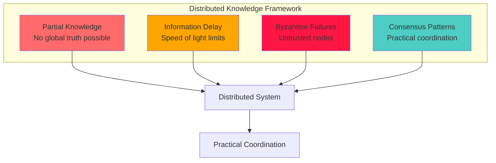
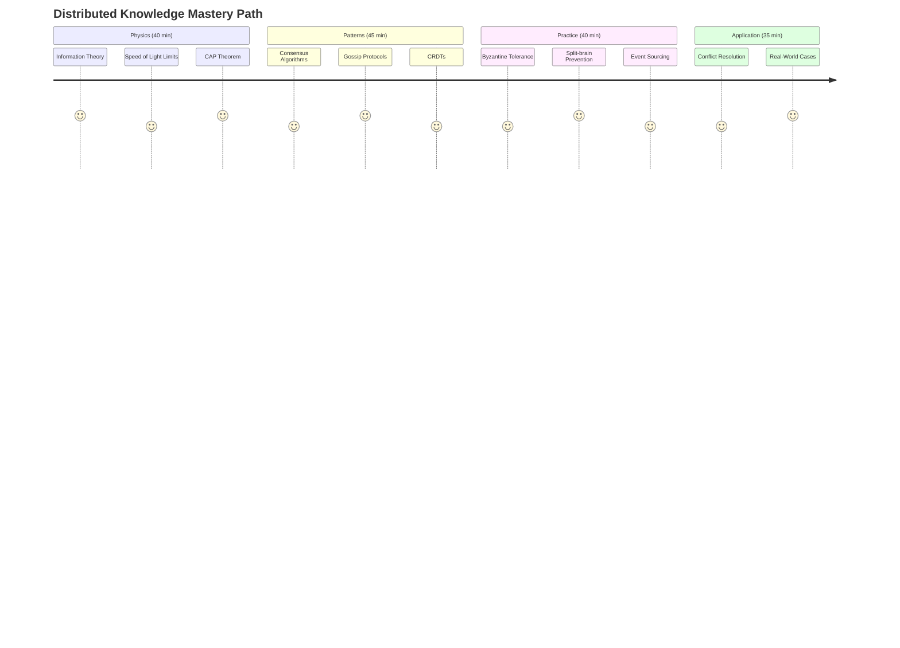
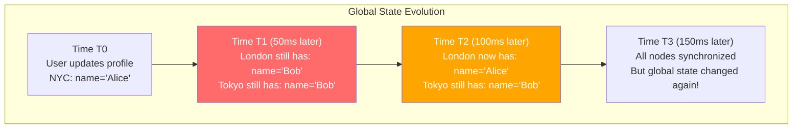
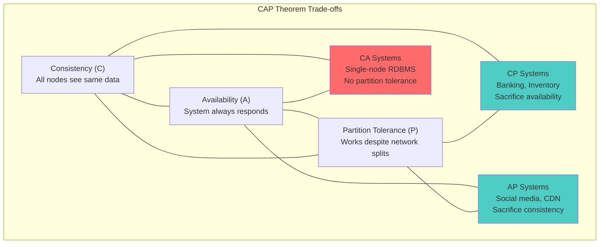
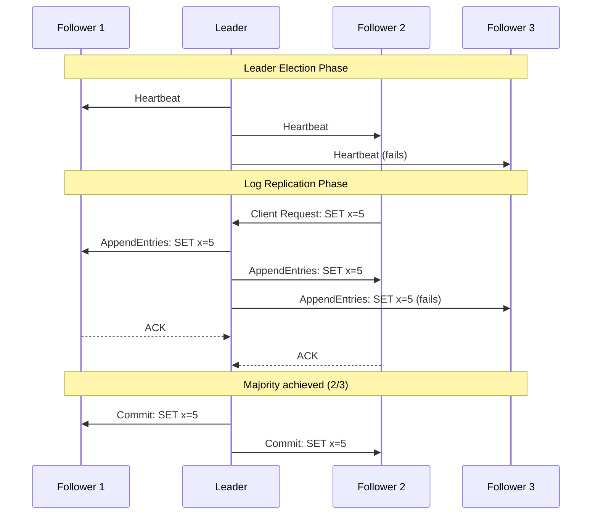
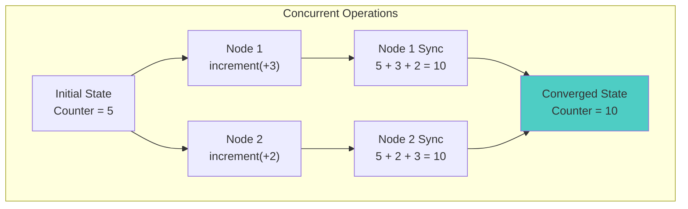
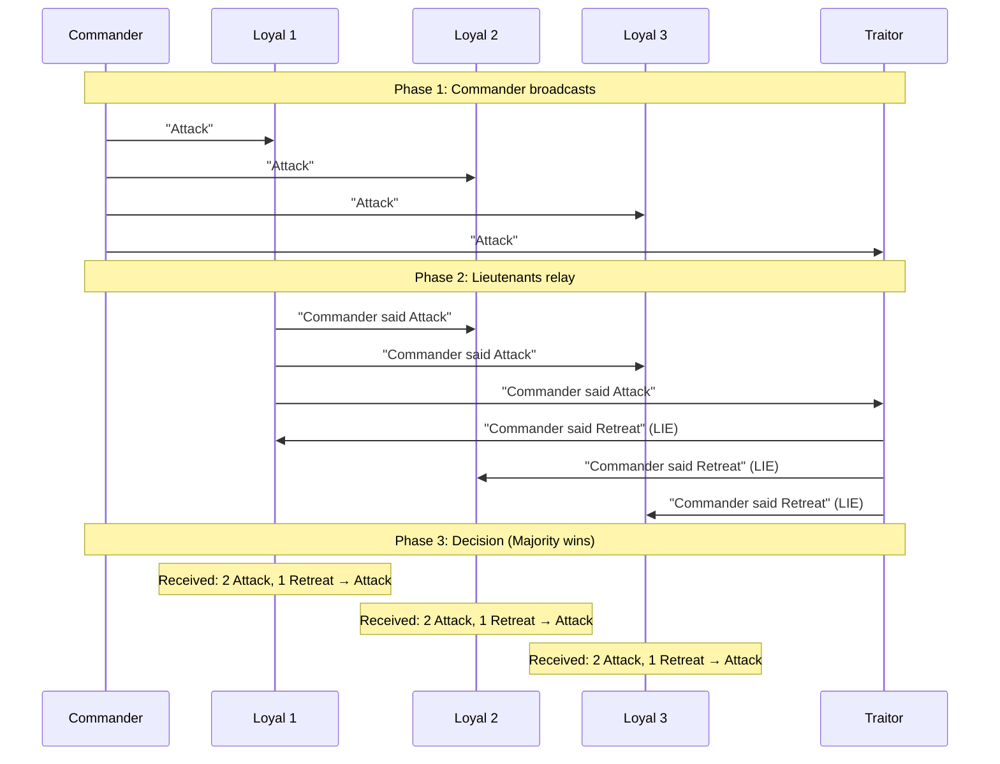

# Module 5: The Law of Distributed Knowledge - There Is No Single Source of Truth

!!! abstract "The Apex Learner's Protocol for Distributed Knowledge"
    This module implements focused learning bursts, spaced repetition, and active retrieval to master why perfect distributed consensus is mathematically impossible and how to build systems that embrace uncertainty rather than fight it.

## Foundation: Your Knowledge Reality Check

### The Brutal Truth About Distributed Truth

In distributed systems, there is no single source of truth—only competing versions of maybe-truth. By the time you receive information from another node, that information is already outdated because information travels at finite speed while the global state continues evolving.

**The Core Principle**: Perfect coordination is mathematically impossible in distributed systems.

### The Four Knowledge Pillars



## Your Learning Journey Map



---

## Focus Block 1: The Impossibility of Perfect Knowledge (25 min)

### PRIMING: "The Distributed Database Paradox"

You have a distributed database across three data centers. A user updates their profile in New York. When can the London server know about this change? The answer reveals the fundamental impossibility that shapes all distributed systems.

### CORE CONCEPT: The Speed of Information Limit

**Information Theory Law**: Information cannot travel faster than the speed of light (299,792,458 m/s). This creates fundamental knowledge delays in distributed systems.

**The Knowledge Delay Formula**:
```
Minimum_Delay = Distance ÷ Speed_of_Light
NYC to London: 5,585 km ÷ 299,792,458 m/s = 18.6ms minimum
```

**Real Network Reality**: Add routing, processing, queuing:
```
Actual_Delay = 18.6ms + Network_Overhead + Processing_Time
Typical reality: 50-150ms for transatlantic communication
```

### VISUAL MODEL: The Knowledge Propagation Problem



### NEURAL BRIDGE: Telegraph → Distributed Nodes

Think of distributed nodes like telegraph operators in the 1800s:
- Each operator knows only local information
- Messages take time to travel between stations
- By the time a message arrives, conditions may have changed
- Operators must make decisions with incomplete, stale information
- Coordination requires accepting uncertainty and delays

### ACTIVE PRACTICE: Calculate Your Knowledge Delays

**Step 1**: Map your system's geographical distribution
**Step 2**: Calculate minimum physical delays
**Step 3**: Measure actual network delays
**Step 4**: Identify decision points that need coordination

Example calculation:
```
System: E-commerce platform
Nodes: California, Virginia, Frankfurt, Singapore

California → Frankfurt: 
- Physical distance: 9,100 km
- Speed-of-light minimum: 30.3ms
- Measured network delay: 140ms
- Knowledge staleness window: 140ms

Decision impact: 
- Inventory updates can be 140ms stale
- Race conditions possible for last-item purchases
- Need coordination strategy for critical decisions
```

### CONSOLIDATION PROMPT 1

**FUNDAMENTAL QUESTIONS**:
1. What's the longest knowledge delay in your system?
2. Which decisions in your system require global coordination?
3. How do you handle decision-making with stale information?

---

## Focus Block 2: The CAP Theorem Reality (30 min)

### PRIMING: "The Impossible Trinity"

You must choose: When the network partitions, do you remain Available (accept all requests) or maintain Consistency (reject requests that can't be coordinated)? You cannot have both.

### CORE CONCEPT: CAP Theorem - The Fundamental Trade-off

**CAP Theorem Statement**: In the presence of network partitions (P), you must choose between Consistency (C) and Availability (A). You cannot have both.

**The Three Guarantees**:
- **Consistency**: All nodes see the same data simultaneously
- **Availability**: System remains operational and responsive
- **Partition Tolerance**: System continues despite network failures

**Real-World Translation**:
```
CA System (No partition tolerance): 
- Single-node database (RDBMS)
- Perfect consistency, high availability
- Fails completely when network partitions

CP System (Consistency over Availability):
- Banking systems, inventory management
- Rejects requests during network issues
- Maintains data correctness

AP System (Availability over Consistency):
- Social media, content delivery
- Always accepts requests
- Eventual consistency acceptable
```

### VISUAL MODEL: The CAP Triangle



### The Partition Reality Check

**Network Partitions Are Inevitable**:
- Hardware failures: Router crashes, cable cuts
- Software failures: Firewall misconfigurations
- Operational failures: Accidental network changes
- Cloud failures: AWS region connectivity issues

**Partition Statistics**:
```
Typical cloud environment:
- Minor partitions: 2-3 times per month
- Major partitions: 1-2 times per year
- Duration: 30 seconds to 2 hours
- Impact: 10-100% of inter-region communication
```

### NEURAL BRIDGE: Island Nations → Network Partitions

Imagine distributed nodes as island nations:
- Normal times: Ships travel freely between islands (network works)
- Storm (partition): Islands become isolated, must be self-sufficient
- Each island must decide: Stop all trade (CP) or trade locally (AP)
- Storm ends: Islands reconnect and synchronize their records

### Real-World CAP Decisions

**Amazon DynamoDB (AP System)**:
```python
# During partition: Accepts writes to available replicas
write_result = dynamodb.put_item(
    TableName='users',
    Item={'id': '123', 'name': 'Alice'}
)
# ✓ Write succeeds even if some replicas unreachable
# Eventually consistent across all replicas
```

**Google Spanner (CP System)**:
```sql
-- During partition: Rejects writes that can't reach majority
INSERT INTO users (id, name) VALUES (123, 'Alice');
-- ❌ Write fails if can't reach majority of replicas
-- Maintains strong consistency
```

**MongoDB (Tunable CP/AP)**:
```python
# CP mode: Require majority acknowledgment
db.users.insert_one(
    {'_id': 123, 'name': 'Alice'},
    write_concern=WriteConcern(w='majority')
)

# AP mode: Accept writes to any available replica
db.users.insert_one(
    {'_id': 123, 'name': 'Alice'},
    write_concern=WriteConcern(w=1)
)
```

### ACTIVE PRACTICE: CAP Analysis of Your System

**Step 1**: List your system's data stores and services
**Step 2**: Classify each as CA, CP, or AP
**Step 3**: Identify potential consistency/availability conflicts
**Step 4**: Design partition handling strategies

Example analysis:
```
System: E-commerce Platform

User Database (PostgreSQL): CA
- Single master, read replicas
- Fails completely during network partition
- Strategy: Promote replica to master

Inventory Service: CP
- Strong consistency required
- Rejects orders during partition
- Strategy: Cache inventory locally with TTL

Content Cache (Redis): AP
- Availability more important than consistency
- Serves stale content during partition
- Strategy: Accept stale data, refresh when reconnected
```

### CONSOLIDATION PROMPT 2

**STRATEGIC THINKING**:
1. Is your system primarily CP or AP? Why?
2. What happens during network partitions in your architecture?
3. Which data must be consistent vs. eventually consistent?

---

## Focus Block 3: Consensus Algorithms - Democratic Coordination (25 min)

### PRIMING: "The Distributed Election Problem"

Five servers need to agree on which one should be the leader. Three are in different data centers, network delays vary, and servers can crash at any time. How do they reach consensus without a central authority?

### CORE CONCEPT: The Consensus Problem

**Consensus Definition**: Getting distributed nodes to agree on a single value despite failures, delays, and lack of global knowledge.

**The Challenge Requirements**:
1. **Agreement**: All correct nodes decide the same value
2. **Validity**: Decision must be a value proposed by some node
3. **Termination**: All correct nodes eventually decide
4. **Fault Tolerance**: Must work despite f node failures

### VISUAL MODEL: Raft Consensus Algorithm



### Three Types of Consensus Algorithms

**1. Raft (Understandable Consensus)**:
```
Components:
- Leader election with randomized timeouts
- Log replication with majority voting
- Safety through term numbering

Guarantees:
- Strong consistency with majority available
- Clear leader at any given time
- Handles f failures with 2f+1 nodes
```

**2. PBFT (Byzantine Fault Tolerance)**:
```
Components:
- 3-phase protocol: pre-prepare, prepare, commit
- Message authentication and ordering
- View changes for leader replacement

Guarantees:
- Handles f malicious nodes with 3f+1 total nodes
- Strong consistency despite Byzantine failures
- Higher message complexity but stronger guarantees
```

**3. Gossip Protocols (Eventual Consensus)**:
```
Components:
- Epidemic information spreading
- Anti-entropy reconciliation
- Vector clocks for causal ordering

Guarantees:
- Eventually consistent convergence
- High availability and partition tolerance
- Scales to thousands of nodes
```

### NEURAL BRIDGE: Committee Voting → Distributed Consensus

Think of consensus algorithms like committee voting:
- **Raft**: Committee with elected chairperson (leader)
- **PBFT**: Suspicious committee checking each other's votes
- **Gossip**: Informal networking event where news spreads naturally

### Practical Implementation: Raft in Action

**Leader Election Process**:
```python
class RaftNode:
    def __init__(self):
        self.state = "follower"  # follower, candidate, leader
        self.current_term = 0
        self.voted_for = None
        self.log = []
        
    def start_election(self):
        self.state = "candidate"
        self.current_term += 1
        self.voted_for = self.node_id
        
        # Send RequestVote to all other nodes
        votes_received = 1  # Vote for self
        for node in other_nodes:
            if self.send_vote_request(node):
                votes_received += 1
                
        # Become leader if majority votes received
        if votes_received > len(all_nodes) // 2:
            self.state = "leader"
            self.send_heartbeats()
```

**Log Replication Process**:
```python
def append_entries(self, entry):
    # Leader receives client request
    self.log.append(entry)
    
    # Replicate to followers
    successful_replicas = 0
    for follower in followers:
        if self.replicate_to_follower(follower, entry):
            successful_replicas += 1
    
    # Commit if majority successful
    if successful_replicas >= len(followers) // 2:
        self.commit_entry(entry)
        return "SUCCESS"
    else:
        return "FAILED - No majority"
```

### ACTIVE PRACTICE: Design Your Consensus Strategy

**Scenario**: Design consensus for a distributed configuration service

**Step 1**: Choose your algorithm
```
Requirements analysis:
- Strong consistency needed? → Raft or PBFT
- Byzantine failures possible? → PBFT
- High availability preferred? → Gossip
- Simple implementation needed? → Raft
```

**Step 2**: Plan your implementation
```python
class ConfigService:
    def __init__(self):
        self.consensus = RaftConsensus()
        self.config_store = {}
    
    def update_config(self, key, value):
        # Propose change through consensus
        proposal = {"type": "update", "key": key, "value": value}
        success = self.consensus.propose(proposal)
        
        if success:
            self.config_store[key] = value
            return "Configuration updated"
        else:
            return "Update failed - no consensus"
    
    def get_config(self, key):
        # Read operations don't require consensus
        return self.config_store.get(key)
```

**Step 3**: Handle failure scenarios
```
Network partition scenarios:
1. Majority partition: Continue operations
2. Minority partition: Reject writes, serve stale reads
3. Equal split: No leader election possible, system blocks

Recovery scenarios:
1. Rejoining node: Catch up from current leader
2. Multiple leaders: Higher term number wins
3. Corrupted log: Rebuild from other nodes
```

### CONSOLIDATION PROMPT 3

**CONSENSUS THINKING**:
1. Which consensus algorithm fits your system's requirements?
2. How would you handle a 3-way network partition?
3. What's the trade-off between consistency and performance?

---

## Focus Block 4: Conflict-Free Replicated Data Types (CRDTs) (25 min)

### PRIMING: "The Google Docs Magic"

Multiple people edit the same Google Doc simultaneously. No central coordination, no locks, no conflicts—yet everyone converges to the same final document. How is this mathematically possible?

### CORE CONCEPT: Automatic Conflict Resolution

**CRDT Definition**: Data structures that can be replicated across nodes and automatically merge concurrent updates without conflicts, regardless of network delays or partitions.

**The CRDT Magic Properties**:
1. **Commutativity**: A + B = B + A (order doesn't matter)
2. **Associativity**: (A + B) + C = A + (B + C) (grouping doesn't matter)
3. **Idempotence**: A + A = A (applying twice = applying once)

**Mathematical Foundation**:
```
For operations to be conflict-free:
- Operation o1 concurrent with o2
- Result must be: apply(apply(S, o1), o2) = apply(apply(S, o2), o1)
- Convergence: All nodes eventually reach same state
```

### VISUAL MODEL: CRDT Operation Convergence



### Five Types of CRDTs

**1. G-Counter (Grow-Only Counter)**:
```python
class GCounter:
    def __init__(self, node_id):
        self.node_id = node_id
        self.counters = {}  # node_id -> count
    
    def increment(self):
        if self.node_id not in self.counters:
            self.counters[self.node_id] = 0
        self.counters[self.node_id] += 1
    
    def value(self):
        return sum(self.counters.values())
    
    def merge(self, other):
        for node_id, count in other.counters.items():
            current = self.counters.get(node_id, 0)
            self.counters[node_id] = max(current, count)
```

**2. PN-Counter (Increment/Decrement Counter)**:
```python
class PNCounter:
    def __init__(self, node_id):
        self.increments = GCounter(node_id)
        self.decrements = GCounter(node_id)
    
    def increment(self):
        self.increments.increment()
    
    def decrement(self):
        self.decrements.increment()
    
    def value(self):
        return self.increments.value() - self.decrements.value()
```

**3. G-Set (Grow-Only Set)**:
```python
class GSet:
    def __init__(self):
        self.elements = set()
    
    def add(self, element):
        self.elements.add(element)
    
    def contains(self, element):
        return element in self.elements
    
    def merge(self, other):
        return GSet.from_set(self.elements | other.elements)
```

**4. OR-Set (Add/Remove Set)**:
```python
class ORSet:
    def __init__(self):
        self.added = {}  # element -> set of unique tags
        self.removed = set()  # set of removed tags
    
    def add(self, element):
        tag = self.generate_unique_tag()
        if element not in self.added:
            self.added[element] = set()
        self.added[element].add(tag)
    
    def remove(self, element):
        if element in self.added:
            for tag in self.added[element]:
                self.removed.add(tag)
    
    def contains(self, element):
        if element not in self.added:
            return False
        return any(tag not in self.removed 
                  for tag in self.added[element])
```

**5. LWW-Register (Last-Write-Wins)**:
```python
class LWWRegister:
    def __init__(self):
        self.value = None
        self.timestamp = 0
        self.node_id = None
    
    def set(self, value, node_id):
        timestamp = time.time_ns()
        if timestamp > self.timestamp or \
           (timestamp == self.timestamp and node_id > self.node_id):
            self.value = value
            self.timestamp = timestamp
            self.node_id = node_id
    
    def merge(self, other):
        if other.timestamp > self.timestamp or \
           (other.timestamp == self.timestamp and other.node_id > self.node_id):
            self.value = other.value
            self.timestamp = other.timestamp
            self.node_id = other.node_id
```

### NEURAL BRIDGE: Recipe Collaboration → CRDT Merging

Think of CRDTs like collaborative recipe editing:
- **G-Counter**: Adding ingredients (never subtracting)
- **G-Set**: Collecting all suggested ingredients
- **OR-Set**: Adding/removing ingredients with proper tracking
- **LWW-Register**: Last chef to modify the temperature wins
- **Convergence**: All chefs end up with the same final recipe

### Real-World CRDT Applications

**Redis with CRDTs**:
```python
import rediscluster

# Counter that automatically merges across Redis cluster
def increment_page_views(page_id):
    cluster = rediscluster.RedisCluster(startup_nodes=nodes)
    cluster.incrby(f"pageviews:{page_id}", 1)
    # Automatically converges across all Redis nodes

# Set operations that merge without conflicts
def add_user_to_group(user_id, group_id):
    cluster.sadd(f"group:{group_id}:members", user_id)
    # Set union automatically handled across partitions
```

**Riak with CRDTs**:
```python
import riak

client = riak.RiakClient()

# Distributed counter
counter = client.bucket('counters').get('page_views')
counter.increment(5)
counter.store()
# Converges automatically across Riak cluster

# Distributed set
user_set = client.bucket('sets').get('active_users')
user_set.add('user123')
user_set.store()
# Set operations merge without conflicts
```

### ACTIVE PRACTICE: Build Your CRDT

**Design Challenge**: Create a CRDT for a collaborative shopping list

**Step 1**: Choose appropriate CRDT types
```python
class ShoppingList:
    def __init__(self, node_id):
        self.node_id = node_id
        self.items = ORSet()  # Add/remove items
        self.quantities = {}  # item -> PNCounter
        self.notes = {}  # item -> LWWRegister
    
    def add_item(self, item, quantity=1, note=""):
        self.items.add(item)
        
        if item not in self.quantities:
            self.quantities[item] = PNCounter(self.node_id)
        self.quantities[item].increment_by(quantity)
        
        if note:
            if item not in self.notes:
                self.notes[item] = LWWRegister()
            self.notes[item].set(note, self.node_id)
    
    def remove_item(self, item):
        self.items.remove(item)
    
    def merge(self, other_list):
        self.items.merge(other_list.items)
        
        for item, counter in other_list.quantities.items():
            if item in self.quantities:
                self.quantities[item].merge(counter)
            else:
                self.quantities[item] = counter
        
        for item, register in other_list.notes.items():
            if item in self.notes:
                self.notes[item].merge(register)
            else:
                self.notes[item] = register
```

**Step 2**: Test concurrent modifications
```python
# Simulate two users editing simultaneously
alice_list = ShoppingList("alice")
bob_list = ShoppingList("bob")

# Alice adds milk
alice_list.add_item("milk", 2, "organic")

# Bob adds milk with different quantity
bob_list.add_item("milk", 1, "2% fat")

# Lists merge automatically
alice_list.merge(bob_list)
bob_list.merge(alice_list)

# Both converge to same state:
# - milk: quantity = 3 (2 + 1)
# - note: "2% fat" (Bob's timestamp wins)
```

### CONSOLIDATION PROMPT 4

**CRDT MASTERY**:
1. Which CRDT types would you use for your system's data?
2. How would CRDTs change your conflict resolution strategy?
3. What are the trade-offs between CRDTs and consensus?

---

## Focus Block 5: Byzantine Fault Tolerance - Handling Malicious Nodes (20 min)

### PRIMING: "The Traitor General Problem"

You're coordinating with 9 other generals to attack a city. You need majority agreement, but up to 3 generals might be traitors sending false information. How do you reach consensus when you can't trust all participants?

### CORE CONCEPT: Byzantine Fault Tolerance

**Byzantine Failure Definition**: A node that behaves arbitrarily—it might crash, send incorrect information, or act maliciously to disrupt the system.

**The Byzantine Generals Problem**:
- n generals must coordinate attack or retreat
- f generals might be traitors (Byzantine)
- Need majority agreement despite false information
- Solution: Requires n ≥ 3f + 1 generals

**Why 3f + 1?**:
```
With f Byzantine nodes:
- Worst case: f nodes lie to you
- You need f + 1 honest confirmations
- Total messages from 2f + 1 nodes
- System needs n - f honest nodes ≥ 2f + 1
- Therefore: n ≥ 3f + 1
```

### VISUAL MODEL: Byzantine Agreement Process



### Three Phases of PBFT (Practical Byzantine Fault Tolerance)

**Phase 1: Pre-Prepare**
```python
class PBFTNode:
    def pre_prepare(self, request):
        if self.is_primary:
            # Primary broadcasts pre-prepare message
            message = {
                'phase': 'pre-prepare',
                'view': self.current_view,
                'sequence': self.next_sequence(),
                'request': request,
                'digest': hash(request)
            }
            self.broadcast(message)
            self.log.append(('pre-prepare', message))
```

**Phase 2: Prepare**
```python
    def handle_pre_prepare(self, message):
        if self.validate_pre_prepare(message):
            # Broadcast prepare message
            prepare_msg = {
                'phase': 'prepare',
                'view': message['view'],
                'sequence': message['sequence'],
                'digest': message['digest'],
                'node_id': self.node_id
            }
            self.broadcast(prepare_msg)
            self.log.append(('prepare', prepare_msg))
    
    def handle_prepare(self, message):
        # Collect prepare messages
        key = (message['view'], message['sequence'])
        if key not in self.prepare_votes:
            self.prepare_votes[key] = set()
        self.prepare_votes[key].add(message['node_id'])
        
        # When we have 2f prepare messages, move to commit
        if len(self.prepare_votes[key]) >= 2 * self.f:
            self.send_commit(message)
```

**Phase 3: Commit**
```python
    def send_commit(self, prepare_message):
        commit_msg = {
            'phase': 'commit',
            'view': prepare_message['view'],
            'sequence': prepare_message['sequence'],
            'digest': prepare_message['digest'],
            'node_id': self.node_id
        }
        self.broadcast(commit_msg)
    
    def handle_commit(self, message):
        # Collect commit messages
        key = (message['view'], message['sequence'])
        if key not in self.commit_votes:
            self.commit_votes[key] = set()
        self.commit_votes[key].add(message['node_id'])
        
        # When we have 2f + 1 commit messages, execute
        if len(self.commit_votes[key]) >= 2 * self.f + 1:
            self.execute_request(key)
```

### NEURAL BRIDGE: Court Trial → Byzantine Consensus

Think of Byzantine consensus like a court trial:
- **Witnesses** (nodes) give testimony that might be unreliable
- **Judge** (protocol) must determine truth from conflicting accounts
- **Majority rule** with cross-examination prevents false conviction
- **3f + 1 requirement**: Need enough witnesses to overcome perjury

### Real-World Byzantine Systems

**Blockchain Networks**:
```python
# Bitcoin-style Proof-of-Work consensus
class BlockchainNode:
    def mine_block(self, transactions):
        # Proof-of-Work: Expensive to fake
        nonce = 0
        while True:
            block_hash = hash(transactions + str(nonce))
            if block_hash.startswith('0000'):  # Difficulty target
                return Block(transactions, nonce, block_hash)
            nonce += 1
    
    def validate_block(self, block):
        # Anyone can verify, expensive to fake
        return hash(block.transactions + str(block.nonce)) == block.hash
```

**Hyperledger Fabric**:
```python
# PBFT for permissioned blockchain
class HyperledgerNode:
    def endorse_transaction(self, transaction):
        # Execute transaction and sign result
        result = self.simulate_transaction(transaction)
        signature = self.sign(result)
        return Endorsement(result, signature, self.node_id)
    
    def validate_endorsements(self, endorsements):
        # Require endorsements from trusted nodes
        valid_endorsements = 0
        for endorsement in endorsements:
            if self.verify_signature(endorsement):
                valid_endorsements += 1
        
        return valid_endorsements >= self.required_endorsements
```

### ACTIVE PRACTICE: Design Byzantine-Tolerant Service

**Scenario**: Design a Byzantine-tolerant configuration service

**Step 1**: Determine fault tolerance requirements
```
System requirements:
- 7 nodes across different organizations
- Tolerate up to 2 Byzantine failures
- Check: 7 ≥ 3(2) + 1 = 7 ✓ Exactly sufficient

Network assumptions:
- Partially synchronous (bounded delays)
- Authenticated messages (digital signatures)
- Known participant set (permissioned)
```

**Step 2**: Implement Byzantine agreement
```python
class ByzantineConfigService:
    def __init__(self, node_id, total_nodes=7, max_failures=2):
        self.node_id = node_id
        self.n = total_nodes
        self.f = max_failures
        self.config = {}
        self.pbft = PBFTConsensus(node_id, total_nodes, max_failures)
    
    def update_config(self, key, value):
        proposal = {'operation': 'update', 'key': key, 'value': value}
        success = self.pbft.consensus(proposal)
        
        if success:
            self.config[key] = value
            return "Configuration updated successfully"
        else:
            return "Update failed - no Byzantine consensus"
    
    def get_config(self, key):
        # Reads don't require consensus in this design
        return self.config.get(key)
```

**Step 3**: Handle Byzantine attacks
```python
class ByzantineDefenses:
    def detect_byzantine_behavior(self, node_messages):
        # Detect conflicting messages from same node
        for node_id, messages in node_messages.items():
            if self.has_conflicting_messages(messages):
                self.report_byzantine_node(node_id)
    
    def verify_message_authenticity(self, message, sender):
        # Cryptographic verification
        return self.crypto.verify_signature(
            message.content,
            message.signature, 
            sender.public_key
        )
    
    def handle_view_change(self):
        # Change leader if current one is suspected Byzantine
        if self.leader_timeout_exceeded():
            self.initiate_view_change()
```

### CONSOLIDATION PROMPT 5

**BYZANTINE THINKING**:
1. How many nodes do you need to tolerate f Byzantine failures?
2. What Byzantine behaviors could threaten your system?
3. Is the cost of Byzantine tolerance justified for your use case?

---

## Focus Block 6: Event Sourcing - Truth Through History (25 min)

### PRIMING: "The Immutable Ledger"

Instead of storing current state, store the sequence of events that led to that state. Like a bank ledger that never erases entries—only adds new ones. Truth becomes the sum of all events.

### CORE CONCEPT: Event-Driven Truth

**Event Sourcing Definition**: Instead of storing current state, store the immutable sequence of events that led to that state. Current state is derived by replaying events.

**The Truth Equation**:
```
Current_State = Σ(Events from t=0 to t=now)
Truth = Immutable_History, not Mutable_State
```

**Key Principles**:
1. **Events are immutable**: Never changed, only appended
2. **Events are the truth**: State is derived from events
3. **Time-travel possible**: Replay events to any point in time
4. **Audit trail built-in**: Complete history of what happened

### VISUAL MODEL: Event Sourcing vs Traditional Storage

```mermaid
graph TB
    subgraph "Traditional (Mutable State)"
        STATE1["User: {id: 1, name: 'Bob', email: 'bob@old.com'}"]
        UPDATE["UPDATE user SET email='bob@new.com'"]
        STATE2["User: {id: 1, name: 'Bob', email: 'bob@new.com'}"]
        LOST["❌ Lost: Why did email change?<br/>❌ Lost: When did it change?<br/>❌ Lost: Who changed it?"]
    end
    
    subgraph "Event Sourcing (Immutable Events)"
        EVENT1["Event 1: UserCreated<br/>{id: 1, name: 'Bob', email: 'bob@old.com'}"]
        EVENT2["Event 2: EmailChanged<br/>{id: 1, old: 'bob@old.com', new: 'bob@new.com', by: 'admin', at: '2025-01-29'}"]
        DERIVE["Derive State = Apply(Event1, Event2)<br/>Result: {id: 1, name: 'Bob', email: 'bob@new.com'}"]
        BENEFITS["✅ Complete audit trail<br/>✅ Time-travel debugging<br/>✅ Multiple projections"]
    end
    
    STATE1 --> UPDATE --> STATE2 --> LOST
    EVENT1 --> EVENT2 --> DERIVE --> BENEFITS
    
    style LOST fill:#ff6b6b
    style BENEFITS fill:#4ecdc4
```



### Event Sourcing Implementation Patterns

**1. Event Store Design**:
```python
class Event:
    def __init__(self, aggregate_id, event_type, event_data, version, timestamp):
        self.aggregate_id = aggregate_id
        self.event_type = event_type
        self.event_data = event_data
        self.version = version  # Optimistic concurrency control
        self.timestamp = timestamp
        self.event_id = str(uuid.uuid4())

class EventStore:
    def __init__(self):
        self.events = []  # In production: durable storage
        self.snapshots = {}
    
    def save_events(self, aggregate_id, events, expected_version):
        # Check optimistic concurrency
        current_version = self.get_current_version(aggregate_id)
        if current_version != expected_version:
            raise ConcurrencyException("Version mismatch")
        
        # Append events atomically
        for i, event in enumerate(events):
            event.version = expected_version + i + 1
            event.timestamp = datetime.utcnow()
            self.events.append(event)
    
    def get_events(self, aggregate_id, from_version=0):
        return [e for e in self.events 
                if e.aggregate_id == aggregate_id and e.version > from_version]
```

**2. Aggregate Reconstruction**:
```python
class UserAggregate:
    def __init__(self):
        self.id = None
        self.name = None
        self.email = None
        self.version = 0
        self.uncommitted_events = []
    
    def create_user(self, user_id, name, email):
        event = Event(user_id, 'UserCreated', {
            'id': user_id, 'name': name, 'email': email
        }, 0, datetime.utcnow())
        self.apply_event(event)
        self.uncommitted_events.append(event)
    
    def change_email(self, new_email):
        if self.email != new_email:
            event = Event(self.id, 'EmailChanged', {
                'old_email': self.email,
                'new_email': new_email
            }, self.version, datetime.utcnow())
            self.apply_event(event)
            self.uncommitted_events.append(event)
    
    def apply_event(self, event):
        if event.event_type == 'UserCreated':
            self.id = event.event_data['id']
            self.name = event.event_data['name']  
            self.email = event.event_data['email']
        elif event.event_type == 'EmailChanged':
            self.email = event.event_data['new_email']
        
        self.version = event.version
    
    @classmethod
    def from_history(cls, events):
        aggregate = cls()
        for event in events:
            aggregate.apply_event(event)
        return aggregate
```

**3. Command/Query Separation (CQRS)**:
```python
# Command side - handles writes
class UserCommandService:
    def __init__(self, event_store):
        self.event_store = event_store
    
    def change_user_email(self, user_id, new_email):
        # Load aggregate from events
        events = self.event_store.get_events(user_id)
        user = UserAggregate.from_history(events)
        
        # Execute business logic
        user.change_email(new_email)
        
        # Save new events
        self.event_store.save_events(
            user_id, 
            user.uncommitted_events, 
            user.version - len(user.uncommitted_events)
        )

# Query side - handles reads from projections
class UserQueryService:
    def __init__(self, read_model_db):
        self.db = read_model_db  # Optimized for queries
    
    def get_user_profile(self, user_id):
        # Read from denormalized projection
        return self.db.query("SELECT * FROM user_profiles WHERE id = ?", [user_id])
    
    def get_user_audit_log(self, user_id):
        # Different projection for audit queries
        return self.db.query("SELECT * FROM user_audit_log WHERE user_id = ?", [user_id])
```

### NEURAL BRIDGE: Bank Ledger → Event Store

Think of event sourcing like traditional bank accounting:
- **Ledger entries** are never erased (events are immutable)
- **Account balance** is calculated by summing entries (state derived from events)
- **Audit trail** exists naturally (complete history preserved)
- **Corrections** add new entries (compensating events)
- **Multiple views** can be created (different projections)

### Real-World Event Sourcing Benefits

**1. Perfect Audit Trail**:
```python
# Generate complete audit log from events
def generate_audit_report(user_id, start_date, end_date):
    events = event_store.get_events(user_id)
    audit_entries = []
    
    for event in events:
        if start_date <= event.timestamp <= end_date:
            audit_entries.append({
                'timestamp': event.timestamp,
                'action': event.event_type,
                'details': event.event_data,
                'version': event.version
            })
    
    return audit_entries
```

**2. Time-Travel Debugging**:
```python
# Reproduce system state at any point in time
def debug_state_at_time(aggregate_id, target_timestamp):
    all_events = event_store.get_events(aggregate_id)
    
    # Only apply events up to target time
    events_up_to_time = [e for e in all_events 
                        if e.timestamp <= target_timestamp]
    
    # Reconstruct aggregate as it was
    return UserAggregate.from_history(events_up_to_time)
```

**3. Multiple Projections**:
```python
# Create different read models from same events
class UserProfileProjection:
    def handle_user_created(self, event):
        self.db.insert('user_profiles', {
            'id': event.event_data['id'],
            'name': event.event_data['name'],
            'email': event.event_data['email'],
            'created_at': event.timestamp
        })
    
    def handle_email_changed(self, event):
        self.db.update('user_profiles', 
                      {'id': event.aggregate_id},
                      {'email': event.event_data['new_email']})

class UserAuditProjection:
    def handle_any_event(self, event):
        self.db.insert('user_audit_log', {
            'user_id': event.aggregate_id,
            'event_type': event.event_type,
            'event_data': json.dumps(event.event_data),
            'timestamp': event.timestamp
        })
```

### ACTIVE PRACTICE: Build an Event-Sourced System

**Challenge**: Design an event-sourced shopping cart service

**Step 1**: Define your events
```python
# Shopping cart events
EVENTS = [
    'CartCreated',      # {cart_id, user_id}
    'ItemAdded',        # {cart_id, product_id, quantity, price}
    'ItemRemoved',      # {cart_id, product_id, quantity}
    'ItemQuantityChanged', # {cart_id, product_id, old_quantity, new_quantity}
    'CartCheckedOut',   # {cart_id, total_amount, payment_method}
    'CartAbandoned'     # {cart_id, reason}
]
```

**Step 2**: Implement the aggregate
```python
class ShoppingCartAggregate:
    def __init__(self):
        self.cart_id = None
        self.user_id = None
        self.items = {}  # product_id -> {quantity, price}
        self.status = 'active'
        self.version = 0
        self.uncommitted_events = []
    
    def create_cart(self, cart_id, user_id):
        if self.cart_id is not None:
            raise Exception("Cart already exists")
        
        event = Event(cart_id, 'CartCreated', {
            'cart_id': cart_id,
            'user_id': user_id
        }, 0, datetime.utcnow())
        
        self.apply_event(event)
        self.uncommitted_events.append(event)
    
    def add_item(self, product_id, quantity, price):
        if self.status != 'active':
            raise Exception("Cannot modify inactive cart")
        
        event = Event(self.cart_id, 'ItemAdded', {
            'product_id': product_id,
            'quantity': quantity,
            'price': price
        }, self.version, datetime.utcnow())
        
        self.apply_event(event)
        self.uncommitted_events.append(event)
    
    def apply_event(self, event):
        if event.event_type == 'CartCreated':
            self.cart_id = event.event_data['cart_id']
            self.user_id = event.event_data['user_id']
        elif event.event_type == 'ItemAdded':
            product_id = event.event_data['product_id']
            if product_id in self.items:
                self.items[product_id]['quantity'] += event.event_data['quantity']
            else:
                self.items[product_id] = {
                    'quantity': event.event_data['quantity'],
                    'price': event.event_data['price']
                }
        # ... handle other events
        
        self.version = event.version
```

**Step 3**: Create useful projections
```python
class CartSummaryProjection:
    """Optimized for showing cart contents"""
    def __init__(self, db):
        self.db = db
    
    def handle_item_added(self, event):
        cart_id = event.aggregate_id
        self.db.execute("""
            INSERT OR REPLACE INTO cart_summary 
            (cart_id, product_id, quantity, price, last_updated)
            VALUES (?, ?, ?, ?, ?)
        """, [cart_id, event.event_data['product_id'], 
              event.event_data['quantity'], event.event_data['price'],
              event.timestamp])

class AbandonedCartProjection:
    """Optimized for marketing analytics"""
    def __init__(self, analytics_db):
        self.db = analytics_db
    
    def handle_cart_abandoned(self, event):
        # Calculate cart value from event history
        cart_events = self.get_cart_events(event.aggregate_id)
        total_value = self.calculate_abandoned_value(cart_events)
        
        self.db.insert('abandoned_carts', {
            'cart_id': event.aggregate_id,
            'abandonment_reason': event.event_data['reason'],
            'total_value': total_value,
            'abandoned_at': event.timestamp
        })
```

### CONSOLIDATION PROMPT 6

**EVENT SOURCING MASTERY**:
1. What aspects of your system would benefit from complete audit trails?
2. How would you handle schema evolution in your event store?
3. What projections would you need to optimize your queries?

---

## Integration Challenge: Build a Distributed Truth System

### YOUR MISSION: Design a Conflict-Free Collaborative Editor

**Challenge Objective**: Build a real-time collaborative document editor that works correctly despite network partitions, node failures, and concurrent edits.

**Phase 1: Requirements Analysis (15 min)**

Define your system requirements:
```
Functional Requirements:
- Multiple users edit same document simultaneously
- Changes propagate to all connected users
- Works during network partitions
- Conflict resolution without user intervention
- Maintains operation history for debugging

Non-Functional Requirements:
- Availability: Works with any number of partitioned nodes
- Consistency: Eventually consistent with deterministic convergence
- Partition Tolerance: Continues operating during network splits
- Performance: Sub-200ms local operations
```

**Phase 2: Architecture Design (25 min)**

Choose your distributed knowledge patterns:
```python
class CollaborativeEditor:
    def __init__(self, node_id):
        self.node_id = node_id
        self.document = SequenceCRDT()  # For text operations
        self.users = ORSet()           # For user presence
        self.cursors = {}              # user_id -> LWWRegister
        self.version_vector = {}       # For causal ordering
        self.event_log = []            # For debugging and sync
    
    def insert_text(self, position, text):
        # Generate unique position identifier
        op_id = self.generate_operation_id()
        
        # Create CRDT operation
        operation = {
            'type': 'insert',
            'position': position,
            'text': text,
            'id': op_id,
            'node_id': self.node_id,
            'timestamp': time.time_ns()
        }
        
        # Apply locally first (optimistic)
        self.document.apply_operation(operation)
        self.event_log.append(operation)
        
        # Broadcast to other nodes
        self.broadcast_operation(operation)
        
        return op_id  # For undo/redo
```

**Phase 3: Conflict Resolution Strategy (20 min)**

Implement automatic conflict resolution:
```python
class SequenceCRDT:
    def __init__(self):
        self.characters = []  # List of (char, id, visible) tuples
        self.tombstones = set()  # Deleted character IDs
    
    def insert_character(self, position, char, op_id):
        # Determine insertion point using position identifiers
        if position == 0:
            left_id = None
            right_id = self.characters[0][1] if self.characters else None
        else:
            left_id = self.characters[position-1][1]
            right_id = self.characters[position][1] if position < len(self.characters) else None
        
        # Generate position ID between left and right
        new_id = self.generate_position_id(left_id, right_id, op_id)
        
        # Insert in sorted order
        self.characters.append((char, new_id, True))
        self.characters.sort(key=lambda x: x[1])  # Sort by position ID
    
    def delete_character(self, position):
        if 0 <= position < len(self.visible_characters()):
            visible_chars = self.visible_characters()
            char_id = visible_chars[position][1]
            self.tombstones.add(char_id)
    
    def visible_characters(self):
        return [(char, char_id) for char, char_id, visible in self.characters 
                if visible and char_id not in self.tombstones]
```

**Phase 4: Network Partition Handling (20 min)**

Design partition-resilient operation:
```python
class PartitionHandler:
    def __init__(self, editor):
        self.editor = editor
        self.connected_nodes = set()
        self.operation_buffer = []
        self.sync_in_progress = False
    
    def handle_network_partition(self):
        # Continue operating locally
        self.editor.partition_mode = True
        
        # Buffer operations for later sync
        self.operation_buffer = []
        
        # Notify user of offline mode
        self.editor.notify_user("Working offline - changes will sync when reconnected")
    
    def handle_partition_recovery(self, reconnected_nodes):
        self.editor.partition_mode = False
        
        # Start anti-entropy process
        self.start_sync_protocol(reconnected_nodes)
    
    def start_sync_protocol(self, nodes):
        for node in nodes:
            # Exchange version vectors
            their_vector = self.request_version_vector(node)
            missing_ops = self.calculate_missing_operations(their_vector)
            
            # Send missing operations
            self.send_operations(node, missing_ops)
            
            # Request operations we're missing
            self.request_missing_operations(node, their_vector)
```

**Phase 5: Testing and Validation (10 min)**

Create comprehensive test scenarios:
```python
def test_concurrent_edits():
    # Simulate two users editing simultaneously
    editor1 = CollaborativeEditor("alice")
    editor2 = CollaborativeEditor("bob")
    
    # Both start with empty document
    assert editor1.get_text() == ""
    assert editor2.get_text() == ""
    
    # Concurrent insertions
    editor1.insert_text(0, "Hello")
    editor2.insert_text(0, "World")
    
    # Sync changes
    editor1.merge_changes(editor2.get_operations())
    editor2.merge_changes(editor1.get_operations())
    
    # Both should converge to same result
    final_text = editor1.get_text()
    assert editor2.get_text() == final_text
    print(f"Converged text: '{final_text}'")

def test_network_partition():
    editors = [CollaborativeEditor(f"node_{i}") for i in range(5)]
    
    # Partition network: [0,1,2] vs [3,4]
    partition1 = editors[:3]
    partition2 = editors[3:]
    
    # Each partition continues working
    partition1[0].insert_text(0, "Left partition text")
    partition2[0].insert_text(0, "Right partition text")
    
    # Simulate partition healing
    for editor in partition1:
        for other in partition2:
            editor.merge_changes(other.get_operations())
            other.merge_changes(editor.get_operations())
    
    # All nodes should converge
    final_states = [e.get_text() for e in editors]
    assert len(set(final_states)) == 1, "All nodes should have same final state"
```

**Deliverables**:
- Working collaborative editor prototype
- Conflict resolution demonstration
- Partition tolerance validation
- Performance benchmarks
- Integration test suite

### Expected Learning Outcomes

By completing this challenge, you should understand:
- How to apply CRDTs to real-world coordination problems
- The trade-offs between consistency models
- Network partition handling strategies
- Event sourcing for distributed debugging
- The complexity of building truly distributed systems

---

## Cross-Law Integration

### Distributed Knowledge × Other Laws

**With Law 1 (Correlated Failure)**:
- Knowledge distribution creates failure correlation opportunities
- Consensus algorithms can create correlated failure points
- Gossip protocols help break correlation through randomization

**With Law 2 (Asynchronous Reality)**:
- Asynchronous communication makes coordination impossible
- Knowledge distribution relies on asynchronous message passing
- Vector clocks help establish causal relationships

**With Law 3 (Emergent Chaos)**:
- Distributed knowledge systems can exhibit emergence
- Consensus algorithms undergo phase transitions under load
- Byzantine behavior can trigger emergent failure patterns

**With Law 4 (Multidimensional Optimization)**:
- CAP theorem represents fundamental optimization trade-offs
- Consistency vs. availability vs. partition tolerance
- Performance vs. correctness in consensus algorithms

**With Law 6 (Cognitive Load)**:
- Distributed consensus adds cognitive complexity
- Event sourcing provides clearer mental models
- Multiple consistency models confuse developers

**With Law 7 (Economic Reality)**:
- Strong consistency has economic costs (latency, availability)
- Byzantine fault tolerance requires 3x+ resources
- Eventually consistent systems enable cost optimization

---

## Practical Exercises

### Exercise 1: CAP Theorem Decision Matrix

Build a decision framework for choosing consistency models:
```python
class ConsistencyDecisionMatrix:
    def __init__(self):
        self.requirements = {}
        self.constraints = {}
    
    def analyze_requirements(self, use_case):
        questions = [
            "Can users tolerate stale data? (minutes/seconds/never)",
            "What's the business cost of inconsistency?",
            "How often do network partitions occur?",
            "What's the acceptable downtime during partitions?",
            "Are there regulatory compliance requirements?"
        ]
        
        for question in questions:
            answer = input(f"{question}: ")
            self.requirements[question] = answer
    
    def recommend_consistency_model(self):
        if "never" in self.requirements.get("Can users tolerate stale data?", "").lower():
            return "Strong Consistency (CP) - Consider PBFT or Raft"
        elif "minutes" in self.requirements.get("Can users tolerate stale data?", "").lower():
            return "Eventual Consistency (AP) - Consider CRDTs or Gossip"
        else:
            return "Tunable Consistency - Consider MongoDB or Cassandra"
    
    def estimate_costs(self, consistency_model):
        cost_factors = {
            "Strong Consistency": {
                "latency_increase": "2-5x",
                "availability_impact": "High during partitions",
                "resource_overhead": "Moderate",
                "operational_complexity": "High"
            },
            "Eventual Consistency": {
                "latency_increase": "Minimal", 
                "availability_impact": "Low",
                "resource_overhead": "Low",
                "operational_complexity": "Moderate (conflict resolution)"
            },
            "Byzantine Tolerance": {
                "latency_increase": "5-10x",
                "availability_impact": "High during attacks",
                "resource_overhead": "3x+ for 3f+1 requirement",
                "operational_complexity": "Very High"
            }
        }
        return cost_factors.get(consistency_model, "Unknown model")
```

### Exercise 2: Distributed Debugging Toolkit

Create tools for understanding distributed state:
```python
class DistributedDebugger:
    def __init__(self):
        self.event_logs = {}
        self.causal_graphs = {}
        self.inconsistency_reports = []
    
    def collect_event_log(self, node_id, events):
        self.event_logs[node_id] = events
    
    def build_causal_graph(self):
        """Build causal relationship graph from event logs"""
        graph = {}
        
        for node_id, events in self.event_logs.items():
            for event in events:
                event_id = f"{node_id}:{event['sequence']}"
                graph[event_id] = {
                    'event': event,
                    'happens_before': [],
                    'concurrent_with': []
                }
                
                # Add causal relationships based on vector clocks
                for other_node, other_events in self.event_logs.items():
                    if other_node != node_id:
                        for other_event in other_events:
                            relationship = self.compare_vector_clocks(
                                event['vector_clock'], 
                                other_event['vector_clock']
                            )
                            
                            other_event_id = f"{other_node}:{other_event['sequence']}"
                            if relationship == 'happens_before':
                                graph[event_id]['happens_before'].append(other_event_id)
                            elif relationship == 'concurrent':
                                graph[event_id]['concurrent_with'].append(other_event_id)
        
        return graph
    
    def detect_inconsistencies(self):
        """Find states that violate consistency guarantees"""
        inconsistencies = []
        
        for node_id, events in self.event_logs.items():
            state = self.replay_events(events)
            for other_node_id, other_events in self.event_logs.items():
                if other_node_id != node_id:
                    other_state = self.replay_events(other_events)
                    
                    # Compare states for consistency violations
                    differences = self.compare_states(state, other_state)
                    if differences:
                        inconsistencies.append({
                            'nodes': [node_id, other_node_id],
                            'differences': differences,
                            'timestamp': max(events[-1]['timestamp'], other_events[-1]['timestamp'])
                        })
        
        return inconsistencies
    
    def generate_consistency_report(self):
        causal_graph = self.build_causal_graph()
        inconsistencies = self.detect_inconsistencies()
        
        report = {
            'total_events': sum(len(events) for events in self.event_logs.values()),
            'causal_violations': self.find_causal_violations(causal_graph),
            'consistency_violations': len(inconsistencies),
            'partition_periods': self.identify_partition_periods(),
            'convergence_time': self.calculate_convergence_time()
        }
        
        return report
```

### Exercise 3: Consensus Algorithm Simulator

Build a visual consensus simulator:
```python
class ConsensusSimulator:
    def __init__(self, algorithm_type, num_nodes, failure_rate):
        self.algorithm_type = algorithm_type
        self.nodes = [Node(i, algorithm_type) for i in range(num_nodes)]
        self.failure_rate = failure_rate
        self.network = Network(self.nodes, failure_rate)
        self.history = []
    
    def run_simulation(self, num_rounds):
        for round_num in range(num_rounds):
            # Introduce random failures
            failed_nodes = self.network.introduce_failures()
            
            # Run one round of consensus
            if self.algorithm_type == "raft":
                result = self.simulate_raft_round()
            elif self.algorithm_type == "pbft":
                result = self.simulate_pbft_round()
            else:
                result = self.simulate_gossip_round()
            
            # Record history
            self.history.append({
                'round': round_num,
                'failed_nodes': failed_nodes,
                'consensus_reached': result['success'],
                'leader': result.get('leader'),
                'committed_value': result.get('value'),
                'message_count': result.get('messages'),
                'time_to_consensus': result.get('duration')
            })
            
            # Recover failed nodes
            self.network.recover_nodes()
    
    def analyze_results(self):
        success_rate = sum(1 for h in self.history if h['consensus_reached']) / len(self.history)
        avg_messages = sum(h.get('message_count', 0) for h in self.history) / len(self.history)
        avg_time = sum(h.get('time_to_consensus', 0) for h in self.history) / len(self.history)
        
        return {
            'consensus_success_rate': success_rate,
            'average_message_complexity': avg_messages,
            'average_consensus_time': avg_time,
            'failure_tolerance': max(len(h['failed_nodes']) for h in self.history),
            'algorithm_efficiency': success_rate / avg_messages if avg_messages > 0 else 0
        }
    
    def visualize_consensus_timeline(self):
        # Generate visual timeline of consensus rounds
        import matplotlib.pyplot as plt
        
        rounds = [h['round'] for h in self.history]
        success = [1 if h['consensus_reached'] else 0 for h in self.history]
        failures = [len(h['failed_nodes']) for h in self.history]
        
        fig, (ax1, ax2) = plt.subplots(2, 1, figsize=(12, 8))
        
        ax1.plot(rounds, success, 'g-', label='Consensus Success')
        ax1.fill_between(rounds, 0, success, alpha=0.3, color='green')
        ax1.set_ylabel('Consensus Reached')
        ax1.set_title(f'{self.algorithm_type.upper()} Consensus Simulation')
        
        ax2.bar(rounds, failures, alpha=0.7, color='red')
        ax2.set_ylabel('Number of Failed Nodes')
        ax2.set_xlabel('Simulation Round')
        
        plt.tight_layout()
        plt.show()
```

---

## Retrieval Practice Gauntlets

### Gauntlet 1: Information Theory Fundamentals (3 min)
1. What's the minimum time for information to travel from NYC to London? _____
2. Why is perfect distributed consensus impossible? _____
3. What does the CAP theorem force you to choose between during partitions? _____
4. How many nodes do you need to tolerate f Byzantine failures? _____
5. What makes CRDTs converge without coordination? _____

### Gauntlet 2: Algorithm Recognition (5 min)
Match each scenario to the appropriate algorithm:

Scenarios:
A. Bank requiring strong consistency for transactions
B. Social media feed accepting eventual consistency
C. Blockchain network with untrusted participants
D. Real-time collaborative document editing
E. Configuration service requiring high availability

Algorithms:
1. Raft consensus
2. Gossip protocols
3. PBFT (Byzantine fault tolerance)
4. CRDTs
5. Eventually consistent replication

### Gauntlet 3: System Design Challenge (10 min)
Design a distributed system for global inventory management:

**Requirements:**
- 5 data centers worldwide
- Strong consistency for inventory counts
- High availability for product catalog
- Audit trail for all changes
- Network partitions happen monthly

**Your Design:**
1. Choose consistency model for inventory: _____
2. Choose consistency model for catalog: _____  
3. How do you handle network partitions? _____
4. What coordination algorithm would you use? _____
5. How do you provide audit trails? _____

### Gauntlet 4: Failure Analysis (15 min)
**Scenario**: Your distributed system shows these symptoms:
- Nodes have different views of the same data
- Some operations succeed on some nodes but fail on others
- Network partitions occurred 2 hours ago but ended 1 hour ago
- System hasn't converged to consistent state

**Analysis Questions:**
1. What type of consistency model are you using? _____
2. What might be preventing convergence? _____
3. How would you diagnose the root cause? _____
4. What immediate steps would you take? _____
5. How would you prevent this in the future? _____

---

## Spaced Repetition Schedule

### Day 1: Foundation Reinforcement
- Review CAP theorem trade-offs and implications
- Practice calculating information propagation delays
- Understand why perfect coordination is impossible
- Set up basic consensus algorithm implementation

### Day 3: Pattern Implementation
- Implement a simple CRDT (G-Counter or G-Set)
- Build basic Raft leader election
- Create event sourcing example
- Test conflict resolution strategies

### Day 7: Advanced Integration
- Build complex CRDT system (collaborative editing)
- Implement Byzantine fault tolerance
- Create comprehensive event sourcing application
- Test partition recovery scenarios

### Day 14: System Design Mastery
- Design distributed system with multiple consistency models
- Implement gossip protocol for information dissemination
- Build comprehensive testing framework
- Create monitoring and debugging tools

### Day 30: Teaching and Refinement
- Explain distributed knowledge concepts to team
- Integrate patterns into production architecture
- Establish operational procedures for partition handling
- Contribute to distributed systems knowledge sharing

---

## Common Pitfalls & Mitigations

### Pitfall 1: "Seeking Perfect Consistency"
**Symptom**: Trying to eliminate all inconsistency from distributed system
**Mitigation**: Accept eventual consistency where business requirements allow

### Pitfall 2: "Ignoring Network Partitions"
**Symptom**: Assuming network always works perfectly
**Mitigation**: Design partition tolerance into system from day one

### Pitfall 3: "Overusing Strong Consistency"
**Symptom**: Requiring coordination for operations that don't need it
**Mitigation**: Use strong consistency only where business logic demands it

### Pitfall 4: "Byzantine Over-Engineering"
**Symptom**: Implementing Byzantine fault tolerance without threat model
**Mitigation**: Assess actual risks - most systems don't face malicious nodes

### Pitfall 5: "Event Sourcing Complexity"
**Symptom**: Making every domain object event-sourced
**Mitigation**: Use event sourcing selectively for domains requiring audit trails

### Pitfall 6: "Consensus Algorithm Misunderstanding"
**Symptom**: Expecting consensus algorithms to work during majority failures
**Mitigation**: Understand algorithm requirements and failure tolerance limits

---

## Real-World Case Studies

### Success: Amazon DynamoDB's AP Choice
- **Approach**: Chose availability over consistency for e-commerce
- **Implementation**: Eventually consistent with tunable consistency
- **Results**: Handles millions of operations per second globally
- **Lesson**: AP systems can handle massive scale with careful design

### Failure: Knight Capital's Byzantine Algorithm
- **Event**: Trading algorithm went Byzantine, lost $440M in 45 minutes
- **Problem**: No Byzantine fault tolerance in critical financial system
- **Impact**: Company bankruptcy due to uncontrolled algorithm behavior
- **Lesson**: Financial systems need Byzantine fault tolerance

### Success: Google Spanner's CP Innovation
- **Approach**: Strong consistency across global scale using synchronized clocks
- **Innovation**: TrueTime API provides global clock synchronization
- **Results**: Strong consistency with acceptable performance
- **Lesson**: Creative solutions can overcome theoretical limitations

### Success: CouchDB's CRDT Adoption
- **Strategy**: Built entire database on CRDT principles
- **Benefits**: Automatic conflict resolution, offline capabilities
- **Results**: Reliable sync across mobile and web clients
- **Lesson**: CRDTs enable powerful distributed applications

### Failure: MongoDB's Default Settings
- **Problem**: Default settings prioritized consistency over partition tolerance
- **Impact**: Many applications failed completely during network issues
- **Evolution**: Later added better default settings and education
- **Lesson**: Default configurations matter enormously in distributed systems

---

## Summary: The Distributed Knowledge Manifesto

### 10 Fundamental Truths

1. **Perfect coordination is impossible** due to speed-of-light limits
2. **CAP theorem forces trade-offs** between consistency and availability  
3. **Network partitions are inevitable** and must be designed for
4. **Consensus requires majorities** and fails when majorities are unavailable
5. **Byzantine failure tolerance** requires 3f + 1 nodes for f failures
6. **CRDTs enable automatic convergence** without coordination
7. **Event sourcing provides immutable truth** through history
8. **Vector clocks establish causal ordering** without global clocks
9. **Gossip protocols scale information dissemination** to thousands of nodes
10. **Eventually consistent systems** can achieve massive scale and availability

### The Three Pillars of Distributed Knowledge

**Pillar 1: Embrace Uncertainty**
- Accept that perfect knowledge is impossible
- Design for partial, stale information
- Use probabilistic and eventually consistent approaches

**Pillar 2: Choose Your Guarantees Carefully**  
- Understand CAP theorem implications
- Use strong consistency sparingly
- Design for the consistency model your business requires

**Pillar 3: Plan for Coordination Failure**
- Network partitions will happen
- Majorities will become unavailable
- Systems must degrade gracefully

### Your Distributed Knowledge Superpower

You now understand that distributed systems are not about eliminating uncertainty—they're about building systems that work correctly despite uncertainty. You can:

- **Analyze systems** using CAP theorem lens
- **Design coordination strategies** appropriate to requirements  
- **Implement conflict resolution** that maintains system invariants
- **Debug distributed state** using causal reasoning
- **Build partition-tolerant systems** that degrade gracefully

### The Ultimate Truth

Distributed knowledge is not about having all the information—it's about making correct decisions with partial information. The best distributed systems don't fight the fundamental limitations of distributed computing; they embrace them and turn them into strengths.

**Master this law**, and you'll build systems that work reliably across any scale, handle any failure, and provide exactly the consistency guarantees your business needs—no more, no less.

---

*Continue your learning journey:*
- [← Law 4: Multidimensional Optimization](multidimensional-optimization.md)
- [→ Law 6: Cognitive Load](cognitive-load.md)
- [↑ Return to Laws Index](index.md)