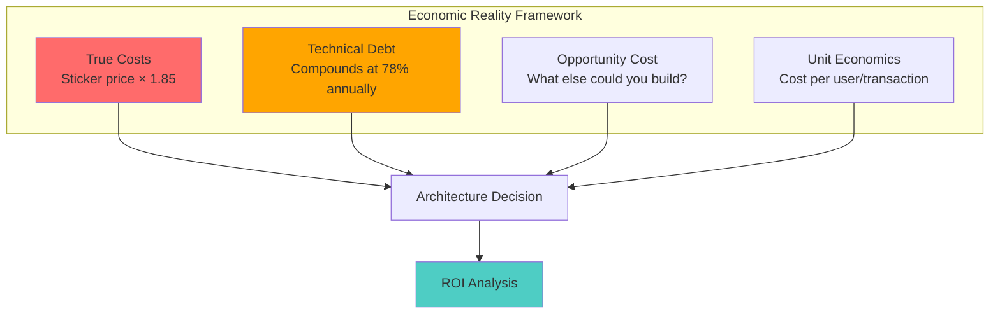
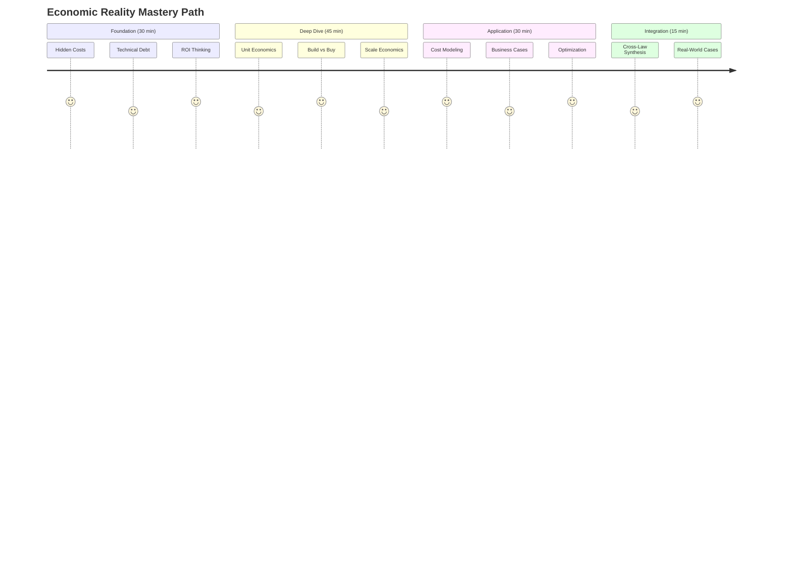
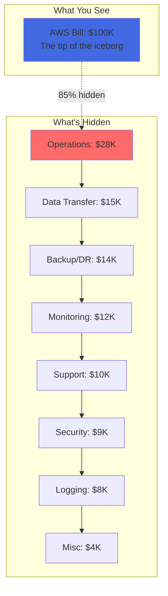
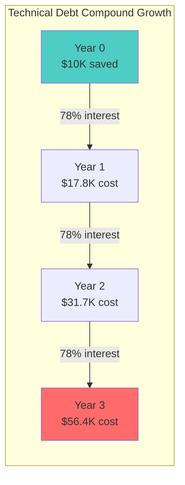
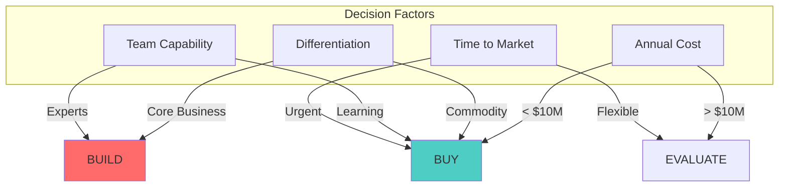
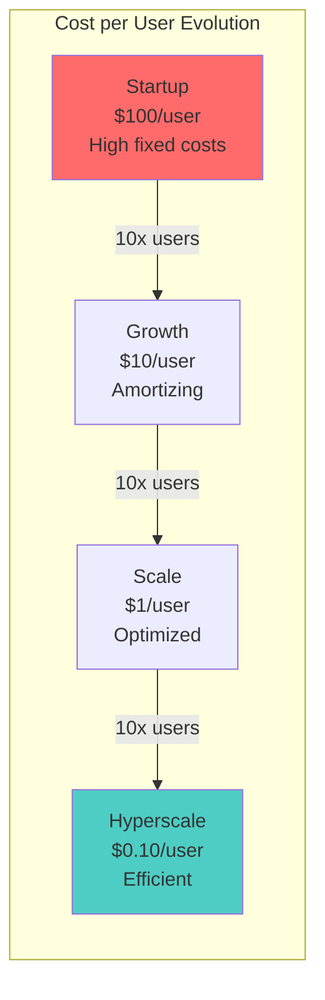
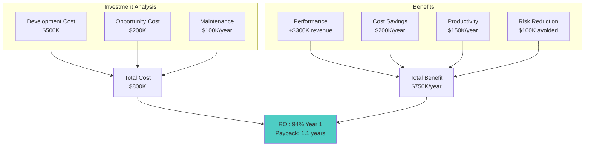

# Module 7: The Law of Economic Reality - Financial Physics of Distributed Systems

!!! abstract "The Apex Learner's Protocol for Economic Reality"
    This module implements focused learning bursts, spaced repetition, and active retrieval to master the economic principles that govern distributed systems. You'll learn that **the best architecture that bankrupts your company is still a failure**.

## Foundation: Your Economic Awakening

### The Brutal Truth About System Costs

Every line of code you write has a price tag. Every architectural decision is a financial bet. The "perfect" system that costs $10M to build but generates $1M in value is a $9M failure.

**The Core Principle**: Technology exists to serve business value, not engineering aesthetics.

### The Four Economic Pillars



## Your Learning Journey Map



---

## Focus Block 1: The Hidden Cost Iceberg (25 min)

### PRIMING: "Your $100K Cloud Bill Is Actually $185K"

Look at your last AWS bill. Whatever number you see, multiply by 1.85. That's your real cost. Shocked? Most engineers are when they discover the hidden 85% of costs lurking beneath the surface.

### CORE CONCEPT: The 1.85x Multiplier

**Industry Research** (500+ enterprise analyses):
```
True Cloud Cost = Sticker Price × 1.85
```

**Where the hidden 85% comes from:**
- Operations overhead: 28%
- Data transfer/egress: 15%
- Backup & disaster recovery: 14%
- Monitoring & observability: 12%
- Support allocation: 10%
- Security & compliance: 9%
- Logging & audit: 8%
- Miscellaneous: 4%

### VISUAL MODEL: The Cost Iceberg



### NEURAL BRIDGE: The Gym Membership Analogy

You join a gym for $50/month. But the true cost includes:
- Gas to drive there (hidden)
- Workout clothes (hidden)
- Time opportunity cost (hidden)
- Protein supplements (hidden)

Your $50 membership actually costs $150. Same with cloud services.

### ACTIVE PRACTICE: Calculate Your Hidden Costs

**Step 1**: Pick your largest cloud service
**Step 2**: Apply the hidden cost breakdown
**Step 3**: Calculate your annual "surprise" cost

Example:
```
RDS Database: $5,000/month
× 1.85 multiplier = $9,250 true cost
Hidden costs: $4,250/month = $51,000/year you didn't budget for
```

### CONSOLIDATION PROMPT 1

**PAUSE AND REFLECT**:
1. What's the biggest hidden cost in your current architecture?
2. How would you explain the 1.85x rule to your CFO?
3. Which hidden cost category surprises you most?

---

## Focus Block 2: Technical Debt as Financial Debt (25 min)

### PRIMING: "The $10K Shortcut That Cost $56K"

Your team skips proper testing to meet a deadline, saving 2 weeks ($10K). Three years later, you've spent $56K fixing bugs. This isn't bad luck—it's mathematical certainty.

### CORE CONCEPT: The Compound Interest of Shortcuts

**The Debt Formula**:
```
Future Cost = Initial Shortcut × (1.78)^years
```

**Real Example**:
- Year 0: Skip tests, save $10,000
- Year 1: $17,800 in bug fixes
- Year 2: $31,684 in maintenance
- Year 3: $56,397 total cost

### VISUAL MODEL: The Debt Spiral



### DEBT TAXONOMY: Interest Rates by Type

| Debt Type | Annual Interest | Example | Payback Priority |
|-----------|----------------|---------|------------------|
| **Critical Path** | 150-200% | Core API shortcuts | EMERGENCY |
| **Data Model** | 100-150% | Schema compromises | HIGH |
| **Testing** | 75-100% | Skipped test coverage | MEDIUM |
| **Documentation** | 40-60% | Missing runbooks | LOW |
| **Code Style** | 20-30% | Inconsistent patterns | DEFER |

### NEURAL BRIDGE: Credit Card Psychology

Technical debt = Credit card debt:
- Minimum payments keep you trapped
- Interest compounds relentlessly
- Only aggressive paydown breaks the cycle
- Prevention is 10x cheaper than cure

### ACTIVE PRACTICE: Debt Audit

Identify your top 3 technical debts:

1. **Debt #1**: ________________
   - Original shortcut value: $______
   - Years accumulated: ______
   - Current cost (using formula): $______

2. **Debt #2**: ________________
   - Original shortcut value: $______
   - Years accumulated: ______
   - Current cost: $______

3. **Debt #3**: ________________
   - Original shortcut value: $______
   - Years accumulated: ______
   - Current cost: $______

### CONSOLIDATION PROMPT 2

**CRITICAL THINKING**:
1. Which debt has the highest "interest rate" in your system?
2. What's the break-even point for fixing vs. living with each debt?
3. How would you prioritize debt paydown with limited resources?

---

## Focus Block 3: Build vs Buy Mathematics (20 min)

### PRIMING: "The $10 Million Rule"

Your team wants to build a custom solution. The vendor option costs $100K/year. When does building make economic sense? The answer: almost never below $10M annual spend.

### CORE CONCEPT: The Build vs Buy Threshold

**Industry Benchmark**:
```
Consider building when: Annual vendor cost > $10M
```

**Why $10M?**
- Below: Vendor provides faster time-to-market
- Above: Internal economies of scale emerge
- Crossover varies by complexity and capability

### DECISION MATRIX: Build vs Buy Framework



### THE TRUE COST CALCULATION

**Build Costs (Often Forgotten)**:
- Development: Estimate × 2.5 (optimism bias)
- Maintenance: 20% annually
- Opportunity cost: What else could you build?
- Technical debt: 78% compound interest
- Operational overhead: 3-5x infrastructure cost

**Buy Costs (Often Hidden)**:
- License fees (visible)
- Integration costs (hidden)
- Vendor lock-in risk (hidden)
- Customization limits (hidden)
- Support dependencies (hidden)

### REAL-WORLD CASE STUDY: Slack vs. Building Chat

**Building Internal Chat**:
- Development: 6 engineers × 1 year = $1.2M
- Maintenance: $240K/year
- Features lag: Always behind
- 5-year TCO: $2.4M

**Buying Slack**:
- License: $50K/year
- Integration: $50K one-time
- 5-year TCO: $300K

**Result**: Building costs 8x more for inferior solution

### ACTIVE PRACTICE: Build vs Buy Analysis

Choose a system component you're considering:

**Option A: BUILD**
- Development hours: _____ × $150/hour = $_____
- Annual maintenance (20%): $_____
- Opportunity cost: $_____
- 3-year TCO: $_____

**Option B: BUY**
- Annual license: $_____
- Integration cost: $_____
- 3-year TCO: $_____

**Decision**: _____________

### CONSOLIDATION PROMPT 3

**STRATEGIC THINKING**:
1. What's your organization's real "$10M threshold"?
2. Name one thing you built that should have been bought
3. How do you quantify "differentiation value"?

---

## Focus Block 4: Unit Economics and Scale (20 min)

### PRIMING: "WhatsApp's 32 Engineers vs. Facebook's 500"

How did WhatsApp support 450M users with 32 engineers while Facebook Messenger needed 500 engineers for similar scale? Unit economics.

### CORE CONCEPT: Cost Per User/Transaction

**The Unit Economics Formula**:
```
Unit Cost = (Fixed Costs / Users) + Variable Cost per User
```

**The Scale Paradox**:
- Fixed costs amortize (good)
- Complexity increases (bad)
- Operational overhead grows (bad)
- Efficiency requirements increase (challenging)

### SCALE ECONOMICS VISUALIZATION



### THE WHATSAPP SECRET

**WhatsApp Architecture**:
- Erlang for massive concurrency
- Minimal features (just messaging)
- No ads, no analytics
- Simple ops model
- Result: $0.001 per user/month

**Facebook Messenger**:
- Complex feature set
- Ads platform integration
- Analytics everywhere
- Heavy ops burden
- Result: $0.05 per user/month

**50x cost difference for similar functionality**

### EFFICIENCY ZONES

| Users | Efficiency Target | Cost per User | Architecture Focus |
|-------|------------------|---------------|-------------------|
| 0-1K | Don't optimize | $100-1000 | Prove concept |
| 1K-10K | Basic efficiency | $10-100 | Remove waste |
| 10K-100K | Optimize hot paths | $1-10 | Scale patterns |
| 100K-1M | Systematic efficiency | $0.10-1 | Architecture |
| 1M+ | Ruthless optimization | <$0.10 | Physics limits |

### ACTIVE PRACTICE: Calculate Your Unit Economics

**Your Service Metrics**:
- Monthly infrastructure cost: $_____
- Monthly operational cost: $_____
- Active users/transactions: _____
- **Cost per user**: $_____

**Benchmark Comparison**:
- Industry average: $_____
- Best in class: $_____
- Your gap: $_____

### CONSOLIDATION PROMPT 4

**SCALE THINKING**:
1. What's your current cost per user?
2. What would it take to reduce it by 10x?
3. Which architecture changes would have the biggest impact?

---

## Focus Block 5: ROI-Driven Architecture (20 min)

### PRIMING: "Every Architecture Decision Is an Investment"

Your CFO asks: "Why should we spend $500K on this refactoring?" Can you answer in financial terms they understand?

### CORE CONCEPT: Architecture ROI Framework

**The ROI Formula**:
```
ROI = (Benefit - Cost) / Cost × 100%

Benefits include:
- Performance gains → Revenue impact
- Cost savings → Direct savings
- Productivity → Velocity increase
- Risk reduction → Avoided losses
```

### ROI CALCULATION MATRIX



### BUSINESS CASE TEMPLATE

**1. Problem Statement**
- Current pain (quantified)
- Business impact ($)
- Risk if unaddressed ($)

**2. Proposed Solution**
- Technical approach
- Expected outcomes
- Success metrics

**3. Financial Analysis**
- Investment required: $____
- Annual benefits: $____
- Payback period: ____ months
- 3-year ROI: ____%

**4. Risk Assessment**
- Implementation risks
- Mitigation strategies
- Contingency plans

### REAL CASE: Database Refactoring ROI

**Investment**:
- Development: 3 engineers × 3 months = $180K
- Opportunity cost: $60K
- Total: $240K

**Benefits**:
- Performance: 50% faster → $200K revenue increase
- Cost: 40% less infrastructure → $150K/year saved
- Productivity: 2 hours/week saved → $50K/year
- Total annual benefit: $400K

**Result**: 
- ROI: 167% first year
- Payback: 7.2 months
- Decision: APPROVED

### ACTIVE PRACTICE: Build Your Business Case

Select a technical initiative you're proposing:

**Investment Analysis**:
- Development cost: $_____
- Opportunity cost: $_____
- Total investment: $_____

**Benefit Analysis**:
- Performance impact: $_____
- Cost savings: $_____
- Productivity gains: $_____
- Risk reduction: $_____
- Total annual benefit: $_____

**ROI Calculation**:
- First year ROI: ____%
- Payback period: ____ months
- 3-year NPV: $_____

### CONSOLIDATION PROMPT 5

**EXECUTIVE THINKING**:
1. How would you explain this ROI to a non-technical board?
2. What's the biggest risk to achieving the projected ROI?
3. What alternative would provide better ROI?

---

## Integration Challenge: The $100K Optimization Quest

### YOUR MISSION: Find $100K in Your Architecture

**Step 1: Cost Audit** (10 min)
- List top 10 cost drivers
- Apply 1.85x multiplier
- Identify waste

**Step 2: Debt Assessment** (10 min)
- Calculate technical debt costs
- Prioritize by interest rate
- Estimate paydown ROI

**Step 3: Build vs Buy Review** (10 min)
- Identify custom-built commodities
- Calculate switching costs
- Project savings

**Step 4: Unit Economics Analysis** (10 min)
- Calculate current cost per user
- Benchmark against industry
- Identify optimization paths

**Step 5: Create Action Plan** (10 min)
- Prioritize by ROI
- Sequence quick wins first
- Build business case

### TYPICAL DISCOVERIES

Most teams find:
- 20-30% waste in over-provisioned resources
- 15-20% savings from reserved instances
- 10-15% from data transfer optimization
- 25-40% from technical debt reduction
- **Total: $100K-500K potential savings**

---

## Cross-Law Integration

### Economic Reality × Other Laws

**With Law 1 (Correlated Failure)**:
- Single vendor saves 20% but creates correlation
- Multi-vendor costs more but reduces risk
- Economic optimum balances cost vs. reliability

**With Law 2 (Asynchronous Reality)**:
- Sync operations cost more in resources
- Async adds complexity costs
- Economic optimum considers both

**With Law 3 (Emergent Chaos)**:
- Simple systems have lower operational costs
- Complex systems have hidden chaos costs
- Economic optimum favors simplicity

**With Law 4 (Multidimensional Optimization)**:
- Cost is one dimension among many
- Optimizing cost may degrade performance
- Economic optimum requires trade-off analysis

**With Law 5 (Distributed Knowledge)**:
- Knowledge silos increase operational costs
- Documentation reduces future costs
- Economic optimum invests in knowledge sharing

**With Law 6 (Cognitive Load)**:
- Complex systems increase human costs
- Cognitive overload causes expensive errors
- Economic optimum considers human factors

---

## Practical Exercises

### Exercise 1: The Hidden Cost Calculator

Build a spreadsheet that:
1. Takes your monthly cloud bill
2. Applies the 1.85x multiplier breakdown
3. Projects annual true costs
4. Identifies top 3 optimization opportunities

### Exercise 2: Technical Debt Tracker

Create a registry that:
1. Lists all known technical debts
2. Calculates compound interest for each
3. Prioritizes by effective interest rate
4. Tracks paydown progress

### Exercise 3: Build vs Buy Analyzer

Develop a framework that:
1. Compares build vs buy for a component
2. Includes all hidden costs
3. Projects 3-year TCO for each option
4. Makes data-driven recommendations

### Exercise 4: Unit Economics Dashboard

Design metrics that show:
1. Cost per user/transaction
2. Trend over time
3. Benchmark comparisons
4. Efficiency opportunities

### Exercise 5: ROI Presentation

Prepare a 5-minute presentation that:
1. Proposes a technical investment
2. Quantifies costs and benefits
3. Shows ROI and payback period
4. Addresses key risks

---

## Retrieval Practice Gauntlets

### Gauntlet 1: Quick Recall (2 min)
1. What's the cloud cost multiplier? _____
2. Technical debt interest rate? _____
3. Build vs buy threshold? _____
4. WhatsApp's cost per user? _____
5. Typical ROI target? _____

### Gauntlet 2: Application (5 min)
Your RDS costs $10K/month. Calculate:
1. True monthly cost: $_____
2. Annual hidden costs: $_____
3. 3-year TCO: $_____

### Gauntlet 3: Analysis (10 min)
Your team built a custom analytics platform:
- Dev cost: $500K
- Maintenance: $100K/year
- Alternative: $50K/year license

Calculate:
1. 5-year TCO difference: $_____
2. Opportunity cost: $_____
3. Was building the right choice? _____

### Gauntlet 4: Synthesis (15 min)
Design a cost optimization strategy that:
1. Reduces costs by 30%
2. Maintains reliability
3. Considers all 7 laws
4. Has positive ROI in 6 months

---

## Spaced Repetition Schedule

### Day 1: Foundation
- Review hidden cost multiplier
- Calculate technical debt for one shortcut
- Identify one build vs buy decision

### Day 3: Application
- Apply 1.85x to your infrastructure
- Create debt priority list
- Calculate unit economics

### Day 7: Analysis
- Complete $100K optimization quest
- Build ROI case for one initiative
- Present findings to team

### Day 14: Synthesis
- Review all cost optimizations
- Measure actual vs projected savings
- Adjust strategy based on results

### Day 30: Mastery
- Teach economic principles to others
- Establish cost review process
- Create economic decision framework

---

## Common Pitfalls & Mitigations

### Pitfall 1: "Ignoring Hidden Costs"
**Symptom**: Budget overruns, surprise bills
**Mitigation**: Always apply 1.85x multiplier

### Pitfall 2: "Building Everything"
**Symptom**: Slow delivery, high maintenance
**Mitigation**: Default to buy below $10M threshold

### Pitfall 3: "Deferring Debt Payment"
**Symptom**: Increasing maintenance burden
**Mitigation**: Allocate 20% capacity to debt reduction

### Pitfall 4: "Optimizing Wrong Metrics"
**Symptom**: Low costs but poor performance
**Mitigation**: Balance cost with other dimensions

### Pitfall 5: "Lacking Financial Fluency"
**Symptom**: Can't get budget approval
**Mitigation**: Learn to speak ROI and TCO

---

## Real-World Case Studies

### Success: Netflix's Cloud Economics
- **Decision**: Embrace AWS fully (2008)
- **Investment**: $1B over 7 years
- **Benefit**: Scaled to 200M users
- **ROI**: 40x return on cloud investment
- **Lesson**: Strategic cloud use enables massive scale

### Failure: Friendster's Over-Engineering
- **Decision**: Build "perfect" architecture upfront
- **Investment**: $74M in premium infrastructure
- **Result**: Lost to simpler MySpace
- **Lesson**: Perfection that delays market entry is worthless

### Success: WhatsApp's Radical Simplicity
- **Decision**: Minimal features, maximum efficiency
- **Team**: 32 engineers for 450M users
- **Cost**: $0.001 per user/month
- **Exit**: $19B acquisition
- **Lesson**: Simplicity creates economic value

### Failure: Quibi's Premium Everything
- **Decision**: Top-tier tech for unproven market
- **Investment**: $1.75B in 6 months
- **Result**: Complete shutdown
- **Lesson**: Technical excellence without market fit is worthless

---

## Your Economic Reality Checklist

### Before Any Architecture Decision:
- [ ] Calculate true TCO (with 1.85x multiplier)
- [ ] Assess technical debt impact
- [ ] Compare build vs buy options
- [ ] Model unit economics at scale
- [ ] Prepare ROI analysis
- [ ] Consider opportunity costs
- [ ] Evaluate human costs
- [ ] Check against other laws
- [ ] Build business case
- [ ] Get stakeholder buy-in

### Monthly Review:
- [ ] Audit actual vs projected costs
- [ ] Update technical debt registry
- [ ] Review unit economics trends
- [ ] Identify optimization opportunities
- [ ] Calculate realized ROI
- [ ] Adjust strategy as needed

### Quarterly Planning:
- [ ] Set cost optimization targets
- [ ] Prioritize debt paydown
- [ ] Review build vs buy decisions
- [ ] Project scale economics
- [ ] Update ROI projections
- [ ] Align with business goals

---

## Summary: The Economic Reality Manifesto

1. **Every technical decision is a financial decision**
2. **Hidden costs are real costs** (1.85x multiplier)
3. **Technical debt compounds** (78% annually)
4. **Building is rarely cheaper** (below $10M threshold)
5. **Unit economics determine scalability**
6. **ROI justifies architecture investment**
7. **Opportunity cost is real cost**
8. **Simple systems have better economics**
9. **Human costs exceed infrastructure costs**
10. **The best architecture that bankrupts you is worthless**

## Final Thought

The Law of Economic Reality isn't about being cheap—it's about being smart. It's about understanding that resources are finite, that every decision has trade-offs, and that sustainable systems create sustainable businesses.

Master this law, and you'll build systems that not only work but thrive economically. Ignore it, and join the graveyard of technically brilliant but economically doomed systems.

**Remember**: The goal isn't to minimize cost—it's to maximize value. Sometimes spending more creates more value. The key is knowing when, where, and why.

---

*Continue your learning journey:*
- [← Law 6: Cognitive Load](cognitive-load.md)
- [→ Practice Exam](tests/economic-reality-exam.md)
- [↑ Return to Index](index.md)