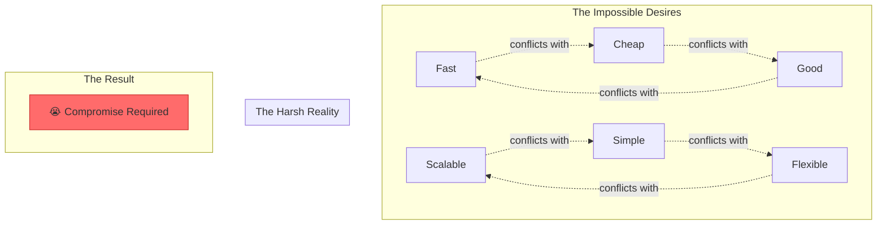

# Law 4: The Law of Multidimensional Optimization

<iframe width="100%" height="152" frameBorder="0" allowfullscreen="" allow="autoplay; clipboard-write; encrypted-media; fullscreen; picture-in-picture" loading="lazy"
    src="https://w.soundcloud.com/player/?url=https%3A//soundcloud.com/deepak-sharma-21/law-4-multidimensional-optimization&color=%235448C8&inverse=false&auto_play=false&show_user=true">
</iframe>

> "You cannot optimize all dimensions simultaneously; trade-offs are mandatory."

## The $100 Million CAP Theorem Disaster

<div class="failure-vignette">
<h3>🚨 When PayPal Tried to Have It All</h3>

```
2011: "We need perfect consistency AND availability AND partition tolerance"
Engineering: "CAP theorem says pick two"
Management: "We're PayPal. Make it work."

THE ATTEMPT:
- Synchronous replication across continents (Consistency ✓)
- No downtime allowed (Availability ✓)  
- Handle network failures (Partition Tolerance ✓)

THE REALITY:
- 47-second transaction times during network hiccups
- Cascading timeouts brought down 3 data centers
- $92M in lost transactions in 4 hours
- Emergency switch to eventual consistency

LESSON: The universe has laws. Even PayPal must obey them.
```
</div>

## Core Principle

<div class="truth-box">
<h3>⚖️ The Iron Law of Trade-offs</h3>
<p>Every system exists in a multidimensional space where:</p>
<ul>
<li><strong>Improving one dimension degrades others</strong></li>
<li><strong>The degradation is often non-linear</strong></li>
<li><strong>The optimal point shifts with context</strong></li>
<li><strong>There is no universal "best"</strong></li>
</ul>
<p>Master this law, or it will master you.</p>
</div>

## Why This Law Exists



## The Trade-off Gallery

```
THE GALLERY OF CONSEQUENCES
══════════════════════════

💀 DISASTERS (Chose Wrong)           🏆 TRIUMPHS (Chose Right)
─────────────────────────           ─────────────────────────
Robinhood: Growth > Risk            Stripe: Correctness > Speed
→ $100M meltdown                    → $95B valuation

Theranos: Speed > Accuracy          Netflix: Adaptation > Perfection  
→ Criminal fraud                    → Streaming dominance

Quibi: Features > Simplicity        Cloudflare: Smart > Fast
→ $1.75B bonfire                    → Internet backbone

Knight: Performance > Safety        Kubernetes: Flexibility > Simplicity
→ 45-min bankruptcy                 → Industry standard
```

## Real-World Case Studies

### Case 1: Robinhood's $100M Lesson in One-Dimensional Thinking 📉

<div class="failure-vignette">
<h3>The Setup: "Let's Optimize for Growth!"</h3>

```
THE GROWTH-AT-ALL-COSTS ARCHITECTURE
═══════════════════════════════════

What they optimized for:          What they ignored:
───────────────────────          ─────────────────
✓ User acquisition               ✗ Capital requirements
✓ Zero commissions               ✗ Risk management  
✓ Instant deposits               ✗ Regulatory compliance
✓ Options for everyone           ✗ System stability
✓ Gamification                   ✗ User protection

The Hidden Trade-off Bomb:
Capital Requirements = f(volatility³ × volume²)
                         ↑          ↑
                      (ignored)  (maximized)
```

**The Meltdown Timeline:**
```
JANUARY 28, 2021: THE TRADE-OFF RECKONING
════════════════════════════════════════

06:00 - GME pre-market: $350 → $500
        Volatility = EXTREME
        
07:00 - Risk calculations run
        Required capital: $3 BILLION
        Available capital: $500 million
        
09:35 - "BUYING DISABLED FOR GME, AMC, NOK..."
        
48 HOURS LATER:
- Congressional testimony
- 50+ lawsuits filed
- 50% users flee platform
- CEO crying on TV

COST OF IGNORING TRADE-OFFS: $100M+ and counting
```
</div>

### Case 2: Stripe's Multi-Dimensional Mastery 💎

<div class="decision-box">
<h3>The Challenge: Process Payments Without Compromise</h3>

```
STRIPE'S 6-DIMENSIONAL OPTIMIZATION
══════════════════════════════════

The Requirements Matrix:
┌─────────────────┬────────────┬─────────────┐
│   DIMENSION     │   TARGET   │  TRADE-OFF  │
├─────────────────┼────────────┼─────────────┤
│ Correctness     │   100%     │ NEVER       │
│ Availability    │   99.99%   │ Rare        │
│ Latency         │   <200ms   │ Sometimes   │
│ Scale           │   ∞        │ Pay for it  │
│ Security        │   Maximum  │ NEVER       │
│ Developer UX    │   Magical  │ Worth cost  │
└─────────────────┴────────────┴─────────────┘
```

**The Architecture That Balances All:**
```
STRIPE'S PAYMENT FLOW - DIFFERENT TRADE-OFFS PER COMPONENT
════════════════════════════════════════════════════════

┌─────────────────────────────────────────────────┐
│                  API GATEWAY                     │
│   Optimization: Latency + Developer Experience   │
│   Trade-off: Cost (runs in 20+ regions)         │
└────────────────────┬────────────────────────────┘
                     │
        ┌────────────┴────────────┐
        │                         │
┌───────▼────────┐      ┌────────▼────────┐
│ PAYMENT AUTH   │      │   RISK ENGINE   │
│ ───────────────│      │ ─────────────── │
│ Consistency:   │      │ Consistency:    │
│ LINEARIZABLE   │      │ EVENTUAL (5min) │
│                │      │                 │
│ Why: Never     │      │ Why: Can adapt  │
│ double-charge  │      │ based on data   │
└────────────────┘      └─────────────────┘

THE GENIUS: Each component optimizes differently!
```
</div>

### Case 3: Netflix's Adaptive Streaming Symphony 🎬

```
NETFLIX'S DYNAMIC TRADE-OFF ENGINE
═════════════════════════════════

def stream_optimizer(context):
    if context.buffering_detected():
        # USER EXPERIENCE > EVERYTHING
        return sacrifice(QUALITY)
        
    elif context.mobile and context.metered_data:
        # USER'S WALLET > QUALITY
        return sacrifice(BITRATE)
        
    elif context.device == "8K_TV" and context.speed > 100_mbps:
        # QUALITY > COST (they're paying premium)
        return maximize(BITRATE)
        
    else:
        # BALANCED APPROACH
        return adaptive_bitrate_ladder()

THE SECRET: Don't pick one point in trade-off space.
           Dance through the entire space in real-time.
```

## Trade-off Engineering Patterns

### Pattern 1: Layer Your Trade-offs

```python
class LayeredTradeoffArchitecture:
    """Different components, different trade-offs"""
    
    def __init__(self):
        self.layers = {
            'critical_path': {
                'consistency': 'strong',
                'latency': 'optimize',
                'cost': 'ignore'
            },
            'analytics': {
                'consistency': 'eventual',
                'latency': 'batch',
                'cost': 'optimize'
            },
            'static_content': {
                'consistency': 'cache_forever',
                'latency': 'cdn',
                'cost': 'minimal'
            }
        }
```

### Pattern 2: Dynamic Trade-off Navigation

```python
class DynamicOptimizer:
    """Navigate trade-off space based on context"""
    
    def optimize(self, current_state):
        if current_state.load > 0.8:
            # Survival mode
            return self.shed_accuracy_for_availability()
        elif current_state.cost > budget:
            # Cost optimization mode
            return self.reduce_redundancy()
        elif current_state.user_complaints > threshold:
            # Quality mode
            return self.improve_experience()
        else:
            # Balanced mode
            return self.maintain_equilibrium()
```

### Pattern 3: Trade-off Budgets

```python
class TradeoffBudget:
    """Explicitly budget what you're willing to sacrifice"""
    
    def __init__(self):
        self.budgets = {
            'latency_budget': 200,  # ms we can afford
            'consistency_budget': 5,  # seconds of staleness OK
            'cost_budget': 10000,  # $/month maximum
            'complexity_budget': 50  # max components
        }
    
    def can_afford(self, change):
        for dimension, cost in change.items():
            if self.budgets[dimension] < cost:
                return False
        return True
```

## The Meta-Patterns of Success

<div class="axiom-box" style="background: #1a1a1a; border: 2px solid #ff5555;">
<h3>The Universal Laws of Trade-off Success</h3>

```
PATTERN 1: LAYER YOUR TRADE-OFFS
════════════════════════════════

Stripe:      Payment auth (strict) + Analytics (loose)
Netflix:     Mobile (save data) + 4K TV (max quality)
Cloudflare:  Normal (fast) + Attack (secure)

→ Different parts, different trade-offs

PATTERN 2: MAKE TRADE-OFFS DYNAMIC
═════════════════════════════════

Static trade-offs = Death by rigidity

Netflix:     Adapts bitrate every second
Uber:        Surge pricing responds to supply/demand
Kubernetes:  Scores change with cluster state

→ Dance through trade-off space

PATTERN 3: MEASURE THE SACRIFICE
════════════════════════════════

What you don't measure, you can't manage:

Stripe:      Tracks consistency AND latency
Cloudflare:  Monitors security AND speed
Uber:        Watches driver AND rider happiness

→ Know what you're giving up

PATTERN 4: COMMUNICATE THE TRADE-OFF
══════════════════════════════════

Hidden trade-offs create enemies:

Bad:  "Service unavailable" 
Good: "Reducing quality to prevent buffering"

Bad:  "Higher prices"
Good: "Surge pricing brings more drivers"

→ Explain the why

PATTERN 5: PLAN FOR TRADE-OFF FAILURE
═══════════════════════════════════

Every trade-off has a breaking point:

Robinhood:   Growth > Risk → Broke at GME
Netflix:     Has fallback CDN hierarchy  
Stripe:      Can disable features to survive

→ Know your limits and have Plan B
```
</div>

## Practical Exercises

### Exercise 1: Map Your System's Trade-off Space

```python
# YOUR SYSTEM'S TORTURE DEVICE
# ═══════════════════════════

class MySystemTradeoffs:
    def __init__(self, system_name):
        self.name = system_name
        self.dimensions = {}
        
    def add_dimension(self, name, current_value, max_value, unit):
        """Add a dimension you care about"""
        self.dimensions[name] = {
            'current': current_value,
            'max': max_value,
            'unit': unit,
            'cost_to_improve': self.calculate_cost(name)
        }
    
    def calculate_cost(self, dimension):
        """What do you sacrifice to improve this?"""
        costs = {
            'latency': ['throughput', 'cost'],
            'consistency': ['availability', 'latency'],
            'security': ['usability', 'performance'],
            # Add your dimensions...
        }
        return costs.get(dimension, [])

# Map your production system
my_system = MySystemTradeoffs("My E-commerce Platform")
my_system.add_dimension('page_load_time', 2.5, 0.5, 'seconds')
my_system.add_dimension('availability', 0.999, 0.99999, 'nines')
# Add 8+ more dimensions
```

### Exercise 2: The Black Friday Simulator

<div class="failure-vignette">
<h3>Scenario: Black Friday Is Coming!</h3>

Your e-commerce system normally handles 1,000 requests/second. Black Friday will bring 50,000 requests/second. You have 1 week to prepare.

```
Available Actions (each has consequences):
════════════════════════════════════════

A) Enable Eventual Consistency
   + Throughput: 10x
   - Consistency: Some users see old prices
   
B) Increase Cache TTL to 1 hour  
   + Throughput: 5x
   - Freshness: Sales might show wrong inventory
   
C) Add 10x More Servers
   + Throughput: 10x
   - Cost: $100,000 for the day
   
D) Implement Request Queuing
   + Availability: Won't crash
   - Latency: Some users wait 30+ seconds
   
E) Shed Non-Critical Features
   + Throughput: 3x
   - Revenue: No recommendations = -20% sales

YOUR MISSION: Combine actions to survive Black Friday
```
</div>

## Trade-off Monitoring

```yaml
# trade-off-health.yaml
trade_off_metrics:
  consistency_vs_availability:
    - metric: replication_lag_seconds
      threshold: 5
      alert: "Consistency degrading"
    - metric: availability_percentage  
      threshold: 99.9
      alert: "Availability at risk"
      
  performance_vs_cost:
    - metric: p99_latency_ms
      threshold: 200
      alert: "Performance degrading"
    - metric: monthly_spend
      threshold: 10000
      alert: "Cost exceeding budget"
      
  security_vs_usability:
    - metric: auth_failure_rate
      threshold: 0.05
      alert: "Security too strict"
    - metric: unauthorized_access_attempts
      threshold: 100
      alert: "Security too loose"
```

## Emergency Trade-off Playbook

```
SCENARIO: Database CPU at 90%
════════════════════════════

Option A: Scale Up (Easy)
├─ Time: 5 minutes
├─ Cost: +$1000/month
├─ Risk: None
└─ Reversal: Easy

Option B: Add Read Replicas (Medium)
├─ Time: 30 minutes  
├─ Cost: +$500/month
├─ Risk: Consistency issues
└─ Reversal: Complex

Option C: Enable Query Cache (Hard)
├─ Time: 2 hours
├─ Cost: +$100/month
├─ Risk: Stale data
└─ Reversal: Easy

YOUR DECISION TREE:
If revenue > $1M/day: Choose A
If consistency critical: Choose B  
If cost sensitive: Choose C
```

## The Bottom Line

<div class="truth-box">
<h3>Questions to Save Your System</h3>

```
AFTER READING THIS LAW, ASK:
═════════════════════════

1. What is my Robinhood dimension?
   (What am I dangerously ignoring?)

2. What is my Stripe architecture?
   (Can different parts make different trade-offs?)

3. What is my Netflix adaptation?
   (Can I move through trade-off space dynamically?)

4. What is my Uber transparency?
   (Do users understand my trade-offs?)

5. What is my Cloudflare trigger?
   (When do I flip to survival mode?)

6. What is my Kubernetes scorer?
   (How do I balance competing dimensions?)

If you can't answer these, you're not ready for production.
```
</div>

!!! danger "🚨 FACING IMPOSSIBLE TRADE-OFFS? Decision Framework:"
    1. **Map the Triangle** – What 3 dimensions compete?
    2. **Calculate Real Costs** – Quantify each dimension in dollars/time/risk
    3. **Choose Your Sacrifice** – Pick 2 to optimize, accept degradation in the 3rd
    4. **Monitor Balance** – Set alerts when trade-offs drift
    5. **Plan B Ready** – Know your emergency rebalancing moves
    6. **Communicate Choice** – Make trade-offs transparent to stakeholders

## Related Concepts

- **[Law 1: Correlated Failure](correlated-failure.md)** - Trade-offs can create correlation
- **[Law 2: Asynchronous Reality](asynchronous-reality.md)** - Time is a dimension to trade
- **[Law 3: Emergent Chaos](emergent-chaos.md)** - Trade-offs interact unpredictably
- **Patterns**: [CQRS](../pattern-library/data-management/cqrs.md), [Sharding](../pattern-library/scaling/sharding.md), [Service Mesh](../pattern-library/communication/service-mesh.md)
## Pattern Implementations

Patterns that address this law:

- [Caching Strategies](../../pattern-library/scaling/caching-strategies/)
- [Graceful Degradation](../../pattern-library/resilience/graceful-degradation/)
- [Sharding](../../pattern-library/scaling/sharding/)


