# Law 4: The Law of Multidimensional Optimization

## The Complete Blueprint

Every system exists on a multidimensional Pareto frontier where improving one dimension requires degrading others—this isn't a design choice, it's mathematical law. Like thermodynamics, you cannot create something from nothing. The famous "fast, cheap, good—pick two" represents the iron triangle that governs all engineering decisions. In distributed systems, this manifests as the CAP theorem (you cannot have consistency, availability, AND partition tolerance simultaneously) and extends into PACELC (during normal operation, you must choose between latency and consistency). Understanding trade-offs means mastering Pareto frontiers (the boundary of optimal solutions), multi-objective optimization (balancing competing goals), and dynamic context switching (different optimization targets for different situations). The key insight is that superior systems don't eliminate trade-offs—they make them consciously, measure them continuously, and adapt them contextually to business priorities.

### Visual Trade-off Landscape


### What You'll Master
- **Iron Triangle Navigation**: Make conscious fast/cheap/good trade-offs
- **CAP Theorem Applications**: Choose consistency vs availability during partitions
- **PACELC Framework**: Balance latency vs consistency in normal operations
- **Pareto Frontier Analysis**: Find optimal solutions among competing objectives
- **Business Case Building**: Quantify trade-offs for stakeholder communication
- **Dynamic Optimization**: Adapt trade-off priorities based on context

## The Core Mental Model

**Analogy**: System design is like running a restaurant—you can optimize for fast service, low prices, or high quality, but optimizing all three simultaneously violates resource conservation laws. The best restaurants choose two dimensions consciously and excel within those constraints.

**Fundamental Principle**: Resources are finite. Every improvement in one dimension requires resources from another. E_total = Σ E_i = constant.

**Why This Matters**:
- Attempting to optimize everything simultaneously creates mediocre solutions
- Hidden trade-offs surface as production disasters ($440M Knight Capital)
- Business sustainability requires conscious trade-off management, not wishful thinking

## The Journey Ahead


**Prerequisites**: Experience with system design decisions and business stakeholder communication

prerequisites:
  - core-principles/laws/correlated-failure.md
  - core-principles/laws/asynchronous-reality.md
  - core-principles/laws/cognitive-load.md
  - core-principles/laws/emergent-chaos.md
  - core-principles/laws/distributed-knowledge.md
  - core-principles/pillars/index.md
  - pattern-library/scaling/auto-scaling.md
  - concepts/optimization-theory
  - concepts/constraint-programming
  - concepts/pareto-optimality
  - math/game-theory
  - math/multi-objective-optimization

---

## The Iron Triangle Reality

### Universal Engineering Truth

"Fast, cheap, good—pick two" isn't a limitation—it's physics. Every system exists on a Pareto frontier where resources are finite and improving one dimension requires degrading others.

### The Restaurant Model

Restaurant optimization reveals identical trade-off patterns:
- **Fast service** requires stressed staff and higher error rates
- **Low prices** require lower quality ingredients and simpler preparation
- **High quality** requires expensive ingredients and slow, careful preparation

Your distributed system follows identical laws.

```mermaid
graph TB
    subgraph "Restaurant Trade-off Triangle"
        Fast[Fast Service<br/>⚡ Quick orders<br/>💰 Cost: Stressed staff, mistakes]
        Cheap[Low Prices<br/>💵 Affordable meals<br/>💰 Cost: Lower quality ingredients]
        Good[High Quality<br/>🌟 Fresh ingredients<br/>💰 Cost: Slow preparation]
        
        Fast -.->|Pick Two| Cheap
        Cheap -.->|Pick Two| Good  
        Good -.->|Pick Two| Fast
    end
    
    subgraph "System Design Parallel"
        Latency[Low Latency<br/>⚡ Fast responses<br/>💰 Cost: More infrastructure]
        Cost[Low Cost<br/>💵 Budget friendly<br/>💰 Cost: Shared resources]
        Reliability[High Reliability<br/>🌟 Always available<br/>💰 Cost: Redundancy]
        
        Latency -.->|Pick Two| Cost
        Cost -.->|Pick Two| Reliability
        Reliability -.->|Pick Two| Latency
    end
    
    style Fast fill:#ff6b6b,color:#fff
    style Cheap fill:#4ecdc4,color:#000
    style Good fill:#95e1d3,color:#000
```



**The Mathematical Foundation**:
$$E_{total} = \sum_{i=1}^{n} E_i = \text{constant}$$

Where resources are finite, and every improvement in one area requires resources from another.

### Foreshadowing: "What if we need all three?"
The iron triangle seems limiting, but what if there are ways to move the entire triangle? We'll explore this in later focus blocks.

### Consolidation Prompt 1
**PAUSE**: Map your current system to the iron triangle. Which two dimensions are you optimizing for? What are you sacrificing?

### Retrieval Gauntlet 1:

**Tier 1 (Recognition)**: "Name three fundamental trade-offs in your system"
- Example: Latency vs Cost, Consistency vs Availability, Features vs Simplicity

**Tier 2 (Application)**: "Plot your service on a Pareto frontier"
- Draw axes: X = Cost, Y = Performance
- Mark where your system sits
- Identify if you're Pareto optimal

**Tier 3 (Creation)**: "Design a trade-off matrix for a new feature"
```
| Feature Option | Performance | Cost | Reliability | Complexity |
|---------------|------------|------|-------------|------------|
| Option A      | High       | High | Medium      | Low        |
| Option B      | Medium     | Low  | High        | High       |
| Option C      | Low        | Low  | Low         | Low        |
```

---

## Focus Block 2: "The CAP Theorem Reality" (20 min)

**Priming Question**: "During a network split, your database must choose: Accept writes and risk inconsistency, or reject writes and stay consistent. Which do you choose and why?"

### The Mathematical Impossibility

The CAP Theorem isn't a design guideline—it's a **mathematical proof** that you cannot have all three:

- **C**onsistency: All nodes see the same data
- **A**vailability: System remains operational  
- **P**artition tolerance: Survives network splits

### Real-World CAP Scenarios

```mermaid
graph TB
    subgraph "Network Partition Event"
        DC1[Datacenter A<br/>Users: 10,000<br/>Revenue: $50K/hour] -.->|❌ Network<br/>Partition| DC2[Datacenter B<br/>Users: 8,000<br/>Revenue: $40K/hour]
    end
    
    subgraph "Your Choice During Partition"
        CHOICE[You Must Choose]
        
        CP[Choose CP<br/>✅ Consistency<br/>✅ Partition Tolerance<br/>❌ Availability<br/><br/>Action: Reject all writes<br/>Cost: $90K/hour revenue loss]
        
        AP[Choose AP<br/>❌ Consistency<br/>✅ Availability<br/>✅ Partition Tolerance<br/><br/>Action: Accept writes on both sides<br/>Cost: Data conflicts to resolve later]
        
        CHOICE --> CP
        CHOICE --> AP
    end
    
    style CP fill:#ff6b6b,color:#fff
    style AP fill:#4ecdc4,color:#000
    style CHOICE fill:#ffa500,color:#000
```



### The $100M CAP Theorem Disaster: Robinhood (2021)

**The Setup**: Robinhood chose Availability during the GameStop surge, creating a consistency nightmare.

**Implementation**: CAP theorem disaster analysis system - tracks partition events, system choices (AP vs CP), and calculates the business cost of consistency failures including immediate operational impact, financial requirements, and long-term consequences.

### Neural Bridge: The Hospital Emergency Room

Think of CAP like an emergency room during a disaster:

- **Consistency**: Every doctor has the same patient information
- **Availability**: Emergency room stays open and treats patients
- **Partition**: Communication systems fail between departments

During a crisis, you **must** choose:
- **CP**: Close ER until communication restored (consistent but unavailable)
- **AP**: Treat patients with potentially outdated info (available but inconsistent)

### Consolidation Prompt 2
**PAUSE**: Identify a recent system decision where you faced a CAP trade-off. Which two did you choose? What was the cost?

### Retrieval Gauntlet 2:

**Tier 1**: "State the CAP theorem in your own words"

**Tier 2**: "For your current system, which CAP choice did you make and why?"

**Tier 3**: "Design a fallback strategy for both CP and AP choices in your system"

---

## Focus Block 3: "PACELC - CAP Theorem Extended" (15 min)

**Priming Question**: "CAP theorem tells you what to do during network partitions. But what about the 99.9% of time when everything works normally?"

### PACELC Framework

**P**artition tolerance: During network partitions, choose Availability vs Consistency
**E**lse: During normal operation, choose Latency vs Consistency

```mermaid
graph TB
    subgraph "PACELC Decision Tree"
        NET[Network State?]
        
        PARTITION[Network Partition<br/>🚨 Crisis Mode]
        NORMAL[Normal Operation<br/>✅ Business as Usual]
        
        PAC[CAP Choice Required]
        ELC[PACELC Choice Required]
        
        PA[PA: Available + Fast<br/>Example: Social media feeds<br/>Trade-off: Stale data OK]
        PC[PC: Consistent + Reliable<br/>Example: Banking systems<br/>Trade-off: Slower responses]
        
        EL[EL: Fast + Available<br/>Example: CDN caching<br/>Trade-off: Eventual consistency]
        EC[EC: Consistent + Reliable<br/>Example: ACID databases<br/>Trade-off: Higher latency]
        
        NET --> PARTITION
        NET --> NORMAL
        PARTITION --> PAC
        NORMAL --> ELC
        PAC --> PA
        PAC --> PC
        ELC --> EL
        ELC --> EC
    end
```



### Real System PACELC Classifications

| **System** | **Partition Choice** | **Normal Operation** | **Use Case** |
|------------|---------------------|---------------------|--------------|
| **DynamoDB** | PA (Available) | EL (Low Latency) | Web applications, gaming |
| **MongoDB** | PC (Consistent) | EC (Strong Consistency) | Financial systems |
| **Cassandra** | PA (Available) | EL (Low Latency) | Time series, analytics |
| **PostgreSQL** | PC (Consistent) | EC (Strong Consistency) | Traditional applications |

### Code Example: Implementing PACELC Choices

**Implementation**: PACELC strategy system - dynamically routes requests based on network state (normal vs partition), applying different trade-off strategies: PA (Availability + Partition tolerance) vs PC (Consistency + Partition tolerance) during partitions, and EL (Latency priority) vs EC (Consistency priority) during normal operations.

### Consolidation Prompt 3
**PAUSE**: For your current system, what's your PACELC classification? Are you PA/EL, PC/EC, or a hybrid?

---

## Focus Block 4: "The Cost-Performance-Reliability Triangle" (12 min)

**Priming Question**: "Your system needs to handle 10x traffic tomorrow. You have three options: More servers (expensive), caching (risky), or load shedding (user impact). What's your framework for choosing?"

### The Business Reality Triangle

```mermaid
graph TB
    subgraph "Business Trade-off Triangle"
        PERF[Performance<br/>🚀 Fast responses<br/>💰 Cost: Infrastructure]
        COST[Low Cost<br/>💵 Budget friendly<br/>💰 Cost: Performance/Reliability]
        RELI[Reliability<br/>🛡️ Always works<br/>💰 Cost: Redundancy/Complexity]
        
        PERF -.->|Choose 2| COST
        COST -.->|Choose 2| RELI  
        RELI -.->|Choose 2| PERF
    end
    
    subgraph "Real Examples"
        NETFLIX[Netflix<br/>Performance + Reliability<br/>Cost: $15B infrastructure]
        STARTUP[Startup MVP<br/>Performance + Cost<br/>Risk: Downtime acceptable]
        BANK[Traditional Bank<br/>Reliability + Cost<br/>Accept: Slower systems]
    end
```



### Quantified Trade-off Models

Based on analysis of 50+ production systems:

**Implementation**: Trade-off cost calculator - uses exponential scaling models to calculate infrastructure costs based on performance and reliability levels, determining feasibility within budget constraints and identifying when trade-offs are required.

### Decision Framework: The Architecture Review Board Meeting

**Scenario**: You're presenting three options to executives:

```
┌─────────────────────────────────────────────────────────────┐
│                    Option Comparison                        │
├─────────────────┬─────────────┬─────────────┬─────────────┤
│                 │   Option A  │   Option B  │   Option C  │
├─────────────────┼─────────────┼─────────────┼─────────────┤
│ Response Time   │    50ms     │   200ms     │   500ms     │
│ Uptime          │   99.9%     │  99.99%     │   99.5%     │
│ Monthly Cost    │   $50K      │   $25K      │   $10K      │
│ Implementation  │  3 months   │  1 month    │  2 weeks    │
│ Risk Level      │    Low      │   Medium    │    High     │
└─────────────────┴─────────────┴─────────────┴─────────────┘
```

**Your presentation framework**:
1. **Business Impact**: "Option A serves 2x more customers per server"
2. **Risk Assessment**: "Option C has 10x higher downtime risk" 
3. **ROI Analysis**: "Option B breaks even in 8 months"
4. **Recommendation**: "Given our growth phase, Option B balances all three"

### Consolidation Prompt 4
**PAUSE**: Calculate the trade-off costs for your current system. Which vertex of the triangle are you closest to?

---

## Focus Block 5: "Multi-Objective Optimization in Action" (18 min)

**Priming Question**: "You have four competing objectives: minimize latency, minimize cost, maximize reliability, minimize complexity. How do you find the optimal balance when you can't optimize all four simultaneously?"

### The Pareto Frontier Discovery

**Mathematical Foundation**: A solution is Pareto optimal if no other solution exists that improves at least one objective without making any other objective worse.

**Implementation**: Multi-objective optimization system - evaluates system configurations against multiple objectives (latency, cost, error rate, complexity), identifies Pareto-optimal configurations, and recommends optimal configurations based on weighted business priorities for different scenarios (startup, enterprise, gaming).

### Visual Trade-off Analysis


### Consolidation Prompt 5
**PAUSE**: Using the multi-objective framework, identify your system's current configuration. Is it Pareto optimal for your business context?

---

## Focus Block 6: "Dynamic Trade-off Navigation" (10 min)

**Priming Question**: "Black Friday is coming. Your system needs to handle 10x normal load for 48 hours. How do you temporarily shift your trade-off priorities and then shift back?"

### The Context-Aware Architecture

Real systems don't optimize for fixed trade-offs—they adapt based on:
- **Time**: Different optimization for peak vs. off-peak hours
- **Load**: Different strategies under stress vs. normal operation
- **Business Context**: Different priorities during sales events
- **Failure State**: Different trade-offs during degraded operation

**Implementation**: Dynamic trade-off manager - automatically analyzes system metrics to determine context (normal, high load, cost crisis, reliability crisis), switches optimization profiles with different configurations for cache TTL, replica count, consistency levels, and priorities based on current conditions.

### Professional Scenario: "The Midnight Scaling Decision"

**Setting**: 2 AM, your pager goes off. Traffic is spiking 500% and latency is climbing.

**Your options**:

```
┌─────────────────────────────────────────────────────────────┐
│                    Emergency Options                        │
├─────────────────┬─────────────┬─────────────┬─────────────┤
│                 │ Scale Out   │ Cache Aggr. │ Load Shed   │
├─────────────────┼─────────────┼─────────────┼─────────────┤
│ Implementation  │  2 minutes  │  30 seconds │  10 seconds │
│ Cost Impact     │   +$2K/day  │   +$50/day  │     $0      │
│ User Impact     │    None     │   Staleness │ 20% errors  │
│ Risk Level      │     Low     │    Medium   │    High     │
│ Rollback Time   │  5 minutes  │  1 minute   │ Immediate   │
└─────────────────┴─────────────┴─────────────┴─────────────┘
```

**Decision framework**:
1. **Immediate**: Load shed to buy time (10 seconds)
2. **Short-term**: Enable aggressive caching (30 seconds)  
3. **Medium-term**: Scale out infrastructure (2 minutes)
4. **Recovery**: Gradually restore full service

### Consolidation Prompt 6
**PAUSE**: Design a context-switching strategy for your system. What are your contexts and how do priorities change?

---

## Focus Block 7: "Trade-off Analysis Tools" (8 min)

**Priming Question**: "How do you convince your CEO that spending $50K more per month will actually save the company money? What tools and metrics make trade-offs visible to business stakeholders?"

### The Business Case Calculator

**Implementation**: Trade-off business case calculator - quantifies the business impact of technical decisions by calculating latency impact on conversion rates, reliability impact on revenue, ROI analysis, and generates recommendations based on payback periods and return ratios.

### Executive Summary Template

```markdown
## Infrastructure Optimization Business Case

### Executive Summary
- **Investment**: $35K/month ($420K annually)  
- **Return**: $1.2M additional annual revenue
- **ROI**: 286% (payback in 4.2 months)
- **Risk Mitigation**: $180K annual downtime risk reduction

### The Problem
Current system performance impacts conversion:
- 250ms average response time → 2.3% conversion loss
- 99.5% uptime → $180K annual revenue at risk from outages

### The Solution  
Premium infrastructure upgrade:
- 70% latency reduction (250ms → 75ms)
- 5x reliability improvement (99.5% → 99.95%)
- Immediate implementation (2-week timeline)

### Financial Impact
| Metric | Current | Improved | Annual Benefit |
|--------|---------|----------|----------------|
| Conversion Rate | 4.0% | 4.7% | +$1.02M revenue |
| Downtime Cost | $180K risk | $36K risk | +$144K savings |
| **Total Benefit** | | | **$1.164M** |
| **Investment Cost** | | | **$420K** |
| **Net Benefit** | | | **$744K** |

### Recommendation
🟢 **APPROVE**: 277% ROI with 4.2-month payback period
```

---

## Focus Block 8: "Dynamic Optimization Strategies" (5 min)

**Priming Question**: "Your optimization decisions can't be static. How do you build systems that automatically find and move to better trade-off points as conditions change?"

### The Self-Optimizing System

**Implementation**: Adaptive optimization engine - continuously explores configuration space around current settings, evaluates performance across multiple objectives, maintains Pareto frontier of optimal configurations, and automatically navigates to better trade-off points based on business priorities.

**Key Insight**: The best systems don't just make good trade-offs—they continuously discover better ones.

---

## SPACED REPETITION: Reinforce Your Learning

### Day 1: Immediate Reinforcement
**Question**: "State the core truth of multidimensional optimization"
**Answer**: Every system exists on a multidimensional Pareto frontier where improving one dimension requires degrading others.

### Day 3: Application Challenge
**Question**: "Apply PACELC to your current database choice"
**Your Task**: 
1. Identify if your system is PA or PC during partitions
2. Identify if your system is EL or EC during normal operation  
3. Justify why this classification fits your use case

### Day 7: Stakeholder Communication
**Question**: "Present a trade-off analysis to stakeholders"
**Your Task**: Use the business case calculator to justify a technical decision with:
- Quantified benefits ($X revenue impact)
- Clear costs ($Y infrastructure cost)  
- ROI analysis (Z% return)
- Risk assessment

### Day 14: Crisis Simulation
**Question**: "Your system is failing. Apply the emergency decision framework"
**Scenario**: 95% CPU, 8% error rate, Black Friday traffic
**Your Task**: Choose your trade-off strategy and justify with the emergency framework

### Day 30: Integration Mastery
**Question**: "Design a multi-objective optimization strategy for a new system"
**Your Task**: 
1. Define your optimization dimensions
2. Create a Pareto frontier analysis  
3. Design context-switching logic
4. Build business case for trade-off decisions

---

## DECISION FRAMEWORKS: Your Professional Toolkit

### 1. "The Architecture Review Board Meeting"

**Scenario**: You're presenting three system design options to the architecture committee.

**Framework**:
```
1. QUANTIFY TRADE-OFFS
   - Latency: Option A (50ms), Option B (150ms), Option C (300ms)
   - Cost: Option A ($50K/mo), Option B ($25K/mo), Option C ($10K/mo)  
   - Reliability: Option A (99.99%), Option B (99.9%), Option C (99.5%)

2. BUSINESS IMPACT ANALYSIS
   - Revenue impact per option
   - Risk assessment per option
   - Implementation timeline per option

3. RECOMMENDATION WITH RATIONALE
   - "Option B optimizes for our growth phase priorities"
   - "Provides 4x reliability improvement over Option C"
   - "Costs 50% less than Option A with acceptable 200ms latency penalty"
   - "Breaks even in 8 months based on conversion impact analysis"
```

### 2. "The Performance vs Cost Debate"

**Scenario**: Product wants sub-100ms latency, Finance wants to cut infrastructure costs by 40%.

**Framework**:
```
1. QUANTIFY THE CONFLICT
   - Current: 180ms latency, $40K/month cost
   - Product requirement: <100ms latency
   - Finance requirement: <$24K/month cost
   - Mathematical impossibility: Both requirements cannot be met

2. EXPLORE PARETO FRONTIER
   - Option 1: 95ms latency, $48K/month (Product priority)
   - Option 2: 220ms latency, $22K/month (Finance priority)  
   - Option 3: 130ms latency, $32K/month (Compromise)

3. REFRAME THE CONVERSATION
   - "Let's optimize for customer conversion, which drives revenue"
   - "100ms latency improvement = 2% conversion increase = $200K annual revenue"
   - "ROI on latency optimization: 500% annually"
```

### 3. "The Scaling Strategy Session"

**Scenario**: Traffic is growing 20% monthly. Current architecture won't scale past 6 months.

**Framework**:
```
1. DEFINE THE OPTIMIZATION SPACE
   - Time dimension: 6-month, 1-year, 2-year scaling needs
   - Cost dimension: Current budget, growth budget, emergency budget
   - Risk dimension: Acceptable downtime, performance degradation

2. LAYERED OPTIMIZATION STRATEGY
   - Short-term (0-3 months): Vertical scaling + caching
   - Medium-term (3-9 months): Horizontal scaling + sharding
   - Long-term (9+ months): Microservices + distributed architecture

3. DYNAMIC ADAPTATION PLAN
   - Monitoring thresholds for each transition
   - Rollback plans for each optimization step
   - Cost gates and business approval processes
```

---

## VISUAL EXERCISES: Make Trade-offs Tangible

### Exercise 1: Draw Your Pareto Frontier

**Task**: Create a 2D plot of your system's trade-offs

```
Cost ($K/month) ↑
               |
          40   |     * (Low latency, High cost)
               |    /
          30   |   * (Balanced)  
               |  /
          20   | * (High latency, Low cost)
               |/
          10   *
               |________________→
              100  200  300  400  Latency (ms)
```

**Your Action**: 
1. Choose two key trade-off dimensions for your system
2. Plot 5-10 possible configurations  
3. Identify the Pareto frontier (outer edge)
4. Mark where your current system sits

### Exercise 2: Map Services to Trade-off Space

**Task**: Plot different services on a 3D trade-off cube

```
        Reliability
             ↑
            /|\
           / | \
      Banking  |  Gaming (Low latency priority)
     Systems   |     *
         *     |    /
              /|   /
             / |  /
            /  | /
           /   |/
      Analytics*________________→ Cost Optimization
         /     (High cost tolerance)
        /
       ↓
  Performance
```

**Your Action**:
1. List your organization's different services
2. Plot each service in 3D space (Performance, Cost, Reliability)  
3. Identify clusters and outliers
4. Justify why each service sits where it does

### Exercise 3: Create Decision Matrices

**Task**: Build a weighted decision matrix for a trade-off choice

```
| Option | Latency | Cost | Reliability | Complexity | Weighted Score |
|--------|---------|------|-------------|------------|----------------|
| A      | 9 (×0.4)| 3 (×0.3)| 8 (×0.2)   | 7 (×0.1)   | 6.8           |
| B      | 6 (×0.4)| 8 (×0.3)| 6 (×0.2)    | 9 (×0.1)   | 6.9           |
| C      | 3 (×0.4)| 9 (×0.3)| 4 (×0.2)    | 8 (×0.1)   | 6.1           |
```

**Your Action**:
1. Define your evaluation criteria
2. Assign business-driven weights to each criterion
3. Score each option (1-10 scale)
4. Calculate weighted scores to find optimal choice

---

## PROFESSIONAL SCENARIOS: Real-world Applications

### Scenario 1: "Explaining Trade-offs to Product Management"

**Situation**: Product Manager wants to add real-time notifications, personalized feeds, and advanced search simultaneously. Current system can handle one additional feature.

**Your Response Framework**:

```markdown
## Trade-off Analysis: Feature Prioritization

### Resource Constraints
- Current system capacity: 80% utilized
- Available engineering cycles: 200 person-hours
- Infrastructure budget: $15K additional monthly

### Feature Analysis
| Feature | Engineering Cost | Infrastructure Cost | Performance Impact | Business Value |
|---------|------------------|--------------------|--------------------|----------------|
| Real-time notifications | 120 hours | $8K/month | -15% response time | High user engagement |
| Personalized feeds | 180 hours | $12K/month | -25% response time | Medium retention boost |  
| Advanced search | 80 hours | $5K/month | -5% response time | Low usage feature |

### Recommendation
**Phase 1 (Q1)**: Implement real-time notifications
- Highest business value per engineering hour
- Fits within infrastructure budget
- Manageable performance impact

**Phase 2 (Q2)**: Scale infrastructure then add personalized feeds  
- Requires infrastructure investment first
- Higher performance impact needs mitigation

**Phase 3 (Q3)**: Advanced search as polish feature
- Lower priority, easier implementation
- Can be added when system has more headroom
```

### Scenario 2: "The Midnight Scaling Decision"

**Situation**: 2:30 AM, traffic spiked 800%, site is crawling, revenue dropping $5K/minute.

**Your Decision Process**:

**Implementation**: Midnight crisis decision framework - evaluates emergency response options by calculating implementation time, cost per hour, effectiveness rating, risk assessment, and total first-hour cost including delay penalties during revenue loss situations.

**Decision**: Execute all three in parallel:
1. **Immediate (30 seconds)**: Shed non-critical load to stop the bleeding
2. **Short-term (1 minute)**: Enable aggressive caching for quick relief  
3. **Medium-term (3 minutes)**: Auto-scale servers for sustainable solution

**Rationale**: Time pressure demands parallel execution. $15K delay cost justifies any reasonable infrastructure spending.

### Scenario 3: "Budget Cuts Force Optimization"

**Situation**: CFO mandates 40% infrastructure cost reduction. Current spend: $80K/month. Target: $48K/month.

**Your Strategic Response**:

```markdown
## Cost Optimization Strategy: 40% Reduction Plan

### Current State Analysis
- Monthly cost: $80K
- Target cost: $48K  
- Reduction needed: $32K (40%)

### Optimization Opportunities
| Category | Current Cost | Optimized Cost | Savings | Risk Level |
|----------|--------------|----------------|---------|------------|
| **Compute instances** | $35K | $22K | $13K | Low |
| **Storage optimization** | $15K | $8K | $7K | Low |
| **Network/CDN** | $12K | $8K | $4K | Medium |
| **Database tier** | $18K | $10K | $8K | High |

### Implementation Plan
**Phase 1 (Month 1): Low-risk optimizations ($20K savings)**
- Right-size compute instances based on actual utilization
- Implement storage lifecycle policies  
- Optimize network traffic patterns

**Phase 2 (Month 2): Medium-risk optimizations ($7K savings)**
- Migrate to cheaper regions for non-critical workloads
- Implement more aggressive CDN caching

**Phase 3 (Month 3): High-risk optimizations ($5K savings)**  
- Database tier optimization (requires testing)
- Service consolidation (requires re-architecture)

### Risk Mitigation
- Gradual rollout with monitoring at each phase
- Rollback plans for each optimization
- Performance monitoring with automated alerts
```

---

## SUCCESS vs. FAILURE: Learn from History

### Failures: When Single-Dimensional Thinking Destroys Value

#### Case 1: Knight Capital's 45-Minute $440M Loss (2012)
**Single-Dimension Optimization**: Speed over safety
- **Trade-off Made**: Optimized for execution speed, ignored risk controls
- **Ignored Dimension**: Safety mechanisms and testing procedures
- **Cost**: $440M loss in 45 minutes, company bankruptcy
- **Lesson**: Risk management is not a constraint—it's an optimization dimension

#### Case 2: Robinhood's Collateral Crisis (2021)  
**Single-Dimension Optimization**: Growth over risk management
- **Trade-off Made**: User acquisition over capital requirements planning
- **Ignored Dimension**: Financial risk and regulatory compliance  
- **Cost**: $3.4B emergency funding, 40% ownership dilution
- **Lesson**: All constraints eventually become binding

#### Case 3: Theranos's Scientific Shortcut (2003-2018)
**Single-Dimension Optimization**: Speed to market over accuracy
- **Trade-off Made**: Fast product development over scientific validation
- **Ignored Dimension**: Medical accuracy and patient safety
- **Cost**: Criminal charges, complete company collapse
- **Lesson**: Some trade-offs are not negotiable in regulated industries

### Triumphs: Mastering Multi-Dimensional Excellence

#### Case 1: Stripe's Layered Optimization Strategy
**Multi-Dimensional Success**: Different services, different trade-offs
**Implementation**: Layered optimization strategy - defines different trade-off profiles for different services: payment processing (reliability-focused), analytics pipeline (cost-optimized), and API documentation (availability-focused).
**Result**: $95B valuation, industry-leading developer experience

#### Case 2: Netflix's Dynamic Context Switching
**Multi-Dimensional Success**: Real-time Pareto navigation
- **Normal Load**: Optimize for cost (eventual consistency, longer caches)
- **Peak Load**: Optimize for performance (more servers, shorter caches)  
- **Failure Mode**: Optimize for availability (graceful degradation)
**Result**: 260M subscribers, 99.97% availability during peak events

#### Case 3: Kubernetes's Explicit Trade-off Configuration
**Multi-Dimensional Success**: Let users choose their optimization point
```yaml
# Kubernetes allows explicit trade-off configuration
apiVersion: v1
kind: Pod
spec:
  containers:
  - name: app
    resources:
      requests:     # Guaranteed resources (cost vs performance)
        memory: "256Mi"
        cpu: "250m" 
      limits:       # Maximum resources (reliability vs cost)
        memory: "512Mi"
        cpu: "500m"
  restartPolicy: Always  # Availability vs complexity trade-off
  tolerations:          # Performance vs reliability trade-off
  - key: "high-priority"
    operator: "Equal"
    value: "true"
```
**Result**: Industry standard orchestration platform, powers most cloud applications

---

## INTEGRATION WITH SYSTEM LAWS

Understanding how multidimensional optimization connects with other fundamental laws:

### 🔗 Law Interactions Matrix


### Specific Integration Examples

**With Correlated Failure**: Cost optimization through shared infrastructure increases correlated failure risk
**Implementation**: Cost vs correlation risk calculator - models the exponential relationship between shared infrastructure ratio and both cost savings (diminishing returns) and correlation risk (accelerating increase).

**With Economic Reality**: Budget limits define feasible region of Pareto frontier
**Implementation**: Budget-constrained Pareto frontier - filters configuration space to only include cost-feasible options before finding optimal trade-off points.

**With Cognitive Load**: Complex trade-off matrices exceed human decision-making capacity
**Implementation**: Trade-off complexity scorer - calculates cognitive load based on dimensional interactions, identifying when decision matrices exceed human working memory limits (7±2 items).

---

## CHEAT SHEET: Quick Reference

### Essential Formulas
| **Formula** | **Use Case** | **Domain** |
|-------------|--------------|------------|
| $\mathcal{P} = \{x \mid \neg\exists y: y \succ x\}$ | **Pareto Frontier** | Multi-objective optimization |
| $ROI = \frac{\text{Annual Benefits}}{\text{Annual Costs}} - 1$ | **Investment Justification** | Business case building |  
| $A = 1 - (1-r)^n$ | **System Availability** | Reliability engineering |
| $\text{Latency Impact} = -0.01 \times \frac{\Delta \text{latency}}{100ms}$ | **Conversion Impact** | Performance optimization |

### Emergency Decision Framework
**Crisis Triage (< 5 minutes)**:
1. **Stop the bleeding**: Choose fastest implementation
2. **Assess revenue impact**: $X/minute justifies any reasonable cost
3. **Parallel execution**: Implement multiple solutions simultaneously  
4. **Communicate**: "Temporarily sacrificing X for Y, duration Z"

### Common Anti-Patterns
| **Anti-Pattern** | **Symptom** | **Fix** |
|------------------|-------------|---------|
| **Single-Dimension Optimization** | One metric perfect, everything else terrible | Monitor all dimensions |
| **Hidden Trade-offs** | Stakeholders surprised by side effects | Explicit trade-off communication |
| **Static Optimization** | System can't adapt to changing conditions | Dynamic context switching |
| **Unmeasured Trade-offs** | Can't tell if decisions were good | Quantify all optimization dimensions |

---

## FINAL MASTERY CHECK

### The Ultimate Trade-off Challenge

**Scenario**: You're the Chief Architect for a fintech startup. The CEO presents this challenge:

*"We need to launch in 3 months to beat our competitor. The system must handle 100K transactions/second, achieve sub-50ms latency, maintain 99.99% uptime, and cost less than $25K/month. Our compliance team requires strong consistency for all financial data. Make it happen."*

**Your Task**: Apply everything you've learned to respond professionally.

**Framework to Use**:
1. **Identify the optimization space** (6 competing objectives)
2. **Find the mathematical impossibility** (which constraints conflict?)
3. **Explore the Pareto frontier** (what configurations are possible?)
4. **Business impact analysis** (cost of trade-offs)
5. **Phased implementation strategy** (how to sequence improvements)
6. **Dynamic adaptation plan** (how to evolve the system)

### Your Response Template
```markdown
## Fintech System Architecture: Trade-off Analysis

### Optimization Challenge Analysis
**Competing Objectives**:
- Time: 3-month launch deadline
- Performance: 100K TPS, sub-50ms latency  
- Reliability: 99.99% uptime
- Cost: <$25K/month
- Compliance: Strong consistency
- Quality: Production-ready system

### Mathematical Reality Check
**Feasibility Analysis**: [Your analysis of what's possible]

**Trade-off Recommendations**: [Your Pareto-optimal choices]

**Phased Implementation Strategy**: [Your timeline and priorities]

**Business Case**: [Your justification with numbers]
```

---

## CONCLUSION: Your Trade-off Mastery Journey

You've now mastered the fundamental law that governs all complex systems: **Multidimensional Optimization**.

**What You've Learned**:
✅ **Mathematical Foundation**: Why universal optimization is impossible  
✅ **Pareto Frontier Navigation**: How to find optimal trade-off points  
✅ **Business Communication**: How to justify technical decisions with ROI  
✅ **Dynamic Adaptation**: How to build systems that optimize themselves  
✅ **Crisis Management**: How to make trade-off decisions under pressure  
✅ **Professional Frameworks**: How to present options to stakeholders

**Your New Superpowers**:
- **Spot hidden trade-offs** before they become problems
- **Quantify technical decisions** in business terms  
- **Navigate Pareto frontiers** to find optimal solutions
- **Build adaptive systems** that optimize dynamically
- **Communicate trade-offs** clearly to any audience
- **Make crisis decisions** with systematic frameworks

**The Journey Continues**: 
Trade-off mastery is not a destination—it's a continuous practice. Every system decision is an opportunity to apply these principles and discover better optimization strategies.

**Your Next Steps**:
1. **Apply Today**: Use the business case calculator on your current project
2. **Practice Weekly**: Run through the decision frameworks with your team
3. **Teach Others**: Share the Pareto frontier concept with colleagues  
4. **Build Tools**: Create trade-off dashboards for your systems
5. **Stay Curious**: Always ask "What are we optimizing for and what are we sacrificing?"

---

**Final Wisdom**: *The universe has laws. Successful engineers work with them, not against them. Master the art of trade-offs, and you master the art of systems engineering.*

**Remember**: Every system is a set of trade-offs. Every trade-off is a business decision. Every business decision shapes your company's future. Choose wisely.

---

*🎯 **Apex Learning Achievement Unlocked**: You can now navigate any multi-dimensional optimization challenge with confidence, clarity, and quantified business impact.*