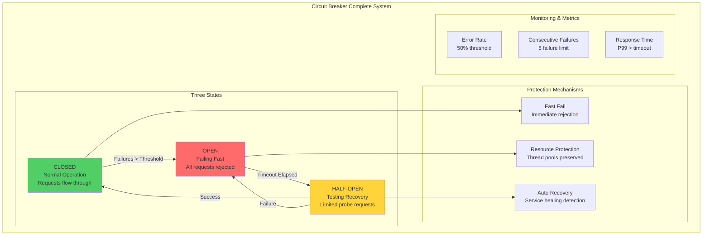
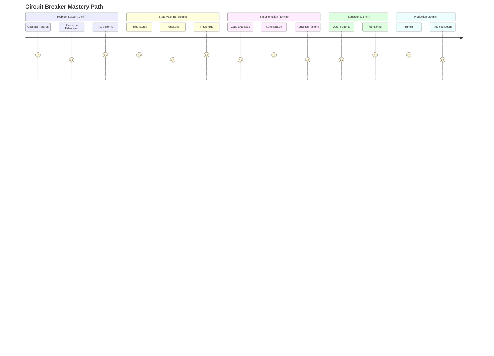
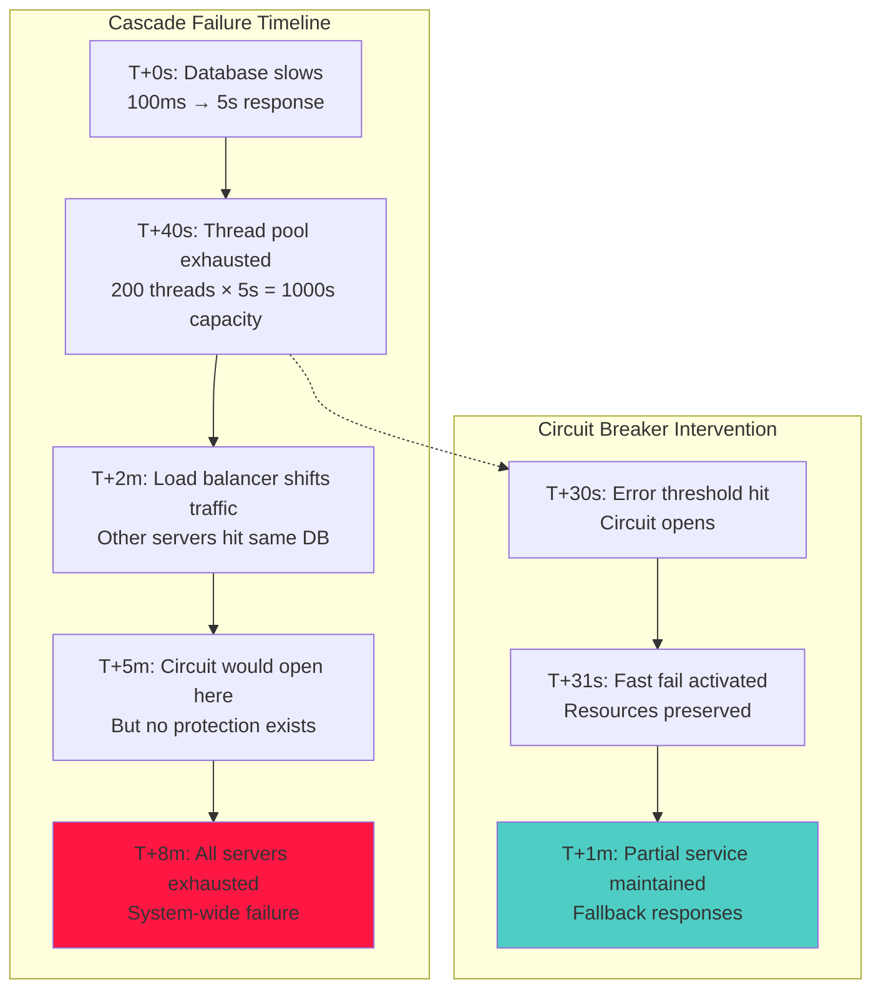
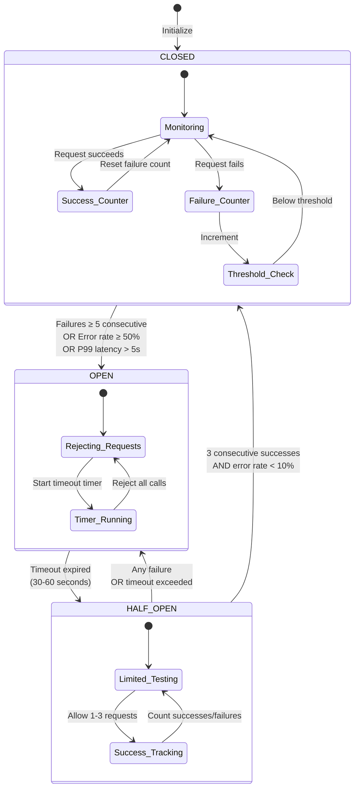
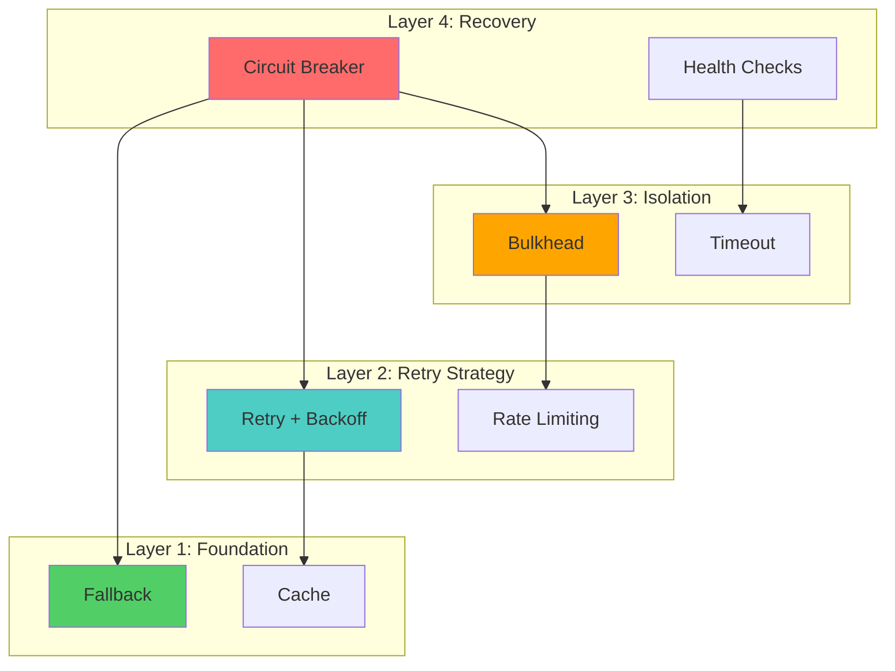

# Circuit Breaker Pattern: The Guardian of Distributed Systems

!!! abstract "The Apex Learner's Protocol for Circuit Breaker Mastery"
    This module implements focused learning bursts, spaced repetition, and active retrieval to master how Circuit Breakers prevent cascade failures by failing fast when error rates exceed thresholds. You'll learn that **Circuit Breakers are not just error handlers—they're statistical failure predictors that save systems from death spirals**.

## Foundation: Your Cascade Prevention Awakening

### The Brutal Reality of Cascade Failures

One slow database query. Five seconds later, your entire distributed system is down. How does a single 100ms delay cascade into total system failure? The answer lies in the mathematics of resource exhaustion and retry amplification—patterns that Circuit Breakers are specifically designed to interrupt.

**The Core Principle**: Fail fast to prevent cascade amplification across distributed system boundaries.

### The Circuit Breaker Trinity



## Your Learning Journey Map



---

## Focus Block 1: The Cascade Problem Circuit Breakers Solve (30 min)

### PRIMING: "The $12M Database Timeout"

A single database query starts taking 5 seconds instead of 100ms. Within 8 minutes, your entire e-commerce platform is down during Black Friday. Thread pools exhausted. Connection pools depleted. Customers can't complete purchases. $12M in revenue lost. How does one slow query bring down everything?

### CORE CONCEPT: The Anatomy of Cascade Failures

**The Cascade Amplification Formula**:
```
Impact = Initial_Delay × Retry_Factor × Thread_Count × Service_Dependencies
where:
- Initial_Delay = 5 seconds (db timeout)
- Retry_Factor = 3 (default retry attempts)  
- Thread_Count = 200 (web server pool)
- Service_Dependencies = 5 (services calling db)

Total Impact = 5s × 3 × 200 × 5 = 15,000 threads blocked
```

**The Resource Exhaustion Chain**:
1. Database query slows from 100ms → 5s
2. Web server threads wait 5s instead of 100ms
3. Thread pool (200 threads) exhausted in 40 seconds
4. New requests queue up, can't get threads
5. Load balancer marks server unhealthy
6. Traffic shifts to other servers
7. Other servers hit same slow database
8. Entire cluster exhausted within minutes

### VISUAL MODEL: The Cascade Propagation



### NEURAL BRIDGE: Electrical Circuit → Software Circuit

Think of your software system like an electrical system:

**Electrical Circuit Breaker**:
- Monitors current flow (amperage)
- Trips when current exceeds safe threshold
- Prevents wire overheating and fires
- Must be manually reset after problem fixed

**Software Circuit Breaker**:
- Monitors error rates and response times
- Trips when failures exceed threshold
- Prevents thread exhaustion and cascades
- Automatically tests for service recovery

Same protective principle, different domain.

### The Three Types of Cascade Patterns

**Type 1: Resource Exhaustion Cascade**
```
Slow dependency → Thread pool exhaustion → No capacity for new requests
Example: Database timeout exhausts web server thread pool
```

**Type 2: Retry Storm Cascade** 
```
Service failure → Exponential retry attempts → Overwhelming failed service
Example: API returns 500, clients retry, making problem worse
```

**Type 3: Synchronous Dependency Cascade**
```
Service A fails → Service B fails → Service C fails → System failure
Example: Payment service down causes order service down causes web app down
```

### ACTIVE PRACTICE: Map Your Cascade Risks

**Step 1**: Identify your critical dependencies
**Step 2**: Estimate failure impact for each
**Step 3**: Calculate cascade amplification factors
**Step 4**: Prioritize circuit breaker placement

Example Analysis:
```
Dependency: Payment Gateway API
- Current timeout: 30s
- Thread pool size: 100
- Request rate: 50/second
- Time to exhaustion: 100/50 = 2 minutes
- Cascade factor: HIGH (blocks all purchases)
- Circuit breaker priority: CRITICAL
```

### CONSOLIDATION PROMPT 1

**PAUSE AND REFLECT**:
1. What dependency in your system has the highest cascade risk?
2. How long would it take to exhaust your thread pools during a failure?
3. What would be the business impact of your highest-risk cascade?

---

## Focus Block 2: Three States (Closed, Open, Half-Open) (35 min)

### PRIMING: "The State Machine That Saves Systems"

Circuit Breakers are intelligent state machines that learn from failure patterns and automatically adapt their behavior. Understanding the three states and their transitions is crucial for effective implementation and debugging.

### CORE CONCEPT: The Three-State Machine

**CLOSED State (Normal Operation)**:
- All requests flow through to dependency
- Success/failure counters track health
- Transitions to OPEN when failure threshold exceeded

**OPEN State (Fast Fail)**:
- All requests immediately rejected without attempting call
- Preserves resources and prevents cascade
- Transitions to HALF-OPEN after timeout period

**HALF-OPEN State (Recovery Testing)**:
- Limited number of requests allowed through
- Tests if dependency has recovered
- Transitions to CLOSED on success, OPEN on failure

### VISUAL MODEL: State Transitions with Thresholds



### The Mathematics of State Transitions

**CLOSED → OPEN Transition Conditions**:
```python
def should_open_circuit():
    return (
        consecutive_failures >= failure_threshold or
        error_rate >= error_rate_threshold or  
        p99_latency >= latency_threshold
    )

# Example thresholds:
failure_threshold = 5        # 5 consecutive failures
error_rate_threshold = 0.5   # 50% error rate
latency_threshold = 5000     # 5 seconds P99
```

**HALF-OPEN → CLOSED Transition**:
```python
def should_close_circuit():
    return (
        consecutive_successes >= success_threshold and
        current_error_rate < recovery_error_threshold
    )

# Example recovery thresholds:
success_threshold = 3              # 3 consecutive successes
recovery_error_threshold = 0.1     # 10% error rate
```

### NEURAL BRIDGE: Traffic Light System → Circuit States

Think of circuit breaker states like an intelligent traffic light:

**Green Light (CLOSED)**:
- Normal traffic flow
- Monitoring for problems
- Ready to change when issues detected

**Red Light (OPEN)**:
- Stop all traffic
- Protect from congestion/accidents
- Wait for safe conditions

**Yellow Light (HALF-OPEN)**:
- Cautious testing
- Allow limited traffic
- Ready to go green or red based on results

### State-Specific Behaviors Deep Dive

**CLOSED State Monitoring**:
```python
class ClosedState:
    def execute_request(self, request):
        start_time = time.time()
        try:
            result = dependency.call(request)
            self.record_success(time.time() - start_time)
            return result
        except Exception as e:
            self.record_failure(time.time() - start_time, e)
            if self.should_open():
                self.transition_to_open()
            raise e
    
    def record_success(self, latency):
        self.consecutive_failures = 0
        self.success_count += 1
        self.latency_tracker.add(latency)
    
    def record_failure(self, latency, error):
        self.consecutive_failures += 1
        self.failure_count += 1
        self.error_types[type(error)] += 1
```

**OPEN State Fast Fail**:
```python
class OpenState:
    def execute_request(self, request):
        # Fast fail - don't even attempt the call
        if self.should_transition_to_half_open():
            self.transition_to_half_open()
            return self.half_open_state.execute_request(request)
        
        # Return fallback or raise circuit open exception
        if self.fallback:
            return self.fallback(request)
        else:
            raise CircuitOpenException(
                "Circuit breaker is OPEN", 
                self.last_failure_reason
            )
    
    def should_transition_to_half_open(self):
        return time.time() - self.opened_time >= self.timeout
```

**HALF-OPEN State Testing**:
```python
class HalfOpenState:
    def execute_request(self, request):
        if self.test_requests_sent >= self.max_test_requests:
            # Too many test requests, wait for results
            raise CircuitOpenException("Testing in progress")
        
        self.test_requests_sent += 1
        start_time = time.time()
        
        try:
            result = dependency.call(request)
            self.test_successes += 1
            
            if self.test_successes >= self.required_successes:
                self.transition_to_closed()
            
            return result
        except Exception as e:
            # Any failure in half-open immediately goes back to open
            self.transition_to_open()
            raise e
```

### ACTIVE PRACTICE: Design State Transition Logic

**Design Exercise**: Create state transition rules for different service types:

**High-Availability Service (Payment)**:
```
CLOSED → OPEN: 3 consecutive failures OR 20% error rate
OPEN timeout: 60 seconds
HALF-OPEN: Require 5 consecutive successes
Rationale: Payment is critical, be conservative
```

**Analytics Service (Non-Critical)**:
```
CLOSED → OPEN: 10 consecutive failures OR 70% error rate  
OPEN timeout: 15 seconds
HALF-OPEN: Require 2 consecutive successes
Rationale: Can tolerate more failures, recover quickly
```

**Third-Party API**:
```
CLOSED → OPEN: 5 consecutive failures OR timeout > 10s
OPEN timeout: 120 seconds  
HALF-OPEN: Require 3 successes, max 1 test request/minute
Rationale: External dependency, give time to recover
```

### CONSOLIDATION PROMPT 2

**CRITICAL THINKING**:
1. Why does HALF-OPEN immediately return to OPEN on any failure?
2. How would you tune thresholds for a service with 99.9% SLA vs 99% SLA?
3. What happens if your timeout is too short? Too long?

---

## Focus Block 3: Implementation with Thresholds and Timeouts (40 min)

### PRIMING: "Production-Ready Code That Actually Works"

Most circuit breaker examples you see online are toys that would fail in production. Real implementations must handle concurrency, configuration, monitoring, and edge cases. Here's how to build one that won't fail when you need it most.

### CORE CONCEPT: Production-Grade Implementation

**Key Implementation Requirements**:
1. **Thread-safe**: Multiple requests executing concurrently
2. **Configurable**: Thresholds tunable without code changes
3. **Observable**: Rich metrics and logging
4. **Resilient**: Circuit breaker itself can't be single point of failure
5. **Performant**: Minimal overhead in happy path

### Python Production Implementation

```python
import asyncio
import time
import threading
from enum import Enum
from typing import Callable, Optional, TypeVar, Generic, Dict, Any
from collections import deque, Counter
from dataclasses import dataclass
from contextlib import contextmanager
import logging

T = TypeVar('T')

class CircuitState(Enum):
    CLOSED = "closed"
    OPEN = "open"
    HALF_OPEN = "half_open"

@dataclass
class CircuitConfig:
    failure_threshold: int = 5
    success_threshold: int = 3
    timeout: float = 30.0
    error_rate_threshold: float = 0.5
    latency_threshold: float = 5.0
    sample_window: int = 100
    min_requests_for_error_rate: int = 10

@dataclass
class CircuitMetrics:
    state: CircuitState
    total_requests: int
    successful_requests: int
    failed_requests: int
    consecutive_failures: int
    consecutive_successes: int
    last_failure_time: Optional[float]
    last_success_time: Optional[float]
    average_response_time: float
    p95_response_time: float
    error_rate: float

class CircuitOpenException(Exception):
    def __init__(self, message: str, last_failure: Optional[Exception] = None):
        super().__init__(message)
        self.last_failure = last_failure

class CircuitBreaker(Generic[T]):
    """Production-grade Circuit Breaker implementation"""
    
    def __init__(self, 
                 name: str,
                 config: Optional[CircuitConfig] = None,
                 fallback: Optional[Callable[..., T]] = None,
                 logger: Optional[logging.Logger] = None):
        
        self.name = name
        self.config = config or CircuitConfig()
        self.fallback = fallback
        self.logger = logger or logging.getLogger(f"circuit_breaker.{name}")
        
        # State management
        self._state = CircuitState.CLOSED
        self._state_lock = threading.RLock()
        
        # Metrics tracking
        self._total_requests = 0
        self._successful_requests = 0
        self._failed_requests = 0
        self._consecutive_failures = 0
        self._consecutive_successes = 0
        self._last_failure_time = None
        self._last_failure_exception = None
        self._state_changed_time = time.time()
        
        # Response time tracking
        self._response_times = deque(maxlen=self.config.sample_window)
        self._failure_types = Counter()
        
        # Half-open testing
        self._half_open_requests = 0
        self._max_half_open_requests = 1  # Only allow one request at a time in half-open
        
    async def call(self, 
                   func: Callable[..., T], 
                   *args, **kwargs) -> T:
        """Execute function with circuit breaker protection"""
        
        # Check circuit state and handle accordingly
        if self._state == CircuitState.OPEN:
            if self._should_attempt_reset():
                return await self._attempt_reset(func, *args, **kwargs)
            else:
                return await self._handle_open_circuit()
        
        elif self._state == CircuitState.HALF_OPEN:
            return await self._handle_half_open(func, *args, **kwargs)
        
        else:  # CLOSED state
            return await self._handle_closed(func, *args, **kwargs)
    
    async def _handle_closed(self, func: Callable[..., T], *args, **kwargs) -> T:
        """Handle request in CLOSED state"""
        start_time = time.time()
        
        try:
            result = await self._execute_function(func, *args, **kwargs)
            await self._record_success(time.time() - start_time)
            return result
            
        except Exception as e:
            await self._record_failure(time.time() - start_time, e)
            
            # Check if we should open the circuit
            if self._should_open_circuit():
                await self._open_circuit()
            
            raise e
    
    async def _handle_open_circuit(self) -> T:
        """Handle request when circuit is OPEN"""
        if self.fallback:
            self.logger.info(f"Circuit {self.name} is OPEN, executing fallback")
            return await self._execute_function(self.fallback)
        else:
            self.logger.warning(f"Circuit {self.name} is OPEN, no fallback available")
            raise CircuitOpenException(
                f"Circuit breaker '{self.name}' is OPEN", 
                self._last_failure_exception
            )
    
    async def _handle_half_open(self, func: Callable[..., T], *args, **kwargs) -> T:
        """Handle request in HALF_OPEN state"""
        with self._state_lock:
            if self._half_open_requests >= self._max_half_open_requests:
                # Too many concurrent half-open requests
                return await self._handle_open_circuit()
            
            self._half_open_requests += 1
        
        try:
            start_time = time.time()
            result = await self._execute_function(func, *args, **kwargs)
            
            with self._state_lock:
                self._half_open_requests -= 1
                self._consecutive_successes += 1
                self._successful_requests += 1
                self._response_times.append(time.time() - start_time)
                self._last_success_time = time.time()
                
                # Check if we should close the circuit
                if self._consecutive_successes >= self.config.success_threshold:
                    await self._close_circuit()
            
            return result
            
        except Exception as e:
            with self._state_lock:
                self._half_open_requests -= 1
                # Any failure in half-open immediately opens circuit
                await self._open_circuit()
            raise e
    
    async def _execute_function(self, func: Callable[..., T], *args, **kwargs) -> T:
        """Execute function with proper async handling"""
        if asyncio.iscoroutinefunction(func):
            return await func(*args, **kwargs)
        else:
            # Run sync function in thread pool
            loop = asyncio.get_event_loop()
            return await loop.run_in_executor(None, lambda: func(*args, **kwargs))
    
    async def _record_success(self, response_time: float):
        """Record successful request"""
        with self._state_lock:
            self._total_requests += 1
            self._successful_requests += 1
            self._consecutive_failures = 0
            self._consecutive_successes += 1
            self._response_times.append(response_time)
            self._last_success_time = time.time()
    
    async def _record_failure(self, response_time: float, exception: Exception):
        """Record failed request"""
        with self._state_lock:
            self._total_requests += 1
            self._failed_requests += 1
            self._consecutive_failures += 1
            self._consecutive_successes = 0
            self._response_times.append(response_time)
            self._last_failure_time = time.time()
            self._last_failure_exception = exception
            self._failure_types[type(exception).__name__] += 1
    
    def _should_open_circuit(self) -> bool:
        """Determine if circuit should be opened"""
        # Consecutive failures threshold
        if self._consecutive_failures >= self.config.failure_threshold:
            self.logger.info(f"Opening circuit {self.name}: consecutive failures {self._consecutive_failures}")
            return True
        
        # Error rate threshold (only if we have enough samples)
        if self._total_requests >= self.config.min_requests_for_error_rate:
            error_rate = self._failed_requests / self._total_requests
            if error_rate >= self.config.error_rate_threshold:
                self.logger.info(f"Opening circuit {self.name}: error rate {error_rate:.2%}")
                return True
        
        # Latency threshold
        if len(self._response_times) >= 10:
            p95_latency = sorted(self._response_times)[int(len(self._response_times) * 0.95)]
            if p95_latency >= self.config.latency_threshold:
                self.logger.info(f"Opening circuit {self.name}: P95 latency {p95_latency:.2f}s")
                return True
        
        return False
    
    def _should_attempt_reset(self) -> bool:
        """Determine if we should attempt reset from OPEN to HALF_OPEN"""
        if self._last_failure_time is None:
            return False
        
        time_since_failure = time.time() - self._last_failure_time
        return time_since_failure >= self.config.timeout
    
    async def _attempt_reset(self, func: Callable[..., T], *args, **kwargs) -> T:
        """Attempt to reset circuit from OPEN to HALF_OPEN"""
        with self._state_lock:
            if self._state == CircuitState.OPEN:
                await self._transition_to_half_open()
        
        return await self._handle_half_open(func, *args, **kwargs)
    
    async def _open_circuit(self):
        """Transition circuit to OPEN state"""
        with self._state_lock:
            old_state = self._state
            self._state = CircuitState.OPEN
            self._state_changed_time = time.time()
            self._consecutive_successes = 0
            
            self.logger.warning(f"Circuit {self.name} opened (was {old_state.value})")
    
    async def _close_circuit(self):
        """Transition circuit to CLOSED state"""  
        with self._state_lock:
            old_state = self._state
            self._state = CircuitState.CLOSED
            self._state_changed_time = time.time()
            self._consecutive_failures = 0
            self._half_open_requests = 0
            
            self.logger.info(f"Circuit {self.name} closed (was {old_state.value})")
    
    async def _transition_to_half_open(self):
        """Transition circuit to HALF_OPEN state"""
        self._state = CircuitState.HALF_OPEN
        self._state_changed_time = time.time()
        self._consecutive_successes = 0
        self._half_open_requests = 0
        
        self.logger.info(f"Circuit {self.name} transitioned to half-open")
    
    def get_metrics(self) -> CircuitMetrics:
        """Get current circuit metrics"""
        with self._state_lock:
            error_rate = 0.0
            if self._total_requests > 0:
                error_rate = self._failed_requests / self._total_requests
            
            avg_response_time = 0.0
            p95_response_time = 0.0
            if self._response_times:
                avg_response_time = sum(self._response_times) / len(self._response_times)
                sorted_times = sorted(self._response_times)
                p95_index = int(len(sorted_times) * 0.95)
                p95_response_time = sorted_times[p95_index] if p95_index < len(sorted_times) else 0.0
            
            return CircuitMetrics(
                state=self._state,
                total_requests=self._total_requests,
                successful_requests=self._successful_requests,
                failed_requests=self._failed_requests,
                consecutive_failures=self._consecutive_failures,
                consecutive_successes=self._consecutive_successes,
                last_failure_time=self._last_failure_time,
                last_success_time=self._last_success_time,
                average_response_time=avg_response_time,
                p95_response_time=p95_response_time,
                error_rate=error_rate
            )
    
    @contextmanager
    def sync_context(self):
        """Context manager for synchronous usage"""
        class SyncWrapper:
            def __init__(self, cb):
                self.cb = cb
            
            def __call__(self, func, *args, **kwargs):
                loop = asyncio.new_event_loop()
                asyncio.set_event_loop(loop)
                try:
                    return loop.run_until_complete(
                        self.cb.call(func, *args, **kwargs)
                    )
                finally:
                    loop.close()
        
        yield SyncWrapper(self)
```

### Usage Examples

**Basic Async Usage**:
```python
# Configure circuit breaker
config = CircuitConfig(
    failure_threshold=5,
    timeout=30.0,
    error_rate_threshold=0.3
)

# Fallback function
async def payment_fallback():
    return {"status": "queued", "message": "Payment will be processed shortly"}

# Create circuit breaker
circuit = CircuitBreaker("payment-service", config, payment_fallback)

# Use with async function
async def process_payment(amount, card_token):
    return await circuit.call(payment_api.charge, amount, card_token)
```

**Configuration for Different Service Types**:
```python
# High-critical service (payments)
critical_config = CircuitConfig(
    failure_threshold=3,        # Fail fast
    success_threshold=5,        # Conservative recovery  
    timeout=60.0,              # Give time to recover
    error_rate_threshold=0.1,   # 10% error rate limit
    latency_threshold=2.0       # 2s latency limit
)

# Non-critical service (analytics)
analytics_config = CircuitConfig(
    failure_threshold=10,       # More tolerant
    success_threshold=2,        # Quick recovery
    timeout=15.0,              # Fast retry
    error_rate_threshold=0.7,   # 70% error rate OK
    latency_threshold=10.0      # 10s latency OK
)

# External API (third party)
external_config = CircuitConfig(
    failure_threshold=5,        # Standard
    success_threshold=3,        # Standard recovery
    timeout=120.0,             # Long timeout for external
    error_rate_threshold=0.4,   # 40% error rate
    latency_threshold=8.0       # 8s latency limit
)
```

### ACTIVE PRACTICE: Implement Circuit Breaker

**Exercise**: Implement a simple circuit breaker for a key dependency:

**Step 1**: Choose a critical dependency in your system
**Step 2**: Define appropriate thresholds based on SLA
**Step 3**: Implement fallback strategy
**Step 4**: Add monitoring and alerting
**Step 5**: Test with controlled failures

**Example Implementation Checklist**:
```python
# ✓ Thread-safe state management
# ✓ Configurable thresholds
# ✓ Multiple failure criteria (consecutive, rate, latency)
# ✓ Proper state transitions
# ✓ Comprehensive metrics
# ✓ Fallback mechanism
# ✓ Logging and observability
# ✓ Async/sync compatibility
# ✓ Production-ready error handling
```

### CONSOLIDATION PROMPT 3

**IMPLEMENTATION THINKING**:
1. Why is thread safety critical in circuit breaker implementation?
2. How would you test a circuit breaker without causing real failures?
3. What metrics would you alert on for circuit breaker health?

---

## Focus Block 4: Integration with Other Patterns (25 min)

### PRIMING: "Circuit Breakers Don't Work Alone"

A circuit breaker by itself is like having a fire extinguisher but no smoke detector. In production systems, circuit breakers work best when combined with complementary patterns that detect problems early, provide graceful degradation, and enable faster recovery.

### CORE CONCEPT: The Resilience Pattern Ecosystem

Circuit breakers are part of a larger resilience ecosystem. Understanding how they integrate with other patterns multiplies their effectiveness and covers gaps that individual patterns can't address alone.

**The Resilience Pattern Stack**:


### Integration Pattern 1: Circuit Breaker + Retry + Backoff

**The Problem**: Circuit breakers and retries can work against each other if not coordinated properly.

**The Solution**: Intelligent retry logic that respects circuit breaker state.

```python
from enum import Enum
import asyncio
import random

class BackoffStrategy(Enum):
    EXPONENTIAL = "exponential"
    LINEAR = "linear"
    FIXED = "fixed"

class RetryConfig:
    def __init__(self, 
                 max_attempts: int = 3,
                 base_delay: float = 1.0,
                 max_delay: float = 60.0,
                 backoff_strategy: BackoffStrategy = BackoffStrategy.EXPONENTIAL,
                 jitter: bool = True):
        self.max_attempts = max_attempts
        self.base_delay = base_delay
        self.max_delay = max_delay
        self.backoff_strategy = backoff_strategy
        self.jitter = jitter

class CircuitBreakerWithRetry:
    def __init__(self, circuit_breaker: CircuitBreaker, retry_config: RetryConfig):
        self.circuit = circuit_breaker
        self.retry_config = retry_config
    
    async def call_with_retry(self, func: Callable[..., T], *args, **kwargs) -> T:
        """Execute function with coordinated retry and circuit breaking"""
        
        last_exception = None
        
        for attempt in range(1, self.retry_config.max_attempts + 1):
            try:
                # Circuit breaker handles its own state logic
                result = await self.circuit.call(func, *args, **kwargs)
                return result
                
            except CircuitOpenException as e:
                # Circuit is open - don't retry, fail immediately
                raise e
                
            except Exception as e:
                last_exception = e
                
                # Don't retry on last attempt
                if attempt == self.retry_config.max_attempts:
                    break
                
                # Calculate delay with backoff
                delay = self._calculate_delay(attempt)
                await asyncio.sleep(delay)
        
        # All retries exhausted
        raise last_exception
    
    def _calculate_delay(self, attempt: int) -> float:
        """Calculate retry delay with backoff and jitter"""
        if self.retry_config.backoff_strategy == BackoffStrategy.EXPONENTIAL:
            delay = self.retry_config.base_delay * (2 ** (attempt - 1))
        elif self.retry_config.backoff_strategy == BackoffStrategy.LINEAR:
            delay = self.retry_config.base_delay * attempt
        else:  # FIXED
            delay = self.retry_config.base_delay
        
        # Apply max delay limit
        delay = min(delay, self.retry_config.max_delay)
        
        # Add jitter to prevent thundering herd
        if self.retry_config.jitter:
            jitter_range = delay * 0.1  # 10% jitter
            delay += random.uniform(-jitter_range, jitter_range)
        
        return max(0, delay)

# Usage example
retry_config = RetryConfig(max_attempts=3, base_delay=1.0, jitter=True)
circuit_with_retry = CircuitBreakerWithRetry(payment_circuit, retry_config)

async def process_payment_with_retry(amount, card_token):
    return await circuit_with_retry.call_with_retry(
        payment_api.charge, amount, card_token
    )
```

### Integration Pattern 2: Circuit Breaker + Bulkhead Pattern

**The Problem**: Circuit breakers protect the caller but don't limit resource consumption per dependency.

**The Solution**: Combine circuit breakers with resource isolation (bulkheads).

```python
import asyncio
from asyncio import Semaphore

class BulkheadCircuitBreaker:
    """Circuit breaker with built-in resource isolation"""
    
    def __init__(self, 
                 circuit_breaker: CircuitBreaker,
                 max_concurrent_requests: int = 10,
                 max_queue_size: int = 100):
        self.circuit = circuit_breaker
        self.semaphore = Semaphore(max_concurrent_requests)
        self.max_queue_size = max_queue_size
        self.queued_requests = 0
    
    async def call(self, func: Callable[..., T], *args, **kwargs) -> T:
        """Execute with both bulkhead and circuit breaker protection"""
        
        # Check if queue is full (bulkhead protection)
        if self.queued_requests >= self.max_queue_size:
            raise BulkheadFullException("Request queue is full")
        
        self.queued_requests += 1
        
        try:
            # Acquire semaphore (resource isolation)
            async with self.semaphore:
                # Execute through circuit breaker
                return await self.circuit.call(func, *args, **kwargs)
        finally:
            self.queued_requests -= 1

# Usage with different bulkhead sizes per service criticality
critical_service = BulkheadCircuitBreaker(
    payment_circuit, 
    max_concurrent_requests=50,  # More resources for critical
    max_queue_size=200
)

non_critical_service = BulkheadCircuitBreaker(
    analytics_circuit,
    max_concurrent_requests=5,   # Limited resources for non-critical  
    max_queue_size=10
)
```

### Integration Pattern 3: Circuit Breaker + Health Checks

**The Problem**: Circuit breakers are reactive - they detect problems after they occur.

**The Solution**: Proactive health monitoring that can preemptively open circuits.

```python
from dataclasses import dataclass
from typing import List
import asyncio

@dataclass
class HealthStatus:
    is_healthy: bool
    response_time: float
    error_message: Optional[str] = None
    timestamp: float = 0

class HealthAwareCircuitBreaker:
    """Circuit breaker that incorporates proactive health checks"""
    
    def __init__(self, 
                 circuit_breaker: CircuitBreaker,
                 health_check_func: Callable[[], Awaitable[HealthStatus]],
                 health_check_interval: float = 30.0,
                 unhealthy_threshold: int = 3):
        
        self.circuit = circuit_breaker
        self.health_check_func = health_check_func
        self.health_check_interval = health_check_interval
        self.unhealthy_threshold = unhealthy_threshold
        
        self.consecutive_unhealthy = 0
        self.health_check_task = None
        self.start_health_monitoring()
    
    def start_health_monitoring(self):
        """Start background health check monitoring"""
        self.health_check_task = asyncio.create_task(self._health_check_loop())
    
    async def _health_check_loop(self):
        """Background health monitoring loop"""
        while True:
            try:
                health_status = await self.health_check_func()
                
                if health_status.is_healthy:
                    self.consecutive_unhealthy = 0
                else:
                    self.consecutive_unhealthy += 1
                    
                    # Preemptively open circuit if health checks consistently fail
                    if (self.consecutive_unhealthy >= self.unhealthy_threshold and
                        self.circuit._state == CircuitState.CLOSED):
                        
                        await self.circuit._open_circuit()
                        self.circuit.logger.warning(
                            f"Circuit {self.circuit.name} opened due to health check failures"
                        )
                
                await asyncio.sleep(self.health_check_interval)
                
            except Exception as e:
                self.circuit.logger.error(f"Health check error: {e}")
                await asyncio.sleep(self.health_check_interval)
    
    async def call(self, func: Callable[..., T], *args, **kwargs) -> T:
        """Execute with health-aware circuit breaking"""
        return await self.circuit.call(func, *args, **kwargs)
    
    def stop_health_monitoring(self):
        """Stop background health monitoring"""
        if self.health_check_task:
            self.health_check_task.cancel()

# Example health check function
async def database_health_check() -> HealthStatus:
    start_time = time.time()
    try:
        # Simple ping query
        await database.execute("SELECT 1")
        response_time = time.time() - start_time
        
        return HealthStatus(
            is_healthy=response_time < 1.0,  # Healthy if response < 1s
            response_time=response_time,
            timestamp=time.time()
        )
    except Exception as e:
        return HealthStatus(
            is_healthy=False,
            response_time=time.time() - start_time,
            error_message=str(e),
            timestamp=time.time()
        )

# Usage
health_aware_circuit = HealthAwareCircuitBreaker(
    db_circuit,
    database_health_check,
    health_check_interval=15.0,
    unhealthy_threshold=2
)
```

### Integration Pattern 4: Service Mesh Integration

**Modern Production Pattern**: Circuit breakers implemented at the service mesh layer (Istio, Envoy, Linkerd).

```yaml
# Istio DestinationRule with Circuit Breaker
apiVersion: networking.istio.io/v1beta1
kind: DestinationRule
metadata:
  name: payment-service-circuit-breaker
spec:
  host: payment-service
  trafficPolicy:
    outlierDetection:
      consecutiveErrors: 5          # failure_threshold
      interval: 30s                # evaluation_interval  
      baseEjectionTime: 30s        # timeout
      maxEjectionPercent: 50       # max % of instances to eject
      minHealthPercent: 50         # min % of healthy instances required
    connectionPool:
      tcp:
        maxConnections: 100        # bulkhead limit
      http:
        http1MaxPendingRequests: 50
        maxRequestsPerConnection: 10
        h2MaxRequests: 100
        timeout: 30s               # request timeout
```

### ACTIVE PRACTICE: Design Integration Strategy

**Design Exercise**: Create an integration strategy for your system:

**Step 1**: Identify your critical dependencies
**Step 2**: Choose complementary patterns for each
**Step 3**: Design coordination between patterns  
**Step 4**: Plan monitoring and alerting across patterns

**Example Integration Plan**:
```
Payment Service Integration:
├── Circuit Breaker (primary protection)
├── Retry with Exponential Backoff (3 attempts max)
├── Bulkhead (50 concurrent requests max)
├── Health Checks (every 15s)
├── Timeout (5s request timeout)
└── Fallback (queue payment for later processing)

Analytics Service Integration:
├── Circuit Breaker (relaxed thresholds)
├── Simple Retry (2 attempts)
├── Small Bulkhead (5 concurrent requests)
├── Health Checks (every 60s)
└── Fallback (return cached/default data)
```

### CONSOLIDATION PROMPT 4

**INTEGRATION THINKING**:
1. Which combination of patterns would be most effective for your highest-risk dependency?
2. How would you prevent patterns from working against each other?
3. What would be the monitoring strategy for multiple integrated patterns?

---

## Focus Block 5: Production Tuning and Monitoring (20 min)

### PRIMING: "The Circuit Breaker That Cried Wolf"

Your circuit breaker is triggering false positives, causing unnecessary service degradation. Or worse, it's not triggering when it should, allowing cascades to propagate. Production tuning and monitoring are what separate toy implementations from systems that save your architecture during real failures.

### CORE CONCEPT: Data-Driven Circuit Breaker Optimization

**The Tuning Triangle**: Balancing three competing concerns:
1. **Sensitivity**: Detect failures quickly (avoid cascades)
2. **Stability**: Avoid false positives (maintain service quality)  
3. **Recovery**: Return to normal operation efficiently

### Production Monitoring Framework

```python
from dataclasses import dataclass
from typing import Dict, List
import time
import statistics

@dataclass
class CircuitBreakerAlert:
    circuit_name: str
    alert_type: str
    message: str
    severity: str
    timestamp: float
    metrics: Dict[str, float]

class CircuitBreakerMonitor:
    """Production monitoring and alerting for circuit breakers"""
    
    def __init__(self):
        self.circuits: Dict[str, CircuitBreaker] = {}
        self.alert_handlers: List[Callable[[CircuitBreakerAlert], None]] = []
        self.historical_data: Dict[str, List[CircuitMetrics]] = {}
        
    def register_circuit(self, name: str, circuit: CircuitBreaker):
        """Register circuit breaker for monitoring"""
        self.circuits[name] = circuit
        self.historical_data[name] = []
        
    def collect_metrics(self):
        """Collect metrics from all registered circuits"""
        current_time = time.time()
        
        for name, circuit in self.circuits.items():
            metrics = circuit.get_metrics()
            self.historical_data[name].append(metrics)
            
            # Keep only last 24 hours of data
            cutoff_time = current_time - (24 * 3600)
            self.historical_data[name] = [
                m for m in self.historical_data[name] 
                if m.last_success_time and m.last_success_time > cutoff_time
            ]
            
            # Check for alert conditions
            self._check_alert_conditions(name, metrics)
    
    def _check_alert_conditions(self, circuit_name: str, metrics: CircuitMetrics):
        """Check for alerting conditions"""
        
        # Alert: Circuit has been open too long
        if (metrics.state == CircuitState.OPEN and 
            metrics.last_failure_time and
            time.time() - metrics.last_failure_time > 300):  # 5 minutes
            
            self._send_alert(CircuitBreakerAlert(
                circuit_name=circuit_name,
                alert_type="prolonged_open",
                message=f"Circuit {circuit_name} has been open for >5 minutes",
                severity="warning",
                timestamp=time.time(),
                metrics={"open_duration": time.time() - metrics.last_failure_time}
            ))
        
        # Alert: High false positive rate
        recent_data = self.historical_data[circuit_name][-100:]  # Last 100 data points
        if len(recent_data) > 10:
            state_changes = sum(1 for i in range(1, len(recent_data)) 
                              if recent_data[i].state != recent_data[i-1].state)
            
            if state_changes > 20:  # Too many state changes
                self._send_alert(CircuitBreakerAlert(
                    circuit_name=circuit_name,
                    alert_type="high_flapping",
                    message=f"Circuit {circuit_name} changing states too frequently",
                    severity="warning", 
                    timestamp=time.time(),
                    metrics={"state_changes": state_changes}
                ))
        
        # Alert: Poor effectiveness (not preventing failures)
        if (metrics.error_rate > 0.3 and 
            metrics.state == CircuitState.CLOSED and
            metrics.total_requests > 50):
            
            self._send_alert(CircuitBreakerAlert(
                circuit_name=circuit_name,
                alert_type="ineffective_protection",
                message=f"Circuit {circuit_name} not protecting against failures",
                severity="critical",
                timestamp=time.time(),
                metrics={"error_rate": metrics.error_rate}
            ))
    
    def _send_alert(self, alert: CircuitBreakerAlert):
        """Send alert to registered handlers"""
        for handler in self.alert_handlers:
            try:
                handler(alert)
            except Exception as e:
                print(f"Alert handler failed: {e}")
    
    def get_performance_report(self, circuit_name: str) -> Dict[str, Any]:
        """Generate performance report for circuit"""
        if circuit_name not in self.historical_data:
            return {}
        
        data = self.historical_data[circuit_name]
        if not data:
            return {}
        
        # Calculate key metrics
        avg_error_rate = statistics.mean(d.error_rate for d in data)
        avg_response_time = statistics.mean(d.average_response_time for d in data)
        
        state_distribution = {}
        for d in data:
            state_distribution[d.state.value] = state_distribution.get(d.state.value, 0) + 1
        
        total_points = len(data)
        state_percentages = {k: (v/total_points)*100 for k, v in state_distribution.items()}
        
        return {
            "circuit_name": circuit_name,
            "data_points": total_points,
            "avg_error_rate": avg_error_rate,
            "avg_response_time": avg_response_time,
            "state_distribution": state_percentages,
            "total_requests": sum(d.total_requests for d in data[-1:]),  # Latest
            "effectiveness_score": self._calculate_effectiveness_score(data)
        }
    
    def _calculate_effectiveness_score(self, data: List[CircuitMetrics]) -> float:
        """Calculate circuit breaker effectiveness score (0-100)"""
        if not data:
            return 0
        
        latest = data[-1]
        
        # Score based on multiple factors
        error_protection_score = max(0, 100 - (latest.error_rate * 200))  # Lower error rate = higher score
        availability_score = (latest.successful_requests / max(latest.total_requests, 1)) * 100
        stability_score = 100 - min(50, self._count_state_changes(data))  # Fewer state changes = higher score
        
        return (error_protection_score + availability_score + stability_score) / 3
    
    def _count_state_changes(self, data: List[CircuitMetrics]) -> int:
        """Count state changes in recent data"""
        return sum(1 for i in range(1, len(data)) if data[i].state != data[i-1].state)

# Alert handlers
def slack_alert_handler(alert: CircuitBreakerAlert):
    """Send alert to Slack"""
    # Implementation for Slack webhook
    pass

def pagerduty_alert_handler(alert: CircuitBreakerAlert):
    """Send critical alerts to PagerDuty"""
    if alert.severity == "critical":
        # Implementation for PagerDuty API
        pass

# Usage
monitor = CircuitBreakerMonitor()
monitor.alert_handlers.extend([slack_alert_handler, pagerduty_alert_handler])
monitor.register_circuit("payment-service", payment_circuit)
monitor.register_circuit("user-service", user_circuit)

# Collect metrics every minute
async def monitoring_loop():
    while True:
        monitor.collect_metrics()
        await asyncio.sleep(60)
```

### Production Tuning Guidelines

**Tuning Matrix by Service Type**:

| Service Type | Failure Threshold | Error Rate | Timeout | Success Threshold | Rationale |
|--------------|------------------|-------------|---------|-------------------|-----------|
| **Payment/Financial** | 3 consecutive | 10% | 60s | 5 consecutive | Critical path, conservative |
| **User Authentication** | 3 consecutive | 15% | 45s | 3 consecutive | High availability needed |
| **Core Business Logic** | 5 consecutive | 25% | 30s | 3 consecutive | Balance performance/protection |
| **Analytics/Reporting** | 10 consecutive | 50% | 15s | 2 consecutive | Can tolerate failures |
| **3rd Party APIs** | 5 consecutive | 30% | 120s | 3 consecutive | External dependencies |
| **Internal Tools** | 8 consecutive | 60% | 20s | 2 consecutive | Non-customer facing |

**A/B Testing for Threshold Optimization**:
```python
class CircuitBreakerTuner:
    """A/B test different circuit breaker configurations"""
    
    def __init__(self):
        self.experiments: Dict[str, Dict] = {}
        
    def create_experiment(self, name: str, 
                         control_config: CircuitConfig,
                         test_config: CircuitConfig,
                         traffic_split: float = 0.1):
        """Create A/B test for circuit configuration"""
        
        self.experiments[name] = {
            "control_circuit": CircuitBreaker(f"{name}-control", control_config),
            "test_circuit": CircuitBreaker(f"{name}-test", test_config),
            "traffic_split": traffic_split,
            "control_metrics": [],
            "test_metrics": []
        }
    
    async def execute_with_experiment(self, experiment_name: str, 
                                    func: Callable, *args, **kwargs):
        """Execute function using A/B test circuits"""
        experiment = self.experiments[experiment_name]
        
        # Route traffic based on split
        use_test = random.random() < experiment["traffic_split"]
        circuit = experiment["test_circuit"] if use_test else experiment["control_circuit"]
        
        # Execute and collect metrics
        result = await circuit.call(func, *args, **kwargs)
        
        metrics_key = "test_metrics" if use_test else "control_metrics"
        experiment[metrics_key].append(circuit.get_metrics())
        
        return result
    
    def analyze_experiment(self, experiment_name: str) -> Dict[str, Any]:
        """Analyze A/B test results"""
        experiment = self.experiments[experiment_name]
        
        control_metrics = experiment["control_metrics"]
        test_metrics = experiment["test_metrics"]
        
        if not control_metrics or not test_metrics:
            return {"error": "Insufficient data"}
        
        # Compare key metrics
        control_avg_error = statistics.mean(m.error_rate for m in control_metrics[-100:])
        test_avg_error = statistics.mean(m.error_rate for m in test_metrics[-100:])
        
        control_avg_latency = statistics.mean(m.average_response_time for m in control_metrics[-100:])
        test_avg_latency = statistics.mean(m.average_response_time for m in test_metrics[-100:])
        
        return {
            "control_error_rate": control_avg_error,
            "test_error_rate": test_avg_error,
            "error_rate_improvement": (control_avg_error - test_avg_error) / control_avg_error,
            "control_latency": control_avg_latency,
            "test_latency": test_avg_latency,
            "latency_improvement": (control_avg_latency - test_avg_latency) / control_avg_latency,
            "recommendation": "adopt_test" if test_avg_error < control_avg_error else "keep_control"
        }
```

### Key Production Metrics to Monitor

**Circuit Breaker Health Dashboard**:
```python
# Key metrics to track
circuit_metrics = {
    # Effectiveness metrics
    "cascade_failures_prevented": "Count of potential cascades stopped",
    "false_positive_rate": "% of unnecessary circuit openings",
    "mean_time_to_recovery": "Average time circuit stays open",
    
    # Performance metrics  
    "state_transition_frequency": "How often circuit changes state",
    "fallback_success_rate": "% of fallback calls that succeed",
    "p99_request_latency": "99th percentile response time",
    
    # Business impact metrics
    "revenue_protected": "Estimated revenue saved by preventing outages",
    "user_experience_score": "Impact on user experience metrics",
    "availability_improvement": "Overall system availability improvement"
}
```

### ACTIVE PRACTICE: Create Monitoring Strategy

**Exercise**: Design comprehensive monitoring for your circuit breakers:

**Step 1**: Define key metrics for your business context
**Step 2**: Set up alerting thresholds
**Step 3**: Create dashboard for operational visibility
**Step 4**: Establish tuning feedback loop

**Example Monitoring Checklist**:
```
✓ Circuit state changes (with reasons)
✓ Error rate trends over time  
✓ Response time percentiles
✓ Fallback activation rate
✓ False positive detection
✓ Business impact correlation
✓ A/B testing for threshold optimization
✓ Automated threshold adjustment
```

### CONSOLIDATION PROMPT 5

**PRODUCTION THINKING**:
1. How would you detect if your circuit breaker thresholds are too sensitive?
2. What business metrics would you correlate with circuit breaker performance?
3. How would you implement automated threshold tuning?

---

## Integration Challenge: Build a Complete Circuit Breaker System

### YOUR MISSION: Implement Production-Ready Circuit Breaking

**Scenario**: You're building an e-commerce checkout system with these critical dependencies:
- Payment Gateway (external API, 99.9% SLA)
- Inventory Service (internal, 99.95% SLA) 
- User Service (internal, 99.5% SLA)
- Email Service (external, 95% SLA)

**Phase 1: Design Circuit Breaker Strategy (20 min)**
1. **Analyze Dependencies**: Map failure modes and business impact
2. **Configure Thresholds**: Set appropriate values for each service type
3. **Design Fallbacks**: Create graceful degradation strategies
4. **Plan Integration**: Coordinate with retry, timeout, and bulkhead patterns

**Phase 2: Implementation (40 min)**
```python
# Implement complete system
class CheckoutSystem:
    def __init__(self):
        # Configure circuits with different strategies per service
        self.payment_circuit = CircuitBreaker("payment", self._payment_config())
        self.inventory_circuit = CircuitBreaker("inventory", self._inventory_config()) 
        self.user_circuit = CircuitBreaker("user", self._user_config())
        self.email_circuit = CircuitBreaker("email", self._email_config())
        
        # Set up monitoring
        self.monitor = CircuitBreakerMonitor()
        self._register_all_circuits()
    
    def _payment_config(self) -> CircuitConfig:
        return CircuitConfig(
            failure_threshold=3,        # Very sensitive
            error_rate_threshold=0.1,   # 10% error rate
            timeout=60.0,              # Give payment gateway time
            success_threshold=5,        # Conservative recovery
            latency_threshold=3.0       # 3s max latency
        )
    
    async def process_checkout(self, order_data):
        """Complete checkout with circuit breaker protection"""
        try:
            # Step 1: Validate inventory (critical)
            inventory_valid = await self.inventory_circuit.call(
                self._check_inventory, order_data.items
            )
            
            # Step 2: Process payment (critical)
            payment_result = await self.payment_circuit.call(
                self._process_payment, order_data.payment_info
            )
            
            # Step 3: Update user account (important but not blocking)
            try:
                await self.user_circuit.call(
                    self._update_user_account, order_data.user_id, order_data
                )
            except CircuitOpenException:
                # Fallback: Queue for later processing
                await self._queue_user_update(order_data.user_id, order_data)
            
            # Step 4: Send confirmation email (nice-to-have)
            try:
                await self.email_circuit.call(
                    self._send_confirmation_email, order_data
                )
            except (CircuitOpenException, Exception):
                # Fallback: Queue email for later
                await self._queue_email(order_data)
            
            return {
                "status": "success",
                "order_id": payment_result.order_id,
                "message": "Order processed successfully"
            }
            
        except CircuitOpenException as e:
            # Critical service is down
            if "payment" in str(e) or "inventory" in str(e):
                return {
                    "status": "error",
                    "message": "Checkout temporarily unavailable. Please try again shortly.",
                    "retry_after": 30
                }
            raise e
```

**Phase 3: Testing and Validation (30 min)**
```bash
# Test scenarios
1. Normal operation (all circuits closed)
2. Payment gateway slow (test latency threshold)
3. Inventory service returns 500s (test error rate threshold)  
4. Email service completely down (test fallback handling)
5. Multiple services failing (test graceful degradation)
6. Recovery scenarios (test half-open transitions)
```

**Phase 4: Monitoring and Tuning (20 min)**
```python
# Set up comprehensive monitoring
monitor.register_circuit("payment", checkout.payment_circuit)
monitor.register_circuit("inventory", checkout.inventory_circuit)
monitor.register_circuit("user", checkout.user_circuit)
monitor.register_circuit("email", checkout.email_circuit)

# Create business impact dashboard
business_metrics = {
    "successful_checkouts": "Orders completed successfully",
    "checkout_abandonment": "Orders lost to circuit breaker failures", 
    "revenue_impact": "Revenue lost/saved by circuit breaker decisions",
    "customer_satisfaction": "Impact on user experience scores"
}
```

**Deliverables**:
- Complete circuit breaker implementation for all dependencies
- Appropriate threshold configuration with business justification
- Comprehensive fallback strategies
- Monitoring dashboard with business metrics
- Test suite covering failure scenarios
- Operational runbook for circuit breaker management

---

## Cross-Pattern Integration

### Circuit Breaker × Other Resilience Patterns

**With Retry Pattern**:
- Circuit breakers prevent retry storms during widespread failures
- Retries handle transient errors before circuit trips
- Coordination prevents conflicting behaviors

**With Bulkhead Pattern**:
- Bulkheads isolate resources, circuit breakers isolate failures
- Combined: Resource isolation + failure isolation  
- Prevents both resource exhaustion and failure propagation

**With Timeout Pattern**:
- Timeouts trigger circuit breaker failure detection
- Circuit breakers prevent timeout waits during known failures
- Must coordinate timeout hierarchies properly

**With Rate Limiting**:
- Rate limiters prevent overwhelming recovering services
- Circuit breakers detect when rate limiting isn't sufficient
- Combined: Traffic control + failure detection

### Circuit Breaker × Seven Laws Integration

**Law 1 (Cognitive Load)**:
- Circuit breakers reduce debugging complexity by isolating failures
- State transitions can add cognitive load for operators
- Automated monitoring essential for managing complexity

**Law 2 (Correlated Failure)**:
- Circuit breakers prevent cascade correlation
- Must avoid correlation between circuit breaker instances
- Distributed circuit state can introduce new correlation risks

**Law 4 (Emergent Chaos)**:
- Circuit breakers provide control mechanism for chaos
- Can prevent system phase transitions at critical load points
- State machine provides predictable behavior during chaos

**Law 7 (Economic Reality)**:
- False positives have revenue impact (lost transactions)
- False negatives have larger impact (cascade failures)
- Tuning requires balancing these economic trade-offs

---

## Common Anti-Patterns and Solutions

### Anti-Pattern 1: "The Hair-Trigger Circuit"
**Problem**: Circuit breaker opens too frequently, causing unnecessary degradation
**Solution**: 
- Increase failure threshold or decrease error rate sensitivity
- Implement minimum request volume before rate calculation
- Add jitter to prevent synchronized failures

### Anti-Pattern 2: "The Stuck-Open Circuit" 
**Problem**: Circuit stays open long after service recovers
**Solution**:
- Shorter timeout periods for half-open testing
- Health check integration for proactive recovery detection
- Gradual recovery with increasing success thresholds

### Anti-Pattern 3: "The Shared Circuit"
**Problem**: Single circuit breaker protecting multiple operations
**Solution**:
- Separate circuits for different operations
- Per-tenant or per-customer circuits where appropriate
- Circuit hierarchy (operation-level + service-level)

### Anti-Pattern 4: "The Silent Circuit"
**Problem**: No visibility into circuit breaker behavior
**Solution**:
- Comprehensive metrics and alerting
- Business impact correlation
- State change notifications with context

---

## Summary: The Circuit Breaker Mastery Framework

### The Five Pillars of Circuit Breaker Excellence

1. **Problem Understanding**: Know cascade patterns, resource exhaustion, retry storms
2. **State Machine Mastery**: Three states, proper transitions, appropriate thresholds  
3. **Production Implementation**: Thread-safe, configurable, observable, performant
4. **Pattern Integration**: Coordinate with retry, bulkhead, timeout, health checks
5. **Operational Excellence**: Monitor, tune, alert, iterate based on data

### Key Production Insights

- **Circuit breakers are statistical failure predictors**, not simple error counters
- **False positives cost revenue**, false negatives cost more revenue  
- **Integration multiplies effectiveness** - circuits work best with other patterns
- **Monitoring is mandatory** - you can't improve what you don't measure
- **Tuning is continuous** - thresholds must evolve with your system

### Implementation Checklist

```markdown
✓ Thread-safe state management with proper locking
✓ Multiple failure criteria (consecutive, rate, latency)
✓ Configurable thresholds per service criticality  
✓ Comprehensive metrics collection and monitoring
✓ Integration with retry, timeout, and fallback patterns
✓ Health check integration for proactive failure detection
✓ A/B testing framework for threshold optimization
✓ Business impact correlation and alerting
✓ Operational runbooks and troubleshooting guides
✓ Regular chaos engineering exercises to validate effectiveness
```

## Final Thought

Circuit breakers are not just error handlers—they're intelligent guardians that prevent cascade failures from destroying your distributed system. Master the three-state machine, understand the mathematics of failure thresholds, and integrate with other resilience patterns to build systems that gracefully handle the inevitable failures of distributed computing.

**Remember**: The best circuit breaker is the one you never notice because it silently prevents disasters while maintaining excellent user experience. The worst circuit breaker is the one that fails when you need it most or triggers when you don't.

---

*Continue your resilience learning journey:*
- [← Bulkhead Pattern](../bulkhead/index.md)
- [→ Retry & Backoff Pattern](../retry-backoff/index.md)
- [↑ Return to Resilience Patterns](../index.md)