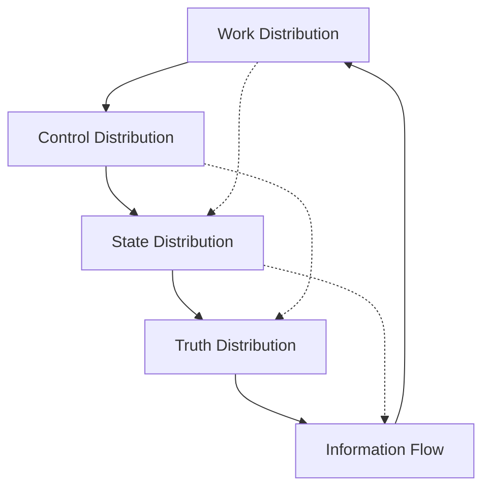

# The 5 Architectural Pillars

Building on the fundamental laws, these five pillars provide the architectural foundation for all distributed systems.

## The Pillars

### 1. [Work Distribution](work-distribution.md)
How computation is divided across nodes
- Load balancing strategies
- Task partitioning
- Parallel processing patterns

### 2. [Control Distribution](control-distribution.md)
How decisions are coordinated
- Consensus mechanisms
- Leader election
- Distributed coordination

### 3. [State Distribution](state-distribution.md)
How data is managed across nodes
- Replication strategies
- Consistency models
- Partitioning schemes

### 4. [Truth Distribution](truth-distribution.md)
How agreement is reached
- Consensus protocols
- Conflict resolution
- Version reconciliation

### 5. [Information Flow](information-flow.md)
How data moves through the system
- Communication patterns
- Event propagation
- Data pipelines

## Pillar Interactions

The pillars are interconnected:

## Design Principles

Each pillar embodies key principles:

### Work Distribution Principles
- Minimize coordination overhead
- Balance load dynamically
- Isolate failure domains

### Control Distribution Principles
- Avoid single points of failure
- Enable autonomous operation
- Coordinate only when necessary

### State Distribution Principles
- Optimize for access patterns
- Choose appropriate consistency
- Plan for partition tolerance

### Truth Distribution Principles
- Define authoritative sources
- Handle concurrent updates
- Resolve conflicts deterministically

### Information Flow Principles
- Minimize data movement
- Optimize for latency or throughput
- Handle backpressure gracefully

## Pattern Application

Each pillar maps to specific pattern categories:

- **Work Distribution** → [Scaling Patterns](../pattern-library/scaling/)
- **Control Distribution** → [Coordination Patterns](../pattern-library/coordination/)
- **State Distribution** → [Data Management Patterns](../pattern-library/data-management/)
- **Truth Distribution** → [Consensus Patterns](../pattern-library/coordination/consensus.md)
- **Information Flow** → [Communication Patterns](../pattern-library/communication/)

## Next Steps

1. Review each pillar in detail
2. Understand the relationships between pillars
3. Apply patterns that align with your architectural needs
4. Use the [Pattern Library](../pattern-library/) to implement solutions

Start with [Work Distribution](work-distribution.md) to understand how computation scales.

