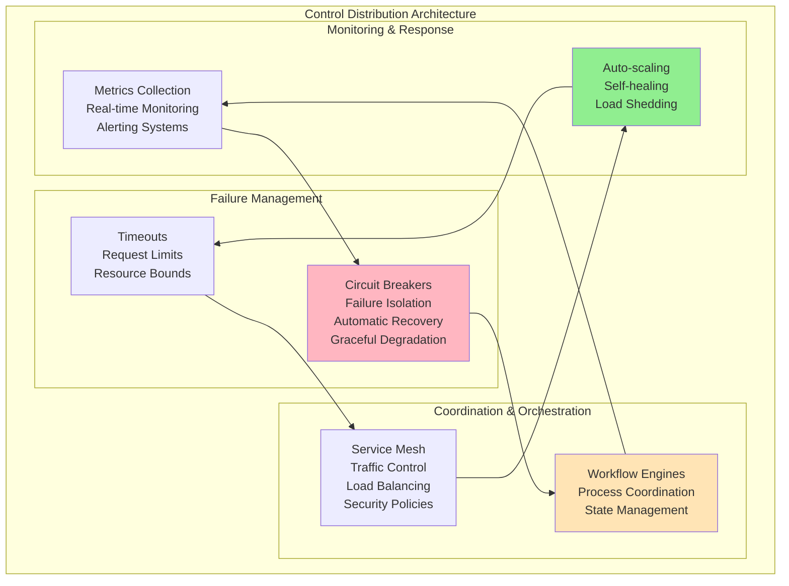
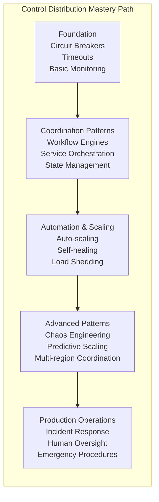
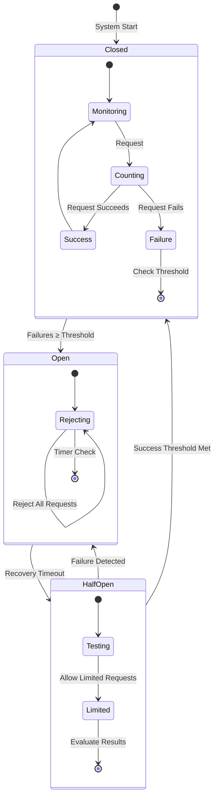
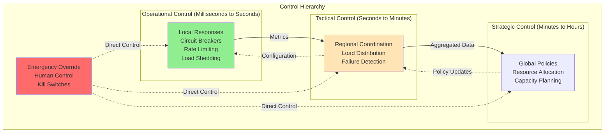
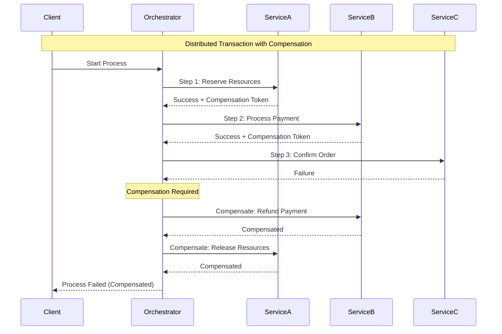

# Pillar 4: Control Distribution

## 1. The Complete Blueprint

Control distribution in distributed systems involves coordinating system behavior, handling failures, and maintaining operational control across distributed components while ensuring rapid response to changing conditions. At its core, we use circuit breakers to isolate failures and prevent cascades, orchestration patterns to coordinate multi-step processes, monitoring systems to detect anomalies and performance degradation, auto-scaling mechanisms to adapt to load changes, and kill switches for emergency control. These components work together to create systems that can detect problems quickly, respond automatically to common issues, escalate complex problems appropriately, and maintain stability even when individual components fail. The fundamental challenge is balancing automated responses with human oversight while ensuring control systems themselves don't become single points of failure.



> **What You'll Master**: Building systems that detect and respond to failures automatically, implementing effective coordination patterns for distributed processes, creating monitoring and alerting systems that provide actionable insights, designing auto-scaling strategies that maintain performance under load, and establishing human oversight mechanisms for complex operational scenarios.

## 2. The Core Mental Model

**The Air Traffic Control Analogy**: Control distribution is like managing air traffic across multiple airports during storms. You have automated systems monitoring flight paths and weather (monitoring), protocols for rerouting planes when airports close (circuit breakers), coordination between control towers (orchestration), automatic scaling of runway capacity based on traffic (auto-scaling), and human controllers who can take manual control during emergencies (kill switches). The key is having multiple layers of automated responses while maintaining the ability for human intervention when automated systems reach their limits.

**The Fundamental Principle**: *Control distribution is about building systems that can automatically handle the expected failures and gracefully escalate the unexpected ones to human operators.*

Why this matters in practice:
- **Automated responses must be faster than failure propagation** - If your circuit breaker takes longer to trip than failures cascade, you've already lost
- **Control systems must be more reliable than the systems they control** - A monitoring system that goes down during outages is useless
- **Human oversight is a feature, not a bug** - The most automated systems still need humans for edge cases and system evolution

## 3. The Journey Ahead



**Pattern Interconnections:**
- **Circuit Breakers + Auto-scaling** = Systems that isolate failures and scale around them
- **Monitoring + Orchestration** = Coordinated responses based on system state
- **Service Mesh + Load Balancing** = Centralized traffic control with distributed enforcement
- **Chaos Engineering + Self-healing** = Systems that become stronger under stress

**Common Control Failure Patterns:**
- **Control System Failures**: The monitoring system goes down during the outage it should detect
- **Automation Loops**: Auto-scaling systems that oscillate between scaling up and down
- **Cascade Failures**: Circuit breakers that don't isolate failures properly
- **Human Override Delays**: Critical situations where humans can't take control fast enough

## Core Control Distribution Patterns

### Pattern 1: Circuit Breaker State Management



### Pattern 2: Hierarchical Control Architecture



### Pattern 3: Service Orchestration Flow



## Real-World Examples

### Netflix: Hystrix for Microservice Resilience

Netflix's Hystrix library provides comprehensive control distribution for microservices:

```java
@HystrixCommand(
    fallbackMethod = "getFallbackUser",
    commandProperties = {
        @HystrixProperty(name = "circuitBreaker.requestVolumeThreshold", value = "10"),
        @HystrixProperty(name = "circuitBreaker.errorThresholdPercentage", value = "50"),
        @HystrixProperty(name = "circuitBreaker.sleepWindowInMilliseconds", value = "5000")
    },
    threadPoolProperties = {
        @HystrixProperty(name = "coreSize", value = "10"),
        @HystrixProperty(name = "maxQueueSize", value = "100")
    }
)
public User getUser(String userId) {
    return userService.getUser(userId); // May fail
}

public User getFallbackUser(String userId) {
    return new User(userId, "DefaultUser", "No data available");
}
```

**Benefits**: Isolated thread pools prevent cascading failures, automatic fallback responses maintain user experience, and circuit breakers prevent unnecessary load on failing services.

### Kubernetes: Declarative Control Loops

Kubernetes uses control loops to maintain desired state across the entire cluster:

```yaml
# Deployment specification
apiVersion: apps/v1
kind: Deployment
metadata:
  name: web-app
spec:
  replicas: 3
  selector:
    matchLabels:
      app: web-app
  template:
    spec:
      containers:
      - name: app
        image: my-app:1.2.3
        resources:
          requests:
            memory: "256Mi"
            cpu: "100m"
          limits:
            memory: "512Mi"
            cpu: "200m"
```

```python
# Kubernetes controller pseudocode
def reconcile_deployment():
    while True:
        desired_state = get_deployment_spec()
        current_state = get_current_pods()
        
        if current_state.replicas < desired_state.replicas:
            create_pods(desired_state.replicas - current_state.replicas)
        elif current_state.replicas > desired_state.replicas:
            delete_pods(current_state.replicas - desired_state.replicas)
            
        # Handle pod health, updates, etc.
        update_pod_health()
        handle_rolling_updates()
        
        sleep(1)  # Control loop frequency
```

**Results**: Self-healing deployments, automatic scaling based on resource usage, and declarative infrastructure management.

### AWS: Multi-layer Auto-scaling

AWS implements hierarchical auto-scaling across multiple dimensions:

```yaml
# Application Auto Scaling configuration
autoscaling_policy:
  target_tracking:
    target_value: 70.0
    metric: CPUUtilization
    scale_out_cooldown: 300  # 5 minutes
    scale_in_cooldown: 300   # 5 minutes
    
  step_scaling:
    adjustment_type: ChangeInCapacity
    steps:
      - threshold: 80
        adjustment: +2
      - threshold: 60
        adjustment: +1
      - threshold: 40
        adjustment: -1
        
  predictive_scaling:
    enabled: true
    forecast_horizon: 3600  # 1 hour
    
# Infrastructure scaling
cluster_autoscaler:
  nodes:
    min: 1
    max: 100
    target_capacity: 85%
  
  scale_down:
    delay_after_add: 600s
    delay_after_failure: 180s
```

**Trade-offs**: Reactive scaling responds to current load, predictive scaling anticipates future needs, and cluster auto-scaling manages infrastructure costs automatically.

## Control Anti-Patterns

### Anti-Pattern 1: Coordination Without Timeouts

```python
# WRONG: Coordination that can block forever
def process_distributed_transaction():
    participants = ["service_a", "service_b", "service_c"]
    
    # Prepare phase - blocks indefinitely if any service fails
    for service in participants:
        service.prepare()  # No timeout!
    
    # Commit phase - may never execute
    for service in participants:
        service.commit()   # No timeout!

# RIGHT: Coordination with timeouts and compensation
def process_distributed_transaction_with_timeouts():
    participants = ["service_a", "service_b", "service_c"]
    prepared_services = []
    
    try:
        # Prepare phase with timeouts
        for service in participants:
            if service.prepare(timeout=5.0):  # 5 second timeout
                prepared_services.append(service)
            else:
                raise TransactionTimeout(f"Service {service} prepare timeout")
        
        # Commit phase with timeouts
        for service in prepared_services:
            service.commit(timeout=10.0)  # 10 second timeout
            
    except (TransactionTimeout, ServiceException):
        # Compensate all prepared services
        for service in prepared_services:
            try:
                service.abort(timeout=5.0)
            except:
                log_compensation_failure(service)
```

### Anti-Pattern 2: Monitoring System Single Point of Failure

```python
# WRONG: Centralized monitoring that can fail
class CentralizedMonitoring:
    def __init__(self):
        self.central_db = MetricsDatabase()  # Single point of failure
        self.alerting = AlertManager()       # Also single point of failure
    
    def record_metric(self, metric):
        self.central_db.write(metric)  # Fails if DB is down
        
    def check_alerts(self):
        metrics = self.central_db.read_recent()  # Fails during outages
        self.alerting.process(metrics)

# RIGHT: Distributed monitoring with local autonomy
class DistributedMonitoring:
    def __init__(self):
        self.local_buffer = CircularBuffer(size=1000)
        self.local_alerting = LocalAlertManager()
        self.remote_endpoints = [
            "monitoring_1", "monitoring_2", "monitoring_3"
        ]
    
    def record_metric(self, metric):
        # Always store locally first
        self.local_buffer.add(metric)
        
        # Asynchronously ship to remote (best effort)
        asyncio.create_task(self.ship_metric(metric))
        
        # Local alerting works even during network partitions
        self.local_alerting.evaluate(metric)
    
    async def ship_metric(self, metric):
        for endpoint in self.remote_endpoints:
            try:
                await endpoint.send(metric, timeout=1.0)
                break  # Success, stop trying other endpoints
            except NetworkError:
                continue  # Try next endpoint
```

## Implementation Patterns

### Pattern: Exponential Backoff with Jitter

```python
import random
import time

class ExponentialBackoff:
    def __init__(self, base_delay=1.0, max_delay=300.0, multiplier=2.0):
        self.base_delay = base_delay
        self.max_delay = max_delay
        self.multiplier = multiplier
        self.attempt = 0
    
    def next_delay(self):
        """Calculate next delay with exponential backoff and jitter"""
        # Exponential backoff: delay = base * multiplier^attempt
        delay = self.base_delay * (self.multiplier ** self.attempt)
        delay = min(delay, self.max_delay)
        
        # Add jitter to prevent thundering herd
        jittered_delay = delay * (0.5 + 0.5 * random.random())
        
        self.attempt += 1
        return jittered_delay
    
    def reset(self):
        """Reset backoff on success"""
        self.attempt = 0

# Usage in retry logic
def call_service_with_backoff(service_call):
    backoff = ExponentialBackoff()
    
    while True:
        try:
            result = service_call()
            backoff.reset()  # Success - reset backoff
            return result
            
        except ServiceException as e:
            if e.is_permanent():
                raise  # Don't retry permanent failures
            
            delay = backoff.next_delay()
            if delay >= backoff.max_delay:
                raise MaxRetriesExceeded()
            
            time.sleep(delay)
```

### Pattern: Bulkhead Resource Isolation

```python
import threading
from concurrent.futures import ThreadPoolExecutor
from queue import Queue

class BulkheadExecutor:
    def __init__(self):
        # Separate thread pools for different service types
        self.pools = {
            "critical": ThreadPoolExecutor(max_workers=5, thread_name_prefix="critical"),
            "user_facing": ThreadPoolExecutor(max_workers=10, thread_name_prefix="user"),
            "background": ThreadPoolExecutor(max_workers=20, thread_name_prefix="background"),
            "analytics": ThreadPoolExecutor(max_workers=3, thread_name_prefix="analytics")
        }
        
        # Separate queues with different priorities
        self.queues = {
            "critical": Queue(maxsize=100),
            "user_facing": Queue(maxsize=500),
            "background": Queue(maxsize=1000),
            "analytics": Queue(maxsize=200)
        }
    
    def submit_task(self, task_type, function, *args, **kwargs):
        """Submit task to appropriate bulkhead"""
        if task_type not in self.pools:
            raise ValueError(f"Unknown task type: {task_type}")
        
        # Check if queue is full (backpressure)
        queue = self.queues[task_type]
        if queue.full():
            raise ResourceExhaustedException(f"Queue full for {task_type}")
        
        # Submit to appropriate thread pool
        pool = self.pools[task_type]
        future = pool.submit(function, *args, **kwargs)
        
        return future
    
    def shutdown(self):
        """Graceful shutdown of all pools"""
        for pool in self.pools.values():
            pool.shutdown(wait=True)

# Usage
bulkhead = BulkheadExecutor()

# Critical operations get dedicated resources
bulkhead.submit_task("critical", process_payment, user_id, amount)

# User-facing operations have their own pool
bulkhead.submit_task("user_facing", generate_recommendation, user_id)

# Background tasks don't interfere with user-facing work
bulkhead.submit_task("background", cleanup_old_data)
```

## Production Readiness Checklist

```yaml
□ FAILURE MANAGEMENT
  ├─ □ Circuit breakers implemented for all external dependencies
  ├─ □ Timeout values set based on 95th percentile response times
  ├─ □ Retry logic with exponential backoff and jitter
  └─ □ Bulkhead isolation for different service types

□ COORDINATION PATTERNS
  ├─ □ Workflow engines for complex multi-step processes
  ├─ □ Compensation patterns for distributed transactions
  ├─ □ State management for long-running processes
  └─ □ Dead letter queues for failed message processing

□ MONITORING & ALERTING
  ├─ □ Comprehensive metrics collection at all levels
  ├─ □ Distributed monitoring with local autonomy
  ├─ □ Alerting based on business impact, not just technical metrics
  └─ □ Runbooks linked to every alert

□ EMERGENCY CONTROLS
  ├─ □ Kill switches accessible to on-call engineers
  ├─ □ Load shedding mechanisms with priority classification
  ├─ □ Manual override capabilities for all automated systems
  └─ □ Emergency contact procedures and escalation paths
```

## Key Trade-off Decisions

### Automation vs. Human Control

| Scenario | Automation Level | Human Oversight | Trade-offs |
|----------|-----------------|-----------------|-------------|
| **Normal Operations** | High | Monitoring only | Efficient, consistent responses |
| **Known Failures** | Medium | Approval required | Fast response with safety checks |
| **Unknown Failures** | Low | Direct control | Slower but more adaptive responses |
| **Critical Systems** | Low | Always involved | Maximum safety, minimum speed |

### Centralized vs. Distributed Control

```python
# Centralized control - simple but fragile
class CentralizedControl:
    def handle_failure(self, service, error):
        # Single point of decision making
        decision = self.central_controller.analyze(service, error)
        return self.execute_decision(decision)

# Distributed control - complex but resilient  
class DistributedControl:
    def handle_failure(self, service, error):
        # Local decision first
        local_decision = self.local_controller.analyze(service, error)
        if self.can_handle_locally(local_decision):
            return self.execute_locally(local_decision)
        
        # Escalate to regional if needed
        regional_decision = self.regional_controller.analyze(service, error)
        if self.can_handle_regionally(regional_decision):
            return self.execute_regionally(regional_decision)
            
        # Only escalate to global for complex cases
        return self.escalate_to_global(service, error)
```

## Key Takeaways

1. **Control systems must be faster than the systems they control** - If your circuit breaker takes longer to activate than failures propagate, you've already lost

2. **Build for the failures you can predict, escalate the ones you can't** - Automate common failure responses, but always have human override capabilities

3. **Hierarchical control scales better than centralized control** - Local autonomy with global coordination enables both speed and consistency

4. **Monitoring systems must work during the outages they're supposed to detect** - Distributed monitoring with local autonomy prevents monitoring system single points of failure

5. **Emergency controls are not just technical but organizational** - Have clear procedures for who can access kill switches and when to use them

## Related Topics

- [Work Distribution](work-distribution.md) - How control patterns coordinate distributed work
- [State Distribution](state-distribution.md) - Coordinating distributed state changes
- [Pattern: Circuit Breaker](../../pattern-library/resilience/circuit-breaker-transformed.md) - Detailed circuit breaker implementations
- [Pattern: Saga](../../pattern-library/data-management/saga.md) - Distributed transaction coordination

---

*"The best control systems are invisible during normal operations and indispensable during failures."*