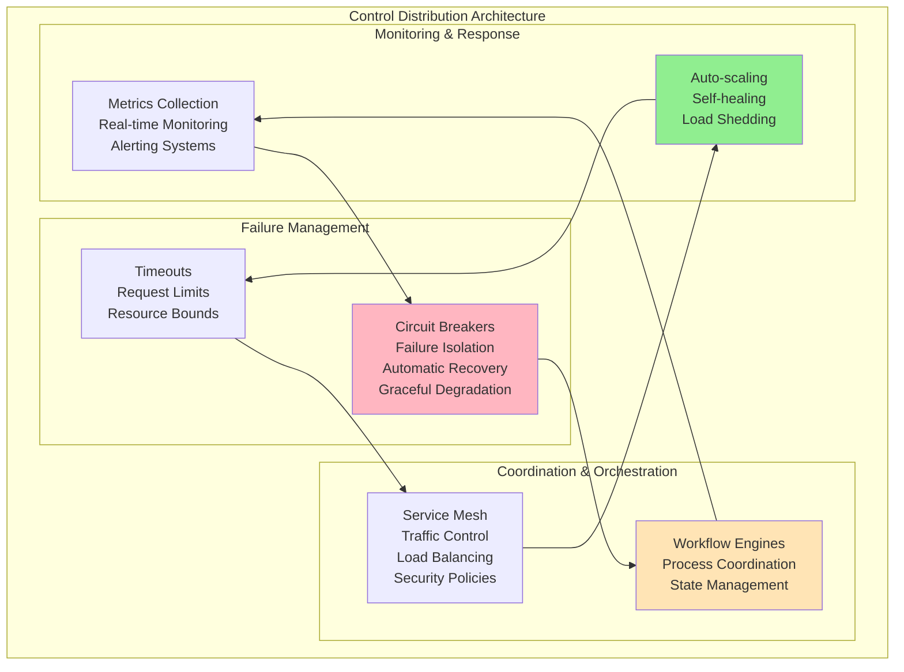
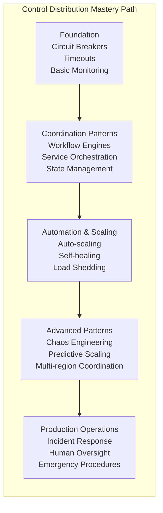
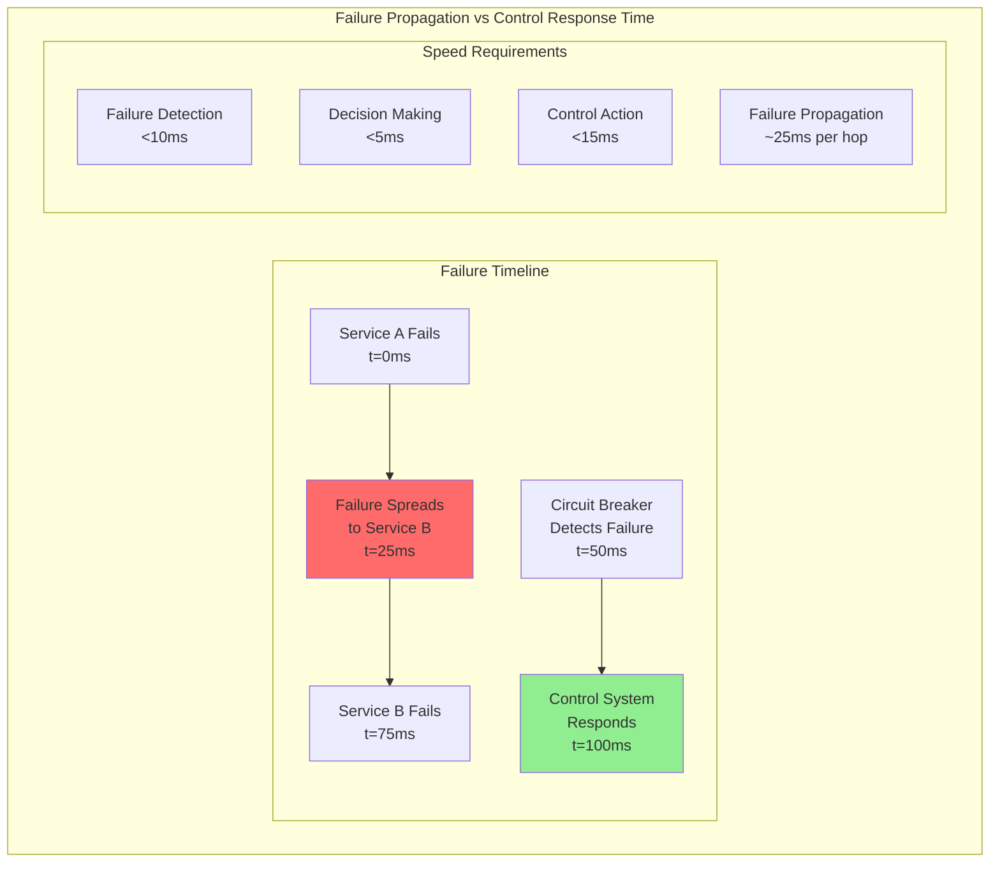
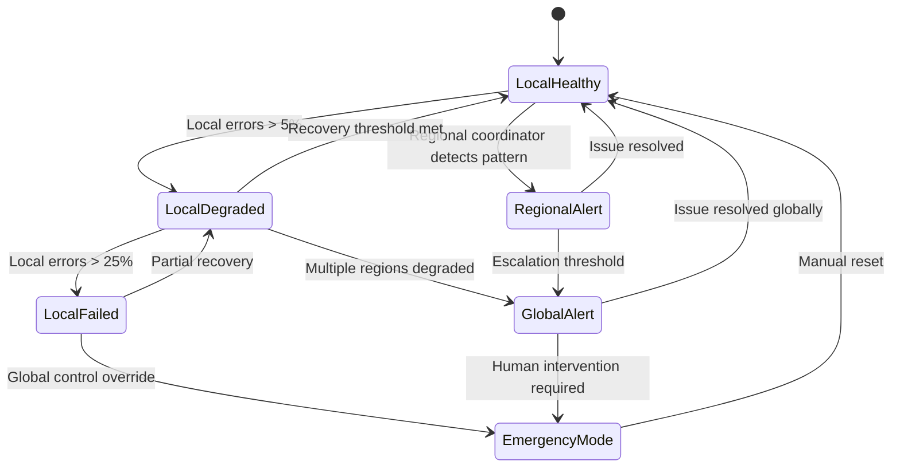
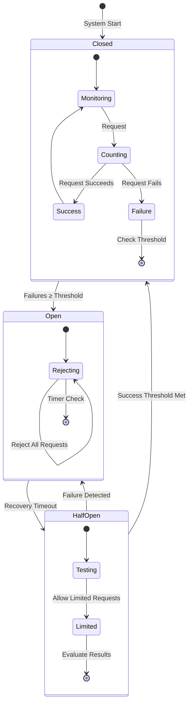
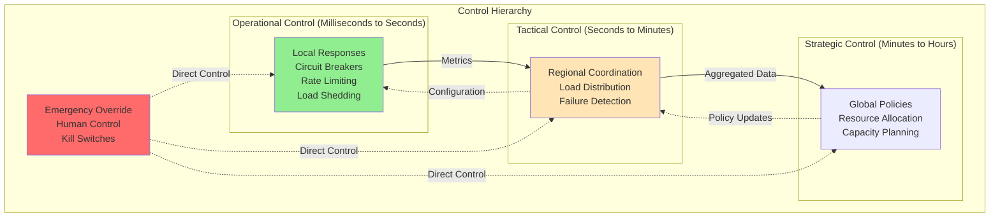
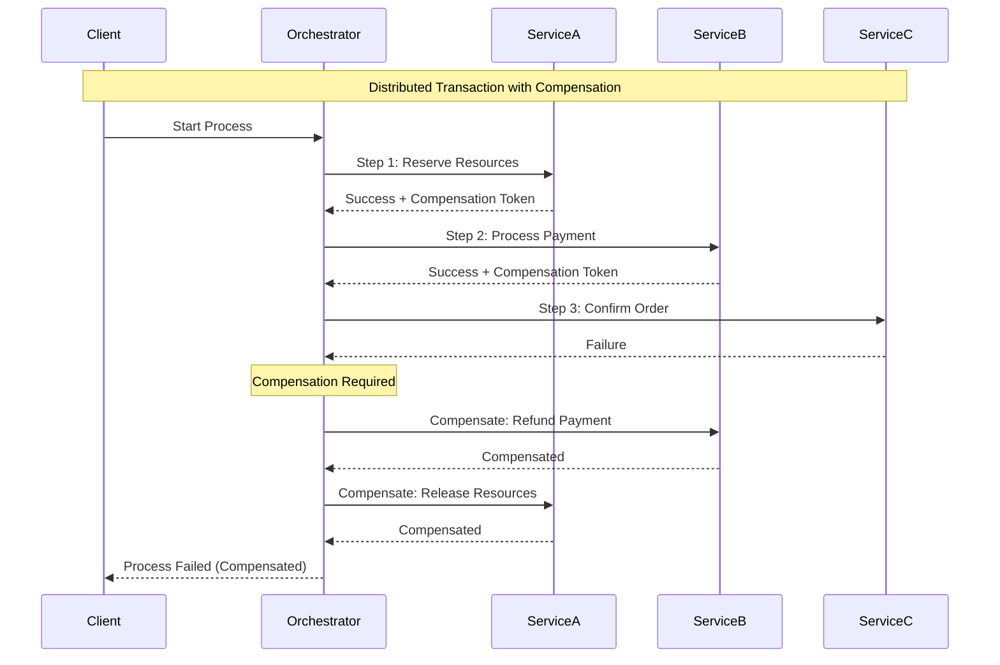
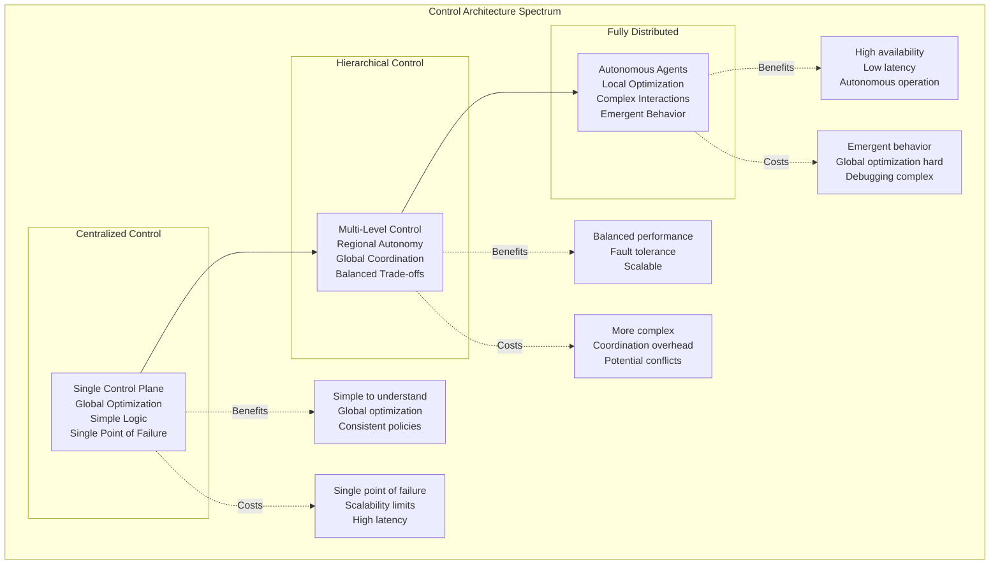
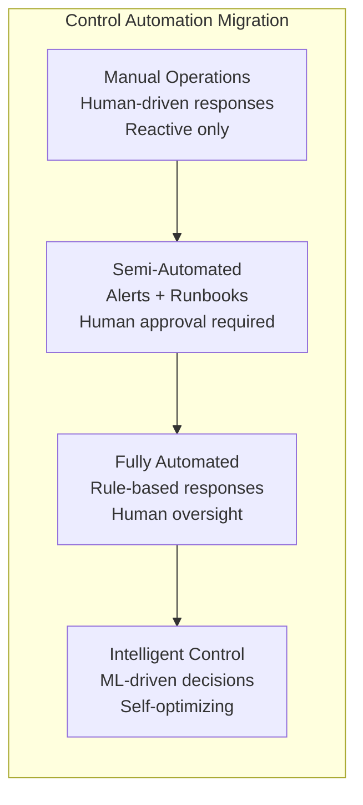

# Pillar 4: Control Distribution

## 1. The Complete Blueprint

Control distribution in distributed systems involves coordinating system behavior, handling failures, and maintaining operational control across distributed components while ensuring rapid response to changing conditions. At its core, we use circuit breakers to isolate failures and prevent cascades, orchestration patterns to coordinate multi-step processes, monitoring systems to detect anomalies and performance degradation, auto-scaling mechanisms to adapt to load changes, and kill switches for emergency control. These components work together to create systems that can detect problems quickly, respond automatically to common issues, escalate complex problems appropriately, and maintain stability even when individual components fail. The fundamental challenge is balancing automated responses with human oversight while ensuring control systems themselves don't become single points of failure.



> **What You'll Master**: Building systems that detect and respond to failures automatically, implementing effective coordination patterns for distributed processes, creating monitoring and alerting systems that provide actionable insights, designing auto-scaling strategies that maintain performance under load, and establishing human oversight mechanisms for complex operational scenarios.

## 2. The Core Mental Model

**The Air Traffic Control Analogy**: Control distribution is like managing air traffic across multiple airports during storms. You have automated systems monitoring flight paths and weather (monitoring), protocols for rerouting planes when airports close (circuit breakers), coordination between control towers (orchestration), automatic scaling of runway capacity based on traffic (auto-scaling), and human controllers who can take manual control during emergencies (kill switches). The key is having multiple layers of automated responses while maintaining the ability for human intervention when automated systems reach their limits.

**The Fundamental Principle**: *Control distribution is about building systems that can automatically handle the expected failures and gracefully escalate the unexpected ones to human operators.*

Why this matters in practice:
- **Automated responses must be faster than failure propagation** - If your circuit breaker takes longer to trip than failures cascade, you've already lost
- **Control systems must be more reliable than the systems they control** - A monitoring system that goes down during outages is useless
- **Human oversight is a feature, not a bug** - The most automated systems still need humans for edge cases and system evolution

## 3. The Journey Ahead



**Pattern Interconnections:**
- **Circuit Breakers + Auto-scaling** = Systems that isolate failures and scale around them
- **Monitoring + Orchestration** = Coordinated responses based on system state
- **Service Mesh + Load Balancing** = Centralized traffic control with distributed enforcement
- **Chaos Engineering + Self-healing** = Systems that become stronger under stress

**Common Control Failure Patterns:**
- **Control System Failures**: The monitoring system goes down during the outage it should detect
- **Automation Loops**: Auto-scaling systems that oscillate between scaling up and down
- **Cascade Failures**: Circuit breakers that don't isolate failures properly
- **Human Override Delays**: Critical situations where humans can't take control fast enough

## Core Challenges and Technical Deep Dive

### Challenge 1: Control Systems Must Be Faster Than The Systems They Control

Control systems face the fundamental challenge that they must detect, decide, and respond faster than failures propagate through the system.



**Mathematical Model for Control System Speed:**

```python
class ControlSystemPerformanceModel:
    def __init__(self):
        self.failure_propagation_rate = 40  # ms per service hop
        self.network_latency_p99 = 5        # ms
        self.decision_overhead = 2           # ms
        
    def calculate_required_response_time(self, service_dependency_depth):
        """Calculate maximum allowable control response time"""
        # Failure will propagate through dependency chain
        failure_propagation_time = service_dependency_depth * self.failure_propagation_rate
        
        # Control system must respond before failure reaches critical services
        max_allowable_response_time = failure_propagation_time * 0.5  # 50% safety margin
        
        # Breakdown of response time budget
        detection_budget = max_allowable_response_time * 0.6
        decision_budget = max_allowable_response_time * 0.2
        action_budget = max_allowable_response_time * 0.2
        
        return {
            'max_response_time_ms': max_allowable_response_time,
            'detection_budget_ms': detection_budget,
            'decision_budget_ms': decision_budget,
            'action_budget_ms': action_budget,
            'failure_will_reach_critical_at_ms': failure_propagation_time
        }
    
    def evaluate_control_effectiveness(self, actual_response_time, dependency_depth):
        """Evaluate if control system is fast enough"""
        requirements = self.calculate_required_response_time(dependency_depth)
        
        effectiveness = {
            'is_effective': actual_response_time < requirements['max_response_time_ms'],
            'response_ratio': actual_response_time / requirements['max_response_time_ms'],
            'failure_prevention_probability': max(0, 1 - (actual_response_time / requirements['failure_will_reach_critical_at_ms']))
        }
        
        if effectiveness['response_ratio'] > 1.0:
            effectiveness['status'] = 'Control system too slow - failures will cascade'
        elif effectiveness['response_ratio'] > 0.8:
            effectiveness['status'] = 'Marginal - high risk of cascade failures'
        else:
            effectiveness['status'] = 'Effective - will prevent failure cascade'
            
        return effectiveness
```

### Challenge 2: Control System Reliability Paradox

Control systems must be more reliable than the systems they control, creating a bootstrapping problem.

```yaml
# Control system reliability requirements
reliability_paradox:
  target_system_availability: 99.9%  # 3 nines
  control_system_required_availability: 99.99%  # 4 nines minimum
  
  reasoning: |
    If control system has same reliability as target system,
    combined availability = 0.999 * 0.999 = 0.998 = 99.8%
    This is WORSE than no control system at all!
    
  solution_strategies:
    redundant_control_planes:
      description: "Multiple independent control systems"
      reliability_improvement: "10x better with 3 independent systems"
      cost_overhead: "3x infrastructure cost"
      
    hierarchical_control:
      description: "Local controllers with regional oversight"
      reliability_improvement: "5x better through isolation"
      cost_overhead: "1.5x infrastructure cost"
      
    graceful_degradation:
      description: "System works without control plane"
      reliability_improvement: "Baseline reliability maintained"
      cost_overhead: "2x implementation complexity"
```

### Challenge 3: Coordination Overhead in Distributed Control

Distributed control systems face exponential coordination overhead as the number of controlled components grows.

```python
class DistributedControlCoordinationModel:
    def __init__(self):
        self.base_decision_time_ms = 1
        self.network_overhead_per_node_ms = 0.5
        self.consensus_rounds = 2
        
    def calculate_coordination_overhead(self, num_nodes, control_architecture):
        """Calculate coordination overhead for different control architectures"""
        
        if control_architecture == 'centralized':
            # Single controller coordinates with all nodes
            coordination_time = (
                self.base_decision_time_ms + 
                (num_nodes * self.network_overhead_per_node_ms)
            )
            scalability_limit = 1000  # Single point bottleneck
            
        elif control_architecture == 'hierarchical':
            # Tree structure with multiple levels
            tree_depth = math.ceil(math.log2(num_nodes))
            coordination_time = (
                self.base_decision_time_ms * tree_depth +
                (tree_depth * self.network_overhead_per_node_ms)
            )
            scalability_limit = 100000  # Scales logarithmically
            
        elif control_architecture == 'distributed_consensus':
            # All nodes participate in consensus
            coordination_time = (
                self.base_decision_time_ms * self.consensus_rounds +
                (num_nodes * self.network_overhead_per_node_ms * self.consensus_rounds)
            )
            scalability_limit = 100  # Limited by consensus overhead
            
        elif control_architecture == 'gossip_based':
            # Information spreads via gossip protocol
            gossip_rounds = math.ceil(math.log(num_nodes))
            coordination_time = (
                gossip_rounds * self.network_overhead_per_node_ms
            )
            scalability_limit = 50000  # Very scalable but eventually consistent
            
        else:
            raise ValueError(f"Unknown architecture: {control_architecture}")
        
        return {
            'coordination_time_ms': coordination_time,
            'scalability_limit': scalability_limit,
            'efficiency': min(1.0, scalability_limit / num_nodes),
            'recommendation': self._get_recommendation(num_nodes, coordination_time)
        }
    
    def _get_recommendation(self, num_nodes, coord_time):
        """Recommend control architecture based on requirements"""
        if num_nodes < 10:
            return "Use centralized control for simplicity"
        elif num_nodes < 100:
            return "Use hierarchical control for balance of simplicity and scale"
        elif coord_time < 50:  # ms
            return "Current architecture acceptable for real-time control"
        else:
            return "Consider gossip-based or eventual consistency models"
```

## Comprehensive Techniques & Patterns

### Pattern 1: Hierarchical Circuit Breaker Architecture



### Pattern 2: Advanced Control Loop Implementation



### Pattern 3: Multi-Level Control Architecture with Performance Optimization

```python
class OptimizedControlHierarchy:
    def __init__(self):
        self.local_controllers = {}    # Node-level control (ms response)
        self.regional_controllers = {} # Cluster-level control (seconds response)
        self.global_controller = None  # System-level control (minutes response)
        
        # Performance optimization parameters
        self.local_decision_threshold = 0.1    # 100ms
        self.regional_escalation_threshold = 5  # 5 seconds
        self.global_escalation_threshold = 30   # 30 seconds
        
    def handle_event(self, event, severity_level):
        """Route events through appropriate control level"""
        
        # Local control: Handle 90% of events in <100ms
        if self.can_handle_locally(event):
            start_time = time.time()
            response = self.local_controllers[event.node_id].handle(event)
            response_time = (time.time() - start_time) * 1000
            
            if response_time < self.local_decision_threshold * 1000:
                return self.log_success('local', response_time, event)
            
        # Regional control: Handle 9% of events in <5s
        if self.can_handle_regionally(event):
            start_time = time.time()
            response = self.regional_controllers[event.region_id].handle(event)
            response_time = (time.time() - start_time) * 1000
            
            if response_time < self.regional_escalation_threshold * 1000:
                return self.log_success('regional', response_time, event)
        
        # Global control: Handle 1% of events (complex coordination needed)
        return self.global_controller.handle(event)
    
    def optimize_control_placement(self, event_patterns):
        """Optimize which events are handled at which level"""
        
        event_analysis = self.analyze_event_patterns(event_patterns)
        
        # Move frequently successful events to lower levels
        for event_type, stats in event_analysis.items():
            if stats['success_rate'] > 0.95 and stats['avg_response_time'] < 50:
                # Move to local control
                self.update_local_handlers(event_type, stats['handler_config'])
                
            elif stats['success_rate'] > 0.85 and stats['avg_response_time'] < 2000:
                # Move to regional control
                self.update_regional_handlers(event_type, stats['handler_config'])
                
        return self.generate_optimization_report(event_analysis)
    
    def calculate_control_effectiveness(self):
        """Calculate effectiveness metrics across all control levels"""
        
        local_stats = self.get_local_stats()
        regional_stats = self.get_regional_stats()
        global_stats = self.get_global_stats()
        
        return {
            'local_control': {
                'event_percentage': local_stats['handled_events'] / local_stats['total_events'],
                'avg_response_time_ms': local_stats['avg_response_time'],
                'success_rate': local_stats['success_rate'],
                'throughput_events_per_sec': local_stats['throughput']
            },
            'regional_control': {
                'event_percentage': regional_stats['handled_events'] / regional_stats['total_events'],
                'avg_response_time_ms': regional_stats['avg_response_time'],
                'success_rate': regional_stats['success_rate'],
                'coordination_overhead_ms': regional_stats['coordination_time']
            },
            'global_control': {
                'event_percentage': global_stats['handled_events'] / global_stats['total_events'],
                'avg_response_time_ms': global_stats['avg_response_time'],
                'human_intervention_rate': global_stats['human_interventions'],
                'system_wide_impact_events': global_stats['critical_events']
            },
            'overall_system_health': self.calculate_overall_health(local_stats, regional_stats, global_stats)
        }
```

### Pattern 4: Intelligent Control System with Machine Learning

```python
class MLEnhancedControlSystem:
    def __init__(self):
        self.anomaly_detector = AnomalyDetectionModel()
        self.failure_predictor = FailurePredictionModel()
        self.response_optimizer = ResponseOptimizationModel()
        self.historical_data = ControlSystemDataStore()
        
    def predict_and_prevent_failures(self, system_metrics):
        """Proactively prevent failures using ML predictions"""
        
        # Detect anomalies in real-time metrics
        anomalies = self.anomaly_detector.detect(
            metrics=system_metrics,
            confidence_threshold=0.95
        )
        
        if anomalies:
            # Predict likelihood and timeline of failure
            failure_prediction = self.failure_predictor.predict(
                current_metrics=system_metrics,
                anomalies=anomalies,
                historical_patterns=self.historical_data.get_patterns()
            )
            
            # If failure likely, take preventive action
            if failure_prediction['probability'] > 0.7:
                
                preventive_actions = self.response_optimizer.recommend_actions(
                    predicted_failure=failure_prediction,
                    available_resources=system_metrics['available_capacity'],
                    business_constraints=self.get_business_constraints()
                )
                
                # Execute preventive actions
                for action in preventive_actions:
                    result = self.execute_preventive_action(action)
                    self.historical_data.record_intervention(
                        action=action,
                        result=result,
                        prediction=failure_prediction
                    )
                
                return {
                    'status': 'preventive_action_taken',
                    'predicted_failure': failure_prediction,
                    'actions_taken': preventive_actions,
                    'expected_outcome': 'failure_prevented'
                }
        
        return {'status': 'normal_operation', 'anomalies': anomalies}
    
    def optimize_response_strategies(self):
        """Continuously improve control responses using historical data"""
        
        # Analyze historical control decisions and outcomes
        historical_interventions = self.historical_data.get_interventions(
            time_window='last_30_days'
        )
        
        # Identify patterns in successful vs. failed interventions
        success_patterns = self.analyze_intervention_patterns(historical_interventions)
        
        # Update response optimization model
        self.response_optimizer.update_model(
            training_data=success_patterns,
            validation_split=0.2
        )
        
        # Generate new response strategies
        optimized_strategies = self.response_optimizer.generate_strategies(
            failure_scenarios=self.get_common_failure_scenarios()
        )
        
        return {
            'model_accuracy_improvement': self.response_optimizer.get_accuracy_improvement(),
            'new_strategies_count': len(optimized_strategies),
            'estimated_failure_reduction': self.calculate_expected_improvement(optimized_strategies)
        }
```

### Pattern 5: Hierarchical Control with Performance Guarantees



### Pattern 3: Service Orchestration Flow



## Step-by-Step Implementation Guide

### Phase 1: Foundation - Basic Circuit Breakers (Week 1-2)

```python
# Step 1: Implement basic circuit breaker
class ProductionCircuitBreaker:
    def __init__(self, failure_threshold=5, timeout_duration=60, success_threshold=3):
        self.failure_threshold = failure_threshold
        self.timeout_duration = timeout_duration  # seconds
        self.success_threshold = success_threshold
        
        # State tracking
        self.failure_count = 0
        self.last_failure_time = None
        self.state = 'CLOSED'  # CLOSED, OPEN, HALF_OPEN
        self.success_count = 0
        
        # Metrics
        self.total_requests = 0
        self.total_failures = 0
        self.state_transitions = []
        
    def call(self, protected_function, *args, **kwargs):
        """Execute function with circuit breaker protection"""
        self.total_requests += 1
        
        # Check if circuit should open
        if self.state == 'CLOSED':
            return self._execute_closed(protected_function, *args, **kwargs)
        elif self.state == 'OPEN':
            return self._execute_open(protected_function, *args, **kwargs)
        else:  # HALF_OPEN
            return self._execute_half_open(protected_function, *args, **kwargs)
    
    def _execute_closed(self, func, *args, **kwargs):
        """Execute function in CLOSED state"""
        try:
            result = func(*args, **kwargs)
            self._record_success()
            return result
        except Exception as e:
            self._record_failure()
            if self.failure_count >= self.failure_threshold:
                self._transition_to_open()
            raise e
    
    def _execute_open(self, func, *args, **kwargs):
        """Handle requests in OPEN state"""
        # Check if timeout has passed
        if (time.time() - self.last_failure_time) > self.timeout_duration:
            self._transition_to_half_open()
            return self._execute_half_open(func, *args, **kwargs)
        else:
            # Circuit is open - fail fast
            raise CircuitBreakerOpenException("Circuit breaker is OPEN")
    
    def _execute_half_open(self, func, *args, **kwargs):
        """Execute function in HALF_OPEN state"""
        try:
            result = func(*args, **kwargs)
            self.success_count += 1
            
            if self.success_count >= self.success_threshold:
                self._transition_to_closed()
            
            return result
        except Exception as e:
            self._transition_to_open()
            raise e
    
    def _record_success(self):
        self.failure_count = max(0, self.failure_count - 1)  # Decay failures
    
    def _record_failure(self):
        self.failure_count += 1
        self.total_failures += 1
        self.last_failure_time = time.time()
    
    def _transition_to_open(self):
        self.state = 'OPEN'
        self.success_count = 0
        self.state_transitions.append(('OPEN', time.time()))
        print(f"Circuit breaker OPENED at {time.time()}")
    
    def _transition_to_half_open(self):
        self.state = 'HALF_OPEN'
        self.success_count = 0
        self.state_transitions.append(('HALF_OPEN', time.time()))
        print(f"Circuit breaker HALF_OPEN at {time.time()}")
    
    def _transition_to_closed(self):
        self.state = 'CLOSED'
        self.failure_count = 0
        self.state_transitions.append(('CLOSED', time.time()))
        print(f"Circuit breaker CLOSED at {time.time()}")
    
    def get_metrics(self):
        """Get circuit breaker performance metrics"""
        uptime_percentage = ((self.total_requests - self.total_failures) / 
                           max(1, self.total_requests)) * 100
        
        return {
            'state': self.state,
            'total_requests': self.total_requests,
            'total_failures': self.total_failures,
            'current_failure_count': self.failure_count,
            'uptime_percentage': uptime_percentage,
            'state_transitions': self.state_transitions
        }
```

### Phase 2: Advanced Monitoring (Week 3-4)

```python
# Step 2: Add comprehensive monitoring
class ControlSystemMonitor:
    def __init__(self):
        self.metrics_collector = MetricsCollector()
        self.alerting_system = AlertingSystem()
        self.dashboard_generator = DashboardGenerator()
        
    def setup_control_monitoring(self):
        """Set up comprehensive control system monitoring"""
        
        # Core metrics to track
        self.core_metrics = {
            'control_response_time': {
                'description': 'Time from event detection to control action',
                'unit': 'milliseconds',
                'alert_threshold': 100,  # ms
                'dashboard_priority': 'high'
            },
            'control_success_rate': {
                'description': 'Percentage of successful control interventions',
                'unit': 'percentage',
                'alert_threshold': 95,  # %
                'dashboard_priority': 'high'
            },
            'cascade_failure_prevention_rate': {
                'description': 'Percentage of cascade failures prevented',
                'unit': 'percentage',
                'alert_threshold': 90,  # %
                'dashboard_priority': 'critical'
            },
            'control_overhead': {
                'description': 'CPU/Memory overhead of control systems',
                'unit': 'percentage',
                'alert_threshold': 10,  # % of total resources
                'dashboard_priority': 'medium'
            }
        }
        
        # Set up alerts
        for metric_name, config in self.core_metrics.items():
            self.alerting_system.add_alert(
                metric=metric_name,
                threshold=config['alert_threshold'],
                severity='critical' if config['dashboard_priority'] == 'critical' else 'warning'
            )
        
        # Create monitoring dashboard
        return self.dashboard_generator.create_dashboard(self.core_metrics)
    
    def analyze_control_effectiveness(self, time_window='24h'):
        """Analyze how effective control systems are being"""
        
        metrics_data = self.metrics_collector.get_metrics(
            time_window=time_window,
            metrics=list(self.core_metrics.keys())
        )
        
        analysis = {
            'overall_effectiveness': self.calculate_effectiveness_score(metrics_data),
            'bottlenecks': self.identify_bottlenecks(metrics_data),
            'optimization_opportunities': self.find_optimization_opportunities(metrics_data),
            'trend_analysis': self.analyze_trends(metrics_data)
        }
        
        return analysis
```

### Phase 3: Hierarchical Control (Week 5-8)

```bash
#!/bin/bash
# Step 3: Deploy hierarchical control infrastructure

# Deploy local control agents
kubectl apply -f - <<EOF
apiVersion: apps/v1
kind: DaemonSet
metadata:
  name: local-control-agent
  namespace: control-system
spec:
  selector:
    matchLabels:
      app: local-control-agent
  template:
    metadata:
      labels:
        app: local-control-agent
    spec:
      containers:
      - name: control-agent
        image: control-system/local-agent:v1.0
        resources:
          requests:
            cpu: 100m
            memory: 128Mi
          limits:
            cpu: 200m
            memory: 256Mi
        env:
        - name: CONTROL_LEVEL
          value: "local"
        - name: RESPONSE_TIME_TARGET_MS
          value: "50"
        - name: ESCALATION_THRESHOLD
          value: "5"
EOF

# Deploy regional control coordinators
kubectl apply -f - <<EOF
apiVersion: apps/v1
kind: Deployment
metadata:
  name: regional-control-coordinator
  namespace: control-system
spec:
  replicas: 3  # High availability
  selector:
    matchLabels:
      app: regional-coordinator
  template:
    metadata:
      labels:
        app: regional-coordinator
    spec:
      containers:
      - name: coordinator
        image: control-system/regional-coordinator:v1.0
        resources:
          requests:
            cpu: 500m
            memory: 1Gi
          limits:
            cpu: 1000m
            memory: 2Gi
        env:
        - name: CONTROL_LEVEL
          value: "regional"
        - name: COORDINATION_NODES
          value: "3"
EOF
```

## Real-World Implementation Examples

### Netflix: Advanced Control Distribution with Hystrix Evolution

Netflix's evolution from Hystrix to modern control systems demonstrates hierarchical control at scale:

Netflix's Hystrix library provides comprehensive control distribution for microservices:

```java
@HystrixCommand(
    fallbackMethod = "getFallbackUser",
    commandProperties = {
        @HystrixProperty(name = "circuitBreaker.requestVolumeThreshold", value = "10"),
        @HystrixProperty(name = "circuitBreaker.errorThresholdPercentage", value = "50"),
        @HystrixProperty(name = "circuitBreaker.sleepWindowInMilliseconds", value = "5000")
    },
    threadPoolProperties = {
        @HystrixProperty(name = "coreSize", value = "10"),
        @HystrixProperty(name = "maxQueueSize", value = "100")
    }
)
public User getUser(String userId) {
    return userService.getUser(userId); // May fail
}

public User getFallbackUser(String userId) {
    return new User(userId, "DefaultUser", "No data available");
}
```

**Benefits**: Isolated thread pools prevent cascading failures, automatic fallback responses maintain user experience, and circuit breakers prevent unnecessary load on failing services.

### Kubernetes: Declarative Control Loops

Kubernetes uses control loops to maintain desired state across the entire cluster:

```yaml
# Deployment specification
apiVersion: apps/v1
kind: Deployment
metadata:
  name: web-app
spec:
  replicas: 3
  selector:
    matchLabels:
      app: web-app
  template:
    spec:
      containers:
      - name: app
        image: my-app:1.2.3
        resources:
          requests:
            memory: "256Mi"
            cpu: "100m"
          limits:
            memory: "512Mi"
            cpu: "200m"
```

```python
# Kubernetes controller pseudocode
def reconcile_deployment():
    while True:
        desired_state = get_deployment_spec()
        current_state = get_current_pods()
        
        if current_state.replicas < desired_state.replicas:
            create_pods(desired_state.replicas - current_state.replicas)
        elif current_state.replicas > desired_state.replicas:
            delete_pods(current_state.replicas - desired_state.replicas)
            
        # Handle pod health, updates, etc.
        update_pod_health()
        handle_rolling_updates()
        
        sleep(1)  # Control loop frequency
```

**Results**: Self-healing deployments, automatic scaling based on resource usage, and declarative infrastructure management.

### AWS: Multi-layer Auto-scaling

AWS implements hierarchical auto-scaling across multiple dimensions:

```yaml
# Application Auto Scaling configuration
autoscaling_policy:
  target_tracking:
    target_value: 70.0
    metric: CPUUtilization
    scale_out_cooldown: 300  # 5 minutes
    scale_in_cooldown: 300   # 5 minutes
    
  step_scaling:
    adjustment_type: ChangeInCapacity
    steps:
      - threshold: 80
        adjustment: +2
      - threshold: 60
        adjustment: +1
      - threshold: 40
        adjustment: -1
        
  predictive_scaling:
    enabled: true
    forecast_horizon: 3600  # 1 hour
    
# Infrastructure scaling
cluster_autoscaler:
  nodes:
    min: 1
    max: 100
    target_capacity: 85%
  
  scale_down:
    delay_after_add: 600s
    delay_after_failure: 180s
```

**Trade-offs**: Reactive scaling responds to current load, predictive scaling anticipates future needs, and cluster auto-scaling manages infrastructure costs automatically.

### Google: Site Reliability Engineering Control Philosophy

Google's SRE practices embody distributed control principles at massive scale:

```yaml
# Google SRE control system architecture
google_sre_control:
  error_budgets:
    philosophy: "Users care about reliability, not availability"
    implementation: "Track error budget burn rate across services"
    control_action: "Throttle releases when budget consumed too quickly"
    
  service_level_objectives:
    measurement_windows: ["1 minute", "5 minutes", "30 minutes", "24 hours"]
    burn_rate_thresholds:
      - window: "1 minute"
        threshold: 14.4  # Would exhaust 30-day budget in 2 hours
        action: "Page on-call immediately"
      - window: "5 minutes"
        threshold: 6     # Would exhaust budget in 5 hours
        action: "Page with 5-minute delay"
      - window: "30 minutes"
        threshold: 1     # Normal budget burn
        action: "Create ticket for investigation"
    
  automated_responses:
    traffic_shedding:
      trigger: "Error rate > 5% for 30 seconds"
      action: "Shed 10% of non-critical traffic"
      escalation: "Increase shedding by 10% every 30 seconds"
      
    capacity_management:
      trigger: "CPU > 80% for 5 minutes"
      action: "Auto-scale up by 20%"
      constraint: "Not during change freeze periods"
      
    circuit_breaking:
      trigger: "Dependency latency > p99 + 3σ"
      action: "Open circuit breaker for dependency"
      fallback: "Serve stale data or degraded functionality"
```

**Results**: Google maintains 99.99%+ availability across billions of users through sophisticated control automation that prevents human error and responds faster than manual intervention.

### AWS: Auto Scaling as Distributed Control

AWS Auto Scaling demonstrates multi-dimensional control with predictive capabilities:

```python
class AWSAutoScalingControlModel:
    def __init__(self):
        self.control_dimensions = {
            'reactive_scaling': {
                'metrics': ['CPU', 'Memory', 'Network', 'Custom'],
                'response_time': '1-5 minutes',
                'accuracy': 'High for observed patterns'
            },
            'predictive_scaling': {
                'metrics': ['Historical patterns', 'Scheduled events'],
                'response_time': '15 minutes ahead',
                'accuracy': 'Medium for predictable workloads'
            },
            'target_tracking': {
                'metrics': ['Single metric optimization'],
                'response_time': 'Continuous adjustment',
                'accuracy': 'Very high for stable workloads'
            }
        }
    
    def calculate_optimal_scaling_policy(self, workload_characteristics):
        """Determine optimal auto-scaling configuration"""
        
        # Analyze workload patterns
        predictability_score = self.analyze_predictability(workload_characteristics)
        volatility_score = self.analyze_volatility(workload_characteristics)
        
        if predictability_score > 0.8:
            # Highly predictable - use predictive scaling
            return {
                'primary_strategy': 'predictive_scaling',
                'scale_out_cooldown': 300,  # 5 minutes
                'scale_in_cooldown': 600,   # 10 minutes
                'forecast_horizon': 24 * 60,  # 24 hours
                'confidence_threshold': 0.7
            }
        elif volatility_score < 0.3:
            # Low volatility - use target tracking
            return {
                'primary_strategy': 'target_tracking',
                'target_metric': 'CPU',
                'target_value': 70.0,
                'scale_out_cooldown': 180,  # 3 minutes
                'scale_in_cooldown': 300    # 5 minutes
            }
        else:
            # High volatility - use reactive scaling
            return {
                'primary_strategy': 'reactive_scaling',
                'scale_out_cooldown': 120,  # 2 minutes
                'scale_in_cooldown': 900,   # 15 minutes (conservative)
                'step_adjustments': [
                    {'threshold': 70, 'adjustment': '+20%'},
                    {'threshold': 85, 'adjustment': '+50%'},
                    {'threshold': 95, 'adjustment': '+100%'}
                ]
            }
```

## Cheat Sheet Tables for Key Design Decisions

### Control System Architecture Decision Matrix

| System Scale | Recommended Architecture | Control Response Time | Coordination Overhead | Implementation Complexity |
|--------------|-------------------------|---------------------|---------------------|-------------------------|
| **< 10 services** | Centralized | 10-50ms | Low | Simple |
| **10-100 services** | Hierarchical (2 levels) | 50-200ms | Medium | Medium |
| **100-1K services** | Hierarchical (3 levels) | 100-500ms | Medium-High | Complex |
| **> 1K services** | Federated + Local autonomy | 200ms-2s | High | Very Complex |

### Circuit Breaker Configuration Cheat Sheet

| Service Type | Failure Threshold | Timeout Duration | Success Threshold | Reasoning |
|-------------|------------------|------------------|------------------|------------|
| **Critical Payment** | 3 failures | 30 seconds | 5 successes | Fast fail for user experience |
| **User Profile** | 10 failures | 60 seconds | 3 successes | Balance availability vs accuracy |
| **Recommendations** | 20 failures | 120 seconds | 2 successes | High tolerance for non-critical |
| **Analytics** | 50 failures | 300 seconds | 10 successes | Batch processing can wait |
| **External APIs** | 5 failures | 180 seconds | 5 successes | Account for external variability |

### Auto-Scaling Triggers and Actions

| Trigger Condition | Scale Out Action | Scale In Action | Cooldown Period | Use Case |
|-------------------|-----------------|----------------|-----------------|----------|
| **CPU > 80%** | +25% capacity | -10% capacity | 5 min out / 10 min in | Web applications |
| **Queue depth > 1000** | +50% capacity | -20% capacity | 2 min out / 15 min in | Message processing |
| **Response time > 500ms** | +30% capacity | -15% capacity | 3 min out / 10 min in | API services |
| **Error rate > 5%** | +100% capacity | Manual only | 1 min out / Manual | Critical services |
| **Memory > 90%** | +50% capacity | -25% capacity | 10 min out / 30 min in | Memory-intensive apps |

### Monitoring Alerting Thresholds

| Metric | Warning Threshold | Critical Threshold | Alert Frequency | Escalation Time |
|--------|------------------|-------------------|----------------|----------------|
| **Control Response Time** | >100ms | >500ms | Every occurrence | 5 minutes |
| **Circuit Breaker Opens** | >5 per hour | >20 per hour | Hourly summary | 15 minutes |
| **Auto-scale Failures** | >1 per day | >5 per day | Daily summary | 1 hour |
| **Control System CPU** | >70% | >90% | Every 5 minutes | 10 minutes |
| **Cascade Failure Rate** | >1% | >5% | Every occurrence | Immediate |

## Anti-Patterns to Avoid

```python
# WRONG: Coordination that can block forever
def process_distributed_transaction():
    participants = ["service_a", "service_b", "service_c"]
    
    # Prepare phase - blocks indefinitely if any service fails
    for service in participants:
        service.prepare()  # No timeout!
    
    # Commit phase - may never execute
    for service in participants:
        service.commit()   # No timeout!

# RIGHT: Coordination with timeouts and compensation
def process_distributed_transaction_with_timeouts():
    participants = ["service_a", "service_b", "service_c"]
    prepared_services = []
    
    try:
        # Prepare phase with timeouts
        for service in participants:
            if service.prepare(timeout=5.0):  # 5 second timeout
                prepared_services.append(service)
            else:
                raise TransactionTimeout(f"Service {service} prepare timeout")
        
        # Commit phase with timeouts
        for service in prepared_services:
            service.commit(timeout=10.0)  # 10 second timeout
            
    except (TransactionTimeout, ServiceException):
        # Compensate all prepared services
        for service in prepared_services:
            try:
                service.abort(timeout=5.0)
            except:
                log_compensation_failure(service)
```

### Anti-Pattern 2: Monitoring System Single Point of Failure

```python
# WRONG: Centralized monitoring that can fail
class CentralizedMonitoring:
    def __init__(self):
        self.central_db = MetricsDatabase()  # Single point of failure
        self.alerting = AlertManager()       # Also single point of failure
    
    def record_metric(self, metric):
        self.central_db.write(metric)  # Fails if DB is down
        
    def check_alerts(self):
        metrics = self.central_db.read_recent()  # Fails during outages
        self.alerting.process(metrics)

# RIGHT: Distributed monitoring with local autonomy
class DistributedMonitoring:
    def __init__(self):
        self.local_buffer = CircularBuffer(size=1000)
        self.local_alerting = LocalAlertManager()
        self.remote_endpoints = [
            "monitoring_1", "monitoring_2", "monitoring_3"
        ]
    
    def record_metric(self, metric):
        # Always store locally first
        self.local_buffer.add(metric)
        
        # Asynchronously ship to remote (best effort)
        asyncio.create_task(self.ship_metric(metric))
        
        # Local alerting works even during network partitions
        self.local_alerting.evaluate(metric)
    
    async def ship_metric(self, metric):
        for endpoint in self.remote_endpoints:
            try:
                await endpoint.send(metric, timeout=1.0)
                break  # Success, stop trying other endpoints
            except NetworkError:
                continue  # Try next endpoint
```

## Implementation Patterns

### Pattern: Exponential Backoff with Jitter

```python
import random
import time

class ExponentialBackoff:
    def __init__(self, base_delay=1.0, max_delay=300.0, multiplier=2.0):
        self.base_delay = base_delay
        self.max_delay = max_delay
        self.multiplier = multiplier
        self.attempt = 0
    
    def next_delay(self):
        """Calculate next delay with exponential backoff and jitter"""
        # Exponential backoff: delay = base * multiplier^attempt
        delay = self.base_delay * (self.multiplier ** self.attempt)
        delay = min(delay, self.max_delay)
        
        # Add jitter to prevent thundering herd
        jittered_delay = delay * (0.5 + 0.5 * random.random())
        
        self.attempt += 1
        return jittered_delay
    
    def reset(self):
        """Reset backoff on success"""
        self.attempt = 0

# Usage in retry logic
def call_service_with_backoff(service_call):
    backoff = ExponentialBackoff()
    
    while True:
        try:
            result = service_call()
            backoff.reset()  # Success - reset backoff
            return result
            
        except ServiceException as e:
            if e.is_permanent():
                raise  # Don't retry permanent failures
            
            delay = backoff.next_delay()
            if delay >= backoff.max_delay:
                raise MaxRetriesExceeded()
            
            time.sleep(delay)
```

### Pattern: Bulkhead Resource Isolation

```python
import threading
from concurrent.futures import ThreadPoolExecutor
from queue import Queue

class BulkheadExecutor:
    def __init__(self):
        # Separate thread pools for different service types
        self.pools = {
            "critical": ThreadPoolExecutor(max_workers=5, thread_name_prefix="critical"),
            "user_facing": ThreadPoolExecutor(max_workers=10, thread_name_prefix="user"),
            "background": ThreadPoolExecutor(max_workers=20, thread_name_prefix="background"),
            "analytics": ThreadPoolExecutor(max_workers=3, thread_name_prefix="analytics")
        }
        
        # Separate queues with different priorities
        self.queues = {
            "critical": Queue(maxsize=100),
            "user_facing": Queue(maxsize=500),
            "background": Queue(maxsize=1000),
            "analytics": Queue(maxsize=200)
        }
    
    def submit_task(self, task_type, function, *args, **kwargs):
        """Submit task to appropriate bulkhead"""
        if task_type not in self.pools:
            raise ValueError(f"Unknown task type: {task_type}")
        
        # Check if queue is full (backpressure)
        queue = self.queues[task_type]
        if queue.full():
            raise ResourceExhaustedException(f"Queue full for {task_type}")
        
        # Submit to appropriate thread pool
        pool = self.pools[task_type]
        future = pool.submit(function, *args, **kwargs)
        
        return future
    
    def shutdown(self):
        """Graceful shutdown of all pools"""
        for pool in self.pools.values():
            pool.shutdown(wait=True)

# Usage
bulkhead = BulkheadExecutor()

# Critical operations get dedicated resources
bulkhead.submit_task("critical", process_payment, user_id, amount)

# User-facing operations have their own pool
bulkhead.submit_task("user_facing", generate_recommendation, user_id)

# Background tasks don't interfere with user-facing work
bulkhead.submit_task("background", cleanup_old_data)
```

## Production Readiness Checklist

```yaml
□ FAILURE MANAGEMENT
  ├─ □ Circuit breakers implemented for all external dependencies
  ├─ □ Timeout values set based on 95th percentile response times
  ├─ □ Retry logic with exponential backoff and jitter
  └─ □ Bulkhead isolation for different service types

□ COORDINATION PATTERNS
  ├─ □ Workflow engines for complex multi-step processes
  ├─ □ Compensation patterns for distributed transactions
  ├─ □ State management for long-running processes
  └─ □ Dead letter queues for failed message processing

□ MONITORING & ALERTING
  ├─ □ Comprehensive metrics collection at all levels
  ├─ □ Distributed monitoring with local autonomy
  ├─ □ Alerting based on business impact, not just technical metrics
  └─ □ Runbooks linked to every alert

□ EMERGENCY CONTROLS
  ├─ □ Kill switches accessible to on-call engineers
  ├─ □ Load shedding mechanisms with priority classification
  ├─ □ Manual override capabilities for all automated systems
  └─ □ Emergency contact procedures and escalation paths
```

### Anti-Pattern 1: Control Systems That Are Slower Than Failures

```python
# WRONG: Control system with excessive decision overhead
class SlowControlSystem:
    def handle_failure(self, service_failure):
        # Gather extensive metrics (slow)
        metrics = self.comprehensive_metrics_collection(timeout=30)  # 30 seconds!
        
        # Run complex analysis
        analysis = self.deep_analysis(metrics, ml_models=True)  # 10 seconds
        
        # Coordinate with multiple systems
        approvals = self.get_approvals_from_all_stakeholders()  # 60 seconds
        
        # Execute response
        self.execute_response(analysis, approvals)  # 5 seconds
        
        # Total time: 105 seconds - failure has cascaded everywhere!

# RIGHT: Fast control with progressive escalation
class FastControlSystem:
    def handle_failure(self, service_failure):
        # Immediate response based on pre-computed rules
        immediate_response = self.rule_based_response(service_failure)  # 10ms
        
        if immediate_response.success:
            return immediate_response
        
        # Quick ML-based response
        ml_response = self.cached_ml_response(service_failure)  # 100ms
        
        if ml_response.confidence > 0.8:
            return self.execute_ml_response(ml_response)
        
        # Escalate to human only if needed
        self.async_escalate_to_human(service_failure)
        return self.default_safe_response(service_failure)  # 200ms total
```

### Anti-Pattern 2: Centralized Control Bottlenecks

```python
# WRONG: Single centralized controller for everything
class CentralizedBottleneck:
    def __init__(self):
        self.central_controller = SingleController()  # Bottleneck!
        
    def handle_event(self, event):
        # Every decision goes through central controller
        return self.central_controller.decide(event)  # Scales terribly

# RIGHT: Hierarchical control with local autonomy
class HierarchicalControl:
    def __init__(self):
        self.local_controllers = {}    # Fast local decisions
        self.regional_controllers = {} # Coordination decisions
        self.global_controller = None  # Strategic decisions only
        
    def handle_event(self, event):
        # Try local first (90% of events)
        local_result = self.local_controllers[event.node].try_handle(event)
        if local_result.success:
            return local_result
            
        # Escalate to regional (9% of events)
        regional_result = self.regional_controllers[event.region].handle(event)
        if regional_result.success:
            return regional_result
            
        # Global only for 1% of events
        return self.global_controller.handle(event)
```

### Anti-Pattern 3: Control Systems Without Fallbacks

```python
# WRONG: Control system with no fallback when it fails
class BrittleControlSystem:
    def control_service(self, service):
        if not self.control_plane_healthy():
            raise Exception("Control plane down - service cannot operate")
            
        return self.execute_control_logic(service)

# RIGHT: Graceful degradation when control fails
class ResilientControlSystem:
    def control_service(self, service):
        if self.control_plane_healthy():
            # Full control capabilities
            return self.execute_advanced_control(service)
        elif self.local_control_available():
            # Degraded but functional
            return self.execute_local_control(service)
        else:
            # Safe defaults when control unavailable
            return service.run_with_safe_defaults()
```

## Advanced Monitoring Techniques

### Control System Observability

```python
class ControlSystemObservability:
    def __init__(self):
        self.metrics = {
            # Speed metrics
            'detection_time_p99': 'Time to detect issues',
            'decision_time_p99': 'Time to make control decisions', 
            'execution_time_p99': 'Time to execute control actions',
            
            # Effectiveness metrics
            'cascade_prevention_rate': 'Percentage of cascades prevented',
            'false_positive_rate': 'Rate of unnecessary control actions',
            'false_negative_rate': 'Rate of missed control opportunities',
            
            # System health metrics
            'control_plane_availability': 'Control system uptime',
            'control_overhead_percentage': 'Resources used by control',
            'human_intervention_rate': 'How often humans need to intervene'
        }
        
    def create_control_dashboard(self):
        """Create comprehensive control system dashboard"""
        return {
            'panels': [
                {
                    'title': 'Control Speed (Critical)',
                    'metrics': ['detection_time_p99', 'decision_time_p99', 'execution_time_p99'],
                    'alert_threshold': '100ms for local control, 5s for regional',
                    'visualization': 'time_series_with_thresholds'
                },
                {
                    'title': 'Control Effectiveness',
                    'metrics': ['cascade_prevention_rate', 'false_positive_rate'],
                    'target': '95% prevention, <5% false positives',
                    'visualization': 'percentage_gauges'
                },
                {
                    'title': 'System Health',
                    'metrics': ['control_plane_availability', 'control_overhead_percentage'],
                    'target': '99.99% availability, <10% overhead',
                    'visualization': 'status_indicators'
                },
                {
                    'title': 'Automation Effectiveness',
                    'metrics': ['human_intervention_rate'],
                    'target': '<5% human intervention rate',
                    'visualization': 'trend_analysis'
                }
            ]
        }
    
    def generate_control_health_score(self, metrics_data):
        """Generate overall control system health score"""
        
        # Weight different aspects of control performance
        weights = {
            'speed': 0.4,        # Most important - must be faster than failures
            'effectiveness': 0.3, # Prevents actual business impact
            'reliability': 0.2,   # Control system itself must be reliable
            'efficiency': 0.1     # Resource usage optimization
        }
        
        scores = {
            'speed': self.calculate_speed_score(metrics_data),
            'effectiveness': self.calculate_effectiveness_score(metrics_data),
            'reliability': self.calculate_reliability_score(metrics_data),
            'efficiency': self.calculate_efficiency_score(metrics_data)
        }
        
        overall_score = sum(scores[aspect] * weights[aspect] for aspect in scores)
        
        return {
            'overall_score': overall_score,
            'component_scores': scores,
            'recommendation': self.get_improvement_recommendation(scores),
            'health_status': self.get_health_status(overall_score)
        }
```

## Key Trade-off Decisions

### Control Speed vs. Accuracy Trade-offs

```yaml
control_tradeoffs:
  immediate_response:
    speed: "<10ms"
    accuracy: "70-80%"
    use_case: "Circuit breakers, load shedding"
    implementation: "Pre-computed rule tables"
    
  quick_analysis:
    speed: "10-100ms"
    accuracy: "85-90%"
    use_case: "Auto-scaling, traffic routing"
    implementation: "Cached ML models, simple algorithms"
    
  comprehensive_analysis:
    speed: "1-10 seconds"
    accuracy: "95-99%"
    use_case: "Capacity planning, root cause analysis"
    implementation: "Full data analysis, complex models"
    
  human_intervention:
    speed: "Minutes to hours"
    accuracy: "99%+"
    use_case: "Strategic decisions, novel failure modes"
    implementation: "Expert analysis with full context"
```

### Automation vs. Human Control

| Scenario | Automation Level | Human Oversight | Trade-offs |
|----------|-----------------|-----------------|-------------|
| **Normal Operations** | High | Monitoring only | Efficient, consistent responses |
| **Known Failures** | Medium | Approval required | Fast response with safety checks |
| **Unknown Failures** | Low | Direct control | Slower but more adaptive responses |
| **Critical Systems** | Low | Always involved | Maximum safety, minimum speed |

### Centralized vs. Distributed Control

```python
# Centralized control - simple but fragile
class CentralizedControl:
    def handle_failure(self, service, error):
        # Single point of decision making
        decision = self.central_controller.analyze(service, error)
        return self.execute_decision(decision)

# Distributed control - complex but resilient  
class DistributedControl:
    def handle_failure(self, service, error):
        # Local decision first
        local_decision = self.local_controller.analyze(service, error)
        if self.can_handle_locally(local_decision):
            return self.execute_locally(local_decision)
        
        # Escalate to regional if needed
        regional_decision = self.regional_controller.analyze(service, error)
        if self.can_handle_regionally(regional_decision):
            return self.execute_regionally(regional_decision)
            
        # Only escalate to global for complex cases
        return self.escalate_to_global(service, error)
```

## Key Takeaways

1. **Control systems must be faster than the systems they control** - If your circuit breaker takes longer to activate than failures propagate, you've already lost

2. **Build for the failures you can predict, escalate the ones you can't** - Automate common failure responses, but always have human override capabilities

3. **Hierarchical control scales better than centralized control** - Local autonomy with global coordination enables both speed and consistency

4. **Monitoring systems must work during the outages they're supposed to detect** - Distributed monitoring with local autonomy prevents monitoring system single points of failure

5. **Emergency controls are not just technical but organizational** - Have clear procedures for who can access kill switches and when to use them

## Related Laws and Principles

<div class="admonition info">
    <p class="admonition-title">🔗 Related Laws</p>
    <div class="chips">
        <span class="chip chip-law">The Inevitability of Failure</span>
        <span class="chip chip-law">The Economics of Scale</span>
        <span class="chip chip-law">The Reality of Networks</span>
        <span class="chip chip-law">The Human Factor</span>
        <span class="chip chip-law">The Emergence of Chaos</span>
    </div>
</div>

### How Fundamental Laws Shape Control Distribution

- **The Inevitability of Failure**: Control systems must handle their own failures and cascading failures. The law drives circuit breakers, bulkheads, and redundant control planes.

- **The Economics of Scale**: Control systems add overhead that must be justified by value. The law explains why simple control mechanisms often outperform complex ones in practice.

- **The Reality of Networks**: Control messages can be lost, delayed, or duplicated. The law drives timeout strategies, idempotent operations, and partition-tolerant control patterns.

- **The Human Factor**: Control systems must be understandable by humans during emergencies. The law influences the design of dashboards, runbooks, and emergency procedures.

- **The Emergence of Chaos**: Complex control systems exhibit emergent behaviors that can amplify small problems. The law drives the need for chaos engineering and careful control loop design.

## Pillar-Specific Trade-offs

### Control Centralization vs. Distribution Trade-offs



### Automation vs. Human Control Decision Matrix

| Scenario Type | Automation Level | Human Involvement | Response Time | Accuracy | Best Practice |
|---------------|------------------|-------------------|---------------|----------|---------------|
| **Routine Operations** | High (90-95%) | Monitoring only | Milliseconds | Very High | Full automation with alerting |
| **Known Failure Patterns** | Medium (70-80%) | Approval required | Seconds | High | Automated response with human confirmation |
| **Complex Failures** | Low (20-30%) | Direct control | Minutes | Medium | Human-guided with automated tools |
| **Unknown Scenarios** | None (0%) | Full control | Hours | Variable | Human analysis with system support |
| **Critical Safety** | None (0%) | Always involved | Variable | Critical | Human oversight for all decisions |

### Control Loop Performance Trade-offs

```python
class ControlLoopPerformance:
    """
    Control loop performance characteristics and trade-offs
    """
    
    def __init__(self, loop_frequency, reaction_time, stability_margin):
        self.loop_frequency = loop_frequency  # Hz
        self.reaction_time = reaction_time    # seconds
        self.stability_margin = stability_margin  # 0.0-1.0
    
    def analyze_tradeoffs(self):
        return {
            "fast_control": {
                "frequency": "10+ Hz",
                "benefits": ["Quick response to changes", "Fine-grained control", "Better performance"],
                "costs": ["High CPU usage", "Network overhead", "Instability risk", "Noise amplification"],
                "use_case": "Real-time systems, trading platforms"
            },
            "moderate_control": {
                "frequency": "0.1-1 Hz", 
                "benefits": ["Balanced performance", "Stable operation", "Reasonable overhead"],
                "costs": ["Slower adaptation", "Medium resource usage"],
                "use_case": "Web applications, microservices"
            },
            "slow_control": {
                "frequency": "0.01-0.1 Hz",
                "benefits": ["Very stable", "Low overhead", "Simple debugging"],
                "costs": ["Slow response", "Poor adaptation", "User experience impact"],
                "use_case": "Infrastructure scaling, batch systems"
            }
        }
```

## Common Techniques and Patterns

### Failure Management Patterns
- **[Circuit Breaker](../../pattern-library/resilience/circuit-breaker-transformed.md)** → Automated failure isolation and recovery
- **[Bulkhead](../../pattern-library/resilience/bulkhead.md)** → Resource isolation to contain failures
- **[Timeout](../../pattern-library/resilience/timeout.md)** → Time-bounded operations to prevent hangs

### Coordination Patterns
- **[Saga Pattern](../../pattern-library/data-management/saga.md)** → Long-running transaction coordination with compensation
- **[Workflow Orchestration](../../pattern-library/coordination/workflow.md)** → Multi-step process coordination
- **[Event-Driven Architecture](../../pattern-library/architecture/event-driven.md)** → Loosely coupled component coordination

### Monitoring and Observability Patterns
- **[Health Check](../../pattern-library/communication/observability/health-check.md)** → System health monitoring and reporting
- **[Metrics Collection](../../pattern-library/observability/metrics.md)** → Performance and operational metrics
- **[Distributed Tracing](../../pattern-library/observability/tracing.md)** → Request flow tracking across services

### Auto-scaling and Resource Management Patterns
- **[Auto Scaling](../../pattern-library/scaling/auto-scaling.md)** → Dynamic resource allocation based on demand
- **[Load Shedding](../../pattern-library/resilience/load-shedding.md)** → Graceful degradation under overload
- **[Backpressure](../../pattern-library/resilience/backpressure.md)** → Flow control to prevent system overload

### Emergency Control Patterns
- **[Kill Switch](../../pattern-library/resilience/kill-switch.md)** → Emergency system shutdown capability
- **[Feature Flags](../../pattern-library/deployment/feature-flags.md)** → Runtime behavior control and rollback
- **[Canary Deployment](../../pattern-library/deployment/canary.md)** → Gradual rollout with automatic rollback

## Summary Tables and Design Questions

### Control Distribution Decision Framework

| Question | Centralized | Hierarchical | Fully Distributed | Hybrid |
|----------|-------------|--------------|-------------------|--------|
| **Single point of failure acceptable?** | ✅ Yes | ❌ No | ❌ No | ❌ No |
| **Global optimization required?** | ✅ Yes | ⚠️ Limited | ❌ No | ⚠️ Configurable |
| **Low latency critical?** | ❌ No | ⚠️ Regional | ✅ Yes | ✅ Configurable |
| **Complex emergent behavior acceptable?** | ❌ No | ⚠️ Limited | ✅ Yes | ⚠️ Controlled |
| **Implementation complexity?** | 🟢 Simple | 🟡 Medium | 🔴 Complex | 🔴 Very Complex |
| **Best use case** | Small systems | Enterprise apps | IoT/Edge | Mission critical |

### Control Distribution Design Questions

```yaml
□ FAILURE SCENARIOS
  ├─ □ What happens when the control system itself fails?
  ├─ □ How should the system behave during network partitions?
  ├─ □ What is the acceptable response time to failures?
  └─ □ Should the system fail-safe (shut down) or fail-operational (continue with degraded function)?

□ AUTOMATION LEVEL
  ├─ □ Which operations can be fully automated vs. require human approval?
  ├─ □ How will operators override automated decisions in emergencies?
  ├─ □ What is the acceptable false positive rate for automated responses?
  └─ □ How will the system handle situations it hasn't seen before?

□ PERFORMANCE REQUIREMENTS
  ├─ □ What is the required response time for control decisions?
  ├─ □ How many control decisions per second must the system handle?
  ├─ □ What is the acceptable overhead of control operations?
  └─ □ How will control performance scale with system growth?

□ HUMAN FACTORS
  ├─ □ What information do operators need during emergencies?
  ├─ □ How will complex system states be presented understandably?
  ├─ □ What is the on-call team's experience level with the system?
  └─ □ How will procedural knowledge be maintained and updated?
```

## Istio Service Mesh: Real-World Control Distribution Example

**Executive Summary**: Istio demonstrates hierarchical control with centralized policy and distributed enforcement

### Architecture and Control Plane

```yaml
istio_control_architecture:
  control_plane:
    istiod:
      responsibilities: ["Service discovery", "Configuration distribution", "Certificate management"]
      scope: "Cluster-wide policy decisions"
      failure_model: "Can be temporarily unavailable without affecting data plane"
      
    pilot:
      responsibilities: ["Traffic management", "Service mesh configuration"]
      configuration_push: "Eventually consistent to all proxies"
      
    citadel:
      responsibilities: ["Identity and certificate management", "mTLS automation"]
      certificate_rotation: "Automatic every 24 hours"
  
  data_plane:
    envoy_proxies:
      deployment: "Sidecar per service instance"
      responsibilities: ["Traffic interception", "Policy enforcement", "Telemetry collection"]
      autonomy: "Can operate without control plane for hours"
      performance: "<1ms added latency"
      
    configuration_sync:
      protocol: "xDS (Envoy Discovery Service)"
      consistency: "Eventually consistent"
      fallback: "Last known good configuration"
```

### Hierarchical Control Implementation

```python
class IstioControlDistribution:
    """
    Simplified Istio control distribution model
    """
    
    def __init__(self):
        self.control_plane = IstioD()
        self.data_plane_proxies = []
        self.policy_cache = {}
    
    def distribute_traffic_policy(self, policy):
        """Hierarchical policy distribution"""
        # Level 1: Central policy validation and optimization
        validated_policy = self.control_plane.validate_policy(policy)
        optimized_policy = self.control_plane.optimize_for_topology(validated_policy)
        
        # Level 2: Regional distribution to proxy clusters
        for proxy_cluster in self.get_proxy_clusters():
            cluster_specific_policy = self.customize_for_cluster(
                optimized_policy, proxy_cluster
            )
            proxy_cluster.distribute_policy(cluster_specific_policy)
        
        # Level 3: Local enforcement at each proxy
        for proxy in self.data_plane_proxies:
            proxy.apply_policy(optimized_policy, local_context=proxy.get_context())
    
    def handle_control_plane_failure(self):
        """Graceful degradation during control plane outages"""
        for proxy in self.data_plane_proxies:
            # Continue with last known good configuration
            proxy.enter_autonomous_mode()
            proxy.use_cached_policy(self.policy_cache)
            
            # Implement fail-safe behaviors
            proxy.enable_conservative_routing()
            proxy.increase_circuit_breaker_sensitivity()
```

### Real-World Performance and Lessons

**Scale**: Used by companies processing millions of requests per second (Lyft, eBay, Splunk)

**Performance**:
- <1ms latency overhead per request
- 99.9% policy enforcement accuracy
- Control plane can manage 1000+ services
- Data plane operates autonomously for hours during control plane outages

**Operational Benefits**:
- Zero-downtime policy updates
- Automatic mTLS with certificate rotation
- Centralized observability across all services
- Gradual traffic shifting for deployments

**Key Insights**:
- **Hierarchical control scales**: Central policy with local enforcement
- **Autonomous operation**: Data plane survives control plane failures
- **Eventually consistent**: Policy updates propagate asynchronously
- **Graceful degradation**: System remains functional during partial failures
- **Observability integration**: Control system provides comprehensive telemetry

**Trade-offs Demonstrated**:
- **Complexity vs. Power**: Rich feature set requires operational expertise
- **Performance vs. Features**: Comprehensive control adds measurable overhead
- **Consistency vs. Availability**: Eventually consistent policy updates
- **Automation vs. Control**: Balances automatic management with operator override

## Related Laws and Principles

<div class="admonition info">
    <p class="admonition-title">🔗 Related Laws</p>
    <div class="chips">
        <span class="chip chip-law">Murphy's Law</span>
        <span class="chip chip-law">Conway's Law</span>
        <span class="chip chip-law">Parkinson's Law</span>
        <span class="chip chip-law">Metcalfe's Law</span>
        <span class="chip chip-law">Ashby's Law</span>
    </div>
</div>

### Law Applications in Control Distribution

- **Murphy's Law**: "Anything that can go wrong will go wrong" drives the need for comprehensive failure handling and circuit breakers
- **Conway's Law**: "Organizations design systems that mirror their communication structure" affects how control hierarchies are designed
- **Parkinson's Law**: "Work expands to fill available time" explains why control systems need strict response time budgets
- **Metcalfe's Law**: "Network value scales with connections²" shows why distributed control coordination becomes exponentially complex
- **Ashby's Law**: "Variety can only be controlled by variety" means control systems must be as complex as the systems they control

## Related Topics

- [Work Distribution](work-distribution.md) - How control patterns coordinate distributed work
- [State Distribution](state-distribution.md) - Coordinating distributed state changes
- [Truth Distribution](truth-distribution.md) - Consensus and agreement in control decisions
- [Intelligence Distribution](intelligence-distribution.md) - Smart control systems with learning capabilities
- [Pattern: Circuit Breaker](../../pattern-library/resilience/circuit-breaker-mastery.md) - Detailed circuit breaker implementations
- [Pattern: Auto Scaling](../../pattern-library/scaling/auto-scaling.md) - Automated resource control
- [Pattern: Chaos Engineering](../../pattern-library/resilience/chaos-engineering-mastery.md) - Testing control system effectiveness
- [Pattern: Saga](../../pattern-library/data-management/saga.md) - Distributed transaction coordination
- [Pattern: Bulkhead](../../pattern-library/resilience/bulkhead.md) - Failure isolation patterns

## Migration Strategies

### From Manual to Automated Control



### Migration Phases

```yaml
control_migration_phases:
  phase_1_monitoring:
    duration: "2-4 weeks"
    goals:
      - implement_comprehensive_monitoring
      - establish_baseline_metrics
      - create_alerting_thresholds
      - train_team_on_new_dashboards
    
  phase_2_semi_automation:
    duration: "4-8 weeks"
    goals:
      - implement_basic_circuit_breakers
      - add_automated_alerting
      - create_response_runbooks
      - establish_escalation_procedures
    
  phase_3_full_automation:
    duration: "8-12 weeks"
    goals:
      - deploy_auto_scaling_systems
      - implement_automated_recovery
      - add_load_shedding_capabilities
      - create_control_system_monitoring
      
  phase_4_intelligent_control:
    duration: "12-24 weeks"
    goals:
      - implement_predictive_scaling
      - add_ml_based_anomaly_detection
      - create_self_healing_systems
      - optimize_control_policies_continuously
```

## Summary

Control Distribution is where distributed systems theory meets operational reality. Success requires understanding that control systems must be faster than the systems they control, more reliable than the systems they manage, and designed with graceful degradation when they inevitably fail.

The key insight is that control is not about preventing all failures - it's about preventing failure cascades. A well-designed control system acts like the nervous system of your distributed architecture, providing rapid reflexes at the local level while maintaining coordination at higher levels.

**Implementation Priority:**
1. Start with basic circuit breakers and health checks
2. Add comprehensive monitoring and alerting
3. Implement hierarchical control with local autonomy
4. Use automation for common scenarios, humans for edge cases
5. Continuously optimize based on real operational data

**Design Principles:**
- Local control for speed, global control for coordination
- Fail fast locally, escalate intelligently
- Automate the predictable, alert on the unusual
- Control systems must be more reliable than what they control
- Always have manual override capabilities

**Remember**: The best control system is one that prevents the failures you would have had, not one that perfectly handles the failures you do have.

---

*"The best control systems are invisible during normal operations and indispensable during failures."*