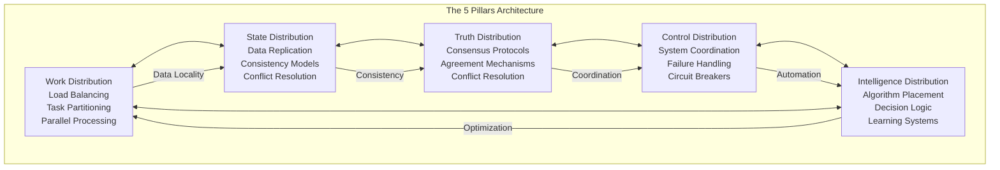
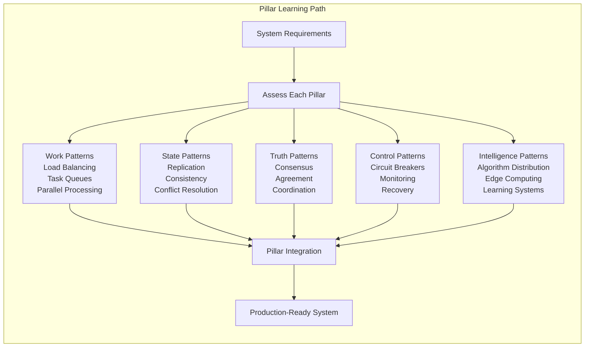
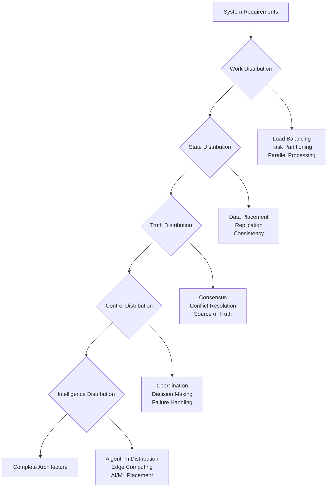

# The 5 Core Pillars of Distribution

## 1. The Complete Blueprint

The 5 pillars represent the complete architecture of any distributed system. Think of them as the structural elements of a building - you need all five working together to create something stable and scalable. Work distribution spreads computational load across nodes, state distribution manages data placement and consistency, truth distribution establishes consensus and agreement, control distribution coordinates system behavior and failure handling, and intelligence distribution places algorithms and decision-making logic optimally. Together, these pillars transform the chaotic complexity of distributed systems into manageable, designable components.



> **What You'll Master**: Complete distributed system design, understanding trade-offs, preventing common failure modes, scaling systems predictably, and building antifragile architectures.

## 2. The Core Mental Model

**The Construction Site Analogy**: Building a distributed system is like managing a massive construction project across multiple cities. You need to distribute work among teams (work distribution), coordinate shared resources like materials and blueprints (state distribution), establish decision-making authority and conflict resolution (truth distribution), maintain safety protocols and emergency procedures (control distribution), and optimize expertise placement and communication patterns (intelligence distribution).

**The Fundamental Principle**: *Every distributed system is really five systems working together - and the connections between them determine success or failure.*

Why this matters:
- **Holistic Design**: You can't optimize one pillar without affecting the others
- **Failure Prevention**: Most outages happen at pillar intersections, not within pillars
- **Scalable Architecture**: Understanding pillar interactions predicts how your system will behave at scale

## 3. The Journey Ahead



**Pattern Interconnections:**
- **Work + State** = Data locality decisions and caching strategies
- **State + Truth** = Consistency models and conflict resolution mechanisms  
- **Truth + Control** = Consensus protocols and failure detection systems
- **Control + Intelligence** = Autonomous systems and self-healing architectures
- **Intelligence + Work** = Adaptive load balancing and predictive scaling

**Common Pillar Combinations:**
- **Web Applications**: Work + State (focus on load balancing and data consistency)
- **Microservices**: All Five (comprehensive distributed architecture)
- **Data Pipelines**: Work + Intelligence (distributed processing with smart routing)
- **IoT Systems**: Control + Intelligence (edge computing with centralized coordination)
- **Financial Systems**: State + Truth (strong consistency with distributed consensus)

## The Pillars

1. **[Work Distribution](work-distribution.md)** - Intelligently spreading computational tasks across nodes to maximize throughput and minimize latency while handling failures gracefully

2. **[State Distribution](state-distribution.md)** - Managing data placement, replication, and consistency across distributed nodes while handling network partitions and conflicts

3. **[Truth Distribution](truth-distribution.md)** - Establishing consensus and agreement mechanisms across distributed nodes when there's no single source of truth

4. **[Control Distribution](control-distribution.md)** - Coordinating system behavior, handling failures, and maintaining operational control across distributed components

5. **[Intelligence Distribution](intelligence-distribution.md)** - Optimally placing algorithms, decision-making logic, and learning systems across distributed infrastructure

## Key Concepts

Each pillar addresses critical questions:

### Work Distribution
- How do we partition tasks?
- How do we balance load?
- How do we handle stragglers?

### State Distribution
- Where does data live?
- How is it replicated?
- How do we handle conflicts?

### Truth Distribution
- What is the source of truth?
- How do we achieve consensus?
- What consistency guarantees do we provide?

### Control Distribution
- Who makes decisions?
- How are actions coordinated?
- What happens during partitions?

### Intelligence Distribution
- Where does logic execute?
- How do we distribute algorithms?
- How do we aggregate insights?

## Pillar Interactions

The pillars are interdependent:
- **Work + State** = Data locality decisions
- **State + Truth** = Consistency models
- **Truth + Control** = Consensus protocols
- **Control + Intelligence** = Autonomous systems
- **All Five** = Complete distributed system

## Getting Started

### Pillar Assessment Framework

When designing a distributed system, systematically address each pillar:



### Design Checklist

For each system component, verify:

**Work Distribution**
- [ ] Tasks are properly partitioned
- [ ] Load balancing strategy is defined
- [ ] Failure handling for work redistribution

**State Distribution**
- [ ] Data placement strategy is clear
- [ ] Consistency requirements are specified
- [ ] Replication and backup plans exist

**Truth Distribution**
- [ ] Source of truth is identified
- [ ] Conflict resolution mechanisms exist
- [ ] Consensus protocols are chosen

**Control Distribution**
- [ ] Decision-making hierarchy is defined
- [ ] Coordination protocols are established
- [ ] Failure detection and recovery plans

**Intelligence Distribution**
- [ ] Logic placement is optimized
- [ ] Algorithm distribution is considered
- [ ] Edge vs. centralized processing decisions

### Common Patterns by Use Case

| Use Case | Primary Pillars | Key Patterns |
|----------|----------------|--------------|
| Web Application | Work + State | Load balancing, database replication |
| Microservices | All Five | Service mesh, event sourcing, CQRS |
| Data Pipeline | Work + Intelligence | Stream processing, distributed computing |
| IoT System | Control + Intelligence | Edge computing, hierarchical control |
| Financial System | Truth + State | Strong consistency, distributed transactions |

## Implementation Examples

### E-commerce Platform
```yaml
work_distribution:
  - api_gateway: "Route requests by service type"
  - load_balancer: "Distribute across service instances"
  - async_processing: "Queue-based order processing"

state_distribution:
  - user_data: "Sharded by user ID"
  - product_catalog: "Replicated globally"
  - inventory: "Partitioned by warehouse"

truth_distribution:
  - inventory_count: "Single source per warehouse"
  - order_status: "Event sourcing with projections"
  - user_preferences: "Eventually consistent"

control_distribution:
  - circuit_breakers: "Service-level failure handling"
  - rate_limiting: "API protection mechanisms"
  - auto_scaling: "Resource adjustment policies"

intelligence_distribution:
  - recommendations: "Pre-computed and cached"
  - fraud_detection: "Real-time scoring at edge"
  - pricing: "Dynamic algorithms with central coordination"
```

## Related Resources

### Core Principles
- [7 Laws of Distribution](../laws/index.md) - Fundamental constraints
- [Excellence Framework](../../excellence/framework-overview.md) - Implementation quality

### Pattern Library
- [Microservices Architecture](../../pattern-library/architecture/microservices.md)
- [Event-Driven Systems](../../pattern-library/messaging/event-driven.md)
- [Distributed Data Management](../../pattern-library/data-management/distributed-data.md)

### Case Studies
- [Netflix Microservices](../../architects-handbook/case-studies/social-communication/netflix-microservices.md)
- [Amazon DynamoDB](../../architects-handbook/case-studies/databases/amazon-dynamo.md)
- [Google Spanner](../../architects-handbook/case-studies/databases/google-spanner.md)

---

*Begin with [Work Distribution](work-distribution.md) to understand how to effectively divide computational tasks across your system.*