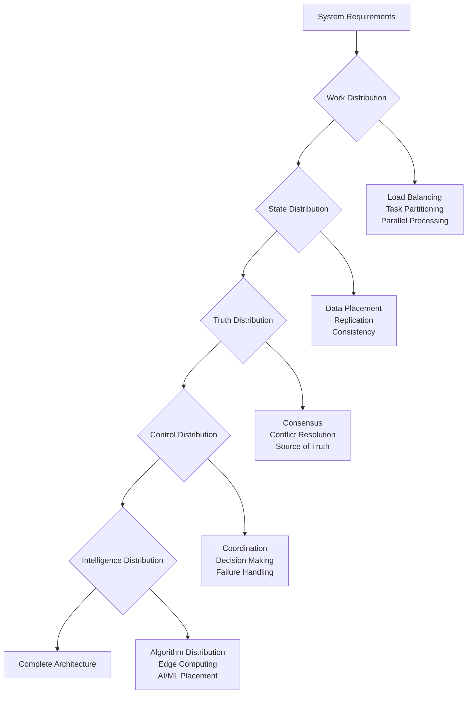

# The 5 Core Pillars

Foundational concepts for organizing distributed solutions.

## Table of Contents

1. [Overview](#overview)
2. [The Pillars](#the-pillars)
3. [Key Concepts](#key-concepts)
4. [Pillar Interactions](#pillar-interactions)
5. [Getting Started](#getting-started)
6. [Related Resources](#related-resources)

## Overview

While the [7 Laws of Distribution](../laws/index.md) tell us what we cannot do, the 5 Pillars guide us in what we should do. Each pillar represents a fundamental aspect of distribution that must be addressed in any distributed system.

### Core Philosophy
The pillars provide a mental model for approaching distributed system design:
- **Systematic Coverage**: Ensure all aspects are considered
- **Design Trade-offs**: Understand the relationships between choices
- **Implementation Guidance**: Bridge theory to practice
- **Quality Gates**: Validate system completeness

## The Pillars

1. **[Work Distribution](work-distribution.md)** - How to divide and coordinate computational tasks
2. **[State Distribution](state-distribution.md)** - How to manage and replicate data across nodes
3. **[Truth Distribution](truth-distribution.md)** - How to achieve consensus and consistency
4. **[Control Distribution](control-distribution.md)** - How to coordinate actions and decisions
5. **[Intelligence Distribution](intelligence-distribution.md)** - How to distribute logic and decision-making

## Key Concepts

Each pillar addresses critical questions:

### Work Distribution
- How do we partition tasks?
- How do we balance load?
- How do we handle stragglers?

### State Distribution
- Where does data live?
- How is it replicated?
- How do we handle conflicts?

### Truth Distribution
- What is the source of truth?
- How do we achieve consensus?
- What consistency guarantees do we provide?

### Control Distribution
- Who makes decisions?
- How are actions coordinated?
- What happens during partitions?

### Intelligence Distribution
- Where does logic execute?
- How do we distribute algorithms?
- How do we aggregate insights?

## Pillar Interactions

The pillars are interdependent:
- **Work + State** = Data locality decisions
- **State + Truth** = Consistency models
- **Truth + Control** = Consensus protocols
- **Control + Intelligence** = Autonomous systems
- **All Five** = Complete distributed system

## Getting Started

### Pillar Assessment Framework

When designing a distributed system, systematically address each pillar:



### Design Checklist

For each system component, verify:

**Work Distribution**
- [ ] Tasks are properly partitioned
- [ ] Load balancing strategy is defined
- [ ] Failure handling for work redistribution

**State Distribution**
- [ ] Data placement strategy is clear
- [ ] Consistency requirements are specified
- [ ] Replication and backup plans exist

**Truth Distribution**
- [ ] Source of truth is identified
- [ ] Conflict resolution mechanisms exist
- [ ] Consensus protocols are chosen

**Control Distribution**
- [ ] Decision-making hierarchy is defined
- [ ] Coordination protocols are established
- [ ] Failure detection and recovery plans

**Intelligence Distribution**
- [ ] Logic placement is optimized
- [ ] Algorithm distribution is considered
- [ ] Edge vs. centralized processing decisions

### Common Patterns by Use Case

| Use Case | Primary Pillars | Key Patterns |
|----------|----------------|--------------|
| Web Application | Work + State | Load balancing, database replication |
| Microservices | All Five | Service mesh, event sourcing, CQRS |
| Data Pipeline | Work + Intelligence | Stream processing, distributed computing |
| IoT System | Control + Intelligence | Edge computing, hierarchical control |
| Financial System | Truth + State | Strong consistency, distributed transactions |

## Implementation Examples

### E-commerce Platform
```yaml
work_distribution:
  - api_gateway: "Route requests by service type"
  - load_balancer: "Distribute across service instances"
  - async_processing: "Queue-based order processing"

state_distribution:
  - user_data: "Sharded by user ID"
  - product_catalog: "Replicated globally"
  - inventory: "Partitioned by warehouse"

truth_distribution:
  - inventory_count: "Single source per warehouse"
  - order_status: "Event sourcing with projections"
  - user_preferences: "Eventually consistent"

control_distribution:
  - circuit_breakers: "Service-level failure handling"
  - rate_limiting: "API protection mechanisms"
  - auto_scaling: "Resource adjustment policies"

intelligence_distribution:
  - recommendations: "Pre-computed and cached"
  - fraud_detection: "Real-time scoring at edge"
  - pricing: "Dynamic algorithms with central coordination"
```

## Related Resources

### Core Principles
- [7 Laws of Distribution](../laws/index.md) - Fundamental constraints
- [Excellence Framework](../../excellence/framework-overview.md) - Implementation quality

### Pattern Library
- [Microservices Architecture](../../pattern-library/architecture/microservices.md)
- [Event-Driven Systems](../../pattern-library/messaging/event-driven.md)
- [Distributed Data Management](../../pattern-library/data-management/distributed-data.md)

### Case Studies
- [Netflix Microservices](../../architects-handbook/case-studies/social-communication/netflix-microservices.md)
- [Amazon DynamoDB](../../architects-handbook/case-studies/databases/amazon-dynamo.md)
- [Google Spanner](../../architects-handbook/case-studies/databases/google-spanner.md)

---

*Begin with [Work Distribution](work-distribution.md) to understand how to effectively divide computational tasks across your system.*