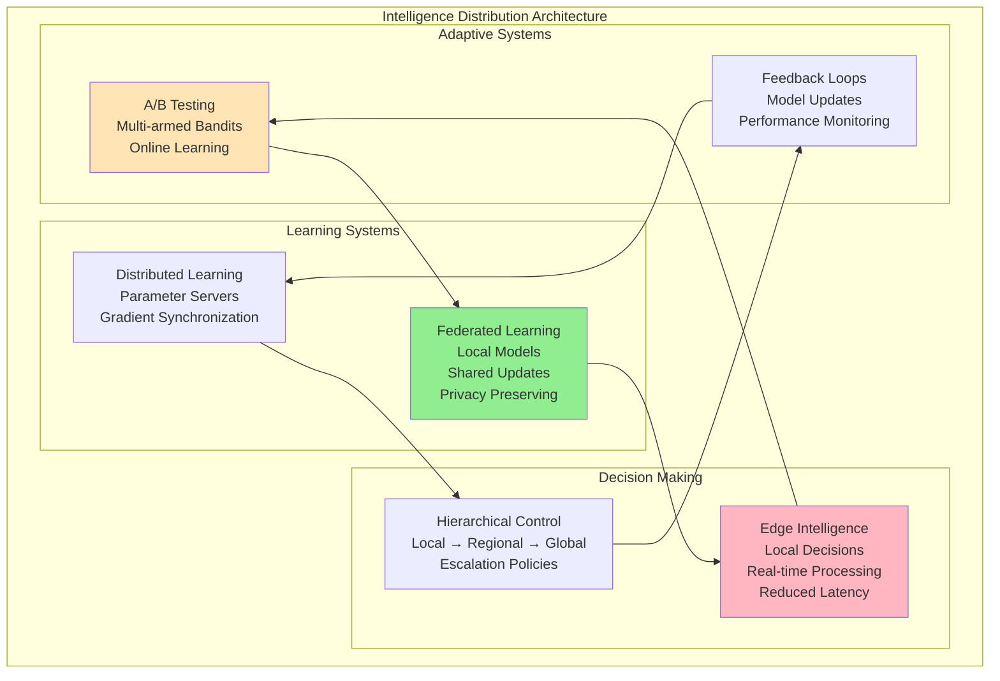
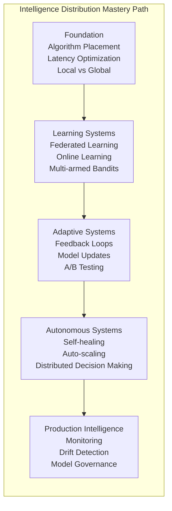
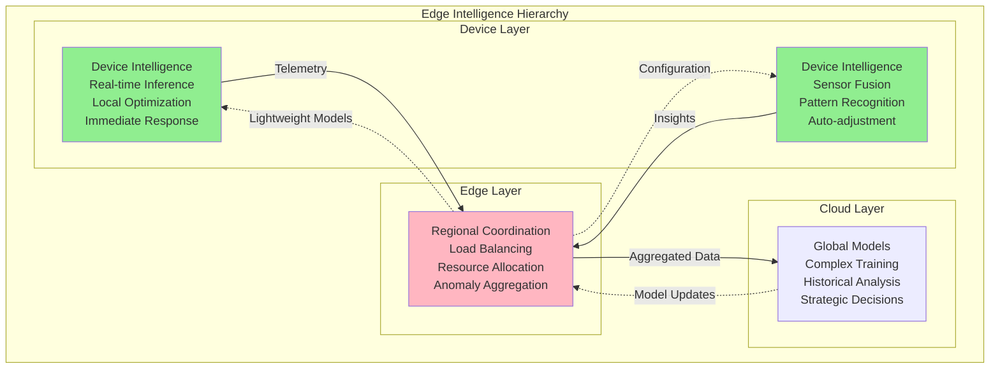
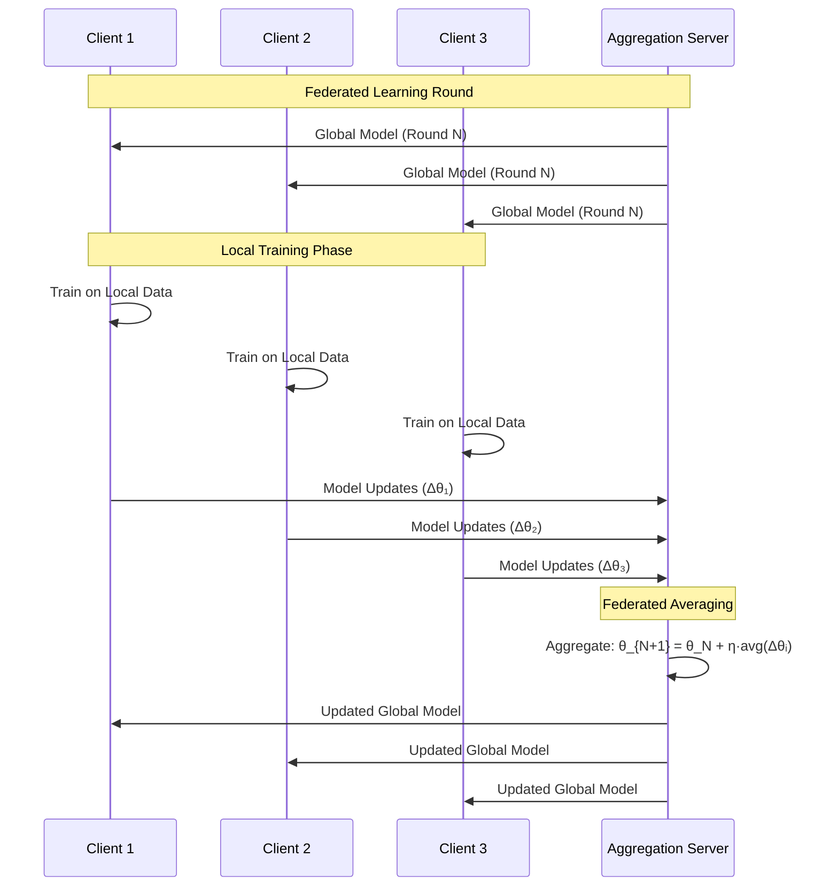
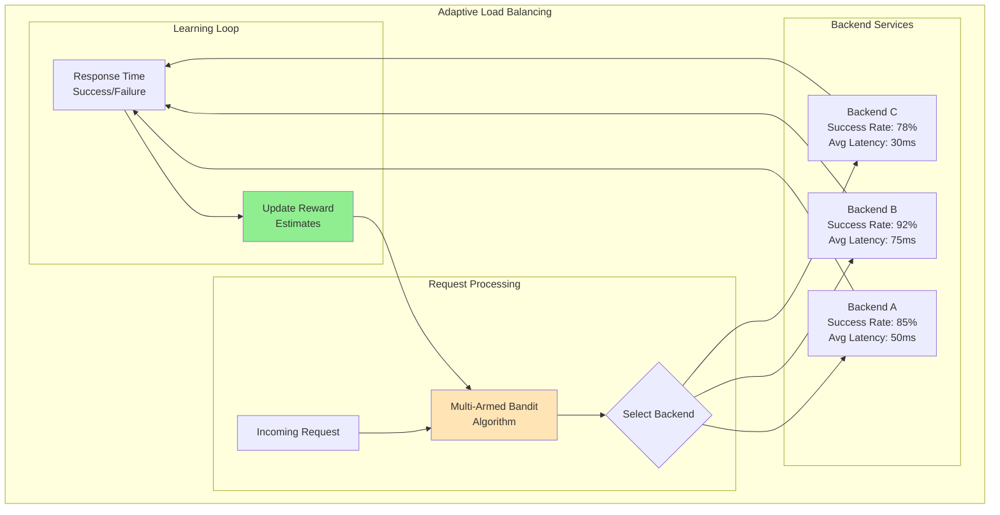

# Pillar 5: Intelligence Distribution

## 1. The Complete Blueprint

Intelligence distribution in distributed systems involves strategically placing algorithms, decision-making logic, and learning systems across infrastructure to optimize performance, reduce latency, and enable autonomous operation. At its core, we use edge computing to bring computation closer to data sources, distributed machine learning to enable collaborative learning without centralizing data, adaptive algorithms that learn and adjust to local conditions, federated systems that maintain privacy while sharing intelligence, and hierarchical decision-making that balances global coordination with local autonomy. These patterns work together to create systems that can learn from experience, adapt to changing conditions, make intelligent decisions at multiple scales, and operate effectively even when disconnected from central coordination.



> **What You'll Master**: Designing systems where intelligence operates at multiple levels, implementing learning algorithms that work across distributed nodes, creating feedback loops that improve system performance over time, building decision-making architectures that balance autonomy with coordination, and optimizing algorithm placement for latency and resource efficiency.

## 2. The Core Mental Model

**The Corporate Hierarchy Analogy**: Intelligence distribution is like running a multinational corporation with offices worldwide. You have local managers making day-to-day decisions (edge intelligence), regional directors coordinating across areas (hierarchical control), a central strategy team learning from all regions (federated learning), and feedback systems that help the entire organization improve (adaptive algorithms). The key is knowing what decisions can be made locally versus what needs global coordination, and how to share knowledge without compromising competitive advantages.

**The Fundamental Principle**: *Intelligence distribution is about placing the right algorithms at the right locations to make the right decisions with the right data at the right time.*

Why this matters in practice:
- **Latency kills intelligence** - a perfect algorithm is useless if it takes too long to respond
- **Feedback loops can create or destroy value** - intelligent systems that learn from their own outputs can either improve rapidly or spiral into dysfunction
- **Edge intelligence reduces bandwidth** - processing data locally eliminates the need to transmit raw data to central systems

## 3. The Journey Ahead



**Pattern Interconnections:**
- **Edge Computing + Machine Learning** = Real-time intelligent responses at low latency
- **Federated Learning + Privacy** = Collaborative intelligence without data sharing
- **A/B Testing + Multi-armed Bandits** = Continuous optimization with statistical rigor
- **Hierarchical Control + Local Autonomy** = Scalable decision-making architectures

**Common Intelligence Anti-Patterns:**
- **Centralized Bottlenecks**: All decisions require central approval, creating latency and single points of failure
- **Feedback Loops**: Models learn from their own biased outputs, creating self-reinforcing errors
- **Data Leakage**: Training models on future information that won't be available at inference time
- **Model Drift**: Deployed models become stale as real-world conditions change

## Core Intelligence Distribution Patterns

### Pattern 1: Edge Intelligence Architecture



### Pattern 2: Federated Learning Implementation



### Pattern 3: Multi-Armed Bandit for Load Balancing



## Real-World Examples

### Google: Federated Learning for Mobile Keyboards

Google uses federated learning to improve Gboard without accessing user data:

```python
# Federated learning for next-word prediction
class FederatedKeyboard:
    def __init__(self):
        self.local_model = LanguageModel()
        self.global_model_version = 0
        
    def train_locally(self, user_typing_data):
        """Train on local user data without sending it to servers"""
        for sentence in user_typing_data:
            self.local_model.update(sentence)
    
    def compute_model_update(self):
        """Compute difference between local and global model"""
        return self.local_model.parameters - self.global_parameters
    
    def apply_global_update(self, aggregated_update):
        """Apply federated averaging result"""
        self.global_parameters += aggregated_update
        self.global_model_version += 1
```

**Results**: Improved typing predictions while keeping all user data on-device, reduced server bandwidth by 10x, and enabled personalization without privacy compromise.

### Netflix: Multi-Armed Bandits for Recommendations  

Netflix uses contextual bandits to optimize content recommendations:

```python
class NetflixRecommendationBandit:
    def __init__(self, content_catalog):
        self.content_arms = content_catalog
        self.user_contexts = {}
        self.arm_rewards = defaultdict(list)
        
    def select_content(self, user_id, context):
        """Select content using Thompson Sampling"""
        user_profile = self.get_user_context(user_id, context)
        
        # Sample from posterior distributions
        arm_samples = {}
        for content_id in self.content_arms:
            prior_rewards = self.arm_rewards[content_id]
            # Beta distribution for click-through rates
            alpha = sum(prior_rewards) + 1
            beta = len(prior_rewards) - sum(prior_rewards) + 1
            arm_samples[content_id] = beta_sample(alpha, beta)
        
        # Select highest sampled content
        return max(arm_samples.items(), key=lambda x: x[1])[0]
    
    def update_reward(self, user_id, content_id, watched):
        """Update model with user feedback"""
        reward = 1 if watched > 0.7 else 0  # Watched >70% of content
        self.arm_rewards[content_id].append(reward)
```

**Results**: 25% increase in viewer engagement, automatic adaptation to trending content, and personalized recommendations without explicit user feedback.

### Tesla: Hierarchical Intelligence for Autopilot

Tesla's Full Self-Driving uses hierarchical intelligence from sensors to fleet learning:

```yaml
# Tesla's intelligence hierarchy
vehicle_layer:
  sensors: [cameras, radar, ultrasonic, GPS]
  processing: 
    - real_time_inference: <10ms
    - local_path_planning: <100ms
    - obstacle_detection: <50ms
  autonomy: full_driving_decisions

fleet_layer:
  aggregation:
    - shadow_mode_data: anonymized_driving_scenarios
    - edge_case_collection: unusual_situations
    - performance_metrics: safety_and_comfort_scores
  
cloud_layer:
  training:
    - neural_network_updates: monthly_releases
    - simulation_validation: millions_of_scenarios
    - safety_verification: regulatory_compliance
```

**Results**: Continuous improvement from fleet data, over-the-air updates to all vehicles, and reduced accidents through shared learning.

## Intelligence Anti-Patterns

### Anti-Pattern 1: Centralized Decision Bottleneck

```python
# WRONG: All decisions go through central service
class CentralizedIntelligence:
    def make_decision(self, request):
        # Network call for every decision
        response = self.central_ai_service.predict(request)
        return response  # 100ms+ latency
        
# RIGHT: Hierarchical decision making
class HierarchicalIntelligence:
    def make_decision(self, request):
        # Try local decision first
        if self.can_decide_locally(request):
            return self.local_model.predict(request)  # <1ms
        
        # Escalate to regional if needed
        if self.can_decide_regionally(request):
            return self.regional_model.predict(request)  # <10ms
            
        # Only escalate to central for complex cases
        return self.central_model.predict(request)  # 100ms+
```

### Anti-Pattern 2: Feedback Loop Amplification

```python
# WRONG: Model learns from its own biased outputs
class BiasedLearning:
    def update_model(self):
        # Model predicts user preferences
        recommendations = self.model.predict(users)
        
        # Users only see recommended content
        user_interactions = self.get_interactions(recommendations)
        
        # Model learns that only recommended content is good
        self.model.train(user_interactions)  # Feedback loop!
        
# RIGHT: Break feedback loops with exploration
class ExplorationLearning:
    def update_model(self):
        # Mix model recommendations with random exploration
        recommendations = self.model.predict(users)
        random_content = self.sample_random_content()
        
        # Show both to users (epsilon-greedy)
        mixed_content = self.mix(recommendations, random_content, epsilon=0.1)
        user_interactions = self.get_interactions(mixed_content)
        
        # Learn from unbiased data
        self.model.train(user_interactions)
```

## Implementation Patterns

### Pattern: Circuit Breaker for ML Models

```python
class MLCircuitBreaker:
    def __init__(self, failure_threshold=0.5, timeout=30):
        self.failure_rate = 0.0
        self.state = "CLOSED"  # CLOSED, OPEN, HALF_OPEN
        self.failure_threshold = failure_threshold
        self.timeout = timeout
        self.last_failure_time = 0
        
    def call_model(self, model_func, fallback_func, *args):
        if self.state == "OPEN":
            if time.time() - self.last_failure_time > self.timeout:
                self.state = "HALF_OPEN"
            else:
                return fallback_func(*args)  # Use simple fallback
        
        try:
            result = model_func(*args)
            if self.state == "HALF_OPEN":
                self.state = "CLOSED"
                self.failure_rate = 0.0
            return result
            
        except ModelException:
            self.failure_rate = 0.9 * self.failure_rate + 0.1  # Exponential average
            
            if self.failure_rate > self.failure_threshold:
                self.state = "OPEN"
                self.last_failure_time = time.time()
            
            return fallback_func(*args)
```

### Pattern: Model Versioning and A/B Testing

```python
class ModelVersionManager:
    def __init__(self):
        self.models = {}
        self.traffic_split = {}
        self.performance_metrics = defaultdict(list)
        
    def deploy_model(self, model_id, model, traffic_percentage):
        """Deploy a new model version with traffic splitting"""
        self.models[model_id] = model
        self.traffic_split[model_id] = traffic_percentage
        
    def predict(self, user_id, features):
        """Route prediction to appropriate model version"""
        model_id = self.select_model_for_user(user_id)
        
        start_time = time.time()
        prediction = self.models[model_id].predict(features)
        latency = time.time() - start_time
        
        # Track performance metrics
        self.performance_metrics[model_id].append({
            'latency': latency,
            'prediction': prediction,
            'timestamp': time.time()
        })
        
        return prediction, model_id
    
    def select_model_for_user(self, user_id):
        """Consistent hash-based traffic splitting"""
        hash_value = hash(user_id) % 100
        cumulative = 0
        
        for model_id, percentage in self.traffic_split.items():
            cumulative += percentage
            if hash_value < cumulative:
                return model_id
                
        return list(self.models.keys())[0]  # Fallback
```

## Production Readiness Checklist

```yaml
□ ALGORITHM PLACEMENT
  ├─ □ Identify latency requirements per decision type
  ├─ □ Map compute requirements to available resources  
  ├─ □ Design fallback strategies for model failures
  └─ □ Plan for model updates and versioning

□ LEARNING SYSTEMS
  ├─ □ Implement online learning with proper validation
  ├─ □ Add exploration to prevent feedback loops
  ├─ □ Design privacy-preserving learning where needed
  └─ □ Create model performance monitoring

□ OPERATIONAL INTELLIGENCE
  ├─ □ Monitor model drift and performance degradation
  ├─ □ Implement circuit breakers for ML services
  ├─ □ Add A/B testing framework for model comparison
  └─ □ Create automated model retraining pipelines

□ GOVERNANCE & SAFETY
  ├─ □ Implement model versioning and rollback
  ├─ □ Add bias detection and fairness metrics
  ├─ □ Create human oversight for critical decisions
  └─ □ Document decision logic and model behavior
```

## Key Takeaways

1. **Intelligence placement matters more than intelligence quality** - A simple algorithm in the right place beats a complex one in the wrong place

2. **Feedback loops are inevitable** - Design for them explicitly rather than hoping they won't happen

3. **Edge intelligence reduces everything** - Latency, bandwidth, privacy concerns, and dependency on central systems

4. **Learning systems need exploration** - Pure exploitation leads to local optima and feedback loops

5. **Hierarchical intelligence scales** - Local autonomy with global coordination enables both speed and consistency

## Related Topics

- [Work Distribution](work-distribution.md) - How intelligence placement affects computational load distribution
- [Control Distribution](control-distribution.md) - Coordination between intelligent systems
- [Pattern: Multi-Armed Bandits](../../pattern-library/ml-infrastructure/model-serving-scale.md) - Online optimization algorithms
- [Pattern: Federated Learning](../../pattern-library/ml-infrastructure/distributed-training.md) - Privacy-preserving distributed learning

---

*"The smartest distributed system is not the one with the most sophisticated algorithms, but the one that makes the right decisions at the right time in the right place."*