# Pillar 5: Intelligence Distribution

## 1. The Complete Blueprint

Intelligence distribution in distributed systems involves strategically placing algorithms, decision-making logic, and learning systems across infrastructure to optimize performance, reduce latency, and enable autonomous operation. At its core, we use edge computing to bring computation closer to data sources, distributed machine learning to enable collaborative learning without centralizing data, adaptive algorithms that learn and adjust to local conditions, federated systems that maintain privacy while sharing intelligence, and hierarchical decision-making that balances global coordination with local autonomy. These patterns work together to create systems that can learn from experience, adapt to changing conditions, make intelligent decisions at multiple scales, and operate effectively even when disconnected from central coordination.

```mermaid
graph TB
    subgraph "Intelligence Distribution Architecture"
        subgraph "Learning Systems"
            FL[Federated Learning<br/>Local Models<br/>Shared Updates<br/>Privacy Preserving]
            DL[Distributed Learning<br/>Parameter Servers<br/>Gradient Synchronization]
        end
        
        subgraph "Decision Making"
            Edge[Edge Intelligence<br/>Local Decisions<br/>Real-time Processing<br/>Reduced Latency]
            Hierarchical[Hierarchical Control<br/>Local → Regional → Global<br/>Escalation Policies]
        end
        
        subgraph "Adaptive Systems"
            AB[A/B Testing<br/>Multi-armed Bandits<br/>Online Learning]
            Feedback[Feedback Loops<br/>Model Updates<br/>Performance Monitoring]
        end
        
        FL --> Edge
        DL --> Hierarchical
        Edge --> AB
        Hierarchical --> Feedback
        AB --> FL
        Feedback --> DL
        
        style FL fill:#90EE90
        style Edge fill:#FFB6C1
        style AB fill:#FFE4B5
    end
```



> **What You'll Master**: Designing systems where intelligence operates at multiple levels, implementing learning algorithms that work across distributed nodes, creating feedback loops that improve system performance over time, building decision-making architectures that balance autonomy with coordination, and optimizing algorithm placement for latency and resource efficiency.

## 2. The Core Mental Model

**The Corporate Hierarchy Analogy**: Intelligence distribution is like running a multinational corporation with offices worldwide. You have local managers making day-to-day decisions (edge intelligence), regional directors coordinating across areas (hierarchical control), a central strategy team learning from all regions (federated learning), and feedback systems that help the entire organization improve (adaptive algorithms). The key is knowing what decisions can be made locally versus what needs global coordination, and how to share knowledge without compromising competitive advantages.

**The Fundamental Principle**: *Intelligence distribution is about placing the right algorithms at the right locations to make the right decisions with the right data at the right time.*

Why this matters in practice:
- **Latency kills intelligence** - a perfect algorithm is useless if it takes too long to respond
- **Feedback loops can create or destroy value** - intelligent systems that learn from their own outputs can either improve rapidly or spiral into dysfunction
- **Edge intelligence reduces bandwidth** - processing data locally eliminates the need to transmit raw data to central systems

## 3. The Journey Ahead


**Pattern Interconnections:**
- **Edge Computing + Machine Learning** = Real-time intelligent responses at low latency
- **Federated Learning + Privacy** = Collaborative intelligence without data sharing
- **A/B Testing + Multi-armed Bandits** = Continuous optimization with statistical rigor
- **Hierarchical Control + Local Autonomy** = Scalable decision-making architectures

**Common Intelligence Anti-Patterns:**
- **Centralized Bottlenecks**: All decisions require central approval, creating latency and single points of failure
- **Feedback Loops**: Models learn from their own biased outputs, creating self-reinforcing errors
- **Data Leakage**: Training models on future information that won't be available at inference time
- **Model Drift**: Deployed models become stale as real-world conditions change

## Core Challenges and Technical Deep Dive

### Challenge 1: The Latency vs. Intelligence Trade-off

Intelligent systems face a fundamental trade-off: sophisticated algorithms require more data and computation, but adding latency kills the value of intelligence.


**Mathematical Model for Intelligence Placement:**

```python
class IntelligenceLatencyOptimizer:
    def __init__(self):
        self.latency_targets = {
            'real_time_trading': 1,      # 1ms
            'ad_targeting': 50,          # 50ms
            'recommendation': 100,        # 100ms
            'fraud_detection': 200,      # 200ms
            'analytics': 60000           # 1 minute
        }
        
    def optimize_intelligence_placement(self, use_case, accuracy_requirement, data_freshness_need):
        """Determine optimal intelligence placement strategy"""
        
        latency_budget = self.latency_targets[use_case]
        
        # Calculate intelligence complexity budget
        complexity_budget = self.calculate_complexity_budget(
            latency_budget=latency_budget,
            accuracy_requirement=accuracy_requirement,
            data_freshness=data_freshness_need
        )
        
        placement_options = []
        
        # Local processing option
        local_option = {
            'location': 'local',
            'latency_ms': 5,
            'max_complexity': complexity_budget * 0.1,
            'accuracy_estimate': accuracy_requirement * 0.85,
            'cost_per_inference': 0.0001,
            'data_freshness': 'real_time'
        }
        
        # Edge processing option
        edge_option = {
            'location': 'edge',
            'latency_ms': 25,
            'max_complexity': complexity_budget * 0.4,
            'accuracy_estimate': accuracy_requirement * 0.92,
            'cost_per_inference': 0.001,
            'data_freshness': 'near_real_time'
        }
        
        # Cloud processing option
        cloud_option = {
            'location': 'cloud',
            'latency_ms': 150,
            'max_complexity': complexity_budget * 1.0,
            'accuracy_estimate': accuracy_requirement * 0.98,
            'cost_per_inference': 0.01,
            'data_freshness': 'batch_updated'
        }
        
        # Filter options that meet requirements
        viable_options = []
        for option in [local_option, edge_option, cloud_option]:
            if (option['latency_ms'] <= latency_budget and 
                option['accuracy_estimate'] >= accuracy_requirement):
                viable_options.append(option)
        
        if not viable_options:
            return {
                'recommendation': 'requirements_impossible',
                'reason': 'No placement can meet latency and accuracy requirements',
                'suggestions': self.generate_requirement_relaxation_suggestions()
            }
        
        # Select optimal option (minimize cost while meeting requirements)
        optimal_option = min(viable_options, key=lambda x: x['cost_per_inference'])
        
        return {
            'recommendation': optimal_option,
            'alternatives': [opt for opt in viable_options if opt != optimal_option],
            'cost_analysis': self.calculate_cost_analysis(viable_options)
        }
```

### Challenge 2: Scalability Boundaries of Intelligent Systems

Intelligent systems have unique scalability characteristics that differ from traditional distributed systems.

```yaml
# Intelligence system scalability boundaries
scalability_analysis:
  model_serving:
    linear_scaling_limit: 1000  # requests/second per node
    bottlenecks:
      - gpu_memory_bandwidth
      - model_size_vs_batch_size_tradeoff
      - feature_extraction_overhead
    
  training_systems:
    data_parallel_limit: 1000   # workers (communication overhead dominates)
    model_parallel_limit: 64    # GPUs (memory bandwidth limits)
    bottlenecks:
      - gradient_synchronization_overhead
      - parameter_server_bandwidth
      - stragglers_in_distributed_training
    
  inference_pipelines:
    throughput_limit: 100000    # inferences/second
    latency_limit: 1           # millisecond (speed of light + compute)
    bottlenecks:
      - feature_store_lookup_latency
      - model_ensemble_overhead
      - result_post_processing
    
  online_learning:
    update_frequency_limit: 1000  # updates/second
    concept_drift_adaptation: 3600  # seconds to adapt
    bottlenecks:
      - incremental_learning_stability
      - catastrophic_forgetting
      - model_consistency_across_nodes
```

### Challenge 3: The Intelligence Feedback Loop Paradox

Intelligent systems can create their own data, leading to feedback loops that either improve or degrade performance over time.

```python
class FeedbackLoopAnalyzer:
    def __init__(self):
        self.loop_types = {
            'positive_reinforcement': {
                'description': 'System learns from successful predictions',
                'risk': 'Overfitting to current patterns',
                'mitigation': 'Exploration strategies, diverse data sources'
            },
            'negative_feedback': {
                'description': 'System learns from mistakes and corrects',
                'risk': 'Oscillation and instability',
                'mitigation': 'Damping factors, gradual updates'
            },
            'confirmation_bias': {
                'description': 'System reinforces existing biases',
                'risk': 'Algorithmic discrimination, filter bubbles',
                'mitigation': 'Fairness constraints, diverse training data'
            },
            'distribution_shift': {
                'description': 'System changes underlying data distribution',
                'risk': 'Model performance degradation',
                'mitigation': 'Drift detection, model retraining'
            }
        }
    
    def analyze_feedback_stability(self, system_metrics, time_window_days=30):
        """Analyze feedback loop stability over time"""
        
        # Detect feedback loop patterns
        feedback_indicators = {
            'prediction_consistency': self.calculate_prediction_consistency(system_metrics),
            'performance_trend': self.calculate_performance_trend(system_metrics, time_window_days),
            'data_distribution_drift': self.detect_distribution_drift(system_metrics),
            'user_behavior_changes': self.analyze_user_behavior_changes(system_metrics)
        }
        
        # Classify feedback loop type
        dominant_loop_type = self.classify_feedback_loop(feedback_indicators)
        
        # Calculate stability score
        stability_score = self.calculate_stability_score(feedback_indicators)
        
        # Generate recommendations
        recommendations = self.generate_stability_recommendations(
            dominant_loop_type, 
            stability_score,
            feedback_indicators
        )
        
        return {
            'stability_score': stability_score,  # 0-1, higher is more stable
            'dominant_loop_type': dominant_loop_type,
            'feedback_indicators': feedback_indicators,
            'risk_level': 'low' if stability_score > 0.8 else 'medium' if stability_score > 0.6 else 'high',
            'recommendations': recommendations
        }
```

## Comprehensive Techniques & Patterns

### Pattern 1: Hierarchical Edge Intelligence Architecture


### Pattern 2: Federated Learning Implementation

```mermaid
sequenceDiagram
    participant Client1 as Client 1
    participant Client2 as Client 2
    participant Client3 as Client 3
    participant Server as Aggregation Server
    
    Note over Client1,Server: Federated Learning Round
    
    Server->>Client1: Global Model (Round N)
    Server->>Client2: Global Model (Round N)
    Server->>Client3: Global Model (Round N)
    
    Note over Client1,Client3: Local Training Phase
    
    Client1->>Client1: Train on Local Data
    Client2->>Client2: Train on Local Data  
    Client3->>Client3: Train on Local Data
    
    Client1->>Server: Model Updates (Δθ₁)
    Client2->>Server: Model Updates (Δθ₂)
    Client3->>Server: Model Updates (Δθ₃)
    
    Note over Server: Federated Averaging
    Server->>Server: Aggregate: θ_{N+1} = θ_N + η·avg(Δθᵢ)
    
    Server->>Client1: Updated Global Model
    Server->>Client2: Updated Global Model
    Server->>Client3: Updated Global Model
```



### Pattern 3: Multi-Armed Bandit for Load Balancing


## Core Challenges and Technical Deep Dive

### Challenge 1: Latency vs. Accuracy Trade-offs

Intelligence distribution must balance model accuracy against response time requirements:


**Performance Benchmarks by Placement:**

| Placement | Latency | Accuracy | Bandwidth | Availability | Cost/Request |
|-----------|---------|----------|-----------|--------------|-------------|
| **Edge Device** | 1-5ms | 85-95% | 0KB | 99.99% | $0.0001 |
| **Edge Server** | 5-20ms | 90-97% | 1-10KB | 99.9% | $0.001 |
| **Regional Cloud** | 20-100ms | 95-99% | 10-100KB | 99.95% | $0.01 |
| **Global Cloud** | 100-500ms | 98-99.9% | 100KB-1MB | 99.99% | $0.1 |

### Challenge 2: Model Synchronization and Drift

Distributed models diverge over time as they learn from different data distributions:

```python
class ModelDriftDetector:
    def __init__(self, reference_model):
        self.reference_model = reference_model
        self.drift_threshold = 0.05  # 5% accuracy degradation
        self.performance_history = []
        
    def detect_drift(self, local_model, validation_data):
        """Detect when local model has drifted from reference"""
        reference_accuracy = self.reference_model.evaluate(validation_data)
        local_accuracy = local_model.evaluate(validation_data)
        
        drift_magnitude = abs(reference_accuracy - local_accuracy)
        
        if drift_magnitude > self.drift_threshold:
            return {
                'drift_detected': True,
                'drift_magnitude': drift_magnitude,
                'recommended_action': 'resync_with_global_model',
                'confidence': self.calculate_confidence(drift_magnitude)
            }
        
        return {'drift_detected': False}
    
    def calculate_model_similarity(self, model_a, model_b):
        """Calculate similarity between two models using weight comparison"""
        similarity_scores = []
        
        for layer_a, layer_b in zip(model_a.layers, model_b.layers):
            weight_diff = np.linalg.norm(layer_a.weights - layer_b.weights)
            similarity = 1.0 / (1.0 + weight_diff)  # Inverse relationship
            similarity_scores.append(similarity)
        
        return np.mean(similarity_scores)
```

### Challenge 3: Privacy-Preserving Learning

Federated learning must maintain privacy while enabling effective learning:

```yaml
privacy_techniques:
  differential_privacy:
    method: "Add calibrated noise to gradients before sharing"
    privacy_budget: "ε = 1.0 (typical), lower = more private"
    accuracy_cost: "5-15% reduction in model accuracy"
    implementation: "Gaussian noise proportional to gradient sensitivity"
    
  secure_aggregation:
    method: "Encrypt individual updates, only decrypt aggregated result"
    privacy_guarantee: "Individual updates never visible to server"
    computational_cost: "2-3x overhead for cryptographic operations"
    fault_tolerance: "Works with subset of participants"
    
  homomorphic_encryption:
    method: "Compute on encrypted data without decrypting"
    privacy_guarantee: "Complete data privacy throughout computation"
    computational_cost: "100-1000x overhead"
    practical_use: "Limited to simple operations currently"
```

## Comprehensive Techniques & Patterns

### Pattern 1: Hierarchical Edge Intelligence


### Pattern 2: Federated Learning with Secure Aggregation

```mermaid
sequenceDiagram
    participant Client1 as Mobile Client 1
    participant Client2 as Mobile Client 2
    participant Client3 as Mobile Client 3
    participant Aggregator as FL Aggregator
    
    Note over Client1,Aggregator: Federated Learning Round with Privacy
    
    Aggregator->>Client1: Global Model v1.0 + Training Config
    Aggregator->>Client2: Global Model v1.0 + Training Config
    Aggregator->>Client3: Global Model v1.0 + Training Config
    
    Note over Client1,Client3: Local Training (Private Data Never Leaves Device)
    
    Client1->>Client1: Train on local data (1000 samples)
    Client2->>Client2: Train on local data (800 samples)
    Client3->>Client3: Train on local data (1200 samples)
    
    Client1->>Client1: Add differential privacy noise
    Client2->>Client2: Add differential privacy noise
    Client3->>Client3: Add differential privacy noise
    
    Client1->>Aggregator: Encrypted model updates (Δθ₁)
    Client2->>Aggregator: Encrypted model updates (Δθ₂)
    Client3->>Aggregator: Encrypted model updates (Δθ₃)
    
    Note over Aggregator: Secure Aggregation (Never Sees Individual Updates)
    
    Aggregator->>Aggregator: Decrypt aggregated result only
    Aggregator->>Aggregator: θ_new = θ_old + η·avg(Δθᵢ)
    
    Aggregator->>Client1: Global Model v1.1
    Aggregator->>Client2: Global Model v1.1
    Aggregator->>Client3: Global Model v1.1
```



## Real-World Examples

### Google: Federated Learning for Mobile Keyboards

Google uses federated learning to improve Gboard without accessing user data:

```python
# Federated learning for next-word prediction
class FederatedKeyboard:
    def __init__(self):
        self.local_model = LanguageModel()
        self.global_model_version = 0
        
    def train_locally(self, user_typing_data):
        """Train on local user data without sending it to servers"""
        for sentence in user_typing_data:
            self.local_model.update(sentence)
    
    def compute_model_update(self):
        """Compute difference between local and global model"""
        return self.local_model.parameters - self.global_parameters
    
    def apply_global_update(self, aggregated_update):
        """Apply federated averaging result"""
        self.global_parameters += aggregated_update
        self.global_model_version += 1
```

**Results**: Improved typing predictions while keeping all user data on-device, reduced server bandwidth by 10x, and enabled personalization without privacy compromise.

### Netflix: Multi-Armed Bandits for Recommendations  

Netflix uses contextual bandits to optimize content recommendations:

```python
class NetflixRecommendationBandit:
    def __init__(self, content_catalog):
        self.content_arms = content_catalog
        self.user_contexts = {}
        self.arm_rewards = defaultdict(list)
        
    def select_content(self, user_id, context):
        """Select content using Thompson Sampling"""
        user_profile = self.get_user_context(user_id, context)
        
        # Sample from posterior distributions
        arm_samples = {}
        for content_id in self.content_arms:
            prior_rewards = self.arm_rewards[content_id]
            # Beta distribution for click-through rates
            alpha = sum(prior_rewards) + 1
            beta = len(prior_rewards) - sum(prior_rewards) + 1
            arm_samples[content_id] = beta_sample(alpha, beta)
        
        # Select highest sampled content
        return max(arm_samples.items(), key=lambda x: x[1])[0]
    
    def update_reward(self, user_id, content_id, watched):
        """Update model with user feedback"""
        reward = 1 if watched > 0.7 else 0  # Watched >70% of content
        self.arm_rewards[content_id].append(reward)
```

**Results**: 25% increase in viewer engagement, automatic adaptation to trending content, and personalized recommendations without explicit user feedback.

### Tesla: Hierarchical Intelligence for Autopilot

Tesla's Full Self-Driving uses hierarchical intelligence from sensors to fleet learning:

```yaml
# Tesla's intelligence hierarchy
vehicle_layer:
  sensors: [cameras, radar, ultrasonic, GPS]
  processing: 
    - real_time_inference: <10ms
    - local_path_planning: <100ms
    - obstacle_detection: <50ms
  autonomy: full_driving_decisions

fleet_layer:
  aggregation:
    - shadow_mode_data: anonymized_driving_scenarios
    - edge_case_collection: unusual_situations
    - performance_metrics: safety_and_comfort_scores
  
cloud_layer:
  training:
    - neural_network_updates: monthly_releases
    - simulation_validation: millions_of_scenarios
    - safety_verification: regulatory_compliance
```

**Results**: Continuous improvement from fleet data, over-the-air updates to all vehicles, and reduced accidents through shared learning.

## Intelligence Anti-Patterns

### Anti-Pattern 1: Centralized Decision Bottleneck

```python
# WRONG: All decisions go through central service
class CentralizedIntelligence:
    def make_decision(self, request):
        # Network call for every decision
        response = self.central_ai_service.predict(request)
        return response  # 100ms+ latency
        
# RIGHT: Hierarchical decision making
class HierarchicalIntelligence:
    def make_decision(self, request):
        # Try local decision first
        if self.can_decide_locally(request):
            return self.local_model.predict(request)  # <1ms
        
        # Escalate to regional if needed
        if self.can_decide_regionally(request):
            return self.regional_model.predict(request)  # <10ms
            
        # Only escalate to central for complex cases
        return self.central_model.predict(request)  # 100ms+
```

### Anti-Pattern 2: Feedback Loop Amplification

```python
# WRONG: Model learns from its own biased outputs
class BiasedLearning:
    def update_model(self):
        # Model predicts user preferences
        recommendations = self.model.predict(users)
        
        # Users only see recommended content
        user_interactions = self.get_interactions(recommendations)
        
        # Model learns that only recommended content is good
        self.model.train(user_interactions)  # Feedback loop!
        
# RIGHT: Break feedback loops with exploration
class ExplorationLearning:
    def update_model(self):
        # Mix model recommendations with random exploration
        recommendations = self.model.predict(users)
        random_content = self.sample_random_content()
        
        # Show both to users (epsilon-greedy)
        mixed_content = self.mix(recommendations, random_content, epsilon=0.1)
        user_interactions = self.get_interactions(mixed_content)
        
        # Learn from unbiased data
        self.model.train(user_interactions)
```

## Implementation Patterns

### Pattern: Circuit Breaker for ML Models

```python
class MLCircuitBreaker:
    def __init__(self, failure_threshold=0.5, timeout=30):
        self.failure_rate = 0.0
        self.state = "CLOSED"  # CLOSED, OPEN, HALF_OPEN
        self.failure_threshold = failure_threshold
        self.timeout = timeout
        self.last_failure_time = 0
        
    def call_model(self, model_func, fallback_func, *args):
        if self.state == "OPEN":
            if time.time() - self.last_failure_time > self.timeout:
                self.state = "HALF_OPEN"
            else:
                return fallback_func(*args)  # Use simple fallback
        
        try:
            result = model_func(*args)
            if self.state == "HALF_OPEN":
                self.state = "CLOSED"
                self.failure_rate = 0.0
            return result
            
        except ModelException:
            self.failure_rate = 0.9 * self.failure_rate + 0.1  # Exponential average
            
            if self.failure_rate > self.failure_threshold:
                self.state = "OPEN"
                self.last_failure_time = time.time()
            
            return fallback_func(*args)
```

### Pattern: Model Versioning and A/B Testing

```python
class ModelVersionManager:
    def __init__(self):
        self.models = {}
        self.traffic_split = {}
        self.performance_metrics = defaultdict(list)
        
    def deploy_model(self, model_id, model, traffic_percentage):
        """Deploy a new model version with traffic splitting"""
        self.models[model_id] = model
        self.traffic_split[model_id] = traffic_percentage
        
    def predict(self, user_id, features):
        """Route prediction to appropriate model version"""
        model_id = self.select_model_for_user(user_id)
        
        start_time = time.time()
        prediction = self.models[model_id].predict(features)
        latency = time.time() - start_time
        
        # Track performance metrics
        self.performance_metrics[model_id].append({
            'latency': latency,
            'prediction': prediction,
            'timestamp': time.time()
        })
        
        return prediction, model_id
    
    def select_model_for_user(self, user_id):
        """Consistent hash-based traffic splitting"""
        hash_value = hash(user_id) % 100
        cumulative = 0
        
        for model_id, percentage in self.traffic_split.items():
            cumulative += percentage
            if hash_value < cumulative:
                return model_id
                
        return list(self.models.keys())[0]  # Fallback
```

## Production Readiness Checklist

```yaml
□ ALGORITHM PLACEMENT
  ├─ □ Identify latency requirements per decision type
  ├─ □ Map compute requirements to available resources  
  ├─ □ Design fallback strategies for model failures
  └─ □ Plan for model updates and versioning

□ LEARNING SYSTEMS
  ├─ □ Implement online learning with proper validation
  ├─ □ Add exploration to prevent feedback loops
  ├─ □ Design privacy-preserving learning where needed
  └─ □ Create model performance monitoring

□ OPERATIONAL INTELLIGENCE
  ├─ □ Monitor model drift and performance degradation
  ├─ □ Implement circuit breakers for ML services
  ├─ □ Add A/B testing framework for model comparison
  └─ □ Create automated model retraining pipelines

□ GOVERNANCE & SAFETY
  ├─ □ Implement model versioning and rollback
  ├─ □ Add bias detection and fairness metrics
  ├─ □ Create human oversight for critical decisions
  └─ □ Document decision logic and model behavior
```

## Key Takeaways

1. **Intelligence placement is more critical than algorithm sophistication** - A simple algorithm at the right location (edge) often outperforms complex algorithms with high latency (cloud)

2. **Feedback loops are mathematical certainties, not possibilities** - Design explicit exploration strategies, diverse data sources, and bias detection from day one

3. **Edge intelligence transforms system economics** - Reduces bandwidth costs by 10-100x, eliminates cloud dependency, and enables offline operation

4. **Hierarchical intelligence scales predictably** - Local autonomy (90% of decisions) + regional coordination (9%) + global oversight (1%) = scalable intelligent systems

5. **Model degradation is inevitable** - All ML models degrade over time due to data drift, concept drift, and distribution changes; continuous monitoring and retraining are operational necessities

6. **Privacy-preserving intelligence is becoming mandatory** - Federated learning, differential privacy, and secure aggregation are evolving from research topics to regulatory requirements

7. **Real-time intelligence requires real-time data** - Feature freshness often matters more than model sophistication; optimize your feature pipeline before optimizing your models

## Related Laws and Principles

<div class="admonition info">
    <p class="admonition-title">🔗 Related Laws</p>
    <div class="chips">
        <span class="chip chip-law">The Economics of Scale</span>
        <span class="chip chip-law">The Constraints of Time</span>
        <span class="chip chip-law">The Reality of Networks</span>
        <span class="chip chip-law">The Human Factor</span>
        <span class="chip chip-law">The Nature of Knowledge</span>
    </div>
</div>

### How Fundamental Laws Shape Intelligence Distribution

- **The Economics of Scale**: Computational resources are expensive and finite. The law drives edge computing to reduce cloud costs and the trade-off between model complexity and inference cost.

- **The Constraints of Time**: Real-time intelligence requires local processing. The law explains why simple edge models often outperform complex cloud models and drives the need for hierarchical intelligence.

- **The Reality of Networks**: Network latency and partitions affect distributed learning. The law drives federated learning patterns and the need for autonomous edge intelligence.

- **The Human Factor**: AI systems must be interpretable and controllable by humans. The law influences the design of human-in-the-loop systems and explainable AI at the edge.

- **The Nature of Knowledge**: Perfect global knowledge is unavailable in real-time. The law explains why distributed learning with partial information can outperform centralized approaches.

## Pillar-Specific Trade-offs

### Intelligence Placement Decision Matrix

| Factor | Edge Device | Edge Server | Regional Cloud | Global Cloud |
|--------|-------------|-------------|----------------|-------------|
| **Latency** | ✅ Excellent (<5ms) | ✅ Good (<20ms) | ⚠️ Fair (<100ms) | ❌ Poor (<500ms) |
| **Accuracy** | ❌ Limited (85-95%) | ⚠️ Good (90-97%) | ✅ High (95-99%) | ✅ Excellent (98-99.9%) |
| **Privacy** | ✅ Excellent (local) | ✅ Good (controlled) | ⚠️ Fair (regional) | ❌ Poor (centralized) |
| **Availability** | ✅ Excellent (99.99%) | ✅ Good (99.9%) | ⚠️ Fair (99.95%) | ⚠️ Fair (99.99%) |
| **Cost per Request** | ✅ Low ($0.0001) | ⚠️ Medium ($0.001) | ❌ High ($0.01) | ❌ Very High ($0.1) |
| **Model Complexity** | ❌ Limited | ⚠️ Medium | ✅ High | ✅ Unlimited |

### Privacy vs. Performance Trade-offs in Federated Learning

```python
class FederatedLearningTradeoffs:
    def __init__(self):
        self.privacy_levels = {
            'no_privacy': {
                'accuracy': 0.99,
                'training_time': 1.0,  # baseline
                'communication_cost': 1.0,
                'privacy_guarantee': 'None'
            },
            'differential_privacy': {
                'accuracy': 0.94,  # 5% accuracy loss
                'training_time': 1.2,  # 20% slower
                'communication_cost': 1.0,
                'privacy_guarantee': 'Statistical privacy (ε-differential privacy)'
            },
            'secure_aggregation': {
                'accuracy': 0.98,  # 1% accuracy loss
                'training_time': 2.5,  # 150% slower due to crypto
                'communication_cost': 3.0,  # 200% more data
                'privacy_guarantee': 'Individual updates never visible'
            },
            'homomorphic_encryption': {
                'accuracy': 0.97,  # 2% accuracy loss
                'training_time': 50.0,  # 4900% slower
                'communication_cost': 10.0,  # 900% more data
                'privacy_guarantee': 'Complete computational privacy'
            }
        }
    
    def recommend_privacy_level(self, use_case_requirements):
        """
        Recommend privacy technique based on use case requirements
        """
        if use_case_requirements['privacy_critical'] and use_case_requirements['performance_flexible']:
            return 'homomorphic_encryption'
        elif use_case_requirements['privacy_important'] and use_case_requirements['performance_moderate']:
            return 'secure_aggregation'
        elif use_case_requirements['privacy_some'] and use_case_requirements['performance_important']:
            return 'differential_privacy'
        else:
            return 'no_privacy'
```

### Edge vs. Cloud Intelligence Decision Framework

```yaml
decision_framework:
  real_time_requirements:
    ultra_low_latency: # <10ms
      recommendation: "Edge device inference"
      examples: ["Autonomous vehicles", "Industrial control", "AR/VR"]
      trade_offs: ["Limited model complexity", "Higher edge compute cost"]
      
    low_latency: # <100ms
      recommendation: "Edge server inference"
      examples: ["Real-time recommendations", "Fraud detection", "Gaming"]
      trade_offs: ["Regional infrastructure needed", "Medium complexity models"]
      
    moderate_latency: # <1000ms
      recommendation: "Regional cloud inference"
      examples: ["Search results", "Content moderation", "Personalization"]
      trade_offs: ["Network dependencies", "Higher bandwidth usage"]
      
    flexible_latency: # >1000ms acceptable
      recommendation: "Global cloud inference"
      examples: ["Batch analysis", "Model training", "Research"]
      trade_offs: ["High latency", "Best accuracy possible"]

  privacy_requirements:
    regulated_data: # GDPR, HIPAA, etc.
      recommendation: "On-premise or federated learning"
      techniques: ["Differential privacy", "Secure aggregation"]
      
    sensitive_data: # Competitive advantage
      recommendation: "Private cloud or hybrid"
      techniques: ["Data anonymization", "Local inference"]
      
    public_data: # Open datasets
      recommendation: "Public cloud acceptable"
      techniques: ["Standard security practices"]
```

## Common Techniques and Patterns

### Edge Intelligence Patterns
- **[Model Quantization](../../pattern-library/ml-infrastructure/model-optimization.md)** → Reducing model size for edge deployment
- **[Model Distillation](../../pattern-library/ml-infrastructure/knowledge-distillation.md)** → Creating smaller models from larger teachers
- **[Progressive Loading](../../pattern-library/ml-infrastructure/progressive-models.md)** → Loading model complexity based on available resources

### Federated Learning Patterns
- **[Federated Averaging](../../pattern-library/ml-infrastructure/distributed-training.md)** → Aggregating model updates across clients
- **[Secure Aggregation](../../pattern-library/security/secure-computation.md)** → Privacy-preserving model aggregation
- **[Client Selection](../../pattern-library/ml-infrastructure/federated-optimization.md)** → Choosing optimal participants for training rounds

### Adaptive Intelligence Patterns
- **[Multi-Armed Bandits](../../pattern-library/ml-infrastructure/online-learning.md)** → Online optimization and exploration
- **[A/B Testing](../../pattern-library/experimentation/ab-testing.md)** → Controlled model comparison and rollout
- **[Online Learning](../../pattern-library/ml-infrastructure/streaming-ml.md)** → Continuous model updates from streaming data

### Coordination Patterns
- **[Model Versioning](../../pattern-library/ml-infrastructure/model-management.md)** → Managing distributed model updates
- **[Hierarchical Routing](../../pattern-library/ml-infrastructure/intelligent-routing.md)** → Directing requests to appropriate intelligence level
- **[Circuit Breakers for ML](../../pattern-library/resilience/ml-circuit-breaker.md)** → Handling ML service failures gracefully

## Summary Tables and Design Questions

### Intelligence Distribution Decision Framework

| Question | Edge Device | Edge Server | Regional Cloud | Global Cloud |
|----------|-------------|-------------|----------------|-------------|
| **Ultra-low latency required?** | ✅ Yes | ⚠️ Limited | ❌ No | ❌ No |
| **High accuracy critical?** | ❌ No | ⚠️ Medium | ✅ Yes | ✅ Yes |
| **Privacy sensitive?** | ✅ Yes | ✅ Yes | ⚠️ Medium | ❌ No |
| **Always-on availability needed?** | ✅ Yes | ⚠️ Good | ⚠️ Fair | ⚠️ Fair |
| **Cost sensitive?** | ✅ Yes | ⚠️ Medium | ❌ No | ❌ No |
| **Complex models required?** | ❌ No | ⚠️ Limited | ✅ Yes | ✅ Yes |

### Intelligence Distribution Design Questions

```yaml
□ PERFORMANCE REQUIREMENTS
  ├─ □ What is the maximum acceptable latency for intelligent decisions?
  ├─ □ How many intelligent requests per second must the system handle?
  ├─ □ What is the minimum accuracy required for business value?
  └─ □ How will intelligence requirements change with system scale?

□ DATA AND PRIVACY
  ├─ □ What types of data will be processed by intelligent systems?
  ├─ □ Are there regulatory requirements for data processing location?
  ├─ □ Can model updates be shared across organizational boundaries?
  └─ □ What level of differential privacy is required if any?

□ RESOURCE CONSTRAINTS
  ├─ □ What computational resources are available at the edge?
  ├─ □ What is the available bandwidth between edge and cloud?
  ├─ □ How will resource constraints affect model complexity?
  └─ □ What is the budget for cloud-based inference?

□ OPERATIONAL COMPLEXITY
  ├─ □ How will distributed models be updated and synchronized?
  ├─ □ What monitoring is needed for distributed intelligence health?
  ├─ □ How will model drift be detected and corrected?
  └─ □ What fallback mechanisms are needed when AI systems fail?
```

## Google Federated Learning: Real-World Intelligence Distribution

**Executive Summary**: Google's federated learning for mobile keyboards demonstrates privacy-preserving distributed intelligence at massive scale

### Architecture and Implementation

```yaml
google_federated_architecture:
  participants:
    mobile_devices:
      count: "100+ million Android devices"
      local_model: "On-device language model for next-word prediction"
      training_data: "User typing patterns (never leaves device)"
      participation: "Voluntary, only when charging and on WiFi"
      
    aggregation_server:
      infrastructure: "Google Cloud with Tensor Processing Units"
      model_updates: "Aggregates 1000+ device updates per round"
      privacy_technique: "Secure aggregation + differential privacy"
      update_frequency: "Weekly global model updates"
      
  federated_learning_process:
    client_selection:
      criteria: ["Device availability", "Data quality", "Network conditions"]
      selection_rate: "<1% of eligible devices per round"
      
    local_training:
      duration: "10-30 minutes on device"
      data_usage: "Recent typing history (last 7 days)"
      model_updates: "Only gradient updates shared, never raw data"
      
    secure_aggregation:
      privacy_budget: "ε = 1.0 differential privacy"
      aggregation_threshold: "Minimum 100 participants per round"
      noise_addition: "Calibrated noise added before aggregation"
```

### Performance Results and Insights

**Scale and Performance**:
- 100+ million participating devices globally
- 50% improvement in next-word prediction accuracy
- 10x reduction in bandwidth usage vs. centralized training
- 99% reduction in privacy risk (no raw data transmission)

**Technical Achievements**:
```python
# Federated learning performance metrics
federated_results = {
    'model_accuracy': {
        'baseline_centralized': 0.89,
        'federated_learning': 0.94,  # 5% improvement
        'improvement_source': 'More diverse training data from global users'
    },
    'privacy_preservation': {
        'raw_data_transmitted': 0,  # Zero raw data leaves devices
        'differential_privacy_epsilon': 1.0,  # Strong privacy guarantee
        'individual_user_inference': 'Provably impossible'
    },
    'infrastructure_efficiency': {
        'bandwidth_reduction': '90%',  # vs. centralized approach
        'cloud_compute_reduction': '80%',  # vs. training on server
        'energy_efficiency': '70% better',  # distributed training load
    }
}
```

**Key Insights**:
- **Personalization without Privacy Loss**: Models improve for all users without exposing individual data
- **Network Effect**: More participants improve model quality for everyone
- **Heterogeneity Handling**: Robust to different device capabilities and data distributions
- **Byzantine Resilience**: System handles non-participating or adversarial devices
- **Practical Privacy**: Differential privacy provides mathematical guarantees while maintaining utility

**Lessons Learned**:
1. **Simple aggregation works**: FedAvg (federated averaging) is effective for many use cases
2. **Device heterogeneity is manageable**: Techniques exist to handle varying device capabilities
3. **User incentives matter**: Voluntary participation requires clear user benefits
4. **Privacy and utility can coexist**: Strong privacy doesn't require sacrificing model quality
5. **Edge intelligence scales**: Distributed learning can outperform centralized approaches

## Related Laws and Principles

<div class="admonition info">
    <p class="admonition-title">🔗 Related Laws</p>
    <div class="chips">
        <span class="chip chip-law">Metcalfe's Law</span>
        <span class="chip chip-law">Reed's Law</span>
        <span class="chip chip-law">Amdahl's Law</span>
        <span class="chip chip-law">Conway's Law</span>
        <span class="chip chip-law">Parkinson's Law</span>
    </div>
</div>

### Law Applications in Intelligence Distribution

- **Metcalfe's Law**: "Network value scales with connections²" - Intelligence networks become exponentially more valuable as more nodes share learning
- **Reed's Law**: "Group-forming networks scale with 2^N" - Federated learning creates exponential value as participants can form specialized learning groups
- **Amdahl's Law**: "Speedup limited by sequential portions" - Intelligence pipeline bottlenecks (feature extraction, model inference) limit overall system performance
- **Conway's Law**: "Organizations design systems mirroring their communication" - Team structure affects how intelligence is distributed across system boundaries
- **Parkinson's Law**: "Work expands to fill time" - Intelligence systems will consume available computational resources; explicit resource budgeting is essential

## Related Topics

- [Work Distribution](work-distribution.md) - How intelligence placement affects computational load distribution  
- [Control Distribution](control-distribution.md) - Coordination between intelligent systems and automated control
- [State Distribution](state-distribution.md) - Managing learning data and model state across distributed nodes
- [Truth Distribution](truth-distribution.md) - Consensus mechanisms for distributed learning and model updates
- [Pattern: Multi-Armed Bandits](../../pattern-library/ml-infrastructure/model-serving-scale.md) - Online optimization algorithms
- [Pattern: Federated Learning](../../pattern-library/ml-infrastructure/distributed-training.md) - Privacy-preserving distributed learning
- [Pattern: Edge Computing](../../pattern-library/architecture/edge-computing.md) - Computational distribution to network edges
- [Pattern: A/B Testing](../../pattern-library/ml-infrastructure/ab-testing.md) - Experimental intelligence optimization
- [Pattern: Feature Store](../../pattern-library/ml-infrastructure/feature-store.md) - Centralized feature management

## Summary

Intelligence Distribution is the newest and most rapidly evolving pillar, driven by the explosion of AI/ML applications and the need for real-time, privacy-preserving intelligent systems. Success requires understanding that intelligence has unique scaling characteristics, feedback loops are inevitable mathematical properties of learning systems, and edge intelligence fundamentally changes system economics.

The key insight is that intelligence distribution is not just about ML model deployment - it's about creating learning systems that get smarter over time while respecting privacy, latency, and cost constraints. The most successful intelligent systems use simple algorithms locally, sophisticated algorithms regionally, and human insight globally.

**Implementation Priority:**
1. Start with caching predictions at the edge for immediate latency wins
2. Add lightweight local models for common decisions
3. Implement hierarchical intelligence with fallbacks
4. Add exploration mechanisms to prevent feedback loops
5. Build continuous learning and model monitoring infrastructure

**Design Principles:**
- Latency kills intelligence value - optimize for response time first
- Feedback loops are features, not bugs - design for them explicitly
- Edge intelligence reduces everything: latency, bandwidth, privacy risk
- Simple algorithms in the right place beat complex algorithms in the wrong place
- Intelligence systems must be designed for continuous learning and adaptation

**Remember**: The goal is not to build the smartest system, but to build a system that makes users more successful through timely, relevant, and helpful intelligent assistance.

---

*"The smartest distributed system is not the one with the most sophisticated algorithms, but the one that makes the right decisions at the right time in the right place."*