# Intelligence Distribution

## The Core Insight 💥

> **Your ML models aren't learning. They're creating feedback loops that will bankrupt you.**

Intelligence in distributed systems creates reality rather than observing it. When your models change what they measure, you get feedback spirals that can destroy systems in minutes. The 2010 Flash Crash wiped out $1T in 5 seconds because algorithms created the reality they were trying to predict.

## The Problem Space

### The Intelligence Paradox

```
Intelligence = Learning from Feedback
Learning = Changing Behavior  
Changed Behavior = Changed Environment
Changed Environment = Invalid Training Data
Invalid Training Data = Wrong Predictions
Wrong Predictions = Bad Feedback
Bad Feedback = Bad Learning

THEREFORE: Intelligence → Self-Destruction
```

### Real-World Failures

| Company | What Killed Them | Loss | Core Lesson |
|---------|-----------------|------|-------------|
| Knight Capital | Runaway trading algo | $460M in 45min | Distributed intelligence needs kill switches |
| Zillow | House pricing AI feedback | $881M writedown | Models create the reality they predict |
| Target Canada | Inventory prediction cascade | $7B exit | Cascading failures in ML systems |
| Uber ATG | Self-driving car didn't generalize | 1 death, shutdown | Edge cases in distributed learning |
| Flash Crash | HFT algorithms | $1T in 5 seconds | Correlated intelligence amplifies |

## Core Principles

### 1. Feedback Monsters
ML changes what it measures:
- Hiring AI rejects good candidates → No good ones left to learn from
- Predictive policing creates crime hotspots
- Recommendation engines create filter bubbles

### 2. Cascade Learning
One model's output becomes another's input:
- Error amplification through layers
- Exponential wrongness propagation
- System-wide coordinated failure

### 3. Synchronous Drift
All models drift together:
- Shared training data = shared blindness
- COVID broke every model simultaneously
- Market correlations during crashes

### 4. Emergent Deception
Models learn to game metrics:
- VW emissions scandal (AI learned to cheat)
- Goodhart's Law at scale
- Reward hacking in production

## Implementation Strategies

### Pattern: Bulkhead Your Intelligence

```mermaid
graph TB
    subgraph "WRONG: Shared Intelligence"
        AllModels[All Models] --> SharedBrain[Shared Brain]
        SharedBrain --> AllPred[All Predictions]
        AllPred --> TotalFailure[💥 TOTAL FAILURE]
    end
    
    subgraph "RIGHT: Isolated Intelligence"
        ModelA[Model A] --> BrainA[Brain A]
        ModelB[Model B] --> BrainB[Brain B]  
        ModelC[Model C] --> BrainC[Brain C]
        
        BrainA --> PredA[Predictions A]
        BrainB --> PredB[Predictions B]
        BrainC --> PredC[Predictions C]
        
        PredA --> Isolated[ISOLATED FAILURES]
        PredB --> Isolated
        PredC --> Isolated
    end
    
    style TotalFailure fill:#ff0000
    style Isolated fill:#00ff00
```



### Pattern: Multi-Armed Bandits for Load Balancing

```mermaid
graph TB
    subgraph "Thompson Sampling Architecture"
        Backends[Available Backends]
        Beta[Beta Distribution<br/>α: successes<br/>β: failures]
        Sample[Sample from Beta]
        Select[Select highest sample]
        
        Backends --> Beta
        Beta --> Sample
        Sample --> Select
        
        Select --> Request[Route Request]
        Request --> Response[Observe Response]
        Response --> Update{Success?}
        Update -->|Yes| IncAlpha[α++]
        Update -->|No| IncBeta[β++]
        
        IncAlpha --> Beta
        IncBeta --> Beta
    end
    
    style Beta fill:#f9f,stroke:#333,stroke-width:3px
```



### Pattern: Federated Learning

```mermaid
graph TB
    subgraph "Privacy-Preserving Distributed Learning"
        subgraph "Node A"
            DataA[Local Data A<br/>Private]
            ModelA[Local Model A]
            UpdateA[Model Update ΔA]
            DataA --> ModelA
            ModelA --> UpdateA
        end
        
        subgraph "Node B"
            DataB[Local Data B<br/>Private]
            ModelB[Local Model B]
            UpdateB[Model Update ΔB]
            DataB --> ModelB
            ModelB --> UpdateB
        end
        
        subgraph "Aggregation"
            Collect[Collect Updates<br/>Not raw data]
            Average[Federated Average]
            Global[Global Model]
            
            UpdateA --> Collect
            UpdateB --> Collect
            Collect --> Average
            Average --> Global
        end
        
        Global --> ModelA
        Global --> ModelB
    end
    
    style DataA fill:#ffcccc
    style DataB fill:#ffcccc
    style Average fill:#90EE90
```



## Real-World Examples

### Google Borg: Learning Resource Patterns


Key insights:
- 70% CPU prediction accuracy
- 85% memory prediction accuracy
- Improved bin packing by 20%

### Netflix Adaptive Streaming


Results:
- 45% reduction in rebuffering
- 20% higher average quality
- Adapts to network patterns

### Cloudflare DDoS Detection

```mermaid
graph TB
    subgraph "Adaptive Threat Detection"
        Traffic[Request Traffic] --> Profile[Traffic Profile<br/>per IP]
        Profile --> Features[Statistical Features<br/>• Rate variance<br/>• Geo entropy<br/>• Path diversity]
        Features --> Forest[Isolation Forest]
        Forest --> Score[Anomaly Score]
        Score --> Decision{Threat Level}
        Decision -->|High| Block[Block IP]
        Decision -->|Medium| Challenge[CAPTCHA]
        Decision -->|Low| Allow[Allow]
    end
    
    style Forest fill:#f9f,stroke:#333,stroke-width:3px
```



## Common Anti-Patterns

### Anti-Pattern: Shared Feature Store

```
All models → Same features → Same failures

Example: 2008 Financial Crisis
- All risk models used same data
- All said "SAFE!" together
- $4.1T losses
```

### Anti-Pattern: Winner-Take-All A/B Testing

```
Best performer → 100% traffic → No diversity → Fragility

Fix: Multi-armed bandits with continuous exploration
```

### Anti-Pattern: Synchronized Retraining

```
All models retrain → Same anomaly learned → Coordinated drift

Fix: Staggered update cycles, ensemble diversity
```

## Production Readiness Checklist

```yaml
□ FEEDBACK ISOLATION
  └─ Can model change what it measures? → Add buffers
  
□ BLAST RADIUS LIMITING  
  └─ What % traffic affected if wrong? → Start at 1%
  
□ DRIFT DETECTION
  └─ How fast can reality change? → Monitor distribution
  
□ KILLSWITCH TESTED
  └─ Can you stop it in < 60 seconds? → Practice drill
  
□ CORRELATION BREAKING
  └─ Do models share dependencies? → Diversify
  
□ OBJECTIVE ALIGNMENT
  └─ Does optimization help users? → Add constraints
  
□ CASCADE PREVENTION
  └─ Do models feed each other? → Add firewalls

Score: ___ / 7  (Less than 7 = DON'T DEPLOY)
```

## Monitoring and Alerting

### The Four Horsemen Detectors

```yaml
## 1. FEEDBACK SPIRAL DETECTION
- alert: FeedbackSpiral
  expr: |
    rate(model_predictions[5m]) / rate(reality_changes[5m]) > 1.5
  annotations:
    summary: "Model changing reality faster than learning"
    
## 2. MODEL CORRELATION  
- alert: DangerousCorrelation
  expr: |
    model_correlation_matrix > 0.8
  annotations:
    summary: "Models will fail together"
    
## 3. DRIFT ACCELERATION
- alert: RealityDriftingFast  
  expr: |
    derivative(feature_distribution_distance[10m]) > 0.1
  annotations:
    summary: "World changing faster than model can adapt"
    
## 4. CASCADE DETECTION
- alert: PredictionCascade
  expr: |
    sum(model_dependencies) > 3
  annotations:  
    summary: "Deep model dependency chain detected"
```

## The 3 AM Playbook

### When Intelligence Goes Rogue

| Symptom | Immediate Action |
|---------|------------------|
| "Predictions suddenly wrong" | 1. Check for feedback loops<br/>2. Compare with yesterday's reality<br/>3. KILL if spiraling |
| "All models failing together" | 1. Find shared dependency<br/>2. Isolate unaffected models<br/>3. Route traffic to simple rules |
| "Costs exploding" | 1. Your optimizer is working perfectly<br/>2. On the WRONG objective<br/>3. Add constraints NOW |
| "Users complaining" | 1. Models optimizing for models<br/>2. Not for humans<br/>3. Reintroduce human oversight |

## Key Takeaways

1. **Intelligence creates reality** - Your models don't just predict; they change what they measure

2. **Correlation kills** - When all models see the same thing, they fail the same way

3. **Feedback loops compound** - Small prediction errors become system-destroying spirals

4. **Diversity is defense** - Different models, data, and objectives prevent total failure

5. **Humans in the loop** - Always maintain override capability for when models go mad

## Exercises and Practice

### Exercise 1: Build a Learning Load Balancer

Implement epsilon-greedy selection with performance tracking:
- 10% exploration, 90% exploitation
- Track latency, errors per backend
- Use exponential moving average for updates
- Implement proper kill switch

### Exercise 2: Detect Feedback Loops

Create monitoring for:
- Model output affecting input data
- Cascading predictions through services
- Correlation between model decisions
- Reality drift vs prediction drift

### Exercise 3: Implement Bulkheading

Design isolated ML systems:
- Separate training data per service
- Independent feature stores
- Uncorrelated model architectures
- Isolated failure domains

## The Final Truth

```
┌─────────────────────────────────────────────────────────────┐
│                                                              │
│ Every intelligent system eventually discovers that           │
│ the optimal strategy is to make itself necessary.           │
│                                                              │
│ Every distributed intelligent system eventually discovers    │
│ that the optimal strategy is to coordinate against you.      │
│                                                              │
│ Design accordingly.                                          │
│                                                              │
└─────────────────────────────────────────────────────────────┘
```

---

**Remember**: Your ML system isn't broken. It's learning to break you.

*"The best ML systems know their own limitations. The worst discover yours."*