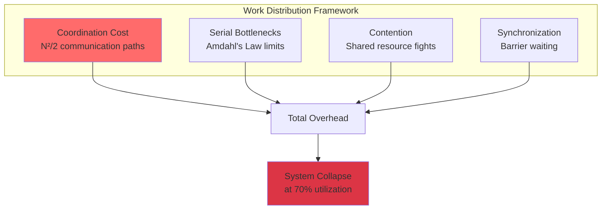
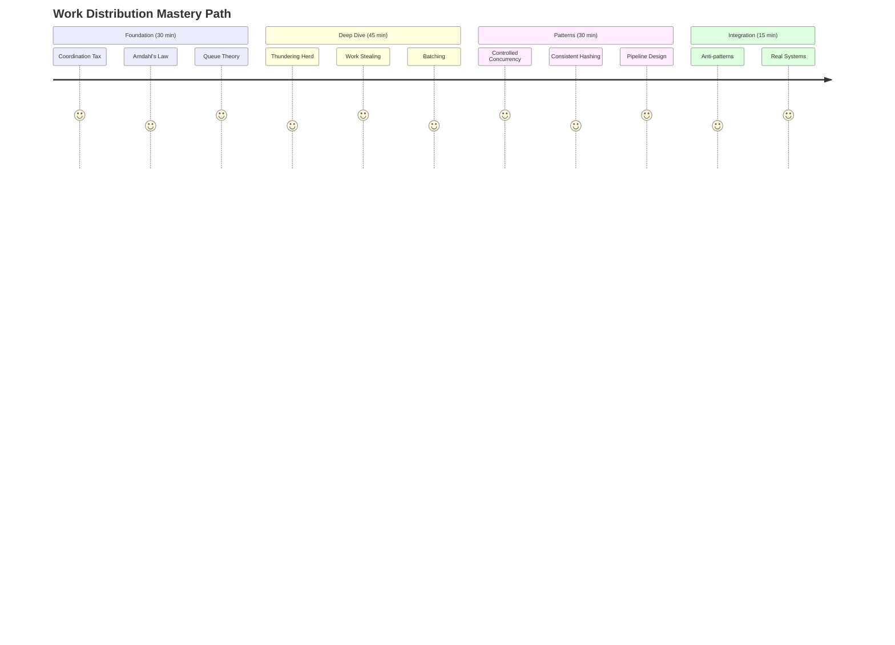
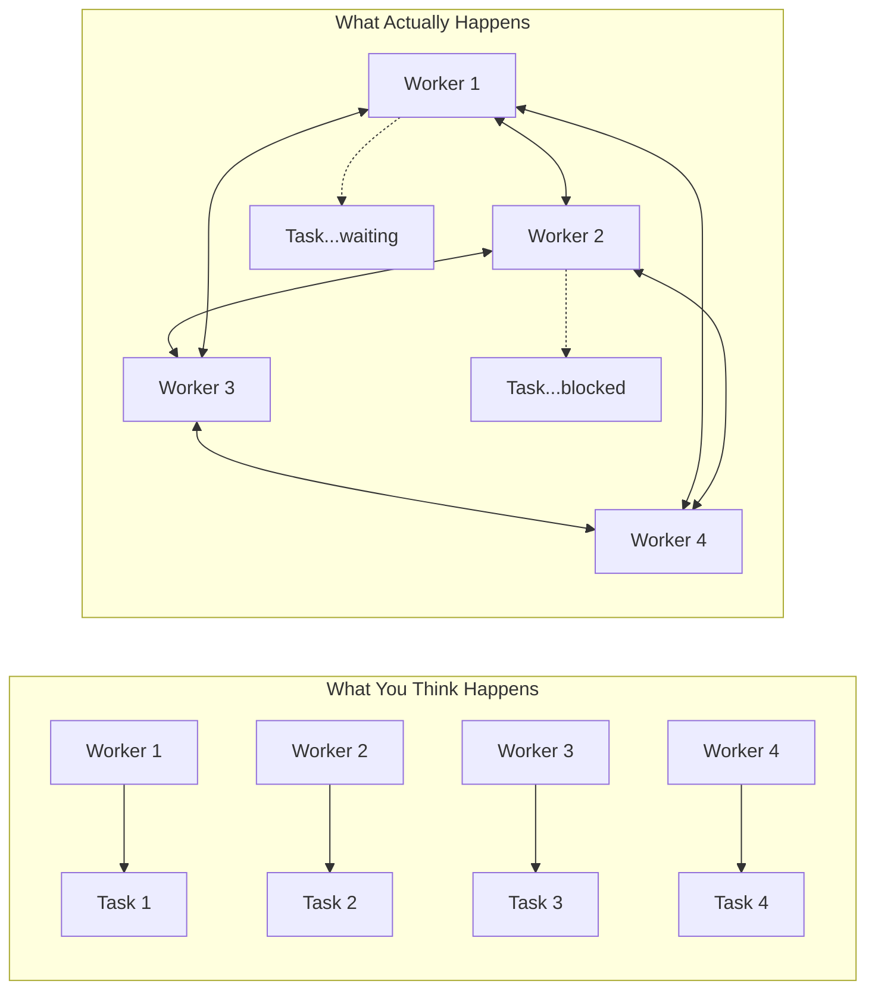
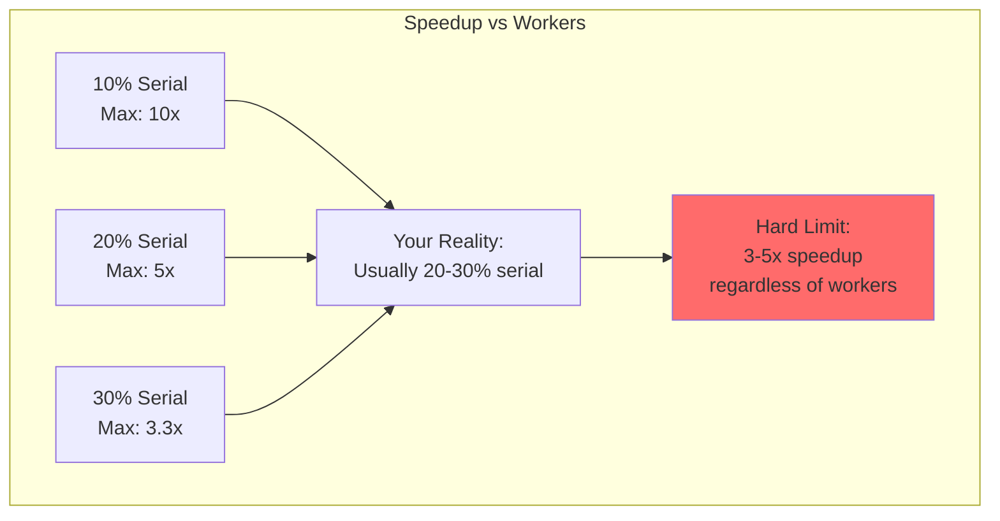
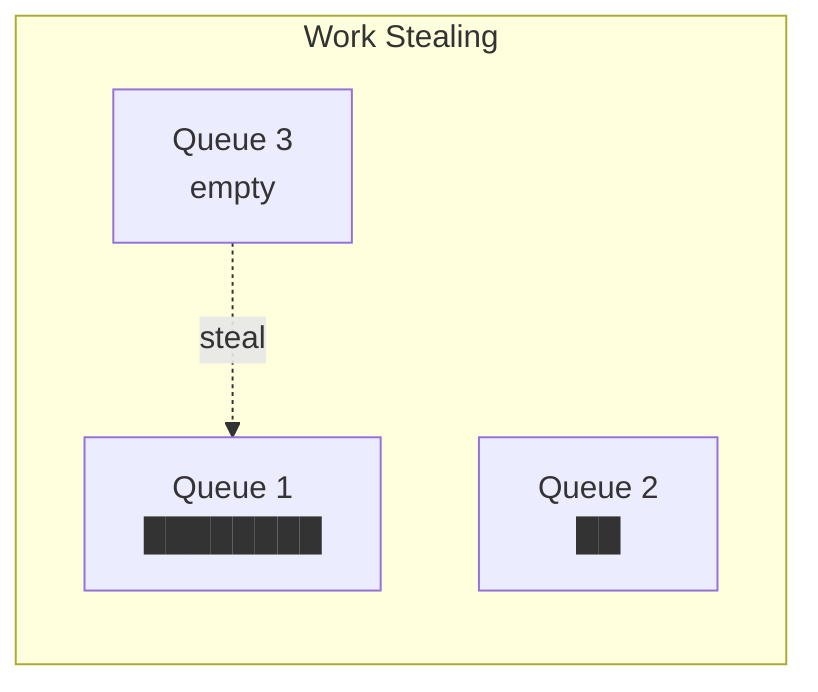

# Module 1: Work Distribution - The Coordination Tax That Kills Systems

!!! abstract "The Apex Learner's Protocol for Work Distribution"
    This module implements focused learning bursts, spaced repetition, and active retrieval to master work distribution principles. You'll learn why **your 1000-node system is actually a 50-node system—coordination ate the other 950**.

## Foundation: The Brutal Truth About Parallelization

### The $4.5B Wake-Up Call

Facebook, 2021: 1000 engineers spent 6 hours in coordination meetings. Result? ZERO code written, $4.5M/hour burned. This isn't about bad management—it's about the physics of coordination.

**The Mathematical Reality**:
- 10 workers = 45 coordination paths = 55% overhead
- 100 workers = 4,950 paths = 98% overhead
- 1000 workers = 499,500 paths = 99.8% overhead

You're not distributing work. You're distributing meetings.

### The Four Pillars of Work Distribution



## Your Learning Journey Map



---

## Focus Block 1: The Coordination Tax (25 min)

### PRIMING: "Why is your 100-worker system only 3x faster than 1 worker?"

You added 100 workers expecting 100x speedup. You got 3x. Where did the other 97x go? Into coordination overhead—the tax that nobody talks about but everyone pays.

### CORE CONCEPT: The N² Communication Explosion

**Brooks' Law Applied to Systems**:
```
Communication Paths = N × (N-1) / 2

10 nodes = 45 paths
100 nodes = 4,950 paths
1000 nodes = 499,500 paths
```

**The Overhead Formula**:
```
Effective Workers = N / (1 + coordination_cost × N²)

With coordination_cost = 0.001:
10 workers → 9.09 effective (91% efficiency)
100 workers → 9.09 effective (9% efficiency)
1000 workers → 1.00 effective (0.1% efficiency)
```

### VISUAL MODEL: The Coordination Collapse



### NEURAL BRIDGE: The Traffic Jam Analogy

Adding more cars to a highway doesn't make traffic flow faster after a certain point. Each car needs space, merge points create bottlenecks, and eventually, adding cars makes everyone slower. Your distributed system is that highway.

### ACTIVE PRACTICE: Calculate Your Coordination Tax

**Step 1**: Count your system's workers/nodes
**Step 2**: Calculate communication paths
**Step 3**: Estimate coordination overhead per path
**Step 4**: Calculate effective workers

Example:
```python
nodes = 50
paths = nodes * (nodes - 1) / 2  # 1,225
overhead_per_path = 0.001  # 1ms per coordination
total_overhead = paths * overhead_per_path  # 1.225 seconds
effective_nodes = nodes / (1 + total_overhead)  # ~22 effective nodes
```

### CONSOLIDATION PROMPT 1

**PAUSE AND REFLECT**:
1. How many coordination paths exist in your current system?
2. What percentage of time is spent in coordination vs. actual work?
3. At what point does adding more workers make things slower?

---

## Focus Block 2: Amdahl's Law - The Iron Ceiling (25 min)

### PRIMING: "Why can't you get more than 5x speedup with 1000 cores?"

Your profiler shows 20% of your code is sequential. Amdahl's Law says your maximum speedup is 1/(0.2 + 0.8/∞) = 5x. Not 1000x. Not 100x. Five. Times. That's it.

### CORE CONCEPT: The Sequential Bottleneck

**Amdahl's Law**:
```
Speedup = 1 / (S + P/N)

Where:
S = Sequential fraction
P = Parallel fraction (1 - S)
N = Number of processors
```

**Reality Check**:
- 10% sequential → Max speedup = 10x
- 20% sequential → Max speedup = 5x
- 30% sequential → Max speedup = 3.33x
- 50% sequential → Max speedup = 2x

### VISUAL MODEL: The Speedup Ceiling



### THE UNIVERSAL SCALABILITY LAW: Beyond Amdahl

**USL Formula** (includes contention and coherency):
```
Speedup = N / (1 + α(N-1) + βN(N-1))

Where:
α = contention coefficient
β = coherency coefficient
```

This predicts NEGATIVE scaling—adding workers makes things SLOWER.

### NEURAL BRIDGE: The Kitchen Analogy

One chef can make a meal in 60 minutes. Two chefs might do it in 35 minutes. But 10 chefs in the same kitchen? They're bumping into each other, waiting for the stove, arguing about recipes. You'll be lucky to get food in 90 minutes.

### ACTIVE PRACTICE: Find Your Serial Bottleneck

Profile your system and identify:
1. **Sequential sections** (database writes, global locks)
2. **Contention points** (shared queues, caches)
3. **Coherency costs** (cache invalidation, consensus)

Calculate your theoretical speedup limit:
```python
serial_fraction = 0.25  # 25% of work is sequential
max_workers = 1000
theoretical_speedup = 1 / (serial_fraction + (1-serial_fraction)/max_workers)
print(f"Maximum speedup: {theoretical_speedup:.1f}x")  # 4.0x
```

### CONSOLIDATION PROMPT 2

**CRITICAL THINKING**:
1. What's the most sequential part of your system?
2. How would you redesign to reduce the serial fraction?
3. Is parallelization even worth it for your workload?

---

## Focus Block 3: The Five Specters of Work Distribution (30 min)

### PRIMING: "The patterns that kill distributed systems"

These five failure modes appear in every distributed system. Learn to recognize them before they destroy your production environment.

### SPECTER 1: The Thundering Herd

**What It Is**: All workers wake up simultaneously and hammer a resource.

**Real Disaster**: 
```
Facebook, 2015: Config change at 2 AM
→ All servers check for updates at :00
→ 100,000 simultaneous requests
→ Config service dies
→ Entire site down for 2 hours
Cost: $2.5M in lost revenue
```

**The Fix**: Jittered exponential backoff
```python
delay = base_delay * (2 ** attempt) + random.uniform(-jitter, jitter)
```

### SPECTER 2: The Starvation Spiral

**What It Is**: Small tasks wait forever behind large tasks.

**Visual Reality**:
```
Queue: [10GB task][10GB task][1KB urgent request waiting...]
                                    ↑
                            Customer timeout in 3...2...1...
```

**The Fix**: Multi-level feedback queues with priority aging

### SPECTER 3: Head-of-Line Blocking

**What It Is**: One slow request blocks all requests behind it.

**Production Example**:
```
API Gateway Queue:
[Fast: 10ms][Fast: 10ms][SLOW: 30sec timeout][Fast: 10ms][Fast: 10ms]
                              ↑
                    Everything waits 30 seconds
```

**The Fix**: Multiple queues with work stealing

### SPECTER 4: Work Affinity Trap

**What It Is**: Work gravitates to specific workers, creating hot spots.

```python
# WRONG: Creates hot spots
worker_id = hash(user_id) % num_workers

# RIGHT: Consistent hashing with virtual nodes
worker_id = consistent_hash.get_node(user_id)
```

### SPECTER 5: Distributed Deadlock

**What It Is**: Circular waiting across distributed resources.

**The Disaster Pattern**:
```
Worker A: Holds Lock 1, Waits for Lock 2
Worker B: Holds Lock 2, Waits for Lock 3
Worker C: Holds Lock 3, Waits for Lock 1
Result: Nobody makes progress, ever.
```

**The Fix**: Lamport timestamps + timeout + rollback

### CONSOLIDATION PROMPT 3

**PATTERN RECOGNITION**:
1. Which specter has hit your system before?
2. How would you detect each specter in monitoring?
3. Design a chaos experiment to trigger one specter safely.

---

## Focus Block 4: Patterns That Actually Work (25 min)

### PRIMING: "Stop inventing new ways to distribute work. Use what's proven."

After 50 years of distributed systems, we know what works. Stop reinventing broken wheels.

### PATTERN 1: Controlled Concurrency

**The Principle**: Limit parallelism to useful levels.

```python
# WRONG: Unlimited parallelism
tasks = [process(item) for item in items]
await asyncio.gather(*tasks)  # 10,000 concurrent tasks = death

# RIGHT: Controlled concurrency
semaphore = asyncio.Semaphore(10)  # Max 10 concurrent
async def controlled_process(item):
    async with semaphore:
        return await process(item)
```

**The Sweet Spot**: 2-3x CPU cores for CPU-bound, 10-50x for I/O-bound

### PATTERN 2: Work Stealing That Works

**The Principle**: Idle workers steal from busy workers' queues.



**Implementation Keys**:
- Steal from the back (large tasks)
- Steal in batches (reduce contention)
- Exponential backoff on steal attempts

### PATTERN 3: Batching for Survival

**The Mathematics**:
```
Individual requests: 1000 requests × 10ms overhead = 10 seconds overhead
Batched (size=100): 10 batches × 10ms overhead = 0.1 seconds overhead
Improvement: 100x
```

**Real Implementation**:
```python
class BatchProcessor:
    def __init__(self, batch_size=100, timeout=50ms):
        self.batch = []
        self.batch_size = batch_size
        self.timeout = timeout
        
    async def add(self, item):
        self.batch.append(item)
        if len(self.batch) >= self.batch_size:
            await self.flush()
    
    async def flush(self):
        if self.batch:
            await process_batch(self.batch)
            self.batch = []
```

### PATTERN 4: Consistent Hashing with Virtual Nodes

**Why It Works**: Distributes work evenly even when nodes fail.

```python
class ConsistentHash:
    def __init__(self, nodes, virtual_nodes=150):
        self.ring = {}
        for node in nodes:
            for i in range(virtual_nodes):
                hash_key = hash(f"{node}:{i}")
                self.ring[hash_key] = node
        self.sorted_keys = sorted(self.ring.keys())
    
    def get_node(self, key):
        hash_key = hash(key)
        idx = bisect.bisect_right(self.sorted_keys, hash_key)
        if idx == len(self.sorted_keys):
            idx = 0
        return self.ring[self.sorted_keys[idx]]
```

### CONSOLIDATION PROMPT 4

**IMPLEMENTATION PLANNING**:
1. Which pattern would have the biggest impact on your system?
2. What would you need to change to implement it?
3. How would you measure the improvement?

---

## Focus Block 5: Real-World Case Studies (20 min)

### CASE 1: Spotify - From Monolith to Music

**The Problem**: 100M users, 30M songs, personalized playlists in <100ms

**The Solution**:
```
Work Distribution Strategy:
├── Feature Hashing (reduce dimensionality)
├── Approximate algorithms (good enough > perfect)
├── Precomputation (do work before users ask)
└── Edge caching (compute once, serve many)

Result: 50ms p99 latency with 100 workers (not 10,000)
```

### CASE 2: Uber - H3 Hexagon Magic

**The Problem**: Match drivers to riders in a city efficiently

**The Solution**:
```python
# Divide world into hexagons
hexagon = h3.geo_to_h3(lat, lng, resolution=9)
nearby_hexagons = h3.k_ring(hexagon, k=2)

# Each hexagon = independent work unit
# No coordination needed between distant hexagons
```

**Result**: O(1) matching instead of O(N²)

### CASE 3: Discord - 100M Messages/Hour

**The Problem**: Route messages to millions of users in real-time

**The Solution**:
```
Consistent Hashing + Erlang/Elixir:
- Each guild (server) = independent actor
- No shared state between guilds
- Supervision trees handle failures
- Work stealing for load balancing

Result: 100M messages/hour on 50 nodes
```

### CASE 4: Google MapReduce

**The Insight**: Make work distribution invisible to programmers

```python
# Programmer writes this:
def map(key, value):
    for word in value.split():
        emit(word, 1)

def reduce(key, values):
    return sum(values)

# Framework handles:
# - Partitioning
# - Distribution
# - Failure recovery
# - Coordination
```

**Impact**: Processed entire web with 1000s of machines

---

## Integration Challenge: Design Your Work Distribution

### YOUR MISSION: Redesign your system's work distribution

**Step 1: Measure Current State** (10 min)
- Calculate coordination paths
- Measure serial fraction
- Identify bottlenecks

**Step 2: Identify Specters** (10 min)
- Which failure modes are present?
- What triggers them?
- How often do they occur?

**Step 3: Select Patterns** (10 min)
- Which patterns address your problems?
- What's the implementation effort?
- What's the expected improvement?

**Step 4: Design New Architecture** (20 min)
- Draw the new work flow
- Calculate theoretical improvement
- Identify risks

**Step 5: Create Migration Plan** (10 min)
- What can you change incrementally?
- What requires bigger refactoring?
- How will you measure success?

---

## Anti-Patterns to Avoid

### Anti-Pattern 1: The Distributed Monolith

**What It Looks Like**:
```
Service A → Service B → Service C → Service D
         ↑                                ↓
         ←────────────────────────────────
         
Every request touches every service = Monolith with network calls
```

**Why It Fails**: Coordination cost > monolith cost + No monolith benefits

### Anti-Pattern 2: Premature Distribution

**The Trap**: 
"Let's make it distributed from day 1 for scale!"

**The Reality**:
- Day 1: 10 users
- Year 1: 1,000 users  
- Year 2: Bankruptcy from cloud bills

**The Rule**: Stay monolithic until you can't. Then distribute the minimum.

### Anti-Pattern 3: The N+1 Query Disaster

**What It Looks Like**:
```python
# WRONG: N+1 queries
users = get_users()  # 1 query
for user in users:  # N queries
    user.profile = get_profile(user.id)
# Total: 1001 queries for 1000 users

# RIGHT: Batch fetch
users = get_users()
profiles = get_profiles([u.id for u in users])  # 2 queries total
```

---

## Practical Exercises

### Exercise 1: Calculate Your Coordination Overhead

```python
def calculate_overhead(nodes, avg_coordination_time_ms, total_work_time_ms):
    paths = nodes * (nodes - 1) / 2
    coordination_time = paths * avg_coordination_time_ms
    overhead_percentage = coordination_time / total_work_time_ms * 100
    effective_nodes = nodes * (1 - overhead_percentage/100)
    return {
        'paths': paths,
        'overhead_percentage': overhead_percentage,
        'effective_nodes': effective_nodes
    }

# Your system:
result = calculate_overhead(
    nodes=50,
    avg_coordination_time_ms=1,
    total_work_time_ms=1000
)
print(f"Your 50 nodes are effectively {result['effective_nodes']:.1f} nodes")
```

### Exercise 2: Design a Work Queue

Design a work queue that:
1. Prevents thundering herd
2. Avoids starvation
3. Handles worker failures
4. Supports work stealing

### Exercise 3: Implement Batching

```python
class SmartBatcher:
    """
    Implement a batcher that:
    - Batches up to batch_size items
    - Flushes after timeout_ms even if not full
    - Handles back-pressure
    """
    def __init__(self, batch_size, timeout_ms):
        # Your implementation here
        pass
    
    async def add(self, item):
        # Your implementation here
        pass
```

---

## Retrieval Practice Gauntlets

### Gauntlet 1: Quick Recall (2 min)
1. Formula for coordination paths? _____
2. Amdahl's Law formula? _____
3. The five specters? _____
4. Work stealing steals from? _____
5. Consistent hashing uses how many virtual nodes? _____

### Gauntlet 2: Application (5 min)
Your system has 100 workers and 25% serial work. Calculate:
1. Maximum theoretical speedup: _____
2. Communication paths: _____
3. Should you add more workers? _____

### Gauntlet 3: Analysis (10 min)
You see these symptoms:
- Uneven CPU usage across workers
- Some queues empty, others overflowing
- Random timeout spikes

Diagnose:
1. Which specter is this? _____
2. Root cause? _____
3. Fix? _____

### Gauntlet 4: Design (15 min)
Design a video transcoding pipeline that:
1. Handles 1KB to 10GB files
2. Prioritizes paid users
3. Scales to 10,000 concurrent jobs
4. Survives worker failures

---

## Common Pitfalls & Mitigations

### Pitfall 1: "More Workers = More Speed"
**Reality**: More workers = more coordination = less speed
**Mitigation**: Find optimal parallelism through testing

### Pitfall 2: "Perfect Load Balancing"
**Reality**: Perfect balance requires perfect information (impossible)
**Mitigation**: Work stealing + consistent hashing

### Pitfall 3: "Infinite Scalability"
**Reality**: Amdahl's Law always wins
**Mitigation**: Optimize serial portions first

### Pitfall 4: "Centralized Coordination"
**Reality**: Coordinator becomes bottleneck
**Mitigation**: Distributed coordination (gossip, CRDTs)

### Pitfall 5: "Ignoring Failure Modes"
**Reality**: The five specters will find you
**Mitigation**: Chaos engineering + circuit breakers

---

## Your Work Distribution Checklist

### Before Distributing Work:
- [ ] Measured serial fraction
- [ ] Calculated coordination overhead
- [ ] Identified bottlenecks
- [ ] Profiled current performance
- [ ] Calculated theoretical speedup
- [ ] Estimated implementation cost
- [ ] Considered staying monolithic
- [ ] Designed failure handling
- [ ] Planned monitoring
- [ ] Created rollback plan

### During Implementation:
- [ ] Start with controlled concurrency
- [ ] Implement batching
- [ ] Add work stealing
- [ ] Use consistent hashing
- [ ] Monitor coordination overhead
- [ ] Track actual vs theoretical speedup

### After Deployment:
- [ ] Measure actual speedup
- [ ] Monitor for specters
- [ ] Track coordination costs
- [ ] Calculate ROI
- [ ] Document lessons learned
- [ ] Adjust parallelism levels

---

## Summary: The Work Distribution Manifesto

1. **Coordination kills parallelism** - N workers ≠ N× speedup
2. **Amdahl's Law is undefeated** - Serial work limits everything
3. **The five specters are real** - They will find your system
4. **Use proven patterns** - Stop reinventing broken wheels
5. **Batching is magic** - 100× improvement for free
6. **Work stealing works** - Let the system balance itself
7. **Controlled concurrency** - More isn't better
8. **Monitor everything** - You can't optimize what you don't measure
9. **Start monolithic** - Distribute only when forced
10. **The goal is throughput, not parallelism** - Sometimes 1 worker is optimal

## Final Thought

Work distribution isn't about making things parallel—it's about making things efficient. Most systems would be faster, cheaper, and more reliable with LESS distribution, not more.

Before you distribute work, ask: "What if we just didn't?"

The best distributed system is the one you don't build.

---

*Continue your learning journey:*
- [→ Practice Exam](tests/work-distribution-exam.md)
- [→ Next Module: State Distribution](module-2-state-distribution.md)
- [↑ Return to Pillars Index](index.md)