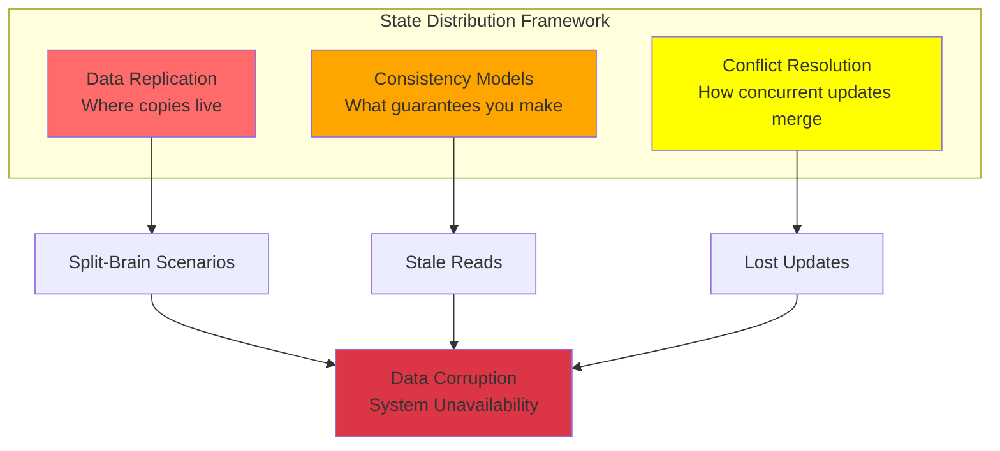
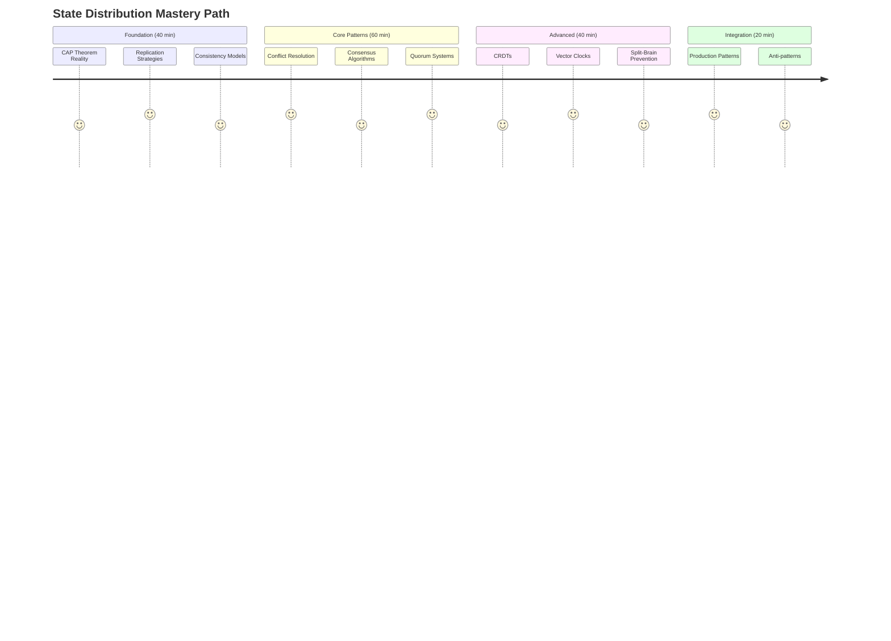
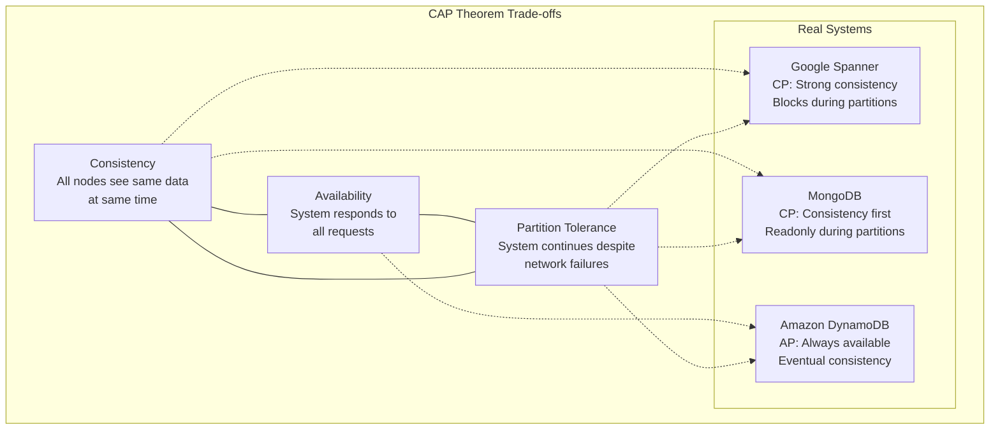
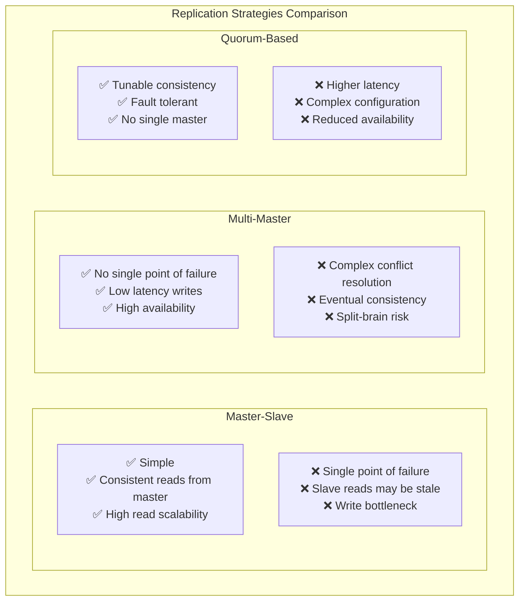
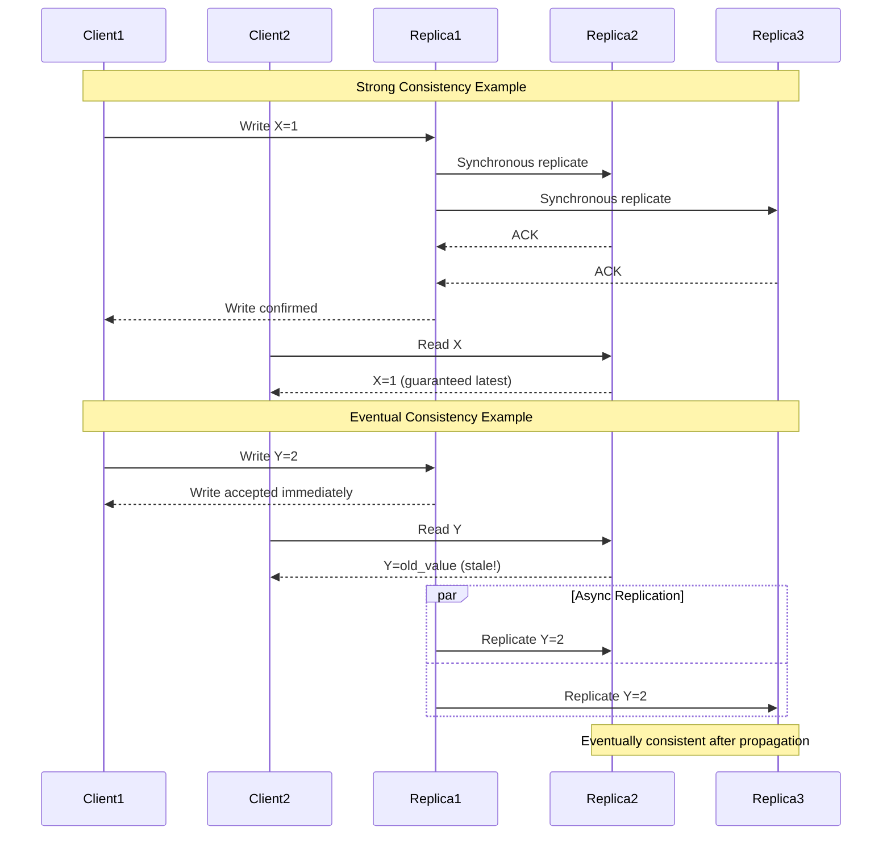
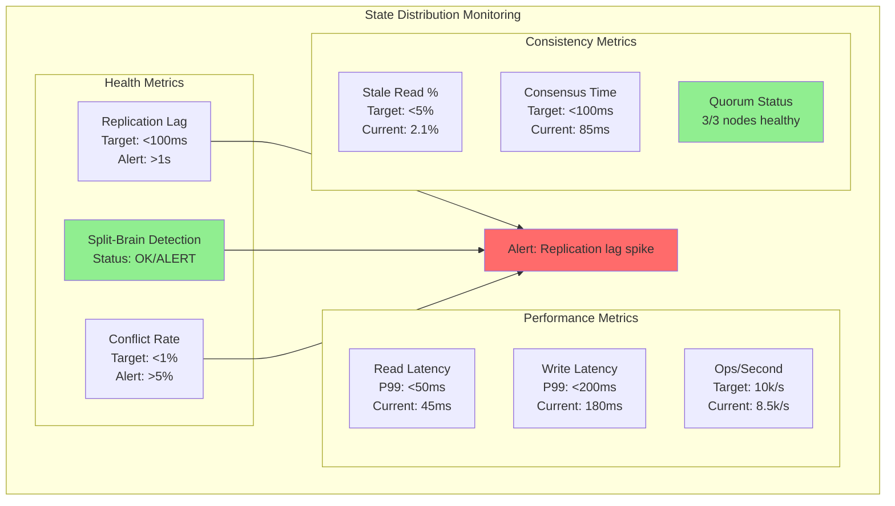

# Module 2: State Distribution - The Battle for Data Coherence

!!! abstract "The Apex Learner's Protocol for State Distribution"
    This module implements focused learning bursts, spaced repetition, and active retrieval to master state distribution principles. You'll learn why **your "consistent" database is actually eventually consistent—and that's probably fine**.

## Foundation: The Impossibility of Perfect State

### The $10M Lesson from Spanner

Google spent $10 billion building Spanner to achieve global strong consistency. Result? Bank-grade correctness with 100-500ms latency per transaction. Meanwhile, Facebook's eventually consistent system serves 3 billion users with <10ms responses.

**The Mathematical Reality**:
- Strong consistency: O(network diameter) latency
- Eventual consistency: O(1) latency + convergence time
- CAP Theorem: Pick 2 out of 3 (Consistency, Availability, Partition tolerance)

You're not choosing between right and wrong. You're choosing between impossible trade-offs.

### The Three Pillars of State Distribution



## Your Learning Journey Map



---

## Focus Block 1: The CAP Theorem Reality (30 min)

### PRIMING: "Why can't you have Netflix's availability AND bank-level consistency?"

Netflix can lose data for seconds and users barely notice. Banks lose data for milliseconds and regulators shut them down. Both are distributed systems. Both handle partitions. Why can't you have both guarantees?

### CORE CONCEPT: The CAP Theorem Isn't Academic Theory

**CAP Theorem States**:
```
In the presence of network Partitions, you must choose:
- Consistency (all nodes see the same data simultaneously)
- Availability (system remains operational)

You cannot have both.
```

**Real-World CAP Choices**:
```python
# CP System (Consistent + Partition Tolerant)
def bank_transfer(from_account, to_account, amount):
    with distributed_transaction():
        if not can_reach_all_replicas():
            raise UnavailableError("Cannot ensure consistency")
        
        debit(from_account, amount)
        credit(to_account, amount)
    # Result: Blocks during partitions, but data is consistent

# AP System (Available + Partition Tolerant)  
def social_media_post(user_id, content):
    primary_node = get_available_node()
    primary_node.write(user_id, content)
    async_replicate_to_other_nodes(user_id, content)
    return "Posted successfully"
    # Result: Always works, but some users may see stale data
```

### VISUAL MODEL: The CAP Triangle



### NEURAL BRIDGE: The Restaurant Analogy

A restaurant chain has 3 locations with shared inventory. When Location A runs out of salmon:

**CP Approach**: All locations stop serving salmon until inventory syncs (consistency + partition tolerance)
**AP Approach**: Locations keep serving what they have, update inventory later (availability + partition tolerance)
**CA Approach**: Only works if all locations can always talk to each other (impossible in reality)

### ACTIVE PRACTICE: Map Your CAP Requirements

**Step 1**: Identify your system's data types
**Step 2**: Classify by business criticality
**Step 3**: Choose CAP strategy per data type

```python
# Example classification
data_requirements = {
    "user_balance": {"model": "CP", "reason": "Money must be consistent"},
    "user_profile": {"model": "AP", "reason": "Availability more important than perfect consistency"},
    "friend_count": {"model": "AP", "reason": "Approximate is fine"},
    "password_hash": {"model": "CP", "reason": "Security requires consistency"}
}

def evaluate_cap_choice(data_type):
    requirements = data_requirements[data_type]
    
    # Estimate costs
    if requirements["model"] == "CP":
        latency_cost = "High (100-500ms)"
        availability_cost = "Blocks during partitions"
        infrastructure_cost = "3-5x more expensive"
    else:  # AP
        latency_cost = "Low (<50ms)"
        availability_cost = "Always available" 
        infrastructure_cost = "Standard"
        
    return {
        "latency": latency_cost,
        "availability": availability_cost,
        "cost": infrastructure_cost
    }
```

### CONSOLIDATION PROMPT 1

**PAUSE AND REFLECT**:
1. For your current system, which data types truly need strong consistency?
2. What business impact would 100ms extra latency have on each operation?
3. How much would you pay for 99.99% vs 99.9% availability?

---

## Focus Block 2: Replication Strategies - The Foundation (25 min)

### PRIMING: "Your database has 3 copies of every record. Which one is correct?"

All three replicas say they have the latest data. Node 1 shows user balance = $100. Node 2 shows $95. Node 3 shows $105. Your application has 1 second to return the balance. What do you return?

### CORE CONCEPT: The Three Replication Architectures

**Master-Slave Replication**:
```python
class MasterSlaveDB:
    def write(self, key, value):
        # All writes go to master
        result = self.master.write(key, value)
        
        # Async replication to slaves
        for slave in self.slaves:
            self.replicate_async(slave, key, value)
        
        return result
    
    def read(self, key):
        # Reads can go to any slave (might be stale)
        chosen_slave = random.choice(self.slaves)
        return chosen_slave.read(key)
        
    # Problem: Master is single point of failure
    # Problem: Slave reads might be stale
    # Benefit: Simple consistency model
```

**Multi-Master Replication**:
```python
class MultiMasterDB:
    def write(self, key, value):
        # Write to any master
        local_master = self.get_local_master()
        result = local_master.write(key, value)
        
        # Replicate to other masters
        for master in self.other_masters:
            self.replicate_async(master, key, value)
        
        return result
    
    # Problem: Conflicts when same key written concurrently
    # Problem: Complex conflict resolution needed
    # Benefit: No single point of failure
    # Benefit: Lower latency (write locally)
```

**Quorum-Based Replication**:
```python
class QuorumDB:
    def __init__(self, nodes, write_quorum, read_quorum):
        self.nodes = nodes
        self.W = write_quorum  # Must write to W nodes
        self.R = read_quorum   # Must read from R nodes
        
        # For strong consistency: W + R > N
    
    def write(self, key, value):
        successful_writes = 0
        for node in self.nodes:
            try:
                node.write(key, value, timeout=100ms)
                successful_writes += 1
                if successful_writes >= self.W:
                    return "success"
            except TimeoutError:
                continue
        
        return "insufficient_replicas"
    
    def read(self, key):
        responses = []
        for node in self.nodes:
            try:
                value, timestamp = node.read(key, timeout=100ms)
                responses.append((value, timestamp))
                if len(responses) >= self.R:
                    break
            except TimeoutError:
                continue
        
        # Return most recent value
        return max(responses, key=lambda x: x[1])[0]
```

### VISUAL MODEL: Replication Trade-offs



### NEURAL BRIDGE: The Backup Strategy Analogy

Replication is like backing up important documents:

- **Master-Slave**: Keep one master copy in a safe, make photocopies for daily use
- **Multi-Master**: Everyone has an original, changes get merged later
- **Quorum**: Committee votes on what the "true" document says

### ACTIVE PRACTICE: Design Your Replication Strategy

**Your Mission**: Design replication for an e-commerce system

```python
# Requirements analysis
system_requirements = {
    "product_catalog": {
        "update_frequency": "daily",
        "read_frequency": "1M/minute", 
        "consistency_need": "eventual_ok"
    },
    "user_cart": {
        "update_frequency": "constant",
        "read_frequency": "100k/minute",
        "consistency_need": "session_consistent"
    },
    "order_payment": {
        "update_frequency": "peak_hours",
        "read_frequency": "10k/minute",
        "consistency_need": "strongly_consistent"
    }
}

# Design choices:
def choose_replication_strategy(data_type):
    req = system_requirements[data_type]
    
    if req["consistency_need"] == "strongly_consistent":
        return "quorum_replication", "W=3, R=2, N=3"
    elif req["read_frequency"] > req["update_frequency"] * 10:
        return "master_slave", "1 master, 5 read replicas"
    else:
        return "multi_master", "3 masters with async replication"

# Test your logic
for data_type in system_requirements:
    strategy, config = choose_replication_strategy(data_type)
    print(f"{data_type}: {strategy} ({config})")
```

### CONSOLIDATION PROMPT 2

**CRITICAL THINKING**:
1. What happens to your read latency if a master fails in master-slave replication?
2. How would you detect and handle split-brain in multi-master systems?
3. What's the minimum number of nodes needed for quorum-based replication?

---

## Focus Block 3: Consistency Models - The Spectrum of Guarantees (30 min)

### PRIMING: "Your application says the user has $100, but their bank app shows $95. Who's right?"

Two applications, same database, same user, different values. This isn't a bug—it's a consistency model in action. Understanding which consistency model you've chosen is the difference between a confused user and a lawsuit.

### CORE CONCEPT: The Consistency Spectrum

**Strong Consistency (Linearizability)**:
```python
# All operations appear to happen atomically at some point in time
class StronglyConsistentStore:
    def __init__(self):
        self.value = None
        self.lock = DistributedLock()
    
    def read(self):
        with self.lock:  # Waits for all pending writes
            return self.synchronized_read_from_all_replicas()
    
    def write(self, value):
        with self.lock:  # Blocks all other operations
            self.synchronized_write_to_all_replicas(value)
            self.value = value
    
    # Guarantee: Every read returns the most recent write
    # Cost: High latency, low availability during partitions
```

**Eventual Consistency**:
```python
class EventuallyConsistentStore:
    def __init__(self, replicas):
        self.replicas = replicas
    
    def write(self, value):
        # Write to any available replica
        available_replica = self.get_available_replica()
        available_replica.write(value)
        
        # Async propagation to other replicas
        self.async_propagate(value, exclude=available_replica)
        return "acknowledged"
    
    def read(self):
        # Read from any available replica
        replica = self.get_available_replica()
        return replica.read()
    
    # Guarantee: All replicas will eventually have the same value
    # Cost: Reads might return stale data for some time
```

**Causal Consistency**:
```python
class CausallyConsistentStore:
    def __init__(self):
        self.vector_clock = VectorClock()
        self.causal_dependencies = {}
    
    def write(self, key, value, depends_on=None):
        # Record causal dependencies
        timestamp = self.vector_clock.tick()
        
        if depends_on:
            self.causal_dependencies[timestamp] = depends_on
        
        self.replicate_with_causality(key, value, timestamp)
        return timestamp
    
    def read(self, key):
        value, timestamp = self.local_read(key)
        
        # Ensure all causally-dependent operations completed
        if timestamp in self.causal_dependencies:
            self.wait_for_dependencies(self.causal_dependencies[timestamp])
        
        return value
    
    # Guarantee: Causally-related operations are seen in order
    # Cost: More complex than eventual, less available than strong
```

**Session Consistency**:
```python
class SessionConsistentStore:
    def __init__(self):
        self.user_sessions = {}
    
    def write(self, user_id, key, value):
        session = self.get_or_create_session(user_id)
        
        # Write to user's designated replica
        replica = session.preferred_replica
        result = replica.write(key, value)
        
        # Update session's last_write_timestamp
        session.last_write = result.timestamp
        
        return result
    
    def read(self, user_id, key):
        session = self.user_sessions[user_id]
        
        # Read from replica that has user's writes
        replica = session.preferred_replica
        
        # Ensure we see writes from this session
        value = replica.read_after(key, session.last_write)
        return value
    
    # Guarantee: Users see their own writes and reads are monotonic
    # Cost: Users tied to specific replicas, reduced load balancing
```

### VISUAL MODEL: Consistency Guarantees Timeline



### NEURAL BRIDGE: The News Analogy

Consistency models are like news distribution:

- **Strong Consistency**: Breaking news stops all other stories until everyone has the update
- **Eventual Consistency**: News spreads at its own pace, some people hear it later  
- **Causal Consistency**: Related stories are told in the right order
- **Session Consistency**: You see your own comments immediately, but others might not

### ACTIVE PRACTICE: Choose Consistency Models

**Design Challenge**: Social media platform with different content types

```python
content_types = {
    "user_posts": {
        "read_pattern": "timeline_feeds",
        "write_pattern": "occasional_posts",
        "business_impact": "user_experience"
    },
    "user_balance": {
        "read_pattern": "transactional_checks", 
        "write_pattern": "payment_transactions",
        "business_impact": "financial_accuracy"
    },
    "message_threads": {
        "read_pattern": "conversational_order",
        "write_pattern": "rapid_back_forth",
        "business_impact": "conversation_coherence"
    },
    "notification_counts": {
        "read_pattern": "frequent_polling",
        "write_pattern": "event_triggered",
        "business_impact": "user_engagement"
    }
}

def recommend_consistency_model(content_type):
    content = content_types[content_type]
    
    if content["business_impact"] == "financial_accuracy":
        return "strong_consistency", "Money must be correct"
    elif "order" in content["read_pattern"]:
        return "causal_consistency", "Order matters for understanding"
    elif "rapid" in content["write_pattern"]:
        return "session_consistency", "Users need to see their own actions"
    else:
        return "eventual_consistency", "Performance over perfect consistency"

# Apply to your system
for content_type in content_types:
    model, reasoning = recommend_consistency_model(content_type)
    print(f"{content_type}: {model} - {reasoning}")
```

### CONSOLIDATION PROMPT 3

**PATTERN RECOGNITION**:
1. Which consistency model would Gmail use for your inbox?
2. What consistency model does your browser cache use?
3. When would you choose causal consistency over eventual consistency?

---

## Focus Block 4: Conflict Resolution - When Updates Collide (25 min)

### PRIMING: "Two users buy the last concert ticket simultaneously. Who gets it?"

User A clicks "Buy" at 14:30:05.001 from New York. User B clicks "Buy" at 14:30:05.002 from Tokyo. Network delays mean both requests arrive at different replicas at the same time. Your conflict resolution strategy determines who gets the ticket—and whether you sell the same ticket twice.

### CORE CONCEPT: The Three Conflict Resolution Strategies

**Last Writer Wins (LWW)**:
```python
class LastWriterWinsResolver:
    def resolve_conflict(self, value1, timestamp1, value2, timestamp2):
        if timestamp1 > timestamp2:
            return value1, "timestamp_winner"
        elif timestamp2 > timestamp1:
            return value2, "timestamp_winner"  
        else:
            # Same timestamp - use node ID as tiebreaker
            node1_id = self.get_node_id(value1)
            node2_id = self.get_node_id(value2)
            
            if node1_id > node2_id:
                return value1, "node_id_tiebreaker"
            else:
                return value2, "node_id_tiebreaker"
    
    # Example: Shopping cart updates
    def update_cart(self, user_id, items):
        timestamp = self.get_timestamp()
        node_id = self.get_local_node_id()
        
        write_result = self.write_with_metadata(
            key=f"cart:{user_id}",
            value=items,
            timestamp=timestamp,
            node_id=node_id
        )
        
        # Problem: Lost updates! If both users modify cart simultaneously,
        # only one modification survives
        return write_result
```

**Vector Clocks**:
```python
class VectorClockResolver:
    def __init__(self, node_id, cluster_nodes):
        self.node_id = node_id
        self.vector_clock = {node: 0 for node in cluster_nodes}
    
    def update_local_clock(self):
        self.vector_clock[self.node_id] += 1
        return self.vector_clock.copy()
    
    def resolve_conflict(self, value1, vclock1, value2, vclock2):
        # Check if one vector clock dominates the other
        if self.dominates(vclock1, vclock2):
            return value1, "vclock1_dominates"
        elif self.dominates(vclock2, vclock1):
            return value2, "vclock2_dominates"
        else:
            # Concurrent updates - need manual resolution or merge
            return self.merge_concurrent_values(value1, value2), "merged"
    
    def dominates(self, vclock1, vclock2):
        """vclock1 dominates vclock2 if vclock1 >= vclock2 in all positions"""
        return (all(vclock1[node] >= vclock2[node] for node in vclock1) and
                any(vclock1[node] > vclock2[node] for node in vclock1))
    
    def merge_concurrent_values(self, value1, value2):
        # Application-specific merge logic
        if isinstance(value1, dict) and isinstance(value2, dict):
            # Merge dictionaries, preferring newer timestamps per field
            merged = {}
            all_keys = set(value1.keys()) | set(value2.keys())
            
            for key in all_keys:
                if key in value1 and key in value2:
                    # Both have the key - choose based on field-level timestamp
                    merged[key] = self.resolve_field_conflict(
                        value1[key], value2[key]
                    )
                elif key in value1:
                    merged[key] = value1[key]
                else:
                    merged[key] = value2[key]
            
            return merged
        else:
            # For non-dict values, fall back to LWW or flag for manual resolution
            return value1  # Could also raise ConflictRequiresManualResolution
```

**Conflict-Free Replicated Data Types (CRDTs)**:
```python
class ORSet:  # Observed-Remove Set
    """CRDT that handles add/remove operations without conflicts"""
    
    def __init__(self, node_id):
        self.node_id = node_id
        self.added = {}  # element -> set of unique tags
        self.removed = set()  # set of removed tags
        self.tag_counter = 0
    
    def add(self, element):
        """Add element with unique tag"""
        self.tag_counter += 1
        tag = f"{self.node_id}:{self.tag_counter}"
        
        if element not in self.added:
            self.added[element] = set()
        self.added[element].add(tag)
        
        return tag
    
    def remove(self, element):
        """Remove element by marking all its tags as removed"""
        if element in self.added:
            tags_to_remove = self.added[element].copy()
            self.removed.update(tags_to_remove)
    
    def contains(self, element):
        """Element is present if it has tags that haven't been removed"""
        if element not in self.added:
            return False
        
        live_tags = self.added[element] - self.removed
        return len(live_tags) > 0
    
    def merge(self, other_set):
        """Merge with another OR-Set - automatically resolves conflicts"""
        # Merge added elements
        for element, tags in other_set.added.items():
            if element not in self.added:
                self.added[element] = set()
            self.added[element].update(tags)
        
        # Merge removed tags
        self.removed.update(other_set.removed)
    
    def to_set(self):
        """Get current set contents"""
        result = set()
        for element in self.added:
            if self.contains(element):
                result.add(element)
        return result

# Example: Collaborative shopping list
def collaborative_shopping_list_example():
    # Two users working on the same shopping list
    alice_list = ORSet("alice")
    bob_list = ORSet("bob")
    
    # Alice adds items
    alice_list.add("milk")
    alice_list.add("bread")
    
    # Bob adds items (concurrently)
    bob_list.add("eggs")
    bob_list.add("milk")  # Same item!
    
    # Bob removes bread (but doesn't have it in his view)
    # This is fine - CRDT handles it gracefully
    
    # Merge the lists when they sync
    alice_list.merge(bob_list)
    bob_list.merge(alice_list)
    
    # Both lists now have the same contents: {milk, bread, eggs}
    print(alice_list.to_set())  # Same result
    print(bob_list.to_set())    # Same result
```

### VISUAL MODEL: Conflict Resolution Strategies

```mermaid
graph TB
    subgraph "Conflict Resolution Comparison"
        subgraph "Last Writer Wins"
            LWW_SCENARIO[Scenario: Two cart updates<br/>Cart A: [laptop, mouse]@14:30:05<br/>Cart B: [keyboard]@14:30:06]
            LWW_RESULT[Result: Cart B wins<br/>Final: [keyboard]<br/>❌ Lost laptop & mouse]
        end
        
        subgraph "Vector Clocks"
            VC_SCENARIO[Scenario: Two cart updates<br/>Cart A: [laptop, mouse] VC:[1,0]<br/>Cart B: [keyboard] VC:[0,1]]
            VC_RESULT[Result: Concurrent conflict<br/>Needs merge logic<br/>✅ Can preserve both]
        end
        
        subgraph "CRDTs"
            CRDT_SCENARIO[Scenario: Two cart updates<br/>Cart A: add(laptop), add(mouse)<br/>Cart B: add(keyboard), remove(mouse)]
            CRDT_RESULT[Result: Automatic merge<br/>Final: [laptop, keyboard]<br/>✅ Mathematical guarantee]
        end
    end
    
    style LWW_RESULT fill:#ffcccb
    style VC_RESULT fill:#fff2cc  
    style CRDT_RESULT fill:#d4edda
```

### NEURAL BRIDGE: The Document Editing Analogy

Conflict resolution is like collaborative document editing:

- **Last Writer Wins**: Google Docs autosave - last person to save overwrites everyone else
- **Vector Clocks**: Git merge - you see conflicts and must resolve manually
- **CRDTs**: Figma/Miro - changes merge automatically without losing anyone's work

### ACTIVE PRACTICE: Design Conflict Resolution

**Challenge**: Design conflict resolution for different data types

```python
# E-commerce system conflict scenarios
conflict_scenarios = {
    "user_profile": {
        "example_conflict": "User updates email on phone and laptop simultaneously",
        "data_type": "key_value_pairs",
        "business_impact": "low"
    },
    "product_inventory": {
        "example_conflict": "Two customers buy the last item simultaneously", 
        "data_type": "counter",
        "business_impact": "critical"
    },
    "shopping_cart": {
        "example_conflict": "User adds items from multiple devices",
        "data_type": "set_of_items", 
        "business_impact": "medium"
    },
    "user_preferences": {
        "example_conflict": "Settings changed on multiple devices",
        "data_type": "nested_object",
        "business_impact": "low"
    }
}

def choose_conflict_resolution(scenario_name):
    scenario = conflict_scenarios[scenario_name]
    
    if scenario["business_impact"] == "critical":
        return "vector_clocks_with_manual_resolution", "Cannot afford lost updates"
    elif scenario["data_type"] == "set_of_items":
        return "crdt_or_set", "Natural merge semantics"
    elif scenario["data_type"] == "counter":
        return "crdt_pn_counter", "Addition/subtraction merge naturally"
    else:
        return "last_writer_wins", "Simple and acceptable for this use case"

# Test your strategy
for scenario_name in conflict_scenarios:
    strategy, reasoning = choose_conflict_resolution(scenario_name)
    print(f"{scenario_name}: {strategy} - {reasoning}")
```

### CONSOLIDATION PROMPT 4

**IMPLEMENTATION DECISIONS**:
1. For a collaborative whiteboard, which conflict resolution would you use?
2. How would you handle conflicts in a banking system?
3. What happens if vector clocks grow too large?

---

## Focus Block 5: Consensus Algorithms - Democratic Agreement (30 min)

### PRIMING: "How do 1000 servers agree on who's the leader when they can't all talk to each other?"

Your distributed database has 1000 nodes. The network partitions into 3 groups: 600 nodes, 300 nodes, and 100 nodes. Each group thinks the others are dead and wants to elect a new leader. Without consensus algorithms, you get 3 leaders and data corruption.

### CORE CONCEPT: The Consensus Problem

**What Consensus Solves**:
- Leader election (who coordinates writes?)
- State machine replication (what's the current state?)
- Atomic commit (did the transaction succeed?)

**The Core Challenge**: 
```
In an asynchronous network with failures, how do you get nodes to agree on a value?

Answer: You can't. (FLP Impossibility Result)
Practical Answer: You can with assumptions about network timing and failure detectors.
```

**Raft Consensus Algorithm**:
```python
class RaftNode:
    def __init__(self, node_id, cluster_nodes):
        self.node_id = node_id
        self.cluster_nodes = cluster_nodes
        self.state = "follower"  # follower, candidate, leader
        self.current_term = 0
        self.voted_for = None
        self.log = []
        self.commit_index = 0
    
    def start_election(self):
        """Become candidate and request votes"""
        self.state = "candidate"
        self.current_term += 1
        self.voted_for = self.node_id
        
        vote_count = 1  # Vote for self
        
        for node in self.cluster_nodes:
            if node != self.node_id:
                try:
                    vote_response = self.request_vote(node)
                    if vote_response.vote_granted:
                        vote_count += 1
                except NetworkTimeout:
                    continue
        
        # Need majority to become leader
        if vote_count > len(self.cluster_nodes) // 2:
            self.become_leader()
        else:
            self.become_follower()
    
    def request_vote(self, target_node):
        return self.send_rpc(target_node, {
            "type": "RequestVote",
            "term": self.current_term,
            "candidate_id": self.node_id,
            "last_log_index": len(self.log) - 1,
            "last_log_term": self.log[-1].term if self.log else 0
        })
    
    def handle_request_vote(self, request):
        """Decide whether to grant vote"""
        # Don't vote if we already voted in this term
        if (self.voted_for is not None and 
            self.voted_for != request["candidate_id"]):
            return {"vote_granted": False}
        
        # Don't vote for candidates with stale logs
        candidate_log_is_current = (
            request["last_log_term"] > self.get_last_log_term() or
            (request["last_log_term"] == self.get_last_log_term() and
             request["last_log_index"] >= len(self.log) - 1)
        )
        
        if candidate_log_is_current:
            self.voted_for = request["candidate_id"]
            return {"vote_granted": True}
        else:
            return {"vote_granted": False}
    
    def replicate_entry(self, entry):
        """Leader replicates log entry to followers"""
        if self.state != "leader":
            raise NotLeaderException("Only leaders can replicate")
        
        self.log.append(entry)
        
        # Send to all followers
        successful_replications = 1  # Count self
        for node in self.cluster_nodes:
            if node != self.node_id:
                try:
                    response = self.append_entries(node, [entry])
                    if response.success:
                        successful_replications += 1
                except NetworkTimeout:
                    continue
        
        # Commit if majority acknowledged
        if successful_replications > len(self.cluster_nodes) // 2:
            self.commit_index = len(self.log) - 1
            return "committed"
        else:
            # Rollback if not enough acknowledgments
            self.log.pop()
            return "failed"
```

**Practical Byzantine Fault Tolerance (PBFT)**:
```python
class PBFTNode:
    """Handles malicious nodes that can send arbitrary messages"""
    
    def __init__(self, node_id, cluster_nodes):
        self.node_id = node_id
        self.cluster_nodes = cluster_nodes
        self.view = 0  # Current view number
        self.sequence = 0  # Current sequence number
        self.primary = self.calculate_primary(self.view)
        
        # Message logs for different phases
        self.pre_prepare_log = {}
        self.prepare_log = {}
        self.commit_log = {}
    
    def handle_client_request(self, request):
        """Primary handles client requests"""
        if self.node_id != self.primary:
            raise NotPrimaryException("Forward to primary")
        
        self.sequence += 1
        
        # Phase 1: Pre-prepare
        pre_prepare_msg = {
            "type": "PRE-PREPARE",
            "view": self.view,
            "sequence": self.sequence,
            "request": request,
            "digest": self.hash(request)
        }
        
        self.broadcast_to_backups(pre_prepare_msg)
        return self.sequence
    
    def handle_pre_prepare(self, msg):
        """Backup nodes handle pre-prepare messages"""
        # Verify message is from current primary
        if self.calculate_primary(msg["view"]) != self.sender:
            return  # Ignore
        
        # Verify we haven't seen this sequence in different view
        if self.has_conflicting_pre_prepare(msg["sequence"], msg["digest"]):
            return  # Ignore
        
        # Accept pre-prepare and send prepare
        self.pre_prepare_log[msg["sequence"]] = msg
        
        prepare_msg = {
            "type": "PREPARE", 
            "view": msg["view"],
            "sequence": msg["sequence"],
            "digest": msg["digest"],
            "node_id": self.node_id
        }
        
        self.broadcast_to_all(prepare_msg)
    
    def handle_prepare(self, msg):
        """Handle prepare messages from other nodes"""
        seq = msg["sequence"]
        
        if seq not in self.prepare_log:
            self.prepare_log[seq] = []
        
        self.prepare_log[seq].append(msg)
        
        # If we have 2f prepare messages (plus our own pre-prepare),
        # send commit message  
        if len(self.prepare_log[seq]) >= 2 * self.max_faulty_nodes():
            commit_msg = {
                "type": "COMMIT",
                "view": msg["view"], 
                "sequence": msg["sequence"],
                "digest": msg["digest"],
                "node_id": self.node_id
            }
            
            self.broadcast_to_all(commit_msg)
    
    def handle_commit(self, msg):
        """Handle commit messages - final phase"""
        seq = msg["sequence"]
        
        if seq not in self.commit_log:
            self.commit_log[seq] = []
        
        self.commit_log[seq].append(msg)
        
        # If we have 2f+1 commit messages, execute the request
        if len(self.commit_log[seq]) >= 2 * self.max_faulty_nodes() + 1:
            self.execute_request(seq)
    
    def max_faulty_nodes(self):
        """PBFT can tolerate f faulty nodes out of 3f+1 total"""
        return (len(self.cluster_nodes) - 1) // 3
```

### VISUAL MODEL: Consensus Algorithm Comparison

```mermaid
graph TB
    subgraph "Consensus Algorithms Trade-offs"
        subgraph "Raft"
            RAFT_PRO[✅ Simple to understand<br/>✅ Efficient (2 RTT)<br/>✅ Strong leader model]
            RAFT_CON[❌ Assumes honest nodes<br/>❌ Leader bottleneck<br/>❌ Network partition sensitive]
        end
        
        subgraph "PBFT"
            PBFT_PRO[✅ Handles malicious nodes<br/>✅ No single leader dependency<br/>✅ Immediate finality]
            PBFT_CON[❌ Complex (3-phase protocol)<br/>❌ High message overhead<br/>❌ Limited scalability (3f+1)]
        end
        
        subgraph "Practical Trade-offs"
            RAFT_USE[Use Raft for:<br/>Internal systems<br/>Trusted environments<br/>Configuration management]
            
            PBFT_USE[Use PBFT for:<br/>Public blockchains<br/>Cross-organization systems<br/>Financial systems]
        end
        
        RAFT_PRO --- RAFT_USE
        PBFT_PRO --- PBFT_USE
    end
```

### NEURAL BRIDGE: The Committee Meeting Analogy

Consensus algorithms are like committee meetings:

- **Raft**: Chairperson proposes decisions, majority vote needed to pass
- **PBFT**: No chairperson, everyone discusses in phases, supermajority needed to handle liars

### ACTIVE PRACTICE: Choose Your Consensus Algorithm

```python
system_requirements = {
    "distributed_database": {
        "threat_model": "crash_faults_only",
        "trust_level": "internal_trusted_nodes", 
        "scalability": "100_nodes",
        "latency_requirement": "low"
    },
    "cryptocurrency": {
        "threat_model": "byzantine_faults",
        "trust_level": "public_untrusted",
        "scalability": "thousands_of_nodes", 
        "latency_requirement": "medium"
    },
    "iot_coordination": {
        "threat_model": "crash_and_network_faults",
        "trust_level": "semi_trusted_devices",
        "scalability": "50_nodes",
        "latency_requirement": "very_low"
    }
}

def recommend_consensus_algorithm(system_name):
    req = system_requirements[system_name]
    
    if req["threat_model"] == "byzantine_faults":
        if "thousands" in req["scalability"]:
            return "proof_of_stake", "PBFT doesn't scale to thousands"
        else:
            return "pbft", "Handles malicious nodes"
    elif req["latency_requirement"] == "very_low":
        return "raft", "Simple and fast for trusted environments"
    else:
        return "raft_with_optimizations", "Good balance for most systems"

# Apply to your systems
for system in system_requirements:
    algo, reason = recommend_consensus_algorithm(system)
    print(f"{system}: {algo} - {reason}")
```

### CONSOLIDATION PROMPT 5

**CONSENSUS MASTERY**:
1. Why does Raft need odd numbers of nodes?
2. What happens if the Raft leader fails during log replication?
3. How many malicious nodes can PBFT tolerate out of 10 total nodes?

---

## Focus Block 6: CRDTs - Mathematics Solves Conflicts (25 min)

### PRIMING: "How does Figma let 100 designers edit the same file without conflicts?"

100 designers on a Figma file. Someone moves a rectangle. Someone else changes its color. Someone adds text. Someone deletes a layer. All simultaneously. No locks. No conflicts. No "your changes were lost." How?

### CORE CONCEPT: Conflict-Free Replicated Data Types

**The CRDT Guarantee**: 
```
If two replicas have received the same set of updates (in any order),
they will have the same state.

Mathematical property: Convergence is guaranteed by commutativity,
associativity, and idempotency of operations.
```

**G-Counter (Grow-Only Counter)**:
```python
class GCounter:
    """Counter that can only increment - no conflicts possible"""
    
    def __init__(self, node_id, cluster_nodes):
        self.node_id = node_id
        # Each node has its own counter in the vector
        self.counters = {node: 0 for node in cluster_nodes}
    
    def increment(self, amount=1):
        """Only increment your own counter"""
        self.counters[self.node_id] += amount
    
    def value(self):
        """Total is sum of all node counters"""
        return sum(self.counters.values())
    
    def merge(self, other):
        """Merge with another G-Counter"""
        merged = GCounter(self.node_id, self.counters.keys())
        
        # Take maximum from each node
        for node in self.counters:
            merged.counters[node] = max(
                self.counters[node],
                other.counters[node]
            )
        
        return merged
    
    # Example: Page view counter across CDN nodes
    def track_page_view(self):
        """Each CDN node increments independently"""
        self.increment(1)
        
        # No coordination needed - eventual consistency guaranteed

# Usage in distributed analytics
def distributed_analytics_example():
    # Three CDN nodes tracking page views
    usa_node = GCounter("usa", ["usa", "eu", "asia"])
    eu_node = GCounter("eu", ["usa", "eu", "asia"])
    asia_node = GCounter("asia", ["usa", "eu", "asia"])
    
    # Users visit pages (concurrent)
    usa_node.increment(150)    # 150 views in USA
    eu_node.increment(200)     # 200 views in EU
    asia_node.increment(75)    # 75 views in Asia
    
    # Nodes sync eventually (in any order)
    usa_merged = usa_node.merge(eu_node).merge(asia_node)
    eu_merged = eu_node.merge(asia_node).merge(usa_node)
    
    # All nodes converge to same total
    print(usa_merged.value())  # 425
    print(eu_merged.value())   # 425 (guaranteed same)
```

**PN-Counter (Positive-Negative Counter)**:
```python
class PNCounter:
    """Counter that supports both increment and decrement"""
    
    def __init__(self, node_id, cluster_nodes):
        self.node_id = node_id
        self.positive = GCounter(node_id, cluster_nodes)
        self.negative = GCounter(node_id, cluster_nodes)
    
    def increment(self, amount=1):
        self.positive.increment(amount)
    
    def decrement(self, amount=1):
        self.negative.increment(amount)  # Add to negative counter
    
    def value(self):
        return self.positive.value() - self.negative.value()
    
    def merge(self, other):
        merged = PNCounter(self.node_id, self.positive.counters.keys())
        merged.positive = self.positive.merge(other.positive)
        merged.negative = self.negative.merge(other.negative)
        return merged

# Example: Inventory management across warehouses
def inventory_management_example():
    # Two warehouses tracking same product
    warehouse_a = PNCounter("warehouse_a", ["warehouse_a", "warehouse_b"])
    warehouse_b = PNCounter("warehouse_b", ["warehouse_a", "warehouse_b"])
    
    # Initial stock
    warehouse_a.increment(100)  # Received 100 units
    warehouse_b.increment(50)   # Received 50 units
    
    # Sales (concurrent)
    warehouse_a.decrement(30)   # Sold 30 units
    warehouse_b.decrement(25)   # Sold 25 units
    
    # Sync warehouses
    total_inventory = warehouse_a.merge(warehouse_b)
    print(total_inventory.value())  # 95 units (100+50-30-25)
```

**OR-Set (Observed-Remove Set)**:
```python
class ORSet:
    """Set that handles concurrent add/remove operations"""
    
    def __init__(self, node_id):
        self.node_id = node_id
        self.added = {}  # element -> set of unique tags
        self.removed = set()  # set of removed unique tags
        self.tag_counter = 0
    
    def add(self, element):
        """Add element with unique identifier"""
        self.tag_counter += 1
        unique_tag = f"{self.node_id}:{self.tag_counter}:{element}"
        
        if element not in self.added:
            self.added[element] = set()
        
        self.added[element].add(unique_tag)
        return unique_tag
    
    def remove(self, element):
        """Remove element by removing all its current tags"""
        if element in self.added:
            tags_to_remove = self.added[element].copy()
            self.removed.update(tags_to_remove)
    
    def contains(self, element):
        """Element present if it has unremoved tags"""
        if element not in self.added:
            return False
        
        live_tags = self.added[element] - self.removed
        return len(live_tags) > 0
    
    def elements(self):
        """Get all elements currently in the set"""
        result = set()
        for element in self.added:
            if self.contains(element):
                result.add(element)
        return result
    
    def merge(self, other):
        """Merge with another OR-Set"""
        merged = ORSet(f"{self.node_id}_merged")
        
        # Merge all added elements and their tags
        for element, tags in self.added.items():
            merged.added[element] = tags.copy()
        
        for element, tags in other.added.items():
            if element not in merged.added:
                merged.added[element] = set()
            merged.added[element].update(tags)
        
        # Merge removed tags
        merged.removed = self.removed | other.removed
        
        return merged

# Example: Collaborative playlist
def collaborative_playlist_example():
    # Two users building a playlist
    alice = ORSet("alice")
    bob = ORSet("bob")
    
    # Both add songs
    alice.add("Bohemian Rhapsody")
    alice.add("Stairway to Heaven")
    
    bob.add("Hotel California")
    bob.add("Bohemian Rhapsody")  # Same song!
    
    # Concurrent operations
    alice.remove("Stairway to Heaven")  # Alice removes
    bob.add("Sweet Child O' Mine")       # Bob adds
    
    # When they sync
    merged_playlist = alice.merge(bob)
    print(merged_playlist.elements())
    # {"Bohemian Rhapsody", "Hotel California", "Sweet Child O' Mine"}
    # Note: "Stairway to Heaven" correctly removed
```

**LWW-Register (Last-Writer-Wins Register)**:
```python
class LWWRegister:
    """Single value with timestamp-based conflict resolution"""
    
    def __init__(self, node_id):
        self.node_id = node_id
        self.value = None
        self.timestamp = 0
    
    def set(self, value):
        """Set value with current timestamp"""
        self.value = value
        self.timestamp = self.get_current_timestamp()
        return self.timestamp
    
    def get(self):
        """Get current value"""
        return self.value
    
    def merge(self, other):
        """Merge with another LWW register"""
        if other.timestamp > self.timestamp:
            # Other is newer
            self.value = other.value
            self.timestamp = other.timestamp
        elif other.timestamp == self.timestamp:
            # Tie-breaker: use node_id lexicographic order
            if other.node_id > self.node_id:
                self.value = other.value
                self.timestamp = other.timestamp
        
        # If our timestamp is newer, keep our value
    
    def get_current_timestamp(self):
        """Get monotonically increasing timestamp"""
        import time
        return int(time.time() * 1000000)  # Microsecond precision

# Example: User profile field
def user_profile_example():
    # User updates profile from phone and laptop
    phone_profile = LWWRegister("phone")
    laptop_profile = LWWRegister("laptop")
    
    # Concurrent updates to same field
    phone_profile.set("john.doe.mobile@email.com")   # 14:30:05.001
    laptop_profile.set("john.doe.laptop@email.com")  # 14:30:05.002
    
    # Sync profiles
    phone_profile.merge(laptop_profile)
    laptop_profile.merge(phone_profile)
    
    # Both converge to the later timestamp value
    print(phone_profile.get())   # "john.doe.laptop@email.com"
    print(laptop_profile.get())  # "john.doe.laptop@email.com"
```

### VISUAL MODEL: CRDT Operation Flow

```mermaid
graph TB
    subgraph "CRDT Merge Process"
        subgraph "Node A Operations"
            A1[Add: song1<br/>tag: a:1:song1]
            A2[Add: song2<br/>tag: a:2:song2]
            A3[Remove: song1<br/>removed: {a:1:song1}]
        end
        
        subgraph "Node B Operations"
            B1[Add: song2<br/>tag: b:1:song2] 
            B2[Add: song3<br/>tag: b:2:song3]
            B3[Remove: song2<br/>removed: {b:1:song2}]
        end
        
        subgraph "Merge Result"
            M1[Elements: {song2, song3}]
            M2[Added tags: {a:2:song2, b:2:song3}]
            M3[Removed tags: {a:1:song1, b:1:song2}]
        end
        
        A1 --> M1
        A2 --> M2
        A3 --> M3
        B1 --> M2
        B2 --> M2
        B3 --> M3
    end
    
    style M1 fill:#d4edda
    style M2 fill:#d1ecf1
    style M3 fill:#f8d7da
```

### NEURAL BRIDGE: The Recipe Collection Analogy

CRDTs are like a family recipe collection where everyone can make changes:

- **G-Counter**: Everyone adds new recipes, final count is sum of all additions
- **OR-Set**: Everyone can add/remove recipes, but removals need to see specific additions
- **LWW-Register**: Recipe ingredients - latest update wins

### ACTIVE PRACTICE: Design CRDT Applications

```python
# Challenge: Design CRDTs for different collaborative scenarios
collaborative_scenarios = {
    "shared_shopping_list": {
        "operations": ["add_item", "remove_item", "mark_bought"],
        "conflict_type": "concurrent_modifications",
        "user_expectation": "see_all_items_added_by_everyone"
    },
    "document_collaboration": {
        "operations": ["insert_text", "delete_text", "format_text"],
        "conflict_type": "overlapping_edits",
        "user_expectation": "preserve_all_content_additions"
    },
    "multiplayer_game_score": {
        "operations": ["gain_points", "lose_points"],
        "conflict_type": "simultaneous_score_changes",
        "user_expectation": "accurate_final_score"
    },
    "distributed_cache": {
        "operations": ["set_value", "update_value"],
        "conflict_type": "concurrent_updates_same_key",
        "user_expectation": "latest_value_wins"
    }
}

def recommend_crdt_type(scenario_name):
    scenario = collaborative_scenarios[scenario_name]
    
    if "add" in scenario["operations"] and "remove" in scenario["operations"]:
        return "OR_Set", "Handles concurrent add/remove cleanly"
    elif "gain" in scenario["operations"] and "lose" in scenario["operations"]:
        return "PN_Counter", "Mathematical add/subtract operations"
    elif "set_value" in scenario["operations"]:
        return "LWW_Register", "Simple last-writer-wins for single values"
    else:
        return "Custom_CRDT", "Complex scenarios need specialized CRDTs"

# Apply CRDT design
for scenario in collaborative_scenarios:
    crdt_type, reasoning = recommend_crdt_type(scenario)
    print(f"{scenario}: {crdt_type} - {reasoning}")
```

### CONSOLIDATION PROMPT 6

**CRDT DESIGN THINKING**:
1. Why can't you have a "decrement-only" counter CRDT?
2. What happens if two users remove the same item from an OR-Set?
3. How would you implement a collaborative rich text editor with CRDTs?

---

## Focus Block 7: Production Readiness - From Theory to Reality (25 min)

### PRIMING: "Your distributed system works perfectly in testing. Why does it corrupt data in production?"

Your test environment: 3 nodes, 100ms network latency, no Byzantine failures. Production: 1000 nodes, variable latency (1ms to 10 seconds), hardware failures, network partitions, and that one colleague who thinks restarting nodes fixes everything.

### CORE CONCEPT: The Production Reality Check

**Split-Brain Prevention**:
```python
class SplitBrainDetector:
    """Prevents multiple nodes from thinking they're primary"""
    
    def __init__(self, node_id, cluster_size):
        self.node_id = node_id
        self.cluster_size = cluster_size
        self.required_quorum = (cluster_size // 2) + 1
        self.visible_nodes = set()
        self.is_primary = False
    
    def heartbeat_received(self, from_node):
        """Record that we can see another node"""
        self.visible_nodes.add(from_node)
        self.cleanup_stale_heartbeats()
    
    def cleanup_stale_heartbeats(self):
        """Remove nodes we haven't heard from recently"""
        cutoff = time.time() - 30  # 30 second timeout
        
        stale_nodes = []
        for node in self.visible_nodes:
            if self.last_heartbeat[node] < cutoff:
                stale_nodes.append(node)
        
        for node in stale_nodes:
            self.visible_nodes.remove(node)
    
    def can_be_primary(self):
        """Only become primary if we can see majority of cluster"""
        visible_count = len(self.visible_nodes) + 1  # +1 for self
        return visible_count >= self.required_quorum
    
    def attempt_primary_election(self):
        if self.can_be_primary():
            # Additional check: ensure no other primary exists
            for node in self.visible_nodes:
                response = self.ask_node(node, "are_you_primary?")
                if response.is_primary:
                    return "another_primary_exists"
            
            self.is_primary = True
            return "became_primary"
        else:
            return "insufficient_nodes_visible"
    
    def handle_network_partition(self):
        """What to do when cut off from majority"""
        if not self.can_be_primary():
            if self.is_primary:
                # Step down from primary role
                self.is_primary = False
                self.stop_accepting_writes()
                self.enter_readonly_mode()
                
                # Log for debugging
                logging.warning(f"Node {self.node_id} stepping down due to network partition")

# Example: Database cluster with split-brain protection
def database_split_brain_example():
    # 5-node cluster, need majority (3) to stay active
    cluster_nodes = ["db1", "db2", "db3", "db4", "db5"]
    
    # Simulate network partition: [db1, db2] | [db3, db4, db5]
    # Only the majority partition (db3, db4, db5) stays active
    
    for node_id in cluster_nodes:
        detector = SplitBrainDetector(node_id, len(cluster_nodes))
        
        # Simulate which nodes each can see after partition
        if node_id in ["db1", "db2"]:
            visible = ["db1", "db2"]  # Minority partition
        else:
            visible = ["db3", "db4", "db5"]  # Majority partition
        
        for visible_node in visible:
            if visible_node != node_id:
                detector.heartbeat_received(visible_node)
        
        result = detector.attempt_primary_election()
        print(f"{node_id}: {result}")
        
        # Result: Only db3, db4, or db5 can become primary
```

**Conflict Detection and Alerting**:
```python
class ConflictMonitor:
    """Monitors and alerts on data conflicts in production"""
    
    def __init__(self, alert_threshold=0.01):  # 1% conflict rate
        self.conflict_count = 0
        self.total_operations = 0
        self.alert_threshold = alert_threshold
        self.conflict_types = defaultdict(int)
    
    def record_operation(self, operation_type, had_conflict, conflict_details=None):
        """Record every read/write operation and conflicts"""
        self.total_operations += 1
        
        if had_conflict:
            self.conflict_count += 1
            self.conflict_types[operation_type] += 1
            
            # Log conflict details for analysis
            logging.warning(
                f"Conflict detected: {operation_type} - {conflict_details}"
            )
            
            # Real-time alerting if conflict rate too high
            conflict_rate = self.conflict_count / self.total_operations
            if conflict_rate > self.alert_threshold:
                self.send_alert(
                    f"High conflict rate: {conflict_rate:.2%} "
                    f"({self.conflict_count}/{self.total_operations})"
                )
    
    def analyze_conflict_patterns(self):
        """Find patterns in conflicts for optimization"""
        if self.conflict_count == 0:
            return "No conflicts detected"
        
        # Find most problematic operations
        sorted_conflicts = sorted(
            self.conflict_types.items(),
            key=lambda x: x[1],
            reverse=True
        )
        
        analysis = {
            "total_conflict_rate": self.conflict_count / self.total_operations,
            "top_conflict_operations": sorted_conflicts[:5],
            "recommendations": self.generate_recommendations(sorted_conflicts)
        }
        
        return analysis
    
    def generate_recommendations(self, conflict_data):
        """Suggest fixes based on conflict patterns"""
        recommendations = []
        
        for operation, count in conflict_data[:3]:
            if "user_cart" in operation:
                recommendations.append(
                    "Consider using CRDT OR-Set for shopping carts"
                )
            elif "counter" in operation:
                recommendations.append(
                    "Consider using PN-Counter for distributed counters"
                )
            elif "profile_update" in operation:
                recommendations.append(
                    "Consider LWW-Register with field-level timestamps"
                )
        
        return recommendations

# Example: E-commerce conflict monitoring
def ecommerce_monitoring_example():
    monitor = ConflictMonitor(alert_threshold=0.05)  # Alert at 5%
    
    # Simulate operations with conflicts
    operations = [
        ("user_cart_update", True, "Concurrent add/remove items"),
        ("product_view_count", False, None),
        ("user_profile_update", True, "Email changed on multiple devices"),
        ("inventory_decrement", True, "Last item bought simultaneously"),
        ("user_cart_update", False, None),
        # ... more operations
    ]
    
    for op_type, had_conflict, details in operations:
        monitor.record_operation(op_type, had_conflict, details)
    
    # Analyze patterns
    analysis = monitor.analyze_conflict_patterns()
    print("Conflict Analysis:", analysis)
```

**Operational Runbooks**:
```python
class StateDistributionRunbook:
    """Operational procedures for distributed state issues"""
    
    @staticmethod
    def diagnose_replication_lag():
        """Step-by-step replication lag diagnosis"""
        steps = [
            "1. Check replication lag metrics across all replicas",
            "2. Identify which replica(s) are lagging",
            "3. Check network connectivity between primary and lagging replicas",
            "4. Verify disk I/O and CPU usage on lagging replicas",
            "5. Check for large transactions blocking replication",
            "6. Review replication logs for errors"
        ]
        
        remediation = [
            "If network issues: Route traffic around problem links",
            "If disk I/O issues: Increase IOPS or add read replicas",
            "If large transactions: Consider breaking into smaller chunks",
            "If persistent lag: Force resync from backup or snapshot"
        ]
        
        return {"diagnosis_steps": steps, "remediation": remediation}
    
    @staticmethod
    def handle_split_brain_scenario():
        """Recovery from split-brain data corruption"""
        immediate_actions = [
            "1. STOP all write operations immediately",
            "2. Identify all nodes that accepted writes during split",
            "3. Export conflicting data from each partition",
            "4. Choose authoritative partition (usually largest)",
            "5. Merge or manually resolve conflicting records",
            "6. Restore consistent state across all nodes",
            "7. Resume operations with enhanced monitoring"
        ]
        
        prevention = [
            "Implement proper quorum requirements (W+R > N)",
            "Add split-brain detection and automatic step-down",
            "Use external coordination service (ZooKeeper, etcd)",
            "Regular drills to practice split-brain recovery"
        ]
        
        return {"immediate_actions": immediate_actions, "prevention": prevention}
    
    @staticmethod
    def resolve_consistency_violations():
        """Fix data inconsistencies found in production"""
        detection = [
            "1. Run consistency checker across all replicas",
            "2. Identify records with different values",
            "3. Trace operation logs to find divergence point",
            "4. Determine root cause (network partition, bug, etc.)"
        ]
        
        resolution_strategies = {
            "financial_data": "Manual review + audit trail + customer notification",
            "user_profiles": "Merge with user-visible conflict resolution UI",
            "analytics_data": "Recompute from source data",
            "cache_data": "Invalidate and rebuild from authoritative source"
        }
        
        return {"detection": detection, "strategies": resolution_strategies}

# Example: Incident response workflow
def incident_response_example():
    runbook = StateDistributionRunbook()
    
    # Simulate production incident
    incident_type = "split_brain_detected"
    
    if incident_type == "split_brain_detected":
        response = runbook.handle_split_brain_scenario()
        print("Split-brain incident response:")
        for action in response["immediate_actions"]:
            print(f"  {action}")
    
    elif incident_type == "replication_lag":
        response = runbook.diagnose_replication_lag()
        print("Replication lag diagnosis:")
        for step in response["diagnosis_steps"]:
            print(f"  {step}")
```

### VISUAL MODEL: Production Monitoring Dashboard



### NEURAL BRIDGE: The Hospital Analogy

Production state distribution is like running a multi-location hospital:

- **Split-brain prevention**: Only one doctor can be the attending physician
- **Conflict monitoring**: Track when different locations give contradictory diagnoses
- **Runbooks**: Emergency procedures when patient records get out of sync

### ACTIVE PRACTICE: Build Production Monitoring

**Your Mission**: Design monitoring for a distributed shopping cart system

```python
class ShoppingCartMonitor:
    def __init__(self):
        self.metrics = {
            "cart_conflicts_per_hour": 0,
            "average_cart_sync_time": 0,
            "lost_items_count": 0,
            "split_brain_incidents": 0
        }
    
    def define_monitoring_strategy(self):
        """Define what to monitor and alert thresholds"""
        
        monitoring_plan = {
            "cart_consistency": {
                "metric": "percentage_of_carts_with_conflicts",
                "threshold": 2.0,  # Alert if >2% of carts have conflicts
                "check_interval": "1_minute",
                "resolution_action": "investigate_concurrent_access_patterns"
            },
            "data_loss_detection": {
                "metric": "cart_items_lost_during_sync",
                "threshold": 1,  # Alert on any data loss
                "check_interval": "real_time",
                "resolution_action": "immediate_investigation_and_customer_notification"
            },
            "replication_health": {
                "metric": "cart_replica_lag_seconds",
                "threshold": 5.0,  # Alert if replica >5 seconds behind
                "check_interval": "30_seconds",
                "resolution_action": "check_network_and_node_health"
            }
        }
        
        return monitoring_plan
    
    def simulate_production_scenarios(self):
        """Test monitoring against realistic scenarios"""
        
        scenarios = [
            {
                "name": "holiday_traffic_spike",
                "cart_update_rate": "10x_normal",
                "expected_conflicts": "moderate_increase",
                "monitoring_response": "scale_conflict_resolution_workers"
            },
            {
                "name": "datacenter_network_partition", 
                "partition_duration": "30_seconds",
                "expected_conflicts": "spike_then_normalize",
                "monitoring_response": "alert_ops_team_and_enable_readonly_mode"
            },
            {
                "name": "buggy_client_rapid_updates",
                "update_pattern": "100_updates_per_second_same_cart",
                "expected_conflicts": "extreme_spike",
                "monitoring_response": "rate_limit_client_and_investigate"
            }
        ]
        
        for scenario in scenarios:
            print(f"Scenario: {scenario['name']}")
            print(f"  Expected: {scenario['expected_conflicts']}")
            print(f"  Response: {scenario['monitoring_response']}")

# Test your monitoring design
cart_monitor = ShoppingCartMonitor()
plan = cart_monitor.define_monitoring_strategy()
cart_monitor.simulate_production_scenarios()
```

### CONSOLIDATION PROMPT 7

**PRODUCTION READINESS CHECKLIST**:
1. How would you detect that two nodes think they're primary?
2. What metrics would indicate your CRDT merge function has a bug?
3. Design a runbook for recovering from conflicting financial transactions.

---

## Integration Challenge: Design Your State Distribution Architecture

### YOUR MISSION: Design state distribution for a global collaborative platform

**The Requirements**:
- 100 million users across 6 continents
- Real-time collaborative documents (Google Docs style)
- User profiles and preferences
- Usage analytics and metrics
- Financial transactions for premium features

**Step 1: Data Classification** (15 min)
Classify each data type by consistency requirements:

```python
def classify_data_requirements():
    data_types = {
        "document_content": {
            "consistency_need": "?",
            "conflict_frequency": "high",
            "business_impact": "user_experience",
            "read_write_ratio": "1:1"
        },
        "user_profiles": {
            "consistency_need": "?", 
            "conflict_frequency": "low",
            "business_impact": "personalization",
            "read_write_ratio": "10:1"
        },
        "premium_subscriptions": {
            "consistency_need": "?",
            "conflict_frequency": "very_low", 
            "business_impact": "revenue_critical",
            "read_write_ratio": "100:1"
        },
        "usage_analytics": {
            "consistency_need": "?",
            "conflict_frequency": "none",
            "business_impact": "business_intelligence", 
            "read_write_ratio": "1:1000"
        }
    }
    
    # Fill in the consistency_need for each data type
    # Options: "strong", "causal", "session", "eventual"
    
    return data_types
```

**Step 2: Choose Replication Strategy** (15 min)
For each data type, choose the optimal replication strategy:

```python
def design_replication_architecture():
    strategies = {
        "document_content": {
            "replication_type": "?",
            "nodes_per_region": "?",
            "conflict_resolution": "?",
            "reasoning": "?"
        },
        "user_profiles": {
            "replication_type": "?", 
            "nodes_per_region": "?",
            "conflict_resolution": "?",
            "reasoning": "?"
        },
        "premium_subscriptions": {
            "replication_type": "?",
            "nodes_per_region": "?", 
            "conflict_resolution": "?",
            "reasoning": "?"
        },
        "usage_analytics": {
            "replication_type": "?",
            "nodes_per_region": "?",
            "conflict_resolution": "?", 
            "reasoning": "?"
        }
    }
    
    return strategies
```

**Step 3: Design Conflict Resolution** (15 min)
Implement conflict resolution for the most complex case:

```python
def design_document_collaboration_crdt():
    """Design CRDT for real-time document collaboration"""
    
    class DocumentCRDT:
        def __init__(self, node_id):
            self.node_id = node_id
            # Your CRDT design here
            pass
        
        def insert_text(self, position, text):
            """Handle text insertion from any user"""
            # Your implementation
            pass
        
        def delete_text(self, position, length):
            """Handle text deletion from any user"""
            # Your implementation
            pass
        
        def merge(self, other_document):
            """Merge changes from another replica"""
            # Your implementation
            pass
    
    return DocumentCRDT
```

**Step 4: Production Monitoring Strategy** (10 min)
Design comprehensive monitoring:

```python
def design_monitoring_dashboard():
    critical_metrics = {
        "document_sync_latency": {
            "target": "?",
            "alert_threshold": "?",
            "business_impact": "?"
        },
        "profile_consistency_rate": {
            "target": "?",
            "alert_threshold": "?", 
            "business_impact": "?"
        },
        "payment_transaction_conflicts": {
            "target": "?",
            "alert_threshold": "?",
            "business_impact": "?"
        }
    }
    
    return critical_metrics
```

**Step 5: Failure Scenario Planning** (15 min)
How would your system handle these scenarios?

1. **Transatlantic cable cut**: US-Europe connection down for 2 hours
2. **Datacenter failure**: Entire region goes offline
3. **Split-brain**: Network partition creates two "primary" document masters
4. **Cascade failure**: One CRDT merge operation corrupts document state

---

## Retrieval Practice Gauntlets

### Gauntlet 1: Quick Recall (3 min)
1. CAP theorem: You can have __ and __ but not __
2. Quorum formula for strong consistency: __ + __ > __
3. Vector clocks detect: __ vs __ operations
4. CRDTs guarantee: __ without __
5. Split-brain occurs when: __ nodes think __

### Gauntlet 2: Application (7 min)
Your system has 5 replicas, W=3, R=2:
1. Can you get strong consistency? __
2. What happens if 2 nodes fail during write? __
3. What happens if 3 nodes fail during read? __
4. Minimum nodes needed for availability? __

### Gauntlet 3: Analysis (10 min)
You see these symptoms:
- Same user shows different account balances on different devices
- Balance differences resolve after ~30 seconds
- No errors in application logs
- Database cluster reports "healthy"

Diagnose:
1. What consistency model is in use? __
2. Root cause? __
3. Is this a bug or expected behavior? __
4. How would you fix it if it's unacceptable? __

### Gauntlet 4: Design Challenge (15 min)
Design state distribution for a multiplayer game:
- 100 players per game session
- Real-time position updates (60 FPS)
- Game state must be consistent for fairness
- Players can disconnect/reconnect
- Need to prevent cheating

Choose:
1. Consistency model: __ because __
2. Replication strategy: __ because __
3. Conflict resolution: __ because __
4. How to handle cheating: __

---

## Anti-Patterns to Avoid

### Anti-Pattern 1: The Distributed Monolith Database

**What It Looks Like**:
```python
# WRONG: All data requires strong consistency
class OverConsistentSystem:
    def __init__(self):
        self.consistent_storage = StronglyConsistentDB()
    
    def update_user_last_seen(self, user_id):
        # Overkill: Last seen time doesn't need strong consistency
        with self.consistent_storage.transaction():
            self.consistent_storage.write(f"user:{user_id}:last_seen", time.now())
    
    def increment_page_view(self, page_id):
        # Overkill: Approximate counts are fine for analytics
        with self.consistent_storage.transaction():
            current = self.consistent_storage.read(f"page:{page_id}:views")
            self.consistent_storage.write(f"page:{page_id}:views", current + 1)

# RIGHT: Match consistency to requirements
class AppropriatelyConsistentSystem:
    def __init__(self):
        self.strong_db = StronglyConsistentDB()  # For critical data
        self.eventual_db = EventuallyConsistentDB()  # For everything else
        self.analytics_counter = GCounterCRDT()  # For metrics
    
    def transfer_money(self, from_account, to_account, amount):
        # Critical: Needs strong consistency
        with self.strong_db.transaction():
            self.strong_db.debit(from_account, amount)
            self.strong_db.credit(to_account, amount)
    
    def update_user_last_seen(self, user_id):
        # Non-critical: Eventual consistency is fine
        self.eventual_db.write(f"user:{user_id}:last_seen", time.now())
    
    def increment_page_view(self, page_id):
        # Analytics: CRDT counter handles concurrency
        self.analytics_counter.increment(page_id)
```

### Anti-Pattern 2: Ignoring the Consistency-Performance Trade-off

**The Trap**: "We'll just use strong consistency everywhere and optimize later"

**The Reality**:
- Strong consistency: 100-500ms latency
- Eventual consistency: 1-10ms latency  
- Users abandon apps after 3 seconds

### Anti-Pattern 3: Manual Conflict Resolution at Scale

**What It Looks Like**:
```python
# WRONG: Every conflict requires human intervention
def handle_user_profile_conflict(profile_a, profile_b):
    print(f"Conflict detected between:")
    print(f"Profile A: {profile_a}")
    print(f"Profile B: {profile_b}")
    
    # Wait for human to resolve
    resolution = input("Which profile should win? (A/B): ")
    return profile_a if resolution == "A" else profile_b

# With 1M users, you get 10k conflicts per day
# = Full-time job just resolving conflicts
```

---

## Key Takeaways: The State Distribution Manifesto

1. **Consistency is a spectrum, not a binary** - Choose the weakest consistency model that meets business requirements

2. **CAP theorem is non-negotiable** - You will make the CA vs CP vs AP choice. Choose deliberately.

3. **Conflicts are not bugs, they're physics** - In a distributed system with concurrent updates, conflicts are inevitable

4. **CRDTs are often the right answer** - Mathematical guarantees beat complex conflict resolution logic

5. **Split-brain will happen** - Design prevention and recovery procedures before you need them

6. **Monitor consistency, not just performance** - Stale reads and lost updates are harder to debug than slow responses

7. **Start with eventual consistency** - Most applications work fine with it. Add stronger consistency only where business-critical.

8. **Quorum systems are your friend** - Tunable consistency with mathematical guarantees

9. **Network partitions are not edge cases** - They happen daily in production. Design for them.

10. **The goal is correct data, not perfect synchronization** - Sometimes "eventually correct" beats "immediately wrong"

## Final Thought

State distribution is where distributed systems theory meets business reality. Every consistency model is a trade-off between correctness, performance, and availability. The art is choosing the right trade-off for each piece of data.

Before you add strong consistency, ask: "What's the business cost of this data being stale for 100ms?"

Often, the answer is: "Much less than the cost of 100ms extra latency on every operation."

---

*Continue your learning journey:*
- [→ Practice Exam](tests/state-distribution-test.md)
- [→ Next Module: Truth Distribution](module-3-truth-distribution.md)
- [↑ Return to Pillars Index](index.md)