# Module 3: Control Distribution - The Art of Coordinated Chaos

!!! abstract "The Apex Learner's Protocol for Control Distribution"
    This module implements focused learning bursts, spaced repetition, and active retrieval to master control distribution principles. You'll learn why **control systems that can't control themselves are just expensive dashboards**.

## Foundation: The Reality of Distributed Control

### The $500M Lesson

Knight Capital, 2012: A deployment flag wasn't set correctly. Result? Automated trading system bought $7B worth of stocks in 45 minutes. No kill switch. No human override. No control. Company bankrupt in 30 minutes.

**The Mathematical Reality**:
- 1 control system failure = cascading failures across N systems
- Control system availability must be > 99.99% (systems they control)
- Mean Time to Detection + Mean Time to Response < Mean Time to Cascade

You're not just building systems. You're building the nervous system that keeps them alive.

### The Four Dimensions of Control Distribution


## Your Learning Journey Map


---

## Focus Block 1: Circuit Breakers - The Immune System (30 min)

### PRIMING: "Why did Netflix stay up when AWS went down?"

March 2017: AWS S3 went down for 4 hours. Netflix kept streaming. How? Circuit breakers isolated the failing dependency and served cached content. Control distribution in action.

### CORE CONCEPT: The Circuit Breaker State Machine

**The Three States**:
```
CLOSED (Normal) → Monitor all requests, count failures
OPEN (Failed) → Reject all requests immediately, no load on failing service
HALF-OPEN (Testing) → Allow limited requests to test recovery
```

**The Mathematics**:
```python
# Circuit breaker thresholds
failure_threshold = 5        # Failures to trigger OPEN
success_threshold = 3        # Successes to return to CLOSED
timeout_duration = 60        # Seconds in OPEN state
request_volume = 20          # Minimum requests before evaluation

# State transition logic
if state == CLOSED:
    if failure_count >= failure_threshold and request_count >= request_volume:
        state = OPEN
        start_timeout_timer()
elif state == OPEN:
    if timeout_expired():
        state = HALF_OPEN
        reset_counters()
elif state == HALF_OPEN:
    if success_count >= success_threshold:
        state = CLOSED
    elif failure_count >= 1:
        state = OPEN
```

### VISUAL MODEL: Circuit Breaker in Action

```mermaid
sequenceDiagram
    participant Client
    participant CircuitBreaker as Circuit Breaker
    participant Service
    
    Note over Client,Service: Normal Operation (CLOSED)
    Client->>CircuitBreaker: Request
    CircuitBreaker->>Service: Forward Request
    Service-->>CircuitBreaker: Success Response
    CircuitBreaker-->>Client: Success Response
    
    Note over Client,Service: Service Starts Failing
    Client->>CircuitBreaker: Request
    CircuitBreaker->>Service: Forward Request
    Service-->>CircuitBreaker: Failure (5th failure)
    CircuitBreaker-->>Client: Failure Response
    
    Note over CircuitBreaker: State: CLOSED → OPEN
    
    Client->>CircuitBreaker: Request
    CircuitBreaker-->>Client: Fail Fast (No Service Call)
    
    Note over CircuitBreaker: After Timeout → HALF_OPEN
    
    Client->>CircuitBreaker: Request
    CircuitBreaker->>Service: Test Request
    Service-->>CircuitBreaker: Success
    CircuitBreaker-->>Client: Success Response
    
    Note over CircuitBreaker: State: HALF_OPEN → CLOSED
```



### NEURAL BRIDGE: The Home Security System Analogy

Your home security system is a circuit breaker. Normal operation: doors unlock with your key (CLOSED). Break-in detected: system locks down all access (OPEN). After police clear the scene: system allows limited access to test if it's safe (HALF_OPEN). All clear: normal operation resumes (CLOSED).

### ACTIVE PRACTICE: Implement a Production Circuit Breaker

```python
import time
import threading
from enum import Enum
from dataclasses import dataclass
from typing import Callable, Any, Optional

class CircuitState(Enum):
    CLOSED = "closed"
    OPEN = "open"
    HALF_OPEN = "half_open"

@dataclass
class CircuitBreakerConfig:
    failure_threshold: int = 5
    recovery_timeout: float = 60.0
    expected_exception: type = Exception
    name: str = "circuit_breaker"

class CircuitBreaker:
    def __init__(self, config: CircuitBreakerConfig):
        self.config = config
        self.failure_count = 0
        self.last_failure_time: Optional[float] = None
        self.state = CircuitState.CLOSED
        self._lock = threading.Lock()
        
    def call(self, func: Callable, *args, **kwargs) -> Any:
        with self._lock:
            if self.state == CircuitState.OPEN:
                if self._should_attempt_reset():
                    self.state = CircuitState.HALF_OPEN
                    self.failure_count = 0
                else:
                    raise CircuitBreakerOpenException(
                        f"Circuit breaker {self.config.name} is OPEN"
                    )
            
            try:
                result = func(*args, **kwargs)
                self._on_success()
                return result
                
            except self.config.expected_exception as e:
                self._on_failure()
                raise e
    
    def _should_attempt_reset(self) -> bool:
        return (time.time() - self.last_failure_time) >= self.config.recovery_timeout
    
    def _on_success(self):
        if self.state == CircuitState.HALF_OPEN:
            self.state = CircuitState.CLOSED
        self.failure_count = 0
    
    def _on_failure(self):
        self.failure_count += 1
        self.last_failure_time = time.time()
        
        if self.failure_count >= self.config.failure_threshold:
            self.state = CircuitState.OPEN

# Usage example
config = CircuitBreakerConfig(
    failure_threshold=3,
    recovery_timeout=30.0,
    name="user_service"
)

user_service_breaker = CircuitBreaker(config)

def get_user(user_id: str) -> dict:
    return user_service_breaker.call(call_user_service, user_id)
```

### CONSOLIDATION PROMPT 1

**PAUSE AND REFLECT**:
1. How would you determine the right failure threshold for your most critical service?
2. What's the difference between a circuit breaker and a retry mechanism?
3. How would you test your circuit breaker without affecting production?

---

## Focus Block 2: Orchestration Patterns - The Conductor's Baton (35 min)

### PRIMING: "How do you coordinate 15 services to process one order?"

Amazon checkout: Inventory check → Payment processing → Shipping calculation → Tax computation → Fraud detection → Order confirmation. If any step fails, everything must roll back cleanly. This is orchestration.

### CORE CONCEPT: Saga Pattern for Distributed Transactions

**The Orchestration Challenge**:
```
Traditional ACID doesn't work across services
→ No distributed transactions
→ No rollback mechanism
→ No consistency guarantees
```

**The Saga Solution**:
```
Each step has a compensation action
→ Forward: Execute business logic
→ Backward: Undo previous steps
→ Coordinator: Manages the flow
```

**Implementation Strategies**:

1. **Choreography** (Event-driven):
```python
# Each service publishes events, others react
class OrderService:
    def create_order(self, order_data):
        order = self.save_order(order_data)
        self.event_bus.publish(OrderCreated(order.id, order_data))
        return order

class InventoryService:
    def handle_order_created(self, event: OrderCreated):
        if self.reserve_inventory(event.order_id, event.items):
            self.event_bus.publish(InventoryReserved(event.order_id))
        else:
            self.event_bus.publish(InventoryFailed(event.order_id))

class PaymentService:
    def handle_inventory_reserved(self, event: InventoryReserved):
        if self.process_payment(event.order_id):
            self.event_bus.publish(PaymentProcessed(event.order_id))
        else:
            self.event_bus.publish(PaymentFailed(event.order_id))
            # This triggers compensation in inventory service
```

2. **Orchestration** (Centralized):
```python
class OrderSagaOrchestrator:
    def __init__(self):
        self.steps = [
            SagaStep(self.reserve_inventory, self.release_inventory),
            SagaStep(self.process_payment, self.refund_payment),
            SagaStep(self.ship_order, self.cancel_shipment),
            SagaStep(self.send_confirmation, self.send_cancellation)
        ]
    
    async def execute_saga(self, order_data):
        completed_steps = []
        
        try:
            for step in self.steps:
                await step.execute(order_data)
                completed_steps.append(step)
                
        except SagaStepException as e:
            # Compensation phase - undo in reverse order
            for step in reversed(completed_steps):
                try:
                    await step.compensate(order_data)
                except CompensationException:
                    # Log compensation failure - requires manual intervention
                    self.log_compensation_failure(step, order_data)
            
            raise OrderProcessingFailed(f"Order processing failed: {e}")
```

### VISUAL MODEL: Saga Orchestration Flow


### NEURAL BRIDGE: The Wedding Planner Analogy

A wedding coordinator manages multiple vendors (services): caterer, photographer, venue, musicians. If the photographer cancels, the coordinator doesn't cancel the entire wedding - they find a replacement or adjust the plan. If that fails, they systematically undo arrangements in the right order to minimize cost and disruption.

### ACTIVE PRACTICE: Build a Workflow Engine

```python
import asyncio
from enum import Enum
from dataclasses import dataclass, field
from typing import List, Dict, Any, Callable, Optional
import uuid

class WorkflowStatus(Enum):
    PENDING = "pending"
    RUNNING = "running"
    COMPLETED = "completed"
    FAILED = "failed"
    COMPENSATING = "compensating"
    COMPENSATED = "compensated"

@dataclass
class WorkflowStep:
    name: str
    execute_func: Callable
    compensate_func: Optional[Callable] = None
    retry_count: int = 3
    timeout_seconds: float = 30.0

@dataclass
class WorkflowExecution:
    workflow_id: str
    status: WorkflowStatus = WorkflowStatus.PENDING
    completed_steps: List[str] = field(default_factory=list)
    failed_step: Optional[str] = None
    context: Dict[str, Any] = field(default_factory=dict)
    created_at: float = field(default_factory=time.time)

class WorkflowEngine:
    def __init__(self):
        self.executions: Dict[str, WorkflowExecution] = {}
        self.workflows: Dict[str, List[WorkflowStep]] = {}
    
    def register_workflow(self, name: str, steps: List[WorkflowStep]):
        self.workflows[name] = steps
    
    async def execute_workflow(self, workflow_name: str, initial_context: Dict[str, Any]) -> WorkflowExecution:
        workflow_id = str(uuid.uuid4())
        execution = WorkflowExecution(
            workflow_id=workflow_id,
            status=WorkflowStatus.RUNNING,
            context=initial_context.copy()
        )
        
        self.executions[workflow_id] = execution
        
        try:
            steps = self.workflows[workflow_name]
            
            for step in steps:
                await self._execute_step(execution, step)
                execution.completed_steps.append(step.name)
            
            execution.status = WorkflowStatus.COMPLETED
            
        except Exception as e:
            execution.status = WorkflowStatus.FAILED
            execution.failed_step = step.name
            
            # Start compensation
            await self._compensate_workflow(execution, steps)
            
        return execution
    
    async def _execute_step(self, execution: WorkflowExecution, step: WorkflowStep):
        for attempt in range(step.retry_count + 1):
            try:
                result = await asyncio.wait_for(
                    step.execute_func(execution.context),
                    timeout=step.timeout_seconds
                )
                
                # Update context with step result
                execution.context[f"{step.name}_result"] = result
                return result
                
            except asyncio.TimeoutError:
                if attempt == step.retry_count:
                    raise WorkflowStepTimeout(f"Step {step.name} timed out")
                await asyncio.sleep(2 ** attempt)  # Exponential backoff
                
            except Exception as e:
                if attempt == step.retry_count:
                    raise WorkflowStepFailed(f"Step {step.name} failed: {e}")
                await asyncio.sleep(2 ** attempt)
    
    async def _compensate_workflow(self, execution: WorkflowExecution, steps: List[WorkflowStep]):
        execution.status = WorkflowStatus.COMPENSATING
        
        # Compensate in reverse order
        for step_name in reversed(execution.completed_steps):
            step = next(s for s in steps if s.name == step_name)
            
            if step.compensate_func:
                try:
                    await step.compensate_func(execution.context)
                except Exception as e:
                    # Log compensation failure - manual intervention needed
                    print(f"Compensation failed for step {step_name}: {e}")
        
        execution.status = WorkflowStatus.COMPENSATED

# Usage example
engine = WorkflowEngine()

# Define workflow steps
async def reserve_inventory(context):
    # Simulate inventory reservation
    if context.get("item_id") == "out_of_stock":
        raise Exception("Item out of stock")
    context["inventory_reservation_id"] = "INV-123"
    return {"reserved": True}

async def release_inventory(context):
    # Compensate inventory reservation
    reservation_id = context.get("inventory_reservation_id")
    print(f"Released inventory reservation: {reservation_id}")

async def process_payment(context):
    # Simulate payment processing
    context["payment_id"] = "PAY-456"
    return {"charged": context["amount"]}

async def refund_payment(context):
    # Compensate payment
    payment_id = context.get("payment_id")
    print(f"Refunded payment: {payment_id}")

# Register workflow
order_workflow = [
    WorkflowStep("reserve_inventory", reserve_inventory, release_inventory),
    WorkflowStep("process_payment", process_payment, refund_payment),
]

engine.register_workflow("order_processing", order_workflow)

# Execute workflow
async def main():
    execution = await engine.execute_workflow("order_processing", {
        "item_id": "widget_123",
        "amount": 99.99,
        "customer_id": "CUST-789"
    })
    
    print(f"Workflow {execution.workflow_id} status: {execution.status}")

# Run the example
asyncio.run(main())
```

### CONSOLIDATION PROMPT 2

**CRITICAL THINKING**:
1. When would you choose choreography over orchestration for a distributed workflow?
2. How would you handle compensation failures that require manual intervention?
3. What metrics would you track to monitor workflow engine health?

---

## Focus Block 3: Auto-scaling - The Elastic Response (30 min)

### PRIMING: "How does Netflix handle 200M users pressing play at 8 PM?"

Super Bowl Sunday, 2023: Netflix saw a 300% spike in concurrent streams during halftime. Auto-scaling kicked in, spinning up 10,000 additional instances in 5 minutes. By game end, scaled back down. Total cost increase: 12%. Manual scaling would have taken hours.

### CORE CONCEPT: Multi-Dimensional Auto-scaling

**The Scaling Dimensions**:

1. **Horizontal Scaling** (Scale Out/In):
```python
# Add/remove instances based on load
if avg_cpu > 70% and response_time > 200ms:
    target_instances = current_instances * 1.5
elif avg_cpu < 30% and response_time < 50ms:
    target_instances = current_instances * 0.8
```

2. **Vertical Scaling** (Scale Up/Down):
```python
# Increase/decrease instance size
if memory_usage > 80% and cpu_usage < 50%:
    upgrade_instance_memory()
elif memory_usage < 40% and cpu_usage < 30%:
    downgrade_instance_size()
```

3. **Predictive Scaling** (Scale Before):
```python
# Scale based on predicted load
forecasted_load = predict_load(historical_data, current_time + 3600)  # 1 hour ahead
if forecasted_load > current_capacity * 0.8:
    preemptively_scale_out()
```

**The Auto-scaling Algorithm**:

```python
class AutoScaler:
    def __init__(self, min_instances=1, max_instances=100, target_cpu=70):
        self.min_instances = min_instances
        self.max_instances = max_instances
        self.target_cpu = target_cpu
        self.scale_out_cooldown = 300  # 5 minutes
        self.scale_in_cooldown = 600   # 10 minutes (longer to prevent thrashing)
        self.last_scale_action = 0
        
    def calculate_desired_capacity(self, current_metrics):
        """Calculate desired number of instances based on current metrics"""
        current_instances = current_metrics['instance_count']
        avg_cpu = current_metrics['avg_cpu_utilization']
        avg_response_time = current_metrics['avg_response_time']
        
        # Multi-metric scaling decision
        cpu_based_capacity = (avg_cpu / self.target_cpu) * current_instances
        
        # Response time penalty
        if avg_response_time > 500:  # 500ms threshold
            response_penalty = 1.2
        elif avg_response_time > 200:
            response_penalty = 1.1
        else:
            response_penalty = 1.0
            
        desired_capacity = int(cpu_based_capacity * response_penalty)
        
        # Apply bounds
        desired_capacity = max(self.min_instances, desired_capacity)
        desired_capacity = min(self.max_instances, desired_capacity)
        
        return desired_capacity
    
    def should_scale(self, current_instances, desired_instances):
        """Determine if scaling action should be taken"""
        now = time.time()
        
        if desired_instances > current_instances:
            # Scale out
            if now - self.last_scale_action < self.scale_out_cooldown:
                return False, "Scale out cooldown active"
        elif desired_instances < current_instances:
            # Scale in
            if now - self.last_scale_action < self.scale_in_cooldown:
                return False, "Scale in cooldown active"
        else:
            return False, "No scaling needed"
        
        # Minimum change threshold (avoid micro-adjustments)
        change_percentage = abs(desired_instances - current_instances) / current_instances
        if change_percentage < 0.1:  # Less than 10% change
            return False, "Change too small"
        
        return True, "Scaling approved"
```

### VISUAL MODEL: Auto-scaling Decision Tree


### NEURAL BRIDGE: The Restaurant Staff Analogy

A restaurant manager watches the dining room: busy Friday night, long wait times, stressed servers → call in extra staff (scale out). Slow Tuesday afternoon, servers standing around → send some home (scale in). But don't hire and fire every 5 minutes based on one table's complaint - use cooldown periods to avoid thrashing.

### ACTIVE PRACTICE: Build Predictive Auto-scaling

```python
import numpy as np
from sklearn.linear_model import LinearRegression
from datetime import datetime, timedelta
import pandas as pd

class PredictiveAutoScaler:
    def __init__(self):
        self.model = LinearRegression()
        self.historical_data = []
        self.is_trained = False
        
    def add_metric(self, timestamp, cpu_usage, request_rate, instance_count):
        """Add historical data point"""
        # Extract time features
        dt = datetime.fromtimestamp(timestamp)
        hour = dt.hour
        day_of_week = dt.weekday()
        is_weekend = 1 if day_of_week >= 5 else 0
        
        self.historical_data.append({
            'timestamp': timestamp,
            'hour': hour,
            'day_of_week': day_of_week,
            'is_weekend': is_weekend,
            'cpu_usage': cpu_usage,
            'request_rate': request_rate,
            'instance_count': instance_count
        })
        
        # Retrain model if we have enough data
        if len(self.historical_data) >= 100:
            self.train_model()
    
    def train_model(self):
        """Train predictive model using historical data"""
        df = pd.DataFrame(self.historical_data)
        
        # Features for prediction
        features = ['hour', 'day_of_week', 'is_weekend']
        X = df[features]
        
        # Target: request rate (proxy for load)
        y = df['request_rate']
        
        self.model.fit(X, y)
        self.is_trained = True
    
    def predict_load(self, timestamp):
        """Predict load for given timestamp"""
        if not self.is_trained:
            return None
            
        dt = datetime.fromtimestamp(timestamp)
        features = [[
            dt.hour,
            dt.weekday(),
            1 if dt.weekday() >= 5 else 0
        ]]
        
        predicted_load = self.model.predict(features)[0]
        return max(0, predicted_load)  # Ensure non-negative
    
    def calculate_required_instances(self, predicted_load, current_cpu_per_instance=50):
        """Calculate instances needed for predicted load"""
        # Assume each instance can handle certain load at target CPU
        target_cpu = 70
        load_per_instance_at_target = current_cpu_per_instance * (target_cpu / 100)
        
        required_instances = predicted_load / load_per_instance_at_target
        return max(1, int(np.ceil(required_instances)))
    
    def should_preemptive_scale(self, look_ahead_minutes=60):
        """Decide if preemptive scaling is needed"""
        future_timestamp = time.time() + (look_ahead_minutes * 60)
        predicted_load = self.predict_load(future_timestamp)
        
        if predicted_load is None:
            return False, "Model not trained"
        
        current_metrics = self.get_current_metrics()  # Implementation needed
        current_capacity = current_metrics['instance_count'] * current_metrics['avg_load_per_instance']
        
        # Scale if predicted load exceeds 80% of current capacity
        if predicted_load > current_capacity * 0.8:
            required_instances = self.calculate_required_instances(predicted_load)
            return True, f"Preemptive scale to {required_instances} instances"
        
        return False, "No preemptive scaling needed"

# Usage example
scaler = PredictiveAutoScaler()

# Simulate adding historical data
import time
for i in range(168):  # One week of hourly data
    timestamp = time.time() - (168-i) * 3600  # Past week
    dt = datetime.fromtimestamp(timestamp)
    
    # Simulate load patterns
    base_load = 100
    if dt.weekday() < 5:  # Weekday
        if 9 <= dt.hour <= 17:  # Business hours
            load = base_load * (1.5 + np.random.normal(0, 0.1))
        else:
            load = base_load * (0.5 + np.random.normal(0, 0.1))
    else:  # Weekend
        load = base_load * (0.8 + np.random.normal(0, 0.1))
    
    cpu = min(100, max(0, load * 0.6 + np.random.normal(0, 5)))
    instances = max(1, int(load / 80))  # Assume 80 requests per instance
    
    scaler.add_metric(timestamp, cpu, load, instances)

# Check if preemptive scaling is needed
should_scale, reason = scaler.should_preemptive_scale(60)
print(f"Preemptive scaling decision: {should_scale}, Reason: {reason}")
```

### CONSOLIDATION PROMPT 3

**OPERATIONAL THINKING**:
1. How would you prevent auto-scaling from oscillating between scale-out and scale-in?
2. What would you do if your prediction model becomes inaccurate during a new traffic pattern?
3. How would you handle auto-scaling during a partial system failure?

---

## Focus Block 4: Monitoring and Alerting - The Nervous System (25 min)

### PRIMING: "Why didn't you know your system was down for 2 hours?"

Classic scenario: Users report your service is slow. You check monitoring dashboard - all green. Reality? Monitoring system lost connectivity 3 hours ago and is showing stale data. You're flying blind.

### CORE CONCEPT: Multi-Layer Monitoring Architecture

**The Monitoring Stack**:

1. **Infrastructure Layer** (Hardware/VM):
```yaml
Metrics:
  - CPU utilization, memory usage, disk I/O
  - Network throughput, packet loss
  - System load, process count
Alerts:
  - CPU > 80% for 5 minutes
  - Available memory < 10%
  - Disk space > 90%
```

2. **Application Layer** (Code Performance):
```yaml
Metrics:
  - Request rate, response time, error rate
  - Database connection pool usage
  - Cache hit/miss ratio, queue depth
Alerts:
  - Error rate > 1% for 2 minutes
  - Response time p95 > 500ms
  - Database connections > 80% pool size
```

3. **Business Layer** (User Impact):
```yaml
Metrics:
  - User sign-ups, conversion rates
  - Payment success rate, order completion
  - Feature adoption, session duration
Alerts:
  - Payment success rate < 98%
  - User sign-ups drop > 20%
  - Revenue impact > $1000/minute
```

**The Golden Signals**:
```python
class GoldenSignals:
    """The four golden signals of monitoring"""
    
    @property
    def latency(self):
        """Time to serve requests"""
        return {
            'p50': self.get_percentile(50),
            'p90': self.get_percentile(90), 
            'p99': self.get_percentile(99),
            'p99.9': self.get_percentile(99.9)
        }
    
    @property
    def traffic(self):
        """Demand on your system"""
        return {
            'requests_per_second': self.get_request_rate(),
            'concurrent_users': self.get_active_sessions(),
            'bandwidth_utilization': self.get_bandwidth_usage()
        }
    
    @property
    def errors(self):
        """Rate of failed requests"""
        return {
            'error_rate': self.failed_requests / self.total_requests,
            'error_budget_remaining': self.calculate_error_budget(),
            'errors_by_type': self.group_errors_by_type()
        }
    
    @property
    def saturation(self):
        """How full your service is"""
        return {
            'cpu_utilization': self.get_cpu_usage(),
            'memory_utilization': self.get_memory_usage(),
            'connection_pool_usage': self.get_connection_usage(),
            'queue_depth': self.get_queue_depth()
        }
```

### VISUAL MODEL: Distributed Monitoring Architecture


### NEURAL BRIDGE: The Hospital Patient Monitoring Analogy

Hospital patient monitoring: continuous vital signs (metrics), automatic alarms for dangerous values (alerts), nurses check dashboards regularly (monitoring), doctors called for critical situations (escalation), and backup power ensures monitoring never stops (resilient infrastructure).

### ACTIVE PRACTICE: Build Intelligent Alerting

```python
import time
import statistics
from collections import deque, defaultdict
from dataclasses import dataclass
from typing import Dict, List, Optional
from enum import Enum

class AlertSeverity(Enum):
    INFO = "info"
    WARNING = "warning" 
    CRITICAL = "critical"

class AlertStatus(Enum):
    FIRING = "firing"
    RESOLVED = "resolved"
    SILENCED = "silenced"

@dataclass
class AlertRule:
    name: str
    query: str
    threshold: float
    operator: str  # ">", "<", ">=", "<=", "=="
    duration: int  # seconds
    severity: AlertSeverity
    description: str
    runbook_url: str

@dataclass  
class Alert:
    rule_name: str
    severity: AlertSeverity
    status: AlertStatus
    message: str
    fired_at: float
    resolved_at: Optional[float] = None
    context: Dict = None

class IntelligentAlerting:
    def __init__(self):
        self.rules: Dict[str, AlertRule] = {}
        self.active_alerts: Dict[str, Alert] = {}
        self.metric_history: Dict[str, deque] = defaultdict(lambda: deque(maxlen=1000))
        self.alert_history: List[Alert] = []
        
        # Intelligent features
        self.baseline_detector = BaselineAnomalyDetector()
        self.alert_correlation = AlertCorrelator()
        
    def add_rule(self, rule: AlertRule):
        """Add alerting rule"""
        self.rules[rule.name] = rule
    
    def record_metric(self, metric_name: str, value: float, timestamp: float = None):
        """Record metric value and evaluate alerts"""
        if timestamp is None:
            timestamp = time.time()
            
        self.metric_history[metric_name].append((timestamp, value))
        
        # Evaluate all relevant rules
        for rule_name, rule in self.rules.items():
            if metric_name in rule.query:  # Simplified - real implementation would parse query
                self.evaluate_rule(rule, metric_name, value, timestamp)
    
    def evaluate_rule(self, rule: AlertRule, metric_name: str, value: float, timestamp: float):
        """Evaluate if rule should fire or resolve"""
        # Check if condition is met
        condition_met = False
        if rule.operator == ">":
            condition_met = value > rule.threshold
        elif rule.operator == "<":
            condition_met = value < rule.threshold
        elif rule.operator == ">=":
            condition_met = value >= rule.threshold
        elif rule.operator == "<=":
            condition_met = value <= rule.threshold
        elif rule.operator == "==":
            condition_met = value == rule.threshold
        
        alert_key = f"{rule.name}_{metric_name}"
        
        if condition_met:
            # Check if condition has been true for required duration
            if self.condition_duration_exceeded(metric_name, rule):
                if alert_key not in self.active_alerts:
                    # New alert
                    alert = Alert(
                        rule_name=rule.name,
                        severity=rule.severity,
                        status=AlertStatus.FIRING,
                        message=f"{rule.description} - Current value: {value}",
                        fired_at=timestamp,
                        context={'metric': metric_name, 'value': value, 'threshold': rule.threshold}
                    )
                    
                    # Apply intelligent filtering
                    if self.should_fire_alert(alert, metric_name):
                        self.active_alerts[alert_key] = alert
                        self.alert_history.append(alert)
                        self.send_alert(alert)
        else:
            # Condition no longer met - resolve alert if active
            if alert_key in self.active_alerts:
                alert = self.active_alerts[alert_key]
                alert.status = AlertStatus.RESOLVED
                alert.resolved_at = timestamp
                del self.active_alerts[alert_key]
                self.send_alert_resolution(alert)
    
    def condition_duration_exceeded(self, metric_name: str, rule: AlertRule) -> bool:
        """Check if condition has been true for required duration"""
        history = self.metric_history[metric_name]
        if len(history) < 2:
            return False
            
        current_time = time.time()
        duration_start = current_time - rule.duration
        
        # Count how long condition has been true
        for timestamp, value in reversed(history):
            if timestamp < duration_start:
                break
            
            condition_met = False
            if rule.operator == ">":
                condition_met = value > rule.threshold
            elif rule.operator == "<":
                condition_met = value < rule.threshold
            # ... other operators
                
            if not condition_met:
                return False
        
        return True
    
    def should_fire_alert(self, alert: Alert, metric_name: str) -> bool:
        """Intelligent alert filtering to reduce noise"""
        
        # 1. Baseline anomaly detection
        if self.baseline_detector.is_anomaly(metric_name, alert.context['value']):
            # If it's truly anomalous based on historical baseline, fire
            return True
        
        # 2. Alert correlation - don't fire if related alerts are already active
        correlated_alerts = self.alert_correlation.find_correlated_alerts(alert)
        if correlated_alerts:
            return False  # Suppress correlated alert
        
        # 3. Time-based suppression (e.g., maintenance windows)
        if self.in_maintenance_window():
            return False
        
        # 4. Alert fatigue prevention - limit alerts per time period
        recent_alert_count = self.count_recent_alerts(alert.rule_name, minutes=15)
        if recent_alert_count > 5:
            return False
        
        return True
    
    def send_alert(self, alert: Alert):
        """Send alert to appropriate channels"""
        print(f"🚨 ALERT FIRED: {alert.rule_name}")
        print(f"   Severity: {alert.severity.value}")
        print(f"   Message: {alert.message}")
        print(f"   Context: {alert.context}")
        
        # Route based on severity
        if alert.severity == AlertSeverity.CRITICAL:
            self.page_oncall(alert)
            self.send_slack_alert(alert)
            self.send_email_alert(alert)
        elif alert.severity == AlertSeverity.WARNING:
            self.send_slack_alert(alert)
        else:
            self.log_alert(alert)

class BaselineAnomalyDetector:
    """Detect anomalies based on historical baseline"""
    
    def __init__(self):
        self.baselines: Dict[str, Dict] = {}
    
    def update_baseline(self, metric_name: str, values: List[float]):
        """Update baseline statistics for metric"""
        if len(values) < 10:
            return
            
        self.baselines[metric_name] = {
            'mean': statistics.mean(values),
            'stdev': statistics.stdev(values),
            'median': statistics.median(values),
            'p95': self.percentile(values, 95),
            'p99': self.percentile(values, 99)
        }
    
    def is_anomaly(self, metric_name: str, value: float) -> bool:
        """Determine if value is anomalous based on baseline"""
        if metric_name not in self.baselines:
            return True  # No baseline yet, consider anomalous
        
        baseline = self.baselines[metric_name]
        
        # Use standard deviation to detect anomalies
        z_score = abs(value - baseline['mean']) / baseline['stdev']
        
        # Consider anomalous if more than 3 standard deviations from mean
        return z_score > 3
    
    @staticmethod
    def percentile(values: List[float], percentile: int) -> float:
        """Calculate percentile of values"""
        sorted_values = sorted(values)
        index = int(len(sorted_values) * percentile / 100)
        return sorted_values[min(index, len(sorted_values) - 1)]

# Usage example
alerting = IntelligentAlerting()

# Define alert rules
alerting.add_rule(AlertRule(
    name="high_cpu_usage",
    query="cpu_usage",
    threshold=80.0,
    operator=">",
    duration=300,  # 5 minutes
    severity=AlertSeverity.WARNING,
    description="CPU usage is high",
    runbook_url="https://runbooks.example.com/high-cpu"
))

alerting.add_rule(AlertRule(
    name="critical_error_rate", 
    query="error_rate",
    threshold=5.0,
    operator=">",
    duration=60,  # 1 minute
    severity=AlertSeverity.CRITICAL,
    description="Error rate is critically high",
    runbook_url="https://runbooks.example.com/high-errors"
))

# Simulate metrics
import random
for i in range(100):
    # Normal operation
    cpu = 30 + random.gauss(0, 10)
    error_rate = 0.5 + random.gauss(0, 0.2)
    
    alerting.record_metric("cpu_usage", cpu)
    alerting.record_metric("error_rate", error_rate)
    
    time.sleep(0.1)  # Simulate time passing

# Simulate high CPU
for i in range(20):
    cpu = 85 + random.gauss(0, 5)  # High CPU
    alerting.record_metric("cpu_usage", cpu)
    time.sleep(0.1)
```

### CONSOLIDATION PROMPT 4

**SYSTEM DESIGN THINKING**:
1. How would you design monitoring to work during the outage it's supposed to detect?
2. What's the difference between monitoring and observability?
3. How would you prevent alert fatigue while ensuring critical issues aren't missed?

---

## Focus Block 5: Kill Switches and Human Override - The Emergency Brake (25 min)

### PRIMING: "What do you do when your auto-pilot is flying you into a mountain?"

Tesla, 2018: Autopilot system malfunctioned and steered toward a concrete barrier. Driver had 3 seconds to override. Same principle applies to distributed systems - sometimes humans need to take control immediately.

### CORE CONCEPT: Human-in-the-Loop Control Systems

**The Override Hierarchy**:

1. **Automatic Control** (Normal Operation):
```
System makes decisions based on algorithms
→ Circuit breakers, auto-scaling, load balancing
→ No human intervention required
→ Fast, consistent, scalable
```

2. **Supervised Automatic** (Monitored Operation):
```
System makes decisions, humans monitor
→ Alerts for unusual conditions
→ Human approval for major changes
→ Balance of speed and safety
```

3. **Manual Override** (Emergency Control):
```
Humans override automatic decisions
→ Kill switches, manual scaling
→ Emergency procedures
→ Slow but adaptive
```

**Kill Switch Design Principles**:

```python
class KillSwitch:
    """Emergency control mechanism for distributed systems"""
    
    def __init__(self, name: str, scope: str, authorized_users: List[str]):
        self.name = name
        self.scope = scope  # "service", "feature", "region", "global"
        self.authorized_users = authorized_users
        self.state = "active"
        self.activation_history = []
        
    def activate(self, user_id: str, reason: str, duration_minutes: Optional[int] = None):
        """Activate kill switch - stop/disable functionality"""
        if user_id not in self.authorized_users:
            raise UnauthorizedException(f"User {user_id} not authorized for {self.name}")
        
        # Immediate effect - fail fast
        self.state = "killed"
        
        # Log the activation
        activation = {
            'timestamp': time.time(),
            'user': user_id,
            'reason': reason,
            'duration_minutes': duration_minutes,
            'action': 'activate'
        }
        self.activation_history.append(activation)
        
        # Execute kill actions
        self.execute_kill_sequence()
        
        # Schedule auto-reactivation if duration specified
        if duration_minutes:
            self.schedule_reactivation(duration_minutes)
        
        # Alert stakeholders
        self.notify_kill_switch_activation(activation)
    
    def execute_kill_sequence(self):
        """Execute the actual kill sequence - implementation varies by scope"""
        if self.scope == "service":
            # Stop accepting new requests, drain existing ones
            self.stop_load_balancer_traffic()
            self.drain_existing_connections()
            
        elif self.scope == "feature":
            # Disable feature flags, return fallback responses
            self.disable_feature_flags()
            self.enable_fallback_mode()
            
        elif self.scope == "region":
            # Redirect traffic to other regions
            self.update_dns_routing()
            self.notify_regional_services()
            
        elif self.scope == "global":
            # Display maintenance page
            self.activate_maintenance_mode()
            self.notify_all_services()
    
    def deactivate(self, user_id: str, reason: str):
        """Deactivate kill switch - restore functionality"""
        if user_id not in self.authorized_users:
            raise UnauthorizedException(f"User {user_id} not authorized for {self.name}")
        
        self.state = "active"
        
        activation = {
            'timestamp': time.time(),
            'user': user_id,
            'reason': reason,
            'action': 'deactivate'
        }
        self.activation_history.append(activation)
        
        # Execute restoration sequence
        self.execute_restoration_sequence()
        
        # Alert stakeholders
        self.notify_kill_switch_deactivation(activation)

class EmergencyControlSystem:
    """Central system for managing emergency controls"""
    
    def __init__(self):
        self.kill_switches: Dict[str, KillSwitch] = {}
        self.emergency_contacts = []
        self.incident_log = []
        
    def register_kill_switch(self, kill_switch: KillSwitch):
        """Register a new kill switch"""
        self.kill_switches[kill_switch.name] = kill_switch
    
    def emergency_stop(self, scope: str, user_id: str, reason: str):
        """Emergency stop - activate all kill switches in scope"""
        incident_id = str(uuid.uuid4())
        incident = {
            'incident_id': incident_id,
            'timestamp': time.time(),
            'scope': scope,
            'user': user_id,
            'reason': reason,
            'activated_switches': []
        }
        
        # Activate relevant kill switches
        for name, switch in self.kill_switches.items():
            if scope == "global" or switch.scope == scope:
                try:
                    switch.activate(user_id, f"Emergency stop: {reason}")
                    incident['activated_switches'].append(name)
                except Exception as e:
                    # Log but don't fail the emergency stop
                    print(f"Failed to activate kill switch {name}: {e}")
        
        self.incident_log.append(incident)
        
        # Immediate escalation
        self.page_emergency_team(incident)
        
        return incident_id
```

### VISUAL MODEL: Human Override Decision Flow


### NEURAL BRIDGE: The Aircraft Emergency Systems Analogy

Aircraft have multiple layers of control: autopilot (automatic), pilot monitoring (supervised), manual override (pilot takes control), and emergency procedures (pull the ejection seat). Each layer is designed to be more reliable than the layer below it, with clear procedures for escalation.

### ACTIVE PRACTICE: Design Emergency Response System

```python
class EmergencyResponse:
    """Complete emergency response system for distributed systems"""
    
    def __init__(self):
        self.escalation_levels = {
            1: {"name": "Info", "response_time": 3600, "responders": ["team_lead"]},
            2: {"name": "Warning", "response_time": 900, "responders": ["team_lead", "senior_engineer"]},
            3: {"name": "Critical", "response_time": 300, "responders": ["all_engineers", "manager"]},
            4: {"name": "Emergency", "response_time": 60, "responders": ["all_engineers", "manager", "vp_engineering"]},
            5: {"name": "Catastrophe", "response_time": 30, "responders": ["everyone", "ceo"]}
        }
        
        self.response_procedures = {}
        self.active_incidents = {}
        
    def assess_incident_severity(self, metrics: Dict[str, float]) -> int:
        """Assess incident severity based on impact metrics"""
        
        # Business impact assessment
        revenue_impact = metrics.get('revenue_loss_per_minute', 0)
        users_affected = metrics.get('users_affected', 0)
        service_availability = metrics.get('service_availability', 100)
        data_integrity_risk = metrics.get('data_integrity_risk', 0)  # 0-10 scale
        
        severity = 1  # Default to info
        
        # Revenue impact
        if revenue_impact > 10000:  # $10k/minute
            severity = max(severity, 5)  # Catastrophe
        elif revenue_impact > 1000:  # $1k/minute
            severity = max(severity, 4)  # Emergency
        elif revenue_impact > 100:   # $100/minute
            severity = max(severity, 3)  # Critical
        
        # User impact
        total_users = 1000000  # Assume 1M total users
        affected_percentage = (users_affected / total_users) * 100
        
        if affected_percentage > 50:
            severity = max(severity, 4)  # Emergency
        elif affected_percentage > 10:
            severity = max(severity, 3)  # Critical
        elif affected_percentage > 1:
            severity = max(severity, 2)  # Warning
        
        # Service availability
        if service_availability < 50:
            severity = max(severity, 4)  # Emergency
        elif service_availability < 90:
            severity = max(severity, 3)  # Critical
        elif service_availability < 95:
            severity = max(severity, 2)  # Warning
        
        # Data integrity
        if data_integrity_risk >= 8:
            severity = max(severity, 5)  # Catastrophe
        elif data_integrity_risk >= 6:
            severity = max(severity, 4)  # Emergency
        elif data_integrity_risk >= 4:
            severity = max(severity, 3)  # Critical
        
        return severity
    
    def trigger_incident_response(self, incident_description: str, metrics: Dict[str, float]) -> str:
        """Trigger incident response based on severity"""
        
        incident_id = f"INC-{int(time.time())}"
        severity = self.assess_incident_severity(metrics)
        
        incident = {
            'id': incident_id,
            'description': incident_description,
            'severity': severity,
            'metrics': metrics,
            'started_at': time.time(),
            'responders_notified': [],
            'actions_taken': [],
            'status': 'active'
        }
        
        self.active_incidents[incident_id] = incident
        
        # Execute response procedures
        self.execute_response_procedures(incident)
        
        return incident_id
    
    def execute_response_procedures(self, incident: Dict):
        """Execute response procedures based on severity"""
        severity = incident['severity']
        level_config = self.escalation_levels[severity]
        
        print(f"🚨 INCIDENT {incident['id']} - Severity {severity} ({level_config['name']})")
        print(f"   Description: {incident['description']}")
        print(f"   Response time target: {level_config['response_time']} seconds")
        
        # Immediate automated responses
        if severity >= 4:  # Emergency or Catastrophe
            # Activate kill switches
            self.activate_emergency_procedures(incident)
            
        if severity >= 3:  # Critical and above
            # Scale up monitoring and logging
            self.enhance_monitoring(incident)
            
            # Automatic mitigation attempts
            self.attempt_automatic_mitigation(incident)
        
        # Human notification
        self.notify_responders(incident, level_config['responders'])
        
        # Start incident timer
        self.start_response_timer(incident, level_config['response_time'])
    
    def activate_emergency_procedures(self, incident: Dict):
        """Activate emergency procedures for high-severity incidents"""
        actions = []
        
        # Emergency actions based on incident type
        if 'database' in incident['description'].lower():
            actions.append("Activate database read-only mode")
            actions.append("Enable database connection pooling limits")
            
        if 'payment' in incident['description'].lower():
            actions.append("Enable payment fallback processor")
            actions.append("Activate payment retry queue")
            
        if 'authentication' in incident['description'].lower():
            actions.append("Enable authentication bypass for existing sessions")
            actions.append("Activate session validation bypass")
        
        # Execute actions
        for action in actions:
            print(f"   🔧 Executing: {action}")
            incident['actions_taken'].append({
                'action': action,
                'timestamp': time.time(),
                'automated': True
            })
    
    def create_war_room(self, incident_id: str) -> str:
        """Create war room for incident coordination"""
        incident = self.active_incidents[incident_id]
        
        war_room_info = {
            'slack_channel': f"#incident-{incident_id.lower()}",
            'video_call': f"https://meet.company.com/incident-{incident_id}",
            'shared_doc': f"https://docs.company.com/incident-{incident_id}",
            'status_page': f"https://status.company.com/incident/{incident_id}"
        }
        
        print(f"🏛️  War room created for {incident_id}:")
        for key, value in war_room_info.items():
            print(f"   {key}: {value}")
        
        return war_room_info['slack_channel']

# Usage example
emergency_system = EmergencyResponse()

# Simulate a critical incident
metrics = {
    'revenue_loss_per_minute': 2500,  # $2500/minute
    'users_affected': 150000,         # 150k users
    'service_availability': 75,       # 75% availability
    'data_integrity_risk': 3          # Low data risk
}

incident_id = emergency_system.trigger_incident_response(
    "Payment processing system experiencing high error rates and timeouts",
    metrics
)

# Create war room for coordination
war_room = emergency_system.create_war_room(incident_id)
```

### CONSOLIDATION PROMPT 5

**EMERGENCY PREPAREDNESS**:
1. How would you test your kill switches without affecting production?
2. What human factors could prevent effective emergency response?
3. How would you balance automation speed with human oversight reliability?

---

## Focus Block 6: Chaos Engineering - Controlled Destruction (20 min)

### PRIMING: "How do you know your system will survive a failure you've never seen?"

Netflix Chaos Monkey, 2011: Randomly kills production instances during business hours. Seems crazy? Netflix has 99.97% uptime while competitors struggle with 99.9%. Chaos engineering works.

### CORE CONCEPT: Hypothesis-Driven Failure Testing

**The Chaos Engineering Process**:

1. **Define Steady State** (What "normal" looks like):
```python
steady_state_hypothesis = {
    'response_time_p99': '<500ms',
    'error_rate': '<1%',
    'availability': '>99.9%',
    'throughput': '>1000 rps'
}
```

2. **Form Hypothesis** (What you think will happen):
```python
experiment_hypothesis = {
    'event': 'Kill 10% of payment service instances',
    'prediction': 'System will auto-scale and maintain steady state',
    'time_to_recovery': '<60 seconds',
    'user_impact': 'No visible degradation'
}
```

3. **Introduce Chaos** (Controlled failure injection):
```python
chaos_actions = [
    'terminate_instances(service="payment", percentage=10)',
    'introduce_latency(service="database", delay="500ms")',
    'partition_network(between=["auth", "payment"])',
    'consume_resources(type="memory", percentage=80)'
]
```

4. **Observe and Learn** (What actually happened):
```python
experiment_results = {
    'steady_state_maintained': False,
    'actual_response_time_p99': '1200ms', 
    'actual_error_rate': '3.2%',
    'time_to_recovery': '180 seconds',
    'user_complaints': 47
}
```

**Chaos Engineering Implementation**:

```python
import random
import time
import threading
from dataclasses import dataclass
from typing import List, Dict, Callable
from enum import Enum

class ExperimentStatus(Enum):
    PLANNED = "planned"
    RUNNING = "running"
    COMPLETED = "completed"
    ABORTED = "aborted"

@dataclass
class ChaosExperiment:
    name: str
    description: str
    hypothesis: Dict[str, str]
    steady_state_conditions: Dict[str, str]
    chaos_actions: List[str]
    duration_minutes: int
    blast_radius: str  # "single_instance", "service", "region"
    safety_checks: List[str]

class ChaosEngineer:
    def __init__(self, monitoring_client, infrastructure_client):
        self.monitoring = monitoring_client
        self.infrastructure = infrastructure_client
        self.experiments = {}
        self.safety_enabled = True
        
    def validate_steady_state(self, conditions: Dict[str, str]) -> bool:
        """Validate that system is in steady state before experiment"""
        for metric, threshold in conditions.items():
            current_value = self.monitoring.get_current_metric(metric)
            
            # Parse threshold (simplified)
            if threshold.startswith('<'):
                limit = float(threshold[1:].replace('ms', '').replace('%', ''))
                if current_value >= limit:
                    return False
            elif threshold.startswith('>'):
                limit = float(threshold[1:].replace('ms', '').replace('%', ''))
                if current_value <= limit:
                    return False
        
        return True
    
    def run_experiment(self, experiment: ChaosExperiment) -> Dict:
        """Execute chaos experiment with safety checks"""
        
        print(f"🔬 Starting chaos experiment: {experiment.name}")
        
        # Pre-flight checks
        if not self.validate_steady_state(experiment.steady_state_conditions):
            return {'status': 'aborted', 'reason': 'System not in steady state'}
        
        if not self.safety_checks_pass(experiment.safety_checks):
            return {'status': 'aborted', 'reason': 'Safety checks failed'}
        
        # Record baseline metrics
        baseline = self.record_baseline_metrics()
        
        experiment_results = {
            'experiment_id': str(uuid.uuid4()),
            'name': experiment.name,
            'status': ExperimentStatus.RUNNING,
            'started_at': time.time(),
            'baseline_metrics': baseline,
            'actions_executed': [],
            'observations': [],
            'hypothesis_confirmed': False
        }
        
        try:
            # Execute chaos actions
            for action in experiment.chaos_actions:
                print(f"   🔥 Executing: {action}")
                self.execute_chaos_action(action)
                experiment_results['actions_executed'].append({
                    'action': action,
                    'timestamp': time.time()
                })
                
                # Monitor system response
                time.sleep(10)  # Allow system to respond
                
                # Safety check - abort if critical thresholds breached
                if self.should_abort_experiment(experiment):
                    print("   🛑 Aborting experiment - safety threshold breached")
                    experiment_results['status'] = ExperimentStatus.ABORTED
                    break
            
            # Observe results for duration
            self.observe_experiment(experiment_results, experiment.duration_minutes)
            
            # Analyze results
            experiment_results['hypothesis_confirmed'] = self.analyze_hypothesis(
                experiment, experiment_results
            )
            
            experiment_results['status'] = ExperimentStatus.COMPLETED
            
        except Exception as e:
            experiment_results['status'] = ExperimentStatus.ABORTED
            experiment_results['error'] = str(e)
        
        finally:
            # Cleanup - restore system to normal state
            self.cleanup_experiment(experiment_results['actions_executed'])
        
        return experiment_results
    
    def execute_chaos_action(self, action: str):
        """Execute specific chaos action"""
        if 'terminate_instances' in action:
            # Extract service and percentage from action string
            service = self.extract_param(action, 'service')
            percentage = int(self.extract_param(action, 'percentage'))
            self.terminate_random_instances(service, percentage)
            
        elif 'introduce_latency' in action:
            service = self.extract_param(action, 'service')
            delay = self.extract_param(action, 'delay')
            self.inject_network_latency(service, delay)
            
        elif 'consume_resources' in action:
            resource_type = self.extract_param(action, 'type')
            percentage = int(self.extract_param(action, 'percentage'))
            self.consume_system_resources(resource_type, percentage)
    
    def should_abort_experiment(self, experiment: ChaosExperiment) -> bool:
        """Check if experiment should be aborted for safety"""
        # Define abort conditions
        abort_conditions = {
            'error_rate': 10,      # Abort if error rate > 10%
            'response_time_p99': 5000,  # Abort if p99 > 5 seconds
            'availability': 90     # Abort if availability < 90%
        }
        
        for metric, threshold in abort_conditions.items():
            current_value = self.monitoring.get_current_metric(metric)
            
            if metric == 'error_rate' and current_value > threshold:
                return True
            elif metric == 'response_time_p99' and current_value > threshold:
                return True  
            elif metric == 'availability' and current_value < threshold:
                return True
        
        return False
    
    def analyze_hypothesis(self, experiment: ChaosExperiment, results: Dict) -> bool:
        """Analyze if experiment confirmed hypothesis"""
        hypothesis = experiment.hypothesis
        
        # Compare predicted vs actual outcomes
        confirmed = True
        
        if 'time_to_recovery' in hypothesis:
            predicted = self.parse_time(hypothesis['time_to_recovery'])
            actual = results.get('actual_recovery_time', float('inf'))
            if actual > predicted:
                confirmed = False
                
        if 'user_impact' in hypothesis:
            predicted_impact = hypothesis['user_impact']
            actual_complaints = results.get('user_complaints', 0)
            if predicted_impact == 'No visible degradation' and actual_complaints > 0:
                confirmed = False
        
        return confirmed

# Example chaos experiments
chaos_engineer = ChaosEngineer(monitoring_client, infrastructure_client)

# Experiment 1: Instance failure resilience
instance_failure_experiment = ChaosExperiment(
    name="Payment Service Instance Failure",
    description="Test system resilience when payment service instances fail",
    hypothesis={
        'prediction': 'Auto-scaling will maintain service availability',
        'time_to_recovery': '<60s',
        'user_impact': 'No visible degradation'
    },
    steady_state_conditions={
        'error_rate': '<1%',
        'response_time_p99': '<500ms',
        'availability': '>99.9%'
    },
    chaos_actions=[
        'terminate_instances(service="payment", percentage=30)'
    ],
    duration_minutes=15,
    blast_radius="service",
    safety_checks=['steady_state_confirmed', 'auto_scaling_enabled']
)

# Run experiment
results = chaos_engineer.run_experiment(instance_failure_experiment)
print(f"Experiment completed: {results['status']}")
print(f"Hypothesis confirmed: {results['hypothesis_confirmed']}")
```

### VISUAL MODEL: Chaos Engineering Feedback Loop


### NEURAL BRIDGE: The Fire Drill Analogy

Fire drills seem disruptive and unnecessary until there's a real fire. You practice evacuating the building so when emergency hits, people know what to do automatically. Chaos engineering is fire drills for your distributed system.

### ACTIVE PRACTICE: Design Your Chaos Experiments

Design 3 chaos experiments for your system:

1. **Network Partition** experiment
2. **Resource Exhaustion** experiment  
3. **Cascading Failure** experiment

For each experiment, define:
- Hypothesis
- Steady state conditions
- Chaos actions
- Success criteria
- Abort conditions

### CONSOLIDATION PROMPT 6

**RELIABILITY ENGINEERING**:
1. How would you convince management to let you randomly break production systems?
2. What's the difference between chaos engineering and testing in staging?
3. How would you measure the ROI of chaos engineering?

---

## Integration Challenge: Design Your Control Distribution Architecture

### YOUR MISSION: Design a complete control distribution system

**Step 1: Assess Current State** (15 min)
- Map your current control points
- Identify single points of failure
- Measure current detection/response times

**Step 2: Design Circuit Breaker Strategy** (15 min)
- Identify services that need circuit breakers
- Define failure thresholds and timeouts
- Plan fallback mechanisms

**Step 3: Plan Orchestration Architecture** (20 min)
- Design workflow for critical business processes
- Define compensation strategies
- Choose between choreography vs orchestration

**Step 4: Design Monitoring and Alerting** (15 min)
- Define golden signals for your system
- Create alert rules based on business impact
- Plan escalation procedures

**Step 5: Implement Human Override** (10 min)
- Design kill switches for critical paths
- Define emergency response procedures
- Plan chaos engineering experiments

**Step 6: Create Migration Plan** (15 min)
- Prioritize control systems by risk
- Plan rollout strategy
- Define success metrics

---

## Anti-Patterns to Avoid

### Anti-Pattern 1: Control System Single Points of Failure

**What It Looks Like**:
```
Centralized Control Plane → All services depend on it
                         → Control plane fails
                         → No service can make decisions
                         → Total system paralysis
```

**Why It Fails**: The control system becomes less reliable than the systems it controls

**The Fix**: Distributed control with local autonomy
```python
# WRONG: Centralized control
def should_scale():
    decision = central_control_service.get_scaling_decision()
    return decision

# RIGHT: Local control with central coordination
def should_scale():
    local_decision = local_metrics.evaluate_scaling_need()
    if local_decision.confidence > 0.8:
        return local_decision
    else:
        return central_control_service.get_scaling_decision()
```

### Anti-Pattern 2: Alert Storm Without Correlation

**What It Looks Like**:
```
Database goes down
→ 500 alerts fire simultaneously
→ On-call engineer gets 500 notifications
→ Can't identify root cause in the noise
→ Longer time to resolution
```

**The Fix**: Alert correlation and root cause analysis
```python
class AlertCorrelator:
    def correlate_alerts(self, alerts: List[Alert]) -> List[CorrelatedIncident]:
        incidents = []
        for alert in alerts:
            # Group alerts by timeline and affected components
            related_incident = self.find_related_incident(alert, incidents)
            if related_incident:
                related_incident.add_alert(alert)
            else:
                incidents.append(CorrelatedIncident(primary_alert=alert))
        return incidents
```

### Anti-Pattern 3: Automation Without Human Override

**What It Looks Like**:
```
Auto-scaling algorithm goes crazy
→ Spins up 1000 instances
→ No way to stop it
→ $100k cloud bill in 1 hour
→ No human can intervene
```

**The Fix**: Always provide manual override capability
```python
class AutoScaler:
    def __init__(self):
        self.manual_override_active = False
        self.override_reason = None
    
    def scale(self, target_instances):
        if self.manual_override_active:
            print(f"Scaling disabled: {self.override_reason}")
            return False
        
        return self.execute_scaling(target_instances)
    
    def enable_manual_override(self, user_id, reason):
        self.manual_override_active = True
        self.override_reason = f"Manual override by {user_id}: {reason}"
```

---

## Practical Exercises

### Exercise 1: Implement Circuit Breaker

Build a circuit breaker with these requirements:
- Configurable failure threshold
- Exponential backoff for retry attempts
- Health check endpoint for monitoring
- Metrics collection for analysis

### Exercise 2: Design Saga Orchestration

Design a distributed transaction for order processing:
1. Reserve inventory
2. Process payment  
3. Schedule shipping
4. Send confirmation

Include compensation logic for each step.

### Exercise 3: Build Intelligent Alerting

Create an alerting system that:
- Uses baseline anomaly detection
- Correlates related alerts
- Prevents alert fatigue
- Routes alerts by severity

---

## Retrieval Practice Gauntlets

### Gauntlet 1: Quick Recall (3 min)
1. Three states of circuit breaker? _____
2. Golden signals of monitoring? _____
3. Saga pattern compensates in what order? _____
4. Chaos engineering hypothesis structure? _____
5. Kill switch activation requires? _____

### Gauntlet 2: Analysis (7 min)
Your payment system shows these symptoms:
- Error rate: 15%
- Response time p99: 3 seconds
- Circuit breakers: All OPEN
- Auto-scaling: Adding instances rapidly

Diagnose:
1. What's the likely root cause? _____
2. What should you do first? _____
3. Which control system failed? _____

### Gauntlet 3: Design (15 min)
Design control distribution for a video streaming service:
1. Circuit breaker strategy for video encoding
2. Kill switch for stopping new video uploads
3. Auto-scaling for transcoding workers
4. Chaos experiment for CDN failures

---

## Common Pitfalls & Mitigations

### Pitfall 1: "Perfect Monitoring"
**Reality**: You can't monitor everything, and trying creates noise
**Mitigation**: Focus on business impact metrics, not technical vanity metrics

### Pitfall 2: "Automated Everything"  
**Reality**: Full automation removes human adaptability
**Mitigation**: Automate the expected, escalate the unexpected

### Pitfall 3: "Control Without Chaos"
**Reality**: Untested control systems fail during real emergencies
**Mitigation**: Regular chaos engineering to validate control systems

### Pitfall 4: "Centralized Control"
**Reality**: Centralized control doesn't scale and creates SPOFs
**Mitigation**: Hierarchical control with local autonomy

### Pitfall 5: "Alert Everything"
**Reality**: Too many alerts cause alert fatigue and missed critical issues
**Mitigation**: Business impact-based alerting with intelligent correlation

---

## Your Control Distribution Checklist

### Design Phase:
- [ ] Identified all control points in system
- [ ] Designed circuit breaker strategy
- [ ] Planned orchestration patterns
- [ ] Defined monitoring strategy
- [ ] Created human override procedures
- [ ] Designed chaos experiments
- [ ] Planned emergency response procedures

### Implementation Phase:
- [ ] Circuit breakers with proper thresholds
- [ ] Workflow orchestration with compensation
- [ ] Multi-layer monitoring and alerting
- [ ] Kill switches with authorization
- [ ] Auto-scaling with manual override
- [ ] Chaos engineering framework

### Operations Phase:
- [ ] Regular chaos experiments
- [ ] Alert correlation and analysis
- [ ] Emergency response drills
- [ ] Control system health monitoring
- [ ] Incident response documentation
- [ ] Continuous improvement based on outages

---

## Summary: The Control Distribution Manifesto

1. **Control systems must be more reliable than the systems they control** - Your monitoring can't go down during outages
2. **Automate the expected, escalate the unexpected** - Humans are for edge cases
3. **Every automation needs a manual override** - Sometimes humans know better
4. **Test your control systems with chaos** - Untested controls fail when needed
5. **Monitor business impact, not just technical metrics** - Customers care about outcomes
6. **Build control hierarchies, not control centers** - Local autonomy with global coordination
7. **Emergency procedures are organizational, not just technical** - People need to know what to do
8. **Circuit breakers prevent cascading failures** - Fail fast, recover faster
9. **Correlation prevents alert fatigue** - 500 alerts = 0 alerts
10. **Control distribution is risk management** - Balance automation speed with human wisdom

## Final Thought

Control distribution isn't about building perfect systems—it's about building systems that fail gracefully and recover quickly. The best control systems are like good referees: you don't notice them when everything goes well, but they prevent disasters when things go wrong.

Your distributed system is not a machine—it's an organism. And organisms need a nervous system to survive.

---

*Continue your learning journey:*
- [→ Practice Exam](tests/control-distribution-exam.md)
- [→ Next Module: Truth Distribution](module-4-truth-distribution.md)  
- [↑ Return to Pillars Index](index.md)