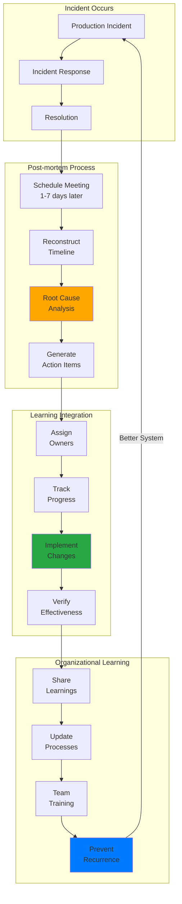

# Module 5: Operational Excellence - The Art of Running Systems at Scale

!!! abstract "The Apex Learner's Protocol for Operational Excellence"
    This module implements focused learning bursts, spaced repetition, and active retrieval to master operational excellence principles. You'll learn why **your 99.9% uptime system is actually a disaster waiting to happen—and how to build systems that heal themselves**.

## Foundation: The Brutal Reality of Production

### The $100M Wake-Up Call

Amazon, 2017: S3 went down for 4 hours. Result? Millions of websites offline, $150 million in losses, and a stark reminder that uptime isn't optional—it's existential.

**The Mathematical Reality**:
- 99% uptime = 87.6 hours of downtime per year
- 99.9% uptime = 8.76 hours of downtime per year  
- 99.99% uptime = 52.6 minutes of downtime per year
- 99.999% uptime = 5.26 minutes of downtime per year

The difference between 99.9% and 99.99% isn't just a decimal point—it's the difference between being a liability and being a competitive advantage.

### The Six Pillars of Operational Excellence


## Your Learning Journey Map


---

## Focus Block 1: Observability and Monitoring - The Nervous System (30 min)

### PRIMING: "Why did Netflix know about their outage before their customers did?"

Netflix's monitoring system detected a 0.1% increase in error rates and automatically failed over to backup systems before customers experienced any issues. Meanwhile, your system probably doesn't even know it's failing until customers start complaining.

### CORE CONCEPT: The Three Pillars of Observability

**Observability = Metrics + Logs + Traces**

```python
# The Golden Signals Framework
class GoldenSignals:
    def __init__(self, service_name):
        self.service = service_name
        self.prometheus = PrometheusClient()
    
    def get_latency(self, percentile=0.99):
        """How long requests take"""
        query = f'''
            histogram_quantile({percentile},
                sum(rate(http_request_duration_seconds_bucket{{service="{self.service}"}}[5m]))
                by (le)
            )
        '''
        return self.prometheus.query(query)
    
    def get_traffic(self):
        """How many requests per second"""
        query = f'sum(rate(http_requests_total{{service="{self.service}"}}[5m]))'
        return self.prometheus.query(query)
    
    def get_errors(self):
        """What percentage of requests are failing"""
        query = f'''
            sum(rate(http_requests_total{{service="{self.service}",status=~"5.."}}[5m]))
            /
            sum(rate(http_requests_total{{service="{self.service}"}}[5m]))
            * 100
        '''
        return self.prometheus.query(query)
    
    def get_saturation(self):
        """How full your service is"""
        queries = {
            'cpu': f'avg(rate(container_cpu_usage_seconds_total{{service="{self.service}"}}[5m])) * 100',
            'memory': f'avg(container_memory_usage_bytes{{service="{self.service}"}}) / avg(container_spec_memory_limit_bytes{{service="{self.service}"}}) * 100',
            'disk': f'avg((node_filesystem_size_bytes - node_filesystem_free_bytes) / node_filesystem_size_bytes) * 100'
        }
        return {metric: self.prometheus.query(query) for metric, query in queries.items()}
```

**Distributed Tracing Architecture**:
```yaml
tracing_stack:
  instrumentation:
    automatic: OpenTelemetry auto-instrumentation
    manual: Strategic span creation for business logic
    sampling:
      head_based: 0.1% for normal traffic
      tail_based: 100% for errors and slow requests
  
  collection:
    agent: OpenTelemetry Collector
    batching: 1000 spans or 5 seconds
    retry: Exponential backoff with jitter
  
  storage:
    backend: Jaeger or Tempo
    retention: 
      - raw_traces: 7 days
      - aggregated_metrics: 30 days
      - error_traces: 90 days
  
  analysis:
    tools: [Jaeger UI, Grafana, Custom dashboards]
    alerts: Trace-based SLO violations
```

### VISUAL MODEL: The Observability Stack


### NEURAL BRIDGE: The Hospital ICU Analogy

An ICU monitors patients with dozens of sensors: heart rate, blood pressure, oxygen levels, brain activity. Each metric tells part of the story, but the magic happens when doctors see patterns across all metrics. Your distributed system needs the same level of monitoring—individual services are your patients, and you need to know their vital signs to keep them healthy.

### ACTIVE PRACTICE: Build a Golden Signals Dashboard

```python
# Implementation: Service Health Dashboard
import time
import random
from prometheus_client import Counter, Histogram, Gauge, start_http_server

class ServiceInstrumentation:
    def __init__(self, service_name):
        self.service_name = service_name
        
        # Golden Signals Metrics
        self.request_count = Counter(
            'http_requests_total',
            'Total HTTP requests',
            ['service', 'method', 'status']
        )
        
        self.request_duration = Histogram(
            'http_request_duration_seconds',
            'HTTP request duration',
            ['service', 'method']
        )
        
        self.active_connections = Gauge(
            'active_connections',
            'Active connections',
            ['service']
        )
        
        self.resource_usage = Gauge(
            'resource_usage_percent',
            'Resource usage percentage',
            ['service', 'resource']
        )
    
    def record_request(self, method, status_code, duration):
        """Record a request with all golden signals"""
        self.request_count.labels(
            service=self.service_name,
            method=method,
            status=status_code
        ).inc()
        
        self.request_duration.labels(
            service=self.service_name,
            method=method
        ).observe(duration)
    
    def update_resources(self, cpu_percent, memory_percent, disk_percent):
        """Update resource saturation metrics"""
        self.resource_usage.labels(service=self.service_name, resource='cpu').set(cpu_percent)
        self.resource_usage.labels(service=self.service_name, resource='memory').set(memory_percent)
        self.resource_usage.labels(service=self.service_name, resource='disk').set(disk_percent)

# Simulation: Generate realistic metrics
def simulate_production_load():
    instrumentation = ServiceInstrumentation("payment-api")
    
    while True:
        # Simulate various request patterns
        for _ in range(random.randint(10, 50)):  # Varying load
            method = random.choice(['GET', 'POST', 'PUT', 'DELETE'])
            
            # Realistic status code distribution
            if random.random() < 0.95:  # 95% success
                status = random.choice(['200', '201', '204'])
                duration = random.uniform(0.01, 0.1)  # Fast requests
            elif random.random() < 0.03:  # 3% client errors
                status = random.choice(['400', '401', '404'])
                duration = random.uniform(0.005, 0.02)
            else:  # 2% server errors
                status = random.choice(['500', '502', '503'])
                duration = random.uniform(0.1, 2.0)  # Slow failures
            
            instrumentation.record_request(method, status, duration)
        
        # Update resource metrics
        instrumentation.update_resources(
            cpu_percent=random.uniform(20, 80),
            memory_percent=random.uniform(30, 70),
            disk_percent=random.uniform(10, 40)
        )
        
        time.sleep(1)  # Update every second

if __name__ == "__main__":
    # Start Prometheus metrics server
    start_http_server(8000)
    print("Metrics server started on :8000/metrics")
    
    # Run simulation
    simulate_production_load()
```

**Exercise**: Create alerts for your golden signals:

```yaml
# alerts.yml - Prometheus Alert Rules
groups:
- name: golden_signals
  rules:
  - alert: HighErrorRate
    expr: |
      (
        sum(rate(http_requests_total{status=~"5.."}[5m]))
        /
        sum(rate(http_requests_total[5m]))
      ) * 100 > 5
    for: 2m
    labels:
      severity: critical
      team: platform
    annotations:
      summary: "High error rate detected"
      description: "Error rate is {{ $value }}% for the last 5 minutes"
      runbook: "https://runbooks.company.com/high-error-rate"
  
  - alert: HighLatency
    expr: |
      histogram_quantile(0.99,
        sum(rate(http_request_duration_seconds_bucket[5m])) by (le)
      ) > 0.5
    for: 5m
    labels:
      severity: warning
      team: platform
    annotations:
      summary: "High latency detected"
      description: "99th percentile latency is {{ $value }}s"
      runbook: "https://runbooks.company.com/high-latency"
  
  - alert: HighResourceUsage
    expr: resource_usage_percent{resource="cpu"} > 80
    for: 10m
    labels:
      severity: warning
      team: platform
    annotations:
      summary: "High CPU usage"
      description: "CPU usage is {{ $value }}% on {{ $labels.service }}"
      runbook: "https://runbooks.company.com/high-cpu"
```

### CONSOLIDATION PROMPT

Reflect on these questions:
1. **Signal vs. Noise**: How would you tune alert thresholds to minimize false positives while catching real issues?
2. **Correlation Patterns**: What combinations of metrics would indicate different types of problems (traffic spike vs. database issue vs. memory leak)?
3. **Business Context**: How would you translate technical metrics into business impact metrics that executives care about?

---

## Focus Block 2: Runbooks and Automation - The Playbook System (30 min)

### PRIMING: "Why does it take your team 2 hours to fix what should be a 5-minute problem?"

At 3 AM, your best engineer is trying to remember the 17-step process to restart a critical service while customers are screaming and executives are asking for updates. This isn't about intelligence—it's about having systems that work when humans are stressed, tired, and making mistakes.

### CORE CONCEPT: Runbook-Driven Operations

**The Runbook Hierarchy**:
```yaml
runbook_types:
  diagnostic:
    purpose: Understand what's wrong
    triggers: Automated alerts
    outcome: Root cause identification
    example: "Database connection pool exhausted"
  
  remediation:
    purpose: Fix the immediate problem
    triggers: Diagnostic confirmation
    outcome: Service restoration
    example: "Restart connection pool manager"
  
  preventive:
    purpose: Prevent recurrence
    triggers: Post-incident review
    outcome: System hardening
    example: "Increase connection pool size"
  
  emergency:
    purpose: Minimize blast radius
    triggers: Severity 1 incidents
    outcome: Damage containation
    example: "Activate disaster recovery"
```

**Executable Runbook Framework**:
```python
import asyncio
import logging
from dataclasses import dataclass
from typing import List, Dict, Optional
from enum import Enum

class StepStatus(Enum):
    PENDING = "pending"
    RUNNING = "running" 
    SUCCESS = "success"
    FAILED = "failed"
    SKIPPED = "skipped"

@dataclass
class RunbookStep:
    name: str
    description: str
    command: str
    timeout_seconds: int = 300
    retry_count: int = 3
    prerequisites: List[str] = None
    rollback_command: Optional[str] = None
    
class RunbookExecutor:
    def __init__(self, runbook_name: str):
        self.runbook_name = runbook_name
        self.steps: List[RunbookStep] = []
        self.execution_log: List[Dict] = []
        self.logger = logging.getLogger(f"runbook.{runbook_name}")
    
    def add_step(self, step: RunbookStep):
        self.steps.append(step)
    
    async def execute(self, context: Dict = None) -> bool:
        """Execute runbook with automatic rollback on failure"""
        context = context or {}
        successful_steps = []
        
        try:
            for step in self.steps:
                self.logger.info(f"Executing step: {step.name}")
                
                # Check prerequisites
                if not self._check_prerequisites(step, successful_steps):
                    self.logger.warning(f"Prerequisites not met for {step.name}")
                    self._log_step(step, StepStatus.SKIPPED, "Prerequisites not met")
                    continue
                
                # Execute with retries
                success = await self._execute_step_with_retry(step, context)
                
                if success:
                    successful_steps.append(step)
                    self._log_step(step, StepStatus.SUCCESS)
                else:
                    self._log_step(step, StepStatus.FAILED)
                    # Rollback previous steps
                    await self._rollback(successful_steps)
                    return False
            
            self.logger.info("Runbook execution completed successfully")
            return True
            
        except Exception as e:
            self.logger.error(f"Runbook execution failed: {e}")
            await self._rollback(successful_steps)
            return False
    
    async def _execute_step_with_retry(self, step: RunbookStep, context: Dict) -> bool:
        """Execute step with exponential backoff retry"""
        for attempt in range(step.retry_count + 1):
            try:
                # Substitute context variables in command
                command = self._substitute_variables(step.command, context)
                
                # Execute with timeout
                process = await asyncio.create_subprocess_shell(
                    command,
                    stdout=asyncio.subprocess.PIPE,
                    stderr=asyncio.subprocess.PIPE
                )
                
                stdout, stderr = await asyncio.wait_for(
                    process.communicate(),
                    timeout=step.timeout_seconds
                )
                
                if process.returncode == 0:
                    self.logger.info(f"Step {step.name} succeeded on attempt {attempt + 1}")
                    return True
                else:
                    error_msg = stderr.decode() if stderr else "Unknown error"
                    self.logger.warning(f"Step {step.name} failed on attempt {attempt + 1}: {error_msg}")
                    
                    if attempt < step.retry_count:
                        # Exponential backoff
                        wait_time = 2 ** attempt
                        await asyncio.sleep(wait_time)
                        
            except asyncio.TimeoutError:
                self.logger.error(f"Step {step.name} timed out on attempt {attempt + 1}")
            except Exception as e:
                self.logger.error(f"Step {step.name} failed on attempt {attempt + 1}: {e}")
        
        return False
    
    async def _rollback(self, successful_steps: List[RunbookStep]):
        """Execute rollback commands in reverse order"""
        self.logger.info("Starting rollback procedure")
        
        for step in reversed(successful_steps):
            if step.rollback_command:
                try:
                    process = await asyncio.create_subprocess_shell(
                        step.rollback_command,
                        stdout=asyncio.subprocess.PIPE,
                        stderr=asyncio.subprocess.PIPE
                    )
                    await process.communicate()
                    self.logger.info(f"Rolled back step: {step.name}")
                except Exception as e:
                    self.logger.error(f"Rollback failed for step {step.name}: {e}")
```

### VISUAL MODEL: Automated Response Pipeline


### NEURAL BRIDGE: The Emergency Room Protocol

When someone arrives at an ER, there's a triage system: check vitals, assess severity, follow protocols, document everything. ER doctors don't improvise—they follow evidence-based procedures that save lives. Your production systems need the same rigor: detect symptoms, classify severity, execute proven procedures, document outcomes.

### ACTIVE PRACTICE: Build an Automated Runbook System

```python
# Real-world example: Database Connection Pool Recovery
async def create_database_recovery_runbook():
    runbook = RunbookExecutor("database_connection_recovery")
    
    # Step 1: Diagnose the problem
    runbook.add_step(RunbookStep(
        name="check_connection_pool",
        description="Check current connection pool status",
        command="psql -h {db_host} -c \"SELECT count(*) as active_connections FROM pg_stat_activity;\"",
        timeout_seconds=30
    ))
    
    # Step 2: Check for long-running queries
    runbook.add_step(RunbookStep(
        name="identify_long_queries", 
        description="Find queries running longer than 5 minutes",
        command="""psql -h {db_host} -c "
            SELECT pid, now() - pg_stat_activity.query_start AS duration, query 
            FROM pg_stat_activity 
            WHERE (now() - pg_stat_activity.query_start) > interval '5 minutes';
        \"""",
        timeout_seconds=30
    ))
    
    # Step 3: Kill problematic connections
    runbook.add_step(RunbookStep(
        name="terminate_long_queries",
        description="Terminate queries running longer than 10 minutes",
        command="""psql -h {db_host} -c "
            SELECT pg_terminate_backend(pid) 
            FROM pg_stat_activity 
            WHERE (now() - pg_stat_activity.query_start) > interval '10 minutes';
        \"""",
        timeout_seconds=60,
        rollback_command="echo 'Cannot rollback terminated queries'"
    ))
    
    # Step 4: Restart connection pool if needed
    runbook.add_step(RunbookStep(
        name="restart_connection_pool",
        description="Restart application connection pool",
        command="kubectl rollout restart deployment/{app_name} -n {namespace}",
        timeout_seconds=300,
        prerequisites=["terminate_long_queries"],
        rollback_command="kubectl rollout undo deployment/{app_name} -n {namespace}"
    ))
    
    # Step 5: Verify recovery
    runbook.add_step(RunbookStep(
        name="verify_recovery",
        description="Verify system is healthy",
        command="curl -f http://{app_url}/health",
        timeout_seconds=60,
        retry_count=5
    ))
    
    return runbook

# Advanced: Self-Healing System Integration
class SelfHealingOrchestrator:
    def __init__(self):
        self.runbooks = {}
        self.execution_history = []
        self.learning_model = None
    
    def register_runbook(self, trigger_pattern: str, runbook: RunbookExecutor):
        """Register runbook for specific alert patterns"""
        self.runbooks[trigger_pattern] = runbook
    
    async def handle_alert(self, alert: Dict):
        """Automatically handle alerts with appropriate runbooks"""
        # Find matching runbook
        runbook = self._find_runbook(alert)
        if not runbook:
            await self._escalate_to_human(alert)
            return
        
        # Execute with circuit breaker logic
        if self._should_auto_execute(alert, runbook):
            context = self._build_execution_context(alert)
            success = await runbook.execute(context)
            
            # Learn from execution
            self._record_execution(alert, runbook, success)
            
            if not success:
                await self._escalate_to_human(alert)
        else:
            await self._request_human_approval(alert, runbook)
    
    def _should_auto_execute(self, alert: Dict, runbook: RunbookExecutor) -> bool:
        """Decide if runbook should execute automatically"""
        # Check success rate history
        recent_executions = self._get_recent_executions(runbook.runbook_name)
        if len(recent_executions) > 5:
            success_rate = sum(1 for ex in recent_executions if ex['success']) / len(recent_executions)
            if success_rate < 0.8:  # Less than 80% success rate
                return False
        
        # Check alert severity
        if alert.get('severity') == 'critical':
            return True
        
        # Check time of day (be more conservative during business hours)
        import datetime
        current_hour = datetime.datetime.now().hour
        if 9 <= current_hour <= 17:  # Business hours
            return alert.get('severity') != 'low'
        
        return True
```

### CONSOLIDATION PROMPT

Consider these scenarios:
1. **Runbook Evolution**: How would you update runbooks based on execution failures and new incident patterns?
2. **Human Oversight**: When should runbooks require human approval vs. execute automatically?
3. **Cross-System Dependencies**: How would you handle runbooks that affect multiple services or systems?

---

## Focus Block 3: Incident Response - The Emergency Protocol (30 min)

### PRIMING: "Why does a 5-minute outage turn into a 2-hour incident?"

GitHub, 2021: A database failover took 6 minutes. The incident lasted 4 hours. The extra time? Coordination overhead, unclear communication, and teams stepping on each other. The technical fix was simple—the human coordination was catastrophic.

### CORE CONCEPT: Incident Command System (ICS)

**The ICS Structure**:
```yaml
incident_command_system:
  incident_commander:
    role: Single point of decision-making authority
    responsibilities:
      - Overall incident strategy
      - Resource allocation
      - Communication with executives
      - Declaring incident resolution
    
  operations_chief:
    role: Technical work coordination
    responsibilities:
      - Coordinate technical teams
      - Execute remediation plan
      - Report status to IC
    
  communications_lead:
    role: Information flow management
    responsibilities:
      - Customer communication
      - Internal status updates
      - Media relations if needed
    
  planning_chief:
    role: Documentation and future planning
    responsibilities:
      - Incident timeline
      - Resource tracking
      - Post-incident analysis prep
```

**Incident Severity Framework**:
```python
from enum import Enum
from dataclasses import dataclass
from typing import List, Optional
import datetime

class Severity(Enum):
    SEV1 = "sev1"  # Complete outage, data loss
    SEV2 = "sev2"  # Significant degradation
    SEV3 = "sev3"  # Minor issues
    SEV4 = "sev4"  # Planned maintenance

class ImpactLevel(Enum):
    CRITICAL = "critical"     # All customers affected
    HIGH = "high"            # Major customer subset
    MEDIUM = "medium"        # Minor customer subset  
    LOW = "low"             # Internal only

@dataclass
class IncidentContext:
    title: str
    severity: Severity
    impact: ImpactLevel
    affected_services: List[str]
    customer_impact_description: str
    started_at: datetime.datetime
    detected_at: datetime.datetime
    commander: str
    war_room: str

class IncidentManager:
    def __init__(self):
        self.active_incidents = {}
        self.notification_channels = {}
        self.escalation_policies = {}
    
    def declare_incident(self, context: IncidentContext) -> str:
        """Declare new incident and kickoff response"""
        incident_id = self._generate_incident_id()
        
        # Create incident record
        incident = {
            'id': incident_id,
            'context': context,
            'timeline': [],
            'status': 'active',
            'roles': {},
            'actions': []
        }
        
        self.active_incidents[incident_id] = incident
        
        # Immediate actions based on severity
        if context.severity in [Severity.SEV1, Severity.SEV2]:
            # Page incident commander immediately
            self._page_commander(context.commander)
            
            # Create dedicated war room
            self._create_war_room(incident_id)
            
            # Notify executives for SEV1
            if context.severity == Severity.SEV1:
                self._notify_executives(incident)
        
        # Start communication timeline
        self._log_timeline_event(incident_id, "incident_declared", {
            'severity': context.severity.value,
            'commander': context.commander
        })
        
        # Send initial notifications
        self._send_initial_notifications(incident)
        
        return incident_id
    
    def update_status(self, incident_id: str, update: str, author: str):
        """Add status update to incident"""
        incident = self.active_incidents[incident_id]
        
        update_entry = {
            'timestamp': datetime.datetime.utcnow(),
            'author': author,
            'content': update,
            'type': 'status_update'
        }
        
        incident['timeline'].append(update_entry)
        
        # Broadcast update to all channels
        self._broadcast_update(incident, update_entry)
    
    def escalate_severity(self, incident_id: str, new_severity: Severity, reason: str):
        """Escalate incident to higher severity"""
        incident = self.active_incidents[incident_id]
        old_severity = incident['context'].severity
        
        incident['context'].severity = new_severity
        
        # Additional notifications for escalation
        if new_severity == Severity.SEV1 and old_severity != Severity.SEV1:
            self._notify_executives(incident)
            self._page_additional_responders(incident)
        
        self._log_timeline_event(incident_id, "severity_escalated", {
            'from': old_severity.value,
            'to': new_severity.value,
            'reason': reason
        })
    
    def assign_role(self, incident_id: str, role: str, person: str):
        """Assign specific role to team member"""
        incident = self.active_incidents[incident_id]
        incident['roles'][role] = person
        
        self._log_timeline_event(incident_id, "role_assigned", {
            'role': role,
            'person': person
        })
        
        # Send role-specific notifications
        self._send_role_notification(person, role, incident_id)
    
    def resolve_incident(self, incident_id: str, resolution_summary: str):
        """Mark incident as resolved"""
        incident = self.active_incidents[incident_id]
        
        incident['status'] = 'resolved'
        incident['resolved_at'] = datetime.datetime.utcnow()
        incident['resolution_summary'] = resolution_summary
        
        # Calculate metrics
        duration = incident['resolved_at'] - incident['context'].started_at
        detection_delay = incident['context'].detected_at - incident['context'].started_at
        
        self._log_timeline_event(incident_id, "incident_resolved", {
            'duration_minutes': duration.total_seconds() / 60,
            'detection_delay_minutes': detection_delay.total_seconds() / 60,
            'resolution_summary': resolution_summary
        })
        
        # Send resolution notifications
        self._send_resolution_notifications(incident)
        
        # Schedule post-mortem
        self._schedule_postmortem(incident)
```

### VISUAL MODEL: Incident Response Flow


### NEURAL BRIDGE: The Emergency Room Response

When someone arrives at an ER with a heart attack, there's no debate about who's in charge or what to do next. The attending physician takes command, assigns roles, and everyone executes their part of a well-rehearsed protocol. Your incident response needs the same clarity of command and proven procedures.

### ACTIVE PRACTICE: Simulate a Production Incident

```python
# Incident Response Simulation Framework
import asyncio
import random
from datetime import datetime, timedelta

class IncidentSimulator:
    def __init__(self):
        self.incident_scenarios = {
            'database_outage': {
                'title': 'Primary database connection failure',
                'severity': Severity.SEV1,
                'impact': ImpactLevel.CRITICAL,
                'affected_services': ['user-auth', 'payment', 'inventory'],
                'symptoms': [
                    'Connection timeouts increasing',
                    '500 errors spiking to 50%',
                    'Response times > 30 seconds'
                ],
                'resolution_steps': [
                    'Failover to secondary database',
                    'Restart connection pools',
                    'Verify data consistency',
                    'Monitor for additional issues'
                ]
            },
            'memory_leak': {
                'title': 'Memory leak causing service degradation',
                'severity': Severity.SEV2,
                'impact': ImpactLevel.HIGH,
                'affected_services': ['recommendation-engine'],
                'symptoms': [
                    'Memory usage climbing to 95%',
                    'Garbage collection pauses > 1s',
                    'Request queuing observed'
                ],
                'resolution_steps': [
                    'Restart affected instances',
                    'Enable heap dumps',
                    'Scale up temporary capacity',
                    'Analyze memory usage patterns'
                ]
            }
        }
    
    async def run_simulation(self, scenario_name: str):
        """Run incident response simulation"""
        scenario = self.incident_scenarios[scenario_name]
        
        print(f"\n=== INCIDENT SIMULATION: {scenario['title']} ===")
        print(f"Severity: {scenario['severity'].value.upper()}")
        print(f"Affected Services: {', '.join(scenario['affected_services'])}")
        print("\nSYMPTOMS OBSERVED:")
        for symptom in scenario['symptoms']:
            print(f"  - {symptom}")
        
        # Simulate detection delay
        detection_delay = random.randint(2, 15)  # 2-15 minutes
        print(f"\n⏱️  Detection delay: {detection_delay} minutes")
        await asyncio.sleep(2)  # Simulate time passage
        
        # Create incident context
        context = IncidentContext(
            title=scenario['title'],
            severity=scenario['severity'],
            impact=scenario['impact'],
            affected_services=scenario['affected_services'],
            customer_impact_description=f"Customers experiencing issues with {', '.join(scenario['affected_services'])}",
            started_at=datetime.utcnow() - timedelta(minutes=detection_delay),
            detected_at=datetime.utcnow(),
            commander="oncall-engineer@company.com",
            war_room="incident-response"
        )
        
        # Initialize incident manager
        incident_manager = IncidentManager()
        incident_id = incident_manager.declare_incident(context)
        
        print(f"\n🚨 INCIDENT {incident_id} DECLARED")
        print("Incident Commander notified")
        print("War room created")
        
        # Simulate response phases
        await self._simulate_response_phase(incident_manager, incident_id, scenario)
        
        return incident_id
    
    async def _simulate_response_phase(self, incident_manager, incident_id, scenario):
        """Simulate the incident response process"""
        
        # Phase 1: Team mobilization
        print("\n📞 MOBILIZING RESPONSE TEAM")
        await asyncio.sleep(1)
        
        incident_manager.assign_role(incident_id, "operations_chief", "senior-sre@company.com")
        incident_manager.assign_role(incident_id, "communications_lead", "support-lead@company.com")
        
        # Phase 2: Initial assessment
        print("\n🔍 INITIAL ASSESSMENT")
        await asyncio.sleep(2)
        
        incident_manager.update_status(incident_id, 
            "Team assembled. Beginning root cause analysis.", 
            "operations_chief")
        
        # Phase 3: Mitigation attempts
        print("\n🔧 ATTEMPTING MITIGATION")
        for i, step in enumerate(scenario['resolution_steps'], 1):
            await asyncio.sleep(random.randint(3, 8))  # Realistic timing
            
            success_probability = 0.7 + (i * 0.1)  # Later steps more likely to succeed
            success = random.random() < success_probability
            
            if success:
                print(f"✅ Step {i}: {step} - SUCCESS")
                incident_manager.update_status(incident_id,
                    f"Completed: {step}. Monitoring impact...",
                    "operations_chief")
            else:
                print(f"❌ Step {i}: {step} - FAILED")
                incident_manager.update_status(incident_id,
                    f"Failed: {step}. Trying next approach...",
                    "operations_chief")
        
        # Phase 4: Resolution
        print("\n✅ INCIDENT RESOLVED")
        incident_manager.resolve_incident(incident_id,
            "Primary issue resolved. All services restored to normal operation.")
        
        print(f"\n📊 INCIDENT METRICS:")
        incident = incident_manager.active_incidents[incident_id]
        duration = incident['resolved_at'] - incident['context'].started_at
        print(f"  Total duration: {duration.total_seconds()/60:.1f} minutes")
        print(f"  Detection delay: {(incident['context'].detected_at - incident['context'].started_at).total_seconds()/60:.1f} minutes")

# Run the simulation
async def main():
    simulator = IncidentSimulator()
    await simulator.run_simulation('database_outage')
    
    print("\n🎯 SIMULATION DEBRIEF:")
    print("1. Was the incident commander clearly identified?")
    print("2. Were roles and responsibilities clear?")
    print("3. Was communication frequent and informative?") 
    print("4. Were mitigation steps systematic and documented?")
    print("5. What could be improved for next time?")

# Uncomment to run simulation
# asyncio.run(main())
```

### CONSOLIDATION PROMPT

Analyze these incident response patterns:
1. **Command Structure**: How does clear incident command reduce coordination overhead during high-stress situations?
2. **Communication Strategy**: What's the difference between technical updates for engineers and status updates for customers?
3. **Escalation Triggers**: When should incident severity be escalated, and how do you avoid both under-escalation and over-escalation?

---

## Focus Block 4: Post-mortems - The Learning Protocol (30 min)

### PRIMING: "Why do 60% of incidents happen twice?"

Stripe's 2019 outage was caused by the exact same configuration error that had caused an outage 8 months earlier. Same root cause, same symptoms, same fix. The difference? They hadn't followed through on the action items from the first post-mortem. Knowledge without action is just expensive documentation.

### CORE CONCEPT: Blameless Post-mortem Culture

**The Blameless Principle**:
```yaml
blameless_culture:
  assumptions:
    - People had good intentions
    - Everyone made reasonable decisions with available information
    - Systems and processes failed, not people
    - Multiple factors contributed to the incident
  
  focus_areas:
    instead_of_blame: Focus on system improvements
    instead_of_who: Focus on what and why
    instead_of_punishment: Focus on prevention
    instead_of_perfection: Focus on resilience
  
  outcomes:
    psychological_safety: People report issues early
    honest_reporting: Complete timeline reconstruction
    system_thinking: Holistic problem solving
    continuous_learning: Organization-wide improvement
```

**Post-mortem Framework**:
```python
from dataclasses import dataclass
from typing import List, Dict, Optional
from datetime import datetime
from enum import Enum

class ActionPriority(Enum):
    P0 = "critical"    # Fix immediately
    P1 = "high"        # Fix within 1 week
    P2 = "medium"      # Fix within 1 month
    P3 = "low"         # Fix when possible

@dataclass
class RootCause:
    description: str
    category: str  # human, process, technology, external
    contributing_factors: List[str]
    evidence: List[str]

@dataclass
class ActionItem:
    description: str
    owner: str
    priority: ActionPriority
    due_date: datetime
    prevention_type: str  # immediate, short_term, long_term
    success_criteria: str
    estimated_effort: str

@dataclass
class PostMortem:
    incident_id: str
    title: str
    date: datetime
    facilitator: str
    participants: List[str]
    
    # The 5 key sections
    summary: str
    timeline: List[Dict]
    root_causes: List[RootCause]
    what_went_well: List[str]
    what_went_wrong: List[str]
    action_items: List[ActionItem]
    
    # Metrics
    detection_time_minutes: int
    resolution_time_minutes: int
    customer_impact_duration_minutes: int
    affected_users: Optional[int]

class PostMortemProcess:
    def __init__(self):
        self.templates = {}
        self.facilitators = []
        self.action_tracker = ActionTracker()
    
    def schedule_postmortem(self, incident_id: str, severity: str) -> datetime:
        """Schedule post-mortem based on incident severity"""
        schedule_delays = {
            'sev1': 1,  # Next business day
            'sev2': 3,  # Within 3 days  
            'sev3': 7,  # Within a week
            'sev4': 14  # Within two weeks
        }
        
        delay_days = schedule_delays.get(severity, 7)
        meeting_time = datetime.now() + timedelta(days=delay_days)
        
        # Assign facilitator (not the incident commander to avoid bias)
        facilitator = self._assign_facilitator(incident_id)
        
        # Send calendar invites to key participants
        participants = self._identify_participants(incident_id)
        
        return self._create_meeting(incident_id, meeting_time, facilitator, participants)
    
    def conduct_postmortem(self, incident_data: Dict) -> PostMortem:
        """Facilitate structured post-mortem discussion"""
        
        # Phase 1: Timeline reconstruction
        print("📅 PHASE 1: Timeline Reconstruction")
        timeline = self._reconstruct_timeline(incident_data)
        
        # Phase 2: Root cause analysis using 5 Whys
        print("🔍 PHASE 2: Root Cause Analysis") 
        root_causes = self._identify_root_causes(timeline, incident_data)
        
        # Phase 3: Identify what went well/wrong
        print("⚖️ PHASE 3: What Went Well/Wrong")
        what_went_well, what_went_wrong = self._analyze_response(incident_data)
        
        # Phase 4: Generate action items
        print("📝 PHASE 4: Action Item Generation")
        action_items = self._generate_action_items(root_causes, what_went_wrong)
        
        # Phase 5: Prioritize and assign
        print("🎯 PHASE 5: Prioritization and Assignment")
        prioritized_actions = self._prioritize_actions(action_items)
        
        postmortem = PostMortem(
            incident_id=incident_data['id'],
            title=incident_data['title'],
            date=datetime.now(),
            facilitator=incident_data.get('facilitator'),
            participants=incident_data.get('participants', []),
            summary=self._generate_summary(incident_data, root_causes),
            timeline=timeline,
            root_causes=root_causes,
            what_went_well=what_went_well,
            what_went_wrong=what_went_wrong,
            action_items=prioritized_actions,
            detection_time_minutes=incident_data.get('detection_time', 0),
            resolution_time_minutes=incident_data.get('resolution_time', 0),
            customer_impact_duration_minutes=incident_data.get('customer_impact', 0),
            affected_users=incident_data.get('affected_users')
        )
        
        # Track action items
        for action in prioritized_actions:
            self.action_tracker.add_action(action)
        
        return postmortem
    
    def _identify_root_causes(self, timeline: List[Dict], incident_data: Dict) -> List[RootCause]:
        """Use 5 Whys methodology to identify root causes"""
        root_causes = []
        
        # Start with immediate cause
        immediate_cause = incident_data.get('immediate_cause', 'Service failure')
        
        # Apply 5 Whys technique
        current_why = immediate_cause
        whys = [current_why]
        
        for i in range(4):  # Ask "why" 4 more times (total of 5)
            next_why = input(f"Why did '{current_why}' happen? ")
            whys.append(next_why)
            current_why = next_why
        
        # Categorize the final "why" as root cause
        root_cause_category = self._categorize_cause(whys[-1])
        
        root_cause = RootCause(
            description=whys[-1],
            category=root_cause_category,
            contributing_factors=whys[:-1],  # All but the last why
            evidence=self._gather_evidence(timeline, whys[-1])
        )
        
        root_causes.append(root_cause)
        return root_causes
    
    def _generate_action_items(self, root_causes: List[RootCause], what_went_wrong: List[str]) -> List[ActionItem]:
        """Generate specific, actionable items from analysis"""
        actions = []
        
        for root_cause in root_causes:
            # Immediate fixes
            immediate_action = ActionItem(
                description=f"Implement immediate fix for: {root_cause.description}",
                owner="TBD",
                priority=ActionPriority.P0,
                due_date=datetime.now() + timedelta(days=3),
                prevention_type="immediate",
                success_criteria="Root cause cannot recur in same way",
                estimated_effort="1-2 days"
            )
            actions.append(immediate_action)
            
            # Long-term prevention
            prevention_action = ActionItem(
                description=f"Implement systematic prevention for: {root_cause.category} failures",
                owner="TBD", 
                priority=ActionPriority.P1,
                due_date=datetime.now() + timedelta(weeks=4),
                prevention_type="long_term",
                success_criteria="Similar failure categories prevented",
                estimated_effort="1-2 weeks"
            )
            actions.append(prevention_action)
        
        # Process improvements from what went wrong
        for issue in what_went_wrong:
            if "communication" in issue.lower():
                actions.append(ActionItem(
                    description="Improve incident communication process",
                    owner="TBD",
                    priority=ActionPriority.P2,
                    due_date=datetime.now() + timedelta(weeks=6),
                    prevention_type="process",
                    success_criteria="Communication delays < 5 minutes",
                    estimated_effort="1 week"
                ))
        
        return actions

class ActionTracker:
    def __init__(self):
        self.actions = {}
        self.completion_rate_target = 0.85
    
    def add_action(self, action: ActionItem):
        """Track new action item"""
        action_id = f"action_{len(self.actions) + 1}"
        self.actions[action_id] = {
            'action': action,
            'status': 'open',
            'created_date': datetime.now(),
            'updates': []
        }
    
    def get_completion_rate(self) -> float:
        """Calculate action item completion rate"""
        if not self.actions:
            return 1.0
        
        completed = sum(1 for a in self.actions.values() if a['status'] == 'completed')
        return completed / len(self.actions)
    
    def get_overdue_actions(self) -> List[ActionItem]:
        """Get actions past their due date"""
        now = datetime.now()
        overdue = []
        
        for action_data in self.actions.values():
            action = action_data['action']
            if action.due_date < now and action_data['status'] != 'completed':
                overdue.append(action)
        
        return overdue
    
    def generate_report(self) -> Dict:
        """Generate action item tracking report"""
        total_actions = len(self.actions)
        completed_actions = sum(1 for a in self.actions.values() if a['status'] == 'completed')
        overdue_actions = len(self.get_overdue_actions())
        
        return {
            'total_actions': total_actions,
            'completed_actions': completed_actions,
            'completion_rate': completed_actions / total_actions if total_actions > 0 else 0,
            'overdue_actions': overdue_actions,
            'on_track': overdue_actions == 0 and self.get_completion_rate() >= self.completion_rate_target
        }
```

### VISUAL MODEL: Post-mortem Learning Cycle



### NEURAL BRIDGE: The Aviation Safety Model

Aviation has the best safety record of any transportation mode because every incident, no matter how small, generates a detailed post-mortem that's shared across the entire industry. Pilots worldwide learn from each other's mistakes. Your engineering organization needs the same culture of shared learning and systematic improvement.

### ACTIVE PRACTICE: Conduct a Simulated Post-mortem

```python
# Post-mortem Simulation Exercise
def simulate_postmortem():
    # Scenario: Database connection pool exhaustion
    incident_data = {
        'id': 'INC-2024-001',
        'title': 'Payment service degradation due to database connection exhaustion',
        'severity': 'sev2',
        'started_at': '2024-01-15T14:30:00Z',
        'detected_at': '2024-01-15T14:45:00Z', 
        'resolved_at': '2024-01-15T16:20:00Z',
        'detection_time': 15,  # minutes
        'resolution_time': 110,  # minutes
        'customer_impact': 95,  # minutes
        'affected_users': 15000,
        'immediate_cause': 'Database connection pool exhausted',
        'facilitator': 'senior-engineer@company.com',
        'participants': [
            'incident-commander@company.com',
            'database-admin@company.com', 
            'payment-team-lead@company.com',
            'customer-support-lead@company.com'
        ]
    }
    
    # Simulate the 5 Whys process
    print("🔍 ROOT CAUSE ANALYSIS (5 Whys)")
    print("=" * 50)
    
    whys = [
        "Database connection pool was exhausted",
        "Connection pool size was too small for traffic spike",
        "Auto-scaling didn't increase connection pool size",
        "Connection pool configuration was static, not dynamic",
        "We didn't design for traffic elasticity from the beginning"
    ]
    
    for i, why in enumerate(whys, 1):
        print(f"Why #{i}: {why}")
    
    print(f"\n🎯 ROOT CAUSE: {whys[-1]}")
    
    # Generate action items
    print("\n📝 ACTION ITEMS")
    print("=" * 50)
    
    actions = [
        {
            'description': 'Implement dynamic connection pool sizing',
            'owner': 'database-team',
            'priority': 'P0',
            'due_date': '2024-01-22',
            'effort': '3 days'
        },
        {
            'description': 'Add connection pool monitoring and alerting',
            'owner': 'platform-team',
            'priority': 'P0', 
            'due_date': '2024-01-25',
            'effort': '2 days'
        },
        {
            'description': 'Create runbook for connection pool exhaustion',
            'owner': 'on-call-team',
            'priority': 'P1',
            'due_date': '2024-02-01',
            'effort': '1 day'
        },
        {
            'description': 'Review all static configuration for elasticity',
            'owner': 'architecture-team',
            'priority': 'P2',
            'due_date': '2024-02-15',
            'effort': '2 weeks'
        }
    ]
    
    for i, action in enumerate(actions, 1):
        print(f"{i}. {action['description']}")
        print(f"   Owner: {action['owner']}")
        print(f"   Priority: {action['priority']}")
        print(f"   Due: {action['due_date']}")
        print(f"   Effort: {action['effort']}")
        print()
    
    # What went well/wrong analysis
    print("✅ WHAT WENT WELL")
    print("=" * 50)
    went_well = [
        "Incident detected within 15 minutes via automated monitoring",
        "Clear incident command structure established quickly", 
        "Effective communication with customer support team",
        "Rollback procedure executed successfully"
    ]
    
    for item in went_well:
        print(f"• {item}")
    
    print("\n❌ WHAT WENT WRONG")
    print("=" * 50)
    went_wrong = [
        "Connection pool exhaustion not detected proactively",
        "No automated recovery mechanism in place",
        "Resolution took longer due to manual configuration changes",
        "Customer impact communication delayed by 20 minutes"
    ]
    
    for item in went_wrong:
        print(f"• {item}")
    
    print("\n📊 INCIDENT METRICS")
    print("=" * 50)
    print(f"Detection Time: {incident_data['detection_time']} minutes")
    print(f"Resolution Time: {incident_data['resolution_time']} minutes") 
    print(f"Customer Impact: {incident_data['customer_impact']} minutes")
    print(f"Affected Users: {incident_data['affected_users']:,}")
    
    return incident_data, actions

# Run the simulation
# simulate_postmortem()
```

### CONSOLIDATION PROMPT

Evaluate these post-mortem effectiveness factors:
1. **Blameless Culture**: How do you ensure people feel safe reporting the full truth about what happened?
2. **Action Item Follow-through**: What systems ensure action items actually get completed, not just assigned?
3. **Organizational Learning**: How do you share learnings across teams so the entire organization benefits?

---

## Focus Block 5: Continuous Improvement - The Evolution Engine (30 min)

### PRIMING: "Why do some teams get stronger after every incident while others just get more stressed?"

Google's SRE team tracks "toil"—repetitive operational work that doesn't scale. Their rule: if you spend more than 50% of your time on toil, you're not improving the system, you're just keeping it alive. The best teams systematically eliminate toil and build systems that get more reliable over time.

### CORE CONCEPT: The Toil Reduction Framework

**Toil Identification Matrix**:
```yaml
toil_characteristics:
  manual: Requires human intervention
  repetitive: Done multiple times
  automatable: Could be automated
  tactical: Interrupt-driven, reactive
  no_enduring_value: Doesn't improve system
  scales_linearly: Grows proportionally with service
  
toil_examples:
  high_toil:
    - Manual deployment rollouts
    - Certificate renewals
    - Log file cleanup
    - Database backup verification
    - Service restart procedures
    
  low_toil:
    - Architectural design
    - Performance optimization
    - Security improvements
    - Capacity planning
    - Team mentoring
```

**Continuous Improvement Framework**:
```python
from dataclasses import dataclass
from typing import List, Dict
from datetime import datetime, timedelta
from enum import Enum

class ImprovementType(Enum):
    AUTOMATION = "automation"
    PROCESS = "process"
    TOOLING = "tooling"
    TRAINING = "training"
    ARCHITECTURE = "architecture"

class ImprovementPriority(Enum):
    CRITICAL = 1  # Prevents incidents
    HIGH = 2      # Reduces toil significantly
    MEDIUM = 3    # Improves efficiency
    LOW = 4       # Nice to have

@dataclass
class ImprovementItem:
    title: str
    description: str
    improvement_type: ImprovementType
    priority: ImprovementPriority
    estimated_effort_hours: int
    estimated_time_saved_hours_per_month: int
    created_date: datetime
    owner: str
    status: str = "proposed"

class ContinuousImprovementTracker:
    def __init__(self):
        self.improvements = []
        self.completed_improvements = []
        self.toil_baseline = {}
        self.metrics = {}
    
    def measure_current_toil(self, team_member: str, week_data: Dict) -> Dict:
        """Measure toil percentage for team member"""
        total_hours = week_data.get('total_work_hours', 40)
        
        toil_activities = {
            'manual_deployments': week_data.get('deployment_time', 0),
            'incident_response': week_data.get('incident_time', 0),
            'manual_monitoring': week_data.get('monitoring_time', 0),
            'ticket_triaging': week_data.get('triage_time', 0),
            'manual_testing': week_data.get('testing_time', 0)
        }
        
        total_toil_hours = sum(toil_activities.values())
        toil_percentage = (total_toil_hours / total_hours) * 100
        
        return {
            'team_member': team_member,
            'total_hours': total_hours,
            'toil_hours': total_toil_hours,
            'toil_percentage': toil_percentage,
            'toil_breakdown': toil_activities,
            'week_ending': datetime.now().strftime('%Y-%m-%d')
        }
    
    def identify_improvement_opportunities(self, toil_data: List[Dict]) -> List[ImprovementItem]:
        """Analyze toil data to identify improvement opportunities"""
        opportunities = []
        
        # Aggregate toil across team
        toil_summary = {}
        for data in toil_data:
            for activity, hours in data['toil_breakdown'].items():
                toil_summary[activity] = toil_summary.get(activity, 0) + hours
        
        # Generate improvement suggestions
        for activity, total_hours in toil_summary.items():
            if total_hours > 5:  # More than 5 hours per week team-wide
                improvement = self._generate_improvement_suggestion(activity, total_hours)
                if improvement:
                    opportunities.append(improvement)
        
        return sorted(opportunities, key=lambda x: x.priority.value)
    
    def _generate_improvement_suggestion(self, activity: str, hours_per_week: float) -> ImprovementItem:
        """Generate specific improvement suggestions based on toil type"""
        suggestions = {
            'manual_deployments': ImprovementItem(
                title="Implement automated deployment pipeline",
                description="Create CI/CD pipeline with automated testing and deployment",
                improvement_type=ImprovementType.AUTOMATION,
                priority=ImprovementPriority.HIGH,
                estimated_effort_hours=80,
                estimated_time_saved_hours_per_month=int(hours_per_week * 4 * 0.8),
                created_date=datetime.now(),
                owner="platform-team"
            ),
            
            'manual_monitoring': ImprovementItem(
                title="Implement proactive alerting",
                description="Replace manual log checking with automated monitoring and alerting",
                improvement_type=ImprovementType.TOOLING,
                priority=ImprovementPriority.HIGH,
                estimated_effort_hours=40,
                estimated_time_saved_hours_per_month=int(hours_per_week * 4 * 0.7),
                created_date=datetime.now(),
                owner="sre-team"
            ),
            
            'ticket_triaging': ImprovementItem(
                title="Implement intelligent ticket routing",
                description="Use ML/rules-based system to automatically route and prioritize tickets",
                improvement_type=ImprovementType.AUTOMATION,
                priority=ImprovementPriority.MEDIUM,
                estimated_effort_hours=60,
                estimated_time_saved_hours_per_month=int(hours_per_week * 4 * 0.5),
                created_date=datetime.now(),
                owner="support-platform-team"
            )
        }
        
        return suggestions.get(activity)
    
    def calculate_roi(self, improvement: ImprovementItem) -> Dict:
        """Calculate return on investment for improvement"""
        # Assume average hourly cost of engineering time
        hourly_cost = 100  # $100/hour loaded cost
        
        implementation_cost = improvement.estimated_effort_hours * hourly_cost
        monthly_savings = improvement.estimated_time_saved_hours_per_month * hourly_cost
        
        if monthly_savings == 0:
            payback_months = float('inf')
        else:
            payback_months = implementation_cost / monthly_savings
        
        annual_savings = monthly_savings * 12
        net_benefit_year_1 = annual_savings - implementation_cost
        
        return {
            'implementation_cost': implementation_cost,
            'monthly_savings': monthly_savings,
            'annual_savings': annual_savings,
            'payback_months': payback_months,
            'net_benefit_year_1': net_benefit_year_1,
            'roi_year_1': (net_benefit_year_1 / implementation_cost) * 100 if implementation_cost > 0 else 0
        }
    
    def prioritize_improvements(self, improvements: List[ImprovementItem]) -> List[Dict]:
        """Prioritize improvements by ROI and strategic value"""
        prioritized = []
        
        for improvement in improvements:
            roi_data = self.calculate_roi(improvement)
            
            # Strategic scoring (0-10 scale)
            strategic_scores = {
                ImprovementType.AUTOMATION: 9,    # High strategic value
                ImprovementType.ARCHITECTURE: 8,  # Long-term value
                ImprovementType.TOOLING: 7,       # Good efficiency gains
                ImprovementType.PROCESS: 6,       # Moderate value
                ImprovementType.TRAINING: 5       # Important but slower ROI
            }
            
            priority_multipliers = {
                ImprovementPriority.CRITICAL: 2.0,
                ImprovementPriority.HIGH: 1.5,
                ImprovementPriority.MEDIUM: 1.0,
                ImprovementPriority.LOW: 0.5
            }
            
            strategic_score = strategic_scores[improvement.improvement_type]
            priority_multiplier = priority_multipliers[improvement.priority]
            
            # Combined score: ROI + Strategic Value + Priority
            if roi_data['payback_months'] < 12:  # Less than 1 year payback
                roi_score = min(10, 120 / roi_data['payback_months'])  # Scale to 10
            else:
                roi_score = 1
            
            combined_score = (roi_score * 0.4) + (strategic_score * 0.4) + (priority_multiplier * 2 * 0.2)
            
            prioritized.append({
                'improvement': improvement,
                'roi_data': roi_data,
                'strategic_score': strategic_score,
                'combined_score': combined_score
            })
        
        return sorted(prioritized, key=lambda x: x['combined_score'], reverse=True)

class ReliabilityGrowthTracker:
    def __init__(self):
        self.metrics_history = []
        self.improvement_events = []
    
    def record_monthly_metrics(self, month: str, metrics: Dict):
        """Record monthly reliability and efficiency metrics"""
        metric_entry = {
            'month': month,
            'uptime_percentage': metrics.get('uptime_percentage', 0),
            'mean_time_to_recovery_minutes': metrics.get('mttr_minutes', 0),
            'incident_count': metrics.get('incident_count', 0),
            'toil_percentage': metrics.get('toil_percentage', 0),
            'deployment_frequency_per_day': metrics.get('deployment_frequency', 0),
            'lead_time_hours': metrics.get('lead_time_hours', 0),
            'change_failure_rate': metrics.get('change_failure_rate', 0)
        }
        self.metrics_history.append(metric_entry)
    
    def calculate_reliability_trend(self) -> Dict:
        """Calculate trend in key reliability metrics"""
        if len(self.metrics_history) < 3:
            return {'status': 'insufficient_data'}
        
        recent_metrics = self.metrics_history[-3:]  # Last 3 months
        
        # Calculate trends
        uptime_trend = self._calculate_trend([m['uptime_percentage'] for m in recent_metrics])
        mttr_trend = self._calculate_trend([m['mean_time_to_recovery_minutes'] for m in recent_metrics])
        incident_trend = self._calculate_trend([m['incident_count'] for m in recent_metrics])
        toil_trend = self._calculate_trend([m['toil_percentage'] for m in recent_metrics])
        
        # Overall health score (0-100)
        latest = recent_metrics[-1]
        health_score = (
            latest['uptime_percentage'] * 0.3 +
            max(0, 100 - latest['mean_time_to_recovery_minutes']) * 0.2 +
            max(0, 100 - latest['incident_count'] * 10) * 0.2 +
            max(0, 100 - latest['toil_percentage']) * 0.3
        )
        
        return {
            'health_score': health_score,
            'uptime_trend': uptime_trend,
            'mttr_trend': mttr_trend, 
            'incident_trend': incident_trend,
            'toil_trend': toil_trend,
            'status': 'healthy' if health_score > 80 else 'needs_attention'
        }
    
    def _calculate_trend(self, values: List[float]) -> str:
        """Calculate if trend is improving, declining, or stable"""
        if len(values) < 2:
            return 'unknown'
        
        # Simple linear trend calculation
        differences = [values[i] - values[i-1] for i in range(1, len(values))]
        avg_change = sum(differences) / len(differences)
        
        # Threshold for significance (5% change)
        threshold = abs(values[0]) * 0.05
        
        if avg_change > threshold:
            return 'improving'
        elif avg_change < -threshold:
            return 'declining'
        else:
            return 'stable'
```

### VISUAL MODEL: Continuous Improvement Cycle


### NEURAL BRIDGE: The Fitness Training Analogy

A professional athlete doesn't just train harder—they measure performance, identify weaknesses, create targeted improvement plans, and track progress over time. Your operational excellence needs the same systematic approach: measure current state, identify bottlenecks, implement improvements, and validate results.

### ACTIVE PRACTICE: Design a Toil Reduction Program

```python
# Toil Assessment and Reduction Framework
def assess_team_toil():
    """Simulate toil assessment for a development team"""
    
    # Sample team toil data
    team_toil_data = [
        {
            'team_member': 'alice@company.com',
            'total_work_hours': 40,
            'deployment_time': 8,      # 8 hours per week on manual deployments
            'incident_time': 4,        # 4 hours on incident response
            'monitoring_time': 6,      # 6 hours checking logs/metrics
            'triage_time': 3,          # 3 hours triaging tickets
            'testing_time': 2          # 2 hours manual testing
        },
        {
            'team_member': 'bob@company.com', 
            'total_work_hours': 40,
            'deployment_time': 6,
            'incident_time': 8,        # More incident response
            'monitoring_time': 4,
            'triage_time': 2,
            'testing_time': 3
        },
        {
            'team_member': 'charlie@company.com',
            'total_work_hours': 40, 
            'deployment_time': 10,     # Lots of manual deployment work
            'incident_time': 2,
            'monitoring_time': 5,
            'triage_time': 4,
            'testing_time': 1
        }
    ]
    
    tracker = ContinuousImprovementTracker()
    
    print("🔍 TOIL ASSESSMENT RESULTS")
    print("=" * 60)
    
    # Analyze each team member's toil
    toil_results = []
    for data in team_toil_data:
        result = tracker.measure_current_toil(data['team_member'], data)
        toil_results.append(result)
        
        print(f"\nTeam Member: {result['team_member']}")
        print(f"Toil Percentage: {result['toil_percentage']:.1f}%")
        print(f"Toil Breakdown:")
        for activity, hours in result['toil_breakdown'].items():
            if hours > 0:
                print(f"  - {activity.replace('_', ' ').title()}: {hours} hours")
    
    # Calculate team averages
    avg_toil = sum(r['toil_percentage'] for r in toil_results) / len(toil_results)
    print(f"\n📊 TEAM AVERAGE TOIL: {avg_toil:.1f}%")
    
    # Identify improvement opportunities
    opportunities = tracker.identify_improvement_opportunities(toil_results)
    
    print(f"\n🎯 IMPROVEMENT OPPORTUNITIES")
    print("=" * 60)
    
    prioritized = tracker.prioritize_improvements(opportunities)
    
    for i, item in enumerate(prioritized, 1):
        improvement = item['improvement']
        roi_data = item['roi_data']
        
        print(f"\n{i}. {improvement.title}")
        print(f"   Type: {improvement.improvement_type.value.title()}")
        print(f"   Priority: {improvement.priority.name}")
        print(f"   Effort: {improvement.estimated_effort_hours} hours")
        print(f"   Time Saved: {improvement.estimated_time_saved_hours_per_month} hours/month")
        print(f"   ROI Year 1: {roi_data['roi_year_1']:.0f}%")
        print(f"   Payback: {roi_data['payback_months']:.1f} months")
        print(f"   Combined Score: {item['combined_score']:.1f}/10")
    
    # Implementation plan
    print(f"\n📅 RECOMMENDED IMPLEMENTATION PLAN")
    print("=" * 60)
    
    # Focus on top 3 improvements
    top_improvements = prioritized[:3]
    cumulative_effort = 0
    cumulative_savings = 0
    
    for i, item in enumerate(top_improvements, 1):
        improvement = item['improvement']
        roi_data = item['roi_data']
        
        cumulative_effort += improvement.estimated_effort_hours
        cumulative_savings += improvement.estimated_time_saved_hours_per_month
        
        weeks_needed = improvement.estimated_effort_hours // 40  # Assuming 1 FTE
        
        print(f"\nQuarter {i}: {improvement.title}")
        print(f"  Effort: {improvement.estimated_effort_hours} hours ({weeks_needed} weeks)")
        print(f"  Monthly Savings: {improvement.estimated_time_saved_hours_per_month} hours")
        print(f"  Owner: {improvement.owner}")
    
    print(f"\nTOTAL INVESTMENT: {cumulative_effort} hours")
    print(f"TOTAL MONTHLY SAVINGS: {cumulative_savings} hours")
    print(f"NEW TEAM TOIL RATE: ~{avg_toil - (cumulative_savings/40*3*100):.1f}%")
    
    return toil_results, opportunities

# Run the assessment
# assess_team_toil()
```

### CONSOLIDATION PROMPT

Reflect on these continuous improvement principles:
1. **Measurement Culture**: How do you build a team culture that values measuring and improving operational work?
2. **ROI vs. Strategy**: How do you balance quick wins (high ROI) with strategic long-term improvements?
3. **Sustainable Pace**: How do you prevent improvement initiatives from becoming new sources of toil?

---

## Focus Block 6: SRE Practices - Reliability as Code (30 min)

### PRIMING: "Why does Google have better uptime than companies 10x smaller?"

Google runs millions of servers across dozens of data centers, yet achieves 99.99%+ uptime. A startup with 10 servers struggles to hit 99.9%. The difference isn't resources—it's treating reliability as an engineering discipline, not an operational afterthought.

### CORE CONCEPT: Site Reliability Engineering Principles

**The SRE Foundation**:
```yaml
sre_principles:
  error_budgets:
    concept: "Acceptable amount of unreliability"
    purpose: "Balance feature velocity with reliability"
    calculation: "100% - SLO = Error Budget"
    enforcement: "Freeze deployments when budget exhausted"
  
  toil_reduction:
    definition: "Manual, repetitive, automatable work"
    target: "< 50% of SRE time spent on toil"
    measurement: "Weekly toil surveys and tracking"
    action: "Automate or eliminate toil sources"
  
  blameless_postmortems:
    focus: "System failures, not human failures"
    outcome: "Actionable improvements"
    sharing: "Organization-wide learning"
    follow_through: "Action item completion tracking"
  
  monitoring_as_code:
    alerting: "Only actionable alerts"
    dashboards: "Service-oriented, not metric-oriented"
    slos: "User-journey focused"
    runbooks: "Executable and tested"
```

**SLO-Based Alerting Framework**:
```python
from dataclasses import dataclass
from typing import Dict, List
from datetime import datetime, timedelta
from enum import Enum

class AlertSeverity(Enum):
    PAGE = "page"        # Wake someone up
    TICKET = "ticket"    # Create work item
    EMAIL = "email"      # Informational

@dataclass
class ServiceLevelObjective:
    name: str
    description: str
    sli_query: str           # Prometheus query for SLI
    target_percentage: float # e.g., 99.9
    window_days: int        # e.g., 30 days
    alerting_rules: List[Dict]

class SREAlertingSystem:
    def __init__(self):
        self.slos = {}
        self.error_budgets = {}
        
    def define_slo(self, service: str, slo: ServiceLevelObjective):
        """Define SLO for a service"""
        self.slos[f"{service}_{slo.name}"] = slo
        
        # Initialize error budget
        self.error_budgets[f"{service}_{slo.name}"] = {
            'budget_remaining': 100.0,  # percentage
            'burn_rate': 0.0,
            'last_calculated': datetime.now()
        }
    
    def generate_alerting_rules(self, service: str) -> List[Dict]:
        """Generate Prometheus alerting rules based on SLOs"""
        rules = []
        
        for slo_key, slo in self.slos.items():
            if not slo_key.startswith(service):
                continue
            
            # Multi-window, multi-burn-rate alerting
            # Based on Google SRE workbook recommendations
            
            # Fast burn: 2% budget consumed in 1 hour (36x burn rate)
            fast_burn_rule = {
                'alert': f'{service}_{slo.name}_FastBurn',
                'expr': f'''(
                    {self._error_rate_query(slo.sli_query, "5m")} > {self._burn_rate_threshold(slo.target_percentage, 36)}
                    and
                    {self._error_rate_query(slo.sli_query, "1h")} > {self._burn_rate_threshold(slo.target_percentage, 36)}
                )''',
                'for': '2m',
                'labels': {
                    'severity': 'page',
                    'service': service,
                    'slo': slo.name
                },
                'annotations': {
                    'summary': f'Fast burn rate on {service} {slo.name} SLO',
                    'description': f'Error budget will be exhausted in {self._time_to_exhaustion(36, slo.window_days)} at current rate'
                }
            }
            
            # Slow burn: 10% budget consumed in 6 hours (6x burn rate)
            slow_burn_rule = {
                'alert': f'{service}_{slo.name}_SlowBurn',
                'expr': f'''(
                    {self._error_rate_query(slo.sli_query, "30m")} > {self._burn_rate_threshold(slo.target_percentage, 6)}
                    and
                    {self._error_rate_query(slo.sli_query, "6h")} > {self._burn_rate_threshold(slo.target_percentage, 6)}
                )''',
                'for': '15m',
                'labels': {
                    'severity': 'ticket',
                    'service': service,
                    'slo': slo.name
                },
                'annotations': {
                    'summary': f'Slow burn rate on {service} {slo.name} SLO',
                    'description': f'Error budget consumption rate is {6}x normal'
                }
            }
            
            rules.extend([fast_burn_rule, slow_burn_rule])
        
        return rules
    
    def _error_rate_query(self, sli_query: str, window: str) -> str:
        """Convert SLI query to error rate query"""
        # Assume SLI query returns success rate, convert to error rate
        return f"(1 - ({sli_query}[{window}])) * 100"
    
    def _burn_rate_threshold(self, target_percentage: float, burn_rate_multiplier: float) -> float:
        """Calculate error rate threshold for given burn rate"""
        error_budget_percentage = 100 - target_percentage
        return error_budget_percentage * burn_rate_multiplier / 100
    
    def _time_to_exhaustion(self, burn_rate: float, window_days: int) -> str:
        """Calculate time until error budget exhaustion"""
        hours_remaining = (window_days * 24) / burn_rate
        
        if hours_remaining < 1:
            return f"{hours_remaining * 60:.0f} minutes"
        elif hours_remaining < 24:
            return f"{hours_remaining:.1f} hours"
        else:
            return f"{hours_remaining / 24:.1f} days"

class CanaryDeploymentManager:
    def __init__(self, sre_system: SREAlertingSystem):
        self.sre = sre_system
        self.active_canaries = {}
    
    def start_canary(self, service: str, version: str, traffic_percentage: int = 5):
        """Start canary deployment with SLO monitoring"""
        canary_id = f"{service}_{version}_{datetime.now().strftime('%Y%m%d_%H%M%S')}"
        
        canary_config = {
            'id': canary_id,
            'service': service,
            'version': version,
            'traffic_percentage': traffic_percentage,
            'start_time': datetime.now(),
            'status': 'running',
            'slo_violations': []
        }
        
        self.active_canaries[canary_id] = canary_config
        
        # Monitor SLOs during canary
        self._monitor_canary_slos(canary_id)
        
        return canary_id
    
    def _monitor_canary_slos(self, canary_id: str):
        """Monitor SLOs during canary deployment"""
        canary = self.active_canaries[canary_id]
        service = canary['service']
        
        # Check all SLOs for this service
        for slo_key, slo in self.sre.slos.items():
            if not slo_key.startswith(service):
                continue
            
            # Query current error rate for canary traffic
            canary_error_rate = self._get_canary_error_rate(service, canary['version'])
            baseline_error_rate = self._get_baseline_error_rate(service)
            
            # Automated rollback conditions
            if self._should_rollback_canary(canary_error_rate, baseline_error_rate, slo):
                self._rollback_canary(canary_id, f"SLO violation: {slo.name}")
                break
    
    def _should_rollback_canary(self, canary_error_rate: float, baseline_error_rate: float, slo: ServiceLevelObjective) -> bool:
        """Determine if canary should be automatically rolled back"""
        # Rollback if canary error rate is significantly higher than baseline
        if canary_error_rate > baseline_error_rate * 2:  # 2x higher error rate
            return True
        
        # Rollback if canary error rate exceeds SLO threshold
        error_budget = 100 - slo.target_percentage
        if canary_error_rate > error_budget * 5:  # 5x error budget consumption
            return True
        
        return False
    
    def _rollback_canary(self, canary_id: str, reason: str):
        """Automatically rollback canary deployment"""
        canary = self.active_canaries[canary_id]
        
        print(f"🚨 AUTOMATIC CANARY ROLLBACK: {canary_id}")
        print(f"Reason: {reason}")
        
        # Update canary status
        canary['status'] = 'rolled_back'
        canary['rollback_time'] = datetime.now()
        canary['rollback_reason'] = reason
        
        # Execute rollback (would integrate with deployment system)
        # self.deployment_system.rollback(canary['service'], canary['version'])
        
        # Notify team
        # self.notification_system.send_alert(f"Canary {canary_id} automatically rolled back: {reason}")

class ReliabilityReportingSystem:
    def __init__(self, sre_system: SREAlertingSystem):
        self.sre = sre_system
        self.incident_data = []
    
    def generate_monthly_report(self, service: str, month: str) -> Dict:
        """Generate monthly reliability report"""
        report = {
            'service': service,
            'month': month,
            'slo_performance': {},
            'error_budget_status': {},
            'incident_summary': {},
            'toil_analysis': {},
            'recommendations': []
        }
        
        # SLO Performance
        for slo_key, slo in self.sre.slos.items():
            if slo_key.startswith(service):
                performance = self._calculate_slo_performance(slo, month)
                report['slo_performance'][slo.name] = performance
        
        # Error Budget Analysis
        for slo_key, budget in self.sre.error_budgets.items():
            if slo_key.startswith(service):
                report['error_budget_status'][slo_key] = {
                    'budget_remaining': budget['budget_remaining'],
                    'burn_rate': budget['burn_rate'],
                    'status': 'healthy' if budget['budget_remaining'] > 20 else 'at_risk'
                }
        
        # Generate recommendations
        report['recommendations'] = self._generate_recommendations(report)
        
        return report
    
    def _generate_recommendations(self, report: Dict) -> List[str]:
        """Generate actionable recommendations based on report data"""
        recommendations = []
        
        # SLO-based recommendations
        for slo_name, performance in report['slo_performance'].items():
            if performance['achievement'] < performance['target']:
                recommendations.append(
                    f"SLO violation on {slo_name}: Investigate root causes and implement fixes"
                )
        
        # Error budget recommendations
        for slo_key, budget_status in report['error_budget_status'].items():
            if budget_status['status'] == 'at_risk':
                recommendations.append(
                    f"Error budget critical for {slo_key}: Consider deployment freeze and focus on reliability"
                )
        
        return recommendations
```

### VISUAL MODEL: SRE Reliability Framework


### NEURAL BRIDGE: The Manufacturing Quality System

Modern manufacturing uses statistical process control: define quality targets, measure continuously, automatically stop production when quality drops, and systematically improve processes. SRE applies the same principles to software: define reliability targets (SLOs), measure continuously (monitoring), automatically stop deployments (error budgets), and systematically improve (post-mortems and toil reduction).

### ACTIVE PRACTICE: Implement SRE for a Service

```python
# Complete SRE Implementation Example
def implement_sre_for_payment_service():
    """Implement SRE practices for a payment processing service"""
    
    # Initialize SRE system
    sre = SREAlertingSystem()
    
    # Define SLOs for payment service
    availability_slo = ServiceLevelObjective(
        name="availability",
        description="Payment API availability",
        sli_query="""
            sum(rate(http_requests_total{service="payment-api",status!~"5.."}[5m]))
            /
            sum(rate(http_requests_total{service="payment-api"}[5m]))
        """,
        target_percentage=99.95,  # 99.95% availability
        window_days=30,
        alerting_rules=[]
    )
    
    latency_slo = ServiceLevelObjective(
        name="latency",
        description="Payment API latency",
        sli_query="""
            histogram_quantile(0.99,
                sum(rate(http_request_duration_seconds_bucket{service="payment-api"}[5m])) by (le)
            ) < 0.5
        """,
        target_percentage=99.0,  # 99% of requests under 500ms
        window_days=30,
        alerting_rules=[]
    )
    
    # Register SLOs
    sre.define_slo("payment-api", availability_slo)
    sre.define_slo("payment-api", latency_slo)
    
    print("🎯 SRE IMPLEMENTATION: Payment Service")
    print("=" * 50)
    
    # Generate alerting rules
    alert_rules = sre.generate_alerting_rules("payment-api")
    
    print("\n📊 SLO CONFIGURATION")
    print(f"Service: payment-api")
    print(f"Availability SLO: {availability_slo.target_percentage}% over {availability_slo.window_days} days")
    print(f"Latency SLO: {latency_slo.target_percentage}% of requests < 500ms")
    
    # Error budget calculation
    availability_error_budget = 100 - availability_slo.target_percentage
    latency_error_budget = 100 - latency_slo.target_percentage
    
    print(f"\n💰 ERROR BUDGETS")
    print(f"Availability error budget: {availability_error_budget}% ({availability_error_budget * 30 * 24 * 60 / 100:.1f} minutes/month)")
    print(f"Latency error budget: {latency_error_budget}% (1% of requests can be slow)")
    
    # Show generated alerts
    print(f"\n🚨 GENERATED ALERT RULES")
    for rule in alert_rules[:2]:  # Show first 2 rules
        print(f"\nAlert: {rule['alert']}")
        print(f"Condition: {rule['expr']}")
        print(f"Severity: {rule['labels']['severity']}")
        print(f"For: {rule['for']}")
        print(f"Description: {rule['annotations']['description']}")
    
    # Canary deployment setup
    canary_manager = CanaryDeploymentManager(sre)
    
    print(f"\n🐦 CANARY DEPLOYMENT CONFIGURATION")
    print("- Start with 5% traffic")
    print("- Monitor SLO compliance")
    print("- Automatic rollback on SLO violations") 
    print("- Gradual ramp: 5% → 25% → 50% → 100%")
    
    # Simulate canary deployment
    canary_id = canary_manager.start_canary("payment-api", "v2.1.0", 5)
    print(f"Started canary: {canary_id}")
    
    # Monthly reporting
    reporting = ReliabilityReportingSystem(sre)
    
    print(f"\n📈 MONTHLY RELIABILITY REPORTING")
    print("- SLO achievement tracking")
    print("- Error budget consumption analysis")
    print("- Incident impact assessment")
    print("- Actionable recommendations")
    
    # Sample monthly report
    sample_report = {
        'service': 'payment-api',
        'month': '2024-01',
        'slo_performance': {
            'availability': {'target': 99.95, 'achievement': 99.97, 'status': 'met'},
            'latency': {'target': 99.0, 'achievement': 98.5, 'status': 'missed'}
        },
        'error_budget_status': {
            'availability': {'budget_remaining': 85.0, 'status': 'healthy'},
            'latency': {'budget_remaining': 45.0, 'status': 'at_risk'}
        },
        'recommendations': [
            'Investigate latency SLO violation: Focus on database query optimization',
            'Latency error budget at risk: Consider deployment restrictions'
        ]
    }
    
    print(f"\n📋 SAMPLE MONTHLY REPORT")
    for slo, perf in sample_report['slo_performance'].items():
        status_emoji = "✅" if perf['status'] == 'met' else "❌"
        print(f"{status_emoji} {slo.title()}: {perf['achievement']:.2f}% (target: {perf['target']:.2f}%)")
    
    print(f"\nRecommendations:")
    for rec in sample_report['recommendations']:
        print(f"• {rec}")
    
    return sre, canary_manager, reporting

# Run the implementation
# implement_sre_for_payment_service()
```

### CONSOLIDATION PROMPT

Consider these SRE implementation challenges:
1. **Error Budget Philosophy**: How do you balance the pressure to ship features with the discipline to respect error budgets?
2. **SLO Selection**: What makes a good SLI/SLO? How do you avoid vanity metrics that don't reflect user experience?
3. **Cultural Change**: How do you transition from a "operations team fixes everything" culture to "reliability is everyone's responsibility"?

---

## Integration Challenge: Design a Complete Operational Excellence System

### The Scenario: E-commerce Platform at Scale

You're the Principal Engineer at a rapidly growing e-commerce company. The platform handles:
- 1M daily active users
- 10K transactions per minute at peak
- $50M monthly revenue
- 50 microservices
- 24/7 global operations

**Current Pain Points**:
- 99.5% uptime (4.3 hours downtime/month)
- 45-minute average incident resolution time
- 60% of engineering time spent on toil
- Incidents often recur because lessons aren't applied
- Teams are reactive, not proactive

**Your Mission**: Design and implement a complete operational excellence system that achieves:
- 99.95% uptime target
- <15 minute mean time to recovery
- <30% toil ratio
- Zero repeat incidents
- Proactive issue prevention

### Solution Framework

```python
# Complete Operational Excellence Architecture
class OperationalExcellenceSystem:
    def __init__(self):
        self.observability = self._setup_observability()
        self.automation = self._setup_automation()
        self.incident_management = self._setup_incident_management()
        self.continuous_improvement = self._setup_continuous_improvement()
        self.sre_practices = self._setup_sre_practices()
    
    def _setup_observability(self):
        """Three pillars: metrics, logs, traces"""
        return {
            'metrics': {
                'collection': 'Prometheus + OpenTelemetry',
                'storage': 'Thanos (long-term)',
                'visualization': 'Grafana',
                'alerting': 'AlertManager',
                'golden_signals': ['latency', 'traffic', 'errors', 'saturation']
            },
            'logs': {
                'collection': 'Fluentd/Fluent Bit',
                'storage': 'Loki',
                'query': 'LogQL',
                'structured_logging': True,
                'retention': '90 days'
            },
            'traces': {
                'collection': 'OpenTelemetry',
                'storage': 'Tempo',
                'sampling': 'Tail-based (errors + slow requests)',
                'correlation': 'Trace-metric correlation'
            }
        }
    
    def _setup_automation(self):
        """Runbook automation and self-healing"""
        return {
            'runbook_engine': 'Custom Python framework',
            'triggers': 'Alert-based + scheduled',
            'rollback_capability': 'Automatic with safety checks',
            'approval_workflows': 'Required for high-impact changes',
            'execution_tracking': 'Full audit trail'
        }
    
    def _setup_incident_management(self):
        """ICS-based incident response"""
        return {
            'command_structure': 'Incident Commander + roles',
            'severity_levels': 'SEV1-4 with clear criteria',
            'communication': 'Automated status pages + notifications',
            'war_rooms': 'Auto-created with context',
            'timeline_tracking': 'Automatic with human annotation'
        }
    
    def _setup_continuous_improvement(self):
        """Systematic toil reduction and learning"""
        return {
            'toil_tracking': 'Weekly surveys + automated detection',
            'improvement_prioritization': 'ROI-based scoring',
            'action_item_tracking': '90%+ completion rate target',
            'knowledge_sharing': 'Cross-team post-mortem reviews',
            'metrics_evolution': 'Monthly reliability trend analysis'
        }
    
    def _setup_sre_practices(self):
        """Error budgets and reliability engineering"""
        return {
            'slo_framework': 'User-journey based SLOs',
            'error_budgets': 'Automated deployment gates',
            'canary_deployments': 'SLO-monitored with auto-rollback',
            'capacity_planning': 'Predictive with 6-month horizon',
            'reliability_reviews': 'Monthly with executive visibility'
        }

def design_implementation_roadmap():
    """90-day implementation roadmap"""
    
    roadmap = {
        'Month 1: Foundation': {
            'weeks_1_2': [
                'Deploy Prometheus + Grafana',
                'Implement golden signals dashboards',
                'Create basic runbook framework',
                'Establish incident severity definitions'
            ],
            'weeks_3_4': [
                'Add distributed tracing',
                'Create first automated runbooks',
                'Train incident commanders',
                'Implement blameless post-mortems'
            ]
        },
        
        'Month 2: Scale': {
            'weeks_5_6': [
                'Deploy log aggregation',
                'Implement SLO framework',
                'Create error budget policies',
                'Start toil measurement program'
            ],
            'weeks_7_8': [
                'Add chaos engineering experiments',
                'Implement canary deployment system',
                'Create reliability dashboards',
                'Launch improvement tracking'
            ]
        },
        
        'Month 3: Optimize': {
            'weeks_9_10': [
                'Advanced alerting (multi-window)',
                'Self-healing system deployment',
                'Predictive capacity planning',
                'Executive reliability reviews'
            ],
            'weeks_11_12': [
                'ML-powered anomaly detection',
                'Automated root cause analysis',
                'Industry benchmarking',
                'Continuous optimization pipeline'
            ]
        }
    }
    
    return roadmap
```

### Success Metrics

**Leading Indicators** (predict future reliability):
- Alert noise ratio < 5%
- Runbook automation coverage > 80%
- Action item completion rate > 90%
- Toil percentage trending downward

**Lagging Indicators** (measure achieved reliability):
- Uptime achievement vs. SLO targets
- Mean time to recovery < target
- Incident recurrence rate
- Customer satisfaction scores

### Implementation Checklist

- [ ] **Observability Stack**: Three pillars implemented with golden signals
- [ ] **Alerting System**: SLO-based, multi-window alerting with runbooks
- [ ] **Incident Response**: ICS structure with automated coordination
- [ ] **Post-mortem Process**: Blameless culture with action tracking
- [ ] **Automation Platform**: Runbook engine with rollback capability
- [ ] **SRE Framework**: Error budgets with deployment gates
- [ ] **Continuous Improvement**: Toil tracking with ROI-based prioritization
- [ ] **Cultural Change**: Reliability as everyone's responsibility

---

## Retrieval Practice Gauntlets

### Rapid Fire (5 minutes)
1. What are the four golden signals of monitoring?
2. What's the difference between metrics, logs, and traces?
3. Name three characteristics of toil
4. What's the purpose of an error budget?
5. What does ICS stand for in incident response?

### Scenario Analysis (10 minutes)
**Scenario**: Your payment API is showing 2% error rate (normal is 0.1%). Walk through:
1. How would your monitoring detect this?
2. What alerts would fire?
3. What runbooks would execute?
4. How would you manage the incident?
5. What would the post-mortem focus on?

### Design Challenge (15 minutes)
Design an SLO for a user authentication service that handles:
- Login requests: 10K/minute
- 99.9% uptime requirement
- <200ms response time requirement

Include:
1. SLI definitions
2. SLO targets
3. Error budget calculation
4. Alerting thresholds

### Integration Puzzle (20 minutes)
You have three incidents in the same week:
1. Database connection pool exhaustion
2. Memory leak in recommendation engine  
3. Network timeout in payment processor

Design a systematic approach to:
1. Identify common root causes
2. Prioritize improvements
3. Prevent similar incidents
4. Measure improvement effectiveness

---

## Anti-Patterns: What NOT to Do

### The Alert Storm
❌ **Wrong**: Alert on everything "just in case"
✅ **Right**: Alert only on SLO violations and actionable conditions

### The Blame Game
❌ **Wrong**: Focus on who caused the incident
✅ **Right**: Focus on what system conditions allowed the incident

### The Heroic Recovery
❌ **Wrong**: Celebrate manual heroics during incidents
✅ **Right**: Automate recovery and eliminate need for heroes

### The Vanity SLO
❌ **Wrong**: Set SLOs based on current performance
✅ **Right**: Set SLOs based on user needs and business requirements

### The Toil Trap
❌ **Wrong**: "We don't have time to automate, too busy fixing things"
✅ **Right**: "We don't have time NOT to automate"

---

## Case Studies: Operational Excellence in Action

### Netflix: Chaos Engineering at Scale
- **Challenge**: Prove system resilience before outages happen
- **Solution**: Continuous chaos engineering with Chaos Monkey family
- **Result**: Regional datacenter failures become non-events
- **Lesson**: Breaking things on purpose makes you antifragile

### Google: Error Budget Enforcement
- **Challenge**: Balance feature velocity with reliability
- **Solution**: Hard error budget limits with deployment freezes
- **Result**: Teams self-regulate reliability vs. features
- **Lesson**: Economics drive behavior better than policies

### Stripe: Blameless Post-mortems
- **Challenge**: Learn from incidents without discouraging reporting
- **Solution**: Focus on system improvements, not individual mistakes
- **Result**: 90%+ action item completion, increasing reliability
- **Lesson**: Psychological safety enables honest improvement

---

## Summary: The Operational Excellence Mindset

Operational excellence isn't about perfect systems—it's about systems that:
1. **Know themselves** through comprehensive observability
2. **Respond predictably** through automated runbooks
3. **Recover quickly** through practiced incident response
4. **Learn systematically** through blameless post-mortems
5. **Improve continuously** through toil reduction and SRE practices

The goal isn't to prevent all failures—it's to make failures:
- **Predictable**: We know how systems fail
- **Bounded**: Failures have limited blast radius
- **Recoverable**: Systems heal themselves or guide humans to heal them
- **Educational**: Every failure makes the system stronger

Remember: **Reliability is not a feature—it's the foundation that makes all features possible.**

---

## Final Challenge: Personal Implementation Plan

Create your personal 30-day operational excellence improvement plan:

### Week 1: Measure
- [ ] Assess your current monitoring coverage
- [ ] Identify your top 3 toil sources
- [ ] Define SLOs for your most critical service
- [ ] Document your incident response process

### Week 2: Automate  
- [ ] Create your first executable runbook
- [ ] Implement golden signals monitoring
- [ ] Set up basic alerting with runbooks
- [ ] Practice incident command structure

### Week 3: Improve
- [ ] Conduct a blameless post-mortem (real or simulated)
- [ ] Automate your biggest toil source
- [ ] Implement error budget tracking
- [ ] Create reliability dashboard

### Week 4: Scale
- [ ] Share learnings with your team
- [ ] Plan next month's improvements
- [ ] Measure progress against baseline
- [ ] Celebrate wins and plan next steps

The journey to operational excellence never ends—it's about getting a little bit more reliable, a little bit more automated, and a little bit smarter about failure every single day.

**Your systems will fail. Make sure they fail better each time.**