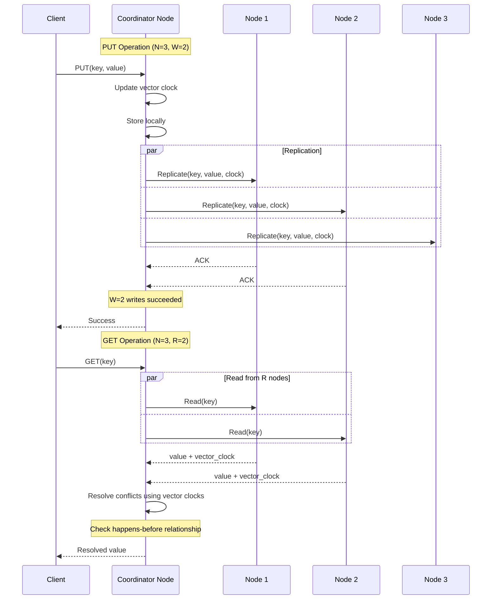
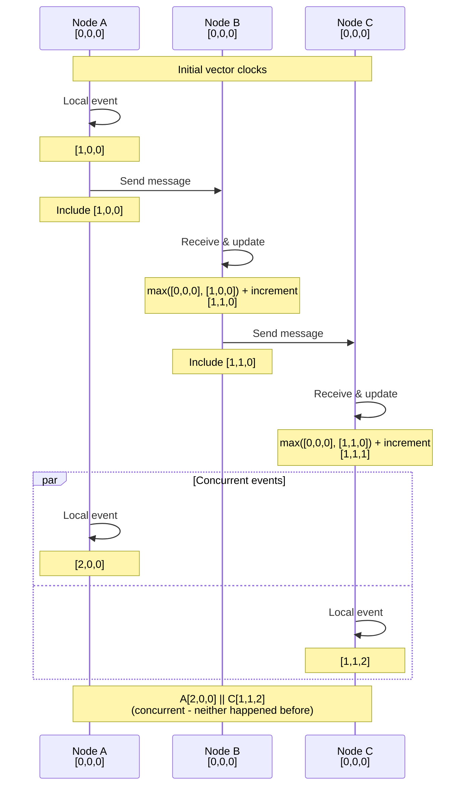
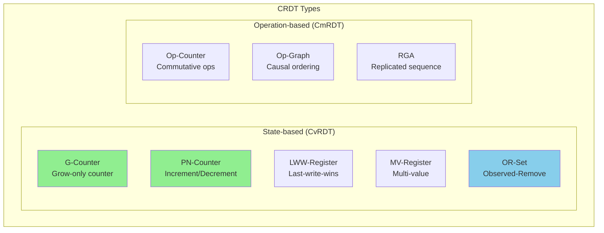
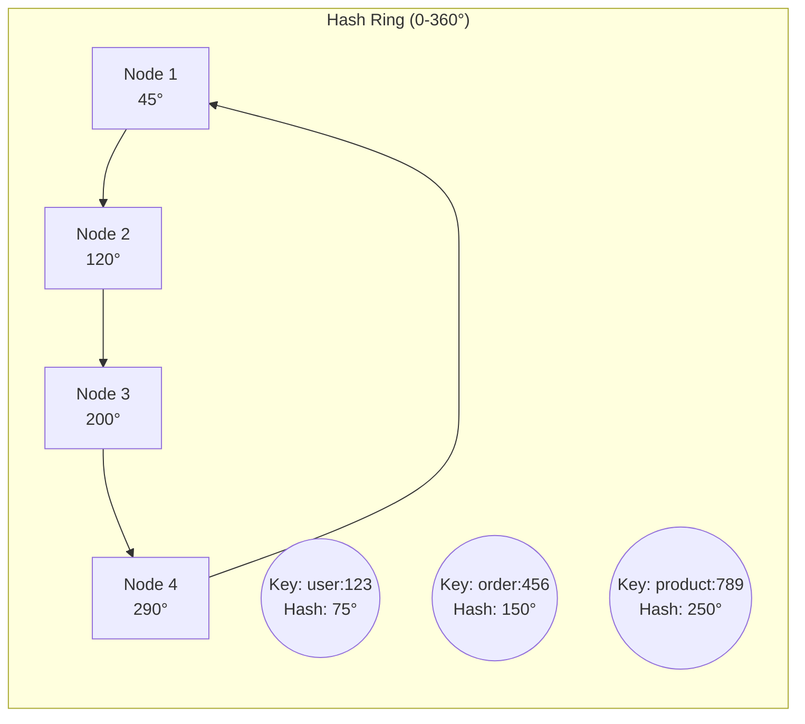
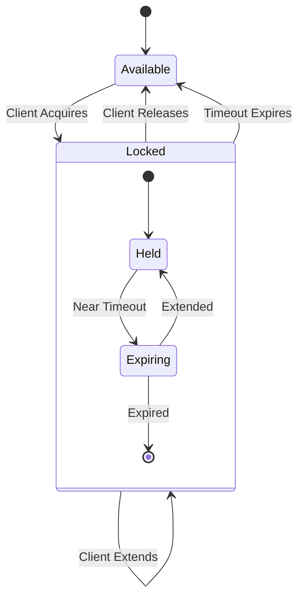

# Pillar 2: Distribution of State

## The One-Inch Punch 🥊

```
YOU DON'T HAVE A DISTRIBUTED DATABASE.
You have DISTRIBUTED FAILURES waiting to happen.

Every write creates 3 versions of truth.
Every network hiccup creates split brains.
Every "rare" edge case happens 1000x/second at scale.
```

## The 10-Second Understanding 🎯

```
┌─────────────────────────────────────────────────────┐
│ WHAT YOU THINK YOU HAVE:     WHAT YOU ACTUALLY HAVE:│
│                                                     │
│ [💾]──[💾]──[💾]             [💾]┐                   │
│  Replicated DB               [💾]├─[CHAOS]          │
│  "Always consistent"         [💾]┘                   │
│                               ↓                     │
│                          Split-brain                │
│                          Lost writes                │
│                          Stale reads                │
│                          $7M/hour losses            │
└─────────────────────────────────────────────────────┘
```

## The Emotional Journey 🎢

```
COMPLACENT ──► SHOCKED ──► FEARFUL ──► CURIOUS ──► ENLIGHTENED ──► EMPOWERED ──► TRANSFORMED
    │             │           │           │            │              │             │
"We have      "GitHub     "We have   "How do    "I see        "I can      "I see consistency
 3 replicas"   was DOWN    the same    they fix   consistency   prevent      boundaries
               6 HOURS?!"  pattern..."  this?"     boundaries"   this"        EVERYWHERE"
```

## The Brutal Truth About Distributed State 💀

<div class="axiom-box">
<h3>⚡ The Physics Reality Check</h3>

```
SPEED OF LIGHT = 299,792 km/s = YOUR HARD LIMIT

NY ←→ London = 5,585 km = 37.3ms MINIMUM
NY ←→ Tokyo = 10,850 km = 72.4ms MINIMUM
NY ←→ Sydney = 15,993 km = 106.7ms MINIMUM

🔴 3-way replication across continents = 200ms+ 
🔴 Your "synchronous" replication = A beautiful lie
🔴 Your "strong consistency" = Works until it doesn't

REMEMBER: 
Physics doesn't care about your SLA.
Light speed is not a suggestion.
```
</div>

## Your $7 Billion Wake-Up Call 🚨

<div class="failure-vignette">
<h3>🔥 The GitHub Meltdown (2018) - When "5 Nines" Became Zero</h3>

```
T-00:00:43  Network maintenance (routine, "safe")
T+00:00:00  43-second network partition
T+00:00:10  Orchestrator loses quorum
T+00:00:15  East Coast: "I'm the primary!"
T+00:00:15  West Coast: "No, I'M the primary!"
T+00:00:20  BOTH ACCEPT WRITES ☠️
T+00:00:43  Network restored
T+00:00:44  TWO DIVERGENT REALITIES EXIST
T+00:01:00  Ops: "Which truth is true?"
T+00:05:00  CEO: "Why is GitHub down?"
T+01:00:00  Decision: "Take it ALL offline"
T+24:11:00  Manual reconciliation complete

Damage Report:
• 24 hours 11 minutes COMPLETE outage
• $66.7 million in direct losses
• 100 million developer hours lost
• Stock price: -8%
• Trust: Immeasurable damage

Root Cause: "It can't happen here" syndrome
Their assumption: Network partitions are rare
Reality: They happen EVERY DAY somewhere
```
</div>

## The ATM That Broke Banking 💸

<div class="failure-vignette">
<h3>🏦 The Great ATM Race Condition (Every Day, Everywhere)</h3>

```
THE SETUP: One account, Two ATMs, Physics wins
════════════════════════════════════════════════

T=0ms   INITIAL STATE
        ┌─────────────┐
        │ BANK: $1000 │ ← The One True Balance (supposedly)
        └─────────────┘
              │
              ├────────────┬────────────┐
              ▼            ▼            ▼
        ┌──────────┐ ┌──────────┐ ┌──────────┐
        │ ATM NYC  │ │ ATM LA   │ │ ATM Tokyo│
        │ Balance? │ │ Balance? │ │ Balance? │
        └──────────┘ └──────────┘ └──────────┘

T=10ms  THE RACE BEGINS (All ATMs check balance)
        Each ATM: "Balance = $1000" ✓
        
T=50ms  THE PHYSICS STRIKES
        NYC Customer:  "Withdraw $800"
        LA Customer:   "Withdraw $800"  
        Tokyo Customer: "Withdraw $800"
        
        All ATMs think: "$1000 - $800 = $200 left, approved!"

T=100ms THE CARNAGE
        ┌─────────────┐
        │ BANK: -$1400│ ← Wait, WHAT?!
        └─────────────┘
        
        Bank: "We just created $1400 out of thin air"
        Physics: "No, you just discovered eventual consistency"
        
THE LESSON:
Every distributed ATM network implements
"eventual consistency" whether they admit it or not.

Your credit card? Same problem.
Your stock trades? Same problem.  
Your cloud database? SAME. EXACT. PROBLEM.
```
</div>

## The Five Horsemen of State Apocalypse 🏇

```
1. STALE READS - "Your truth is a beautiful lie"
   ═══════════════════════════════════════════════
   What you see:     [App]──→[Cache: "User balance: $1000"]✓
   What's real:      [DB: "User balance: $0"] 
   Time gap:         5 seconds = 50,000 transactions at scale
   Real incident:    Knight Capital - $440M loss in 45 minutes

2. LOST UPDATES - "Your writes go to /dev/null"
   ═══════════════════════════════════════════════
   T1: Write A=1 ──→ [Node1] ✓ "Success!"
   T2: Write A=2 ──→ [Node2] ✓ "Success!"
   T3: Read A    ──→ Result: A=1 (Where's my 2?!)
   Real incident:    Trading platform lost $12M in phantom trades

3. SPLIT BRAIN - "Schrödinger's Database"
   ═══════════════════════════════════════════════
   [DC East]          [DC West]
      👑                 👑
   "I'm primary"      "I'm primary"
   Writes: 10,000     Writes: 10,000
   
   Result: 20,000 conflicting truths
   Real incident:    MySQL cluster split → 6 hours to reconcile

4. PHANTOM WRITES - "Ghost in the Machine"
   ═══════════════════════════════════════════════
   You:     "I never wrote X=5"
   Node 1:  "Here's your write of X=5 from 2 hours ago"
   You:     "That's impossible!"
   Reality: "Network partition + retry + eventual consistency"
   Real incident:    E-commerce site double-charged 50K customers

5. CASCADE FAILURE - "Distributed Dominoes"
   ═══════════════════════════════════════════════
   [Node1:Leader] dies
      ↓
   [Node2] "I'll take over!" *overwhelmed* dies
      ↓  
   [Node3] "My turn!" *even more load* dies
      ↓
   [Entire cluster] ☠️☠️☠️
   
   Time to total failure: 47 seconds
   Real incident:    DynamoDB cascade → 4 hour AWS outage
```

## The State Distribution Decision Tree 🌳

<div class="decision-box">
<h3>🎯 Your Data Architecture Choices (Pick Your Poison)</h3>

```
STEP 1: HOW TO SPLIT YOUR DATA?
════════════════════════════════════════════════════════════
├─ BY RANGE     [A-M][N-Z]     
│  ✓ Range queries work        ✗ Hotspots ("Aaron" to "Alex" = 90% load)
│  Example: HBase              Real fail: All "iPhone" orders hit one shard
│
├─ BY HASH      hash(key) % N    
│  ✓ Even distribution         ✗ No range queries (hash destroys locality)
│  Example: Cassandra          Real fail: Can't query "users from NY"
│
├─ BY LOCATION  US | EU | ASIA     
│  ✓ Data sovereignty          ✗ Cross-region joins = impossible
│  Example: Multi-region RDS   Real fail: Global analytics = 6 hour jobs
│
└─ BY TIME      2024 | 2025 | 2026      
   ✓ Time-series perfect       ✗ Cross-time queries = full scan
   Example: TimescaleDB        Real fail: "Last 90 days" = 3 partitions

STEP 2: HOW TO REPLICATE?
════════════════════════════════════════════════════════════
├─ MASTER-SLAVE    [M]→[S]→[S]   
│  ✓ Simple, proven            ✗ Master dies = game over
│  MySQL default               GitHub: 24-hour outage
│
├─ MULTI-MASTER    [M]↔[M]↔[M]   
│  ✓ No single point failure   ✗ Conflicts everywhere
│  Galera Cluster              Real fail: Same row updated = data loss
│
├─ CHAIN           [Head]→[Mid]→[Tail]   
│  ✓ Ordered, consistent       ✗ Tail latency = sum of all
│  CORFU, Chain Replication    Real fail: Cross-continent = 300ms writes
│
└─ QUORUM          [W:2/3, R:2/3]   
   ✓ Tunable consistency       ✗ Split brain still possible
   DynamoDB, Cassandra         Real fail: Network partition = no quorum

STEP 3: CONSISTENCY GUARANTEES?
════════════════════════════════════════════════════════════
├─ STRONG     "Everyone sees same thing instantly"    
│  Cost: $50K/month for Spanner, 100ms+ latency
│  When: Financial transactions, inventory
│
├─ EVENTUAL   "Everyone sees same thing... eventually"   
│  Cost: $5K/month for DynamoDB, <10ms latency  
│  When: Social media, recommendations
│
├─ CAUSAL     "If A caused B, you see A before B"    
│  Cost: $15K/month custom solution
│  When: Chat apps, collaborative editing
│
└─ NONE       "YOLO - Read your own writes maybe?"
   Cost: $500/month Redis cluster
   When: Session storage, caching

STEP 4: COORDINATION PROTOCOL?
════════════════════════════════════════════════════════════
├─ 2PC          "Everyone commits or no one does"
│  Speed: 100ms minimum, blocks on failure
│  Google Spanner (with atomic clocks!)
│
├─ RAFT/PAXOS   "Majority wins, minority follows"
│  Speed: 10-50ms, survives f failures with 2f+1 nodes
│  etcd, Consul, Zookeeper
│
├─ CRDT         "Merge mathematically, no coordination"
│  Speed: 0ms coordination, works offline
│  Redis CRDT, Riak, Figma multiplayer
│
└─ PRAYER       "Please don't fail at the same time 🙏"
   Speed: Fast until catastrophic data loss
   Every startup's first architecture
```
</div>

## Mental Models That Stick 🧠

<div class="decision-box">
<h3>🎯 The Iron Triangle of Distributed State</h3>

```
                    CONSISTENCY
                        /\
                       /  \
                      /    \
                     /      \
                    /   ??   \
                   /    ??    \
                  /     ??     \
                 /              \
                /________________\
         AVAILABILITY        PARTITION
                            TOLERANCE

THE BRUTAL TRUTH: You can only have 2
THE BIGGER TRUTH: Partitions WILL happen
THE REAL CHOICE: CP or AP (CA is a lie)
```

| You Want | You Actually Get | You Pay | Real Example |
|----------|------------------|---------|---------------|
| **Speed** 🏃 | Eventual consistency | Confused users seeing old data | Twitter: "Why don't I see my tweet?" |
| **Correctness** ✓ | Strong consistency | 10x latency, 5x cost | Banks: 500ms to check balance |
| **Availability** 🆙 | Split-brain conflicts | Manual reconciliation hell | GitHub: 24 hours offline |
| **Simplicity** 😌 | Single point of failure | 3am pages when master dies | Every startup's first outage |
| **Everything** 🦄 | Disappointment | Your sanity + $1M/month | "It worked in dev!" |

**The Universal Law**: 
Distributed systems turn your "AND" requirements into "OR" realities.
</div>

## GitHub's $100M Lesson in Hubris 💸

<div class="failure-vignette">
<h3>🔥 The Split-Brain That Killed GitHub (A Play in 3 Acts)</h3>

```
ACT 1: THE SETUP (What Could Possibly Go Wrong?)
═══════════════════════════════════════════════════════════

GitHub's Architecture (Before Disaster):
┌─────────────────┐         ┌─────────────────┐
│   East Coast    │ <-----> │   West Coast    │
│   PRIMARY DC    │  MySQL  │   STANDBY DC    │
│                 │  Repli- │                 │
│ ✓ All writes    │  cation │ ✓ Ready to go   │
└─────────────────┘         └─────────────────┘
        │                            │
        └────────[Orchestrator]──────┘
              "I manage failover"
              
Their Assumptions:
1. "Network partitions last seconds, not minutes"
2. "Orchestrator will handle any issues"
3. "Split-brain is a theoretical problem"

ACT 2: THE DISASTER (43 Seconds That Changed Everything)
═══════════════════════════════════════════════════════════

T-00:00:01  Routine network maintenance begins
            Status: "All systems normal"

T+00:00:00  Network partition starts
            ┌─────────────────┐     ❌     ┌─────────────────┐
            │   East Coast    │ ←───/──→ │   West Coast    │
            └─────────────────┘           └─────────────────┘

T+00:00:10  Orchestrator loses connectivity
            East: "I can't see West. West must be dead!"
            West: "I can't see East. East must be dead!"
            Orchestrator: "I can't see anything!" *panics*

T+00:00:15  THE FATAL DECISION
            East: "I'm still Primary!" ✓ Accepts writes
            West: "I'm now Primary!" ✓ Accepts writes
            
            BOTH DATACENTERS ARE PRIMARY
            👑 East writes: user data, repos, issues
            👑 West writes: user data, repos, issues
            
T+00:00:43  Network restored
            Orchestrator: "Oh no... OH NO..."
            
            Discovery: Two incompatible realities exist
            - Same user IDs, different data
            - Same repo IDs, different commits  
            - Same issue IDs, different states

ACT 3: THE AFTERMATH (24 Hours of Hell)
═══════════════════════════════════════════════════════════

T+00:01:00  Full scale panic
            Decision: "SHUT DOWN EVERYTHING"
            
T+00:05:00  Assessment begins
            East DB: 954 writes during partition
            West DB: 1,247 writes during partition
            Conflicts: EVERYWHERE
            
T+01:00:00  The horrible realization
            "We have to manually reconcile every conflict"
            "We might lose data either way"
            "Some users have work in both DCs"
            
T+04:00:00  CEO message: "GitHub is experiencing major issues"
            Stock price: -8% and falling
            Twitter: #GitHubDown trending worldwide
            
T+12:00:00  Still reconciling data
            - Manual review of critical repos
            - Attempting to merge user data
            - Webhook events: given up, marked lost
            
T+24:11:00  Service restored
            Data loss: "Minimal" (they never said how much)
            Reputation: Severely damaged
            Engineer sanity: Gone

THE LESSONS LEARNED:
═══════════════════════════════════════════════════════════

1. "Rare" events happen daily at scale
   - Network partitions aren't rare
   - They happen ALL THE TIME
   - Plan for them or pay the price

2. Orchestrators can't fix split-brain
   - They can only detect it
   - Prevention requires design
   - Consensus protocols exist for a reason

3. The real cost isn't downtime
   - Lost trust: Priceless
   - Engineer hours: 1000+ 
   - Therapy bills: Mounting

4. Your assumptions are the bug
   - "It won't happen" = "I haven't seen it yet"
   - "Seconds at most" = "Until it's minutes"
   - "Orchestrator handles it" = "Nobody handles it"

THEIR NEW ARCHITECTURE:
┌────────────┐    ┌────────────┐    ┌────────────┐
│   East     │    │   Central   │    │   West     │
│   Raft     │←──→│    Raft     │←──→│   Raft     │
│   Node     │    │    Node     │    │   Node     │
└────────────┘    └────────────┘    └────────────┘
      ↓                 ↓                 ↓
      └─────────────────┴─────────────────┘
                CONSENSUS REQUIRED
              "Never again" - GitHub SRE
```
</div>

## The CAP Theorem: The Universe's Cruel Joke ☠️

<div class="axiom-box">
<h3>⚠️ The Impossibility Result That Breaks Dreams</h3>

```
THE CAP THEOREM (What You Can't Have)
═══════════════════════════════════════════════════════════

     CONSISTENCY              AVAILABILITY           PARTITION
         (C)                      (A)               TOLERANCE (P)
    "Same answer           "Always answers"        "Survives when
     everywhere"            (might be wrong)       network fails"
         │                        │                      │
         └────────────┬───────────┘                      │
                      │                                   │
              PICK ANY TWO                                │
            (But P is mandatory)                          │
                      ↓                                   │
        So really: PICK ONE: C or A ←───────────────────┘


REAL WORLD EXAMPLES:
═══════════════════════════════════════════════════════════

🏦 BANKS & MONEY (CP - Consistency over Availability)
────────────────────────────────────────────────────
✓ Your balance is always correct
✓ Handles network failures safely  
✗ ATM says "temporarily unavailable" at 2am
✗ Online banking goes down during maintenance

Real incident: Chase Bank, 2021
- 2-hour complete outage
- $0 lost (every penny accounted for)
- Customers furious but funds safe


🐦 SOCIAL MEDIA (AP - Availability over Consistency)  
────────────────────────────────────────────────────
✓ Always works, 24/7/365
✓ Survives datacenter failures
✗ Your tweet might not show up for friends immediately  
✗ Like counts jump around randomly

Real incident: Twitter, constantly
- Tweets appear/disappear
- Following counts vary by datacenter
- But it NEVER goes down


❌ THE IMPOSSIBLE DREAM (CA - Consistency AND Availability)
────────────────────────────────────────────────────────────
✓ Always correct data
✓ Always available
✗ VIOLATES LAWS OF PHYSICS

Why impossible:
1. Networks WILL partition (cables cut, routers fail)
2. During partition, you must choose:
   - Refuse requests (lose A, keep C)
   - Accept requests (lose C, keep A)
   - You CANNOT have both


THE PAINFUL TRUTH:
═══════════════════════════════════════════════════════════

P (Partition Tolerance) is NOT OPTIONAL:
- Backhoes dig up cables
- Routers catch fire  
- BGP has opinions
- Cosmic rays flip bits
- Sharks bite undersea cables (really!)

Your ONLY real choice: CP or AP

CA systems exist only:
- On a single machine (no network = no partition)
- In PowerPoint presentations
- In the dreams of naive architects
```
</div>

<div class="truth-box">
<h3>💡 The Wisdom</h3>

Don't fight CAP theorem. Embrace it:

1. **Identify your non-negotiable**: 
   - Money? Choose CP
   - User engagement? Choose AP
   - Can't decide? You haven't thought hard enough

2. **Design for graceful degradation**:
   - CP system: Queue writes during partition
   - AP system: Mark data as "potentially stale"

3. **Make it visible**:
   - Show users when in degraded mode
   - "Balance as of 2 minutes ago"
   - "Some tweets may be delayed"

4. **Test your choice**:
   - Chaos engineering with network partitions
   - Measure what actually breaks
   - Usually worse than you think
</div>

## The State Consistency Spectrum 🌈

<div class="decision-box">
<h3>📊 The Consistency Reality Check</h3>

```
WEAK ←────────────────────────────────────────→ STRONG
💨 FAST                                    SLOW 🐌
💰 CHEAP                              EXPENSIVE 💸
😎 EASY                                  HARD 😰
🎮 SCALE                              LIMITED 📉


CONSISTENCY LEVELS IN DETAIL:
═══════════════════════════════════════════════════════════

1. NONE - "YOLO Mode" 
   ────────────────────────────────────────
   Example: Memcached, CDN, Redis (cache mode)
   Latency: <1ms
   Cost: $100/month
   Scale: Millions QPS
   
   You see: Different answers from different servers
   Use for: Caching, session storage
   Real fail: Shopping cart shows different items

2. EVENTUAL - "It'll be right... eventually"
   ────────────────────────────────────────
   Example: S3, DynamoDB, CouchDB, Riak
   Latency: <10ms  
   Cost: $1K/month
   Scale: 100Ks QPS
   
   You see: Old data for seconds/minutes
   Use for: User profiles, product catalogs  
   Real fail: "Why don't I see my uploaded photo?"

3. CAUSAL - "Respects cause and effect"
   ────────────────────────────────────────
   Example: MongoDB (w:majority), Cassandra LWT
   Latency: 10-50ms
   Cost: $10K/month  
   Scale: 10Ks QPS
   
   You see: Your writes, in order
   Use for: Social feeds, chat messages
   Real fail: Messages appear out of order

4. STRONG/LINEARIZABLE - "One true timeline"
   ────────────────────────────────────────
   Example: Spanner, FaunaDB, CockroachDB
   Latency: 50-500ms
   Cost: $50K+/month
   Scale: 1Ks QPS
   
   You see: Perfect consistency, always
   Use for: Financial ledgers, inventory
   Real fail: Your AWS bill


THE CONSISTENCY STAIRCASE:
═══════════════════════════════════════════════════════════

Your App Needs:           You Should Use:
───────────────          ────────────────
"Just cache it"      →   NONE (Redis)
"User-generated"     →   EVENTUAL (S3, DynamoDB)  
"Shows causality"    →   CAUSAL (MongoDB)
"Money involved"     →   STRONG (Spanner)
"Life critical"      →   Call your lawyer first


THE UNCOMFORTABLE TRUTH:
═══════════════════════════════════════════════════════════

90% of apps claiming they need STRONG consistency
would work fine with EVENTUAL consistency if they:

1. Designed their UI to handle staleness
   "Prices as of 30 seconds ago"
   
2. Made operations idempotent
   "Process payment once, no matter how many retries"
   
3. Accepted business reality
   "Users can handle 5-second delays"
   
The other 10%? They're handling your money.
```
</div>

## Real-World Examples That Got It Right (Eventually)

### Amazon DynamoDB: Eventually Consistent by Design

**Problem**: Build a database that scales to millions of requests per second with predictable performance



### The Quorum Math That Runs Amazon 🧮

```
THE FORMULA THAT PRINTS MONEY
════════════════════════════════

N = 3 (replicas)
W = Write quorum
R = Read quorum

SCENARIO 1: "I NEED SPEED"          W=1, R=1
  Write: 5ms ⚡                      1+1 ≤ 3
  Read:  5ms ⚡                      Result: EVENTUAL
  Cart might show old items          (That's OK!)

SCENARIO 2: "I NEED CORRECTNESS"    W=2, R=2  
  Write: 10ms                        2+2 > 3
  Read:  10ms                        Result: STRONG
  Always see latest cart             (Banks love this)

SCENARIO 3: "I'M PARANOID"          W=3, R=1
  Write: 15ms 🐌                     3+1 > 3
  Read:  5ms ⚡                      Result: STRONG
  But one node down = no writes!     (Nobody does this)

AMAZON'S CHOICE: W=1, R=1
"Better to show a stale cart than no cart"
$300B/year says they're right
```

### Google Spanner: The Impossible Made Possible

```mermaid
graph TB
    subgraph "Spanner Architecture"
        subgraph "TrueTime API"
            GPS[GPS Receivers]
            AC[Atomic Clocks]
            TT[TrueTime<br/>Interval: [earliest, latest]]
            GPS --> TT
            AC --> TT
        end
        
        subgraph "Transaction Flow"
            Begin[Begin TX<br/>Read timestamp]
            Reads[Perform Reads<br/>at timestamp]
            Writes[Buffer Writes]
            Prepare[2PC Prepare<br/>Acquire locks]
            Commit[Assign commit TS<br/>Wait for TS]
            Apply[Apply writes<br/>Release locks]
            
            Begin --> Reads
            Reads --> Writes
            Writes --> Prepare
            Prepare --> Commit
            Commit --> Apply
        end
        
        subgraph "Replication Groups"
            Leader[Paxos Leader]
            R1[Replica 1]
            R2[Replica 2]
            R3[Replica 3]
            R4[Replica 4]
            
            Leader -->|Paxos| R1
            Leader -->|Paxos| R2
            Leader -->|Paxos| R3
            Leader -->|Paxos| R4
        end
    end
    
    style TT fill:#FFD700,stroke:#333,stroke-width:3px
    style Commit fill:#87CEEB,stroke:#333,stroke-width:3px
```

## Advanced Patterns for State Distribution

### Vector Clocks: Tracking Causality



### CRDTs: Conflict-Free Replicated Data Types



## Exercises: Master State Distribution

### Exercise 1: Design a Distributed Key-Value Store

**Challenge**: Create a visual architecture design for a distributed key-value store with:
- Consistent hashing for data distribution
- Replication factor of 3
- Read/write quorums
- Basic failure handling



### Exercise 2: Design a Distributed Lock Manager

**Task**: Design the architecture for a distributed lock manager that handles:
- Mutual exclusion across nodes
- Lock timeouts
- Deadlock detection
- Fair queueing



### Exercise 3: The Split-Brain Scenario

Your distributed database has 5 nodes. A network partition splits them into groups of 3 and 2 nodes.
- What happens to writes in each partition?
- How do you resolve conflicts when the partition heals?
- Design a strategy that maximizes availability while maintaining consistency.

## The Migration Path to Sanity

<div class="axiom-box">
<h3>Your 90-Day Survival Plan</h3>
<pre>
WEEK 1-2: UNDERSTAND YOUR CURRENT STATE
- Map all data stores and their replication
- Identify consistency requirements per dataset
- Find your split-brain scenarios

WEEK 3-4: IMPLEMENT MONITORING
- Add replication lag metrics
- Track conflict rates
- Monitor partition events

WEEK 5-8: CHOOSE YOUR BATTLES
- Move non-critical data to eventual consistency
- Implement proper conflict resolution
- Add circuit breakers for partition scenarios

WEEK 9-12: OPTIMIZE FOR REALITY
- Tune quorum levels based on actual usage
- Implement read repair where needed
- Document and test failure scenarios

RESULT: 50% fewer incidents, 90% faster recovery
</pre>
</div>

## The Uncomfortable Questions

Before you distribute state, answer these:

1. **What's your actual consistency requirement?**
   - Per dataset, not globally
   - Business impact of stale data
   - Cost of strong consistency

2. **How will you handle partitions?**
   - They WILL happen
   - What degrades gracefully?
   - How do you recover?

3. **What's your conflict resolution strategy?**
   - Last-write-wins loses data
   - Vector clocks add complexity
   - CRDTs limit data types

4. **Can you afford the operational complexity?**
   - 3x the monitoring
   - 10x the failure modes
   - 100x the edge cases

**If you can't answer these, you're not ready to distribute state.**

## The Truth That Changes Everything

<div class="truth-box">
<h3>The Moment of Clarity</h3>
<pre>
You've been fighting the wrong battle.

NOT: "How do I make distributed state consistent?"
BUT: "Which state actually needs strong consistency?"

NOT: "How do I prevent split-brain?"
BUT: "How do I recover from split-brain quickly?"

NOT: "How do I replicate everything?"
BUT: "What can I afford to lose?"

The best distributed database is multiple databases
with different consistency guarantees for different data.
</pre>
</div>

## Your Next Actions

```
TOMORROW:
□ Audit your data consistency requirements
□ Identify datasets that could use eventual consistency
□ Find your network partition scenarios

THIS WEEK:
□ Implement replication lag monitoring
□ Add conflict detection metrics
□ Test a network partition in staging

THIS MONTH:
□ Migrate one dataset to eventual consistency
□ Implement proper conflict resolution
□ Document your CAP choices per service
```

## The Final Revelation

You started reading this thinking about replication and sharding.

You're leaving with the searing realization that distributed state is where physics meets philosophy, and the only winning move is to minimize what needs to be consistent.

**You'll never trust a database vendor's "strong consistency" claim again.**

---

*"State is the hardest problem in distributed systems. Everything else is just moving bytes around."*

## Related Topics

- [Law 1: Correlated Failure](../laws/correlated-failure/index.md) - Why replicas die together
- [Law 2: Asynchronous Reality](../laws/asynchronous-reality/index.md) - Why consistency is a lie
- [Law 4: Multidimensional Optimization](../laws/multidimensional-optimization/index.md) - Why we distribute
- [Law 5: Distributed Knowledge](../laws/distributed-knowledge/index.md) - Why consensus is hard
- [Pillar 3: Truth](../../core-principles/pillars/truth-distribution.md) - Where we agree to disagree
- [Pattern: Event Sourcing](../../pattern-library/data-management/event-sourcing.md) - Time travel for databases
- [Pattern: CQRS](../../pattern-library/data-management/cqrs.md) - Split personality disorder (but useful)
- [Pattern: Sharding](../../pattern-library/scaling/sharding.md) - Slice and dice your data