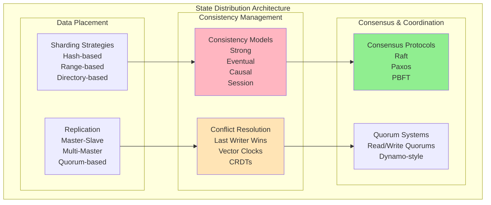
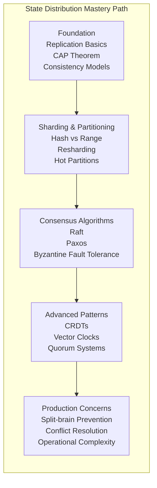
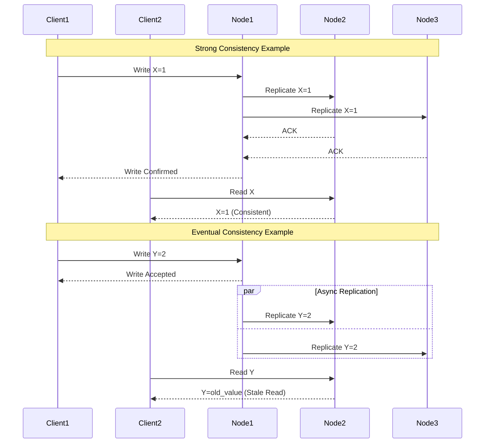

# Pillar 2: State Distribution

## 1. The Complete Blueprint

State distribution in distributed systems is the art of managing data placement, replication, and consistency across multiple nodes while handling network partitions and conflicts gracefully. At its core, we use replication strategies to ensure data availability, sharding techniques to partition data horizontally, consistency models to define guarantees about data visibility, conflict resolution mechanisms to handle concurrent updates, and consensus protocols to maintain agreement across nodes. These components work together to create systems that can survive node failures, scale data storage horizontally, and provide predictable behavior under various failure conditions. The fundamental challenge is balancing the CAP theorem constraints while meeting business requirements for consistency, availability, and partition tolerance.



> **What You'll Master**: Designing data architectures that survive network partitions, implementing appropriate consistency models for different use cases, handling split-brain scenarios gracefully, optimizing for read/write patterns, and building conflict resolution strategies that preserve data integrity.

## 2. The Core Mental Model

**The Library System Analogy**: State distribution is like managing a library system across multiple branches in different cities. Each branch has copies of popular books (replication), specialized collections (sharding), and protocols for handling book requests when branches can't communicate (partition tolerance). When someone updates a book's information, you need rules for how that change propagates (consistency model), what happens if two librarians make different updates simultaneously (conflict resolution), and how branches coordinate to maintain a coherent catalog (consensus).

**The Fundamental Principle**: *In distributed systems, there is no single source of truth - only negotiated agreements about current state that expire over time.*

Why this matters in practice:
- **Network partitions are inevitable** - cables get cut, routers fail, and you must decide between consistency and availability
- **Consistency is expensive** - strong consistency can cost 10x more in latency and infrastructure than eventual consistency
- **Conflicts will happen** - concurrent updates are not edge cases at scale, they're daily operational realities

## 3. The Journey Ahead



**Pattern Interconnections:**
- **Sharding + Replication** = Scalable data storage with fault tolerance
- **Consistency Models + Conflict Resolution** = Predictable behavior under concurrency
- **Consensus + Quorum Systems** = Highly available distributed databases  
- **CRDTs + Eventual Consistency** = Offline-capable applications with guaranteed convergence

**Common Failure Patterns:**
- **Split Brain**: Multiple nodes think they're the primary, accepting conflicting writes
- **Lost Updates**: Concurrent writes where the second overwrites the first silently
- **Phantom Reads**: Reading data that appears to exist but was never committed
- **Cascading Failures**: One replica failure triggers failures in other replicas

## Core State Distribution Patterns

### Pattern 1: Replication Strategies


### Pattern 2: Consistency Models Comparison



### Pattern 3: Conflict Resolution Mechanisms

```mermaid
graph TB
    subgraph "Conflict Resolution Strategies"
        subgraph "Last Writer Wins"
            LWW[Last Writer Wins<br/>Timestamp: 14:30:05<br/>Value: A]
            LWW_Conflict[Concurrent Write<br/>Timestamp: 14:30:05<br/>Value: B]
            LWW_Result[Result: B wins<br/>(tie-breaker: node ID)]
        end
        
        subgraph "Vector Clocks"
            VC_A[Node A: [1,0,0]<br/>Value: X]
            VC_B[Node B: [1,1,0]<br/>Value: Y] 
            VC_Result[Result: Y wins<br/>(B happened after A)]
        end
        
        subgraph "CRDTs"
            CRDT_Add[Add(item1, item2)]
            CRDT_Remove[Remove(item1)]
            CRDT_Result[Result: {item2}<br/>(Mathematical merge)]
        end
        
        LWW --> LWW_Conflict
        LWW_Conflict --> LWW_Result
        VC_A --> VC_Result
        VC_B --> VC_Result
        CRDT_Add --> CRDT_Result
        CRDT_Remove --> CRDT_Result
    end
```

## Real-World Examples

### Amazon DynamoDB: Tunable Consistency

Amazon DynamoDB uses a quorum-based approach where you can tune consistency vs. performance:

```python
# Eventually consistent read (default)
response = dynamodb.get_item(
    TableName='Users',
    Key={'user_id': {'S': '12345'}},
    ConsistentRead=False  # Fast but potentially stale
)

# Strongly consistent read  
response = dynamodb.get_item(
    TableName='Users', 
    Key={'user_id': {'S': '12345'}},
    ConsistentRead=True   # Slower but always current
)

# Write with conditional consistency
dynamodb.put_item(
    TableName='Users',
    Item={'user_id': {'S': '12345'}, 'balance': {'N': '100'}},
    ConditionExpression='attribute_not_exists(user_id)'
)
```

**Trade-offs**: Eventually consistent reads are 50% cheaper and 2x faster, but may return stale data for ~100ms after writes.

### Google Spanner: Global Strong Consistency

Spanner achieves strong consistency globally using TrueTime API with GPS and atomic clocks:

```sql
-- Transaction spanning multiple continents
BEGIN TRANSACTION;

-- Update in US datacenter  
UPDATE accounts SET balance = balance - 100 
WHERE account_id = 'us_account_123';

-- Update in EU datacenter
UPDATE accounts SET balance = balance + 100
WHERE account_id = 'eu_account_456';

COMMIT;
-- Guaranteed: Either both updates succeed or both fail
-- Latency: ~10ms local, ~100-500ms cross-region
```

**Results**: Bank-grade consistency with global scale, but 5-10x higher latency than eventually consistent systems.

### Riak: High Availability with CRDTs

Riak uses Convergent Replicated Data Types (CRDTs) for conflict-free merging:

```erlang
%% Shopping cart as an OR-Set CRDT
%% Adds and removes converge to consistent state

%% Node A: Add item
Cart1 = riak_dt_orset:update({add, "laptop"}, actor1, Cart0).

%% Node B: Add different item (concurrent)
Cart2 = riak_dt_orset:update({add, "mouse"}, actor2, Cart0).

%% Automatic merge when nodes reconnect
MergedCart = riak_dt_orset:merge(Cart1, Cart2).
%% Result: {"laptop", "mouse"} - both items preserved
```

**Benefits**: Works offline, automatic conflict resolution, guaranteed eventual consistency without coordination overhead.

## Implementation Anti-Patterns

### Anti-Pattern 1: Distributed Transactions Without Timeouts

```python
# WRONG: Can block forever
def transfer_money(from_account, to_account, amount):
    begin_transaction()
    try:
        debit(from_account, amount)    # May block here
        credit(to_account, amount)     # Or here  
        commit_transaction()           # Forever...
    except:
        rollback_transaction()

# RIGHT: With timeouts and compensation
def transfer_money_saga(from_account, to_account, amount):
    saga_id = start_saga(timeout=30_seconds)
    
    try:
        debit_result = debit_with_reservation(from_account, amount, saga_id)
        if debit_result.success:
            credit_result = credit_account(to_account, amount, saga_id)
            if credit_result.success:
                confirm_debit(from_account, saga_id)
                return success()
            else:
                cancel_debit(from_account, saga_id)
    except TimeoutException:
        compensate_saga(saga_id)
    
    return failure()
```

### Anti-Pattern 2: Ignoring Network Partitions

```python
# WRONG: Assumes network is reliable
class NaiveDatabase:
    def write(self, key, value):
        for replica in self.replicas:
            replica.write(key, value)  # Blocks if replica unreachable
        return "success"

# RIGHT: Handles partitions explicitly  
class PartitionAwareDatabase:
    def write(self, key, value):
        successful_writes = 0
        for replica in self.replicas:
            try:
                replica.write(key, value, timeout=1.0)
                successful_writes += 1
            except NetworkTimeout:
                # Expected during partitions
                continue
                
        if successful_writes >= self.write_quorum:
            return "success"
        else:
            return "insufficient_replicas"
```

## Production Readiness Checklist

```yaml
□ DATA MODELING
  ├─ □ Define consistency requirements per data type
  ├─ □ Choose appropriate sharding strategy  
  ├─ □ Design conflict resolution mechanisms
  └─ □ Plan for data migration and resharding

□ CONSISTENCY MANAGEMENT
  ├─ □ Implement read/write quorums
  ├─ □ Add conflict detection and resolution
  ├─ □ Design for network partition scenarios
  └─ □ Test consistency under failures

□ OPERATIONAL READINESS  
  ├─ □ Monitor replication lag across all replicas
  ├─ □ Alert on split-brain conditions
  ├─ □ Implement automated conflict resolution
  └─ □ Create runbooks for data inconsistency

□ TESTING & VALIDATION
  ├─ □ Chaos engineering with network partitions
  ├─ □ Load testing with realistic conflict rates
  ├─ □ Disaster recovery drills
  └─ □ Data integrity validation pipelines
```

## Key Trade-off Decisions

### Consistency vs. Availability vs. Partition Tolerance

| Requirement | Consistency Model | Database Options | Trade-offs |
|-------------|-------------------|------------------|------------|
| **Bank Transactions** | Strong | Spanner, CockroachDB | High latency, high cost |
| **User Profiles** | Eventual | DynamoDB, Cassandra | Stale reads, low cost |
| **Shopping Carts** | Session | Application-managed | Complex client logic |
| **Chat Messages** | Causal | MongoDB, Riak | Moderate complexity |
| **Analytics Data** | Eventual | BigQuery, Snowflake | Batch processing delays |

### Read vs. Write Optimization

```python
# Read-optimized (1 write, 3 replicas)
write_quorum = 3  # All replicas
read_quorum = 1   # Any replica
# Result: Expensive writes, cheap reads

# Write-optimized (3 replicas, quorum=2)  
write_quorum = 2  # Majority
read_quorum = 2   # Majority  
# Result: Balanced cost, strong consistency

# Availability-optimized
write_quorum = 1  # Any replica
read_quorum = 1   # Any replica
# Result: Always available, eventual consistency
```

## Key Takeaways

1. **There is no perfect consistency** - Every consistency model involves trade-offs between performance, availability, and correctness

2. **Network partitions are not edge cases** - They happen daily at scale and must be designed for, not hoped against

3. **Conflict resolution is a business decision** - Choose between automatic (CRDTs), timestamp-based (LWW), or manual resolution based on data criticality

4. **Measure your actual consistency needs** - Most applications claiming they need strong consistency work fine with eventual consistency plus good UX

5. **Start simple, evolve complexity** - Begin with master-slave replication and upgrade to more sophisticated patterns only when business requirements demand it

## Related Topics

- [Truth Distribution](truth-distribution.md) - Consensus mechanisms for agreement across nodes
- [Work Distribution](work-distribution.md) - How state placement affects computational efficiency
- [Pattern: Event Sourcing](../../pattern-library/data-management/event-sourcing.md) - Immutable state management
- [Pattern: CQRS](../../pattern-library/data-management/cqrs.md) - Separating read and write models

---

*"State distribution is where the rubber meets the road - all the theory in the world doesn't matter if you can't keep your data consistent and available when things go wrong."*