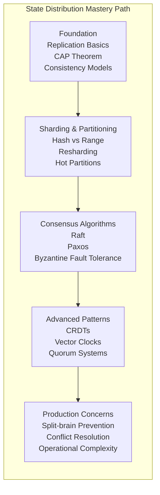
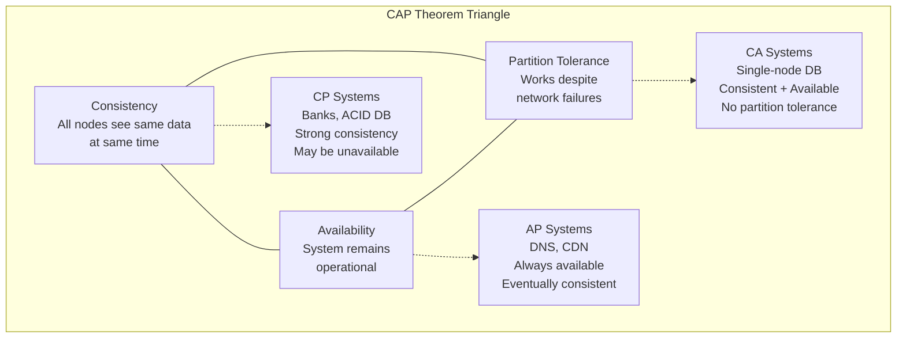
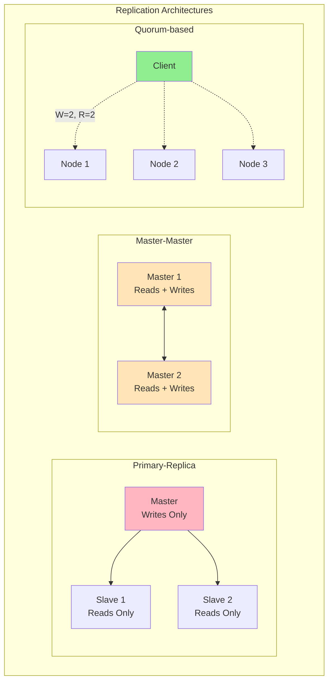
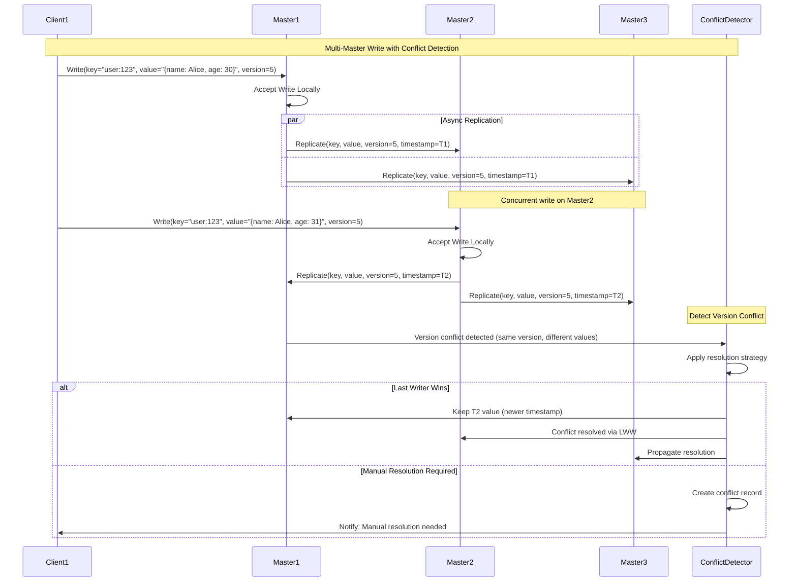
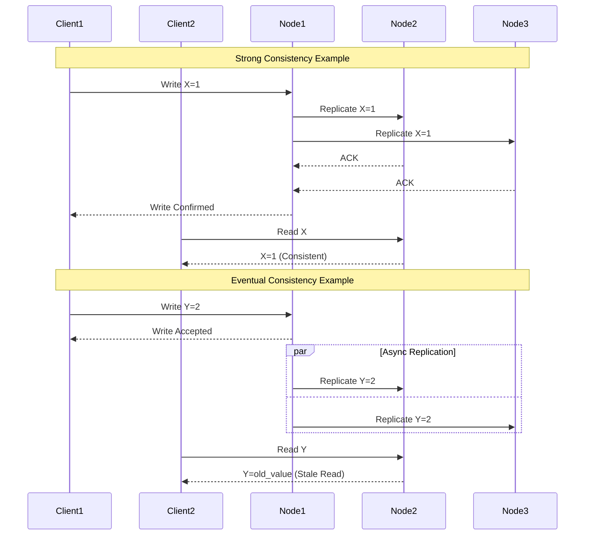
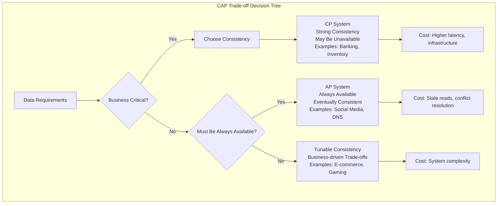

# Pillar 2: State Distribution

## 1. The Complete Blueprint

State distribution in distributed systems is the art of managing data placement, replication, and consistency across multiple nodes while handling network partitions and conflicts gracefully. At its core, we use replication strategies to ensure data availability, sharding techniques to partition data horizontally, consistency models to define guarantees about data visibility, conflict resolution mechanisms to handle concurrent updates, and consensus protocols to maintain agreement across nodes. These components work together to create systems that can survive node failures, scale data storage horizontally, and provide predictable behavior under various failure conditions. The fundamental challenge is balancing the CAP theorem constraints while meeting business requirements for consistency, availability, and partition tolerance.


> **What You'll Master**: Designing data architectures that survive network partitions, implementing appropriate consistency models for different use cases, handling split-brain scenarios gracefully, optimizing for read/write patterns, and building conflict resolution strategies that preserve data integrity.

## 2. The Core Mental Model

**The Library System Analogy**: State distribution is like managing a library system across multiple branches in different cities. Each branch has copies of popular books (replication), specialized collections (sharding), and protocols for handling book requests when branches can't communicate (partition tolerance). When someone updates a book's information, you need rules for how that change propagates (consistency model), what happens if two librarians make different updates simultaneously (conflict resolution), and how branches coordinate to maintain a coherent catalog (consensus).

**The Fundamental Principle**: *In distributed systems, there is no single source of truth - only negotiated agreements about current state that expire over time.*

Why this matters in practice:
- **Network partitions are inevitable** - cables get cut, routers fail, and you must decide between consistency and availability
- **Consistency is expensive** - strong consistency can cost 10x more in latency and infrastructure than eventual consistency
- **Conflicts will happen** - concurrent updates are not edge cases at scale, they're daily operational realities

## 3. The Journey Ahead



**Pattern Interconnections:**
- **Sharding + Replication** = Scalable data storage with fault tolerance
- **Consistency Models + Conflict Resolution** = Predictable behavior under concurrency
- **Consensus + Quorum Systems** = Highly available distributed databases  
- **CRDTs + Eventual Consistency** = Offline-capable applications with guaranteed convergence

**Common Failure Patterns:**
- **Split Brain**: Multiple nodes think they're the primary, accepting conflicting writes
- **Lost Updates**: Concurrent writes where the second overwrites the first silently
- **Phantom Reads**: Reading data that appears to exist but was never committed
- **Cascading Failures**: One replica failure triggers failures in other replicas

## Core Challenges and Technical Deep Dive

### Challenge 1: CAP Theorem Trade-offs in Practice

The CAP theorem forces impossible choices, but real systems navigate these trade-offs through sophisticated techniques and business-driven decisions.



**Performance Benchmarks by CAP Choice:**

| System Type | Read Latency | Write Latency | Availability | Consistency | Use Case |
|-------------|--------------|---------------|--------------|-------------|----------|
| **Strong Consistency (CP)** | 10-100ms | 50-500ms | 99.9% | Immediate | Financial transactions |
| **Eventual Consistency (AP)** | 1-10ms | 1-20ms | 99.99% | ~100ms lag | Social media feeds |
| **Session Consistency** | 1-10ms | 10-50ms | 99.95% | Per-session | E-commerce carts |
| **Causal Consistency** | 5-20ms | 20-100ms | 99.9% | Causally ordered | Collaborative editing |

### Challenge 2: Network Partitions Are Not Edge Cases

Network partitions happen daily in large-scale systems. Systems must be designed to handle split-brain scenarios gracefully.

```python
class NetworkPartitionSimulator:
    def __init__(self):
        self.partition_scenarios = {
            'datacenter_isolation': {
                'probability': 0.001,  # 0.1% chance per day
                'duration_minutes': [5, 30, 120],  # 5min to 2hrs
                'affected_nodes': 'entire_datacenter'
            },
            'rack_switch_failure': {
                'probability': 0.01,   # 1% chance per day
                'duration_minutes': [1, 10, 60],
                'affected_nodes': 'single_rack'
            },
            'wan_connectivity_loss': {
                'probability': 0.005,  # 0.5% chance per day
                'duration_minutes': [10, 60, 300],
                'affected_nodes': 'cross_region'
            }
        }
    
    def calculate_partition_impact(self, system_type, partition_type):
        """Calculate business impact of different partition scenarios"""
        scenarios = {
            'strong_consistency': {
                'datacenter_isolation': 'complete_unavailability',
                'rack_switch_failure': 'partial_unavailability', 
                'wan_connectivity_loss': 'regional_unavailability'
            },
            'eventual_consistency': {
                'datacenter_isolation': 'stale_reads_possible',
                'rack_switch_failure': 'minimal_impact',
                'wan_connectivity_loss': 'cross_region_lag'
            }
        }
        return scenarios[system_type][partition_type]
```

### Challenge 3: Conflict Resolution at Scale

Concurrent updates are inevitable at scale. Different resolution strategies have vastly different operational characteristics.

```yaml
# Conflict resolution performance characteristics
conflict_resolution_strategies:
  last_writer_wins:
    cpu_overhead: "Very Low"
    memory_overhead: "Low" 
    network_overhead: "Low"
    data_loss_risk: "High"
    implementation_complexity: "Simple"
    best_for: "Metrics, logs, cache entries"
    
  vector_clocks:
    cpu_overhead: "Medium"
    memory_overhead: "High"  # O(N) per record
    network_overhead: "High"
    data_loss_risk: "Low"
    implementation_complexity: "Complex"
    best_for: "Collaborative documents, distributed databases"
    
  crdts:
    cpu_overhead: "Medium-High"
    memory_overhead: "High"
    network_overhead: "Medium"
    data_loss_risk: "None"
    implementation_complexity: "Very Complex"
    best_for: "Shopping carts, collaborative editing, counters"
    
  operational_transform:
    cpu_overhead: "High"
    memory_overhead: "Medium"
    network_overhead: "High"
    data_loss_risk: "Low"
    implementation_complexity: "Extreme"
    best_for: "Real-time collaborative editing"
```

## Comprehensive Techniques & Patterns

### Pattern 1: Advanced Replication Strategies



### Pattern 2: Multi-Master Replication with Conflict Detection



### Pattern 3: Consistency Models with Performance Trade-offs



### Pattern 3: Conflict Resolution Mechanisms

```mermaid
graph TB
    subgraph "Conflict Resolution Strategies"
        subgraph "Last Writer Wins"
            LWW[Last Writer Wins<br/>Timestamp: 14:30:05<br/>Value: A]
            LWW_Conflict[Concurrent Write<br/>Timestamp: 14:30:05<br/>Value: B]
            LWW_Result[Result: B wins<br/>(tie-breaker: node ID)]
        end
        
        subgraph "Vector Clocks"
            VC_A[Node A: [1,0,0]<br/>Value: X]
            VC_B[Node B: [1,1,0]<br/>Value: Y] 
            VC_Result[Result: Y wins<br/>(B happened after A)]
        end
        
        subgraph "CRDTs"
            CRDT_Add[Add(item1, item2)]
            CRDT_Remove[Remove(item1)]
            CRDT_Result[Result: {item2}<br/>(Mathematical merge)]
        end
        
        LWW --> LWW_Conflict
        LWW_Conflict --> LWW_Result
        VC_A --> VC_Result
        VC_B --> VC_Result
        CRDT_Add --> CRDT_Result
        CRDT_Remove --> CRDT_Result
    end
```

### Pattern 4: Hybrid Consistency Models

```python
class HybridConsistencyManager:
    """Implements different consistency models based on data type and access patterns"""
    
    def __init__(self):
        self.consistency_policies = {
            # Critical financial data requires strong consistency
            'financial_transactions': {
                'model': 'strong_consistency',
                'read_quorum': 'majority',
                'write_quorum': 'majority',
                'max_staleness_ms': 0
            },
            
            # User profiles can tolerate some staleness
            'user_profiles': {
                'model': 'bounded_staleness', 
                'read_quorum': 'one',
                'write_quorum': 'majority',
                'max_staleness_ms': 5000  # 5 seconds
            },
            
            # Analytics data is append-only, eventual consistency is fine
            'analytics_events': {
                'model': 'eventual_consistency',
                'read_quorum': 'one',
                'write_quorum': 'one', 
                'max_staleness_ms': 60000  # 1 minute
            },
            
            # Shopping cart needs session consistency
            'shopping_carts': {
                'model': 'session_consistency',
                'read_quorum': 'session_sticky',
                'write_quorum': 'majority',
                'max_staleness_ms': 1000  # 1 second
            }
        }
    
    def get_consistency_requirements(self, data_type, operation):
        """Get consistency requirements based on data type and operation"""
        policy = self.consistency_policies.get(data_type)
        if not policy:
            return self.consistency_policies['user_profiles']  # Safe default
            
        # Adjust based on operation type
        if operation == 'read' and policy['model'] == 'eventual_consistency':
            # For eventually consistent data, reads can be very relaxed
            return {
                'required_replicas': 1,
                'max_staleness_acceptable': policy['max_staleness_ms'],
                'can_serve_from_cache': True
            }
        elif operation == 'write' and policy['model'] == 'strong_consistency':
            # For strongly consistent data, writes must be synchronous
            return {
                'required_replicas': self.calculate_majority(),
                'synchronous_replication': True,
                'conflict_resolution': 'reject_on_conflict'
            }
        
        return policy
    
    def execute_read(self, data_type, key, session_id=None):
        """Execute read with appropriate consistency model"""
        requirements = self.get_consistency_requirements(data_type, 'read')
        
        if requirements.get('can_serve_from_cache'):
            cached_value = self.check_cache(key)
            if cached_value and not self.is_stale(cached_value, requirements['max_staleness_acceptable']):
                return cached_value
        
        # Determine which replicas to read from
        if requirements.get('read_quorum') == 'session_sticky' and session_id:
            replicas = [self.get_session_replica(session_id)]
        else:
            replicas = self.select_read_replicas(requirements['required_replicas'])
        
        return self.read_from_replicas(replicas, key)
```

## Real-World Implementation Examples

### Cassandra: Tunable Consistency with Performance Optimization

Cassandra provides fine-grained control over consistency vs. performance trade-offs:

```cql
-- Different consistency levels for different use cases

-- Strong consistency for financial data
CONSISTENCY QUORUM;
SELECT balance FROM accounts WHERE user_id = 'user123';
INSERT INTO transactions (id, user_id, amount) VALUES (uuid(), 'user123', -100.00);

-- Eventual consistency for social media feeds  
CONSISTENCY ONE;
SELECT * FROM social_feed WHERE user_id = 'user123' LIMIT 50;
INSERT INTO social_posts (id, user_id, content) VALUES (uuid(), 'user123', 'Hello World!');

-- Local consistency for analytics
CONSISTENCY LOCAL_QUORUM;
SELECT count(*) FROM page_views WHERE date = '2025-08-08';
INSERT INTO page_views (id, user_id, page, timestamp) VALUES (uuid(), 'user123', '/home', now());
```

**Performance Results by Consistency Level:**

```yaml
performance_benchmarks:
  consistency_one:
    read_latency_p50: "0.5ms"
    read_latency_p99: "5ms"
    write_latency_p50: "1ms"
    write_latency_p99: "10ms"
    availability: "99.99%"
    
  consistency_quorum:
    read_latency_p50: "2ms"
    read_latency_p99: "20ms"
    write_latency_p50: "5ms" 
    write_latency_p99: "50ms"
    availability: "99.9%"
    
  consistency_all:
    read_latency_p50: "10ms"
    read_latency_p99: "100ms"
    write_latency_p50: "25ms"
    write_latency_p99: "250ms"
    availability: "99.0%"  # Lower due to requiring all nodes
```

### Amazon DynamoDB: Adaptive Consistency

Amazon DynamoDB uses a quorum-based approach where you can tune consistency vs. performance:

```python
# Eventually consistent read (default)
response = dynamodb.get_item(
    TableName='Users',
    Key={'user_id': {'S': '12345'}},
    ConsistentRead=False  # Fast but potentially stale
)

# Strongly consistent read  
response = dynamodb.get_item(
    TableName='Users', 
    Key={'user_id': {'S': '12345'}},
    ConsistentRead=True   # Slower but always current
)

# Write with conditional consistency
dynamodb.put_item(
    TableName='Users',
    Item={'user_id': {'S': '12345'}, 'balance': {'N': '100'}},
    ConditionExpression='attribute_not_exists(user_id)'
)
```

**Trade-offs**: Eventually consistent reads are 50% cheaper and 2x faster, but may return stale data for ~100ms after writes.

### Google Spanner: Global Strong Consistency

Spanner achieves strong consistency globally using TrueTime API with GPS and atomic clocks:

```sql
-- Transaction spanning multiple continents
BEGIN TRANSACTION;

-- Update in US datacenter  
UPDATE accounts SET balance = balance - 100 
WHERE account_id = 'us_account_123';

-- Update in EU datacenter
UPDATE accounts SET balance = balance + 100
WHERE account_id = 'eu_account_456';

COMMIT;
-- Guaranteed: Either both updates succeed or both fail
-- Latency: ~10ms local, ~100-500ms cross-region
```

**Results**: Bank-grade consistency with global scale, but 5-10x higher latency than eventually consistent systems.

### Riak: High Availability with CRDTs

Riak uses Convergent Replicated Data Types (CRDTs) for conflict-free merging:

```erlang
%% Shopping cart as an OR-Set CRDT
%% Adds and removes converge to consistent state

%% Node A: Add item
Cart1 = riak_dt_orset:update({add, "laptop"}, actor1, Cart0).

%% Node B: Add different item (concurrent)
Cart2 = riak_dt_orset:update({add, "mouse"}, actor2, Cart0).

%% Automatic merge when nodes reconnect
MergedCart = riak_dt_orset:merge(Cart1, Cart2).
%% Result: {"laptop", "mouse"} - both items preserved
```

**Benefits**: Works offline, automatic conflict resolution, guaranteed eventual consistency without coordination overhead.

### CockroachDB: Global ACID with Performance Optimization

CockroachDB achieves global ACID transactions while maintaining reasonable performance:

```sql
-- Global transaction spanning multiple regions
BEGIN;

-- Update account in US East
UPDATE accounts SET balance = balance - 1000 
WHERE account_id = 'us_account_123' AND region = 'us-east-1';

-- Update account in EU West  
UPDATE accounts SET balance = balance + 1000
WHERE account_id = 'eu_account_456' AND region = 'eu-west-1';

-- This transaction either succeeds globally or fails completely
COMMIT;
```

```yaml
# CockroachDB performance characteristics
global_transactions:
  same_region:
    latency_p50: "2ms"
    latency_p99: "10ms"
    throughput: "10,000 TPS per node"
    
  cross_region:
    latency_p50: "100ms"  # Speed of light + consensus
    latency_p99: "300ms"
    throughput: "1,000 TPS"  # Limited by cross-region consensus
    
  global_consistency_cost:
    cpu_overhead: "20-30% vs eventual consistency"
    network_bandwidth: "2-3x due to consensus protocol"
    storage_overhead: "10-15% for transaction metadata"
```

## Advanced Implementation Patterns

### Pattern: Conflict-free Replicated Data Types (CRDTs)

```python
class GCounterCRDT:
    """Grow-only counter that can be safely replicated"""
    
    def __init__(self, node_id):
        self.node_id = node_id
        self.counters = defaultdict(int)  # node_id -> count
    
    def increment(self, amount=1):
        """Increment counter locally"""
        self.counters[self.node_id] += amount
    
    def value(self):
        """Get current counter value"""
        return sum(self.counters.values())
    
    def merge(self, other):
        """Merge with another G-Counter (associative, commutative, idempotent)"""
        merged = GCounterCRDT(self.node_id)
        
        # Take maximum count for each node
        all_nodes = set(self.counters.keys()) | set(other.counters.keys())
        for node in all_nodes:
            merged.counters[node] = max(
                self.counters.get(node, 0),
                other.counters.get(node, 0)
            )
        
        return merged
    
    def to_dict(self):
        """Serialize for network transmission"""
        return {
            'type': 'g_counter',
            'node_id': self.node_id,
            'counters': dict(self.counters)
        }

class PNCounterCRDT:
    """Counter that supports both increment and decrement"""
    
    def __init__(self, node_id):
        self.node_id = node_id
        self.increments = GCounterCRDT(node_id)
        self.decrements = GCounterCRDT(node_id)
    
    def increment(self, amount=1):
        self.increments.increment(amount)
    
    def decrement(self, amount=1):
        self.decrements.increment(amount)  # Increment the decrement counter
    
    def value(self):
        return self.increments.value() - self.decrements.value()
    
    def merge(self, other):
        merged = PNCounterCRDT(self.node_id)
        merged.increments = self.increments.merge(other.increments)
        merged.decrements = self.decrements.merge(other.decrements)
        return merged

class AWSetCRDT:
    """Add-Wins Set CRDT for shopping carts"""
    
    def __init__(self, node_id):
        self.node_id = node_id
        self.elements = {}  # element -> set of add_tags
        self.removed_tags = set()
    
    def add(self, element):
        """Add element to set"""
        tag = f"{self.node_id}_{time.time_ns()}_{random.randint(0, 1000000)}"
        
        if element not in self.elements:
            self.elements[element] = set()
        self.elements[element].add(tag)
        
        return tag
    
    def remove(self, element):
        """Remove element by marking all current tags as removed"""
        if element in self.elements:
            for tag in self.elements[element]:
                self.removed_tags.add(tag)
    
    def contains(self, element):
        """Check if element exists (has any non-removed tags)"""
        if element not in self.elements:
            return False
        
        active_tags = self.elements[element] - self.removed_tags
        return len(active_tags) > 0
    
    def values(self):
        """Get all elements in the set"""
        result = []
        for element, tags in self.elements.items():
            if tags - self.removed_tags:  # Has non-removed tags
                result.append(element)
        return result
    
    def merge(self, other):
        """Merge with another AW-Set"""
        merged = AWSetCRDT(self.node_id)
        
        # Union all elements and their tags
        all_elements = set(self.elements.keys()) | set(other.elements.keys())
        for element in all_elements:
            merged.elements[element] = (
                self.elements.get(element, set()) | 
                other.elements.get(element, set())
            )
        
        # Union all removed tags
        merged.removed_tags = self.removed_tags | other.removed_tags
        
        return merged
```

### Pattern: Saga Pattern for Distributed Transactions

```python
class SagaOrchestrator:
    """Orchestrates distributed transactions using the Saga pattern"""
    
    def __init__(self):
        self.steps = []
        self.compensations = []
        self.execution_log = []
    
    def add_step(self, step_func, compensation_func, step_name):
        """Add a step with its compensation to the saga"""
        self.steps.append({
            'name': step_name,
            'execute': step_func,
            'compensate': compensation_func
        })
    
    async def execute_saga(self, context):
        """Execute the saga with automatic compensation on failure"""
        executed_steps = []
        
        try:
            # Execute all steps in sequence
            for step in self.steps:
                print(f"Executing step: {step['name']}")
                result = await step['execute'](context)
                
                executed_steps.append({
                    'step': step,
                    'result': result,
                    'timestamp': time.time()
                })
                
                self.execution_log.append({
                    'action': 'execute',
                    'step_name': step['name'],
                    'status': 'success',
                    'timestamp': time.time()
                })
            
            return SagaResult(success=True, results=[s['result'] for s in executed_steps])
            
        except Exception as e:
            print(f"Saga failed at step {len(executed_steps)}: {e}")
            
            # Execute compensations in reverse order
            compensation_errors = []
            for executed_step in reversed(executed_steps):
                try:
                    print(f"Compensating step: {executed_step['step']['name']}")
                    await executed_step['step']['compensate'](context, executed_step['result'])
                    
                    self.execution_log.append({
                        'action': 'compensate',
                        'step_name': executed_step['step']['name'],
                        'status': 'success',
                        'timestamp': time.time()
                    })
                    
                except Exception as comp_error:
                    compensation_errors.append({
                        'step': executed_step['step']['name'],
                        'error': str(comp_error)
                    })
                    
                    self.execution_log.append({
                        'action': 'compensate',
                        'step_name': executed_step['step']['name'],
                        'status': 'failed',
                        'error': str(comp_error),
                        'timestamp': time.time()
                    })
            
            return SagaResult(
                success=False, 
                error=str(e),
                compensation_errors=compensation_errors
            )

# Example: E-commerce order processing saga
async def create_order_saga(order_data):
    saga = SagaOrchestrator()
    
    # Step 1: Reserve inventory
    async def reserve_inventory(context):
        inventory_service = context['inventory_service']
        reservation = await inventory_service.reserve(
            product_id=context['product_id'],
            quantity=context['quantity']
        )
        return {'reservation_id': reservation.id}
    
    async def release_inventory(context, result):
        inventory_service = context['inventory_service']
        await inventory_service.release(result['reservation_id'])
    
    # Step 2: Process payment
    async def process_payment(context):
        payment_service = context['payment_service']
        payment = await payment_service.charge(
            card_token=context['payment_token'],
            amount=context['total_amount']
        )
        return {'payment_id': payment.id}
    
    async def refund_payment(context, result):
        payment_service = context['payment_service']
        await payment_service.refund(result['payment_id'])
    
    # Step 3: Create order record
    async def create_order(context):
        order_service = context['order_service']
        order = await order_service.create({
            'user_id': context['user_id'],
            'items': context['items'],
            'total': context['total_amount']
        })
        return {'order_id': order.id}
    
    async def cancel_order(context, result):
        order_service = context['order_service']
        await order_service.cancel(result['order_id'])
    
    # Step 4: Send confirmation email
    async def send_confirmation(context):
        email_service = context['email_service']
        await email_service.send_order_confirmation(
            user_email=context['user_email'],
            order_details=context['order_details']
        )
        return {'email_sent': True}
    
    async def send_cancellation_email(context, result):
        if result.get('email_sent'):
            email_service = context['email_service']
            await email_service.send_order_cancellation(
                user_email=context['user_email']
            )
    
    # Build the saga
    saga.add_step(reserve_inventory, release_inventory, "reserve_inventory")
    saga.add_step(process_payment, refund_payment, "process_payment")
    saga.add_step(create_order, cancel_order, "create_order")
    saga.add_step(send_confirmation, send_cancellation_email, "send_confirmation")
    
    # Execute the saga
    result = await saga.execute_saga(order_data)
    return result
```

## Anti-Patterns to Avoid

### Anti-Pattern 1: Distributed Transactions Without Timeouts

```python
# WRONG: Can block forever
def transfer_money(from_account, to_account, amount):
    begin_transaction()
    try:
        debit(from_account, amount)    # May block here
        credit(to_account, amount)     # Or here  
        commit_transaction()           # Forever...
    except:
        rollback_transaction()

# RIGHT: With timeouts and compensation
def transfer_money_saga(from_account, to_account, amount):
    saga_id = start_saga(timeout=30_seconds)
    
    try:
        debit_result = debit_with_reservation(from_account, amount, saga_id)
        if debit_result.success:
            credit_result = credit_account(to_account, amount, saga_id)
            if credit_result.success:
                confirm_debit(from_account, saga_id)
                return success()
            else:
                cancel_debit(from_account, saga_id)
    except TimeoutException:
        compensate_saga(saga_id)
    
    return failure()
```

### Anti-Pattern 2: Ignoring Network Partitions

```python
# WRONG: Assumes network is reliable
class NaiveDatabase:
    def write(self, key, value):
        for replica in self.replicas:
            replica.write(key, value)  # Blocks if replica unreachable
        return "success"

# RIGHT: Handles partitions explicitly  
class PartitionAwareDatabase:
    def write(self, key, value):
        successful_writes = 0
        for replica in self.replicas:
            try:
                replica.write(key, value, timeout=1.0)
                successful_writes += 1
            except NetworkTimeout:
                # Expected during partitions
                continue
                
        if successful_writes >= self.write_quorum:
            return "success"
        else:
            return "insufficient_replicas"
```

## Testing Strategies

### Comprehensive State Distribution Testing Framework

```python
class StateDistributionTester:
    def __init__(self):
        self.test_scenarios = {
            'consistency_models': [
                {'name': 'strong_consistency', 'expected_lag': 0},
                {'name': 'eventual_consistency', 'max_lag_ms': 1000},
                {'name': 'causal_consistency', 'causal_ordering_required': True}
            ],
            'partition_scenarios': [
                {'type': 'minority_partition', 'nodes_isolated': '1_of_3'},
                {'type': 'majority_partition', 'nodes_isolated': '2_of_3'},
                {'type': 'split_brain', 'nodes_isolated': '50_50_split'}
            ],
            'conflict_scenarios': [
                {'type': 'concurrent_writes', 'conflict_rate': 0.1},
                {'type': 'write_write_conflicts', 'resolution': 'lww'},
                {'type': 'read_modify_write', 'isolation_level': 'serializable'}
            ]
        }
    
    def test_consistency_model(self, system, consistency_model):
        """Test system behavior under different consistency models"""
        print(f"Testing {consistency_model['name']}...")
        
        # Write data to one node
        write_timestamp = time.time()
        system.write(key='test_key', value='test_value', node='node1')
        
        # Immediately read from different node
        max_attempts = 100
        for attempt in range(max_attempts):
            read_value = system.read(key='test_key', node='node2')
            read_timestamp = time.time()
            
            if read_value == 'test_value':
                consistency_lag = (read_timestamp - write_timestamp) * 1000
                print(f"Consistency achieved in {consistency_lag:.2f}ms")
                
                # Validate against expected behavior
                if consistency_model['name'] == 'strong_consistency':
                    assert consistency_lag < 10, f"Strong consistency violated: {consistency_lag}ms"
                elif consistency_model['name'] == 'eventual_consistency':
                    assert consistency_lag < consistency_model['max_lag_ms'], \
                           f"Eventual consistency SLA violated"
                
                break
            
            time.sleep(0.01)  # 10ms between attempts
        else:
            raise AssertionError(f"Consistency not achieved within {max_attempts} attempts")
    
    def test_network_partition_recovery(self, system, partition_type):
        """Test system behavior during and after network partitions"""
        print(f"Testing partition recovery: {partition_type}...")
        
        # Establish baseline
        initial_state = system.get_global_state()
        
        # Create partition
        partition = system.create_partition(partition_type)
        
        # Write to both sides of partition
        partition.write_to_side_a(key='partition_test', value='side_a_value')
        partition.write_to_side_b(key='partition_test', value='side_b_value')
        
        # Heal partition
        partition.heal()
        
        # Wait for convergence
        time.sleep(2)
        
        # Verify conflict resolution
        final_values = system.read_all_replicas(key='partition_test')
        unique_values = set(final_values)
        
        # All replicas should have converged to same value
        assert len(unique_values) == 1, f"Split-brain not resolved: {unique_values}"
        
        print(f"Partition healed successfully: converged to {unique_values.pop()}")
    
    def benchmark_conflict_resolution(self, system, conflict_rate=0.1):
        """Benchmark conflict resolution performance under load"""
        print(f"Benchmarking conflict resolution at {conflict_rate*100}% conflict rate...")
        
        num_operations = 10000
        num_keys = int(num_operations * conflict_rate)  # Concentrate writes to create conflicts
        
        start_time = time.time()
        
        # Generate concurrent operations
        operations = []
        for i in range(num_operations):
            key = f"key_{i % num_keys}"  # Reuse keys to create conflicts
            value = f"value_{i}_{random.randint(0, 1000000)}"
            node = f"node_{i % system.node_count}"
            
            operations.append({'key': key, 'value': value, 'node': node})
        
        # Execute operations concurrently
        with ThreadPoolExecutor(max_workers=50) as executor:
            futures = []
            for op in operations:
                future = executor.submit(system.write, op['key'], op['value'], op['node'])
                futures.append(future)
            
            # Wait for all operations
            results = [future.result() for future in futures]
        
        end_time = time.time()
        
        # Analyze results
        throughput = num_operations / (end_time - start_time)
        conflicts_detected = sum(1 for r in results if r.get('conflict_detected'))
        conflicts_resolved = sum(1 for r in results if r.get('conflict_resolved'))
        
        print(f"Throughput: {throughput:.0f} ops/sec")
        print(f"Conflicts detected: {conflicts_detected}")
        print(f"Conflicts resolved: {conflicts_resolved}")
        print(f"Resolution success rate: {conflicts_resolved/max(1, conflicts_detected)*100:.1f}%")
        
        return {
            'throughput': throughput,
            'conflict_detection_rate': conflicts_detected / num_operations,
            'conflict_resolution_rate': conflicts_resolved / max(1, conflicts_detected)
        }
```

### Chaos Engineering for State Distribution

```python
class StateDistributionChaos:
    def __init__(self, system):
        self.system = system
        self.chaos_scenarios = [
            {'name': 'random_node_failure', 'probability': 0.01},
            {'name': 'network_partition', 'probability': 0.005},
            {'name': 'disk_full', 'probability': 0.002},
            {'name': 'clock_skew', 'probability': 0.001},
            {'name': 'memory_pressure', 'probability': 0.01}
        ]
    
    def inject_chaos(self, duration_minutes=60):
        """Inject chaos into the system for specified duration"""
        end_time = time.time() + (duration_minutes * 60)
        
        while time.time() < end_time:
            for scenario in self.chaos_scenarios:
                if random.random() < scenario['probability']:
                    self.execute_chaos_scenario(scenario['name'])
            
            time.sleep(10)  # Check every 10 seconds
    
    def execute_chaos_scenario(self, scenario_name):
        """Execute specific chaos scenario"""
        print(f"Injecting chaos: {scenario_name}")
        
        if scenario_name == 'random_node_failure':
            node = random.choice(self.system.nodes)
            self.system.simulate_node_failure(node, duration_seconds=60)
        
        elif scenario_name == 'network_partition':
            partition_size = random.choice([1, 2])  # Minority partitions
            nodes_to_isolate = random.sample(self.system.nodes, partition_size)
            self.system.simulate_network_partition(nodes_to_isolate, duration_seconds=120)
        
        elif scenario_name == 'disk_full':
            node = random.choice(self.system.nodes)
            self.system.simulate_disk_full(node, duration_seconds=30)
        
        elif scenario_name == 'clock_skew':
            node = random.choice(self.system.nodes)
            skew_seconds = random.uniform(-300, 300)  # ±5 minutes
            self.system.simulate_clock_skew(node, skew_seconds, duration_seconds=600)
        
        elif scenario_name == 'memory_pressure':
            node = random.choice(self.system.nodes)
            self.system.simulate_memory_pressure(node, usage_percent=95, duration_seconds=45)
```

## Production Readiness Checklist

```yaml
□ DATA MODELING & ARCHITECTURE
  ├─ □ Define consistency requirements per data type and access pattern
  ├─ □ Choose appropriate sharding strategy with rebalancing capability
  ├─ □ Design conflict resolution mechanisms with fallback strategies
  ├─ □ Plan for data migration and resharding with zero-downtime
  ├─ □ Document data lineage and dependencies
  └─ □ Design for GDPR/compliance requirements (data deletion, anonymization)

□ CONSISTENCY MANAGEMENT
  ├─ □ Implement read/write quorums with configurable consistency levels
  ├─ □ Add conflict detection and resolution with monitoring
  ├─ □ Design for network partition scenarios (split-brain prevention)
  ├─ □ Test consistency under failures with automated validation
  ├─ □ Implement bounded staleness guarantees where applicable
  └─ □ Add manual conflict resolution UI for complex cases

□ OPERATIONAL READINESS  
  ├─ □ Monitor replication lag across all replicas with alerting
  ├─ □ Alert on split-brain conditions with automated remediation
  ├─ □ Implement automated conflict resolution with success rate monitoring
  ├─ □ Create runbooks for data inconsistency scenarios
  ├─ □ Monitor storage utilization and plan capacity
  ├─ □ Implement automated backup and point-in-time recovery
  └─ □ Add data integrity validation pipelines with alerting

□ PERFORMANCE & SCALABILITY
  ├─ □ Benchmark read/write performance across different consistency levels
  ├─ □ Load test with realistic conflict rates and access patterns
  ├─ □ Test auto-scaling and resharding procedures
  ├─ □ Optimize hot partition detection and mitigation
  ├─ □ Monitor and optimize serialization/deserialization overhead
  └─ □ Test performance under various failure scenarios

□ TESTING & VALIDATION
  ├─ □ Chaos engineering with network partitions and node failures
  ├─ □ Load testing with realistic conflict rates and data distributions
  ├─ □ Disaster recovery drills with RTO/RPO validation
  ├─ □ Data integrity validation pipelines with comprehensive checks
  ├─ □ Multi-region failover testing
  ├─ □ Backward compatibility testing for schema evolution
  └─ □ Security testing (encryption at rest/transit, access controls)

□ SECURITY & COMPLIANCE
  ├─ □ Implement encryption at rest with key rotation
  ├─ □ Implement encryption in transit with certificate management
  ├─ □ Add audit logging for all data access and modifications
  ├─ □ Implement role-based access controls with principle of least privilege
  ├─ □ Add data masking/anonymization for non-production environments
  └─ □ Regular security assessments and penetration testing
```

## Key Trade-off Decisions

### Consistency vs. Availability vs. Partition Tolerance

| Requirement | Consistency Model | Database Options | Trade-offs |
|-------------|-------------------|------------------|------------|
| **Bank Transactions** | Strong | Spanner, CockroachDB | High latency, high cost |
| **User Profiles** | Eventual | DynamoDB, Cassandra | Stale reads, low cost |
| **Shopping Carts** | Session | Application-managed | Complex client logic |
| **Chat Messages** | Causal | MongoDB, Riak | Moderate complexity |
| **Analytics Data** | Eventual | BigQuery, Snowflake | Batch processing delays |

### Read vs. Write Optimization

```python
# Read-optimized (1 write, 3 replicas)
write_quorum = 3  # All replicas
read_quorum = 1   # Any replica
# Result: Expensive writes, cheap reads

# Write-optimized (3 replicas, quorum=2)  
write_quorum = 2  # Majority
read_quorum = 2   # Majority  
# Result: Balanced cost, strong consistency

# Availability-optimized
write_quorum = 1  # Any replica
read_quorum = 1   # Any replica
# Result: Always available, eventual consistency
```

## Key Takeaways

1. **There is no perfect consistency** - Every consistency model involves trade-offs between performance, availability, and correctness

2. **Network partitions are not edge cases** - They happen daily at scale and must be designed for, not hoped against

3. **Conflict resolution is a business decision** - Choose between automatic (CRDTs), timestamp-based (LWW), or manual resolution based on data criticality

4. **Measure your actual consistency needs** - Most applications claiming they need strong consistency work fine with eventual consistency plus good UX

5. **Start simple, evolve complexity** - Begin with primary-replica replication and upgrade to more sophisticated patterns only when business requirements demand it

## Cost Optimization Strategies

### Storage and Compute Cost Analysis

```yaml
cost_optimization_strategies:
  storage_optimization:
    data_tiering:
      hot_data: "SSD storage, 1ms latency, $0.25/GB/month"
      warm_data: "Standard storage, 10ms latency, $0.125/GB/month"
      cold_data: "Archive storage, 1000ms latency, $0.05/GB/month"
    
    compression:
      json_data: "LZ4 compression, 60% size reduction, minimal CPU overhead"
      time_series: "Specialized compression, 90% size reduction, query-friendly"
      binary_data: "ZSTD compression, 75% size reduction, balanced CPU/storage"
    
    replication_optimization:
      critical_data: "3x replication across regions"
      standard_data: "2x replication within region + 1x cross-region"
      analytics_data: "1x replication + erasure coding (6+3 scheme)"
  
  compute_optimization:
    read_replicas:
      strategy: "Route reads to geographically closest replica"
      cost_reduction: "40% reduction in cross-region data transfer"
      
    write_batching:
      strategy: "Batch writes every 100ms or 1000 operations"
      cost_reduction: "60% reduction in write IOPS charges"
      
    query_optimization:
      strategy: "Pre-compute common aggregations, use materialized views"
      cost_reduction: "80% reduction in compute costs for analytics"
```

### Right-sizing Storage Infrastructure

```python
class StorageCostOptimizer:
    def __init__(self):
        self.access_patterns = {}
        self.storage_costs = {
            'ssd': {'cost_per_gb': 0.25, 'iops': 10000},
            'standard': {'cost_per_gb': 0.125, 'iops': 3000},
            'archive': {'cost_per_gb': 0.05, 'iops': 100}
        }
    
    def analyze_data_access_patterns(self, data_keys):
        """Analyze access patterns to optimize storage tier placement"""
        recommendations = {}
        
        for key in data_keys:
            access_stats = self.get_access_stats(key)
            
            # Hot data: accessed multiple times per day
            if access_stats['reads_per_day'] > 10:
                recommendations[key] = {
                    'tier': 'ssd',
                    'reason': f"High read frequency: {access_stats['reads_per_day']} reads/day",
                    'estimated_monthly_cost': self.calculate_cost(key, 'ssd')
                }
            
            # Warm data: accessed occasionally
            elif access_stats['reads_per_week'] > 2:
                recommendations[key] = {
                    'tier': 'standard',
                    'reason': f"Moderate access: {access_stats['reads_per_week']} reads/week",
                    'estimated_monthly_cost': self.calculate_cost(key, 'standard')
                }
            
            # Cold data: rarely accessed
            else:
                recommendations[key] = {
                    'tier': 'archive',
                    'reason': f"Low access: {access_stats.get('reads_per_month', 0)} reads/month",
                    'estimated_monthly_cost': self.calculate_cost(key, 'archive')
                }
        
        return recommendations
    
    def calculate_potential_savings(self, current_config, optimized_config):
        """Calculate cost savings from optimization"""
        current_cost = sum(item['monthly_cost'] for item in current_config.values())
        optimized_cost = sum(item['estimated_monthly_cost'] for item in optimized_config.values())
        
        savings = current_cost - optimized_cost
        savings_percentage = (savings / current_cost) * 100 if current_cost > 0 else 0
        
        return {
            'current_monthly_cost': current_cost,
            'optimized_monthly_cost': optimized_cost,
            'monthly_savings': savings,
            'savings_percentage': savings_percentage,
            'annual_savings': savings * 12
        }
```

## Migration Strategies

### Zero-Downtime Migration Framework

```python
class ZeroDowntimeMigrator:
    def __init__(self, source_system, target_system):
        self.source = source_system
        self.target = target_system
        self.migration_state = 'not_started'
        self.consistency_lag_threshold_ms = 1000
    
    async def execute_migration(self):
        """Execute zero-downtime migration using dual-write pattern"""
        try:
            # Phase 1: Start dual writes
            await self.start_dual_writes()
            
            # Phase 2: Backfill historical data
            await self.backfill_historical_data()
            
            # Phase 3: Verify data consistency
            await self.verify_data_consistency()
            
            # Phase 4: Switch reads to new system
            await self.switch_reads_gradually()
            
            # Phase 5: Stop dual writes, use only new system
            await self.complete_migration()
            
        except Exception as e:
            await self.rollback_migration()
            raise MigrationError(f"Migration failed: {e}")
    
    async def start_dual_writes(self):
        """Start writing to both old and new systems"""
        print("Phase 1: Starting dual writes...")
        
        self.migration_state = 'dual_writes_active'
        
        # Configure application to write to both systems
        await self.configure_dual_write_proxy()
        
        # Monitor for write failures
        await self.start_write_monitoring()
        
        print("Dual writes active. Monitoring write success rates...")
    
    async def backfill_historical_data(self):
        """Copy existing data from source to target"""
        print("Phase 2: Backfilling historical data...")
        
        # Get list of all data partitions
        partitions = await self.source.get_data_partitions()
        
        # Process partitions in parallel
        with ThreadPoolExecutor(max_workers=10) as executor:
            tasks = []
            for partition in partitions:
                task = executor.submit(self.migrate_partition, partition)
                tasks.append(task)
            
            # Wait for all partitions
            for task in tasks:
                result = task.result()
                print(f"Migrated partition {result['partition_id']}: "
                     f"{result['records_migrated']} records")
    
    async def verify_data_consistency(self):
        """Verify data consistency between source and target"""
        print("Phase 3: Verifying data consistency...")
        
        # Sample data for consistency checking
        sample_keys = await self.get_sample_keys(sample_size=10000)
        
        inconsistencies = []
        for key in sample_keys:
            source_value = await self.source.get(key)
            target_value = await self.target.get(key)
            
            if not self.values_equal(source_value, target_value):
                inconsistencies.append({
                    'key': key,
                    'source_value': source_value,
                    'target_value': target_value
                })
        
        consistency_rate = (len(sample_keys) - len(inconsistencies)) / len(sample_keys)
        print(f"Consistency rate: {consistency_rate*100:.2f}%")
        
        if consistency_rate < 0.999:  # 99.9% consistency required
            raise MigrationError(f"Consistency too low: {consistency_rate*100:.2f}%")
    
    async def switch_reads_gradually(self):
        """Gradually switch read traffic to new system"""
        print("Phase 4: Switching reads gradually...")
        
        traffic_percentages = [1, 5, 10, 25, 50, 75, 90, 100]
        
        for percentage in traffic_percentages:
            print(f"Switching {percentage}% of read traffic to new system...")
            
            await self.configure_read_traffic_split(percentage)
            
            # Monitor for 5 minutes
            await self.monitor_read_performance(duration_minutes=5)
            
            # Check error rates
            error_rate = await self.get_read_error_rate()
            if error_rate > 0.001:  # 0.1% max error rate
                await self.configure_read_traffic_split(0)  # Rollback
                raise MigrationError(f"High error rate during read switch: {error_rate}")
    
    async def complete_migration(self):
        """Complete migration and stop dual writes"""
        print("Phase 5: Completing migration...")
        
        # Stop dual writes
        await self.configure_dual_write_proxy(enabled=False)
        
        # Update application configuration
        await self.update_database_config(primary=self.target)
        
        # Archive old system data
        await self.archive_source_system()
        
        self.migration_state = 'completed'
        print("Migration completed successfully!")
```

## Related Laws and Principles

<div class="admonition info">
    <p class="admonition-title">🔗 Related Laws</p>
    <div class="chips">
        <span class="chip chip-law">The Inevitability of Failure</span>
        <span class="chip chip-law">The Economics of Scale</span>
        <span class="chip chip-law">The Constraints of Time</span>
        <span class="chip chip-law">The Reality of Networks</span>
        <span class="chip chip-law">The Nature of Knowledge</span>
    </div>
</div>

### How Fundamental Laws Shape State Distribution

- **The Inevitability of Failure**: State must be replicated across multiple nodes to survive failures. The law drives the need for consensus algorithms, conflict resolution, and Byzantine fault tolerance.

- **The Economics of Scale**: Replication and consistency come at significant cost. The law explains why eventually consistent systems are often preferred and why strong consistency is expensive.

- **The Constraints of Time**: Perfect synchronization across nodes is impossible. The law drives the need for logical clocks, vector timestamps, and causal consistency models.

- **The Reality of Networks**: Network partitions split state across islands of nodes. The law forces CAP theorem trade-offs and drives partition-tolerant design patterns.

- **The Nature of Knowledge**: Global state is unknowable in real-time. The law explains why distributed systems must make decisions with partial information and embrace eventual consistency.

### Classical Theorems in State Distribution Context

- **CAP Theorem**: Forces fundamental trade-offs between Consistency, Availability, and Partition tolerance
- **PACELC Theorem**: Extends CAP to consider latency trade-offs even when partitions don't exist
- **FLP Impossibility**: Proves that consensus is impossible in asynchronous networks with failures
- **Conway's Law**: Team structure influences data model design and consistency boundaries
- **Fallacies of Distributed Computing**: Common wrong assumptions about network reliability, latency, and bandwidth

## Pillar-Specific Trade-offs

### CAP Theorem Navigation in Practice



### Consistency Model Selection Matrix

| Data Type | Consistency Model | Reason | Performance Impact | Implementation Complexity |
|-----------|-------------------|--------|-------------------|---------------------------|
| **Financial Transactions** | Strong | Legal/Safety requirements | High latency, low throughput | Complex (consensus required) |
| **User Profiles** | Session | User expects own changes visible | Medium latency | Medium (sticky sessions) |
| **Social Media Feeds** | Eventual | Stale content acceptable | Low latency, high throughput | Low (async replication) |
| **Shopping Carts** | Causal | Items added before checkout visible | Medium latency | Medium (vector clocks) |
| **Analytics Data** | Weak | Historical analysis tolerates delays | Very low latency | Very low (fire-and-forget) |
| **Game State** | Strong | Fairness requires global view | High latency | High (distributed consensus) |

### Replication Strategy Decision Framework

```yaml
replication_strategies:
  single_leader:
    consistency: "Strong"
    availability: "Single point of failure"
    partition_tolerance: "Poor (split-brain risk)"
    use_case: "Traditional databases with ACID requirements"
    cost: "Low infrastructure, high risk"
    
  multi_leader:
    consistency: "Eventually consistent with conflicts"
    availability: "High (multiple write points)"
    partition_tolerance: "Good (autonomous operation)"
    use_case: "Multi-region applications with local writes"
    cost: "Medium infrastructure, complex conflict resolution"
    
  leaderless:
    consistency: "Tunable via quorum configuration"
    availability: "Very high (no single point of failure)"
    partition_tolerance: "Excellent (majority operations)"
    use_case: "High-scale web applications"
    cost: "Higher infrastructure, simpler operations"
```

### Storage vs. Compute Trade-offs

```python
# Storage-optimized: Minimize data duplication
class StorageOptimized:
    def __init__(self):
        self.replication_factor = 2  # Minimal redundancy
        self.compression_enabled = True
        self.archival_policy = "aggressive"  # Move to cold storage quickly
    
    def cost_analysis(self):
        return {
            "storage_cost": "Low",
            "compute_cost": "High (decompression, network calls)",
            "availability": "Lower (fewer replicas)",
            "best_for": "Large datasets with infrequent access"
        }

# Compute-optimized: Pre-computed results, more replicas
class ComputeOptimized:
    def __init__(self):
        self.replication_factor = 5  # High redundancy
        self.precomputed_views = True  # Materialized views
        self.local_caching = True
    
    def cost_analysis(self):
        return {
            "storage_cost": "High (multiple replicas, precomputed data)",
            "compute_cost": "Low (cached results)",
            "availability": "Higher (more replicas)",
            "best_for": "Real-time applications with predictable queries"
        }
```

## Common Techniques and Patterns

### Replication Patterns
- **[Primary-Replica Replication](../../pattern-library/data-management/replication.md)** → Simple consistency with single write point
- **[Multi-Primary Replication](../../pattern-library/data-management/multi-primary.md)** → High availability with conflict resolution
- **[Consensus-based Replication](../../pattern-library/coordination/consensus.md)** → Strong consistency with fault tolerance

### Consistency Patterns
- **[Eventual Consistency](../../pattern-library/data-management/eventual-consistency.md)** → High availability with delayed convergence
- **[Strong Consistency](../../pattern-library/data-management/strong-consistency.md)** → Immediate consistency with availability trade-offs
- **[Causal Consistency](../../pattern-library/coordination/vector-clocks.md)** → Preserves causality without global ordering

### Conflict Resolution Patterns
- **[Conflict-free Replicated Data Types (CRDTs)](../../pattern-library/data-management/crdt.md)** → Mathematical conflict resolution
- **[Vector Clocks](../../pattern-library/coordination/vector-clocks.md)** → Causal ordering and conflict detection
- **[Last Writer Wins](../../pattern-library/data-management/lww.md)** → Simple but potentially lossy resolution

### Data Management Patterns
- **[Event Sourcing](../../pattern-library/data-management/event-sourcing.md)** → Immutable event log as source of truth
- **[CQRS](../../pattern-library/data-management/cqrs.md)** → Separate read and write models for optimization
- **[Saga Pattern](../../pattern-library/data-management/saga.md)** → Distributed transaction with compensation

### Sharding and Partitioning Patterns
- **[Consistent Hashing](../../pattern-library/data-management/consistent-hashing.md)** → Minimal reshuffling during topology changes
- **[Range Partitioning](../../pattern-library/data-management/range-partitioning.md)** → Natural data ordering with hot-spot risks
- **[Directory-based Partitioning](../../pattern-library/data-management/directory-partitioning.md)** → Flexible routing with lookup overhead

## Summary Tables and Design Questions

### State Distribution Decision Framework

| Question | Single Leader | Multi-Leader | Leaderless | Event Sourcing |
|----------|---------------|--------------|------------|----------------|
| **Strong consistency?** | ✅ Yes | ❌ No | ⚠️ Tunable | ✅ Yes |
| **High availability?** | ❌ No | ✅ Yes | ✅ Yes | ⚠️ Depends |
| **Handles network partitions?** | ❌ Poor | ✅ Good | ✅ Excellent | ⚠️ Complex |
| **Conflict resolution needed?** | ❌ No | ✅ Yes | ✅ Yes | ❌ No |
| **Implementation complexity?** | 🟢 Simple | 🔴 Complex | 🟡 Medium | 🔴 Very Complex |
| **Best use case** | Traditional DB | Multi-region | Web scale | Audit trails |

### State Distribution Design Questions

```yaml
□ CONSISTENCY REQUIREMENTS
  ├─ □ What is the business impact of stale reads?
  ├─ □ Can the system tolerate temporary inconsistencies?
  ├─ □ Are there external consistency requirements (compliance, auditing)?
  └─ □ What operations require strong consistency vs. eventual consistency?

□ AVAILABILITY REQUIREMENTS  
  ├─ □ What is the acceptable downtime during failures?
  ├─ □ How often do network partitions occur in your environment?
  ├─ □ Should the system remain writable during partitions?
  └─ □ What is more important: preventing data loss or maintaining availability?

□ SCALE REQUIREMENTS
  ├─ □ What is the expected data volume and growth rate?
  ├─ □ How many concurrent users will access the system?
  ├─ □ What are the read vs. write patterns?
  └─ □ How geographically distributed are users and data?

□ OPERATIONAL CONSTRAINTS
  ├─ □ What is the team's experience with distributed systems?
  ├─ □ How critical is operational simplicity vs. optimal performance?
  ├─ □ What backup and disaster recovery capabilities are needed?
  └─ □ How will data migrations and schema evolution be handled?
```

## ZooKeeper: Real-World Truth Distribution Example

**Executive Summary**: ZooKeeper demonstrates hierarchical consensus for coordination services

### Architecture and Implementation

ZooKeeper provides distributed coordination through a replicated state machine:

```yaml
zookeeper_architecture:
  consensus_algorithm: "Zab (ZooKeeper Atomic Broadcast)"
  consistency_model: "Sequential consistency"
  replication_factor: "3-7 nodes (odd numbers)"
  
  node_roles:
    leader:
      responsibilities: ["Accept writes", "Coordinate consensus", "Send heartbeats"]
      election_time: "< 2 seconds typical"
      
    follower:
      responsibilities: ["Accept reads", "Participate in consensus", "Forward writes to leader"]
      sync_time: "< 500ms from leader"
      
    observer:
      responsibilities: ["Scale read capacity", "No voting rights"]
      purpose: "Improve read performance without consensus overhead"

performance_characteristics:
  read_throughput: "100K+ operations/sec"
  write_throughput: "10K+ operations/sec (limited by consensus)"
  consistency_guarantee: "All reads see writes in same order"
  availability: "99.9% with 3 nodes, 99.99% with 5 nodes"
```

### Consensus Implementation Details

```python
# ZooKeeper's Zab consensus protocol simplified
class ZabConsensus:
    def __init__(self, node_id):
        self.node_id = node_id
        self.epoch = 0  # Leadership epoch
        self.zxid = 0   # ZooKeeper transaction ID
        self.role = "FOLLOWER"
        
    def leader_election(self):
        """Fast Leader Election (FLE) algorithm"""
        # Vote for highest (epoch, zxid, node_id)
        votes = self.collect_votes()
        if self.has_majority(votes):
            self.role = "LEADER"
            self.epoch += 1
            self.broadcast_leadership()
    
    def atomic_broadcast(self, proposal):
        """Two-phase commit for proposals"""
        if self.role != "LEADER":
            return "NOT_LEADER"
            
        # Phase 1: Send proposal to all followers
        proposal.zxid = self.get_next_zxid()
        ack_count = self.send_proposal(proposal)
        
        # Phase 2: Commit if majority acknowledges
        if ack_count >= self.majority_size:
            self.send_commit(proposal)
            return "COMMITTED"
        else:
            return "FAILED"
```

### Production Results and Lessons

**Scale**: Used by Netflix (thousands of services), LinkedIn (coordination for Kafka), and Airbnb (service discovery)

**Performance**: 
- 100K+ read operations per second
- 10K+ write operations per second  
- Sub-millisecond read latency
- ~10ms write latency (consensus overhead)

**Reliability**: 
- 99.99% availability with 5-node clusters
- Automatic recovery from single node failures in < 30 seconds
- Survives minority node failures with no data loss

**Key Insights**:
- Sequential consistency provides strong enough guarantees for most coordination use cases
- Separate read and write paths enable high read throughput
- Observer nodes scale reads without consensus participation overhead
- Fast leader election enables quick recovery from failures

## Related Topics

- [Truth Distribution](truth-distribution.md) - Consensus mechanisms for agreement across nodes
- [Work Distribution](work-distribution.md) - How state placement affects computational efficiency
- [Control Distribution](control-distribution.md) - Coordination patterns for distributed state management
- [Pattern: Event Sourcing](../../pattern-library/data-management/event-sourcing.md) - Immutable state management
- [Pattern: CQRS](../../pattern-library/data-management/cqrs.md) - Separating read and write models
- [Pattern: Saga](../../pattern-library/data-management/saga.md) - Distributed transaction patterns
- [Pattern: CRDT](../../pattern-library/data-management/crdt.md) - Conflict-free replicated data types

## Summary

State Distribution is the most complex pillar because it involves navigating the fundamental trade-offs of distributed systems. Success requires understanding that perfect consistency is impossible at scale, network partitions are operational realities (not edge cases), and conflict resolution strategies must align with business requirements rather than technical preferences.

The key insight is that different data types have different consistency requirements. Financial transactions need strong consistency, user preferences can tolerate eventual consistency, and shopping carts benefit from conflict-free data types. A mature state distribution strategy uses different consistency models for different data types rather than applying one-size-fits-all solutions.

**Implementation Priority:**
1. Start with eventual consistency and measure actual business impact of stale reads
2. Add stronger consistency only where business logic demands it (financial transactions)
3. Implement conflict resolution strategies based on data semantics
4. Use CRDTs for data types that support mathematical merging
5. Always design and test for network partition scenarios

---

*"State distribution is where the rubber meets the road - all the theory in the world doesn't matter if you can't keep your data consistent and available when things go wrong."*