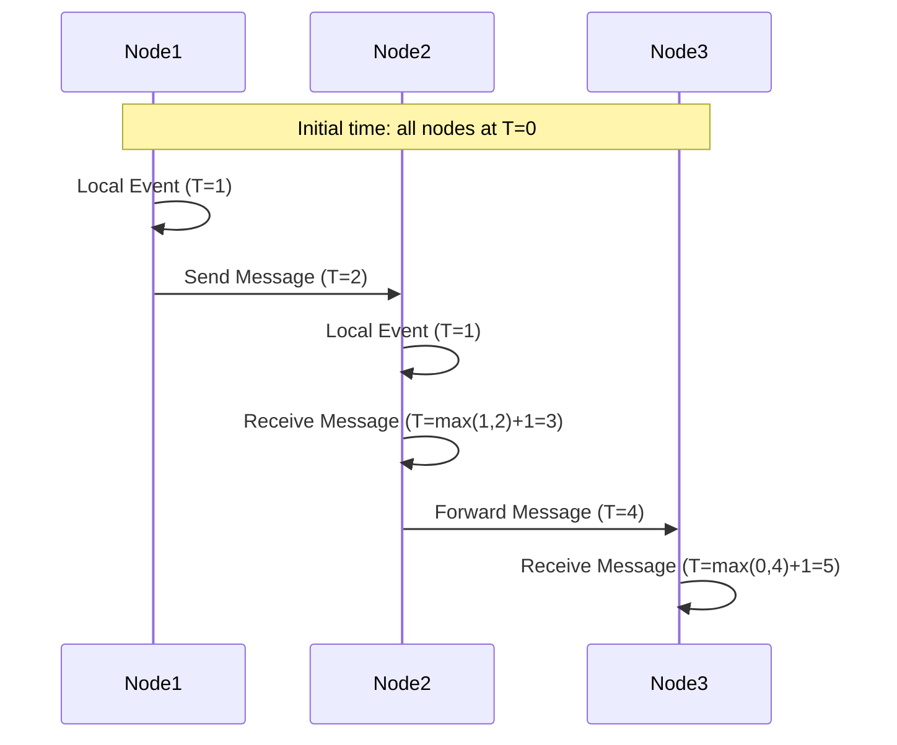

# Truth Distribution: Consensus in Distributed Systems

[Home](/) > [Core Principles](/core-principles/) > [The 5 Pillars](/core-principles/pillars/) > Truth Distribution

<div class="truth-box">
<h2>⚡ The One-Inch Punch</h2>
<p><strong>Your database doesn't store truth. It stores votes about truth.</strong></p>
<p>In distributed systems, reality = quorum × time. Every "fact" expires.</p>
</div>

{{ page.meta.audio_widget }}

## 🔥 The Shock: Your Production Truth Right Now

```
┌─────────────────────────────────────────────────────────────┐
│           YOUR "CONSISTENT" DATABASE AT 3:42 PM             │
├─────────────────────────────────────────────────────────────┤
│                                                             │
│  What you think:           What's actually happening:       │
│  ───────────────           ─────────────────────────       │
│  [PRIMARY]                 [PRIMARY-DC1] Balance: $1000     │
│      ↓                     [REPLICA-DC2] Balance: $1050     │
│  [REPLICAS]                [REPLICA-DC3] Balance: $950      │
│                                                             │
│                            Which is true? ALL OF THEM.      │
│                            For 47ms. Then votes happen.     │
│                                                             │
│  REAL INCIDENTS YESTERDAY:                                  │
│  • GitHub: 43s of split-brain writes                       │
│  • Stripe: 2 different payment totals for 90s              │
│  • Your system: ??? (You're not measuring this)            │
└─────────────────────────────────────────────────────────────┘
```

## 💥 The Truth Decay Timeline (How Facts Die)

```
T+0ms    LOCAL TRUTH        "I wrote X=5"           100% sure
         ↓
T+10ms   PROMISED TRUTH     "Leader got X=5"        99% sure
         ↓
T+50ms   QUORUM TRUTH       "Majority has X=5"      95% sure
         ↓
T+200ms  REPLICATED TRUTH   "Most nodes have X=5"   90% sure
         ↓
T+1000ms EVENTUAL TRUTH     "X converges to 5ish"   80% sure
         ↓
T+1hour  HISTORICAL TRUTH   "X was probably 5"      60% sure
         ↓
T+1day   ARCHIVED TRUTH     "Records show X≈5"      40% sure

⚠️ TRUTH HAS A HALF-LIFE. It decays with time and distance.
```

## 🎯 The Truth Spectrum: Pick Your $$ Poison

```
┌─────────────────────────────────────────────────────────────┐
│                  TRUTH ECONOMICS 2025                       │
├─────────────────────────────────────────────────────────────┤
│                                                             │
│ TRUTH TYPE      LATENCY    COST/GB    FAILURE MODE         │
│ ══════════════════════════════════════════════════════════ │
│                                                             │
│ LOCAL           <1ms       $0.001     "Split brain city"   │
│ "My truth"                            100 versions exist    │
│                                                             │
│ EVENTUAL        ~10ms      $0.02      "Sibling explosion"  │
│ "We'll agree"                         [A, B, C, D, E...]    │
│                                                             │
│ CAUSAL          ~50ms      $0.25      "Vector overflow"    │
│ "Order matters"                       {A:99,B:102,C:97...}  │
│                                                             │
│ CONSENSUS       ~200ms     $1.00      "Minority partition" │
│ "Majority rules"                      49% lose writes       │
│                                                             │
│ TOTAL ORDER     ~1000ms    $10.00     "Global stop"        │
│ "One timeline"                        Earth-wide pause      │
│                                                             │
│ 💸 10,000x COST DIFFERENCE = 1,000x LATENCY DIFFERENCE     │
└─────────────────────────────────────────────────────────────┘
```

## 🧠 The Mental Model Revolution

```
OLD BRAIN (WRONG)                NEW BRAIN (RIGHT)
═══════════════════════         ═════════════════════════════

"Query the master"          →    "Negotiate with the quorum"
"Find the true value"       →    "Pick the winning vote"  
"Prevent inconsistency"     →    "Embrace temporary chaos"
"Time orders events"        →    "Consensus manufactures order"
"Strong consistency"        →    "Expensive consistency"
"Read the database"         →    "Read one node's opinion"
```

## ⚔️ The Five Horsemen of Truth Death

```
┌─────────────────────────────────────────────────────────────┐
│ HORSEMAN 1: SPLIT BRAIN SYNDROME                 💀 $7M/hr │
├─────────────────────────────────────────────────────────────┤
│                                                             │
│  VIRGINIA          OREGON           WHAT HAPPENS:          │
│  ┌──────┐         ┌──────┐                                 │
│  │LEADER│ ═══X═══ │LEADER│         Both accept writes      │
│  │"I AM"│         │"I AM"│         Different data forever  │
│  └──────┘         └──────┘         No automatic fix        │
│                                                             │
│  GitHub 2018: 43 seconds, 1.2M webhook events diverged     │
└─────────────────────────────────────────────────────────────┘

┌─────────────────────────────────────────────────────────────┐
│ HORSEMAN 2: THE BYZANTINE LIAR                   💀 $5M/hr │
├─────────────────────────────────────────────────────────────┤
│                                                             │
│  Node A─────"BALANCE: $1000"────►Node B                    │
│       └────"BALANCE: $0"────────►Node C                    │
│                                                             │
│  WHO TO BELIEVE? No consensus without 2f+1 honest nodes    │
│                                                             │
│  Cosmos 2021: Validator lies caused 7-hour chain halt      │
└─────────────────────────────────────────────────────────────┘

┌─────────────────────────────────────────────────────────────┐
│ HORSEMAN 3: TIME TRAITORS                        💀 $3M/hr │
├─────────────────────────────────────────────────────────────┤
│                                                             │
│  Clock A: Transaction at 14:00:00.000                      │
│  Clock B: Transaction at 13:59:59.950 (50ms behind)        │
│                                                             │
│  SAME MOMENT? B happened first by clock, A first by reality│
│                                                             │
│  Cloudflare 2020: 27min outage from 30ms clock drift       │
└─────────────────────────────────────────────────────────────┘

┌─────────────────────────────────────────────────────────────┐
│ HORSEMAN 4: PHANTOM WRITES                       💀 $2M/hr │
├─────────────────────────────────────────────────────────────┤
│                                                             │
│  Client──WRITE──►Leader──┐                                  │
│                          💥CRASH                            │
│                          │                                  │
│  Did write succeed?      └─► NOBODY KNOWS                  │
│                                                             │
│  MongoDB 2019: 12 hours of "maybe committed" transactions   │
└─────────────────────────────────────────────────────────────┘

┌─────────────────────────────────────────────────────────────┐
│ HORSEMAN 5: VERSION VECTOR EXPLOSION             💀 $1M/hr │
├─────────────────────────────────────────────────────────────┤
│                                                             │
│  Node A: {A:10, B:5, C:3}  ─┐                              │
│  Node B: {A:8, B:7, C:3}   ─┼─ ALL CONCURRENT!            │
│  Node C: {A:9, B:5, C:4}   ─┘                              │
│                                                             │
│  Result: {ValueA, ValueB, ValueC} → User picks??? 😱        │
│                                                             │
│  DynamoDB 2022: Cart with 47 conflicting versions          │
└─────────────────────────────────────────────────────────────┘
```

## 🏗️ Truth Architectures: From Simple to Cosmic

### Architecture 1: Raft - Democracy for Machines

```
┌─────────────────────────────────────────────────────────────┐
│                  RAFT IN 30 SECONDS                         │
├─────────────────────────────────────────────────────────────┤
│                                                             │
│  FOLLOWER ──150ms timeout──► CANDIDATE ──wins──► LEADER    │
│      ▲                            │                 │       │
│      └──higher term───────────────┴─────────────────┘       │
│                                                             │
│  THE VOTING PROCESS:                                        │
│  ─────────────────                                          │
│  Candidate: "I want to be leader for term 42"              │
│  Follower₁: "You have newer logs, here's my vote"          │
│  Follower₂: "Sure, you're the first to ask"                │
│  Follower₃: "Already voted for someone else"               │
│                                                             │
│  Result: 2/3 votes = NEW LEADER 👑                         │
│                                                             │
│  WRITE PATH:           Client ──► Leader ──┬──► Follower₁  │
│                                            ├──► Follower₂  │
│                                            └──► Follower₃  │
│                                                   │         │
│                                       Majority ACK = COMMIT │
└─────────────────────────────────────────────────────────────┘
```

### Architecture 2: CRDTs - Truth Without Coordination

```
┌─────────────────────────────────────────────────────────────┐
│            CRDTs: ALWAYS CONVERGE, NEVER CONFLICT           │
├─────────────────────────────────────────────────────────────┤
│                                                             │
│  G-COUNTER (Can only grow):                                │
│  ─────────────────────────                                  │
│  DC1: [5,0,0] ─┐                                           │
│  DC2: [0,3,0] ─┼─MERGE─► [5,3,2] = 10                     │
│  DC3: [0,0,2] ─┘         (max per position)               │
│                                                             │
│  OR-SET (Add/Remove with IDs):                             │
│  ─────────────────────────────                             │
│  A: +milk#id1 ────┐                                        │
│  B: +eggs#id2 ────┼─MERGE─► {milk#id1, eggs#id2}          │
│  C: -milk#id1 ────┘          (union adds - removes)        │
│                                                             │
│  LWW-REGISTER (Last Write Wins):                           │
│  ───────────────────────────────                           │
│  A: (val:"X", time:100) ─┐                                 │
│  B: (val:"Y", time:200) ─┼─MERGE─► "Y" wins               │
│  C: (val:"Z", time:150) ─┘         (highest timestamp)     │
│                                                             │
│  NO COORDINATION NEEDED. MATH GUARANTEES CONVERGENCE! 🎯    │
└─────────────────────────────────────────────────────────────┘
```

### Architecture 3: Vector Clocks - Tracking Who Knows What

```
┌─────────────────────────────────────────────────────────────┐
│               VECTOR CLOCKS: CAUSALITY TRACKER              │
├─────────────────────────────────────────────────────────────┤
│                                                             │
│  DETECTING CAUSALITY:                                       │
│  ───────────────────                                        │
│  A:[1,0,0] ──msg──► B:[1,1,0] ──msg──► C:[1,1,1]          │
│      │                                      ▲               │
│      └────────parallel write────────────────┘               │
│                A:[2,0,0]                                    │
│                                                             │
│  COMPARISON RULES:                                          │
│  ────────────────                                           │
│  [1,0,0] < [1,1,0]  = A happened before B ✓               │
│  [2,0,0] ? [1,1,1]  = CONCURRENT! 🔀                      │
│                                                             │
│  if all(a[i] <= b[i]) && any(a[i] < b[i]): A → B         │
│  else if reverse: B → A                                    │
│  else: CONCURRENT (need resolution)                        │
│                                                             │
│  REAL USE: DynamoDB tracks 1M+ concurrent shopping carts   │
└─────────────────────────────────────────────────────────────┘
```

## 📊 Dashboard Reality Bridge: See Truth Decay Live

```
┌─────────────────────────────────────────────────────────────┐
│              PRODUCTION TRUTH METRICS                       │
├─────────────────────────────────────────────────────────────┤
│                                                             │
│ METRIC                    QUERY                    ALERT    │
│ ═══════════════════════════════════════════════════════════ │
│                                                             │
│ Split Brain Detection                                       │
│ count(leaders) BY dc      leaders_per_dc > 1      PAGES    │
│                                                             │
│ Consensus Lag                                               │
│ max(raft_commit_lag_ms)   consensus_lag > 500ms   WARN     │
│                                                             │
│ Version Divergence                                          │
│ max(vector_clock_size)    vector_size > 10        ALERT    │
│                                                             │
│ Truth Decay Rate                                            │
│ rate(conflicts/sec)       conflicts > 100/s       CRITICAL  │
│                                                             │
│ Byzantine Nodes                                             │
│ sum(vote_mismatches)      mismatches > 0          PAGES    │
│                                                             │
│ ┌─────────────────────────────────────────┐                │
│ │  YOUR TRUTH HEALTH: 47ms behind reality │                │
│ └─────────────────────────────────────────┘                │
└─────────────────────────────────────────────────────────────┘
```

## 💥 Case Study: The $73M Bitcoin Truth Crisis

```
┌─────────────────────────────────────────────────────────────┐
│          BITCOIN MARCH 2013: WHEN TRUTH FORKED              │
├─────────────────────────────────────────────────────────────┤
│                                                             │
│ MINUTE-BY-MINUTE DISASTER:                                  │
│ ─────────────────────────                                   │
│ 00:00  Block 225,430 mined (>900KB due to bug)            │
│        v0.8 nodes: "VALID! Mine on top"                    │
│        v0.7 nodes: "INVALID! Reject it"                    │
│                                                             │
│ 00:19  Two realities emerge:                               │
│        ┌─────────────┐     ┌─────────────┐                │
│        │ Chain A     │     │ Chain B     │                │
│        │ 60% miners  │     │ 40% miners  │                │
│        │ Growing fast│     │ Growing slow│                │
│        └─────────────┘     └─────────────┘                │
│                                                             │
│ 02:30  EXCHANGES ON DIFFERENT TRUTHS:                      │
│        MtGox:     Following Chain B (v0.7)                 │
│        BitStamp:  Following Chain A (v0.8)                 │
│        Coinbase:  SHUT DOWN (can't determine truth)        │
│                                                             │
│ 03:00  DOUBLE SPEND WINDOW OPEN 💀                         │
│        Send BTC on Chain A → Exchange 1                    │
│        Send SAME BTC on Chain B → Exchange 2               │
│        BOTH VALID IN THEIR REALITIES                       │
│                                                             │
│ 06:00  HUMAN CONSENSUS REQUIRED:                           │
│        Core devs: "Everyone downgrade to v0.7"             │
│        Miners: "We'll voluntarily orphan Chain A"          │
│                                                             │
│ 06:24  THE GREAT ABANDONMENT:                              │
│        24 blocks thrown away                                │
│        600 BTC mining rewards → GONE                       │
│        $73M of transactions → REVERSED                      │
│                                                             │
│ LESSON: Even "trustless" truth needs human consensus       │
└─────────────────────────────────────────────────────────────┘
```

## 🌍 Google Spanner: Engineering Truth at Planetary Scale

```
┌─────────────────────────────────────────────────────────────┐
│         SPANNER: USING ATOMIC CLOCKS TO CREATE TRUTH        │
├─────────────────────────────────────────────────────────────┤
│                                                             │
│  THE HARDWARE TRUTH LAYER:                                  │
│  ────────────────────────                                   │
│  ┌─────────┐ ┌─────────┐ ┌─────────┐                      │
│  │ GPS #1  │ │ ATOMIC  │ │ GPS #2  │  Per datacenter      │
│  └────┬────┘ └────┬────┘ └────┬────┘                      │
│       └───────────┴───────────┘                            │
│                   │                                         │
│           TIME MASTER SERVER                                │
│           "True time ± 4ms"                                 │
│                   │                                         │
│    ┌──────────────┼──────────────┐                         │
│    │              │              │                          │
│  ZONE A        ZONE B         ZONE C                       │
│                                                             │
│  THE TRUETIME API:                                          │
│  ────────────────                                           │
│  now() returns: [earliest, latest]                         │
│  Example: [1000.000, 1000.004] = 4ms uncertainty          │
│                                                             │
│  ACHIEVING GLOBAL TRUTH:                                    │
│  ──────────────────────                                     │
│  1. Start transaction → ts = TT.now().latest              │
│  2. Prepare writes across zones                            │
│  3. Wait until TT.now().earliest > ts                     │
│  4. Commit with guarantee: "No one has earlier timestamp"  │
│                                                             │
│  COST: 4-7ms commit delay for PLANETARY CONSENSUS          │
│  SCALE: 10B+ requests/day across Earth                     │
└─────────────────────────────────────────────────────────────┘
```

## 🚨 FLP Impossibility: Why Perfect Truth Can't Exist

```
┌─────────────────────────────────────────────────────────────┐
│      FISCHER-LYNCH-PATERSON: THE TRUTH KILLER (1985)       │
├─────────────────────────────────────────────────────────────┤
│                                                             │
│  THE IMPOSSIBILITY THEOREM:                                 │
│  ─────────────────────────                                  │
│  In a system with:                                          │
│  • No guaranteed message delivery time                      │
│  • No guaranteed processing speed                           │
│  • Even ONE possible node failure                           │
│                                                             │
│  CONSENSUS IS MATHEMATICALLY IMPOSSIBLE 💀                  │
│                                                             │
│  WHY THIS MATTERS:                                          │
│  ────────────────                                           │
│  Can't distinguish:  [SLOW NODE] vs [DEAD NODE]            │
│                            ?                                │
│  Wait longer?   → Might be dead (wastes time)              │
│  Declare dead?  → Might be slow (splits brain)             │
│                                                             │
│  HOW REAL SYSTEMS CHEAT:                                    │
│  ──────────────────────                                     │
│  • Timeouts:     "Probably dead after 5s"                  │
│  • Randomness:   "Eventually someone wins"                 │
│  • Oracles:      "External observer decides"               │
│  • Majority:     "51% can't all be wrong"                  │
│                                                             │
│  Your Raft timeout? That's accepting imperfection.         │
└─────────────────────────────────────────────────────────────┘
```

## 🎯 The Truth Decision Tree

```
IF your_data == "user_preferences":
    USE eventual_consistency        # S3, DynamoDB
    COST = $0.02/GB, LATENCY = 10ms
    
ELIF your_data == "shopping_cart":
    USE crdts                      # Riak, Redis CRDTs  
    COST = $0.10/GB, LATENCY = 5ms
    
ELIF your_data == "financial_transactions":
    USE consensus                  # etcd, Consul
    COST = $1.00/GB, LATENCY = 200ms
    
ELIF your_data == "global_ordering_critical":
    USE total_order               # Spanner, Calvin
    COST = $10.00/GB, LATENCY = 1000ms
    
ELIF your_data == "audit_trail":
    USE blockchain                # Hyperledger
    COST = $50.00/GB, LATENCY = 10min
    
ELSE:
    START with eventual
    MEASURE conflict rate
    UPGRADE only if conflicts > business_threshold
```

## 🔧 Production Checklist: Truth Systems

```
┌─────────────────────────────────────────────────────────────┐
│              BEFORE YOU DEPLOY CONSENSUS                    │
├─────────────────────────────────────────────────────────────┤
│                                                             │
│ □ REQUIREMENTS CLARITY                                      │
│   ├─ □ Define "consistent enough" (eventual? strong?)      │
│   ├─ □ Measure conflict rate in prod (conflicts/sec)       │
│   └─ □ Cost model: latency × throughput × durability       │
│                                                             │
│ □ FAILURE MODE PLANNING                                     │
│   ├─ □ Split brain detection (count leaders)               │
│   ├─ □ Partition handling (minority behavior)              │
│   └─ □ Clock sync monitoring (<10ms drift)                 │
│                                                             │
│ □ ALGORITHM SELECTION                                       │
│   ├─ □ <5 nodes: Raft (simple, fast)                      │
│   ├─ □ 5-20 nodes: Multi-Paxos (robust)                   │
│   └─ □ >20 nodes: Hierarchical (regional + global)        │
│                                                             │
│ □ OPERATIONAL READINESS                                     │
│   ├─ □ Consensus lag alerts (<500ms)                       │
│   ├─ □ Leader election metrics                             │
│   └─ □ Conflict resolution SOP                             │
│                                                             │
│ □ TESTING CONFIDENCE                                        │
│   ├─ □ Jepsen test results                                │
│   ├─ □ Network partition drills                           │
│   └─ □ Clock skew chaos testing                           │
└─────────────────────────────────────────────────────────────┘
```

## 💡 The Wisdom: Truth Is a Spectrum, Not Binary

```
┌─────────────────────────────────────────────────────────────┐
│                  THE TRUTH HIERARCHY                        │
├─────────────────────────────────────────────────────────────┤
│                                                             │
│  LEVEL 5: BLOCKCHAIN TRUTH         💰💰💰💰💰 ($50/GB)     │
│  └─ Immutable, global, 10min latency                       │
│                                                             │
│  LEVEL 4: TOTAL ORDER              💰💰💰💰 ($10/GB)       │
│  └─ Spanner, Calvin, GPS clocks                            │
│                                                             │
│  LEVEL 3: CONSENSUS                💰💰💰 ($1/GB)          │
│  └─ Raft, Paxos, etcd, Zookeeper                          │
│                                                             │
│  LEVEL 2: CAUSAL                   💰💰 ($0.10/GB)         │
│  └─ Vector clocks, Dynamo, Kafka                          │
│                                                             │
│  LEVEL 1: EVENTUAL                 💰 ($0.02/GB)           │
│  └─ S3, CDN, DNS, CRDTs                                   │
│                                                             │
│  LEVEL 0: LOCAL                    ¢ ($0.001/GB)          │
│  └─ Cache, in-memory, no coordination                     │
│                                                             │
│  REMEMBER: Each level = 10x cost, 10x latency, 10x pain   │
└─────────────────────────────────────────────────────────────┘
```

## 🏛️ Multi-Region Truth: The Real Challenge

```
┌─────────────────────────────────────────────────────────────┐
│           HIERARCHICAL CONSENSUS FOR PLANET EARTH           │
├─────────────────────────────────────────────────────────────┤
│                                                             │
│                    GLOBAL COORDINATOR                       │
│                   (Loosely coupled)                         │
│                          │                                  │
│      ┌───────────────────┼───────────────────┐             │
│      │                   │                   │             │
│  [US-EAST]           [EU-WEST]          [ASIA-PAC]         │
│  5x Raft             5x Raft            5x Raft            │
│  ┌─┬─┬─┬─┐          ┌─┬─┬─┬─┐         ┌─┬─┬─┬─┐        │
│  └─┴─┴─┴─┘          └─┴─┴─┴─┘         └─┴─┴─┴─┘        │
│                                                             │
│  LATENCY REALITY:                                           │
│  ───────────────                                            │
│  Intra-region:     1-5ms    (speed of light in fiber)      │
│  Cross-region:     50-200ms (Earth is big)                 │
│  Global consensus: 200-1000ms (coordination overhead)       │
│                                                             │
│  CONSISTENCY OPTIONS:                                       │
│  ──────────────────                                         │
│  LOCAL_QUORUM:   Fast (5ms), region can diverge           │
│  EACH_QUORUM:    Slow (200ms), regions synchronized       │
│  GLOBAL_QUORUM:  Glacial (1s), perfect consistency        │
│                                                             │
│  Most systems: LOCAL with async replication                │
└─────────────────────────────────────────────────────────────┘
```

## 🚀 Advanced: The CAP Theorem Escape Routes

```
┌─────────────────────────────────────────────────────────────┐
│              BENDING CAP: HAVING YOUR CAKE                  │
├─────────────────────────────────────────────────────────────┤
│                                                             │
│  TECHNIQUE 1: CRDTS (Avoid the choice)                     │
│  ─────────────────────────────────────                     │
│  Partition?  ✓ Keep writing (Available)                    │
│  Consistent? ✓ Math guarantees merge (Consistent)          │
│  How?        State-based convergence, no coordination      │
│                                                             │
│  TECHNIQUE 2: SPECULATIVE EXECUTION                        │
│  ──────────────────────────────────                        │
│  Write locally, assume success                              │
│  If consensus fails later, compensate                      │
│  Example: Google Docs collaborative editing                 │
│                                                             │
│  TECHNIQUE 3: WITNESS NODES                                │
│  ─────────────────────────                                  │
│  2 data nodes + 1 witness (metadata only)                  │
│  Cheaper than 3 full replicas                              │
│  Still maintains consensus properties                       │
│                                                             │
│  TECHNIQUE 4: PROBABILISTIC CONSISTENCY                     │
│  ─────────────────────────────────────                     │
│  PBS: "Probably consistent within 100ms"                    │
│  Measure and guarantee percentiles                         │
│  Trade certainty for performance                           │
└─────────────────────────────────────────────────────────────┘
```

## Real-World Truth Examples

<div class="axiom-box">
<h3>💥 Truth Paradox</h3>
<p><strong>"The more nodes agree on truth, / the less true / it needs to be."</strong></p>
<p>That's why Bitcoin works: agreement matters more than accuracy.</p>
</div>

### 🌍 Google Spanner: Engineering Global Truth

```
┌─────────────────────────────────────────────────────────────┐
│         THE PROBLEM: GLOBAL BANK TRANSFERS                  │
├─────────────────────────────────────────────────────────────┤
│                                                             │
│ TOKYO          NEW YORK        LONDON                       │
│ 09:00:00.123   20:00:00.456   01:00:00.789                │
│ Transfer $1M   Transfer $2M    Transfer $3M                 │
│                                                             │
│ QUESTION: What order did these happen? 🤷                   │
│                                                             │
│ OLD WAY: Pick arbitrary order = WRONG BALANCES 💀           │
│ SPANNER: True global ordering = CORRECT ALWAYS ✅           │
└─────────────────────────────────────────────────────────────┘
```

### ⚡ Bitcoin: The $1 Trillion Consensus

```
┌─────────────────────────────────────────────────────────────┐
│              BITCOIN'S CONSENSUS INNOVATION                 │
├─────────────────────────────────────────────────────────────┤
│                                                             │
│ THE IMPOSSIBLE PROBLEM:                                     │
│ • No trusted parties                                        │
│ • Anyone can participate                                    │
│ • Byzantine actors expected                                 │
│ • Must agree on money! 💰                                   │
│                                                             │
│ THE SOLUTION: PROOF OF WORK                                 │
│                                                             │
│ Block N       Block N+1      Block N+2                      │
│ ┌─────────┐   ┌─────────┐   ┌─────────┐                   │
│ │Nonce:   │──►│Nonce:   │──►│Nonce:   │                   │
│ │74619284 │   │92847561 │   │???????? │                   │
│ │Hash:    │   │Hash:    │   │Mining... │                   │
│ │00000af3 │   │00000b91 │   │          │                   │
│ └─────────┘   └─────────┘   └─────────┘                   │
│                                                             │
│ CONSENSUS RULE: Longest chain wins                         │
│                                                             │
│ ATTACK COST:                                                │
│ 51% attack = $30 BILLION in hardware + electricity         │
└─────────────────────────────────────────────────────────────┘
```

### 📊 Kafka: 7 Trillion Messages of Truth

```
┌─────────────────────────────────────────────────────────────┐
│            KAFKA'S LOG-BASED TRUTH MODEL                    │
├─────────────────────────────────────────────────────────────┤
│                                                             │
│ KAFKA'S SOLUTION: THE IMMUTABLE LOG                        │
│                                                             │
│ Producers          THE LOG              Consumers          │
│ ┌────────┐        ┌─┬─┬─┬─┬─┐         ┌─────────┐        │
│ │Order Svc├──────►│1│2│3│4│5│────────►│Analytics│        │
│ └────────┘        └─┴─┴─┴─┴─┘         └─────────┘        │
│ ┌────────┐              ▲              ┌─────────┐        │
│ │User Svc ├─────────────┘   └─────────►│Billing  │        │
│ └────────┘                             └─────────┘        │
│                                        ┌─────────┐        │
│                              └─────────►│Search   │        │
│                                        └─────────┘        │
│                                                             │
│ BENEFITS:                                                   │
│ • Decoupled: Services don't know about each other         │
│ • Replayable: Can rebuild any service from log            │
│ • Ordered: Events have definitive sequence                │
│ • Scalable: Partitioned for 1M+ events/second             │
└─────────────────────────────────────────────────────────────┘
```

### 🔐 ZooKeeper: The Coordination Backbone

```
┌─────────────────────────────────────────────────────────────┐
│            ZOOKEEPER POWERS HALF THE INTERNET               │
├─────────────────────────────────────────────────────────────┤
│                                                             │
│ WHAT IT DOES:                                               │
│                                                             │
│ /kafka                    /hbase                            │
│   /brokers                 /master                          │
│     /1 → host:port          → host:port                     │
│     /2 → host:port        /region-servers                   │
│     /3 → host:port          /1 → metadata                   │
│   /topics                   /2 → metadata                   │
│     /orders                                                 │
│       /0 → leader:1       /solr                            │
│       /1 → leader:2         /collections                    │
│                              /search → config               │
│                                                             │
│ ONE ZOOKEEPER COORDINATES:                                  │
│ • Kafka broker discovery & topic metadata                  │
│ • HBase master election & region assignment                │
│ • Solr/Elasticsearch cluster state                         │
│ • Distributed locks for 1000s of services                  │
│                                                             │
│ THE MAGIC: Strong consistency with watches                 │
└─────────────────────────────────────────────────────────────┘
```

## Truth Exercises

### Exercise 1: Design a Lamport Clock System

**Challenge**: Design a visual representation of logical time ordering across distributed nodes.

#### Design Task

Create a sequence diagram showing how Lamport clocks maintain causality:



#### Design Requirements

1. **State Diagram**: Show clock advancement rules
2. **Timeline Visualization**: Display event ordering
3. **Causality Graph**: Map happens-before relationships

### Exercise 2: Design a Two-Phase Commit Protocol

**Challenge**: Design visual representations of the 2PC distributed transaction protocol.

#### Protocol State Machines

!!! info "2PC State Transitions"
    Design state machines for both coordinator and participants:
    **Coordinator States:**
    - INIT → WAITING (send prepare)
    - WAITING → COMMIT (all vote yes)
    - WAITING → ABORT (any vote no/timeout)
    - COMMIT → END (all acknowledged)
    - ABORT → END (all acknowledged)
    **Participant States:**
    - INIT → READY (receive prepare, vote yes)
    - INIT → ABORT (receive prepare, vote no)
    - READY → COMMIT (receive global commit)
    - READY → ABORT (receive global abort)

### Exercise 3: Design Byzantine Fault Tolerance

**Challenge**: Design visual solutions for the Byzantine Generals Problem with faulty nodes.

#### Byzantine Agreement Protocol

!!! note "Byzantine Fault Tolerance Rules"
    Design visual representations for:
    1. **3f+1 Rule**
    - Need 3f+1 nodes to tolerate f Byzantine faults
    - Visual proof of why 3f nodes are insufficient
    2. **Message Rounds**
    - f+1 rounds of message exchange
    - Exponential message growth visualization
    3. **Decision Making**
    - Majority voting after all rounds
    - Handling conflicting messages

## 💭 The Deep Questions That Keep You Awake

**Q: If truth is just votes, is anything real in our systems?**
```
Reality = f(observers, time)
Single node truth ≠ System truth ≠ Business truth
Every measurement changes the system (Heisenberg for DBs)
```

**Q: Why can't we just have a master node decide everything?**
```
Masters fail → Split brain
Masters lag → Bottleneck  
Masters lie → Byzantine failures
Masters = Single points of failure
```

**Q: When should I accept eventual consistency?**
```
When conflicts_per_day < customer_complaints_threshold
When resolution is automatic (CRDTs)
When time_to_consistency < business_impact_time
When cost of consistency > value of consistency
```

## 🎯 The Transformation: How You'll Think Now

```
BEFORE: "Check the database for truth"
AFTER:  "Check the quorum's current opinion"

BEFORE: "Ensure consistency"
AFTER:  "Choose consistency level vs cost"

BEFORE: "Prevent split brain"
AFTER:  "Detect and heal split brain quickly"

BEFORE: "Transaction committed successfully"
AFTER:  "Transaction probably committed to majority"

BEFORE: "The system knows the state"
AFTER:  "The system negotiates state continuously"
```

## 🏁 Summary: The New Truth

In distributed systems:
- **Truth isn't discovered, it's negotiated**
- **Every fact has a confidence level and expiration date**
- **Consistency is a luxury good - pay only for what you need**
- **Perfect consensus is impossible; good enough consensus is expensive**
- **Your database stores votes, not truths**

The moment you internalize this, you stop trying to "find" truth and start designing systems that "manufacture" truth efficiently.

---

*"In distributed systems, reality is what the majority agrees happened, until they change their minds."*