# Pillar 3: Truth Distribution

## 1. The Complete Blueprint

Truth distribution in distributed systems involves establishing consensus and agreement mechanisms across distributed nodes when there's no single, authoritative source of truth. At its core, we use consensus algorithms like Raft and Paxos to elect leaders and agree on state changes, quorum systems to make decisions based on majority agreement, vector clocks and logical timestamps to order events across nodes, conflict resolution strategies to handle concurrent updates, and Byzantine fault tolerance mechanisms to operate correctly even when some nodes behave maliciously. These components work together to create systems that can agree on what happened when, maintain consistent state across network partitions, resolve conflicts between competing updates, and provide strong guarantees about data integrity even in the face of failures and adversarial behavior.


> **What You'll Master**: Implementing consensus algorithms that can elect leaders and replicate state reliably, designing quorum systems that balance consistency with availability, using logical clocks to establish causal relationships between events, building conflict resolution mechanisms that preserve data integrity, and creating Byzantine fault-tolerant systems that work correctly even with malicious nodes.

## 2. The Core Mental Model

**The Supreme Court Analogy**: Truth distribution is like how the Supreme Court makes binding decisions for an entire nation. You have multiple justices (nodes) who must agree on important cases (consensus), majority rule for most decisions (quorum systems), careful consideration of the order in which cases were filed (logical clocks), procedures for handling conflicting lower court decisions (conflict resolution), and safeguards against corrupt justices (Byzantine fault tolerance). The key insight is that there's no single "correct" answer - truth emerges from the process of agreement among multiple parties.

**The Fundamental Principle**: *In distributed systems, truth is not discovered but negotiated through algorithms that guarantee agreement even when individual nodes fail, lie, or become disconnected.*

Why this matters in practice:
- **Network partitions make truth relative** - during a partition, each side may have a different but locally consistent view of reality
- **Time is not global** - you cannot rely on timestamps to order events across nodes because clocks drift and networks have latency
- **Byzantine failures are real** - nodes can behave arbitrarily due to bugs, corruption, or malicious attacks, not just crash failures

## 3. The Journey Ahead


**Pattern Interconnections:**
- **Raft + Quorum Systems** = Scalable consensus with tunable consistency levels
- **Vector Clocks + CRDTs** = Causal consistency with automatic conflict resolution
- **Byzantine Consensus + Blockchain** = Trustless systems with economic incentives
- **Hybrid Logical Clocks + Distributed Databases** = Global ordering with efficiency

**Common Truth Distribution Pitfalls:**
- **Split Brain**: Multiple leaders elected during network partitions
- **Lost Updates**: Concurrent writes where one overwrites another silently
- **Causal Violations**: Events appearing to happen before their causes
- **Byzantine Amplification**: Malicious nodes causing system-wide failures

## Core Truth Distribution Patterns

### Pattern 1: Raft Consensus Algorithm


### Pattern 2: Quorum-based Decision Making


### Pattern 3: Vector Clock Causality Tracking

```mermaid
sequenceDiagram
    participant NodeA as Node A [0,0,0]
    participant NodeB as Node B [0,0,0]
    participant NodeC as Node C [0,0,0]
    
    Note over NodeA,NodeC: Vector Clock Updates
    
    NodeA->>NodeA: Local Event
    Note over NodeA: [1,0,0]
    
    NodeA->>NodeB: Send Message with [1,0,0]
    NodeB->>NodeB: Receive & Update
    Note over NodeB: max([0,0,0], [1,0,0]) + [0,1,0] = [1,1,0]
    
    par Concurrent Events
        NodeB->>NodeB: Local Event
        Note over NodeB: [1,2,0]
    and
        NodeC->>NodeC: Local Event  
        Note over NodeC: [0,0,1]
    end
    
    NodeB->>NodeC: Send Message with [1,2,0]
    NodeC->>NodeC: Receive & Update
    Note over NodeC: max([0,0,1], [1,2,0]) + [0,0,1] = [1,2,2]
    
    Note over NodeA,NodeC: Causality Analysis
    Note over NodeA,NodeC: [1,0,0] → [1,1,0] (A happened before B)
    Note over NodeA,NodeC: [1,2,0] || [0,0,1] (B and C concurrent)
```



## Real-World Examples

### etcd: Raft-based Key-Value Store

etcd provides distributed consensus for Kubernetes and other systems:

```bash
# Start etcd cluster
etcd --name node1 --initial-cluster node1=http://10.0.0.1:2380,node2=http://10.0.0.2:2380,node3=http://10.0.0.3:2380

# Client operations with linearizable consistency
etcdctl put /config/database "postgresql://localhost:5432"
etcdctl get /config/database

# Watch for changes (gets notified of all updates)
etcdctl watch /config/ --prefix

# Atomic operations
etcdctl txn <<EOF
compare:
  value("/users/count") = "100"
success:
  put /users/count "101"
  put /users/last_updated "$(date)"
failure:
  get /users/count
EOF
```

**Guarantees**: Linearizable reads and writes, leader election in < 5 seconds during failures, automatic recovery from minority node failures.

### DynamoDB: Tunable Consistency with Quorums

Amazon DynamoDB allows tuning between consistency and performance:

```python
import boto3

dynamodb = boto3.client('dynamodb')

# Eventually consistent read (default) - cheap and fast
response = dynamodb.get_item(
    TableName='UserProfiles',
    Key={'user_id': {'S': '12345'}},
    ConsistentRead=False  # May return stale data
)

# Strongly consistent read - expensive but always current
response = dynamodb.get_item(
    TableName='UserProfiles', 
    Key={'user_id': {'S': '12345'}},
    ConsistentRead=True   # Always returns latest committed data
)

# Conditional writes for optimistic concurrency
try:
    dynamodb.put_item(
        TableName='UserProfiles',
        Item={
            'user_id': {'S': '12345'},
            'balance': {'N': '100'},
            'version': {'N': '2'}
        },
        ConditionExpression='version = :expected_version',
        ExpressionAttributeValues={':expected_version': {'N': '1'}}
    )
except ClientError as e:
    if e.response['Error']['Code'] == 'ConditionalCheckFailedException':
        # Handle concurrent update conflict
        handle_optimistic_lock_failure()
```

**Trade-offs**: Eventually consistent reads are 50% cheaper and 2x faster but may lag by ~100ms during updates.

### Riak: CRDT-based Conflict Resolution

Riak uses Conflict-free Replicated Data Types for automatic conflict resolution:

```javascript
// G-Counter (grow-only counter) CRDT
const gCounter = new Map();

// Node A increments
gCounter.set('nodeA', (gCounter.get('nodeA') || 0) + 5);

// Node B increments (concurrent)  
gCounter.set('nodeB', (gCounter.get('nodeB') || 0) + 3);

// Automatic merge: sum all node values
const totalValue = Array.from(gCounter.values()).reduce((a, b) => a + b, 0);
// Result: 8 (5 + 3) - no conflicts possible

// OR-Set (observed-remove set) CRDT
class ORSet {
    constructor() {
        this.elements = new Map(); // element -> Set of add tags
        this.tombstones = new Set(); // remove tags
    }
    
    add(element, uniqueTag) {
        if (!this.elements.has(element)) {
            this.elements.set(element, new Set());
        }
        this.elements.get(element).add(uniqueTag);
    }
    
    remove(element) {
        if (this.elements.has(element)) {
            // Mark all current add tags as removed
            for (const tag of this.elements.get(element)) {
                this.tombstones.add(tag);
            }
        }
    }
    
    merge(other) {
        // Union of all elements and tombstones
        for (const [element, tags] of other.elements) {
            if (!this.elements.has(element)) {
                this.elements.set(element, new Set());
            }
            for (const tag of tags) {
                this.elements.get(element).add(tag);
            }
        }
        
        for (const tombstone of other.tombstones) {
            this.tombstones.add(tombstone);
        }
    }
    
    contains(element) {
        if (!this.elements.has(element)) return false;
        
        // Element exists if any add tag is not tombstoned
        for (const tag of this.elements.get(element)) {
            if (!this.tombstones.has(tag)) {
                return true;
            }
        }
        return false;
    }
}
```

**Benefits**: No coordination needed for updates, guaranteed eventual consistency, works offline, mathematical guarantee of convergence.

## Truth Distribution Anti-Patterns

### Anti-Pattern 1: Timestamp-based Ordering Across Nodes

```python
# WRONG: Using wall-clock time for ordering
class NaiveOrdering:
    def handle_update(self, key, value):
        timestamp = time.time()  # Wall clock time
        
        if timestamp > self.last_timestamp[key]:
            self.data[key] = value
            self.last_timestamp[key] = timestamp
        else:
            # Ignore "old" update
            pass
            
# Problems with this approach:
# 1. Clock skew between nodes (can be minutes apart)
# 2. NTP adjustments can move time backwards
# 3. Timezone changes and leap seconds
# 4. No causal relationship guarantee

# RIGHT: Using logical clocks for ordering
class LogicalOrdering:
    def __init__(self, node_id):
        self.logical_clock = 0
        self.node_id = node_id
        self.vector_clock = {}
        
    def handle_local_event(self, key, value):
        self.logical_clock += 1
        timestamp = (self.logical_clock, self.node_id)
        
        self.data[key] = (value, timestamp)
        return timestamp
        
    def handle_remote_update(self, key, value, remote_timestamp):
        remote_clock, remote_node = remote_timestamp
        
        # Update logical clock to maintain causal ordering
        self.logical_clock = max(self.logical_clock, remote_clock) + 1
        
        current_value, current_timestamp = self.data.get(key, (None, (0, '')))
        
        # Compare logical timestamps
        if self.happens_before(current_timestamp, remote_timestamp):
            self.data[key] = (value, remote_timestamp)
        elif self.happens_before(remote_timestamp, current_timestamp):
            # Keep current value
            pass
        else:
            # Concurrent updates - need conflict resolution
            self.resolve_conflict(key, current_value, value, current_timestamp, remote_timestamp)
    
    def happens_before(self, ts1, ts2):
        clock1, node1 = ts1
        clock2, node2 = ts2
        return clock1 < clock2 or (clock1 == clock2 and node1 < node2)
```

### Anti-Pattern 2: Ignoring Byzantine Failures

```python
# WRONG: Assuming all failures are crash failures
class CrashOnlyConsensus:
    def __init__(self, nodes):
        self.nodes = nodes
        self.f = len(nodes) // 2  # Can tolerate f crash failures
        
    def consensus(self, proposal):
        votes = []
        
        for node in self.nodes:
            try:
                vote = node.vote(proposal)
                votes.append(vote)
            except NetworkError:
                # Treat as crash failure - node didn't respond
                continue
                
        # Simple majority
        if votes.count("accept") > len(votes) // 2:
            return "accept"
        else:
            return "reject"

# Problems:
# - Malicious nodes can vote differently to different peers
# - Byzantine nodes can send conflicting messages
# - Can tolerate fewer failures than assumed (only f < n/3 vs f < n/2)

# RIGHT: Byzantine fault tolerant consensus  
class ByzantineConsensus:
    def __init__(self, nodes):
        self.nodes = nodes
        self.n = len(nodes)
        self.f = (self.n - 1) // 3  # Can tolerate f < n/3 Byzantine failures
        
    def pbft_consensus(self, proposal):
        # Phase 1: Pre-prepare
        if not self.is_primary():
            return self.handle_pre_prepare(proposal)
            
        self.broadcast_pre_prepare(proposal)
        
        # Phase 2: Prepare
        prepare_votes = self.collect_prepare_votes(proposal)
        if len(prepare_votes) < 2 * self.f:
            return "abort"  # Not enough honest nodes
            
        # Phase 3: Commit
        self.broadcast_commit(proposal)
        commit_votes = self.collect_commit_votes(proposal)
        
        if len(commit_votes) < 2 * self.f:
            return "abort"
            
        return "commit"
    
    def collect_prepare_votes(self, proposal):
        votes = {}
        
        for node in self.nodes:
            try:
                vote = node.prepare_vote(proposal)
                # Verify signature and message consistency
                if self.verify_vote(vote):
                    votes[node.id] = vote
            except (NetworkError, InvalidSignature):
                continue
                
        return votes
```

## Implementation Patterns

### Pattern: Hybrid Logical Clocks (HLC)

```python
import time
from typing import Tuple

class HybridLogicalClock:
    """
    Combines physical time with logical clock to provide:
    - Monotonic timestamps  
    - Causal ordering
    - Close correlation with physical time
    """
    
    def __init__(self):
        self.logical_time = 0
        self.physical_time_last = 0
    
    def now(self) -> Tuple[int, int]:
        """Generate HLC timestamp for local event"""
        physical_now = int(time.time() * 1000000)  # microseconds
        
        if physical_now > self.physical_time_last:
            # Physical time advanced
            self.logical_time = 0
            self.physical_time_last = physical_now
        else:
            # Physical time hasn't advanced, increment logical
            self.logical_time += 1
            
        return (self.physical_time_last, self.logical_time)
    
    def update(self, remote_timestamp: Tuple[int, int]) -> Tuple[int, int]:
        """Update HLC when receiving remote timestamp"""
        remote_physical, remote_logical = remote_timestamp
        physical_now = int(time.time() * 1000000)
        
        # Take max of all physical times
        max_physical = max(physical_now, self.physical_time_last, remote_physical)
        
        if max_physical == self.physical_time_last and max_physical == remote_physical:
            # Concurrent with remote event
            self.logical_time = max(self.logical_time, remote_logical) + 1
        elif max_physical == self.physical_time_last:
            # Local physical time is max
            self.logical_time = self.logical_time + 1
        elif max_physical == remote_physical:
            # Remote physical time is max
            self.logical_time = remote_logical + 1
        else:
            # Current physical time is max
            self.logical_time = 0
            
        self.physical_time_last = max_physical
        return (self.physical_time_last, self.logical_time)
    
    @staticmethod
    def compare(ts1: Tuple[int, int], ts2: Tuple[int, int]) -> int:
        """Compare two HLC timestamps (-1: ts1 < ts2, 0: concurrent, 1: ts1 > ts2)"""
        p1, l1 = ts1
        p2, l2 = ts2
        
        if p1 < p2 or (p1 == p2 and l1 < l2):
            return -1
        elif p1 > p2 or (p1 == p2 and l1 > l2):
            return 1
        else:
            return 0
```

### Pattern: Multi-Paxos for State Machine Replication

```python
from enum import Enum
from dataclasses import dataclass
from typing import Dict, List, Optional

class Phase(Enum):
    PREPARE = 1
    ACCEPT = 2
    
@dataclass
class Proposal:
    number: int
    value: any
    
class MultiPaxos:
    def __init__(self, node_id: str, nodes: List[str]):
        self.node_id = node_id
        self.nodes = nodes
        self.majority = len(nodes) // 2 + 1
        
        # Proposer state
        self.proposal_number = 0
        self.is_leader = False
        
        # Acceptor state  
        self.promised_number = -1
        self.accepted_proposal: Optional[Proposal] = None
        
        # Learner state
        self.learned_values: Dict[int, any] = {}
        
    async def propose(self, value) -> bool:
        """Propose a value using Multi-Paxos"""
        if not self.is_leader:
            return False
            
        # Phase 1: Prepare (only needed for leader election, skip in normal case)
        if not await self.prepare_phase():
            return False
            
        # Phase 2: Accept
        proposal = Proposal(self.proposal_number, value)
        return await self.accept_phase(proposal)
    
    async def prepare_phase(self) -> bool:
        """Phase 1: Send prepare requests to majority"""
        self.proposal_number = self.get_next_proposal_number()
        
        prepare_responses = []
        for node in self.nodes:
            try:
                response = await self.send_prepare(node, self.proposal_number)
                if response.promised:
                    prepare_responses.append(response)
            except NetworkError:
                continue
                
        if len(prepare_responses) >= self.majority:
            # Find highest-numbered accepted proposal
            highest_proposal = None
            for response in prepare_responses:
                if (response.accepted_proposal and 
                    (highest_proposal is None or 
                     response.accepted_proposal.number > highest_proposal.number)):
                    highest_proposal = response.accepted_proposal
                    
            if highest_proposal:
                # Must propose the highest-numbered value seen
                self.proposal_number = highest_proposal.number
                
            return True
        return False
    
    async def accept_phase(self, proposal: Proposal) -> bool:
        """Phase 2: Send accept requests to majority"""
        accept_responses = []
        
        for node in self.nodes:
            try:
                response = await self.send_accept(node, proposal)
                if response.accepted:
                    accept_responses.append(response)
            except NetworkError:
                continue
                
        if len(accept_responses) >= self.majority:
            # Value is chosen, inform all learners
            await self.broadcast_learn(proposal)
            return True
        return False
    
    def handle_prepare(self, proposal_number: int):
        """Handle incoming prepare request"""
        if proposal_number > self.promised_number:
            self.promised_number = proposal_number
            return {
                'promised': True,
                'accepted_proposal': self.accepted_proposal
            }
        else:
            return {'promised': False}
    
    def handle_accept(self, proposal: Proposal):
        """Handle incoming accept request"""
        if proposal.number >= self.promised_number:
            self.promised_number = proposal.number
            self.accepted_proposal = proposal
            return {'accepted': True}
        else:
            return {'accepted': False}
    
    def handle_learn(self, proposal: Proposal):
        """Handle learned value"""
        self.learned_values[proposal.number] = proposal.value
```

## Production Readiness Checklist

```yaml
□ CONSENSUS IMPLEMENTATION
  ├─ □ Choose appropriate algorithm (Raft for simplicity, Paxos for flexibility)
  ├─ □ Implement proper leader election with randomized timeouts
  ├─ □ Handle network partitions and split-brain scenarios
  └─ □ Test consensus under various failure modes

□ QUORUM CONFIGURATION
  ├─ □ Size quorums appropriately for consistency requirements
  ├─ □ Implement flexible quorum systems for different data types
  ├─ □ Plan for quorum reconfiguration during membership changes
  └─ □ Monitor quorum health and availability

□ CONFLICT RESOLUTION
  ├─ □ Choose resolution strategy appropriate for data semantics
  ├─ □ Implement vector clocks or logical timestamps where needed
  ├─ □ Use CRDTs for data types that support automatic merging
  └─ □ Plan for manual conflict resolution in complex cases

□ BYZANTINE TOLERANCE (if needed)
  ├─ □ Implement cryptographic signatures for message authentication
  ├─ □ Use appropriate Byzantine consensus algorithm (PBFT, Tendermint)
  ├─ □ Plan for 3f+1 node configuration to tolerate f Byzantine failures
  └─ □ Monitor for Byzantine behavior and implement ejection mechanisms
```

## Key Takeaways

1. **Truth is negotiated, not discovered** - In distributed systems, there's no single source of truth, only agreement among multiple parties

2. **Consensus algorithms trade performance for correctness** - Strong consistency comes at the cost of latency and availability during partitions

3. **Logical time matters more than physical time** - Use vector clocks or logical timestamps to establish causal relationships between events

4. **Conflict resolution is a business decision** - Choose between automatic (CRDTs), timestamp-based (LWW), or manual resolution based on your data semantics

5. **Byzantine failures require different algorithms** - If you need to tolerate malicious behavior, crash-only consensus algorithms are insufficient

## Related Laws and Principles

<div class="admonition info">
    <p class="admonition-title">🔗 Related Laws</p>
    <div class="chips">
        <span class="chip chip-law">The Inevitability of Failure</span>
        <span class="chip chip-law">The Constraints of Time</span>
        <span class="chip chip-law">The Reality of Networks</span>
        <span class="chip chip-law">The Nature of Knowledge</span>
        <span class="chip chip-law">The Human Factor</span>
    </div>
</div>

### How Fundamental Laws Shape Truth Distribution

- **The Inevitability of Failure**: Consensus algorithms must handle node failures, including Byzantine failures where nodes behave maliciously. The law drives the need for 3f+1 node configurations and cryptographic verification.

- **The Constraints of Time**: Perfect synchronization is impossible, making global timestamps unreliable. The law drives the use of logical clocks, vector timestamps, and happens-before relationships.

- **The Reality of Networks**: Network partitions split the system into islands that cannot communicate. The law forces difficult choices between consistency and availability, driving partition-tolerant consensus algorithms.

- **The Nature of Knowledge**: No single node has complete knowledge of the global system state. The law explains why consensus requires multiple rounds of communication and why decisions must be based on partial information.

- **The Human Factor**: Complex consensus algorithms are difficult to implement correctly and debug when they fail. The law influences the choice between simpler algorithms like Raft versus more flexible but complex algorithms like Paxos.

## Pillar-Specific Trade-offs

### Consensus Algorithm Selection Matrix

| Algorithm | Fault Model | Performance | Complexity | Best Use Case |
|-----------|-------------|-------------|------------|---------------|
| **Raft** | Crash failures only | High throughput | Low (easier to understand) | Leader-based systems, logs |
| **Paxos** | Crash failures only | Medium throughput | High (flexible but complex) | Distributed databases |
| **PBFT** | Byzantine failures | Low throughput (3f+1 overhead) | Very High | Blockchain, trustless systems |
| **Tendermint** | Byzantine failures | Medium throughput | High | Proof-of-Stake blockchains |
| **HotStuff** | Byzantine failures | High throughput | High | Modern blockchain systems |

### Truth vs. Performance Trade-offs


### Byzantine vs. Crash Failure Trade-offs

```yaml
failure_models:
  crash_failures:
    assumption: "Nodes either work correctly or stop completely"
    tolerance: "f failures in 2f+1 nodes"
    algorithms: ["Raft", "Multi-Paxos", "Viewstamped Replication"]
    performance: "High (simple failure detection)"
    use_cases: ["Internal distributed systems", "Trusted environments"]
    
  byzantine_failures:
    assumption: "Nodes can behave arbitrarily (malicious, corrupted, buggy)"
    tolerance: "f failures in 3f+1 nodes"
    algorithms: ["PBFT", "Tendermint", "HotStuff"]
    performance: "Lower (cryptographic overhead, more messages)"
    use_cases: ["Blockchain", "Cross-organizational systems", "Public networks"]
    
  hybrid_approach:
    assumption: "Different trust levels for different nodes"
    tolerance: "Adaptive based on node reputation"
    algorithms: ["Stellar Consensus", "Ripple Consensus"]
    performance: "Medium (dynamic trust evaluation)"
    use_cases: ["Federated systems", "Financial networks"]
```

## Common Techniques and Patterns

### Consensus Patterns
- **[Raft Consensus](../../pattern-library/coordination/consensus.md)** → Leader-based consensus with strong consistency
- **[Multi-Paxos](../../pattern-library/coordination/consensus.md)** → Flexible consensus for distributed databases
- **[Byzantine Fault Tolerant Consensus](../../pattern-library/coordination/consensus.md)** → Consensus with malicious node tolerance

### Time Ordering Patterns
- **[Logical Clocks](../../pattern-library/coordination/logical-clocks.md)** → Causal ordering without physical time
- **[Vector Clocks](../../pattern-library/coordination/vector-clocks.md)** → Distributed causal ordering
- **[Hybrid Logical Clocks](../../pattern-library/coordination/hlc.md)** → Physical time with logical ordering

### Agreement Patterns
- **[Quorum Systems](../../pattern-library/coordination/quorum.md)** → Majority-based decision making
- **[Leader Election](../../pattern-library/coordination/leader-election.md)** → Single point of coordination
- **[Distributed Lock](../../pattern-library/coordination/distributed-lock.md)** → Exclusive resource access

### Conflict Resolution Patterns
- **[Conflict-free Replicated Data Types (CRDTs)](../../pattern-library/data-management/crdt.md)** → Mathematical conflict resolution
- **[Last Writer Wins](../../pattern-library/data-management/lww.md)** → Timestamp-based conflict resolution
- **[Operational Transform](../../pattern-library/coordination/operational-transform.md)** → Real-time collaborative editing

## Summary Tables and Design Questions

### Truth Distribution Decision Framework

| Question | Raft | Paxos | PBFT | CRDTs |
|----------|------|-------|------|-------|
| **Handles Byzantine failures?** | ❌ No | ❌ No | ✅ Yes | ❌ No |
| **High performance?** | ✅ Yes | ⚠️ Medium | ❌ No | ✅ Yes |
| **Implementation complexity?** | 🟢 Low | 🔴 High | 🔴 Very High | 🟡 Medium |
| **Partition tolerance?** | ⚠️ Majority | ⚠️ Majority | ⚠️ Super-majority | ✅ Full |
| **Requires coordination?** | ✅ Yes | ✅ Yes | ✅ Yes | ❌ No |
| **Best use case** | Replicated logs | Flexible DB | Blockchain | Offline-capable apps |

### Truth Distribution Design Questions

```yaml
□ TRUST AND FAILURE MODEL
  ├─ □ Are all nodes trusted, or might some be malicious?
  ├─ □ What types of failures are possible (crash, network, Byzantine)?
  ├─ □ How many simultaneous failures must the system tolerate?
  └─ □ Are there external attackers or only internal component failures?

□ CONSISTENCY REQUIREMENTS
  ├─ □ Is strong global consistency required, or is causal consistency sufficient?
  ├─ □ Can the system tolerate temporary disagreements about truth?
  ├─ □ Are there legal or compliance requirements for consistency?
  └─ □ What is the business impact of conflicting decisions?

□ PERFORMANCE CONSTRAINTS
  ├─ □ What is the acceptable latency for reaching agreement?
  ├─ □ How many decisions per second must the system handle?
  ├─ □ Are there geographic distribution requirements?
  └─ □ What is more important: throughput or latency?

□ OPERATIONAL COMPLEXITY
  ├─ □ What is the team's experience with distributed consensus?
  ├─ □ How critical is debuggability when consensus fails?
  ├─ □ What monitoring and alerting capabilities are needed?
  └─ □ How will consensus algorithm parameters be tuned in production?
```

## Bitcoin: Real-World Blockchain Consensus Example

**Executive Summary**: Bitcoin demonstrates proof-of-work consensus for trustless monetary transactions

### Architecture and Consensus Mechanism

```yaml
bitcoin_consensus:
  algorithm: "Proof of Work (Nakamoto Consensus)"
  consensus_rule: "Longest valid chain wins"
  block_time: "~10 minutes (difficulty adjustment)"
  finality: "Probabilistic (6 confirmations = 99.9% certainty)"
  
  byzantine_tolerance:
    assumption: "Majority of miners are honest"
    threat_model: "51% attack possible but economically irrational"
    security_budget: "$15+ billion annually in mining rewards"
    
  performance_characteristics:
    throughput: "7 transactions per second (base layer)"
    latency: "10-60 minutes for high confidence"
    energy_consumption: "150+ TWh annually"
    decentralization: "15,000+ full nodes globally"
```

### Proof-of-Work Consensus Implementation

```python
class BitcoinConsensus:
    def __init__(self):
        self.difficulty_target = 0x1d00ffff  # Difficulty target
        self.block_reward = 6.25  # BTC (halves every 210,000 blocks)
        
    def mine_block(self, transactions, previous_block_hash):
        """Proof-of-work mining process"""
        block_header = {
            'previous_hash': previous_block_hash,
            'merkle_root': self.calculate_merkle_root(transactions),
            'timestamp': int(time.time()),
            'difficulty_bits': self.difficulty_target,
            'nonce': 0
        }
        
        # Find nonce that makes block hash below target
        while True:
            block_hash = self.sha256_double(block_header)
            if int(block_hash, 16) < self.difficulty_target:
                return block_header, block_hash
            block_header['nonce'] += 1
    
    def validate_chain(self, blockchain):
        """Validate entire blockchain for consensus"""
        total_work = 0
        
        for i, block in enumerate(blockchain):
            # Validate proof of work
            if not self.is_valid_proof_of_work(block):
                return False
                
            # Validate transactions
            if not self.validate_transactions(block['transactions']):
                return False
                
            # Calculate cumulative work
            total_work += self.calculate_work(block['difficulty_bits'])
        
        return total_work
```

### Real-World Performance and Lessons

**Scale**: 
- 800+ million transactions processed since 2009
- $1+ trillion in total value transferred
- 99.98% uptime over 15+ years
- Zero successful double-spend attacks on confirmed transactions

**Economic Security**:
- $15+ billion annual security budget from mining rewards
- 51% attack would require $10+ billion in mining hardware
- Economic incentives align with network security

**Trade-offs Demonstrated**:
- **Consistency**: Very strong (probabilistic finality)
- **Availability**: Excellent (never been down)
- **Partition tolerance**: Excellent (operates globally)
- **Performance**: Poor (7 TPS, high energy consumption)
- **Scalability**: Limited (on-chain scaling constraints)

**Key Insights**:
- Proof-of-work provides strong security but at enormous energy cost
- Probabilistic finality can be sufficient for high-value transactions
- Economic incentives can replace traditional trust assumptions
- Global consensus is possible but extremely expensive
- Layer 2 solutions (Lightning Network) needed for scale

## Related Topics

- [State Distribution](state-distribution.md) - How truth distribution enables consistent state management
- [Control Distribution](control-distribution.md) - Coordination patterns that rely on consensus
- [Pattern: Consensus Algorithms](../../pattern-library/coordination/consensus.md) - Detailed consensus implementations
- [Pattern: CRDT](../../pattern-library/data-management/crdt.md) - Conflict-free data types

## Summary

Truth Distribution is the most theoretically complex pillar, dealing with fundamental impossibility results and trade-offs inherent to distributed systems. Success requires understanding that perfect consensus is theoretically impossible (FLP theorem), network partitions make global truth relative, and Byzantine failures are production realities that require different algorithms and economic models.

The key insight is that "truth" in distributed systems is not discovered but negotiated through algorithms that provide probabilistic guarantees. Different applications need different levels of truth - financial systems need strong consistency with Byzantine tolerance, while social media feeds can accept eventual consistency with crash-only fault tolerance.

**Implementation Priority:**
1. Start with Raft for crash-only fault tolerance (most common case)
2. Add logical clocks (HLC) for causal ordering across services
3. Use conflict-free data types (CRDTs) where automatic merging is possible
4. Consider Byzantine consensus only when malicious actors are in the threat model
5. Always measure the cost of consensus - it's often 10-100x more expensive than eventual consistency

**Design Principles:**
- Choose consistency models based on business requirements, not technical preferences
- Design for network partitions as normal operating conditions
- Use logical time instead of physical time for ordering
- Implement proper timeouts and failure detection
- Always have escape hatches for manual intervention

---

*"In distributed systems, truth is what the majority agrees happened, until they change their minds - and the algorithms that manage this process determine whether your system is reliable or chaotic."*