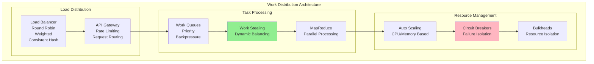
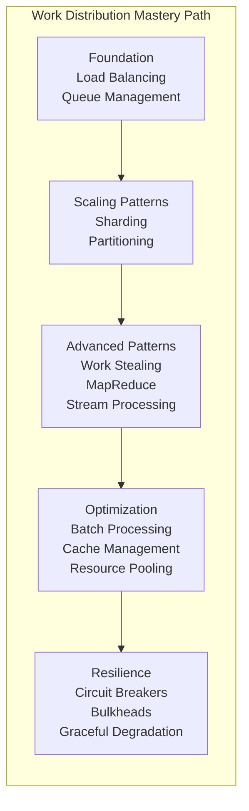
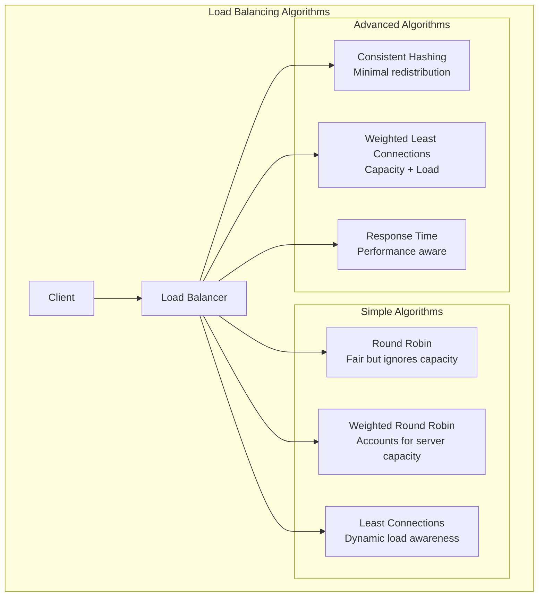
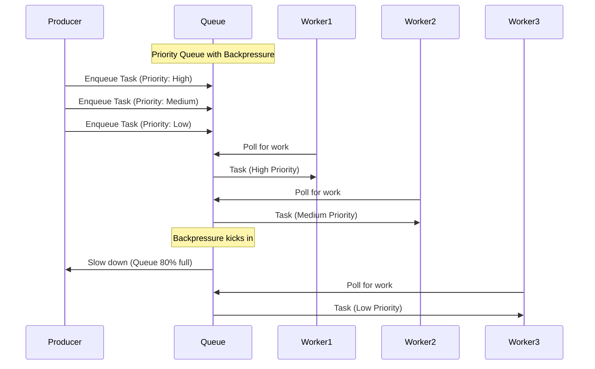
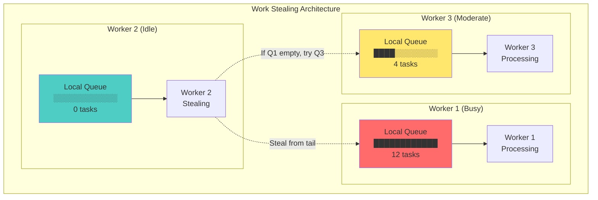

# Pillar 1: Work Distribution

## 1. The Complete Blueprint

Work distribution in distributed systems is about intelligently spreading computational tasks across multiple nodes to maximize throughput, minimize latency, and ensure resilience. At its core, we use load balancing to evenly distribute incoming requests, sharding to partition data and work horizontally, MapReduce patterns for parallel data processing, work queues to decouple producers from consumers, and work stealing to balance load dynamically. These patterns work together to create systems that can scale elastically, handle failures gracefully, and maintain consistent performance under varying loads. The key insight is that the coordination overhead between workers often determines whether you achieve 2x or 200x performance improvements.



> **What You'll Master**: Designing systems that scale linearly with worker count, preventing coordination bottlenecks, implementing effective load balancing strategies, handling partial failures gracefully, and optimizing for both latency and throughput.

## 2. The Core Mental Model

**The Restaurant Kitchen Analogy**: Work distribution is like running a busy restaurant kitchen. You have orders coming in (requests), different stations handling different tasks (workers), and a head chef coordinating (load balancer). If every cook has to ask permission for every action, the kitchen grinds to a halt. But if you organize stations well, pre-prep ingredients (batching), and let experienced cooks help overwhelmed stations (work stealing), you can serve hundreds of customers efficiently.

**The Fundamental Principle**: *The best work distribution minimizes coordination between workers while maximizing their independence and efficiency.*

Why this matters in practice:
- **Coordination costs grow quadratically** with worker count - N workers create N²/2 potential coordination points
- **Amdahl's Law limits speedup** - even 10% sequential work caps maximum speedup at 10x regardless of worker count  
- **Real-world bottlenecks emerge** where you least expect them - the shared database, message queue, or even load balancer

## 3. The Journey Ahead



**Pattern Interconnections:**
- **Load Balancing + Sharding** = Horizontal scaling with data locality
- **Work Queues + Circuit Breakers** = Resilient asynchronous processing
- **Batching + Caching** = Dramatic performance improvements with minimal complexity
- **Work Stealing + Auto Scaling** = Self-optimizing resource utilization

**Common Failure Patterns:**
- **Thundering Herd**: All workers wake up for one task
- **Hot Partitions**: One shard gets all the load while others idle
- **Coordination Bottlenecks**: Workers spend more time coordinating than working
- **Head-of-Line Blocking**: One slow task blocks all workers

## Core Work Distribution Patterns

### Pattern 1: Load Balancing Strategies



### Pattern 2: Work Queue Management



### Pattern 3: Work Stealing Implementation



## Real-World Examples

### Netflix: Hystrix Circuit Breaker Pattern

Netflix processes billions of requests daily across thousands of microservices. Their Hystrix library implements work distribution with failure isolation:

```yaml
circuit_breaker:
  failure_threshold: 50%
  request_volume_threshold: 20
  timeout: 1000ms
  
fallback_strategy:
  - cached_response
  - default_value  
  - graceful_degradation
  
bulkhead_isolation:
  thread_pools:
    user_service: 10 threads
    recommendation_service: 20 threads
    payment_service: 5 threads
```

**Results**: 99.99% uptime despite daily service failures, automatic recovery from cascading failures, and predictable performance under load.

### Uber: Consistent Hashing for Dispatch

Uber's dispatch system uses consistent hashing to distribute ride requests across geographic regions:

```python
class ConsistentHash:
    def __init__(self, nodes, virtual_nodes=150):
        self.ring = {}
        for node in nodes:
            for i in range(virtual_nodes):
                key = hash(f"{node}:{i}")
                self.ring[key] = node
        self.sorted_keys = sorted(self.ring.keys())
    
    def get_node(self, request_id):
        if not self.ring:
            return None
        key = hash(request_id)
        idx = bisect_right(self.sorted_keys, key)
        if idx == len(self.sorted_keys):
            idx = 0
        return self.ring[self.sorted_keys[idx]]
```

**Results**: Even distribution across dispatch centers, minimal redistribution when adding/removing capacity, and sub-second request routing.

### Google: MapReduce for Web Indexing

Google's original MapReduce implementation processes the entire web:

```python
# Map phase: Extract words from documents
def map_function(document):
    for word in document.words():
        emit(word, 1)

# Reduce phase: Count word occurrences  
def reduce_function(word, counts):
    return sum(counts)

# Framework handles:
# - Task distribution across 1000s of nodes
# - Failure recovery and retries
# - Data locality optimization
# - Result aggregation
```

**Results**: Process 20+ petabytes daily, automatic handling of node failures, and linear scaling to thousands of workers.

## Implementation Checklist

### Before You Distribute Work:

```yaml
□ REQUIREMENTS ANALYSIS
  ├─ □ Measure current bottlenecks (CPU, I/O, network)
  ├─ □ Define success metrics (throughput, latency, availability)
  └─ □ Identify coordination points and dependencies

□ ARCHITECTURE DESIGN  
  ├─ □ Choose appropriate load balancing algorithm
  ├─ □ Design task partitioning strategy
  └─ □ Plan for worker failure scenarios

□ IMPLEMENTATION PATTERNS
  ├─ □ Implement circuit breakers for failure isolation
  ├─ □ Add backpressure mechanisms
  └─ □ Build monitoring and observability

□ TESTING AND VALIDATION
  ├─ □ Load test with realistic traffic patterns
  ├─ □ Chaos engineering for failure scenarios  
  └─ □ Performance regression testing
```

## Key Takeaways

1. **Coordination is the enemy of scale** - Design for worker independence wherever possible

2. **Amdahl's Law is real** - Even small sequential bottlenecks cap your maximum speedup

3. **Failures are features** - Plan for partial failures from day one with circuit breakers and bulkheads

4. **Measure everything** - Worker utilization variance, queue depths, and coordination overhead tell the real story

5. **Start simple** - Basic load balancing and queues get you 80% of the benefits with 20% of the complexity

## Related Topics

- [State Distribution](state-distribution.md) - How work distribution affects data placement decisions
- [Control Distribution](control-distribution.md) - Coordination patterns and failure handling
- [Pattern: Load Balancing](../../pattern-library/scaling/load-balancing.md) - Detailed load balancing strategies
- [Pattern: Circuit Breaker](../../pattern-library/resilience/circuit-breaker-transformed.md) - Failure isolation techniques

---

*"The best distributed work looks like a thousand independent workers who happen to share a load balancer."*