# Pillar 1: Work Distribution

## 1. The Complete Blueprint

Work distribution in distributed systems is about intelligently spreading computational tasks across multiple nodes to maximize throughput, minimize latency, and ensure resilience. At its core, we use load balancing to evenly distribute incoming requests, sharding to partition data and work horizontally, MapReduce patterns for parallel data processing, work queues to decouple producers from consumers, and work stealing to balance load dynamically. These patterns work together to create systems that can scale elastically, handle failures gracefully, and maintain consistent performance under varying loads. The key insight is that the coordination overhead between workers often determines whether you achieve 2x or 200x performance improvements.


> **What You'll Master**: Designing systems that scale linearly with worker count, preventing coordination bottlenecks, implementing effective load balancing strategies, handling partial failures gracefully, and optimizing for both latency and throughput.

## 2. The Core Mental Model

**The Restaurant Kitchen Analogy**: Work distribution is like running a busy restaurant kitchen. You have orders coming in (requests), different stations handling different tasks (workers), and a head chef coordinating (load balancer). If every cook has to ask permission for every action, the kitchen grinds to a halt. But if you organize stations well, pre-prep ingredients (batching), and let experienced cooks help overwhelmed stations (work stealing), you can serve hundreds of customers efficiently.

**The Fundamental Principle**: *The best work distribution minimizes coordination between workers while maximizing their independence and efficiency.*

Why this matters in practice:
- **Coordination costs grow quadratically** with worker count - N workers create N²/2 potential coordination points
- **Amdahl's Law limits speedup** - even 10% sequential work caps maximum speedup at 10x regardless of worker count  
- **Real-world bottlenecks emerge** where you least expect them - the shared database, message queue, or even load balancer

## 3. The Journey Ahead


**Pattern Interconnections:**
- **Load Balancing + Sharding** = Horizontal scaling with data locality
- **Work Queues + Circuit Breakers** = Resilient asynchronous processing
- **Batching + Caching** = Dramatic performance improvements with minimal complexity
- **Work Stealing + Auto Scaling** = Self-optimizing resource utilization

**Common Failure Patterns:**
- **Thundering Herd**: All workers wake up for one task
- **Hot Partitions**: One shard gets all the load while others idle
- **Coordination Bottlenecks**: Workers spend more time coordinating than working
- **Head-of-Line Blocking**: One slow task blocks all workers

## Core Challenges and Technical Deep Dive

### Challenge 1: Coordination Overhead Quadratic Growth

As systems scale from N workers, coordination overhead grows at O(N²) due to inter-process communication. This fundamental challenge limits horizontal scaling effectiveness.


**Mathematical Model:**
- Coordination points = N*(N-1)/2
- Communication overhead = O(N²)
- Effective parallelism = N - (coordination_time / work_time)

**Performance Benchmarks:**
- 2-4 workers: 80-90% efficiency
- 8-16 workers: 60-70% efficiency
- 32+ workers: 30-50% efficiency without optimization

### Challenge 2: Amdahl's Law in Practice

Even small sequential bottlenecks dramatically limit speedup potential. Real-world systems rarely achieve theoretical maximums.

```python
# Amdahl's Law Calculator
def amdahl_speedup(sequential_portion, num_workers):
    """
    Calculate theoretical maximum speedup
    sequential_portion: fraction of work that cannot be parallelized (0.0-1.0)
    num_workers: number of parallel workers
    """
    return 1 / (sequential_portion + (1 - sequential_portion) / num_workers)

# Real-world examples
print(f"1% sequential work, 100 workers: {amdahl_speedup(0.01, 100):.1f}x speedup")
print(f"5% sequential work, 100 workers: {amdahl_speedup(0.05, 100):.1f}x speedup")
print(f"10% sequential work, 100 workers: {amdahl_speedup(0.10, 100):.1f}x speedup")

# Output:
# 1% sequential work, 100 workers: 9.9x speedup
# 5% sequential work, 100 workers: 4.9x speedup  
# 10% sequential work, 100 workers: 3.4x speedup
```

### Challenge 3: Hot Partitions and Load Imbalance

Real data distributions are rarely uniform, leading to "hot partitions" where some workers are overloaded while others idle.

```yaml
# Load Distribution Analysis
hot_partition_symptoms:
  - worker_utilization_variance: >30%
  - queue_depth_skew: >5x difference
  - response_time_p99: >10x median
  - resource_usage_imbalance: CPU/memory variance >40%

mitigation_strategies:
  - dynamic_resharding: "Move hot keys to underutilized workers"
  - virtual_nodes: "Use consistent hashing with 100+ virtual nodes per physical node"
  - work_stealing: "Allow idle workers to steal from overloaded queues"
  - predictive_balancing: "Use ML to predict hot partitions before they occur"
```

## Comprehensive Techniques & Patterns

### Pattern 1: Advanced Load Balancing Strategies


### Pattern 2: Advanced Work Queue Management


#### Queue Management Cheat Sheet

| Queue Type | Use Case | Pros | Cons | Configuration |
|------------|----------|------|------|---------------|
| **FIFO Simple** | Basic task processing | Simple, predictable order | No prioritization | `maxSize: 1000, timeout: 30s` |
| **Priority Queue** | Mixed urgency tasks | Task prioritization | Starvation risk for low priority | `priorities: [HIGH, MEDIUM, LOW], weights: [70, 20, 10]` |
| **Delay Queue** | Scheduled processing | Built-in scheduling | Memory overhead | `delaySeconds: configurable, maxDelay: 900s` |
| **Work Stealing** | Dynamic load balancing | Automatic balancing | Complexity overhead | `stealRatio: 0.5, stealThreshold: 10` |
| **Batching Queue** | High-throughput processing | Reduced overhead | Higher latency | `batchSize: 100, maxWaitMs: 1000` |

### Pattern 3: Work Stealing Implementation

```mermaid
graph TB
    subgraph "Work Stealing Architecture"
        subgraph "Worker 1 (Busy)"
            Q1[Local Queue<br/>████████████<br/>12 tasks]
            W1[Worker 1<br/>Processing]
        end
        
        subgraph "Worker 2 (Idle)"
            Q2[Local Queue<br/>░░░░░░░░░░░░<br/>0 tasks]
            W2[Worker 2<br/>Stealing]
        end
        
        subgraph "Worker 3 (Moderate)"
            Q3[Local Queue<br/>████░░░░░░░░<br/>4 tasks]
            W3[Worker 3<br/>Processing]
        end
        
        W2 -.->|Steal from tail| Q1
        W2 -.->|If Q1 empty, try Q3| Q3
        
        Q1 --> W1
        Q2 --> W2
        Q3 --> W3
        
        style Q1 fill:#FF6B6B
        style Q2 fill:#4ECDC4
        style Q3 fill:#FFE66D
    end
```



### Pattern 3: Predictive Work Distribution

```python
class PredictiveLoadBalancer:
    def __init__(self):
        self.historical_metrics = defaultdict(list)
        self.prediction_model = TimeSeriesPredictor()
        self.load_thresholds = {
            'cpu': 0.8,
            'memory': 0.75,
            'queue_depth': 100
        }
    
    def predict_worker_load(self, worker_id, horizon_minutes=5):
        """Predict worker load using historical patterns"""
        metrics = self.historical_metrics[worker_id]
        if len(metrics) < 10:  # Not enough data
            return self.get_current_load(worker_id)
            
        return self.prediction_model.forecast(
            data=metrics,
            horizon=horizon_minutes,
            confidence_interval=0.95
        )
    
    def route_request(self, request):
        """Route based on predicted load, not current load"""
        worker_loads = {}
        
        for worker in self.workers:
            predicted_load = self.predict_worker_load(worker.id)
            worker_loads[worker.id] = predicted_load
        
        # Select worker with lowest predicted load
        best_worker = min(worker_loads.items(), key=lambda x: x[1])
        return self.workers[best_worker[0]]
```

## Real-World Implementation Examples

### Apache Spark: Dynamic Work Distribution

Netflix processes billions of requests daily across thousands of microservices. Their Hystrix library implements work distribution with failure isolation:

```yaml
circuit_breaker:
  failure_threshold: 50%
  request_volume_threshold: 20
  timeout: 1000ms
  
fallback_strategy:
  - cached_response
  - default_value  
  - graceful_degradation
  
bulkhead_isolation:
  thread_pools:
    user_service: 10 threads
    recommendation_service: 20 threads
    payment_service: 5 threads
```

**Results**: 99.99% uptime despite daily service failures, automatic recovery from cascading failures, and predictable performance under load.

### Uber: Consistent Hashing for Dispatch

Uber's dispatch system uses consistent hashing to distribute ride requests across geographic regions:

```python
class ConsistentHash:
    def __init__(self, nodes, virtual_nodes=150):
        self.ring = {}
        for node in nodes:
            for i in range(virtual_nodes):
                key = hash(f"{node}:{i}")
                self.ring[key] = node
        self.sorted_keys = sorted(self.ring.keys())
    
    def get_node(self, request_id):
        if not self.ring:
            return None
        key = hash(request_id)
        idx = bisect_right(self.sorted_keys, key)
        if idx == len(self.sorted_keys):
            idx = 0
        return self.ring[self.sorted_keys[idx]]
```

**Results**: Even distribution across dispatch centers, minimal redistribution when adding/removing capacity, and sub-second request routing.

### Apache Kafka: Scalable Stream Processing

Kafka's distributed streaming architecture handles trillions of messages:

```yaml
# Kafka cluster configuration for high-throughput work distribution
cluster_config:
  brokers: 12
  partitions_per_topic: 100
  replication_factor: 3
  
topic_configuration:
  user_events:
    partitions: 50
    retention_hours: 168  # 7 days
    compression: lz4
    
  analytics_pipeline:
    partitions: 20
    retention_hours: 8760  # 1 year
    cleanup_policy: compact

consumer_groups:
  real_time_analytics:
    instances: 25
    processing_guarantee: at_least_once
    session_timeout_ms: 30000
    
  batch_processing:
    instances: 10  
    processing_guarantee: exactly_once
    enable_auto_commit: false
```

**Performance Results:**
- 1M+ messages/sec per broker
- Sub-millisecond p50 latency
- Linear scaling to 1000+ brokers
- 99.9% availability across regions

### Google: MapReduce for Web Indexing

Google's original MapReduce implementation processes the entire web:

```python
# Map phase: Extract words from documents
def map_function(document):
    for word in document.words():
        emit(word, 1)

# Reduce phase: Count word occurrences  
def reduce_function(word, counts):
    return sum(counts)

# Framework handles:
# - Task distribution across 1000s of nodes
# - Failure recovery and retries
# - Data locality optimization
# - Result aggregation
```

**Results**: Process 20+ petabytes daily, automatic handling of node failures, and linear scaling to thousands of workers.

## Trade-off Analysis Matrix

### Performance vs. Complexity Trade-offs

| Approach | Performance Gain | Implementation Complexity | Operational Overhead | Best Use Case |
|----------|------------------|---------------------------|---------------------|---------------|
| **Round Robin** | Low (1.2x) | Very Low | Very Low | Simple web servers |
| **Weighted Round Robin** | Medium (2.0x) | Low | Low | Heterogeneous hardware |
| **Least Connections** | Medium-High (2.5x) | Medium | Medium | Long-lived connections |
| **Consistent Hashing** | High (3.0x) | High | Medium | Distributed caching |
| **Work Stealing** | Very High (4.0x) | Very High | High | CPU-intensive batch jobs |
| **ML-based Prediction** | Extreme (5.0x+) | Extreme | Very High | Critical high-scale systems |

### Scalability Boundaries

```yaml
# Performance characteristics by worker count
scaling_analysis:
  small_scale:
    workers: 2-8
    efficiency: 85-95%
    coordination_overhead: 5-15%
    recommended_patterns: ["round_robin", "least_connections"]
    
  medium_scale:
    workers: 16-64  
    efficiency: 60-80%
    coordination_overhead: 20-40%
    recommended_patterns: ["consistent_hashing", "sharding"]
    
  large_scale:
    workers: 128-1024
    efficiency: 40-60%
    coordination_overhead: 40-60%
    recommended_patterns: ["work_stealing", "hierarchical_distribution"]
    
  web_scale:
    workers: 1000+
    efficiency: 20-40%
    coordination_overhead: 60-80%
    recommended_patterns: ["federated_systems", "ml_based_routing"]
```

## Security Considerations

### Secure Work Distribution Patterns

```python
class SecureWorkDistributor:
    def __init__(self):
        self.worker_certificates = {}
        self.task_encryption_keys = {}
        self.access_control = WorkerAccessControl()
    
    def distribute_sensitive_task(self, task, security_level):
        """Distribute work with appropriate security controls"""
        
        # Worker authentication
        eligible_workers = self.access_control.get_authorized_workers(
            security_level=security_level,
            task_classification=task.classification
        )
        
        if not eligible_workers:
            raise SecurityError("No authorized workers available")
        
        # Task encryption
        encrypted_task = self.encrypt_task(
            task, 
            key=self.task_encryption_keys[security_level]
        )
        
        # Audit logging
        self.audit_log.record_task_distribution(
            task_id=task.id,
            worker_id=selected_worker.id,
            security_level=security_level,
            timestamp=time.time()
        )
        
        return self.route_to_worker(encrypted_task, selected_worker)
```

## Cost Optimization Strategies

### Resource Efficiency Analysis

```yaml
# Cost optimization decision matrix
cost_optimization:
  compute_costs:
    on_demand_instances:
      cost_per_hour: $0.096
      startup_time: "30 seconds"
      availability: "99.5%"
      
    spot_instances:
      cost_per_hour: $0.029  # 70% savings
      startup_time: "2-5 minutes"  
      availability: "95%" # Can be interrupted
      
    reserved_instances:
      cost_per_hour: $0.062  # 35% savings
      startup_time: "Immediate"
      commitment: "1-3 years"
      
  workload_patterns:
    steady_state:
      recommendation: "reserved_instances"
      savings: "35%"
      
    batch_processing:
      recommendation: "spot_instances + queue_buffering"
      savings: "70%"
      
    real_time_critical:
      recommendation: "on_demand + auto_scaling"
      savings: "0% (prioritize reliability)"
```

## Step-by-Step Implementation Guide

### Phase 1: Foundation Setup (Weeks 1-2)

```bash
#!/bin/bash
# Work distribution setup script

# 1. Install load balancer
sudo apt-get install haproxy

# 2. Configure basic round-robin
cat > /etc/haproxy/haproxy.cfg << EOF
defaults
    mode http
    timeout connect 5000ms
    timeout client 50000ms
    timeout server 50000ms

frontend web_frontend
    bind *:80
    default_backend web_servers

backend web_servers
    balance roundrobin
    server web1 10.0.0.10:8080 check
    server web2 10.0.0.11:8080 check
    server web3 10.0.0.12:8080 check
EOF

# 3. Enable health checking
sudo systemctl start haproxy
sudo systemctl enable haproxy
```

### Phase 2: Monitoring Integration (Week 3)

```python
# Worker health monitoring
import psutil
import time
from dataclasses import dataclass
from typing import Dict, List

@dataclass
class WorkerMetrics:
    worker_id: str
    cpu_usage: float
    memory_usage: float
    queue_depth: int
    active_tasks: int
    completed_tasks_per_minute: float
    error_rate: float
    
class WorkerMonitor:
    def __init__(self):
        self.metrics_history = defaultdict(list)
        self.alert_thresholds = {
            'cpu_usage': 0.85,
            'memory_usage': 0.90,
            'error_rate': 0.05,
            'queue_depth': 1000
        }
    
    def collect_metrics(self, worker_id: str) -> WorkerMetrics:
        """Collect comprehensive worker metrics"""
        return WorkerMetrics(
            worker_id=worker_id,
            cpu_usage=psutil.cpu_percent(interval=1),
            memory_usage=psutil.virtual_memory().percent / 100,
            queue_depth=self.get_queue_depth(worker_id),
            active_tasks=self.get_active_task_count(worker_id),
            completed_tasks_per_minute=self.get_completion_rate(worker_id),
            error_rate=self.get_error_rate(worker_id)
        )
    
    def evaluate_worker_health(self, metrics: WorkerMetrics) -> Dict[str, bool]:
        """Evaluate if worker is healthy across all dimensions"""
        health_checks = {}
        
        health_checks['cpu_healthy'] = metrics.cpu_usage < self.alert_thresholds['cpu_usage']
        health_checks['memory_healthy'] = metrics.memory_usage < self.alert_thresholds['memory_usage']
        health_checks['queue_healthy'] = metrics.queue_depth < self.alert_thresholds['queue_depth']
        health_checks['error_rate_healthy'] = metrics.error_rate < self.alert_thresholds['error_rate']
        
        health_checks['overall_healthy'] = all(health_checks.values())
        
        return health_checks
```

### Phase 3: Advanced Patterns (Weeks 4-6)

```python
# Implement work stealing queue
class WorkStealingQueue:
    def __init__(self, worker_id: str, capacity: int = 1000):
        self.worker_id = worker_id
        self.local_queue = deque(maxlen=capacity)
        self.lock = threading.RLock()
        self.steal_attempts = 0
        self.successful_steals = 0
        
    def push_task(self, task):
        """Add task to local queue (producer side)"""
        with self.lock:
            self.local_queue.append(task)
    
    def pop_task(self):
        """Get task from local queue (worker side)"""
        with self.lock:
            if self.local_queue:
                return self.local_queue.popleft()
            return None
    
    def steal_task(self):
        """Attempt to steal task from the back of queue"""
        self.steal_attempts += 1
        
        with self.lock:
            if len(self.local_queue) > 2:  # Only steal if queue has multiple tasks
                task = self.local_queue.pop()  # Steal from back
                self.successful_steals += 1
                return task
        return None
    
    def get_stats(self):
        """Get work stealing statistics"""
        steal_success_rate = (self.successful_steals / max(1, self.steal_attempts)) * 100
        return {
            'queue_size': len(self.local_queue),
            'steal_attempts': self.steal_attempts,
            'successful_steals': self.successful_steals,
            'steal_success_rate': steal_success_rate
        }
```

## Anti-Patterns to Avoid

### Anti-Pattern 1: Synchronous Worker Coordination

```python
# WRONG: Workers wait for each other
class SynchronousDistribution:
    def process_batch(self, tasks):
        results = []
        for task in tasks:
            # All workers wait for slowest worker
            worker_results = []
            for worker in self.workers:
                worker_results.append(worker.process(task))  # Blocking!
            results.append(self.merge_results(worker_results))
        return results

# RIGHT: Asynchronous with timeout
class AsynchronousDistribution:
    async def process_batch(self, tasks, timeout=30):
        results = []
        for task in tasks:
            # Submit to all workers concurrently
            worker_futures = [
                asyncio.create_task(worker.process(task))
                for worker in self.workers
            ]
            
            # Wait for fastest response or timeout
            try:
                completed, pending = await asyncio.wait(
                    worker_futures,
                    timeout=timeout,
                    return_when=asyncio.FIRST_COMPLETED
                )
                
                if completed:
                    result = next(iter(completed)).result()
                    results.append(result)
                    
                    # Cancel remaining tasks
                    for future in pending:
                        future.cancel()
                else:
                    raise TimeoutError("No worker completed within timeout")
                    
            except Exception as e:
                self.handle_batch_failure(task, e)
                
        return results
```

### Anti-Pattern 2: Hot Partition Ignorance

```python
# WRONG: Static partitioning ignores load imbalance
class StaticPartitioning:
    def partition_data(self, data):
        partitions = [[] for _ in range(self.num_workers)]
        for i, item in enumerate(data):
            partition_id = i % self.num_workers  # Naive modulo
            partitions[partition_id].append(item)
        return partitions

# RIGHT: Dynamic partitioning with load awareness
class LoadAwarePartitioning:
    def __init__(self):
        self.partition_loads = defaultdict(int)
        self.key_access_patterns = defaultdict(int)
        
    def partition_data(self, data):
        partitions = [[] for _ in range(self.num_workers)]
        
        for item in data:
            # Choose partition with lowest current load
            partition_loads = [
                (i, self.partition_loads[i]) 
                for i in range(self.num_workers)
            ]
            
            least_loaded_partition = min(partition_loads, key=lambda x: x[1])[0]
            
            partitions[least_loaded_partition].append(item)
            
            # Update load estimate
            item_weight = self.estimate_processing_cost(item)
            self.partition_loads[least_loaded_partition] += item_weight
            
        return partitions
```

## Testing Strategies

### Performance Testing Framework

```python
class WorkDistributionTester:
    def __init__(self):
        self.test_scenarios = [
            {'name': 'uniform_load', 'workers': [1,2,4,8,16], 'task_size': 'small'},
            {'name': 'skewed_load', 'workers': [1,2,4,8,16], 'task_size': 'mixed'},
            {'name': 'failure_recovery', 'workers': [4,8,16], 'failure_rate': 0.1}
        ]
        
    def benchmark_load_balancer(self, algorithm, scenario):
        """Comprehensive load balancer benchmarking"""
        results = {}
        
        for worker_count in scenario['workers']:
            print(f"Testing {algorithm} with {worker_count} workers...")
            
            start_time = time.time()
            
            # Generate test workload
            tasks = self.generate_test_tasks(
                count=10000,
                size_distribution=scenario.get('task_size', 'small')
            )
            
            # Run load balancer
            distributor = self.create_distributor(
                algorithm=algorithm, 
                worker_count=worker_count
            )
            
            metrics = distributor.process_tasks(tasks)
            
            results[worker_count] = {
                'total_time': time.time() - start_time,
                'throughput': len(tasks) / (time.time() - start_time),
                'p95_latency': metrics.latency_percentile(0.95),
                'worker_utilization': metrics.worker_utilization_stats(),
                'coordination_overhead': metrics.coordination_time_percent(),
                'efficiency': metrics.parallel_efficiency()
            }
            
        return results
```

## Monitoring and Debugging Techniques

### Advanced Observability

```python
class WorkDistributionObservability:
    def __init__(self):
        self.metrics_collector = MetricsCollector()
        self.trace_sampler = TracingSampler(sample_rate=0.01)
        
    def create_distribution_dashboard(self):
        """Create comprehensive monitoring dashboard"""
        dashboard_config = {
            'panels': [
                {
                    'title': 'Worker Utilization Distribution',
                    'type': 'histogram',
                    'metric': 'worker_cpu_utilization',
                    'buckets': [0, 10, 25, 50, 75, 90, 95, 100]
                },
                {
                    'title': 'Queue Depth Heatmap',
                    'type': 'heatmap',
                    'metrics': ['worker_queue_depth'],
                    'dimensions': ['worker_id', 'time']
                },
                {
                    'title': 'Coordination Overhead Trend',
                    'type': 'line_chart',
                    'metrics': ['coordination_time_ms', 'work_time_ms'],
                    'time_range': '24h'
                },
                {
                    'title': 'Load Balancer Efficiency',
                    'type': 'gauge',
                    'metric': 'parallel_efficiency_percent',
                    'thresholds': {'warning': 70, 'critical': 50}
                }
            ]
        }
        return dashboard_config
```

## Implementation Checklist

### Comprehensive Pre-Implementation Analysis

```yaml
□ REQUIREMENTS ANALYSIS
  ├─ □ Measure current bottlenecks (CPU, I/O, network, coordination)
  ├─ □ Define success metrics (throughput, latency, availability, cost)
  ├─ □ Identify coordination points and dependencies
  ├─ □ Analyze data access patterns and hot partitions
  ├─ □ Establish baseline performance measurements
  └─ □ Document failure modes and recovery requirements

□ ARCHITECTURE DESIGN  
  ├─ □ Choose appropriate load balancing algorithm for your use case
  ├─ □ Design task partitioning strategy with rebalancing capability
  ├─ □ Plan for worker failure scenarios and recovery procedures
  ├─ □ Design monitoring and observability strategy
  ├─ □ Plan for horizontal scaling and resource management
  └─ □ Design security controls for sensitive workloads

□ IMPLEMENTATION PATTERNS
  ├─ □ Implement circuit breakers for failure isolation
  ├─ □ Add backpressure mechanisms with appropriate thresholds
  ├─ □ Build comprehensive monitoring and alerting
  ├─ □ Implement work stealing for dynamic load balancing
  ├─ □ Add retry logic with exponential backoff and jitter
  └─ □ Create dead letter queues for failed tasks

□ TESTING AND VALIDATION
  ├─ □ Load test with realistic traffic patterns and data distributions
  ├─ □ Chaos engineering for failure scenarios and network partitions
  ├─ □ Performance regression testing with automated benchmarks
  ├─ □ Stress testing to find breaking points and capacity limits
  ├─ □ Test worker failure and recovery scenarios
  └─ □ Validate coordination overhead remains acceptable at scale

□ PRODUCTION READINESS
  ├─ □ Deploy comprehensive monitoring dashboard
  ├─ □ Create runbooks for common operational scenarios  
  ├─ □ Implement automated scaling policies
  ├─ □ Set up alerting with appropriate thresholds
  ├─ □ Document troubleshooting procedures
  └─ □ Train operations team on system behavior and failure modes
```

## Key Takeaways

1. **Coordination is the enemy of scale** - Design for worker independence wherever possible

2. **Amdahl's Law is real** - Even small sequential bottlenecks cap your maximum speedup

3. **Failures are features** - Plan for partial failures from day one with circuit breakers and bulkheads

4. **Measure everything** - Worker utilization variance, queue depths, and coordination overhead tell the real story

5. **Start simple** - Basic load balancing and queues get you 80% of the benefits with 20% of the complexity

## Related Laws and Principles

<div class="admonition info">
    <p class="admonition-title">🔗 Related Laws</p>
    <div class="chips">
        <span class="chip chip-law">The Inevitability of Failure</span>
        <span class="chip chip-law">The Economics of Scale</span>
        <span class="chip chip-law">The Constraints of Time</span>
        <span class="chip chip-law">The Reality of Networks</span>
        <span class="chip chip-law">The Human Factor</span>
    </div>
</div>

### How Fundamental Laws Shape Work Distribution

- **The Inevitability of Failure**: Work distribution must handle worker failures gracefully through circuit breakers, timeouts, and bulkhead isolation. The law drives the need for redundant workers and automatic failover mechanisms.

- **The Economics of Scale**: Cost considerations determine optimal worker count and resource allocation. The law explains why unlimited horizontal scaling is economically unfeasible and drives trade-offs between performance and cost.

- **The Constraints of Time**: Coordination overhead grows with worker count, limiting parallelization benefits. The law explains why real-world systems can't achieve theoretical speedup and why careful work partitioning is essential.

- **The Reality of Networks**: Network partitions and latency affect work coordination. The law drives the need for work stealing, local queues, and eventual consistency in work distribution systems.

- **The Human Factor**: Complex work distribution systems require human oversight and operational simplicity. The law influences the choice between sophisticated algorithms and maintainable solutions.

### Classical Performance Laws in Work Distribution Context

- **Amdahl's Law**: Quantifies the maximum speedup from parallelization based on sequential portions
- **Little's Law**: Relates throughput, response time, and work-in-progress for queue sizing
- **Universal Scalability Law**: Models scalability limits due to contention and coordination costs
- **Conway's Law**: Influences how you should structure teams to match desired work distribution patterns

## Pillar-Specific Trade-offs

### CAP Theorem Implications for Work Distribution

Work distribution systems must navigate CAP theorem trade-offs when coordinating distributed workers:

```yaml
cap_trade_offs:
  consistency_priority:
    approach: "Centralized coordination with strong consistency"
    benefits: ["Guaranteed work ordering", "No duplicate processing", "Fair resource allocation"]
    costs: ["Single point of failure", "Higher latency", "Lower availability during failures"]
    use_case: "Financial transaction processing where correctness is paramount"
    
  availability_priority:
    approach: "Decentralized work distribution with eventual consistency"
    benefits: ["No single point of failure", "Works during network partitions", "Lower latency"]
    costs: ["Possible duplicate work", "Uneven load distribution", "Complex conflict resolution"]
    use_case: "Content delivery networks where availability matters more than perfect balance"
    
  partition_tolerance_priority:
    approach: "Autonomous workers with local decision making"
    benefits: ["Survives network splits", "Local autonomy", "Predictable performance"]
    costs: ["Coordination complexity", "Potential resource waste", "Difficult global optimization"]
    use_case: "IoT systems where devices must operate independently"
```

### Performance vs. Complexity Decision Matrix

| Pattern | Latency Reduction | Throughput Gain | Implementation Complexity | Operational Overhead | Best Fit |
|---------|-------------------|-----------------|---------------------------|---------------------|----------|
| **Round Robin** | None | 1.2x | Very Low | Very Low | Simple web servers |
| **Least Connections** | Medium | 2.5x | Low | Low | Database connection pools |
| **Consistent Hashing** | High | 3.5x | Medium | Medium | Distributed caches |
| **Work Stealing** | Very High | 4.5x | High | High | CPU-intensive batch processing |
| **ML-based Routing** | Extreme | 6.0x | Very High | Very High | High-scale real-time systems |

### Resource Utilization vs. Fairness Trade-offs

```python
# High utilization (may be unfair)
class UtilizationOptimizedDistribution:
    def route_work(self, work_item):
        # Always route to least loaded worker
        return min(self.workers, key=lambda w: w.current_load)
        
# Fair distribution (may waste resources)
class FairnessOptimizedDistribution:
    def route_work(self, work_item):
        # Round-robin ensures fairness but ignores worker capacity
        worker = self.workers[self.current_index % len(self.workers)]
        self.current_index += 1
        return worker
        
# Balanced approach
class BalancedDistribution:
    def route_work(self, work_item):
        # Weight by capacity, but ensure minimum work for all workers
        available_workers = [w for w in self.workers if w.can_accept_work()]
        return self.weighted_random_select(available_workers)
```

## Common Techniques and Patterns

### Load Balancing Patterns
- **[Round Robin Load Balancing](../../pattern-library/scaling/load-balancing.md)** → Simple work distribution with predictable allocation
- **[Weighted Load Balancing](../../pattern-library/scaling/load-balancing.md)** → Heterogeneous worker capacity management
- **[Consistent Hashing](../../pattern-library/data-management/consistent-hashing.md)** → Minimal redistribution during worker changes

### Queue Management Patterns
- **[Priority Queues](../../pattern-library/coordination/distributed-queue.md)** → Work prioritization and SLA management
- **[Work Stealing](../../pattern-library/coordination/work-stealing.md)** → Dynamic load balancing between workers
- **[Backpressure](../../pattern-library/resilience/backpressure.md)** → Flow control to prevent system overload

### Scaling Patterns
- **[Auto Scaling](../../pattern-library/scaling/auto-scaling.md)** → Dynamic worker provisioning based on load
- **[Horizontal Pod Autoscaler](../../pattern-library/deployment/kubernetes-distributed-patterns.md)** → Kubernetes-native scaling
- **[Circuit Breaker](../../pattern-library/resilience/circuit-breaker-mastery.md)** → Failure isolation and cascading failure prevention

### Coordination Patterns
- **[Leader Election](../../pattern-library/coordination/leader-election.md)** → Coordinated work assignment
- **[Consensus](../../pattern-library/coordination/consensus.md)** → Agreement on work allocation decisions
- **[Distributed Lock](../../pattern-library/coordination/distributed-lock.md)** → Exclusive work assignment prevention

## Summary Tables and Design Questions

### Work Distribution Decision Framework

| Question | Round Robin | Weighted | Consistent Hash | Work Stealing | ML-Based |
|----------|-------------|----------|-----------------|---------------|----------|
| **Predictable latency?** | ✅ High | ⚠️ Medium | ❌ Low | ❌ Low | ❌ Very Low |
| **Handles heterogeneous workers?** | ❌ No | ✅ Yes | ⚠️ Limited | ✅ Yes | ✅ Excellent |
| **Survives worker failures?** | ✅ Yes | ✅ Yes | ✅ Yes | ✅ Yes | ⚠️ Depends |
| **Handles hot partitions?** | ❌ No | ❌ No | ❌ No | ✅ Yes | ✅ Yes |
| **Implementation complexity?** | 🟢 Simple | 🟢 Simple | 🟡 Medium | 🔴 Complex | 🔴 Very Complex |
| **Best use case** | Web servers | Mixed hardware | Distributed cache | Batch processing | Real-time ML |

### Key Design Questions Checklist

```yaml
□ WORKLOAD CHARACTERISTICS
  ├─ □ What is the typical work item size and processing time?
  ├─ □ How variable is the processing time across work items?
  ├─ □ Are there dependencies between work items?
  └─ □ What is the expected throughput and latency requirements?

□ WORKER CHARACTERISTICS  
  ├─ □ Are workers homogeneous or heterogeneous in capacity?
  ├─ □ How often do workers join or leave the system?
  ├─ □ What is the expected failure rate of individual workers?
  └─ □ Can workers handle multiple work items concurrently?

□ CONSISTENCY REQUIREMENTS
  ├─ □ Is duplicate processing acceptable?
  ├─ □ Must work items be processed in order?
  ├─ □ How critical is fair resource allocation?
  └─ □ What happens if work distribution fails temporarily?

□ OPERATIONAL CONSTRAINTS
  ├─ □ What is the acceptable complexity for operations team?
  ├─ □ How important is predictable performance vs. optimal performance?
  ├─ □ What monitoring and alerting capabilities are needed?
  └─ □ How will the system handle traffic spikes?
```

## Related Topics

- [State Distribution](state-distribution.md) - How work distribution affects data placement decisions
- [Control Distribution](control-distribution.md) - Coordination patterns and failure handling
- [Pattern: Load Balancing](../../pattern-library/scaling/load-balancing.md) - Detailed load balancing strategies
- [Pattern: Circuit Breaker](../../pattern-library/resilience/circuit-breaker-mastery.md) - Failure isolation techniques
- [Pattern: Auto Scaling](../../pattern-library/scaling/auto-scaling.md) - Dynamic resource management
- [Pattern: Work Stealing](../../pattern-library/coordination/work-stealing.md) - Advanced load balancing

## Migration Strategies

### From Monolithic to Distributed Work


### Migration Checklist

```yaml
migration_phases:
  phase_1_assessment:
    duration: "2-4 weeks"
    activities:
      - profile_current_performance
      - identify_coordination_bottlenecks  
      - measure_sequential_vs_parallel_work
      - establish_baseline_metrics
    
  phase_2_basic_distribution:
    duration: "4-6 weeks"
    activities:
      - extract_worker_processes
      - implement_basic_load_balancer
      - add_health_checking
      - deploy_monitoring
    
  phase_3_optimization:
    duration: "6-8 weeks"
    activities:
      - implement_work_stealing
      - add_circuit_breakers
      - optimize_queue_management
      - tune_performance_parameters
    
  phase_4_advanced_scaling:
    duration: "8-12 weeks"
    activities:
      - implement_auto_scaling
      - add_predictive_load_balancing
      - deploy_multi_region
      - advanced_failure_handling
```

## Summary

Work Distribution is the foundation of scalable distributed systems. Success requires understanding the mathematical limits of parallelization (Amdahl's Law), designing for coordination overhead that grows quadratically, implementing sophisticated load balancing that adapts to real-world data distributions, and building comprehensive monitoring that reveals bottlenecks before they impact users.

The key insight is that coordination overhead often matters more than raw processing power. A system that minimizes worker interdependence while maximizing their independence will outperform a more sophisticated system with tight coupling.

**Implementation Priority:**
1. Start with basic load balancing and monitoring
2. Add work stealing and circuit breakers as you scale
3. Implement predictive and ML-based optimization only at web scale
4. Always measure coordination overhead as a first-class metric

---

*"The best distributed work looks like a thousand independent workers who happen to share a load balancer."*