# Two Generals Problem: The Complete Deep Dive

## Visual Language Legend


---

## Layer 1: The Scenario That Breaks Everything

### The Classical Problem Setup


### The Infinite Regress Visualized

```mermaid
flowchart TD
    subgraph "Level 0: Initial State"
        S0[G1 has plan<br/>G2 doesn't know]:::proof
    end
    
    subgraph "Level 1: First Message"
        M1[G1 → G2: 'Attack']:::workaround
        K1G1[G1 knows: plan]:::proof
        K1G2[G2 knows: plan]:::proof
        U1[❌ G1 doesn't know<br/>that G2 knows]:::impossible
    end
    
    subgraph "Level 2: First ACK"
        M2[G2 → G1: 'ACK']:::workaround
        K2G1[G1 knows: G2 knows]:::proof
        U2[❌ G2 doesn't know<br/>that G1 knows that G2 knows]:::impossible
    end
    
    subgraph "Level 3: ACK the ACK"
        M3[G1 → G2: 'ACK-ACK']:::workaround
        K3G2[G2 knows: G1 knows G2 knows]:::proof
        U3[❌ G1 doesn't know that<br/>G2 knows that G1 knows that G2 knows]:::impossible
    end
    
    Infinite[Level ∞: Common Knowledge<br/>IMPOSSIBLE to achieve<br/>with unreliable communication]:::impossible
    
    S0 --> M1 --> K1G1 & K1G2 --> U1
    U1 --> M2 --> K2G1 --> U2
    U2 --> M3 --> K3G2 --> U3
    U3 --> Infinite
    
    classDef impossible fill:#ff6b6b,color:#fff,stroke:#c0392b,stroke-width:3px;
    classDef workaround fill:#51cf66,color:#000,stroke:#2a7b2e,stroke-width:2px;
    classDef proof fill:#e1f5fe,color:#000,stroke:#0277bd,stroke-width:2px;
```


---

## Layer 2: The Knowledge Hierarchy

### Levels of Knowledge (Modal Logic View)
```mermaid
graph TB
    subgraph "Knowledge Operators"
        K1[K₁(p): G1 knows p]:::proof
        K2[K₂(p): G2 knows p]:::proof
        E[E(p): Everyone knows p]:::proof
        C[C(p): Common knowledge of p]:::impossible
    end
    
    subgraph "The Hierarchy"
        L0[p: 'Attack at dawn']:::proof
        L1[K₁(p) ∧ K₂(p)<br/>Both know the plan]:::proof
        L2[K₁(K₂(p)) ∧ K₂(K₁(p))<br/>Both know the other knows]:::proof
        L3[K₁(K₂(K₁(p))) ∧ K₂(K₁(K₂(p)))<br/>Third level knowledge]:::proof
        LN[E^n(p)<br/>n-th level mutual knowledge]:::proof
        CK[C(p) = ⋀(n=1 to ∞) E^n(p)<br/>Common Knowledge<br/>= Infinite conjunction]:::impossible
    end
    
    subgraph "Why It's Impossible"
        Finite[Any finite protocol<br/>reaches level n]:::workaround
        NeedNext[Coordinated action<br/>requires level n+1]:::impossible
        Forever[No finite n is sufficient]:::impossible
    end
    
    L0 --> L1 --> L2 --> L3 --> LN --> CK
    
    LN --> Finite
    Finite --> NeedNext
    NeedNext --> Forever
    Forever --> CK
    
    Note[Common knowledge requires<br/>infinite levels of mutual knowledge<br/>Unreliable channels prevent this]:::impossible
    
    CK --> Note
    
    classDef impossible fill:#ff6b6b,color:#fff,stroke:#c0392b,stroke-width:3px;
    classDef workaround fill:#51cf66,color:#000,stroke:#2a7b2e,stroke-width:2px;
    classDef proof fill:#e1f5fe,color:#000,stroke:#0277bd,stroke-width:2px;
```

### The Possible Worlds Analysis


---

## Layer 3: The Mathematical Proof

### Proof by Induction

```mermaid
flowchart TD
    subgraph "Base Case: n=1"
        BC[Single message protocol]:::proof
        BC1[G1 sends 'Attack at dawn']:::workaround
        BC2[Message may be lost]:::impossible
        BC3[G1 doesn't know if G2 received]:::impossible
        BC4[G1 cannot safely attack]:::impossible
        BCResult[∴ 1 message insufficient]:::impossible
        
        BC --> BC1 --> BC2 --> BC3 --> BC4 --> BCResult
    end
    
    subgraph "Inductive Hypothesis"
        IH[Assume: n messages insufficient<br/>for guaranteed coordination]:::proof
    end
    
    subgraph "Inductive Step: n→n+1"
        IS1[Consider protocol with n+1 messages]:::proof
        IS2[Last message is #n+1]:::proof
        IS3[This message might be lost]:::impossible
        IS4[Sender of message #n+1<br/>doesn't know if received]:::impossible
        IS5[Sender in same position<br/>as n-message protocol]:::impossible
        ISResult[∴ n+1 messages also insufficient]:::impossible
        
        IS1 --> IS2 --> IS3 --> IS4 --> IS5 --> ISResult
    end
    
    subgraph "Conclusion"
        Conc[By induction:<br/>∀n ∈ ℕ, n messages insufficient]:::impossible
        Theorem[Two Generals Problem<br/>has no solution]:::impossible
        
        Conc --> Theorem
    end
    
    BCResult --> IH
    IH --> IS1
    ISResult --> Conc
    
    classDef impossible fill:#ff6b6b,color:#fff,stroke:#c0392b,stroke-width:3px;
    classDef workaround fill:#51cf66,color:#000,stroke:#2a7b2e,stroke-width:2px;
    classDef proof fill:#e1f5fe,color:#000,stroke:#0277bd,stroke-width:2px;
```


### The Uncertainty Chain
```mermaid
graph LR
    subgraph "After Message 1"
        M1[Message 1 sent]:::proof
        U1[G1 uncertain:<br/>Did G2 receive?]:::impossible
    end
    
    subgraph "After Message 2"
        M2[ACK sent]:::proof
        U2[G2 uncertain:<br/>Did G1 get ACK?]:::impossible
    end
    
    subgraph "After Message 3"
        M3[ACK-ACK sent]:::proof
        U3[G1 uncertain:<br/>Did G2 get ACK-ACK?]:::impossible
    end
    
    subgraph "Pattern"
        Pattern[Uncertainty shifts<br/>but never disappears]:::impossible
        LastSender[Last sender is<br/>always uncertain]:::impossible
    end
    
    U1 --> M2 --> U2 --> M3 --> U3 --> Pattern --> LastSender
    
    Insight[KEY: The last sender never knows<br/>if their message arrived!]:::impossible
    
    LastSender --> Insight
    
    classDef impossible fill:#ff6b6b,color:#fff,stroke:#c0392b,stroke-width:3px;
    classDef proof fill:#e1f5fe,color:#000,stroke:#0277bd,stroke-width:2px;
```

---

## Layer 4: Why Common Knowledge Matters

### Coordinated Action Requires Common Knowledge

```mermaid
flowchart TB
    subgraph "What Each General Needs to Attack"
        Need1[G1 needs to know:]:::proof
        N1A[✓ The plan]:::workaround
        N1B[✓ G2 knows the plan]:::workaround
        N1C[✓ G2 knows G1 knows]:::workaround
        N1D[✓ G2 knows G1 knows G2 knows]:::workaround
        N1E[... forever ...]:::impossible
        
        Need2[G2 needs to know:]:::proof
        N2A[✓ The plan]:::workaround
        N2B[✓ G1 knows the plan]:::workaround
        N2C[✓ G1 knows G2 knows]:::workaround
        N2D[✓ G1 knows G2 knows G1 knows]:::workaround
        N2E[... forever ...]:::impossible
    end
    
    subgraph "The Common Knowledge Requirement"
        CK[Common Knowledge =<br/>Everyone knows φ ∧<br/>Everyone knows everyone knows φ ∧<br/>Everyone knows everyone knows everyone knows φ ∧<br/>...]:::impossible
    end
    
    subgraph "Why It's Required"
        Coord[Coordinated Action]:::tradeoff
        Simul[Simultaneous Attack]:::tradeoff
        Both[Both must be certain<br/>the other will act]:::tradeoff
        Recurse[Certainty requires<br/>infinite mutual knowledge]:::impossible
    end
    
    Need1 --> N1A --> N1B --> N1C --> N1D --> N1E
    Need2 --> N2A --> N2B --> N2C --> N2D --> N2E
    
    N1E --> CK
    N2E --> CK
    
    CK --> Coord --> Simul --> Both --> Recurse --> CK
    
    classDef impossible fill:#ff6b6b,color:#fff,stroke:#c0392b,stroke-width:3px;
    classDef tradeoff fill:#ffd93d,color:#000,stroke:#d4a514,stroke-width:2px;
    classDef workaround fill:#51cf66,color:#000,stroke:#2a7b2e,stroke-width:2px;
    classDef proof fill:#e1f5fe,color:#000,stroke:#0277bd,stroke-width:2px;
```


---

## Layer 5: How Real Systems Handle This

### TCP's "Good Enough" Solution


### Practical Workarounds in Distributed Systems


### Blockchain's Probabilistic Solution

```mermaid
sequenceDiagram
    participant Miner1
    participant Network  
    participant Miner2
    participant Blockchain
    
    Note over Miner1,Blockchain: Bitcoin's Probabilistic Consensus
    
    rect rgb(240, 255, 240)
        Note over Miner1,Miner2: Block Production
        Miner1->>Blockchain: Mine Block #100
        Miner1->>Network: Broadcast Block
        Network->>Miner2: Block received
        Miner2->>Blockchain: Accept Block #100
    end
    
    rect rgb(255, 255, 240)
        Note over Miner1,Miner2: Probabilistic Finality
        Note over Blockchain: 1 confirmation: 50% sure
        Miner2->>Blockchain: Mine Block #101
        Note over Blockchain: 2 confirmations: 75% sure
        Miner1->>Blockchain: Mine Block #102
        Note over Blockchain: 3 confirmations: 87.5% sure
        Note over Blockchain: 6 confirmations: 98.4% sure
        Note over Blockchain: Never 100% certain!
    end
    
    rect rgb(240, 240, 255)
        Note over Miner1,Blockchain: Why It Works
        Note over Network: • Proof-of-Work makes rewriting history expensive<br/>• Probability of reversal decreases exponentially<br/>• "Good enough" for practical purposes<br/>• No common knowledge needed!
    end
```


---

## Layer 6: Connection to Other Impossibilities

### The Impossibility Family Tree


---

## Layer 7: Interactive Learning - The Message Game

### Play the Two Generals Game


---

## The Complete Mental Model

```mermaid
mindmap
    root((Two Generals<br/>Problem))
        Core Insight
            Common Knowledge Required
                Coordinated action
                Simultaneous moves
                Mutual certainty
            Cannot Achieve
                Unreliable channels
                No message guarantee
                Infinite regress
        
        Mathematical Structure
            Knowledge Hierarchy
                Individual knowledge
                Mutual knowledge
                Common knowledge (∞)
            Proof Technique
                Induction on messages
                Last sender uncertain
                No finite solution
            Modal Logic
                K operators
                Possible worlds
                Indistinguishability
        
        Related Problems
            Consensus
                FLP connection
                Byzantine generals
            Coordination
                Distributed transactions
                Clock synchronization
            Communication
                TCP handshake
                Reliable broadcast
        
        Practical Impact
            Network Protocols
                TCP 3-way handshake
                Not perfect, good enough
            Distributed Systems
                2-phase commit
                3-phase commit
                Eventual consistency
            Blockchain
                Probabilistic finality
                Confirmation depth
        
        Workarounds
            Probabilistic
                Retry with timeout
                Exponential backoff
                Accept failure rate
            Relax Requirements
                Eventual not simultaneous
                Majority not unanimous
                Best effort not guaranteed
            Change Assumptions
                Synchronous model
                Reliable channels
                Trusted coordinator
```



---

## Teaching Guide

### Progressive Reveal Strategy

1. **Start with the Story** (Layer 1): Two armies need to coordinate
2. **Show the Regress** (Layer 1-2): Each ACK needs another ACK
3. **Explain Knowledge Levels** (Layer 2): Modal logic perspective
4. **Present the Proof** (Layer 3): Induction shows no finite solution
5. **Connect to Practice** (Layer 5): TCP, blockchain, real systems
6. **Interactive Game** (Layer 7): Let them experience the dilemma

### Key Teaching Moments

- **"The last message problem"**: Someone is always uncertain
- **"It's not about reliability"**: Even 99.999% isn't 100%
- **"Common knowledge is infinite"**: Not achievable in finite time
- **"TCP doesn't solve it"**: Just makes failure unlikely

### Memorable Phrases

- "You can't coordinate perfectly over an imperfect network"
- "Every ACK needs an ACK needs an ACK..."
- "The last sender never knows"
- "Uncertainty can shift but never disappears"
- "Real systems use 'good enough' not 'guaranteed'"

### Exercises

1. **Message Trace**: Draw out 5 messages, show uncertainty remains
2. **TCP Analysis**: Why does 3-way handshake "work"?
3. **Design Challenge**: Create a "good enough" protocol
4. **Probability Calculator**: How many retries for 99.9% success?

---

## Real-World Implications

### What This Means for Your Systems

#### 1. **TCP Connection Establishment**
- **Problem**: Can't guarantee both sides know connection is established
- **Solution**: 3-way handshake + timeouts + retransmission
- **Trade-off**: Not perfect, but failure probability becomes negligible
- **Lesson**: Engineering is about "good enough" not "perfect"

#### 2. **Distributed Transactions (2PC/3PC)**
- **Problem**: Can't guarantee all participants commit simultaneously
- **Solution**: Coordinator makes unilateral decisions
- **Trade-off**: Coordinator becomes single point of failure
- **Lesson**: Asymmetry can break the symmetry requirement

#### 3. **Blockchain Consensus**
- **Problem**: Can't guarantee all nodes agree on latest block
- **Solution**: Probabilistic finality through confirmations
- **Trade-off**: Never 100% certain, just increasingly unlikely to revert
- **Lesson**: Probabilistic solutions can be practically sufficient

#### 4. **Microservice Communication**
- **Problem**: Can't guarantee request was processed
- **Solution**: Idempotency + retries + unique request IDs
- **Trade-off**: Must handle duplicate processing
- **Lesson**: Design for at-least-once, make operations safe to repeat

### Common Misconceptions

❌ **"Just add more messages"**
✅ No finite number of messages solves the problem

❌ **"Use reliable protocols like TCP"**
✅ TCP doesn't guarantee delivery, just makes loss unlikely

❌ **"Modern networks don't lose messages"**
✅ Packet loss still happens; partitions are real

❌ **"Acknowledgments solve this"**
✅ Every ACK needs its own ACK, infinitely

❌ **"This is just theoretical"**
✅ Every distributed system deals with this daily

---

## Historical Context

### The Origins

**1975: E.A. Akkoyunlu, K. Ekanadham, R.V. Huber**
- First formal statement in "Some Constraints and Trade-offs in the Design of Network Communications"
- Arose from practical work on ARPANET

**1978: Jim Gray**
- Popularized the problem
- Connected it to database transactions
- Showed relevance to 2-phase commit

**1982: Leslie Lamport**
- Formalized the connection to Byzantine Generals
- Showed it's the simplest consensus impossibility

### Evolution of Understanding

**Early Days (1970s)**
- Discovered while building early networks
- Initially thought solvable with clever protocols

**Formal Period (1980s)**
- Mathematical proofs established
- Connection to knowledge theory understood
- Link to other impossibilities recognized

**Modern Era (2000s+)**
- Probabilistic solutions accepted
- "Good enough" engineering embraced
- Foundation for distributed systems theory

---

## Practical Decision Framework

### When You Face Two Generals

```
IF you need perfect coordination THEN
    You can't have it over unreliable channels
    Redesign to avoid this requirement
    
ELSE IF you can accept probabilistic coordination THEN
    Use retries with exponential backoff
    Set timeout based on acceptable failure rate
    Monitor actual failure rates in production
    
ELSE IF you can break symmetry THEN
    Introduce a coordinator/leader
    Use 2PC/3PC patterns
    Accept single point of failure
    
ELSE IF you can relax simultaneity THEN
    Use eventual consistency
    Design for convergence not coordination
    Accept temporary inconsistency
END IF
```

### Engineering Strategies

1. **Idempotency Everything**
   - Make operations safe to retry
   - Use unique request IDs
   - Design for at-least-once delivery

2. **Embrace Timeouts**
   - Not a hack, but a fundamental necessity
   - Choose timeouts based on SLAs
   - Implement exponential backoff

3. **Monitor and Measure**
   - Track actual message loss rates
   - Measure retry success rates
   - Adjust parameters based on data

4. **Design for Failure**
   - Assume messages will be lost
   - Build in reconciliation
   - Make failure modes explicit

---

## Summary: The Essential Wisdom

### The One-Liner
**"You cannot guarantee coordinated action between two parties communicating over an unreliable channel, no matter how many messages you exchange."**

### The Three Truths
1. **Common knowledge is required** for perfect coordination
2. **Common knowledge is impossible** with unreliable communication
3. **Therefore, perfect coordination is impossible**

### The Practical Wisdom
- **Every distributed system faces this** - It's not avoidable
- **Probabilistic solutions work** - 99.99% is often good enough
- **Timeouts are fundamental** - Not a workaround but a necessity
- **Retries with backoff** - The universal pattern

### The Meta-Lesson
**The Two Generals Problem teaches us that perfect coordination is impossible in distributed systems. Instead of fighting this reality, we must design systems that work well despite uncertainty. The art of distributed systems is not achieving perfection, but managing imperfection gracefully.**

### The Beautiful Insight
**The problem shows that uncertainty doesn't accumulate - it shifts. No matter how many messages you send, someone is always the "last sender" who doesn't know if their message arrived. This irreducible uncertainty is the fundamental characteristic of distributed systems.**