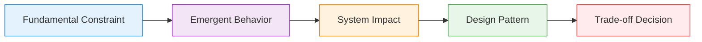
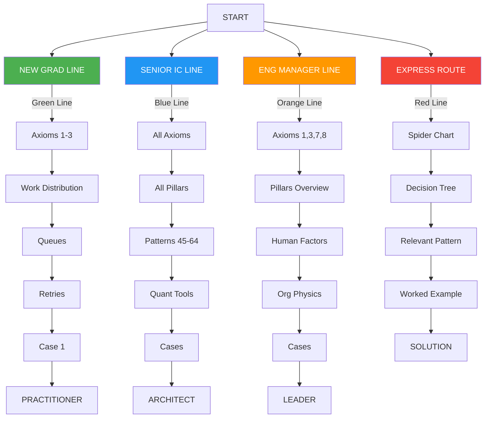
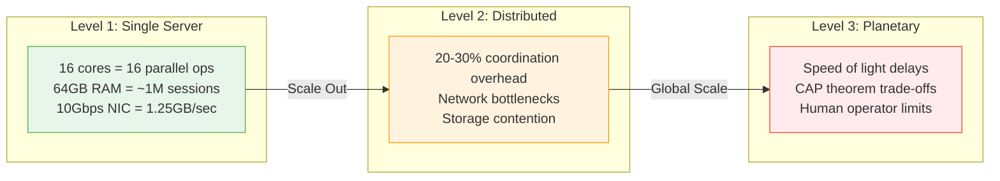

# The Compendium of Distributed Systems: Comprehensive First-Principles Expansion

!!! abstract "Core Philosophy"
    **All distributed systems behavior emerges from physical and mathematical constraints**. Rather than teaching patterns as recipes, we derive them from immutable laws.

## Response 1: Foundation, Philosophy, and Front Matter

### Core First-Principles Philosophy

<div class="axiom-box">

The entire book is built on fundamental constraints:

1. **Physical Laws**: Speed of light, thermodynamics, information theory
2. **Mathematical Laws**: Queueing theory, probability, graph theory
3. **Economic Laws**: Cost gradients, opportunity costs, resource allocation
4. **Human Laws**: Cognitive limits, communication bandwidth, organizational dynamics

</div>

### First-Principles Learning Framework



---

## PREFACE – Why Another Systems Book?

!!! quote "400-Word Manifesto"
    Existing distributed systems literature falls into two camps: academic proofs divorced from practice, or engineering cookbooks lacking theoretical foundation. DDIA gives you the 'what' and 'how'; SRE books provide the 'when things break.' This book uniquely provides the 'why from first principles.'

    We don't start with Kafka or Kubernetes. We start with the speed of light and the laws of thermodynamics. Every pattern emerges from inescapable constraints. When you understand why coordination has fundamental costs, you'll never again wonder whether to use 2PC or saga patterns—the physics will tell you.
    Three breakthroughs make this approach finally practical:
    
    1. **Axiom Unification**: Eight fundamental constraints explain all distributed behavior
    2. **Pattern Derivation**: Every architecture pattern emerges from axiom combinations
    3. **Decision Calculus**: Quantitative trade-off framework replacing intuition with math

    This isn't another 500-page tome to read once. It's a 100-page compass you'll reference throughout your career. Each page earns its place through information density and immediate applicability.

??? info "Scope Boundaries"
    **IN SCOPE:**
    
    - Distributed systems from 2-node to planet-scale
    - Both synchronous and asynchronous architectures
    
    **OUT OF SCOPE:**
    
    - Single-node optimization (refer to Hennessy & Patterson)
    - Specific vendor products (patterns over products)
    - Full protocol specifications (we extract principles)

## READER ROAD-MAP

<div class="metro-map">



</div>

<div class="icon-legend">
<div class="icon-item"><span>🎯</span><strong>Decision Point:</strong> Major architectural choice</div>
<div class="icon-item"><span>⚠️</span><strong>Common Pitfall:</strong> Where systems typically fail</div>
<div class="icon-item"><span>💡</span><strong>Insight Box:</strong> Counter-intuitive truth</div>
<div class="icon-item"><span>🔧</span><strong>Try This:</strong> Hands-on exercise (<5 min)</div>
<div class="icon-item"><span>📊</span><strong>Measure This:</strong> Instrumentation point</div>
<div class="icon-item"><span>🎬</span><strong>Real Story:</strong> Anonymized failure vignette</div>
<div class="icon-item"><span>🧮</span><strong>Calculate:</strong> Numerical example</div>
<div class="icon-item"><span>🔗</span><strong>Cross-Link:</strong> Related concept elsewhere</div>
</div>

!!! success "Learning Commitment"
    Each page promises ONE core insight you'll use within 30 days

---

## PART I: AXIOM-BASED FOUNDATION (Pages 1-20)

### Page 1: AXIOM 1 – Latency (Speed of Light)

!!! target "Learning Objective"
    Internalize that latency is physics, not engineering.

!!! info "Prerequisites"
    - Basic understanding of computer networks
    - Familiarity with client-server architecture
    - No physics background required - we'll explain what you need

!!! question "Why Should I Care?"
    - Your users will abandon your app if it takes >3 seconds to load
    - You literally cannot make NYC to Tokyo faster than 150ms round trip
    - Understanding latency helps you place services and data correctly
    - Real money impact: Amazon loses 1% sales per 100ms latency

#### Core Content Structure

<div class="axiom-box">

**Definition:**

```
Latency := Time for information to travel from point A to point B
Minimum Bound: distance / speed_of_light
In fiber: ~200,000 km/s (2/3 of c due to refractive index)
```

</div>

**The Physics Foundation:**

!!! tldr "Quick Understanding"
    Light speed in fiber = 200,000 km/s. NYC to London = 5,600 km. Minimum latency = 28ms one-way, 56ms round trip. You can't make it faster.

??? info "Detailed Physics"
    | Medium | Speed | Note |
    |--------|-------|------|
    | Light in vacuum | 299,792 km/s | Theoretical maximum |
    | Fiber optic cable | ~200,000 km/s | Refractive index slowdown |
    | Copper wire | ~200,000 km/s | Electromagnetic wave |
    
    **Why fiber is slower**: Refractive index of glass ≈ 1.5, so speed = c/n = 299,792/1.5 ≈ 200,000 km/s

!!! danger "Fundamental Insight"
    No engineering can overcome physics

<div class="failure-vignette">

**Failure Vignette: The Tokyo Checkout Disaster**

```yaml
Scene: Black Friday 2019, US e-commerce giant
Setup: "Smart" optimization routes all Asian traffic to Tokyo DC
Problem: SF inventory DB is source of truth
Impact: 250ms RTT × 3 DB calls = 750ms per checkout
Result: 67% cart abandonment, $12M lost revenue
Fix: Regional inventory caches with eventual consistency
Lesson: Speed of light is a budget, not a suggestion
```

</div>

<div class="latency-ladder">

**The Latency Ladder** 🪜

```
Same rack:          0.5 ms    ▓
Same DC:            1-2 ms    ▓▓
Same region:        10 ms     ▓▓▓▓▓
Cross-continent:    100 ms    ▓▓▓▓▓▓▓▓▓▓
Opposite globe:     200+ ms   ▓▓▓▓▓▓▓▓▓▓▓▓▓▓▓▓▓▓▓▓
Geosync satellite:  500+ ms   ▓▓▓▓▓▓▓▓▓▓▓▓▓▓▓▓▓▓▓▓▓▓▓▓▓▓▓▓▓▓▓▓▓▓▓▓▓▓▓▓
Mars (best case):   4 min     ▓▓▓▓▓▓▓▓▓▓▓▓▓▓▓▓▓▓▓▓▓▓▓▓▓▓▓▓▓▓▓▓▓▓▓▓▓▓▓▓▓▓▓▓▓▓▓▓▓▓▓▓▓▓▓▓▓▓▓▓
```

</div>

<div class="decision-box">

**🎯 Decision Box: Cache vs Replica**

```python
IF (latency_budget < physics_minimum) THEN
  IF (data_changes_rarely) THEN
    USE cache WITH ttl = change_frequency
  ELSE IF (eventual_consistency_ok) THEN
    USE read_replica WITH async_replication
  ELSE
    REDESIGN to avoid remote calls
  END
ELSE
  USE remote_calls WITH latency_budget - physics_minimum margin
END
```

</div>

!!! example "Interactive Element"
    - Globe visualization with draggable points
    - Shows theoretical minimum latency between any two points
    - Overlays actual internet paths vs great circle routes

??? tip "🔧 Try This (2 minutes)"
    ```bash
    # Measure your physics tax
    ping -c 10 google.com | grep "min/avg/max"
    traceroute google.com | tail -5
    # Calculate: actual_latency / theoretical_minimum
    ```

<div class="truth-box">

**Counter-Intuitive Truth** 💡

Adding more servers can INCREASE latency if it adds more hops. The fastest distributed system is often the one with fewer, better-placed nodes.

</div>

!!! info "Cross-Links"
    - → [Caching Hierarchies (p.57)](#): Implementation patterns
    - → [Geo-Replication (p.61)](#): Multi-region strategies  
    - → [Latency Budget Worksheet (p.2)](#page-2-latency-budget-worksheet): Practical application

---

### Page 2: Latency Budget Worksheet

!!! abstract "Purpose"
    Transform latency from abstract concept to concrete budget.

#### The Latency P&L Statement

=== "Revenue (Total Budget)"
    ```
    User Expectation:        [___] ms
    Minus Browser Render:    -50 ms
    Minus Network Last Mile: -20 ms
    = Backend Budget:        [___] ms
    ```

=== "Expenses (Allocations)"
    ```
    Load Balancer:     [___] ms (typical: 1-2)
    API Gateway:       [___] ms (typical: 2-5)
    Service Mesh:      [___] ms (typical: 1-3)
    Business Logic:    [___] ms (varies)
    Database Call:     [___] ms (typical: 5-50)
    Cache Check:       [___] ms (typical: 0.5-2)
    Total Spent:       [___] ms
    ```

=== "Margin"
    ```
    MARGIN: [___] ms (must be > 0!)
    ```

#### Real-World Budgets by Industry

| Industry | Budget | Reason |
|----------|--------|--------|
| **Stock Trading** | 10 ms | Regulatory requirement |
| **Gaming** | 16 ms | 60 fps requirement |
| **Video Conference** | 150 ms | Conversation flow |
| **E-commerce** | 1000 ms | Conversion dropoff |
| **Email** | 5000 ms | User expectation |

??? example "🧮 Worked Example: Photo Sharing App"
    **Goal**: User uploads photo, expects thumbnail in < 2 seconds
    
    **Budget Allocation**:
    ```yaml
    Upload to CDN edge:      100 ms  (physics: user to edge)
    Edge to origin DC:        50 ms  (physics: edge to DC)
    Queue wait time:         200 ms  (p95 during peak)
    Resize processing:       500 ms  (CPU bound)
    Thumbnail generation:    300 ms  (GPU accelerated)
    Write to 3 replicas:     150 ms  (parallel writes)
    CDN cache population:    200 ms  (push to edges)
    Response to user:        100 ms  (physics: edge to user)
    ━━━━━━━━━━━━━━━━━━━━━━━━━━━━━━━━━━━━━━━━━━━━━━━━━
    TOTAL:                  1600 ms  ✅ (400ms margin)
    ```
    
    **Optimization opportunities**:
    
    1. Pre-warm GPU containers (-200ms cold start)
    2. Regional processing (-50ms physics tax)
    3. Optimistic UI (-1600ms perceived!)

!!! warning "Budget Violation Patterns"
    1. **Death by Thousand Cuts**: Each service "only" adds 5ms
    2. **Retry Multiplication**: 3 retries × 100ms = 300ms gone
    3. **Serial Staircase**: Waterfall instead of parallel
    4. **Cold Start Surprise**: Lambda/container warm-up
    5. **GC Pause Gambling**: 99th percentile GC stops

??? tip "🔧 Try This: Profile Your Critical Path"
    ```python
    import time
    from contextlib import contextmanager

    @contextmanager
    def latency_budget(operation, budget_ms):
        start = time.time()
        yield
        elapsed_ms = (time.time() - start) * 1000
        remaining = budget_ms - elapsed_ms
        print(f"{operation}: {elapsed_ms:.1f}ms (budget: {remaining:+.1f}ms)")
        if remaining < 0:
            print(f"⚠️  BUDGET VIOLATION: {-remaining:.1f}ms over!")

    # Use in your code:
    with latency_budget("Database query", 50):
        results = db.query("SELECT ...")
    ```

---

### Page 3: AXIOM 2 – Finite Capacity

!!! target "Learning Objective"
    Every resource has a breaking point; find it before production does.

<div class="axiom-box">

**Core Principle:**

```
Every system component has finite:
- CPU cycles per second
- Memory bytes
- Network packets/sec  
- Disk IOPS
- Connection pool slots
- Thread count
- Queue depth

Corollary: Infinite scaling is a lie sold by cloud vendors
```

</div>

!!! quote "The Thermodynamics Angle"
    Just as energy cannot be created or destroyed, computational capacity cannot be materialized from nothing. It can only be moved (migration), transformed (optimization), or purchased (scaling).

<div class="failure-vignette">

**Failure Vignette: Black Friday Database Meltdown**

```yaml
Company: Major retailer, $2B revenue
Date: Black Friday 2021, 6:00 AM EST
Sequence:
  06:00: Marketing sends "50% off everything" email
  06:01: 2M users click simultaneously  
  06:02: API servers scale from 100 to 1000 pods
  06:03: Each pod opens 10 connections to DB
  06:04: Database connection limit: 5000
  06:05: 10,000 connections attempted
  06:06: Database rejects new connections
  06:07: Health checks fail, cascading restarts
  06:15: Site completely down
  08:00: Manual intervention restores service
  
Loss: $50M in sales, brand damage

Root Cause: Scaled compute, forgot DB connections are finite
Fix: Connection pooling, admission control, backpressure
```

</div>

#### The Capacity Staircase



<div class="decision-box">

**🎯 Decision Tree: Scale-Up vs Scale-Out**

```
START: Need more capacity
  │
  ├─ Is workload parallelizable?
  │   ├─ NO → Scale UP (bigger box)
  │   └─ YES → Continue
  │
  ├─ Is data easily partitioned?
  │   ├─ NO → Scale UP + Read replicas
  │   └─ YES → Continue  
  │
  ├─ Can tolerate eventual consistency?
  │   ├─ NO → Scale UP to limits, then shard carefully
  │   └─ YES → Scale OUT (add nodes)
  │
  └─ Result: Your scaling strategy
```

</div>

#### Capacity Arithmetic

=== "Formula"
    ```
    Effective Capacity = Raw Capacity × Utilization Factor × Efficiency Factor
    
    Where:
    - Utilization Factor = 1 - (idle + overhead)
    - Efficiency Factor = 1 / (1 + coordination_cost)
    ```

=== "Example"
    ```
    Raw: 100 CPU cores
    Utilization: 0.7 (30% overhead)
    Efficiency: 0.8 (25% coordination cost)
    Effective: 100 × 0.7 × 0.8 = 56 cores actual work
    ```

??? tip "🔧 Try This: Find Your Breaking Point"
    ```bash
    # Local capacity test (DO NOT RUN IN PROD!)
    # Terminal 1: Start a simple server
    python -m http.server 8000
    
    # Terminal 2: Find the limit
    ab -n 10000 -c 100 http://localhost:8000/
    # Watch for the cliff where latency spikes
    
    # Terminal 3: Monitor resources
    htop  # Watch CPU, memory
    iftop # Watch network
    iotop # Watch disk
    ```

#### Real Capacity Limits (2024 numbers)

| Component | Practical Limit | Notes |
|-----------|----------------|--------|
| PostgreSQL | 5000 connections | With connection pooling |
| Redis | 10K ops/sec/core | Single-threaded |
| Kafka | 1M messages/sec/broker | With proper tuning |
| Load Balancer | 100K concurrent connections | Hardware dependent |
| Docker | ~10K containers/host | Resource dependent |
| Kubernetes | 5000 nodes/cluster | etcd limitation |
| Elasticsearch | 1000 shards/node | Recommended maximum |

<div class="truth-box">

**Counter-Intuitive Truth** 💡

Running at 100% capacity means you're already over capacity. Systems need breathing room for spikes, garbage collection, and maintenance. Target 60-70% steady-state.

</div>

---

### Page 4: Saturation Graph & Little's Law Primer

!!! target "Learning Objective"
    Understand why systems cliff-dive at high utilization.

<div class="axiom-box">

**Little's Law - The Universal Queue Equation:**

!!! tldr "Simple Version"
    **Items in system = Arrival rate × Time in system**
    
    Example: 100 requests/second arriving, each takes 0.2 seconds → 20 requests in system at any time

??? math "Mathematical Details"
    ```
    L = λ × W
    
    Where:
    L = Average number of items in system
    λ = Average arrival rate
    W = Average time in system
    
    This law is ALWAYS true for stable systems, regardless of:
    - Distribution of arrivals
    - Service time variance  
    - Number of servers
    - Queue discipline
    ```
    
    **Proof sketch**: Count items entering and leaving over time T. In steady state, arrivals = departures.

</div>

#### The Saturation Curve

<div class="latency-ladder" style="font-family: monospace; background: #f5f5f5; padding: 2rem; border-radius: 8px;">

```
Response Time
    │
400ms│                                    ╱
    │                                  ╱│ 
300ms│                               ╱  │ THE CLIFF
    │                            ╱     │
200ms│                        ╱        │
    │                     ╱           │
100ms│              ╱ ─ ─             │
    │      ─ ─ ─                     │
  0ms└────────────────────────────────┴─────
    0%   20%   40%   60%   80%  90% 95% 100%
                    Utilization →
```

</div>

#### Why The Cliff Exists (First Principles)

=== "At Different Utilizations"
    | Utilization | Queue Wait Time | Total Response Time |
    |-------------|-----------------|-------------------|
    | 0% | 0 | Service time only |
    | 50% | Service time × 0.5 | 1.5 × service time |
    | 80% | Service time × 4 | 5 × service time |
    | 90% | Service time × 9 | 10 × service time |
    | 95% | Service time × 19 | 20 × service time |
    | 99% | Service time × 99 | 100 × service time! |

=== "Mathematical Proof"
    ```
    For M/M/1 queue:
    W = 1/(μ - λ)
    
    Where μ = service rate, λ = arrival rate
    Utilization ρ = λ/μ
    
    Therefore:
    W = 1/(μ(1 - ρ))
    
    As ρ → 1, W → ∞
    ```

<div class="failure-vignette">

**Real-World Manifestation: Uber's Surge Pricing Algorithm (2018)**

```yaml
Normal: 
  - 70% driver utilization
  - 2 min wait time
  
Rush hour:
  - 85% utilization
  - 5 min wait time
  
Big event:
  - 95% utilization
  - 20 min wait time
  
System breaks:
  - 99% utilization
  - Infinite wait
  
Solution: Surge pricing reduces λ (demand)
```

</div>

#### Practical Applications Table

| Component | Safe Utilization | Danger Zone | Action at Danger |
|-----------|-----------------|-------------|------------------|
| **CPU** | 70% | >85% | Add cores/nodes |
| **Memory** | 80% | >90% | Increase RAM/swap |
| **Network** | 60% | >75% | Upgrade bandwidth |
| **Disk I/O** | 50% | >70% | Add SSDs/RAID |
| **Thread Pool** | 60% | >80% | Increase pool size |
| **Database Conn** | 50% | >70% | Add read replicas |

??? example "🔧 Try This: Visualize Your Queue"
    ```python
    import matplotlib.pyplot as plt
    import numpy as np
    
    def response_time(utilization, service_time=100):
        """Calculate response time using M/M/1 model"""
        if utilization >= 1:
            return float('inf')
        return service_time / (1 - utilization)
    
    # Plot the cliff
    utils = np.linspace(0, 0.99, 100)
    response_times = [response_time(u) for u in utils]
    
    plt.figure(figsize=(10, 6))
    plt.plot(utils * 100, response_times)
    plt.axvline(x=80, color='orange', linestyle='--', label='Warning')
    plt.axvline(x=90, color='red', linestyle='--', label='Danger')
    plt.xlabel('Utilization %')
    plt.ylabel('Response Time (ms)')
    plt.title('The Utilization Cliff')
    plt.ylim(0, 1000)
    plt.legend()
    plt.grid(True, alpha=0.3)
    plt.show()
    ```

#### Queue Taxonomy

!!! info "Queue Disciplines Compared"
    | Type | Fairness | Use Case | Trade-off |
    |------|----------|----------|-----------|
    | **FIFO** | Fair | Default choice | Head-of-line blocking |
    | **LIFO** | Unfair | Timeout scenarios | Recent requests served first |
    | **Priority** | Unfair | Critical ops first | Can starve low-priority |
    | **WFQ** | Fair | Prevent starvation | More complex |
    | **RED** | Proactive | Prevent congestion | Drops packets early |

---

### Page 5: AXIOM 3 – Partial Failure

!!! target "Learning Objective"
    In distributed systems, failure is partial, not binary.

<div class="axiom-box">

**The Fundamental Difference:**

```
Monolithic Failure:  Works OR Dead (binary)
Distributed Failure: Works AND Broken (superposition)

"A distributed system is one where a machine you've
never heard of can cause your app to fail."
```

</div>

---

#### The Failure Boundary Matrix

| Failure Domain | Blast Radius | Recovery Time | Example |
|----------------|--------------|---------------|---------|
| **Process** | 1 container | Seconds | OOM kill |
| **Container** | 1 pod | Seconds | Crash |
| **Pod** | 1 service | Minutes | Node drain |
| **Node** | N pods | Minutes | Hardware |
| **Rack** | 1 AZ % | Minutes | Switch fail |
| **Zone** | 1 region % | Hours | Power loss |
| **Region** | Global % | Hours | Fiber cut |
| **Provider** | Everything | Days | AWS outage |

<div class="failure-vignette">

**🎬 Failure Vignette: The Retry Storm of 2022**

```yaml
Setting: Social media platform, 100M daily active users
Initial trigger: One DB replica 20% slower (bad disk)

Timeline:
T+0s:   App servers detect slow responses
T+1s:   Client timeout at 1 second, retry triggered
T+2s:   2x load on all replicas due to retries
T+3s:   Healthy replicas now slow due to 2x load
T+4s:   More timeouts, more retries (4x original)
T+10s:  Exponential retry storm: 32x load
T+30s:  All replicas saturated
T+60s:  Full outage

Root cause: Treated partial failure as total failure
Fix: Circuit breakers, bulkheads, adaptive timeouts
```

</div>

#### Partial Failure Patterns

1. **Slow Failure**: Works but 10x slower
2. **Intermittent**: Fails 1% of requests randomly
3. **Degraded**: Returns stale/partial data
4. **Asymmetric**: A can talk to B, B can't talk to A
5. **Split Brain**: Two nodes think they're primary
6. **Gray Failure**: Appears healthy to monitors, broken to users

<div class="decision-box">

**🎯 Decision Framework: Isolation Strategy**

```
DETECT: What indicates partial failure?
├─ Latency > p99 threshold
├─ Error rate > baseline
├─ Queue depth growing
└─ Health check flapping

ISOLATE: How to contain blast radius?
├─ Thread pool isolation (Hystrix pattern)
├─ Network segmentation (bulkheads)  
├─ Separate failure domains (AZs)
└─ Circuit breakers (fail fast)

RECOVER: How to heal?
├─ Retry with backoff
├─ Fallback to cache/default
├─ Degrade gracefully
└─ Shed load (drop requests)
```

</div>

#### Probability Math for Partial Failures

```
P(system works) = P(all critical components work)

Series (AND): P = P₁ × P₂ × P₃
Parallel (OR): P = 1 - (1-P₁) × (1-P₂) × (1-P₃)

Example: 3 replicas, each 99% available
- Need all 3: 0.99³ = 97% available (worse!)
- Need any 1: 1 - 0.01³ = 99.999% (better!)
```

??? example "🔧 Try This: Chaos Experiment"
    ```bash
    # Simulate partial network failure (Linux)
    # Add 200ms delay to 25% of packets
    sudo tc qdisc add dev eth0 root netem delay 200ms 50ms 25%
    
    # Simulate packet loss
    sudo tc qdisc add dev eth0 root netem loss 1%
    
    # Clean up
    sudo tc qdisc del dev eth0 root
    ```

<div class="truth-box">

**Counter-Intuitive Truth 💡**:
"A 99.9% reliable service called 1000 times has only 37% chance of success. Distributed systems multiply failures, not reliability."

</div>

---

### Page 6: Failure-Domain Tree + Timeouts

!!! info "Visual Failure Hierarchy"

```
                        System
                     ╱         ╲
                Region A      Region B
               ╱    |    ╲        |
            AZ1    AZ2    AZ3    AZ1
           ╱ |      |      |      |
        Rack1 R2    R1     R1     R1
        ╱ ╲   |     |      |      |
      N1  N2  N1    N1     N1     N1
      |   |   |     |      |      |
     Pod Pod Pod   Pod    Pod    Pod
```

#### Timeout Strategy Matrix

| Layer | Timeout | Rationale |
|-------|---------|-----------|
| **User → LB** | 30s | Human patience limit |
| **LB → Service** | 10s | Allow for retries |
| **Service → Svc** | 3s | Intra-DC speed |
| **Service → DB** | 1s | Query should be fast |
| **Service → Cache** | 100ms | Cache must be faster |
| **Circuit Open** | 5s | Recovery probe interval |

#### Timeout Coordination Problem

```yaml
WRONG (Timeout Inversion):
Client timeout:   5s
Service timeout:  10s  
Result: Client gives up, service keeps trying

RIGHT (Nested Timeouts):
Client timeout:   10s
Service timeout:  3s
Retry budget:     3 × 3s = 9s < 10s ✓
```

---

### Page 7: AXIOM 4 – Concurrency

!!! target "Learning Objective"
    Concurrent operations create states that don't exist in sequential execution.

<div class="axiom-box">

**Core Paradox:**

```
Sequential: A then B = predictable
Concurrent: A while B = 
  - A then B
  - B then A  
  - A interleaved with B (multiple ways!)
  - Partial A, partial B, explosion of states
```

</div>

<div class="failure-vignette">

**🎬 Failure Vignette: The Double-Booked Airplane Seat**

```yaml
Airline: Major US carrier
Date: December 23, 2019 (peak travel)
System: Seat assignment during online check-in

Race Condition:
T1 00:00.000: Alice views seat map, 14A shows available
T1 00:00.000: Bob views seat map, 14A shows available
T1 00:00.100: Alice clicks "Select 14A"
T1 00:00.150: Bob clicks "Select 14A"
T1 00:00.200: System checks 14A available for Alice ✓
T1 00:00.250: System checks 14A available for Bob ✓
T1 00:00.300: System assigns 14A to Alice
T1 00:00.350: System assigns 14A to Bob
T1 00:00.400: Database now shows Bob in 14A

At the gate:
- Both passengers have boarding passes for 14A
- Alice boards first, sits down
- Bob boards, confrontation ensues
- Flight delayed 40 minutes for resolution

Fix: Distributed lock with atomic compare-and-swap
```

</div>

#### Concurrency Control Mechanisms

```sql
-- 1. PESSIMISTIC LOCKING
BEGIN;
SELECT * FROM seats WHERE id = '14A' FOR UPDATE;
-- Lock held until commit
UPDATE seats SET passenger = 'Alice' WHERE id = '14A';
COMMIT;

-- Pro: Guarantees consistency
-- Con: Reduces concurrency, can deadlock

-- 2. OPTIMISTIC LOCKING (CAS)
SELECT version FROM seats WHERE id = '14A'; -- Returns v1
UPDATE seats 
SET passenger = 'Alice', version = v2
WHERE id = '14A' AND version = v1;
-- Check affected rows, retry if 0

-- Pro: Better concurrency
-- Con: Retry storms under contention

-- 3. MVCC (Multi-Version Concurrency)
-- Each transaction sees consistent snapshot
-- Conflicts detected at commit time

-- Pro: Readers don't block writers
-- Con: Complex implementation
```

<div class="decision-box">

**🎯 Decision Tree: Lock vs CAS vs Queue**

```
What's the contention level?
├─ LOW (<10% conflicts)
│  └─ Use optimistic locking (CAS)
├─ MEDIUM (10-50% conflicts)  
│  ├─ Short operation? → Pessimistic lock
│  └─ Long operation? → Queue + single worker
└─ HIGH (>50% conflicts)
   └─ Redesign to avoid contention
      ├─ Partition the resource
      ├─ Use conflict-free replicated data types
      └─ Event sourcing with eventual consistency
```

</div>

#### Concurrency Bugs Taxonomy

1. **Race Condition**: Outcome depends on timing
2. **Deadlock**: Circular wait for resources
3. **Livelock**: Threads actively doing nothing
4. **Starvation**: Some threads never get resources
5. **ABA Problem**: Value changes A→B→A between checks
6. **Priority Inversion**: Low priority blocks high

??? example "🔧 Try This: Demonstrate a Race"
    ```python
    import threading
    import time
    
    # Shared counter without protection
    counter = 0
    
    def increment():
        global counter
        for _ in range(1000000):
            temp = counter
            # Simulate some work
            temp = temp + 1
            counter = temp
    
    # Run two threads
    t1 = threading.Thread(target=increment)
    t2 = threading.Thread(target=increment)
    
    t1.start(); t2.start()
    t1.join(); t2.join()
    
    print(f"Counter: {counter}")  # Should be 2,000,000
    print(f"Lost updates: {2000000 - counter}")
    ```

---

### Page 8: Space-Time Diagram & Vector Clock Intro

!!! abstract "Visual Representation of Distributed Time"

```
Process A  ─────●─────────●───────────●────→ time
                │ e1      │ e3        │ e5
                ↓         ↓           ↓
Process B  ───────────●───────●───────────→ time
                      │ e2    │ e4
                      
Happens-before: e1 → e2 → e3 → e4 → e5
Concurrent: (e1 || e4), (e3 || e4)
```

#### Vector Clocks Explained

```yaml
Each process maintains vector: [A_count, B_count, C_count]

Process A: [1,0,0] → sends message → [2,0,0]
Process B: [0,0,0] → receives → [2,1,0] → sends → [2,2,0]
Process C: [0,0,1] → receives → [2,2,1]

Comparing vectors:
[2,1,0] happens-before [2,2,1] ✓
[2,1,0] concurrent-with [1,0,2] ✓
```

**Practical Use**: Detect causality violations in distributed systems

---

### Page 9: AXIOM 5 – Cost of Coordination

!!! target "Learning Objective"
    Coordination is expensive in time, money, and complexity.

<div class="axiom-box">

**The Coordination Tax Formula:**

```
Total Cost = Communication Cost + Consensus Cost + Failure Handling Cost

Where:
- Communication = N × (N-1) × message_cost
- Consensus = rounds × round_trip_time × N
- Failure = retry_probability × recovery_cost
```

</div>

<div class="failure-vignette">

**🎬 Failure Vignette: The $2M Two-Phase Commit**

```yaml
Company: Global financial services
Scenario: Cross-region transaction coordination
Architecture: 2PC across 5 data centers

Per Transaction Cost:
- Singapore ↔ London: 170ms RTT
- London ↔ New York: 70ms RTT  
- New York ↔ SF: 65ms RTT
- SF ↔ Tokyo: 100ms RTT
- Tokyo ↔ Singapore: 75ms RTT

2PC Phases:
1. Prepare: Coordinator → All (parallel): 170ms
2. Vote collection: All → Coordinator: 170ms
3. Commit: Coordinator → All: 170ms
Total: 510ms minimum per transaction

Monthly volume: 100M transactions
Time cost: 510ms × 100M = 14,000 hours of coordination
AWS cross-region traffic: $0.02/GB
Message size: 1KB × 3 phases × 5 regions = 15KB
Monthly bill: 15KB × 100M × $0.02 = $30M

Actual bill (with retries, monitoring): $2M/month

Solution: Eventual consistency with regional aggregation
New cost: $50K/month (40x reduction)
```

</div>

#### Coordination Patterns Ranked by Cost

| Pattern | Time Cost | Money Cost | Complexity |
|---------|-----------|------------|------------|
| **No coordination** | 0 | $0 | Simple |
| **Gossip protocol** | O(log N) | Low | Medium |
| **Leader election** | O(1) amort | Medium | Medium |
| **Quorum (majority)** | O(1) | Medium | Medium |
| **2PC** | O(N) | High | High |
| **3PC** | O(N) | Very High | Very High |
| **Paxos/Raft** | O(1) amort | Medium | High |
| **Byzantine (PBFT)** | O(N²) | Extreme | Extreme |

<div class="decision-box">

**🎯 Decision Framework: Coordination Necessity**

```
Do you REALLY need coordination?
├─ Can you tolerate inconsistency?
│  └─ YES → Use eventual consistency
├─ Can you partition the problem?
│  └─ YES → Coordinate within partitions only
├─ Can you use a single writer?
│  └─ YES → No coordination needed
├─ Can you use conflict-free data types?
│  └─ YES → Merge without coordination
└─ NO to all → Accept the coordination cost
              └─ Choose cheapest sufficient protocol
```

</div>

#### The Hidden Costs

1. **Developer Time**: Complex protocols = bugs
2. **Operational**: More moving parts = more failures  
3. **Latency**: Every round trip adds delay
4. **Availability**: More participants = lower availability
5. **Debugging**: Distributed traces are expensive

??? example "🔧 Try This: Measure Coordination Overhead"
    ```python
    import time
    import threading
    from queue import Queue
    
    def no_coordination(n_workers):
        """Workers process independently"""
        def worker():
            total = sum(range(1000000))
        
        threads = [threading.Thread(target=worker) 
                   for _ in range(n_workers)]
        start = time.time()
        for t in threads: t.start()
        for t in threads: t.join()
        return time.time() - start
    
    def with_coordination(n_workers):
        """Workers coordinate through queue"""
        queue = Queue()
        results = Queue()
        
        def worker():
            while True:
                item = queue.get()
                if item is None: break
                results.put(sum(range(item, item + 1000)))
                queue.task_done()
        
        threads = [threading.Thread(target=worker) 
                   for _ in range(n_workers)]
        for t in threads: t.start()
        
        start = time.time()
        for i in range(0, 1000000, 1000):
            queue.put(i)
        
        queue.join()
        for _ in range(n_workers):
            queue.put(None)
        for t in threads: t.join()
        
        return time.time() - start
    
    # Compare
    workers = 4
    t1 = no_coordination(workers)
    t2 = with_coordination(workers)
    print(f"No coordination: {t1:.3f}s")
    print(f"With coordination: {t2:.3f}s")  
    print(f"Overhead: {(t2/t1 - 1)*100:.1f}%")
    ```

---

### Page 10: Coordination Estimator Cheat-Table

!!! reference "Quick Reference Cost Calculator"

<div class="reference-table">

| Scenario | Formula | Example (5 nodes, 50ms RTT) |
|----------|---------|------------------------------|
| **Async fire-and-forget** | 0 | 0ms |
| **Quorum read (majority)** | RTT × ceil(N/2) | 50ms × 3 = 150ms |
| **Quorum write** | RTT × ceil(N/2) | 150ms |
| **Read-your-writes** | RTT × write_replicas | 50ms × 3 = 150ms |
| **Linearizable read** | RTT × N (worst case) | 50ms × 5 = 250ms |
| **2PC transaction** | 3 × RTT × N | 3 × 50ms × 5 = 750ms |
| **Paxos/Raft (normal)** | 2 × RTT | 100ms |
| **Paxos/Raft (leader change)** | 4 × RTT + election_timeout | 200ms + 150ms = 350ms |
| **Chain replication** | RTT × N (sequential) | 250ms |
| **Byzantine consensus** | O(N²) messages | 25 × 50ms = 1250ms |

</div>

#### Cost Multipliers

- **Retries**: × (1 + retry_rate)
- **Failures**: + (failure_rate × detection_time)
- **Monitoring**: × 1.1 (10% overhead typical)
- **Encryption**: × 1.05 (TLS overhead)
- **Compression**: × 0.8 (if payload > 1KB)

---

### Page 11: AXIOM 6 – Observability

!!! target "Learning Objective"
    You can't debug what you can't see; distributed systems multiply blindness.

<div class="axiom-box">

**The Heisenberg Principle of Systems**:

```
Observer Effect: The act of observing a distributed system changes its behavior
- Logging adds latency
- Metrics consume CPU
- Tracing uses network bandwidth
- All observation has cost

Uncertainty Principle: You cannot simultaneously know:
- Exact state of all nodes (snapshot inconsistency)
- Complete ordering of all events (clock skew)
- Full causality chain (trace sampling)
```

</div>

<div class="failure-vignette">

**🎬 Failure Vignette: The Invisible Memory Leak**

```yaml
Company: Video streaming platform
Symptom: Random user disconnections, increasing over weeks
Monitoring in place:
- CPU metrics: Normal (40%)
- Memory metrics: Averaged per minute, looked fine
- Network metrics: Normal
- Error logs: Nothing unusual

Investigation timeline:
Week 1: "Must be client-side issues"
Week 2: "Maybe network problems?"
Week 3: Customer complaints spike
Week 4: Engineer notices during manual debug:
  - Memory usage sawtooth pattern
  - Spikes to 95% every 58 seconds
  - Averaged out to 70% in 1-min metrics
  - GC pause during spike: 2 seconds
  - Clients timeout during pause

Root cause: Goroutine leak in WebSocket handler
- Each connection leaked 1MB
- 58 seconds to accumulate ~2GB
- Massive GC pause, connections drop

Fix: 
1. Add per-second memory metrics
2. Add GC pause tracking
3. Fix the leak

Lesson: 1-minute averages hide 1-second disasters
```

</div>

#### The Three Pillars of Observability

```yaml
1. LOGS (Events)
   What: Discrete events with context
   When: Something interesting happens
   Cost: High (storage, ingestion)
   Use: Debugging specific issues

2. METRICS (Aggregates)  
   What: Numeric values over time
   When: Continuous system health
   Cost: Low (pre-aggregated)
   Use: Alerting, capacity planning

3. TRACES (Flows)
   What: Request path through system
   When: Understanding latency, dependencies
   Cost: Medium (sampling required)
   Use: Performance optimization, debugging
```

#### The Observability Cost Equation

```
Total Cost = Collection + Transport + Storage + Query + Human Analysis

Where:
- Collection: CPU/memory on each node
- Transport: Network bandwidth × distance
- Storage: Size × retention × replication
- Query: Compute for aggregation/search
- Human: Engineer time (highest cost!)

Example (1000-node cluster):
- Logs: 10GB/node/day = 10TB/day = $900/day
- Metrics: 1000 metrics × 10s × 8 bytes = 70GB/day = $7/day  
- Traces: 1% sampling × 1KB/trace × 1M req/sec = 860GB/day = $80/day
- Engineers debugging without good data = $10,000/day
```

<div class="decision-box">

**🎯 Decision Tree: What to Instrument**

```
START: Should I add observability here?
│
├─ Is this on the critical path?
│  └─ YES → Add metrics + traces
│
├─ Can this fail independently?
│  └─ YES → Add error logs + metrics
│
├─ Does this affect user experience?
│  └─ YES → Add SLI metrics
│
├─ Is this a resource boundary?
│  └─ YES → Add utilization metrics
│
├─ Is this a system boundary?
│  └─ YES → Add traces
│
└─ Otherwise → Sample logs only
```

</div>

#### Anti-Patterns in Observability

1. **Log Everything**: Drowns signal in noise
2. **Average Everything**: Hides spikes and outliers
3. **Never Delete**: Infinite retention = infinite cost
4. **Dashboard Sprawl**: 1000 dashboards = 0 useful dashboards
5. **Alert Fatigue**: Everything pages = nothing matters
6. **No Correlation IDs**: Can't trace requests across services

#### The RIGHT Observability

```yaml
For each service:
- 4 Golden Signals (see page 12)
- Error logs with context
- Trace sampling (adaptive)
- Business metrics that matter

Per request:
- Correlation ID
- User ID (if applicable)  
- Key business context
- Timing at boundaries

Retention policy:
- Raw logs: 7 days
- Metrics: 13 months (year-over-year)
- Traces: 30 days (sampled)
- Aggregates: Forever
```

??? example "🔧 Try This: Structured Logging"
    ```python
    import json
    import time
    import uuid
    from datetime import datetime
    
    class StructuredLogger:
        def __init__(self, service_name):
            self.service = service_name
            
        def log(self, level, message, **kwargs):
            event = {
                'timestamp': datetime.utcnow().isoformat(),
                'level': level,
                'service': self.service,
                'message': message,
                'correlation_id': kwargs.get('correlation_id', str(uuid.uuid4())),
                **kwargs
            }
            print(json.dumps(event))
        
        def with_timing(self, operation):
            def wrapper(*args, **kwargs):
                start = time.time()
                correlation_id = str(uuid.uuid4())
                
                self.log('INFO', f'{operation} started', 
                        correlation_id=correlation_id)
                try:
                    result = operation(*args, **kwargs)
                    elapsed = time.time() - start
                    self.log('INFO', f'{operation} completed',
                            correlation_id=correlation_id,
                            duration_ms=elapsed * 1000)
                    return result
                except Exception as e:
                    elapsed = time.time() - start
                    self.log('ERROR', f'{operation} failed',
                            correlation_id=correlation_id,
                            duration_ms=elapsed * 1000,
                            error=str(e))
                    raise
            return wrapper
    
    # Usage
    logger = StructuredLogger('payment-service')
    
    @logger.with_timing
    def process_payment(amount, currency):
        # Simulate processing
        time.sleep(0.1)
        return {'status': 'success', 'amount': amount}
    ```

---

### Page 12: Four-Golden-Signals Dashboard Sample

!!! info "The Universal Health Metrics"
    Every service should track these four signals as the foundation of observability.

<div class="dashboard-box">

```
┌─────────────────────── Service Health Dashboard ───────────────────────┐
│                                                                         │
│  1. LATENCY (Response Time)                                           │
│  ┌──────────────────────────────────────────────────────────────┐    │
│  │  P50: 45ms  P95: 120ms  P99: 450ms  P99.9: 1.2s           │    │
│  │  ▁▂▁▂▃▂▁▂▁▂▃▄▅▄▃▂▁▂▁▂▃▂▁▂ ← Live graph               │    │
│  └──────────────────────────────────────────────────────────────┘    │
│                                                                         │
│  2. TRAFFIC (Request Rate)                                            │
│  ┌──────────────────────────────────────────────────────────────┐    │
│  │  Current: 8.5K req/s  Peak today: 12K req/s                │    │
│  │  ████████████▌               Capacity: 15K req/s           │    │
│  └──────────────────────────────────────────────────────────────┘    │
│                                                                         │
│  3. ERRORS (Failure Rate)                                             │
│  ┌──────────────────────────────────────────────────────────────┐    │
│  │  Rate: 0.12%  SLO: <0.1%  🔴 VIOLATING SLO                │    │
│  │  Top errors: [504 Gateway Timeout: 0.08%]                  │    │
│  │              [429 Too Many Requests: 0.03%]                │    │
│  └──────────────────────────────────────────────────────────────┘    │
│                                                                         │
│  4. SATURATION (Resource Usage)                                       │
│  ┌──────────────────────────────────────────────────────────────┐    │
│  │  CPU: ████████░░ 78%    Memory: ██████░░░░ 62%           │    │
│  │  Disk I/O: ███░░░░░░░ 31%   Network: █████░░░░░ 53%      │    │
│  │  Thread Pool: ████████░░ 81% ⚠️                           │    │
│  └──────────────────────────────────────────────────────────────────┘    │
└─────────────────────────────────────────────────────────────────────┘
```

</div>

#### Why These Four?

1. **Latency**: User experience indicator
2. **Traffic**: Load and growth indicator  
3. **Errors**: Reliability indicator
4. **Saturation**: Capacity indicator

#### Per-Signal Deep Dive

**LATENCY**:
```yaml
Always track percentiles, never just average:
- P50: Typical user experience
- P95: Power users / complex queries
- P99: Worst case that happens regularly
- P99.9: The pathological cases

Latency breakdown:
Total = Network + Queue + Processing + External calls
```

**TRAFFIC**:
```yaml
Track multiple dimensions:
- Request rate (req/s)
- Bandwidth (MB/s)
- Active connections
- Request types distribution

Business correlation:
- Day/hour patterns
- Marketing campaign spikes
- Seasonal variations
```

**ERRORS**:
```yaml
Categorize by:
- Client errors (4xx): Not your fault, but monitor
- Server errors (5xx): Your fault, alert!
- Timeout errors: Often capacity issues
- Business errors: Valid but failed operations

Error budget calculation:
Monthly budget = (1 - SLO) × requests
e.g., 99.9% SLO = 0.1% × 2.6B = 2.6M errors allowed
```

**SATURATION**:
```yaml
Resource hierarchy:
1. CPU: First to saturate usually
2. Memory: Causes GC pressure
3. Network: Often forgotten
4. Disk I/O: Database bottleneck
5. Application-specific: Thread pools, connections

Utilization targets:
- Development: < 20% (room to debug)
- Production: 40-70% (efficient but safe)
- Alert threshold: > 80%
- Panic threshold: > 90%
```

---

### Page 13: AXIOM 7 – Human-System Interface

!!! target "Learning Objective"
    Humans are part of the distributed system, not observers of it.

<div class="axiom-box">

**The Human API**:

```
Human Characteristics:
- Bandwidth: ~50 bits/second reading
- Latency: ~200ms reaction time
- Memory: 7±2 items short-term
- Availability: 8 hours/day, 5 days/week
- Error rate: 1 in 100 actions under stress
- MTTR: 8 hours (sleep required)
```

</div>

<div class="failure-vignette">

**🎬 Failure Vignette: The Wrong Server Reboot**

```yaml
Company: E-commerce platform
Date: Black Friday 2020, 2:47 PM PST
Situation: Database replica lag increasing

Operator's view:
┌────────────────────────────────────┐
│ PRODUCTION DATABASE CLUSTER        │
│ ┌─────────┐ ┌─────────┐ ┌─────────┐│
│ │ PRIMARY │ │REPLICA-1│ │REPLICA-2││
│ │10.0.1.5 │ │10.0.2.5 │ │10.0.3.5 ││
│ │  Lag: 0 │ │ Lag: 45s│ │  Lag: 2s││
│ └─────────┘ └─────────┘ └─────────┘│
└────────────────────────────────────┘

Intended action: Restart REPLICA-1 (10.0.2.5)
Actual command: ssh 10.0.1.5 'sudo reboot'  # Typo!
Result: Primary database offline
Impact: $3.2M lost revenue in 12 minutes

Root cause analysis:
1. Similar IP addresses (differ by 1 digit)
2. No confirmation for destructive actions
3. Stress (peak traffic day)
4. UI showed IPs, not meaningful names

Fixes implemented:
1. Confirmation dialog with server role
2. Color coding: Primary=RED, Replica=GREEN
3. Aliases: db-primary-1, db-replica-1
4. Two-person rule for production changes
5. Automated failover (remove human from loop)
```

</div>

#### Human Factors Engineering Principles

**1. Recognition Over Recall**:
```
BAD:  "Enter server IP: ___________"
GOOD: "Select server: [▼ Dropdown with names]"
```

**2. Confirmation Proportional to Impact**:
```
Low impact:   Single click
Medium impact: Click + confirm button
High impact:  Type server name to confirm
Critical:     Two-person authentication
```

**3. Progressive Disclosure**:
```
Normal view: Green/Red status only
Hover: Basic metrics
Click: Detailed metrics
Expert mode: Full diagnostics
```

**4. Error Prevention > Error Handling**:
```bash
# BAD: Let user enter any command
$ run_command: ___________

# GOOD: Constrain to safe operations
$ Select operation:
  [ ] Restart replica
  [ ] Failover (requires approval)
  [X] View status (safe)
```

<div class="decision-box">

**🎯 Decision Framework: Automation vs Human**

```
Should a human be in the loop?

├─ Is the decision reversible?
│  └─ NO → Require human confirmation
│
├─ Can it be fully specified in code?
│  └─ NO → Human judgment needed
│
├─ Is response time critical (<1s)?
│  └─ YES → Automate, alert human
│
├─ Are consequences well understood?
│  └─ NO → Human required
│
└─ Is this a learned response?
   └─ YES → Encode in runbook → automate
```

</div>

#### The Operator Experience Stack

```yaml
Layer 4: Decision Support
  - What should I do?
  - Suggested actions
  - Impact prediction

Layer 3: Situational Awareness  
  - What's happening?
  - Correlations shown
  - Root cause hints

Layer 2: Information Design
  - What am I seeing?
  - Clear visualizations
  - Meaningful groupings

Layer 1: Data Access
  - Can I see the data?
  - Fast queries
  - Reliable access
```

??? example "🔧 Try This: CLI Safety Wrapper"
    ```bash
    #!/bin/bash
    # safe-prod-cmd.sh - Wrapper for dangerous commands
    
    DANGEROUS_CMDS="reboot|shutdown|rm.*-rf|drop|delete|truncate"
    PROD_SERVERS="prod-|primary|master"
    
    # Function to confirm dangerous operations
    confirm_dangerous() {
        echo "⚠️  WARNING: Dangerous operation detected!"
        echo "Command: $1"
        echo "Server: $2"
        echo
        echo "Type the server name to confirm: "
        read confirmation
        if [ "$confirmation" != "$2" ]; then
            echo "❌ Confirmation failed. Aborting."
            exit 1
        fi
    }
    
    # Check if command is dangerous
    if echo "$2" | grep -qE "$DANGEROUS_CMDS"; then
        if echo "$1" | grep -qE "$PROD_SERVERS"; then
            confirm_dangerous "$2" "$1"
        fi
    fi
    
    # Log all commands
    echo "[$(date)] User: $(whoami) Server: $1 Cmd: $2" >> ~/.prod_commands.log
    
    # Execute the actual command
    ssh "$1" "$2"
    ```

<div class="truth-box">

**Counter-Intuitive Truth 💡**:
"The most reliable systems are designed to work without humans in the loop. The most resilient systems are designed to work with humans when automation fails."

</div>

---

### Page 14: Runbook Skeleton & Toil Index

!!! info "The Anatomy of a Perfect Runbook"

```markdown
# RUNBOOK: Service Name - Alert Name

## Quick Actions (If you're paged at 3 AM)
1. Check dashboard: http://dashboard.internal/service
2. If CPU > 90%: Run `kubectl scale deployment api --replicas=+2`
3. If still bad: Page secondary on-call

## Alert Meaning
- **What**: [Specific condition that triggered]
- **Why it matters**: [Business impact if ignored]
- **SLO impact**: [How many error budget minutes this burns]

## Diagnostic Steps
1. [ ] Check golden signals dashboard
2. [ ] Look for correlated alerts
3. [ ] Check recent deployments
4. [ ] Review dependency health

## Resolution Paths

### Path A: High CPU (70% of cases)
Symptoms: CPU > 85%, latency increasing
Actions:
1. Scale horizontally: `kubectl scale ...`
2. Check for runaway queries: `SELECT * FROM pg_stat_activity WHERE state = 'active' AND query_time > '1 minute'`
3. If queries found, kill them: `SELECT pg_terminate_backend(pid) FROM ...`

### Path B: Memory Leak (20% of cases)
Symptoms: Memory growing, GC time increasing
Actions:
1. Capture heap dump: `kubectl exec $POD -- jmap -dump:live,format=b,file=/tmp/heap.bin 1`
2. Rolling restart: `kubectl rollout restart deployment api`
3. Page development team for fix

### Path C: Dependency failure (10% of cases)
[Details...]

## Post-Incident
- [ ] Update metrics if this was a new failure mode
- [ ] File ticket for automation if resolved manually
- [ ] Update this runbook with learnings
```

#### The Toil Index Calculator

```
Toil Score = Frequency × Duration × Interruptiveness × Automatable

Where:
- Frequency: How often per month (0-100)
- Duration: Minutes per incident (0-100)  
- Interruptiveness: Off-hours multiplier (1-3x)
- Automatable: Could a script do this? (0.1 if yes, 1.0 if no)

Examples:
- Certificate renewal: 1 × 30 × 1 × 0.1 = 3 (automate!)
- Debugging OOM: 5 × 120 × 2 × 1.0 = 1200 (invest in prevention)
- Scaling for traffic: 20 × 5 × 1 × 0.1 = 10 (automate!)
```

#### Toil Reduction Curve

```
Engineer Time Spent
100% │ ╱
     │╱ Manual everything
 75% │────────
     │         ╲
 50% │          ╲ Runbooks
     │           ╲
 25% │            ╲───────
     │                     ╲ Automation
  0% └──────────────────────╲───────
     0%        50%         100%
           System Maturity →
```

---

### Page 15: AXIOM 8 – Economic Gradient

!!! target "Learning Objective"
    Every technical decision is an economic decision in disguise.

<div class="axiom-box">

**The Money-Time-Quality Triangle**:

```
In distributed systems, pick two:
- Cheap + Fast = Not reliable
- Fast + Reliable = Not cheap  
- Cheap + Reliable = Not fast

Examples:
- S3: Cheap + Reliable (eventual consistency)
- DynamoDB: Fast + Reliable (expensive)
- Spot instances: Cheap + Fast (can disappear)
```

</div>

<div class="failure-vignette">

**🎬 Failure Vignette: The Analytics Bill Shock**

```yaml
Company: Social media analytics startup
Month 1 bill: $2,000 (as expected)
Month 2 bill: $2,500 (small growth)
Month 3 bill: $28,000 (!!)

Investigation:
- New feature: Real-time sentiment analysis
- Architecture: Lambda function per tweet
- Volume: 10M tweets/day
- Lambda cost: $0.20 per 1M requests
- Kinesis cost: $0.015 per 1M records
- DynamoDB cost: $0.25 per million writes

Daily cost breakdown:
- Lambda invocations: 10M × $0.20/1M = $2
- Kinesis records: 10M × $0.015/1M = $0.15
- DynamoDB writes: 10M × $0.25/1M = $2.50
- But wait...

The hidden multiplier:
- Each tweet → 5 Lambda retries on average
- Each retry → New Kinesis record
- Each retry → New DynamoDB write
- Actual daily: $23 × 30 = $690
- Plus data transfer, CloudWatch, etc.

Root cause: Retry storm on throttling
Fix: Batch processing, reduced bill to $3,000/month
```

</div>

#### Cost Dynamics in Distributed Systems

```yaml
Linear Costs (predictable):
- Storage: $/GB/month
- Bandwidth: $/GB transferred
- Compute: $/hour

Super-linear Costs (dangerous):
- Cross-region traffic: N×(N-1) connections
- Monitoring: Every metric costs
- Coordination: Consensus overhead

Step-function Costs (surprising):
- Free tier → Paid (infinite % increase)
- Single AZ → Multi-AZ (2x)
- Regional → Global (3-5x)
```

<div class="decision-box">

**🎯 Decision Tree: Serverless vs Servers**

```
What's your traffic pattern?
├─ Spiky/Unpredictable
│  ├─ < 1M requests/month → Serverless
│  └─ > 1M requests/month → Check duty cycle
│     ├─ < 20% utilized → Serverless
│     └─ > 20% utilized → Servers
└─ Steady/Predictable
   ├─ Can use spot/preemptible?
   │  └─ YES → Servers with spot
   └─ Need high availability?
      └─ Servers with reserved instances
```

</div>

#### The True Cost Formula

```
TCO = Infrastructure + Operations + Development + Opportunity

Where:
- Infrastructure: AWS/GCP/Azure bill
- Operations: Engineer time, on-call
- Development: Building + maintaining
- Opportunity: What you couldn't build

Example: Build vs Buy Database
Build: $50K/month infra + $200K/month engineers = $250K
Buy: $100K/month managed service
Opportunity cost of 2 engineers: 2 features/month
→ Buy wins
```

#### Cost Anti-Patterns

1. **Invisible Waste**: Unused resources running 24/7
2. **Premium by Default**: Using most expensive tier
3. **Retention Forever**: Storing all data infinitely
4. **Over-provisioning**: 10x capacity "just in case"
5. **Cross-region Everything**: Replicating unnecessarily

??? example "🔧 Try This: Cost Attribution Tag"
    ```python
    import functools
    import time
    from datetime import datetime
    
    class CostTracker:
        def __init__(self):
            self.costs = {}
        
        def track(self, resource_type, rate_per_unit):
            def decorator(func):
                @functools.wraps(func)
                def wrapper(*args, **kwargs):
                    start = time.time()
                    result = func(*args, **kwargs)
                    duration = time.time() - start
                    
                    # Calculate cost
                    if resource_type == 'compute':
                        units = duration / 3600  # hours
                    elif resource_type == 'api_calls':
                        units = 1  # per call
                    elif resource_type == 'data_transfer':
                        units = len(str(result)) / 1e9  # GB
                    
                    cost = units * rate_per_unit
                    
                    # Track by function and day
                    key = (func.__name__, datetime.now().date())
                    self.costs[key] = self.costs.get(key, 0) + cost
                    
                    return result
                return wrapper
            return decorator
        
        def report(self):
            for (func, date), cost in sorted(self.costs.items()):
                print(f"{date} - {func}: ${cost:.4f}")
    
    # Usage
    tracker = CostTracker()
    
    @tracker.track('compute', rate_per_unit=0.10)  # $0.10/hour
    def process_data(data):
        time.sleep(0.1)  # Simulate work
        return len(data)
    
    @tracker.track('api_calls', rate_per_unit=0.0001)  # $0.0001/call
    def call_external_api():
        return "response"
    ```

---

### Page 16: FinOps Quick-Win Checklist

!!! success "The 20% Effort, 80% Savings Checklist"

<div class="checklist-box">

```
□ IMMEDIATE WINS (This week)
  □ Find and terminate unused resources
    - EC2 instances with 0% CPU for 7 days
    - Unattached EBS volumes
    - Unused Elastic IPs
    - Empty S3 buckets
    Typical savings: 10-20%

  □ Right-size over-provisioned resources  
    - Instances using <20% CPU consistently
    - Over-provisioned RDS instances
    - Oversized caches
    Typical savings: 20-30%

  □ Delete old snapshots and backups
    - EBS snapshots >30 days
    - RDS snapshots (keep only required)
    - S3 lifecycle policies
    Typical savings: 5-10%

□ QUICK WINS (This month)
  □ Move to spot instances for non-critical
    - Dev/test environments
    - Batch processing
    - CI/CD runners
    Typical savings: 70-90% on those workloads

  □ Enable auto-scaling with schedules
    - Scale down nights/weekends
    - Scale up for known peaks
    Typical savings: 30-40%

  □ Compress and dedupe data
    - Enable S3 compression
    - CloudFront compression
    - Database compression
    Typical savings: 20-50% on storage/transfer

□ STRATEGIC WINS (This quarter)
  □ Reserved instances for steady workloads
    - 1-year for likely stable
    - 3-year for definitely stable
    Typical savings: 30-70%

  □ Re-architect chatty services
    - Batch API calls
    - Move to events vs polling
    - Cache repeated queries
    Typical savings: 50%+ on data transfer

  □ Region optimization
    - Move workloads to cheaper regions
    - Use regional services
    Typical savings: 10-30%
```

</div>

#### Cost Optimization vs Performance Trade-offs

| Optimization | Performance Impact | Worth it? |
|--------------|-------------------|-----------|
| **Spot instances** | Can be interrupted | Yes for batch |
| **Smaller instances** | Less burst capacity | Yes if sized right |
| **Cross-AZ traffic** | Added latency | No for sync calls |
| **Cold storage** | Slower retrieval | Yes for archives |
| **Aggressive caching** | Stale data risk | Yes with TTL |
| **Single AZ** | No HA | No for critical |

---

### Page 17: Axioms Spider-Chart

!!! abstract "Visual Radar Chart Showing Axiom Dominance by Use Case"

<div class="spider-chart">

```
                        Latency
                          10
                      8   .   
                  6     .   .
              4       .       .
          2         .           .
Cost    0 ─────────*─────────────. Capacity
        .           .             .
        .           .           .
        .           .         .     Failure
        .           .       .
        .           .     .
                    . . .
                Coordination

Legend: 
─── E-commerce Site (latency + capacity critical)
─·─ Analytics Pipeline (cost + coordination matter)
··· Trading System (latency dominates everything)
─── Social Network (failure + capacity focus)
```

</div>

#### How to Read Your System's Shape

1. **Spike on one axis**: Optimize for that constraint
2. **Balanced polygon**: General-purpose architecture
3. **Flat shape**: Over-engineered or under-specified
4. **Irregular**: Different subsystems have different needs

#### Example Profiles

**Real-time Bidding System**:
```yaml
Latency:       ████████████ (10/10) - 100ms budget
Capacity:      ████████ (8/10) - 1M requests/sec
Failure:       ████ (4/10) - Some loss acceptable
Coordination:  ██ (2/10) - Read mostly
Cost:          ████████ (8/10) - Every ms costs money
```

**Batch Analytics Platform**:
```yaml
Latency:       ██ (2/10) - Hours acceptable
Capacity:      ██████████ (10/10) - Petabytes
Failure:       ████ (4/10) - Can retry
Coordination:  ████████ (8/10) - Complex DAGs
Cost:          ██████████ (10/10) - Main constraint
```

---

### Page 18: Immutable Laws Quiz (15 MCQ)

!!! question "Sample Questions Testing First-Principles Understanding"

```
1. Your service makes 3 sequential calls to a database 
   100ms away. Minimum possible latency?
   
   a) 100ms (parallel calls)
   b) 150ms (connection reuse)
   c) 300ms (speed of light) ✓
   d) 600ms (round trips)

2. You have 99.9% reliable components. Probability that
   a 10-component serial system works?
   
   a) 99.9% (weakest link)
   b) 99.0% (rough estimate)
   c) 98.0% (0.999^10) ✓
   d) 90.0% (10% failure)

3. Your queue is 80% utilized. A 10% traffic increase
   will increase response time by:
   
   a) 10% (linear)
   b) 50% (sublinear)
   c) 100% (double) ✓
   d) 500% (exponential)

[12 more questions covering all axioms...]
```

**Answer Key Structure** (on page 98):
- Correct answer with explanation
- Common misconception addressed
- Reference to axiom page
- Real-world example

---

### Page 19: Summary Matrix: Axioms ↔ Common Failures

!!! summary "The Failure Pattern Matrix"

<div class="matrix-box">

| Failure Mode | Primary Axiom | Secondary Axioms | Prevention |
|--------------|---------------|------------------|------------|
| **Cascade failure** | Partial Failure | Capacity, Coord | Circuit breakers |
| **Retry storm** | Coordination | Capacity | Backoff, limits |
| **Split brain** | Coordination | Partial Failure | Proper consensus |
| **Thundering herd** | Capacity | Coordination | Jitter, queuing |
| **Data corruption** | Concurrency | Observability | ACID, validation |
| **Slow death** | Capacity | Observability | Metrics, alerts |
| **Lost messages** | Partial Failure | Observability | Acks, tracing |
| **Clock skew** | Coordination | Concurrency | NTP, logical time |
| **Memory leak** | Capacity | Human Interface | Monitoring, limits |
| **Config error** | Human Interface | Observability | Validation, staging |

</div>

#### The Axiom Interaction Effects

```yaml
When Axioms Combine:
- Latency + Coordination = Distributed transaction pain
- Capacity + Partial Failure = Cascade failures
- Concurrency + Observability = Heisenbugs
- Cost + Coordination = Expensive consistency
- Human + Partial Failure = Confusion under pressure
```

---

### Page 20: Reflection Journal Prompt

!!! note "Guided Self-Assessment Framework"

<div class="journal-box">

```markdown
# My System vs The 8 Axioms

## Axiom 1: Latency
Where has physics bitten us?
- [ ] Cross-region calls we didn't expect
- [ ] Mobile users far from our servers
- [ ] Synchronous when async would work
Worst incident: ________________

## Axiom 2: Capacity  
What filled up and broke?
- [ ] Database connections
- [ ] Memory on critical service
- [ ] Thread pools
- [ ] Message queues
Our cliff is at: ____% utilization

## Axiom 3: Partial Failure
How do components fail?
- [ ] Network partitions
- [ ] Slow dependencies
- [ ] Partial data corruption
Our blast radius: ________________

## Axiom 4: Concurrency
Where do we race?
- [ ] User registration
- [ ] Inventory updates  
- [ ] Distributed counters
- [ ] Cache invalidation
Consistency model: ________________

## Axiom 5: Coordination
What costs the most to coordinate?
- [ ] Distributed transactions
- [ ] Consensus protocols
- [ ] Cache coherence
- [ ] Service discovery
Monthly coordination cost: $________

## Axiom 6: Observability
What can't we see?
- [ ] Edge cases
- [ ] Race conditions
- [ ] Performance cliffs
- [ ] Business metrics
Blind spot that hurt: ________________

## Axiom 7: Human Interface
Where do operators struggle?
- [ ] Too many dashboards
- [ ] Unclear alerts
- [ ] Complex procedures
- [ ] Missing runbooks
Last human error: ________________

## Axiom 8: Economics
What's surprisingly expensive?
- [ ] Data transfer
- [ ] Idle resources
- [ ] Over-provisioning
- [ ] Hidden multipliers
Biggest cost surprise: $________

## Synthesis
My system's dominant constraint is: ________________
If I could violate one axiom, it would be: ________________
The axiom I most underestimated: ________________
```

</div>

#### Action Planning Template

```yaml
Based on this reflection:
1. Immediate fix needed: ________________
2. Architecture change to consider: ________________  
3. Monitoring to add: ________________
4. Knowledge gap to fill: ________________
5. Story to share with team: ________________
```

---

## Part II Preview

Having established the 8 fundamental axioms that govern all distributed systems, Part II will show how these constraints combine to create the three foundational pillars of distributed system design:

1. **Distribution of Work**: How to spread computation (emerges from Capacity + Latency axioms)
2. **Distribution of State**: How to spread data (emerges from Capacity + Partial Failure + Latency)  
3. **Distribution of Truth**: How to achieve agreement (emerges from Coordination + Concurrency + Partial Failure)

And two modern extensions:
4. **Distribution of Control**: How to manage the system (emerges from Human Interface + Observability)
5. **Distribution of Intelligence**: How to make systems adaptive (emerges from all axioms + feedback loops)

These pillars aren't arbitrary categorizations—they're the natural solutions that emerge when you apply first-principles thinking to the fundamental constraints we've just explored.

---

!!! info "Continue to Part II"
    
    **[→ Part II: Foundational Pillars & Modern Extensions](part2-foundational-pillars.md)**
    
    Discover how the 8 axioms combine to create the five fundamental pillars of distributed system design.