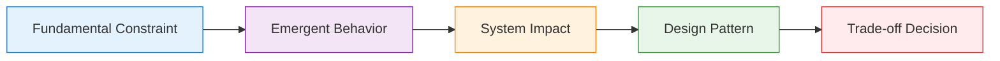
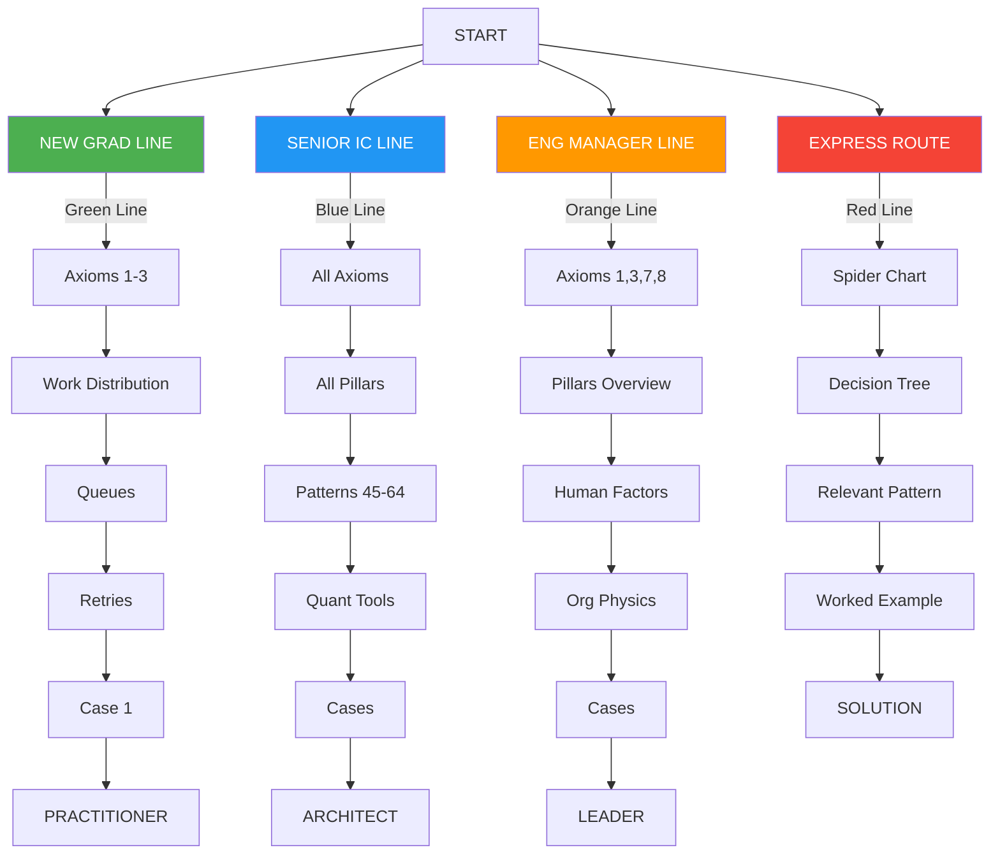

# The Compendium of Distributed Systems: Comprehensive First-Principles Expansion

!!! abstract "Core Philosophy"
    **All distributed systems behavior emerges from physical and mathematical constraints**. Rather than teaching patterns as recipes, we derive them from immutable laws.

## Response 1: Foundation, Philosophy, and Front Matter

### Core First-Principles Philosophy

<div class="axiom-box">

The entire book is built on fundamental constraints:

1. **Physical Laws**: Speed of light, thermodynamics, information theory
2. **Mathematical Laws**: Queueing theory, probability, graph theory
3. **Economic Laws**: Cost gradients, opportunity costs, resource allocation
4. **Human Laws**: Cognitive limits, communication bandwidth, organizational dynamics

</div>

### First-Principles Learning Framework



---
## EXPANDED FRONT MATTER (Pages i-iv)

### Pages i-ii: COVER, COPYRIGHT & CREDITS

=== "Visual Design Philosophy"

    - **Cover art**: A visual metaphor of light beams hitting a prism, splitting into the spectrum of distributed systems patterns
    - Each color represents an axiom, showing how white light (monolithic systems) splits into the distributed spectrum
    - QR code links to interactive simulator where readers can adjust axiom parameters and see pattern emergence

=== "Copyright Innovation"

    - CC-BY-NC license with "Derivative Works Encouraged" clause
    - Special provision for corporate training use with attribution
    - Living document commitment: purchasers get 3 years of updates

=== "Credits Structure"

    - Technical reviewers grouped by expertise (Theory, Practice, Pedagogy)
    - Beta reader testimonials with role/experience level
    - Special thanks to failure story contributors (anonymized)

### Page iii: PREFACE – Why Another Systems Book?

!!! quote "400-Word Manifesto"
    Existing distributed systems literature falls into two camps: academic proofs divorced from practice, or engineering cookbooks lacking theoretical foundation. DDIA gives you the 'what' and 'how'; SRE books provide the 'when things break.' This book uniquely provides the 'why from first principles.'

    We don't start with Kafka or Kubernetes. We start with the speed of light and the laws of thermodynamics. Every pattern emerges from inescapable constraints. When you understand why coordination has fundamental costs, you'll never again wonder whether to use 2PC or saga patterns—the physics will tell you.
    Three breakthroughs make this approach finally practical:
    
    1. **Axiom Unification**: Eight fundamental constraints explain all distributed behavior
    2. **Pattern Derivation**: Every architecture pattern emerges from axiom combinations
    3. **Decision Calculus**: Quantitative trade-off framework replacing intuition with math

    This isn't another 500-page tome to read once. It's a 100-page compass you'll reference throughout your career. Each page earns its place through information density and immediate applicability.

??? info "Scope Boundaries"
    **IN SCOPE:**
    
    - Distributed systems from 2-node to planet-scale
    - Both synchronous and asynchronous architectures
    
    **OUT OF SCOPE:**
    
    - Single-node optimization (refer to Hennessy & Patterson)
    - Specific vendor products (patterns over products)
    - Full protocol specifications (we extract principles)

### Page iv: READER ROAD-MAP

<div class="metro-map">



</div>

<div class="icon-legend">
<div class="icon-item"><span>🎯</span><strong>Decision Point:</strong> Major architectural choice</div>
<div class="icon-item"><span>⚠️</span><strong>Common Pitfall:</strong> Where systems typically fail</div>
<div class="icon-item"><span>💡</span><strong>Insight Box:</strong> Counter-intuitive truth</div>
<div class="icon-item"><span>🔧</span><strong>Try This:</strong> Hands-on exercise (<5 min)</div>
<div class="icon-item"><span>📊</span><strong>Measure This:</strong> Instrumentation point</div>
<div class="icon-item"><span>🎬</span><strong>Real Story:</strong> Anonymized failure vignette</div>
<div class="icon-item"><span>🧮</span><strong>Calculate:</strong> Numerical example</div>
<div class="icon-item"><span>🔗</span><strong>Cross-Link:</strong> Related concept elsewhere</div>
</div>
!!! success "Learning Commitment"
    Each page promises ONE core insight you'll use within 30 days

---

## PART I: AXIOM-BASED FOUNDATION (Pages 1-20)

### Page 1: AXIOM 1 – Latency (Speed of Light)

!!! target "Learning Objective"
    Internalize that latency is physics, not engineering.

#### Core Content Structure

<div class="axiom-box">

**Definition:**

```
Latency := Time for information to travel from point A to point B
Minimum Bound: distance / speed_of_light
In fiber: ~200,000 km/s (2/3 of c due to refractive index)
```

</div>

**The Physics Foundation:**

| Medium | Speed | Note |
|--------|-------|------|
| Light in vacuum | 299,792 km/s | Theoretical maximum |
| Fiber optic cable | ~200,000 km/s | Refractive index slowdown |
| Copper wire | ~200,000 km/s | Electromagnetic wave |

!!! danger "Fundamental Insight"
    No engineering can overcome physics
<div class="failure-vignette">

**Failure Vignette: The Tokyo Checkout Disaster**

```yaml
Scene: Black Friday 2019, US e-commerce giant
Setup: "Smart" optimization routes all Asian traffic to Tokyo DC
Problem: SF inventory DB is source of truth
Impact: 250ms RTT × 3 DB calls = 750ms per checkout
Result: 67% cart abandonment, $12M lost revenue
Fix: Regional inventory caches with eventual consistency
Lesson: Speed of light is a budget, not a suggestion
```

</div>

<div class="latency-ladder">

**The Latency Ladder** 🪜

```
Same rack:          0.5 ms    ▓
Same DC:            1-2 ms    ▓▓
Same region:        10 ms     ▓▓▓▓▓
Cross-continent:    100 ms    ▓▓▓▓▓▓▓▓▓▓
Opposite globe:     200+ ms   ▓▓▓▓▓▓▓▓▓▓▓▓▓▓▓▓▓▓▓▓
Geosync satellite:  500+ ms   ▓▓▓▓▓▓▓▓▓▓▓▓▓▓▓▓▓▓▓▓▓▓▓▓▓▓▓▓▓▓▓▓▓▓▓▓▓▓▓▓
Mars (best case):   4 min     ▓▓▓▓▓▓▓▓▓▓▓▓▓▓▓▓▓▓▓▓▓▓▓▓▓▓▓▓▓▓▓▓▓▓▓▓▓▓▓▓▓▓▓▓▓▓▓▓▓▓▓▓▓▓▓▓▓▓▓▓
```

</div>
<div class="decision-box">

**🎯 Decision Box: Cache vs Replica**

```python
IF (latency_budget < physics_minimum) THEN
  IF (data_changes_rarely) THEN
    USE cache WITH ttl = change_frequency
  ELSE IF (eventual_consistency_ok) THEN
    USE read_replica WITH async_replication
  ELSE
    REDESIGN to avoid remote calls
  END
ELSE
  USE remote_calls WITH latency_budget - physics_minimum margin
END
```

</div>

!!! example "Interactive Element"
    - Globe visualization with draggable points
    - Shows theoretical minimum latency between any two points
    - Overlays actual internet paths vs great circle routes

??? tip "🔧 Try This (2 minutes)"
    ```bash
    # Measure your physics tax
    ping -c 10 google.com | grep "min/avg/max"
    traceroute google.com | tail -5
    # Calculate: actual_latency / theoretical_minimum
    ```
<div class="truth-box">

**Counter-Intuitive Truth** 💡

Adding more servers can INCREASE latency if it adds more hops. The fastest distributed system is often the one with fewer, better-placed nodes.

</div>

!!! info "Cross-Links"
    - → [Caching Hierarchies (p.57)](#): Implementation patterns
    - → [Geo-Replication (p.61)](#): Multi-region strategies  
    - → [Latency Budget Worksheet (p.2)](#page-2-latency-budget-worksheet): Practical application

---

### Page 2: Latency Budget Worksheet

!!! abstract "Purpose"
    Transform latency from abstract concept to concrete budget.

#### The Latency P&L Statement

=== "Revenue (Total Budget)"
    ```
    User Expectation:        [___] ms
    Minus Browser Render:    -50 ms
    Minus Network Last Mile: -20 ms
    = Backend Budget:        [___] ms
    ```

=== "Expenses (Allocations)"
    ```
    Load Balancer:     [___] ms (typical: 1-2)
    API Gateway:       [___] ms (typical: 2-5)
    Service Mesh:      [___] ms (typical: 1-3)
    Business Logic:    [___] ms (varies)
    Database Call:     [___] ms (typical: 5-50)
    Cache Check:       [___] ms (typical: 0.5-2)
    Total Spent:       [___] ms
    ```

=== "Margin"
    ```
    MARGIN: [___] ms (must be > 0!)
    ```
#### Real-World Budgets by Industry

| Industry | Budget | Reason |
|----------|--------|--------|
| **Stock Trading** | 10 ms | Regulatory requirement |
| **Gaming** | 16 ms | 60 fps requirement |
| **Video Conference** | 150 ms | Conversation flow |
| **E-commerce** | 1000 ms | Conversion dropoff |
| **Email** | 5000 ms | User expectation |

??? example "🧮 Worked Example: Photo Sharing App"
    **Goal**: User uploads photo, expects thumbnail in < 2 seconds
    
    **Budget Allocation**:
    ```yaml
    Upload to CDN edge:      100 ms  (physics: user to edge)
    Edge to origin DC:        50 ms  (physics: edge to DC)
    Queue wait time:         200 ms  (p95 during peak)
    Resize processing:       500 ms  (CPU bound)
    Thumbnail generation:    300 ms  (GPU accelerated)
    Write to 3 replicas:     150 ms  (parallel writes)
    CDN cache population:    200 ms  (push to edges)
    Response to user:        100 ms  (physics: edge to user)
    ━━━━━━━━━━━━━━━━━━━━━━━━━━━━━━━━━━━━━━━━━━━━━━━━━
    TOTAL:                  1600 ms  ✅ (400ms margin)
    ```
    
    **Optimization opportunities**:
    
    1. Pre-warm GPU containers (-200ms cold start)
    2. Regional processing (-50ms physics tax)
    3. Optimistic UI (-1600ms perceived!)
!!! warning "Budget Violation Patterns"
    1. **Death by Thousand Cuts**: Each service "only" adds 5ms
    2. **Retry Multiplication**: 3 retries × 100ms = 300ms gone
    3. **Serial Staircase**: Waterfall instead of parallel
    4. **Cold Start Surprise**: Lambda/container warm-up
    5. **GC Pause Gambling**: 99th percentile GC stops

??? tip "🔧 Try This: Profile Your Critical Path"
    ```python
    import time
    from contextlib import contextmanager

    @contextmanager
    def latency_budget(operation, budget_ms):
        start = time.time()
        yield
        elapsed_ms = (time.time() - start) * 1000
        remaining = budget_ms - elapsed_ms
        print(f"{operation}: {elapsed_ms:.1f}ms (budget: {remaining:+.1f}ms)")
        if remaining < 0:
            print(f"⚠️  BUDGET VIOLATION: {-remaining:.1f}ms over!")

    # Use in your code:
    with latency_budget("Database query", 50):
        results = db.query("SELECT ...")
    ```

---

## 🎓 Continue Learning

This is just the beginning of our journey through distributed systems. Each axiom builds upon the previous, creating a complete mental model for system design.

!!! info "What's Next?"
    - **Axiom 2**: Finite Capacity - Every resource has a breaking point
    - **Axiom 3**: Failure - Components will fail; plan accordingly
    - **Axiom 4**: Consistency - The CAP theorem in practice
    
    [Continue to Axiom 2 →](#)

---

<div style="text-align: center; margin-top: 3rem; color: var(--md-default-fg-color--light);">
    <em>Remember: The best distributed system is often the one that isn't distributed.</em>
</div>