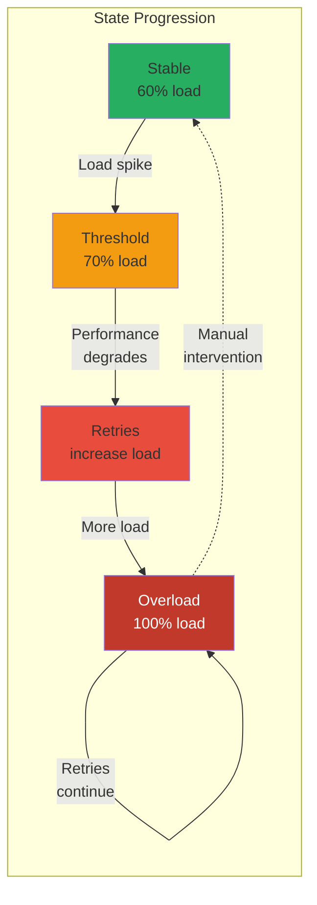
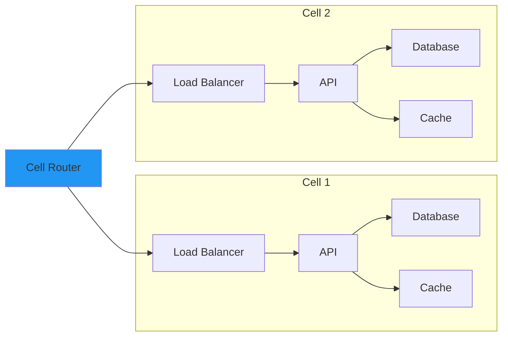

# Law 1: The Law of Inevitable and Correlated Failure

<span class="path-icon">🎯</span>
 <span class="path-name">Fundamental Axiom</span>
 <span class="path-progress">1/7</span>
 <div class="mini-progress">
</div>

> "Any component can fail, and failures are often correlated, not independent."

## The Naïve Model vs Reality

=== "What We're Taught"

 !!! info "Independent Failure Model"
 Traditional distributed systems education begins with a simple probabilistic model:
 
 - If a server has 99.9% uptime, it fails 0.1% of the time
 - With 3 independent replicas: P(all fail) = 0.001³ = 10⁻⁹
 - Therefore, we've achieved "nine nines" of reliability! 🎉
 
 ```python title="naive_calculation.py"
 uptime = 0.999
 replicas = 3
 all_fail_probability = (1 - uptime) ** replicas
 print(f"Probability of total failure: {all_fail_probability:.2e}")
 # Output: 1.00e-09 (Nine nines!)
 ```

=== "The Reality"

 !!! danger "Correlated Failure Dominates"
 This calculation is **dangerously wrong** because it assumes independence. Real systems share:
 
 - :material-power-plug: **Power supplies**
 - :material-network: **Network switches**
 - :material-cog: **Configuration services**
 - :material-package-variant: **Deployment tools**
 - :material-map-marker: **Geographic location**
 
 ```mermaid
 graph TD
 subgraph "Shared Dependencies Create Correlation"
 PS[Power Supply] --> R1[Rack 1]
 PS --> R2[Rack 2]
 PS --> R3[Rack 3]
 
 PS -.->|Single point<br/>of failure| OUTAGE[Mass Outage]
 end
 
 style PS fill:#e74c3c
 style OUTAGE fill:#c0392b,color:#fff
 ```

## A Taxonomy of Real-World Failure Modes

<div class="grid cards" markdown>

- :material-server-network:{ .lg .middle } **Correlated Hardware Failures**

 ---
 
 Multiple components fail simultaneously due to shared physical dependencies
 
 !!! example "Examples"
 - **Power**: UPS failure → entire rack down
 - **Cooling**: HVAC failure → thermal shutdown
 - **Network**: Core switch → zone isolation
 
 [:octicons-arrow-right-24: View Details](#correlated-hardware-failures)

- :material-cloud-question:{ .lg .middle } **Gray Failures**

 ---
 
 System doesn't crash cleanly but suffers severe performance degradation
 
 !!! warning "Characteristics"
 - Health checks pass ✓
 - Performance unusable ✗
 - Hard to detect automatically
 
 [:octicons-arrow-right-24: View Details](#gray-failures)

- :material-sine-wave:{ .lg .middle } **Metastable Failures**

 ---
 
 System stable at low load but enters persistent failure above threshold
 
 !!! danger "Pattern"
 Normal → Spike → Degradation → Retries → Overload → Stuck
 
 [:octicons-arrow-right-24: View Details](#metastable-failures)

- :material-tower-broadcast:{ .lg .middle } **Cascading Failures**

 ---
 
 One component's failure triggers failures in dependent components
 
 !!! abstract "Common Patterns"
 - Thundering herd
 - Retry storms
 - Circuit breaker cascades
 
 [:octicons-arrow-right-24: View Details](#cascading-failures)

</div>

### Correlated Hardware Failures

??? danger "Real-World Examples - Click to Expand"

 === "GitHub 2018"
 
 !!! failure "UPS Battery Failure"
 **Date**: October 21, 2018 
 **Duration**: 24 hours 11 minutes 
 **Impact**: Degraded service, data inconsistency
 
 **What Happened**:
 1. Routine maintenance on UPS systems
 2. Battery failure during switchover
 3. Power loss to entire rack
 4. Cascading database failures
 
 **Correlation Factor**: All servers in rack shared same UPS
 
 === "AWS S3 2017"
 
 !!! failure "Typo in Deployment Script"
 **Date**: February 28, 2017 
 **Duration**: 4 hours 
 **Impact**: Major internet services down
 
 **What Happened**:
 ```bash
 # Intended command
 aws s3api delete-objects --bucket my-bucket --delete "Objects=[{Key=logs/2017-02-27/*}]"
 
 # Actual command (typo removed more servers than intended)
 aws s3api delete-objects --bucket my-bucket --delete "Objects=[{Key=*}]"
 ```
 
 **Correlation Factor**: Single deployment tool for all S3 subsystems
 
 === "Cloudflare 2019"
 
 !!! failure "Global WAF Outage"
 **Date**: July 2, 2019 
 **Duration**: 27 minutes 
 **Impact**: 502 errors globally
 
 **Bad Regex Pattern**:
 ```regex
 .*(?:.*=.*) # Catastrophic backtracking
 ```
 
 **Correlation Factor**: Same WAF rules deployed to all edge locations simultaneously

!!! tip "Key Insight"
 Physical proximity creates correlation. *"Availability zones"* exist precisely to break these correlations.(1)
 { .annotate }
 
 1. Modern cloud providers ensure AZs have independent power, cooling, and network paths

### Gray Failures

!!! abstract "Definition"
 The system doesn't crash cleanly but suffers severe performance degradation that makes it effectively unusable while still appearing "healthy" to monitoring systems.

=== "Example Code"

 ```python title="gray_failure_example.py" linenums="1" hl_lines="3 7-9"
 def health_check():
 # This passes even during gray failure!
 return "OK" 
 
 def process_request(data):
 # Disk at 99% capacity causes massive slowdown
 with open('/nearly/full/disk/file.log', 'a') as f:
 # Takes 30 seconds instead of 30ms
 f.write(data) # Eventually succeeds, but too late
 
 # Health checks: ✅ Passing
 # User experience: ❌ Timeouts
 ```

=== "Detection Strategy"

 !!! tip "Multi-Signal Detection"
 Monitor these signals together:
 
 - [ ] Response time percentiles (P95, P99)
 - [ ] Queue depths
 - [ ] Thread pool saturation
 - [ ] Resource utilization vs throughput
 - [ ] Error rates at client side

=== "Real Example"

 !!! example "DynamoDB Gray Failure"
 During a 2015 incident, DynamoDB nodes experienced:
 
| Metric | Normal | During Failure |
 |--------|--------|----------------|
 | Health Check | ✅ Pass | ✅ Pass |
 | P50 Latency | 10ms | 15ms |
 | P99 Latency | 50ms | **30,000ms** |
 | CPU Usage | 40% | 45% |

 
 The service appeared healthy but was unusable for customers.

### Metastable Failures

!!! danger "The Metastability Trap"
 System enters a persistent failure state that requires manual intervention to recover, even after the initial trigger is removed.



??? info "Facebook's 2019 Metastable Failure Analysis"
 
 !!! quote "From Facebook's Post-Mortem"
 "A routine configuration change triggered cache misses, which led to retries, which led to more cache misses, creating a feedback loop that persisted even after the configuration was reverted."
 
 **Timeline**:
 1. **14:00** - Config change reduces cache hit rate by 0.1%
 2. **14:05** - Slight increase in database load
 3. **14:10** - Slower queries trigger client retries
 4. **14:15** - Retries cause more cache misses
 5. **14:20** - System at 100% load, mostly retries
 6. **14:30** - Config reverted, but system still overloaded
 7. **16:00** - Manual intervention: shed load, restart services
 
 **Lesson**: Small perturbations can trigger persistent failure states

## Beyond Traditional Fault Tolerance

### Failure Domains and Blast Radius

!!! abstract "Failure Domain Definition"
 A failure domain is a set of components that share fate - when one fails, all fail together.

<div class="grid cards" markdown>

- **Hierarchical Failure Domains**

 ```mermaid
 graph TD
 subgraph "Region US-East"
 subgraph "AZ 1"
 subgraph "Rack A"
 S1[Server 1]
 S2[Server 2]
 end
 subgraph "Rack B"
 S3[Server 3]
 S4[Server 4]
 end
 end
 subgraph "AZ 2"
 subgraph "Rack C"
 S5[Server 5]
 S6[Server 6]
 end
 end
 end
 ```

- **Design Principles**

 !!! success "Best Practices"
 1. **Identify all domains**: Power, network, software, config, human
 2. **Minimize blast radius**: Limit impact of any single failure
 3. **Create anti-correlation**: Ensure replicas in different domains
 4. **Test assumptions**: Validate independence via chaos engineering

</div>

### Dependency Analysis

=== "Method"

 ```python title="correlation_analysis.py"
 def analyze_failure_correlation(services):
 """Calculate correlation in failure probability"""
 dependency_graph = build_dependency_graph(services)
 shared_deps = find_shared_dependencies(dependency_graph)
 
 correlation_matrix = {}
 for s1, s2 in combinations(services, 2):
 shared = shared_deps.get((s1, s2), [])
 # Correlation increases with shared dependencies
 correlation = len(shared) / max(
 len(dependency_graph[s1]), 
 len(dependency_graph[s2])
 )
 correlation_matrix[(s1, s2)] = correlation
 
 return correlation_matrix
 ```

=== "Visualization"

 !!! tip "Dependency Graph Analysis"
 Use graph analysis to find hidden correlations:
 
 - **Shared dependencies** = Single points of failure
 - **Long dependency chains** = Cascade risk
 - **Circular dependencies** = Deadlock risk
 - **Hub nodes** = High blast radius

## Designing for Correlated Failure

### 1. Cellular Architecture

!!! success "Pattern: Isolated Cells"
 Divide system into isolated cells that fail independently



### 2. Bulkheads and Isolation

=== "Thread Pool Isolation"

 ```java title="BulkheadService.java"
 class BulkheadService {
 // Separate thread pools for different criticality
 private final ExecutorService criticalPool = 
 Executors.newFixedThreadPool(50);
 private final ExecutorService analyticsPool = 
 Executors.newFixedThreadPool(10);
 
 public CompletableFuture<Response> handleCritical(Request req) {
 return CompletableFuture.supplyAsync(
 () -> processCritical(req), 
 criticalPool // Isolated from analytics
 );
 }
 }
 ```

=== "Network Isolation"

 !!! tip "Network Segmentation"
 - **Critical Path**: Dedicated network for user-facing traffic
 - **Bulk Operations**: Separate network for batch jobs
 - **Management**: Isolated network for deployment/monitoring

### 3. Progressive Rollout

!!! example "Deployment Strategy"
 
 ```yaml title="deployment.yaml"
 deployment_strategy:
 stages:
 - name: "Canary"
 percentage: 1
 duration: "10m"
 rollback_on_error: true
 
 - name: "Early Adopters" 
 percentage: 10
 duration: "1h"
 rollback_on_error: true
 
 - name: "Half"
 percentage: 50
 duration: "2h"
 rollback_on_error: false # Manual decision
 
 - name: "Full"
 percentage: 100
 ```

## Practical Testing

### Chaos Engineering for Correlation

!!! warning "Testing Checklist"
 
 === "Infrastructure Tests"
 
 - [ ] Power failure simulation
 ```python
 fail_entire_rack("rack-42")
 ```
 - [ ] Network partition
 ```python
 partition_availability_zone("us-east-1a")
 ```
 - [ ] DNS failures
 ```python
 poison_dns_cache("service.internal")
 ```
 
 === "Software Tests"
 
 - [ ] Configuration corruption
 ```python
 corrupt_shared_config("service-mesh-config")
 ```
 - [ ] Clock skew
 ```python
 introduce_clock_skew("ntp-server-1", offset=300)
 ```
 - [ ] Certificate expiry
 ```python
 expire_certificate("*.example.com")
 ```
 
 === "Capacity Tests"
 
 - [ ] Resource exhaustion
 ```python
 exhaust_shared_resource("connection-pool")
 ```
 - [ ] Quota limits
 ```python
 trigger_rate_limit("api-gateway")
 ```
 - [ ] Storage filling
 ```python
 fill_disk_to_percentage("/data", 95)
 ```

### Monitoring for Correlation

!!! info "Correlation Detection Query"
 
 ```sql title="correlation_monitoring.sql" linenums="1"
 -- Detect correlated failures across services
 SELECT 
 s1.service_name,
 s2.service_name,
 CORR(s1.error_rate, s2.error_rate) OVER (
 ORDER BY timestamp 
 RANGE BETWEEN INTERVAL '5 minutes' PRECEDING 
 AND CURRENT ROW
 ) as error_correlation
 FROM service_metrics s1
 JOIN service_metrics s2 
 ON s1.timestamp = s2.timestamp
 WHERE correlation > 0.8 -- High correlation threshold
 ```

## The Ultimate Lesson

!!! quote "Key Takeaway"
 "The question is not whether a component will fail, but which components will fail together."

Robust distributed systems aren't built by assuming independence—they're built by **identifying and breaking correlations**. 

- Every shared dependency is a potential correlation
- Every correlation is a single point of failure waiting to happen
- **Design for correlation**, don't pretend it doesn't exist

## Further Reading

!!! abstract "References"
 - ["Why Do Computers Stop and What Can Be Done About It?"](https://www.hpl.hp.com/techreports/tandem/TR-85.7.pdf) - Jim Gray
 - ["The Network is Reliable"](https://www.usenix.org/system/files/conference/osdi14/osdi14-paper-bailis.pdf) - Peter Bailis and Kyle Kingsbury 
 - ["Metastable Failures in Distributed Systems"](https://sigops.org/s/conferences/hotos/2021/papers/hotos21-s11-bronson.pdf) - Bronson et al.

---

**[← Back to Framework](../index.md)** | **[→ Next: Law of Asynchrony](../law2-asynchrony/)**