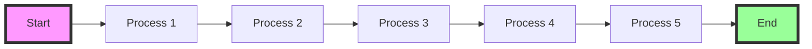

# Layout Test: Content Boundaries

This page tests that all content is properly left-aligned and respects the "On This Page" (Table of Contents) sidebar on the right.

## Text Content

This is a regular paragraph that should be left-aligned and not extend under the table of contents on the right side. The content should have proper boundaries and stay within the main content area.

Lorem ipsum dolor sit amet, consectetur adipiscing elit. Sed do eiusmod tempor incididunt ut labore et dolore magna aliqua. Ut enim ad minim veniam, quis nostrud exercitation ullamco laboris nisi ut aliquip ex ea commodo consequat.

## Long Code Block

```python
# This is a long code block that should stay within boundaries
def test_content_boundaries():
    """
    This function has a very long line that would normally extend beyond the content area but should be scrollable instead
    """
    very_long_variable_name_that_would_normally_cause_horizontal_scrolling = "This is a test of the content boundary system to ensure code blocks don't extend under the TOC"
    return very_long_variable_name_that_would_normally_cause_horizontal_scrolling
```

## Wide Table

<div class="responsive-table" markdown>

| Column 1 | Column 2 | Column 3 | Column 4 | Column 5 | Column 6 | Column 7 | Column 8 |
|----------|----------|----------|----------|----------|----------|----------|----------|
| This is a very wide table | That should be scrollable | Within its container | And not extend | Under the TOC | On the right side | Of the page | Test content |
| More data | More data | More data | More data | More data | More data | More data | More data |

</div>

## Grid Layout

<div class="grid cards" markdown>

- :material-clock-fast:{ .lg .middle } **Card 1**

    ---

    This card should be part of a grid that respects content boundaries.

- :material-scale-balance:{ .lg .middle } **Card 2**

    ---

    The grid should not extend under the table of contents.

- :material-account-group:{ .lg .middle } **Card 3**

    ---

    All cards should stay within the main content area.

</div>

## Admonition

!!! info "Information Box"
    This admonition should be left-aligned and stay within the content boundaries, not extending under the TOC.

## Mermaid Diagram



## Lists

### Unordered List
- First item in the list
- Second item with a longer description that should wrap properly
- Third item with sub-items:
  - Sub-item 1
  - Sub-item 2
  - Sub-item 3

### Ordered List
1. First numbered item
2. Second numbered item with a very long description that tests how content wraps when it reaches the boundary
3. Third numbered item

## Blockquote

> This is a blockquote that should be properly left-aligned and stay within the content boundaries. It should not extend under the table of contents on the right side of the page.

## Image (Placeholder)


*Caption: This image should scale to fit within the content area*

## Content Tabs

=== "Tab 1"
    This content is in the first tab and should respect boundaries.
    
    ```python
    def tab_example():
        return "Tab content"
    ```

=== "Tab 2"
    This content is in the second tab.
    
    | Col 1 | Col 2 | Col 3 |
    |-------|-------|-------|
    | Data  | Data  | Data  |

=== "Tab 3"
    Third tab with a diagram:
    
    ```mermaid
    graph TD
        A[Start] --> B[End]
    ```

## Nested Content

### Deep Section for TOC Testing

This section creates more items in the table of contents.

#### Subsection 1

Content here.

#### Subsection 2

More content here.

#### Subsection 3

Even more content to ensure the TOC has enough items.

### Another Section

Final section to test scrolling in the TOC.

---

**Result**: All content above should be left-aligned and contained within the main content area, never extending under the "On This Page" sidebar on the right.