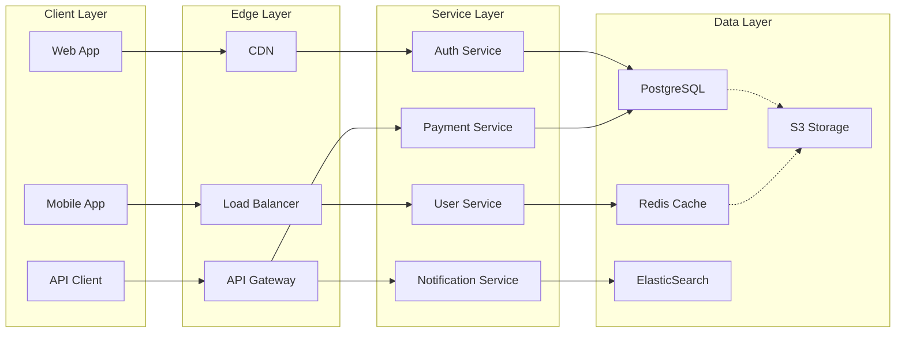

# Material for MkDocs Grid & Layout Examples

This page demonstrates all the Material for MkDocs built-in responsive and layout capabilities available in your DStudio site.

## 1. Card Grids (Most Versatile)

### Basic Card Grid
<div class="grid cards" markdown>

-   :material-rocket:{ .lg .middle } **Performance**

    ---

    High-speed, low-latency solutions for demanding applications.

-   :material-shield:{ .lg .middle } **Security**

    ---

    Enterprise-grade security with encryption and access controls.

-   :material-scale-balance:{ .lg .middle } **Scalability**

    ---

    Auto-scaling solutions that grow with your business needs.

-   :material-trending-up:{ .lg .middle } **Analytics**

    ---

    Real-time insights and comprehensive reporting capabilities.

</div>

### Card Grid with Links
<div class="grid cards" markdown>

-   [:material-database:{ .lg .middle } **Database Patterns**](../patterns/index.md#data-patterns)

    ---

    Explore patterns for distributed data management, consistency models, and storage optimization.

-   [:material-network:{ .lg .middle } **Network Patterns**](../patterns/index.md#communication-patterns)

    ---

    Learn about service communication, API gateways, and messaging patterns.

-   [:material-cog:{ .lg .middle } **Operational Patterns**](../patterns/index.md#operational-patterns)

    ---

    Discover monitoring, logging, and operational excellence patterns.

</div>

## 2. Generic Grids (Flexible Layout)

### Simple Generic Grid
<div class="grid" markdown>

!!! tip "Performance Tip"
    Use caching to reduce database load by 80-90%.

!!! warning "Security Alert"
    Always validate input data to prevent injection attacks.

!!! info "Scalability Note"
    Consider horizontal scaling when CPU usage exceeds 70%.

</div>

### Dense Grid (5+ Columns)
<div class="grid dense" markdown>

=== "Latency"
    - Database: 1-5ms
    - Cache: <1ms
    - Network: 10-100ms

=== "Throughput"
    - Redis: 100K ops/s
    - PostgreSQL: 10K ops/s
    - Kafka: 1M msgs/s

=== "Availability"
    - Single AZ: 99.9%
    - Multi-AZ: 99.99%
    - Multi-Region: 99.999%

=== "Consistency"
    - Strong: ACID
    - Eventual: BASE
    - Weak: Performance

=== "Cost"
    - Cache: $$$
    - Compute: $$
    - Storage: $

</div>

## 3. Full-Width Content

### Standard Full-Width
<div class="full-width" markdown>



</div>

### Wide Layout (Container Width)
<div class="wide-layout" markdown>

| Pattern | Use Case | Latency Impact | Complexity | Cost | Team Size |
|---------|----------|----------------|------------|------|-----------|
| **Circuit Breaker** | Prevent cascade failures | Minimal (+1-2ms) | Low | $ | 1-2 |
| **Rate Limiting** | Control traffic | Low (+5-10ms) | Low | $ | 1-2 |
| **Caching** | Reduce database load | Negative (-50-100ms) | Medium | $$ | 2-3 |
| **Load Balancing** | Distribute traffic | Low (+2-5ms) | Medium | $$ | 2-4 |
| **Service Mesh** | Observability & Security | Medium (+10-20ms) | High | $$$ | 5-8 |
| **Sharding** | Scale database | Variable | High | $$$ | 4-6 |

</div>

## 4. Responsive Tables

### Standard Responsive Table
<div class="responsive-table" markdown>

| Feature | Basic Plan | Pro Plan | Enterprise Plan | Ultra Scale |
|---------|------------|----------|-----------------|-------------|
| **Users** | 1-10 | 11-100 | 101-10K | 10K+ |
| **Requests/Month** | 100K | 1M | 10M | 100M+ |
| **Storage** | 1GB | 10GB | 100GB | 1TB+ |
| **Support** | Email | Email + Chat | Phone + Dedicated | 24/7 + TAM |
| **SLA** | 99% | 99.9% | 99.99% | 99.999% |
| **Price** | $10/mo | $50/mo | $200/mo | Custom |

</div>

## 5. Mixed Content Layouts

### Comparison Layout
<div class="grid" markdown>

<div markdown>
**Monolithic Architecture**

- ✅ Simple deployment
- ✅ Easy debugging
- ✅ Consistent transactions
- ❌ Limited scalability
- ❌ Technology lock-in
- ❌ Single failure point

**Best for**: Small teams, rapid prototyping, simple applications
</div>

<div markdown>
**Microservices Architecture**

- ✅ Independent scaling
- ✅ Technology diversity
- ✅ Fault isolation
- ❌ Complex deployment
- ❌ Network latency
- ❌ Distributed debugging

**Best for**: Large teams, complex domains, high scale requirements
</div>

</div>

### Feature Showcase
<div class="grid cards" markdown>

-   :material-speed:{ .lg .middle } **High Performance**

    ---
    
    ```yaml
    Performance Metrics:
      Response Time: <100ms p99
      Throughput: 1M+ req/sec
      Availability: 99.99%
    ```
    
    Optimized for speed with intelligent caching, connection pooling, and async processing.

-   :material-shield-lock:{ .lg .middle } **Enterprise Security**

    ---
    
    ```yaml
    Security Features:
      Encryption: AES-256, TLS 1.3
      Auth: OAuth 2.0, SAML, LDAP
      Compliance: SOC2, GDPR, HIPAA
    ```
    
    Bank-grade security with zero-trust architecture and comprehensive audit trails.

-   :material-chart-line:{ .lg .middle } **Smart Analytics**

    ---
    
    ```yaml
    Analytics Capabilities:
      Real-time: WebSocket streams
      Batch: Spark, Hadoop
      ML: TensorFlow, PyTorch
    ```
    
    AI-powered insights with real-time dashboards and predictive analytics.

</div>

## 6. Advanced Layout Techniques

### Nested Grids
<div class="grid" markdown>

<div markdown>
**Primary Services**

<div class="grid cards" markdown>

-   **Auth** - Identity management
-   **Users** - Profile & preferences  
-   **Billing** - Payment processing

</div>
</div>

<div markdown>
**Supporting Services**

<div class="grid cards" markdown>

-   **Notifications** - Email & push
-   **Analytics** - Usage tracking
-   **Monitoring** - Health checks

</div>
</div>

</div>

### Asymmetric Grid
<div class="grid" markdown>

<div markdown>
**Quick Setup**

1. Install dependencies
2. Configure environment
3. Run migrations
4. Deploy to staging
5. Validate endpoints
6. Deploy to production

[Get Started →](../introduction/getting-started.md)
</div>

!!! example "System Requirements"
    
    **Minimum Requirements**
    - 4 GB RAM
    - 2 CPU cores  
    - 10 GB storage
    - Ubuntu 20.04+
    
    **Recommended**
    - 16 GB RAM
    - 8 CPU cores
    - 100 GB SSD
    - Kubernetes cluster

!!! success "Production Ready"
    
    **Included Features**
    - Auto-scaling
    - Health monitoring
    - Backup & recovery
    - Security scanning
    - Performance metrics

</div>

## Implementation Notes

### CSS Classes Used
- `.grid` - Basic grid layout
- `.grid.cards` - Card-style grid with hover effects
- `.grid.dense` - Compact grid for more columns
- `.full-width` - Breaks out to full viewport width
- `.wide-layout` - Uses full container width
- `.responsive-table` - Mobile-friendly table wrapper

### Responsive Behavior
- **Mobile (< 45em)**: Single column layout
- **Tablet (45-60em)**: 2 columns maximum  
- **Desktop (60-90em)**: 3-4 columns optimal
- **Large (90em+)**: 5+ columns for dense grids
- **Ultra-wide (100em+)**: Enhanced spacing and larger cards

### Best Practices
1. Use cards for similar content blocks
2. Keep card content concise and scannable
3. Use icons to improve visual hierarchy
4. Leverage full-width for diagrams and complex tables
5. Test on multiple screen sizes during development