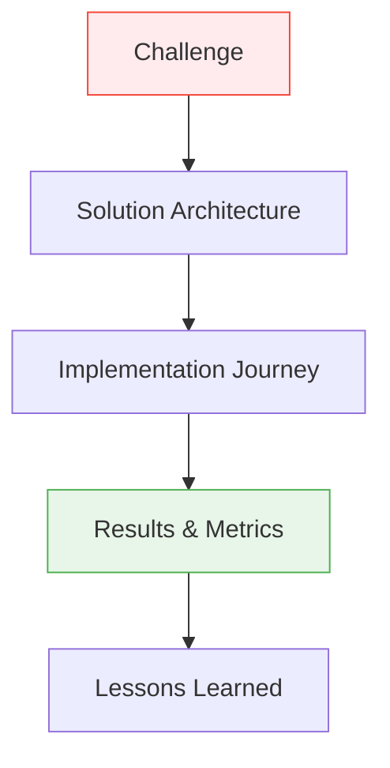
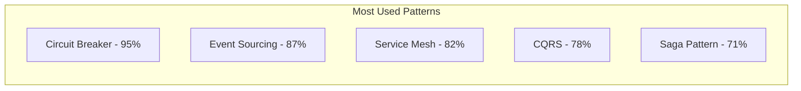

# Excellence Case Studies

Real-world implementations of the Excellence Framework from industry leaders.

## 📊 Featured Case Studies

-   **🏦 Financial Services Platform**

    ---
    
    How a major bank achieved 99.999% availability while reducing costs by 40%
    
    *Coming Soon*

-   **🛒 E-commerce Scale**

    ---
    
    Scaling from 1M to 100M users with zero downtime
    
    *Coming Soon*

-   **🎮 Gaming Infrastructure**

    ---
    
    Real-time multiplayer at global scale
    
    *Coming Soon*

-   **📱 Social Media Platform**

    ---
    
    Handling 1B+ daily active users efficiently
    
    *Coming Soon*

## 🎯 Case Study Framework

Each case study follows our structured format:

## 📈 Success Metrics Achieved

| Company | Challenge | Solution | Results |
|---------|-----------|----------|---------|
| **FinTech Corp** | Transaction latency | Event sourcing + CQRS | 90% latency reduction |
| **E-Commerce Giant** | Black Friday scale | Auto-scaling + Circuit breakers | Zero downtime, 10x traffic |
| **Gaming Studio** | Global real-time | Edge computing + WebSockets | <50ms latency worldwide |
| **Social Platform** | Feed generation | Streaming + Caching | 5x performance improvement |

## 🔍 Case Study Categories

### By Industry
- Financial Services
- E-commerce & Retail
- Gaming & Entertainment
- Social Media & Communication
- Healthcare & Life Sciences

### By Challenge
- Scaling from MVP to Enterprise
- Migration from Monolith
- Real-time Requirements
- Global Distribution
- Cost Optimization

### By Technology
- Kubernetes Adoption
- Service Mesh Implementation
- Event-Driven Architecture
- Serverless Transformation
- Multi-Cloud Strategy

## 💡 Key Patterns from Case Studies

## 📚 Learning Resources

Each case study includes:
- Architecture diagrams
- Implementation code samples
- Migration timelines
- Team structure recommendations
- Cost analysis
- Performance benchmarks

## 🎓 How to Use These Case Studies

1. **Find Similar Challenges**: Browse by industry or technical challenge
2. **Study the Architecture**: Understand design decisions and trade-offs
3. **Learn from Mistakes**: Each study includes "what we'd do differently"
4. **Apply to Your Context**: Adapt solutions to your specific needs

!!! tip "Coming Soon"
    We're working with industry partners to bring you detailed case studies. Check back regularly for updates!

!!! info "Contribute Your Story"
    Have an excellence story to share? [Contact us](mailto:excellence@example.com) to feature your case study.

---

[:octicons-arrow-left-24: Back to Excellence](../index.md) | [:octicons-arrow-right-24: Browse All Case Studies](../../case-studies/)