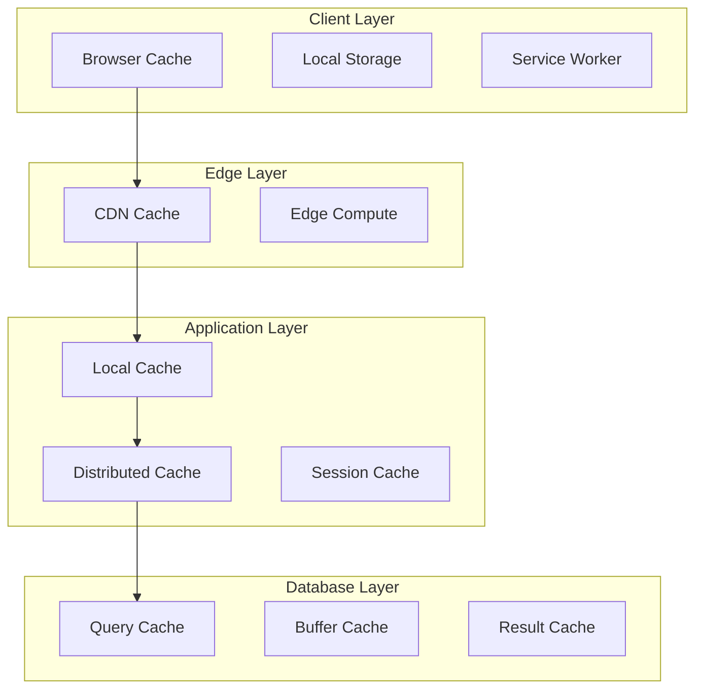
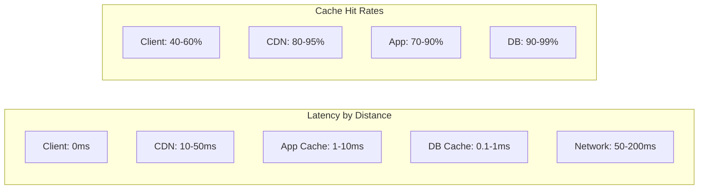
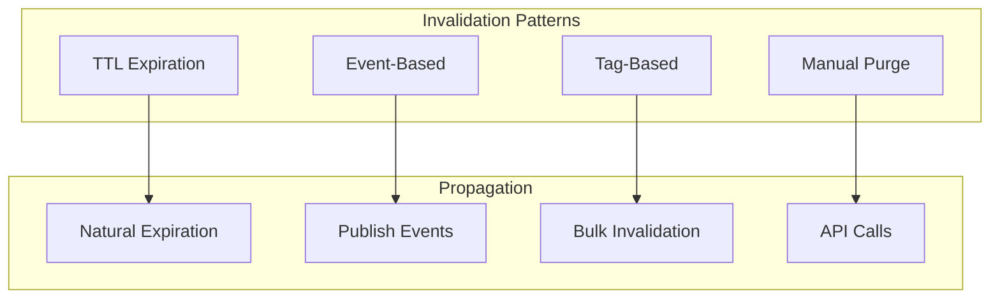

# Caching Patterns Comparison

## Overview

Caching is essential for performance at scale. This guide compares Client-side, CDN, Application, and Database caching strategies to help you build an effective caching architecture.

## Quick Comparison Matrix

| Pattern | Location | Latency | Hit Rate | Complexity | Cost |
|---------|----------|---------|----------|------------|------|
| **Client-side** | Browser/App | ~0ms | Variable | Low | Free |
| **CDN** | Edge locations | 10-50ms | High | Low | Medium |
| **Application** | App servers | 1-10ms | High | Medium | Low |
| **Database** | DB layer | 0.1-1ms | Very High | High | Medium |

## Cache Architecture Layers



## Decision Matrix

### When to Use Each Pattern

| Use Case | Best Pattern | Reasoning |
|----------|-------------|-----------|
| Static assets (JS, CSS, images) | CDN | Global distribution, high hit rate |
| User preferences | Client-side | Personal data, instant access |
| API responses | Application | Dynamic content, TTL control |
| Database queries | Database | Expensive computations |
| Session data | Application (Redis) | Fast access, shared state |
| Personalized content | Client + Application | Hybrid for performance |
| Real-time data | No cache | Freshness critical |

## Performance Characteristics



## Implementation Patterns

### Client-side Caching
```yaml
Browser Cache:
  - HTTP headers (Cache-Control, ETag)
  - Automatic management
  - Limited control
  
Local Storage:
  - 5-10MB limit
  - Persistent across sessions
  - Manual management
  
Service Workers:
  - Offline capability
  - Programmable cache
  - Complex implementation
```

### CDN Caching
```yaml
Static Content:
  - Images, videos, CSS, JS
  - Long TTL (days/weeks)
  - Purge on deployment
  
Dynamic Content:
  - API responses
  - Short TTL (minutes)
  - Vary by headers
  
Edge Computing:
  - Request manipulation
  - A/B testing
  - Geo-specific content
```

### Application Caching
```yaml
In-Memory (Local):
  - Process-specific
  - No network overhead
  - Limited to single instance
  
Distributed (Redis/Memcached):
  - Shared across instances
  - Network overhead
  - Consistent hashing
  
Hybrid:
  - L1: Local cache (milliseconds)
  - L2: Distributed cache (microseconds)
  - L3: Database (milliseconds)
```

### Database Caching
```yaml
Query Result Cache:
  - Exact query matches
  - Invalidation on write
  - Transparent to application
  
Materialized Views:
  - Pre-computed results
  - Scheduled refresh
  - Storage overhead
  
Buffer Pool:
  - Page-level caching
  - Automatic management
  - Memory-intensive
```

## Cache Strategies Comparison

| Strategy | Write Pattern | Read Pattern | Consistency | Use Case |
|----------|--------------|--------------|-------------|----------|
| **Cache-Aside** | Write to DB | Read from cache, load on miss | Eventual | General purpose |
| **Write-Through** | Write to cache + DB | Read from cache | Strong | Write-heavy |
| **Write-Behind** | Write to cache, async to DB | Read from cache | Eventual | High write volume |
| **Refresh-Ahead** | Background refresh | Read from cache | Fresh | Predictable access |

## Implementation Examples

### Multi-Level Caching Architecture
```python
class MultiLevelCache:
    def __init__(self):
        self.l1_cache = {}  # Process memory
        self.l2_cache = Redis()  # Distributed
        self.l3_cache = Database()  # Persistent
        
    def get(self, key):
        # L1 Check
        if key in self.l1_cache:
            return self.l1_cache[key]
        
        # L2 Check
        value = self.l2_cache.get(key)
        if value:
            self.l1_cache[key] = value
            return value
        
        # L3 Check
        value = self.l3_cache.query(key)
        if value:
            self.l2_cache.set(key, value, ttl=300)
            self.l1_cache[key] = value
            return value
        
        return None
```

### CDN Cache Headers
```nginx
# Static assets - cache for 1 year
location ~* \.(jpg|jpeg|png|gif|ico|css|js)$ {
    expires 1y;
    add_header Cache-Control "public, immutable";
}

# API responses - cache for 5 minutes
location /api/ {
    expires 5m;
    add_header Cache-Control "public, max-age=300";
    add_header Vary "Accept-Encoding, Authorization";
}

# User-specific content - no cache
location /user/ {
    expires -1;
    add_header Cache-Control "private, no-cache, no-store";
}
```

### Application Cache Patterns
```javascript
// Cache-aside pattern
async function getUser(userId) {
    const cacheKey = `user:${userId}`;
    
    // Try cache first
    let user = await cache.get(cacheKey);
    if (user) return user;
    
    // Load from database
    user = await db.query('SELECT * FROM users WHERE id = ?', userId);
    
    // Cache for future requests
    await cache.set(cacheKey, user, { ttl: 3600 });
    
    return user;
}

// Write-through pattern
async function updateUser(userId, data) {
    const cacheKey = `user:${userId}`;
    
    // Update database
    await db.update('UPDATE users SET ? WHERE id = ?', data, userId);
    
    // Update cache
    const user = await db.query('SELECT * FROM users WHERE id = ?', userId);
    await cache.set(cacheKey, user, { ttl: 3600 });
    
    return user;
}
```

## Cache Invalidation Strategies



| Strategy | Pros | Cons | Use Case |
|----------|------|------|----------|
| **TTL** | Simple, automatic | Stale data risk | Static content |
| **Event-Based** | Real-time updates | Complex implementation | Dynamic data |
| **Tag-Based** | Bulk operations | Tag management overhead | Related content |
| **Manual** | Full control | Operational burden | Emergency purges |

## Cost Analysis

### Storage Costs
```yaml
Client-side: Free (user's device)
CDN: $0.01-0.10 per GB
Application: $0.05-0.20 per GB (Redis)
Database: $0.10-0.50 per GB (SSD)
```

### Bandwidth Costs
```yaml
Origin to CDN: $0.05-0.12 per GB
CDN to User: $0.01-0.08 per GB
Application Cache Miss: Database query cost
Database Cache Miss: Disk I/O cost
```

## Monitoring and Metrics

| Metric | Client-side | CDN | Application | Database |
|--------|-------------|-----|-------------|----------|
| Hit Rate | Browser DevTools | CDN Analytics | Custom metrics | DB statistics |
| Latency | Resource Timing API | Edge logs | APM tools | Query analyzer |
| Size | Storage API | Usage reports | Memory stats | Buffer pool stats |
| Evictions | N/A | Purge logs | Eviction counter | Page faults |

## Advanced Patterns

### Warming Strategies
```python
# Proactive cache warming
async def warm_cache():
    popular_items = await get_popular_items()
    
    for item in popular_items:
        # Multi-level warming
        data = await db.fetch(item.id)
        await app_cache.set(f"item:{item.id}", data)
        await cdn.purge_and_cache(f"/api/items/{item.id}")
```

### Smart Invalidation
```python
# Dependency tracking
class CacheDependencyTracker:
    def __init__(self):
        self.dependencies = defaultdict(set)
    
    def add_dependency(self, key, depends_on):
        self.dependencies[depends_on].add(key)
    
    def invalidate(self, key):
        # Invalidate key and all dependents
        keys_to_invalidate = {key}
        queue = [key]
        
        while queue:
            current = queue.pop()
            for dependent in self.dependencies[current]:
                if dependent not in keys_to_invalidate:
                    keys_to_invalidate.add(dependent)
                    queue.append(dependent)
        
        # Bulk invalidation
        cache.delete_many(keys_to_invalidate)
```

## Migration Strategies

| From | To | Strategy |
|------|-----|----------|
| No Cache | CDN | Start with static assets |
| CDN Only | CDN + App Cache | Add Redis for dynamic content |
| Single-Level | Multi-Level | Gradual layer addition |
| Monolithic | Distributed | Implement cache sharding |

## Common Pitfalls

1. **Cache Stampede**: Multiple simultaneous cache misses
   - Solution: Distributed locks, request coalescing

2. **Cache Pollution**: Low-value items evicting high-value ones
   - Solution: Admission policies, frequency-based eviction

3. **Inconsistency**: Stale data across cache layers
   - Solution: Coordinated invalidation, versioning

4. **Over-caching**: Caching data that changes frequently
   - Solution: Cache only stable, frequently-accessed data

## Key Takeaways

1. **Layer appropriately**: Use multiple cache layers for optimal performance
2. **Cache close to users**: CDN for global reach, client-side for instant access
3. **Monitor everything**: Hit rates, latency, and costs
4. **Plan invalidation**: Stale data is worse than no cache
5. **Start simple**: Begin with CDN and evolve based on needs