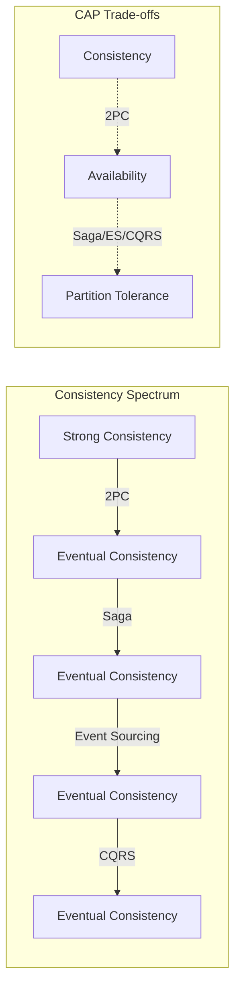
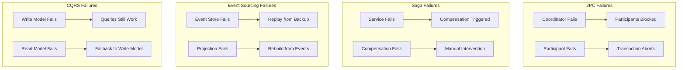
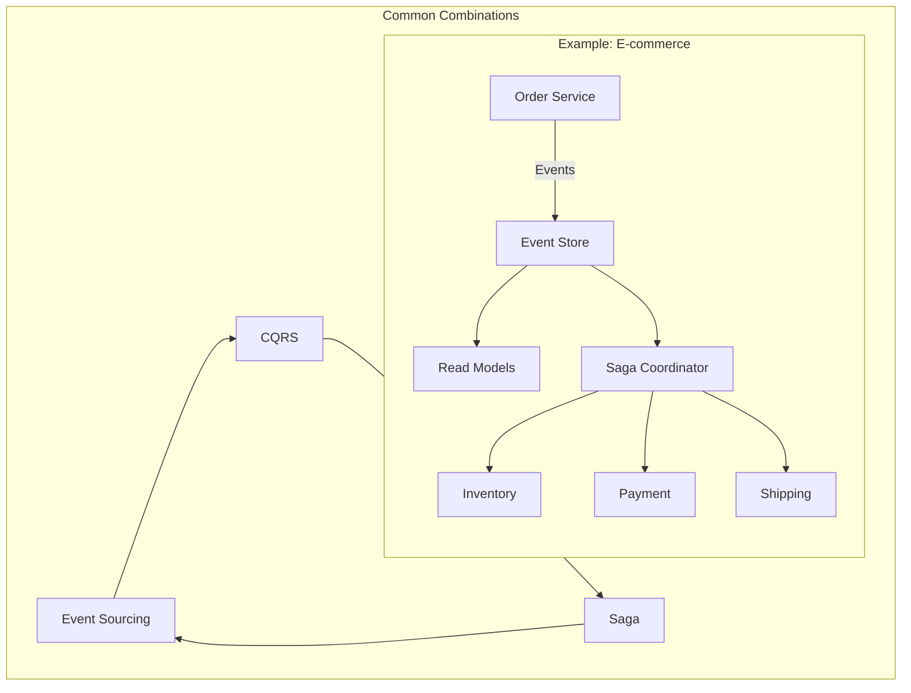

# Consistency Patterns Comparison

## Overview

Distributed consistency is one of the hardest challenges. This guide compares 2PC (Two-Phase Commit), Saga, Event Sourcing, and CQRS patterns for maintaining consistency across distributed systems.

## Quick Comparison Matrix

| Pattern | Consistency Type | Scope | Latency | Complexity | Failure Handling |
|---------|-----------------|--------|---------|------------|------------------|
| **2PC** | Strong | Transactional | High | Medium | Blocking, coordinator failure |
| **Saga** | Eventual | Cross-service | Medium | High | Compensating transactions |
| **Event Sourcing** | Eventual | Event-driven | Low | High | Event replay |
| **CQRS** | Eventual | Read/Write split | Low | Medium | Eventual consistency |

## Architectural Patterns

```mermaid
graph TB
    subgraph "Two-Phase Commit (2PC)"
        TC[Transaction Coordinator]
        TC -->|Prepare| P1[Participant 1]
        TC -->|Prepare| P2[Participant 2]
        P1 -->|Vote| TC
        P2 -->|Vote| TC
        TC -->|Commit/Abort| P1
        TC -->|Commit/Abort| P2
    end
    
    subgraph "Saga Pattern"
        S1[Service 1] -->|Event| S2[Service 2]
        S2 -->|Event| S3[Service 3]
        S3 -->|Failure| C3[Compensation 3]
        C3 -->|Compensate| C2[Compensation 2]
        C2 -->|Compensate| C1[Compensation 1]
    end
    
    subgraph "Event Sourcing"
        E1[Event 1] --> ES[Event Store]
        E2[Event 2] --> ES
        E3[Event 3] --> ES
        ES --> P[Projections]
        ES --> R[Read Models]
    end
    
    subgraph "CQRS"
        CMD[Commands] --> WM[Write Model]
        WM --> ES2[Event Store]
        ES2 --> RM[Read Model]
        Q[Queries] --> RM
    end
```



## Decision Matrix

### When to Use Each Pattern

| Scenario | Best Pattern | Why |
|----------|-------------|-----|
| Financial transactions | 2PC | Strong consistency required |
| Cross-service workflows | Saga | Long-running transactions |
| Audit requirements | Event Sourcing | Complete history needed |
| Read-heavy systems | CQRS | Optimize read/write paths |
| Microservice orchestration | Saga | Service autonomy |
| Time-travel debugging | Event Sourcing | State reconstruction |
| Complex domain logic | CQRS + Event Sourcing | Separation of concerns |

## Consistency Guarantees



## Complexity Analysis

| Pattern | Implementation | Testing | Debugging | Operations |
|---------|---------------|---------|-----------|------------|
| **2PC** | Medium | Hard | Hard | Complex |
| **Saga** | High | Very Hard | Hard | Complex |
| **Event Sourcing** | High | Medium | Easy | Medium |
| **CQRS** | Medium | Medium | Medium | Simple |

## Performance Characteristics

| Pattern | Write Latency | Read Latency | Throughput | Scalability |
|---------|--------------|--------------|------------|-------------|
| **2PC** | High (100-500ms) | Low | Low | Poor |
| **Saga** | Medium (50-200ms) | Low | Medium | Good |
| **Event Sourcing** | Low (10-50ms) | Variable | High | Excellent |
| **CQRS** | Low (10-50ms) | Very Low | Very High | Excellent |

## Implementation Examples

### Two-Phase Commit (2PC)
```yaml
Use Case: Bank transfers, inventory updates
Implementation:
  Phase 1 - Prepare:
    - Lock resources
    - Validate constraints
    - Vote yes/no
  Phase 2 - Commit:
    - Apply changes
    - Release locks
Challenges:
  - Coordinator failure
  - Participant timeouts
  - Blocking protocol
```

### Saga Pattern
```yaml
Use Case: Order processing, booking systems
Implementation:
  Choreography:
    - Event-driven
    - No central coordinator
  Orchestration:
    - Central coordinator
    - Explicit flow control
Compensation:
  - Undo operations
  - Business logic reversal
```

### Event Sourcing
```yaml
Use Case: Financial ledgers, audit systems
Implementation:
  - Append-only event log
  - Event replay for state
  - Projections for queries
Benefits:
  - Complete audit trail
  - Time travel
  - Event-driven architecture
```

### CQRS
```yaml
Use Case: Read-heavy applications, reporting
Implementation:
  - Separate write/read models
  - Async projection updates
  - Specialized query stores
Benefits:
  - Optimized read performance
  - Independent scaling
  - Simplified models
```

## Failure Scenarios



## Migration Strategies

| From | To | Strategy | Considerations |
|------|----|----------|----------------|
| 2PC | Saga | Gradual service extraction | Handle mixed consistency |
| Traditional | Event Sourcing | Event capture alongside | Dual-write temporarily |
| CRUD | CQRS | Start with read model | Sync before full split |
| Saga | Event Sourcing | Capture saga events | Maintain compensation logic |

## Hybrid Approaches



## Cost-Benefit Analysis

| Pattern | Development Cost | Operational Cost | Business Value |
|---------|-----------------|------------------|----------------|
| **2PC** | Low | High | Medium (strong consistency) |
| **Saga** | High | Medium | High (service autonomy) |
| **Event Sourcing** | High | Medium | Very High (audit, analytics) |
| **CQRS** | Medium | Low | High (performance, scalability) |

## Real-World Examples

### Financial Systems
- **2PC**: ATM transactions, fund transfers
- **Event Sourcing**: Trading systems, ledgers
- **CQRS**: Portfolio management, reporting

### E-commerce
- **Saga**: Order fulfillment, payment processing
- **CQRS**: Product catalog, inventory queries
- **Event Sourcing**: Order history, customer analytics

### Social Media
- **CQRS**: Timeline generation, feed aggregation
- **Event Sourcing**: User activity streams
- **Saga**: Content moderation workflows

## Key Takeaways

1. **Consistency is expensive**: Strong consistency limits availability and scalability
2. **Eventual consistency is often sufficient**: Most business operations can tolerate delays
3. **Combine patterns**: CQRS + Event Sourcing is a powerful combination
4. **Design for failure**: Every pattern needs explicit failure handling
5. **Consider the business domain**: Choose based on actual consistency requirements