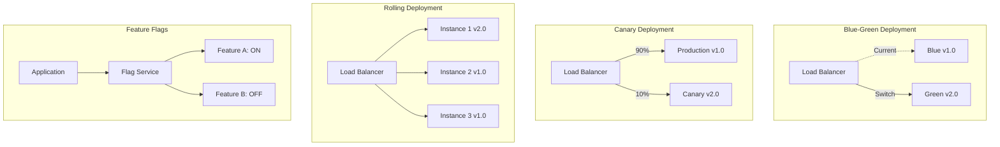
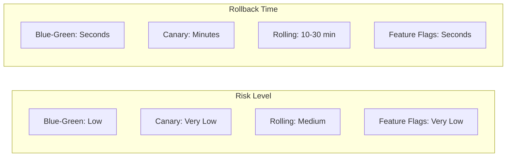
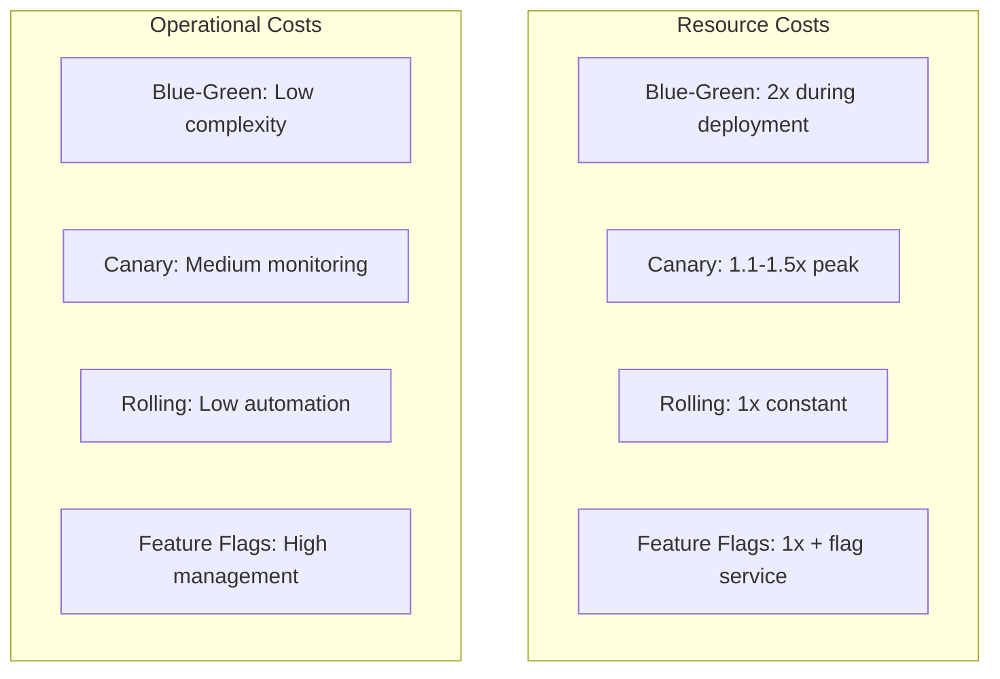

# Deployment Patterns Comparison

## Overview

Modern deployment strategies minimize risk and enable rapid iteration. This guide compares Blue-Green, Canary, Rolling, and Feature Flags deployment patterns.

## Quick Comparison Matrix

| Pattern | Risk Level | Rollback Speed | Resource Cost | Complexity | Testing Capability |
|---------|------------|----------------|---------------|------------|-------------------|
| **Blue-Green** | Low | Instant | 2x resources | Low | Full environment |
| **Canary** | Very Low | Fast | 1.1-1.5x | Medium | Gradual validation |
| **Rolling** | Medium | Slow | 1x | Low | Limited |
| **Feature Flags** | Very Low | Instant | 1x | High | A/B testing |

## Deployment Architecture



## Decision Matrix

### When to Use Each Pattern

| Scenario | Best Pattern | Why |
|----------|-------------|-----|
| Database migrations | Blue-Green | Clean cutover |
| High-risk changes | Canary | Gradual exposure |
| Continuous delivery | Rolling | Resource efficient |
| A/B testing | Feature Flags | User targeting |
| Emergency rollback | Blue-Green/Feature Flags | Instant reversion |
| Multi-region deployment | Canary | Region-by-region |
| Experimental features | Feature Flags | Easy toggle |

## Risk and Rollback Analysis



## Implementation Patterns

### Blue-Green Deployment
```yaml
Infrastructure:
  - Two identical environments
  - Load balancer switching
  - Database considerations

Process:
  1. Deploy to Green
  2. Run smoke tests
  3. Switch traffic
  4. Monitor metrics
  5. Keep Blue as backup

Advantages:
  - Zero downtime
  - Instant rollback
  - Full testing possible

Challenges:
  - Database sync
  - Double resources
  - Session handling
```

### Canary Deployment
```yaml
Infrastructure:
  - Traffic splitting capability
  - Monitoring infrastructure
  - Gradual rollout control

Process:
  1. Deploy to small subset (1-5%)
  2. Monitor error rates
  3. Gradually increase (10%, 25%, 50%)
  4. Full deployment or rollback

Advantages:
  - Risk mitigation
  - Real user validation
  - Performance comparison

Challenges:
  - Complex routing
  - Metric interpretation
  - Partial rollback complexity
```

### Rolling Deployment
```yaml
Infrastructure:
  - Multiple instances
  - Health checks
  - Load balancer updates

Process:
  1. Update one instance
  2. Health check
  3. Move to next instance
  4. Repeat until complete

Advantages:
  - No extra resources
  - Simple implementation
  - Kubernetes native

Challenges:
  - Mixed versions
  - Slow rollback
  - API compatibility
```

### Feature Flags
```yaml
Infrastructure:
  - Flag management service
  - SDK integration
  - Analytics pipeline

Process:
  1. Deploy with flag OFF
  2. Enable for test users
  3. Gradual percentage rollout
  4. Monitor and adjust

Advantages:
  - Deploy != Release
  - Instant on/off
  - User targeting

Challenges:
  - Code complexity
  - Flag debt
  - Testing matrix
```

## Detailed Implementation Examples

### Blue-Green with Kubernetes
```yaml
# Blue deployment
apiVersion: apps/v1
kind: Deployment
metadata:
  name: app-blue
  labels:
    version: blue
spec:
  replicas: 3
  selector:
    matchLabels:
      app: myapp
      version: blue
  template:
    metadata:
      labels:
        app: myapp
        version: blue
    spec:
      containers:
      - name: app
        image: myapp:1.0

---
# Service pointing to blue
apiVersion: v1
kind: Service
metadata:
  name: myapp-service
spec:
  selector:
    app: myapp
    version: blue  # Switch this to 'green' for deployment
  ports:
  - port: 80
    targetPort: 8080
```

### Canary with Istio
```yaml
# Virtual Service for traffic splitting
apiVersion: networking.istio.io/v1beta1
kind: VirtualService
metadata:
  name: myapp
spec:
  hosts:
  - myapp
  http:
  - match:
    - headers:
        canary:
          exact: "true"
    route:
    - destination:
        host: myapp
        subset: v2
  - route:
    - destination:
        host: myapp
        subset: v1
      weight: 90
    - destination:
        host: myapp
        subset: v2
      weight: 10
```

### Feature Flags Implementation
```javascript
// Feature flag service
class FeatureFlags {
  constructor() {
    this.flags = new Map();
    this.userOverrides = new Map();
  }
  
  async isEnabled(flagName, userId, attributes = {}) {
    // Check user overrides
    const override = this.userOverrides.get(`${userId}:${flagName}`);
    if (override !== undefined) return override;
    
    // Get flag configuration
    const flag = await this.getFlag(flagName);
    if (!flag) return false;
    
    // Check rollout percentage
    if (flag.rolloutPercentage < 100) {
      const hash = this.hash(userId + flagName);
      if (hash % 100 >= flag.rolloutPercentage) {
        return false;
      }
    }
    
    // Check targeting rules
    if (flag.rules) {
      for (const rule of flag.rules) {
        if (this.evaluateRule(rule, attributes)) {
          return rule.enabled;
        }
      }
    }
    
    return flag.enabled;
  }
}

// Usage in application
async function getHomepage(userId) {
  const flags = new FeatureFlags();
  
  if (await flags.isEnabled('new-homepage-design', userId)) {
    return renderNewHomepage();
  } else {
    return renderOldHomepage();
  }
}
```

## Monitoring and Metrics

| Metric | Blue-Green | Canary | Rolling | Feature Flags |
|--------|------------|--------|---------|---------------|
| Error Rate | Compare environments | Compare versions | Monitor during roll | Per-flag metrics |
| Latency | Before/after switch | Canary vs stable | Instance variation | Flag evaluation time |
| Success Rate | Environment-wide | Gradual validation | Per-instance | Feature-specific |
| Resource Usage | 2x during deploy | Slight increase | Normal | Minimal overhead |

## Cost Comparison



## Hybrid Strategies

### Canary with Feature Flags
```python
def deploy_with_canary_flags():
    # Deploy new version to canary
    deploy_to_canary()
    
    # Enable feature for canary users only
    feature_flags.create_rule(
        'new-feature',
        targeting_rule={
            'environment': 'canary',
            'percentage': 100
        }
    )
    
    # Gradually increase traffic to canary
    for percentage in [5, 10, 25, 50, 100]:
        update_canary_traffic(percentage)
        
        # Monitor metrics
        if not metrics_healthy():
            rollback_canary()
            return False
        
        time.sleep(300)  # 5 minutes between increases
    
    # Enable feature in production
    feature_flags.update_rule(
        'new-feature',
        targeting_rule={
            'environment': 'production',
            'percentage': 100
        }
    )
```

### Blue-Green with Database Migration
```sql
-- Version 1.0 (Blue) - Add nullable column
ALTER TABLE users ADD COLUMN preferences JSONB;

-- Version 2.0 (Green) - Start using new column
-- Application writes to both old and new columns

-- Version 3.0 (Next Blue) - Migration complete
ALTER TABLE users DROP COLUMN old_preferences;
```

## Common Pitfalls and Solutions

| Problem | Impact | Solution |
|---------|--------|----------|
| **Database schema changes** | Blue-Green complexity | Use expand-contract pattern |
| **Session affinity** | User experience issues | Shared session store |
| **Feature flag sprawl** | Technical debt | Regular cleanup process |
| **Canary metric noise** | False positives | Statistical significance |
| **Rolling deployment failures** | Partial outage | Circuit breakers |

## Advanced Patterns

### Progressive Delivery
```yaml
Stage 1 - Internal Testing:
  - Deploy to staging
  - Feature flags for employees
  - Full regression testing

Stage 2 - Beta Users:
  - Canary deployment (5%)
  - Feature flags for beta group
  - Monitor feedback

Stage 3 - Gradual Rollout:
  - Increase canary (25%, 50%)
  - Regional rollout
  - A/B testing

Stage 4 - General Availability:
  - Blue-green switch
  - Remove feature flags
  - Documentation update
```

### Multi-Region Deployment
```python
async def multi_region_canary():
    regions = ['us-east', 'us-west', 'eu-west', 'ap-south']
    
    for region in regions:
        # Deploy canary to region
        await deploy_canary(region, percentage=10)
        
        # Monitor region-specific metrics
        await monitor_region(region, duration=3600)
        
        if metrics_healthy(region):
            await increase_canary(region, percentage=100)
        else:
            await rollback_region(region)
            raise DeploymentError(f"Failed in {region}")
```

## Decision Framework

### Choose Blue-Green When:
- Database migrations required
- Clean cutover needed
- Testing full environment
- Resource cost acceptable

### Choose Canary When:
- High-risk changes
- Need gradual validation
- Performance comparison required
- User impact must be minimized

### Choose Rolling When:
- Resource constrained
- Simple applications
- Kubernetes environment
- Stateless services

### Choose Feature Flags When:
- A/B testing needed
- Experimental features
- User-specific rollouts
- Instant rollback critical

## Key Takeaways

1. **Risk mitigation is paramount**: Choose pattern based on change risk
2. **Combine strategies**: Use feature flags with any deployment pattern
3. **Monitor everything**: Metrics determine deployment success
4. **Automate rollbacks**: Fast recovery requires automation
5. **Test in production**: Safe production testing enables innovation